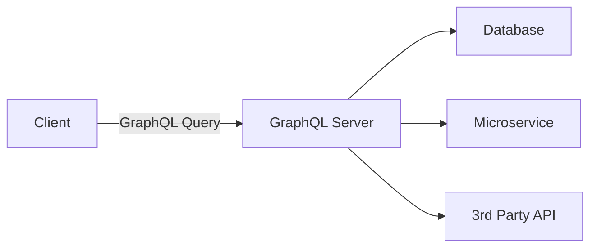
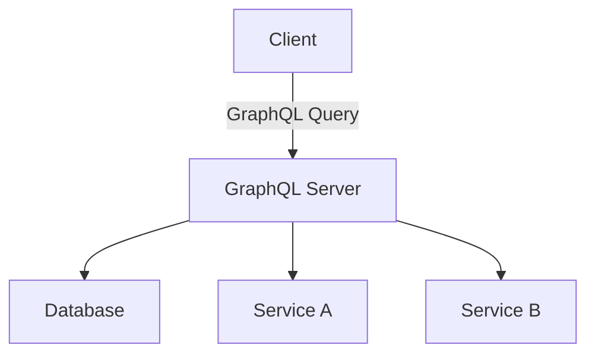
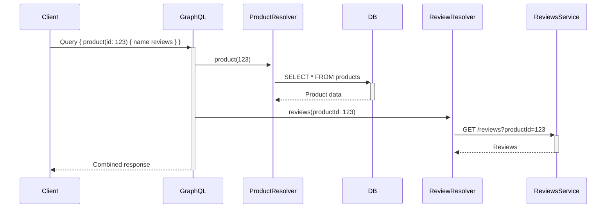

# **GraphQL API – The Complete Interview Guide** 🚀

This ultimate guide covers everything you need to know about GraphQL for technical interviews, from fundamental concepts to advanced patterns, complete with Java implementations, industry case studies, and visual explanations.

---

## **Table of Contents** 📑
1. [What is GraphQL?](#1-what-is-graphql)
2. [Core Concepts](#2-core-concepts)
3. [GraphQL vs REST](#3-graphql-vs-rest)
4. [Schema Design](#4-schema-design)
5. [Performance Optimization](#5-performance-optimization)
6. [Java Implementation](#6-java-implementation)
7. [Advanced Patterns](#7-advanced-patterns)
8. [Industry Best Practices](#8-industry-best-practices)
9. [When NOT to Use GraphQL](#9-when-not-to-use-graphql)
10. [Security Considerations](#10-security-considerations)
11. [Technology Stack](#11-technology-stack)
12. [Visual Diagrams](#12-visual-diagrams)
13. [Comparison Tables](#13-comparison-tables)
14. [Interview Cheat Sheet](#14-interview-cheat-sheet)

---

## **1. What is GraphQL?** 🏗️

**GraphQL** is a query language for APIs and a runtime for fulfilling those queries with your existing data, developed by Facebook in 2012 and open-sourced in 2015.



**Key Characteristics:**
- Declarative data fetching
- Single endpoint
- Strongly typed
- Client-driven queries
- Real-time capabilities

---

## **2. Core Concepts** 🧠

### **1. Schema Definition Language (SDL)**
```graphql
type Product {
  id: ID!
  name: String!
  price: Float!
  reviews: [Review!]!
}

type Review {
  id: ID!
  rating: Int!
  comment: String
}

type Query {
  products(category: String): [Product!]!
  product(id: ID!): Product
}
```

### **2. Query Language**
```graphql
query GetProductWithReviews($productId: ID!) {
  product(id: $productId) {
    name
    price
    reviews {
      rating
      comment
    }
  }
}
```

### **3. Resolver Functions**
```java
public class ProductResolver implements GraphQLQueryResolver {
    public List<Product> products(String category) {
        return productService.findByCategory(category);
    }
}
```

### **4. Mutations**
```graphql
mutation CreateProduct {
  createProduct(input: {
    name: "New Widget",
    price: 19.99
  }) {
    id
    name
  }
}
```

---

## **3. GraphQL vs REST** ⚖️

| Feature | GraphQL | REST |
|---------|---------|------|
| **Endpoints** | Single endpoint | Multiple endpoints |
| **Data Fetching** | Client-specified | Server-determined |
| **Over/Under Fetching** | Eliminated | Common issue |
| **Versioning** | Not typically needed | Required |
| **Caching** | More complex | HTTP caching built-in |
| **Performance** | Flexible | Predictable |
| **Learning Curve** | Steeper | More familiar |

**Industry Adoption:**
- **Facebook** (Inventor)
- **GitHub** (API v4)
- **Shopify** (Storefront API)
- **Netflix** (Internal APIs)
- **PayPal** (Checkout)

---

## **4. Schema Design** 📐

### **Best Practices**
1. **Use descriptive, consistent naming**
   ```graphql
   type Customer { ... }  # Good
   type Cust { ... }      # Avoid
   ```

2. **NonNull (!) for required fields**
   ```graphql
   type Product {
     id: ID!
     name: String!
   }
   ```

3. **Pagination pattern**
   ```graphql
   type ProductConnection {
     edges: [ProductEdge!]!
     pageInfo: PageInfo!
   }
   ```

4. **Input types for mutations**
   ```graphql
   input CreateProductInput {
     name: String!
     price: Float!
   }
   ```

---

## **5. Performance Optimization** ⚡

### **1. Dataloader Pattern (N+1 Problem)**
```java
public class ProductDataLoader {
    private final ProductService productService;
    
    public DataLoader<Long, Product> createLoader() {
        return DataLoader.newDataLoader(productIds -> 
            CompletableFuture.supplyAsync(() -> 
                productService.batchLoad(productIds)
            )
        );
    }
}
```

### **2. Query Depth Limiting**
```java
@Bean
public GraphQLServletConfiguration graphQLServletConfiguration() {
    return GraphQLServletConfiguration.with(
        new QueryDepthInstrumentation(10)  // Max depth 10
    );
}
```

### **3. Caching Strategies**
- **Persisted Queries**
- **Response Cache**
- **Dataloader Cache**

---

## **6. Java Implementation** ☕

### **Spring Boot GraphQL Server**
```java
@Configuration
public class GraphQLConfig {

    @Bean
    public GraphQLSchema schema() {
        return SchemaParser.newParser()
            .file("schema.graphqls")
            .resolvers(new ProductResolver(), new ReviewResolver())
            .build()
            .makeExecutableSchema();
    }
}

@Component
public class ProductResolver implements GraphQLQueryResolver {
    
    @Autowired
    private ProductService productService;
    
    public Product product(Long id) {
        return productService.findById(id);
    }
}
```

### **Client Query (Java)**
```java
GraphQLResponse response = GraphQLTemplate.newRequest()
    .url("http://api.example.com/graphql")
    .query("""
        query GetProduct($id: ID!) {
          product(id: $id) {
            name
            price
          }
        }
        """)
    .variables(Map.of("id", 123))
    .execute();
```

---

## **7. Advanced Patterns** 🔍

### **1. Federation (Microservices)**
```graphql
# Products Service
type Product @key(fields: "id") {
  id: ID!
  name: String!
}

# Reviews Service
extend type Product @key(fields: "id") {
  id: ID! @external
  reviews: [Review!]!
}
```

### **2. Subscriptions (Real-time)**
```graphql
type Subscription {
  productUpdated(id: ID!): Product!
}
```

### **3. Schema Stitching**
```java
SchemaParser.newParser()
    .schemaString(productsSchema)
    .schemaString(reviewsSchema)
    .stitch()
    .build();
```

---

## **8. Industry Best Practices** 💡

1. **Version through evolution, not endpoints**
2. **Document with GraphiQL/Playground**
3. **Monitor query complexity**
4. **Implement query whitelisting for production**
5. **Use persisted queries in mobile apps**

**GitHub's Approach:**
- Single GraphQL endpoint
- Rate limiting by node count
- Extensive introspection
- Detailed error messages

---

## **9. When NOT to Use GraphQL** ❌

| Scenario | Reason | Alternative |
|----------|--------|-------------|
| Simple CRUD apps | Overengineering | REST |
| File uploads | Not ideal | REST + presigned URLs |
| Internal microservices | Complexity cost | gRPC |
| High-performance binary | Text-based protocol | gRPC |

---

## **10. Security Considerations** 🔒

1. **Authentication**  
   JWT, OAuth

2. **Authorization**  
   Field-level permissions

3. **Query Complexity**  
   Prevent expensive queries

4. **Introspection**  
   Disable in production

5. **Injection**  
   Validate input types

---

## **11. Technology Stack** ⚡

| Component | Java Options |
|-----------|--------------|
| **Server** | graphql-java, Spring GraphQL |
| **Client** | Apollo Android, GraphQL Java Client |
| **Tools** | GraphiQL, Altair |
| **Monitoring** | Apollo Engine, GraphQL Inspector |

---

## **12. Visual Diagrams** 📊

### **GraphQL Architecture**


### **Resolver Flow**


---

## **13. Comparison Tables** 📋

### **GraphQL vs REST vs gRPC**
| Feature | GraphQL | REST | gRPC |
|---------|---------|------|------|
| **Protocol** | HTTP | HTTP | HTTP/2 |
| **Data Format** | JSON | JSON/XML | Binary |
| **Flexibility** | High | Low | Medium |
| **Performance** | Good | Good | Excellent |
| **Caching** | Custom | Built-in | Hard |

### **GraphQL Server Libraries**
| Library | Language | Features |
|---------|----------|----------|
| graphql-java | Java | Comprehensive, Spring integration |
| Apollo Server | JS | Production-ready, federation |
| Sangria | Scala | Type-safe, reactive |
| Juniper | Rust | Performance-focused |

---

## **14. Interview Cheat Sheet** 🎯

**Key Points to Remember:**
1. GraphQL solves over/under-fetching
2. Single endpoint with typed schema
3. Resolvers fetch data from multiple sources
4. Dataloader solves N+1 problem
5. Federation for microservices

**Common Interview Questions:**
1. How would you implement pagination in GraphQL?
2. Explain the N+1 problem and solutions
3. How does GraphQL handle caching differently than REST?
4. When would you choose REST over GraphQL?
5. How do you secure a GraphQL API?

**"GraphQL gives clients the power to ask for exactly what they need, making it possible to evolve APIs without versioning."** - Lee Byron (GraphQL Co-Creator)
