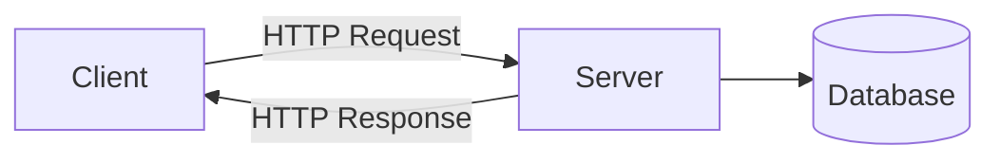
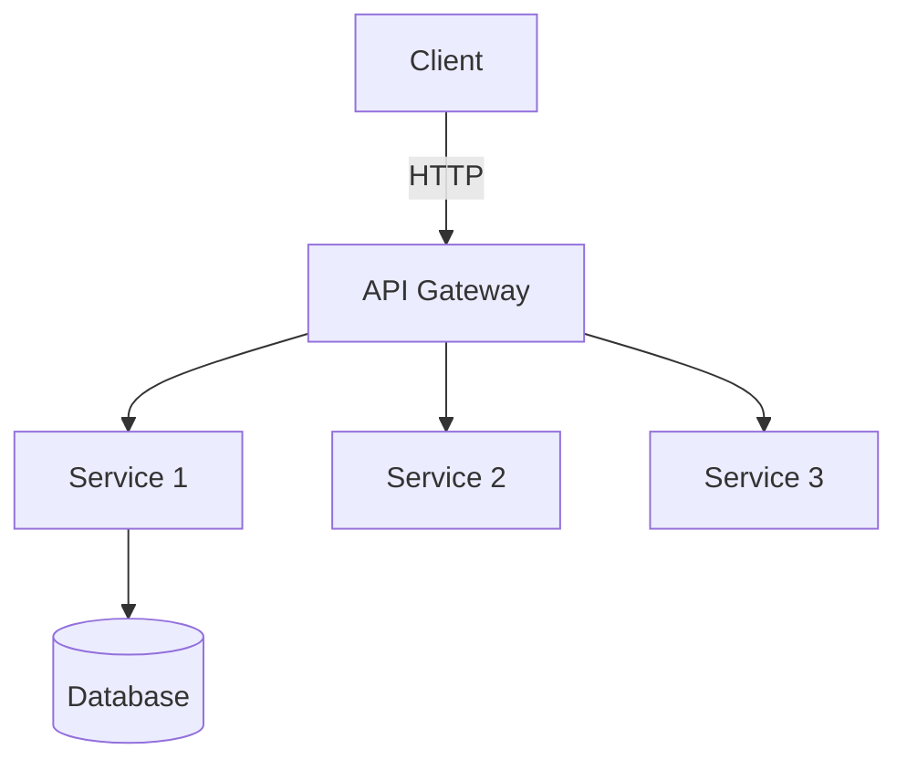
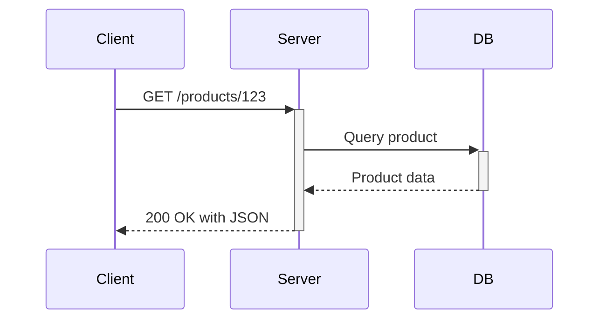

# **RESTful API Design – The Complete Interview Guide** 🚀

This comprehensive guide covers everything you need to know about RESTful APIs for technical interviews, from fundamental principles to advanced industry practices, complete with Java examples, visual diagrams, and real-world case studies.

---

## **Table of Contents** 📑
1. [What is REST?](#1-what-is-rest)
2. [Core Principles](#2-core-principles)
3. [HTTP Methods & Status Codes](#3-http-methods--status-codes)
4. [Resource Naming Best Practices](#4-resource-naming-best-practices)
5. [Request/Response Design](#5-requestresponse-design)
6. [Advanced Concepts](#6-advanced-concepts)
7. [Java Implementation](#7-java-implementation)
8. [Industry Best Practices](#8-industry-best-practices)
9. [Performance Optimization](#9-performance-optimization)
10. [Security Considerations](#10-security-considerations)
11. [When NOT to Use REST](#11-when-not-to-use-rest)
12. [Comparison with Alternatives](#12-comparison-with-alternatives)
13. [Visual Diagrams](#13-visual-diagrams)
14. [Summary Cheat Sheet](#14-summary-cheat-sheet)

---

## **1. What is REST?** 🏗️

**REST (Representational State Transfer)** is an architectural style for designing networked applications that relies on stateless, client-server communication using HTTP.



**Key Characteristics:**
- Stateless
- Cacheable
- Client-Server separation
- Uniform interface
- Layered system

---

## **2. Core Principles** 🧠

### **1. Resource-Based**
Everything is a resource identified by URIs:
```
/users
/users/123
/users/123/orders
```

### **2. Representations**
Resources can have multiple representations:
```http
GET /users/123
Accept: application/json

GET /users/123
Accept: application/xml
```

### **3. Stateless**
Each request contains all necessary context:
```http
GET /orders
Authorization: Bearer xyz123
```

### **4. HATEOAS (Hypermedia as the Engine of Application State)**
```json
{
  "order": {
    "id": 123,
    "links": [
      { "rel": "self", "href": "/orders/123" },
      { "rel": "payment", "href": "/orders/123/payment" }
    ]
  }
}
```

---

## **3. HTTP Methods & Status Codes** 🔢

| Method | Idempotent | Safe | Typical Use |
|--------|-----------|------|-------------|
| GET | Yes | Yes | Retrieve resource |
| POST | No | No | Create resource |
| PUT | Yes | No | Full update |
| PATCH | No | No | Partial update |
| DELETE | Yes | No | Remove resource |

**Essential Status Codes:**
- 200 OK
- 201 Created
- 204 No Content
- 400 Bad Request
- 401 Unauthorized
- 403 Forbidden
- 404 Not Found
- 429 Too Many Requests
- 500 Internal Server Error

---

## **4. Resource Naming Best Practices** 📛

**DO:**
```
GET /users/123/orders?status=shipped
POST /invoices
PUT /products/456
```

**DON'T:**
```
GET /getUserById
POST /createInvoice
GET /users/123/getOrders
```

**Industry Examples:**
- GitHub API: `/repos/{owner}/{repo}/issues`
- Twitter API: `/2/users/{id}/tweets`
- Stripe API: `/v1/charges`

---

## **5. Request/Response Design** ✉️

### **Request Headers**
```http
GET /products HTTP/1.1
Host: api.example.com
Accept: application/json
Authorization: Bearer xyz123
Cache-Control: no-cache
```

### **Response Example**
```http
HTTP/1.1 200 OK
Content-Type: application/json
ETag: "33a64df5"
Cache-Control: max-age=3600

{
  "id": 123,
  "name": "Widget",
  "price": 9.99,
  "links": [
    { "rel": "self", "href": "/products/123" }
  ]
}
```

---

## **6. Advanced Concepts** 🔍

### **1. Pagination**
```json
{
  "data": [...],
  "pagination": {
    "total": 100,
    "limit": 10,
    "offset": 20,
    "next": "/products?limit=10&offset=30"
  }
}
```

### **2. Rate Limiting**
```http
HTTP/1.1 429 Too Many Requests
Retry-After: 60
X-RateLimit-Limit: 1000
X-RateLimit-Remaining: 0
```

### **3. Versioning**
Approaches:
- URI Path: `/v1/products`
- Header: `Accept: application/vnd.example.v1+json`
- Query Param: `/products?version=1`

---

## **7. Java Implementation** ☕

### **Spring Boot Controller**
```java
@RestController
@RequestMapping("/api/v1/products")
public class ProductController {

    @GetMapping
    public ResponseEntity<Page<ProductDTO>> getProducts(
            @RequestParam(defaultValue = "0") int page,
            @RequestParam(defaultValue = "10") int size) {
        Page<ProductDTO> products = productService.findAll(page, size);
        return ResponseEntity.ok()
                .header("X-Total-Count", String.valueOf(products.getTotalElements()))
                .body(products);
    }

    @GetMapping("/{id}")
    public ResponseEntity<ProductDTO> getProduct(@PathVariable Long id) {
        return productService.findById(id)
                .map(ResponseEntity::ok)
                .orElse(ResponseEntity.notFound().build());
    }

    @PostMapping
    public ResponseEntity<ProductDTO> createProduct(
            @Valid @RequestBody ProductDTO product,
            UriComponentsBuilder ucb) {
        ProductDTO saved = productService.save(product);
        URI location = ucb.path("/products/{id}").build(saved.id());
        return ResponseEntity.created(location).body(saved);
    }
}
```

### **DTO with HATEOAS**
```java
public class ProductDTO {
    private Long id;
    private String name;
    private BigDecimal price;
    private List<Link> links;
    
    // Standard getters/setters
    
    public static class Link {
        private String rel;
        private String href;
        // Getters/setters
    }
}
```

---

## **8. Industry Best Practices** 💡

1. **Use Nouns, Not Verbs**  
   `/orders` not `/getOrders`

2. **Plural Resource Names**  
   `/products` not `/product`

3. **Filter/Sort/Paginate via Query Params**  
   `/products?category=books&sort=-price`

4. **Proper Error Handling**
   ```json
   {
     "error": {
       "code": "invalid_quantity",
       "message": "Quantity must be positive",
       "details": { "min_value": 1 }
     }
   }
   ```

5. **API Documentation**  
   Use OpenAPI/Swagger

---

## **9. Performance Optimization** ⚡

| Technique | Benefit | Implementation |
|-----------|---------|----------------|
| Caching | Reduce server load | `Cache-Control`, ETags |
| Compression | Smaller payloads | `Content-Encoding: gzip` |
| Field Filtering | Reduce data transfer | `/users?fields=name,email` |
| Connection Pooling | Reduce TCP overhead | HTTP/2, Keep-Alive |
| CDN | Geographic distribution | Cloudflare, Akamai |

---

## **10. Security Considerations** 🔒

1. **Authentication**  
   OAuth2, JWT

2. **HTTPS Everywhere**  
   TLS 1.2+

3. **Input Validation**  
   Prevent injection attacks

4. **Rate Limiting**  
   Prevent abuse

5. **CORS**  
   Proper origin restrictions

---

## **11. When NOT to Use REST** ❌

| Scenario | Better Alternative |
|----------|--------------------|
| Real-time updates | WebSockets, gRPC |
| High-performance binary data | gRPC |
| Complex operations | GraphQL |
| Internal microservices | gRPC |

---

## **12. Comparison with Alternatives** ⚖️

| Feature | REST | GraphQL | gRPC |
|---------|------|---------|------|
| Protocol | HTTP | HTTP | HTTP/2 |
| Payload | JSON/XML | JSON | Binary |
| Query Flexibility | Limited | High | Medium |
| Performance | Good | Variable | Excellent |
| Caching | Built-in | Custom | Harder |

---

## **13. Visual Diagrams** 📊

### **REST Architecture**


### **Request Flow**


---

## **14. Summary Cheat Sheet** 📋

| Concept | Key Point |
|---------|-----------|
| **Base URL** | `https://api.example.com/v1` |
| **Resources** | Nouns, plural (`/products`) |
| **Methods** | GET, POST, PUT, DELETE |
| **Status Codes** | Proper HTTP semantics |
| **Versioning** | URI path or headers |
| **Auth** | OAuth2 + JWT |
| **Docs** | OpenAPI/Swagger |

---

## **Final Thoughts** 🎯

**Interview Tips:**
1. Be prepared to design an API on the whiteboard
2. Discuss tradeoffs between REST and alternatives
3. Explain real-world API versioning strategies
4. Demonstrate security awareness

**"REST is not a protocol or standard - it's an architectural style that leverages the web's existing infrastructure."** - Roy Fielding
