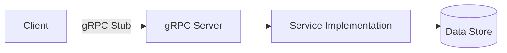
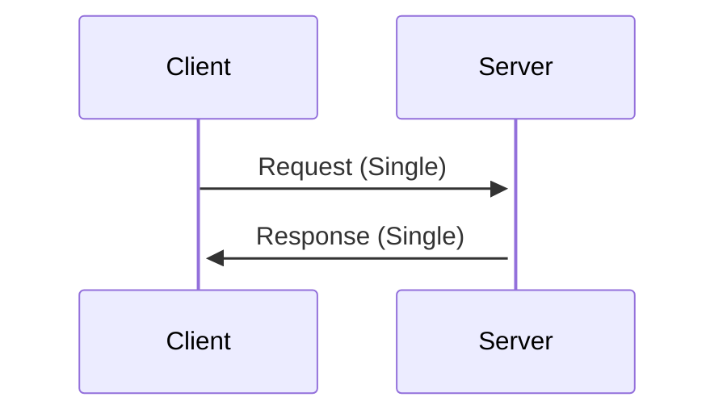
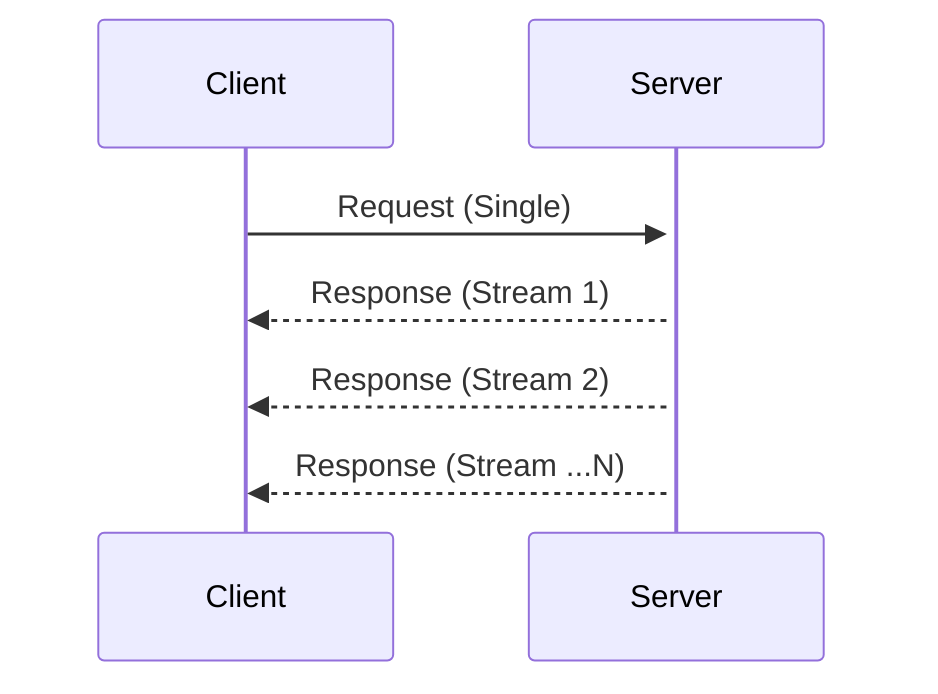
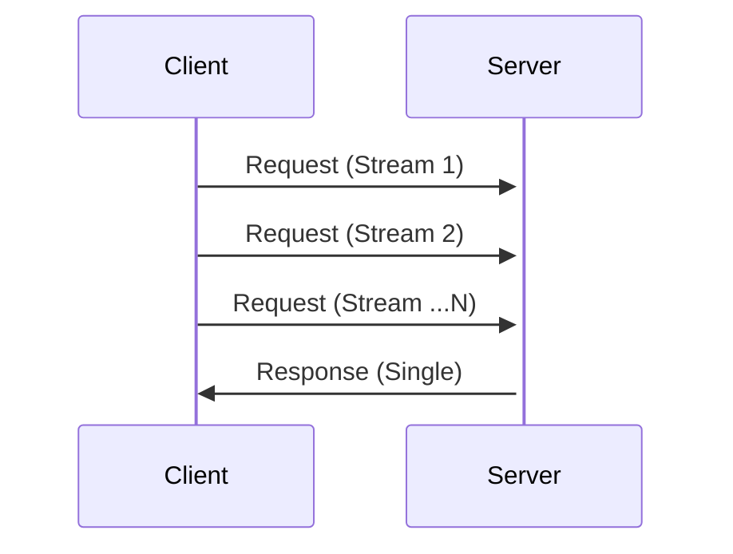
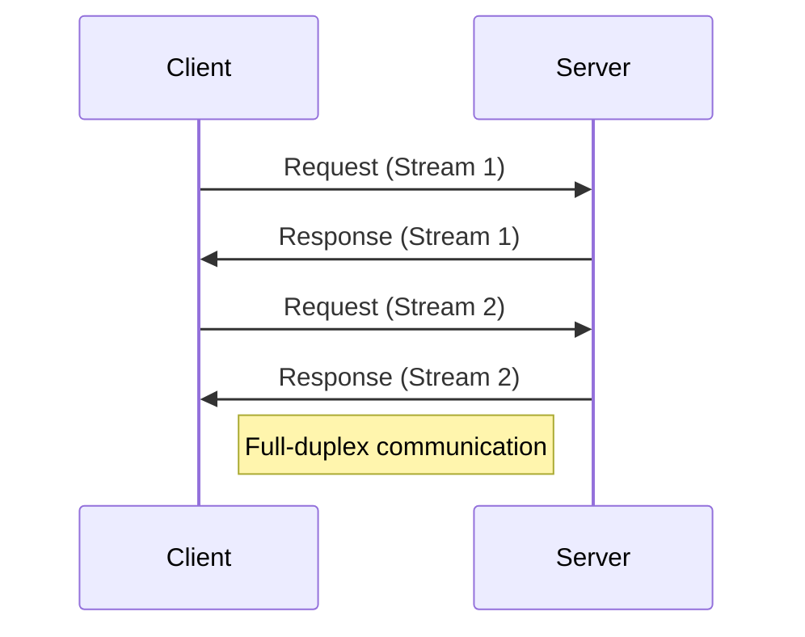
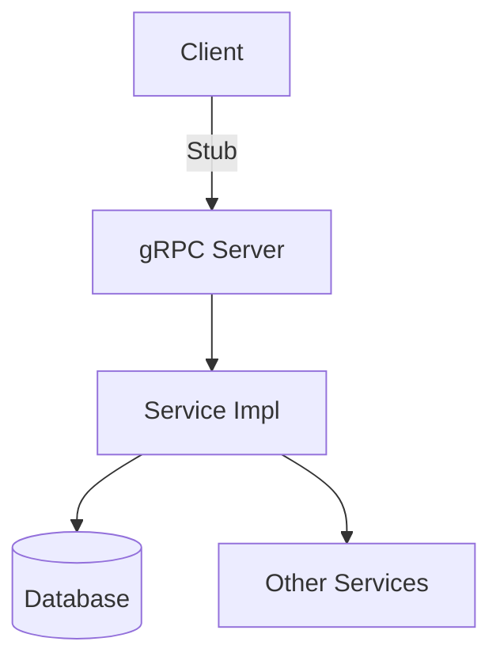
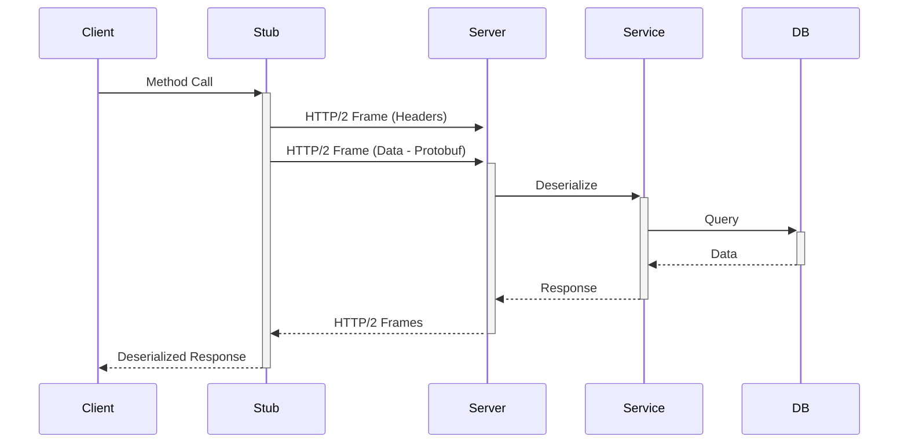

# **gRPC API – The Complete Interview Guide** 🚀

This comprehensive guide covers everything you need to know about gRPC for technical interviews, from fundamental concepts to advanced patterns, complete with Java implementations, industry case studies, and visual explanations.

---

## **Table of Contents** 📑
1. [What is gRPC?](#1-what-is-grpc)
2. [Core Architecture](#2-core-architecture)
3. [Protocol Buffers Deep Dive](#3-protocol-buffers-deep-dive)
4. [gRPC vs REST vs GraphQL](#4-grpc-vs-rest-vs-graphql)
5. [Java Implementation](#5-java-implementation)
6. [Advanced Patterns](#6-advanced-patterns)
7. [Performance Optimization](#7-performance-optimization)
8. [Industry Best Practices](#8-industry-best-practices)
9. [When NOT to Use gRPC](#9-when-not-to-use-grpc)
10. [Security Considerations](#10-security-considerations)
11. [Technology Ecosystem](#11-technology-ecosystem)
12. [Visual Diagrams](#12-visual-diagrams)
13. [Comparison Tables](#13-comparison-tables)
14. [Interview Cheat Sheet](#14-interview-cheat-sheet)

---

## **1. What is gRPC?** 🏗️

**gRPC** (gRPC Remote Procedure Calls) is a modern, high-performance RPC framework developed by Google that can run in any environment. It uses **HTTP/2** for transport and **Protocol Buffers** as its interface definition language.



**Key Characteristics:**
- **Language-neutral** (Works across 11+ languages)
- **Binary protocol** (Extremely efficient)
- **Streaming support** (Multiple streaming patterns)
- **Pluggable auth/load balancing**

---

## **2. Core Architecture** 🧠

### **1. Protocol Buffers (proto files)**
```protobuf
syntax = "proto3";

service ProductService {
  rpc GetProduct (ProductRequest) returns (ProductResponse);
}

message ProductRequest {
  string product_id = 1;
}

message ProductResponse {
  string id = 1;
  string name = 2;
  double price = 3;
}
```

### **2. Communication Patterns**
| Pattern | Description | Use Case |
|---------|-------------|----------|
| **Unary** | Simple request-response | Traditional RPC |
| **Server Streaming** | Client request, server stream | Real-time updates |
| **Client Streaming** | Client stream, server response | Upload processing |
| **Bidirectional Streaming** | Both sides stream | Chat systems |

Here's a detailed explanation of gRPC communication patterns with diagrams and real-world industry examples:

---

### **gRPC Communication Patterns Explained**

#### **1. Unary RPC (Request-Response)**


**Industry Example**:  
**Google Maps API**
- Client sends a single request for directions
- Server returns a single response with route data

**Java Proto Definition**:
```protobuf
rpc GetDirections (DirectionsRequest) returns (DirectionsResponse);
```

---

#### **2. Server Streaming RPC**


**Industry Example**:  
**Netflix Video Streaming**
- Client requests a movie (single request)
- Server streams video chunks sequentially

**Java Implementation**:
```java
rpc StreamMovie (MovieRequest) returns (stream VideoChunk);
```

---

#### **3. Client Streaming RPC**


**Industry Example**:  
**Dropbox File Upload**
- Client streams file chunks
- Server processes and responds with upload status

**Proto Definition**:
```protobuf
rpc UploadFile (stream FileChunk) returns (UploadStatus);
```

---

#### **4. Bidirectional Streaming RPC**


**Industry Example**:  
**Zoom/Google Meet**
- Both client and server continuously stream:  
  ▶ Client: Video frames + audio  
  ▶ Server: Other participants' streams

**Java Service**:
```java
rpc VideoCall (stream VideoFrame) returns (stream VideoFrame);
```

---

### **Comparison Table with Real-World Cases**
| Pattern | HTTP/2 Feature | Latency | Example | Tech Stack Used |
|---------|---------------|---------|---------|-----------------|
| **Unary** | Single request/response | Medium | Payment processing | Stripe, PayPal |
| **Server Stream** | Server push | Low | Stock price updates | Robinhood, Bloomberg |
| **Client Stream** | Client streaming | Medium-High | IoT sensor data | Tesla, Nest |
| **Bidirectional** | Full-duplex | Ultra-low | Multiplayer games | Riot Games, PUBG |

---

### **Key Technical Insights**
1. **HTTP/2 Multiplexing** enables multiple streams over one TCP connection
   ```java
   // Java client with HTTP/2 multiplexing
   ManagedChannel channel = ManagedChannelBuilder.forAddress("service", 443)
       .maxInboundMessageSize(100_000_000)
       .keepAliveWithoutCalls(true)
       .build();
   ```

2. **Backpressure Handling** in streams:
   ```java
   // Server-side flow control
   @Override
   public StreamObserver<Data> bidirectionalStream(
       StreamObserver<Data> responseObserver) {
       return new StreamObserver<>() {
           @Override
           public void onNext(Data data) {
               // Process only when client is ready
               if (responseObserver.isReady()) {
                   responseObserver.onNext(process(data));
               }
           }
       };
   }
   ```

3. **Industry Optimization**:
    - **Uber** uses bidirectional streaming for real-time driver tracking
    - **Spotify** combines server streaming with delta updates for playlists

---

### **3. HTTP/2 Benefits**
- **Multiplexing** (Multiple streams over one connection)
- **Header compression** (HPACK)
- **Binary framing layer**
- **Server push capability**

---

## **3. Protocol Buffers Deep Dive** 🔍

### **Message Definition**
```protobuf
message User {
  string id = 1;                  // Field number (1-15 use 1 byte)
  string email = 2;               // Required field
  optional string phone = 3;      // Optional field (proto3)
  repeated Address addresses = 4; // List of messages
  map<string, string> metadata = 5;
  oneof payment_method {          // Union type
    CreditCard card = 6;
    PayPal paypal = 7;
  }
}
```

### **Scalar Value Types**
| Type | Description | Java Equivalent |
|------|-------------|-----------------|
| double | 64-bit float | double |
| float | 32-bit float | float |
| int32 | Variable-length | int |
| int64 | Variable-length | long |
| bool | Boolean | boolean |
| string | UTF-8 | String |
| bytes | Arbitrary data | ByteString |

---

## **4. gRPC vs REST vs GraphQL** ⚖️

| Feature | gRPC | REST | GraphQL |
|---------|------|-------|---------|
| **Protocol** | HTTP/2 | HTTP/1.1 | HTTP |
| **Payload** | Binary (Protobuf) | Text (JSON/XML) | Text (JSON) |
| **Performance** | ⭐⭐⭐⭐⭐ | ⭐⭐ | ⭐⭐⭐ |
| **Streaming** | Full support | Limited | Subscriptions |
| **Browser Support** | Limited (grpc-web) | Excellent | Excellent |
| **Schema** | Strict (proto) | Loose | Strong (SDL) |

**Industry Adoption:**
- **Google** (Internal systems)
- **Netflix** (Inter-service communication)
- **Square** (Mobile APIs)
- **Cisco** (Network devices)
- **Spotify** (Real-time features)

---

## **5. Java Implementation** ☕

### **1. Maven Dependencies**
```xml
<dependency>
  <groupId>io.grpc</groupId>
  <artifactId>grpc-netty</artifactId>
  <version>1.45.0</version>
</dependency>
<dependency>
  <groupId>com.google.protobuf</groupId>
  <artifactId>protobuf-java</artifactId>
  <version>3.19.4</version>
</dependency>
```

### **2. Service Implementation**
```java
public class ProductServiceImpl extends ProductServiceGrpc.ProductServiceImplBase {
  @Override
  public void getProduct(ProductRequest request, 
                        StreamObserver<ProductResponse> responseObserver) {
    Product product = productRepository.findById(request.getProductId());
    
    ProductResponse response = ProductResponse.newBuilder()
        .setId(product.getId())
        .setName(product.getName())
        .setPrice(product.getPrice())
        .build();
    
    responseObserver.onNext(response);
    responseObserver.onCompleted();
  }
}
```

### **3. Server Setup**
```java
public class GrpcServer {
  public static void main(String[] args) throws Exception {
    Server server = ServerBuilder.forPort(8080)
        .addService(new ProductServiceImpl())
        .build()
        .start();
    
    Runtime.getRuntime().addShutdownHook(new Thread(server::shutdown));
    server.awaitTermination();
  }
}
```

### **4. Client Implementation**
```java
public class ProductClient {
  public static void main(String[] args) {
    ManagedChannel channel = ManagedChannelBuilder.forAddress("localhost", 8080)
        .usePlaintext() // Only for development!
        .build();
    
    ProductServiceGrpc.ProductServiceBlockingStub stub = 
        ProductServiceGrpc.newBlockingStub(channel);
    
    ProductResponse response = stub.getProduct(
        ProductRequest.newBuilder().setProductId("123").build());
    
    System.out.println("Product: " + response.getName());
    channel.shutdown();
  }
}
```

---

## **6. Advanced Patterns** 🔥

### **1. Bidirectional Streaming**
```java
// Service
public StreamObserver<ChatMessage> chat(
    StreamObserver<ChatMessage> responseObserver) {
  return new StreamObserver<>() {
    public void onNext(ChatMessage message) {
      // Process and respond
      responseObserver.onNext(processMessage(message));
    }
    // ... onError, onCompleted
  };
}

// Client
StreamObserver<ChatMessage> requestObserver = stub.chat(new ChatClientObserver());
requestObserver.onNext(message1);
requestObserver.onNext(message2);
```

### **2. Deadlines & Timeouts**
```java
// Client call with 500ms deadline
ProductResponse response = stub
    .withDeadlineAfter(500, TimeUnit.MILLISECONDS)
    .getProduct(request);
```

### **3. Interceptors**
```java
// Auth interceptor
public class AuthInterceptor implements ServerInterceptor {
  @Override
  public <ReqT, RespT> ServerCall.Listener<ReqT> interceptCall(
      ServerCall<ReqT, RespT> call, Metadata headers, 
      ServerCallHandler<ReqT, RespT> next) {
    
    String token = headers.get(Metadata.Key.of("auth-token", ASCII_STRING_MARSHALLER));
    if (!isValid(token)) {
      call.close(Status.UNAUTHENTICATED, new Metadata());
      return new ServerCall.Listener<>() {};
    }
    return next.startCall(call, headers);
  }
}
```

---

## **7. Performance Optimization** ⚡

### **1. Connection Pooling**
```java
// Shared channel for multiple stubs
ManagedChannel channel = ManagedChannelBuilder.forTarget("dns:///my-service")
    .defaultLoadBalancingPolicy("round_robin")
    .useTransportSecurity()
    .build();
```

### **2. Message Compression**
```java
// Server-side compression
ServerBuilder.forPort(8080)
    .addService(new ProductServiceImpl())
    .compressRegistry(CompressorRegistry.getDefaultInstance())
    .build();

// Client request compression
stub.withCompression("gzip").getProduct(request);
```

### **3. Load Balancing**
```yaml
# Client-side LB config (via service config)
"loadBalancingConfig": [
  { "round_robin": {} }
]
```

---

## **8. Industry Best Practices** 💡

1. **Proto Design**
    - Use `camelCase` for message names
    - Reserve field numbers for backward compatibility
    - Document using `///` comments

2. **Error Handling**
    - Use rich error status codes
    - Include error details in metadata

3. **Versioning**
    - Evolve protos carefully (no breaking changes)
    - Use packages for versioning (`v1.product`)

4. **Observability**
    - Instrument with OpenTelemetry
    - Monitor latency/errors per method

**Netflix's gRPC Usage:**
- 700+ gRPC services
- 100B+ gRPC calls daily
- Custom service mesh integration

---

## **9. When NOT to Use gRPC** ❌

| Scenario | Reason | Alternative |
|----------|--------|-------------|
| Browser clients | Limited support | REST/gRPC-web |
| Simple CRUD | Overengineering | REST |
| Public APIs | Tooling maturity | REST/GraphQL |
| Text-based ETL | Binary format issues | JSON/XML |

---

## **10. Security Considerations** 🔒

1. **Transport Security**
    - Always use TLS in production
    - Certificate pinning for mobile

2. **Authentication**
    - JWT in metadata
    - Google, OAuth2 auth

3. **Input Validation**
    - Validate protobuf messages
    - Size limits on messages

4. **Access Control**
    - Method-level authorization
    - Rate limiting

---

## **11. Technology Ecosystem** ⚡

| Category | Java Technologies |
|----------|-------------------|
| **Core** | grpc-java, protobuf-java |
| **Testing** | grpc-testing, Mockito |
| **Monitoring** | OpenTelemetry, Prometheus |
| **Service Mesh** | Istio, Linkerd |
| **Tools** | BloomRPC, grpcurl |

---

## **12. Visual Diagrams** 📊

### **gRPC Architecture**


### **Request Flow**


---

## **13. Comparison Tables** 📋

### **gRPC vs REST Performance**
| Metric | gRPC | REST/JSON |
|--------|------|-----------|
| Serialization | 3-10x faster | Baseline |
| Payload Size | 3-5x smaller | Baseline |
| Connection | Multiplexed | New per call |
| Latency | Lower | Higher |

### **gRPC Implementations**
| Language | Maturity | Key Users |
|----------|----------|----------|
| Java | ⭐⭐⭐⭐ | Netflix, Square |
| Go | ⭐⭐⭐⭐⭐ | Google, Uber |
| C++ | ⭐⭐⭐⭐ | NVIDIA, Cisco |
| Python | ⭐⭐⭐ | Spotify |

---

## **14. Interview Cheat Sheet** 🎯

**Key Points to Remember:**
1. gRPC uses HTTP/2 + Protobuf for high performance
2. Four communication patterns (Unary, Streaming)
3. Strongly-typed contracts via .proto files
4. Ideal for internal microservices communication
5. Requires careful versioning of protobufs

**Common Interview Questions:**
1. How does gRPC achieve better performance than REST?
2. Explain the different streaming patterns in gRPC
3. How would you handle versioning in gRPC services?
4. What are the challenges of using gRPC for web clients?
5. How does gRPC compare to Thrift or Avro RPC?

**"gRPC is the most efficient way to connect polyglot services in a microservices architecture."** - Google Cloud Team
