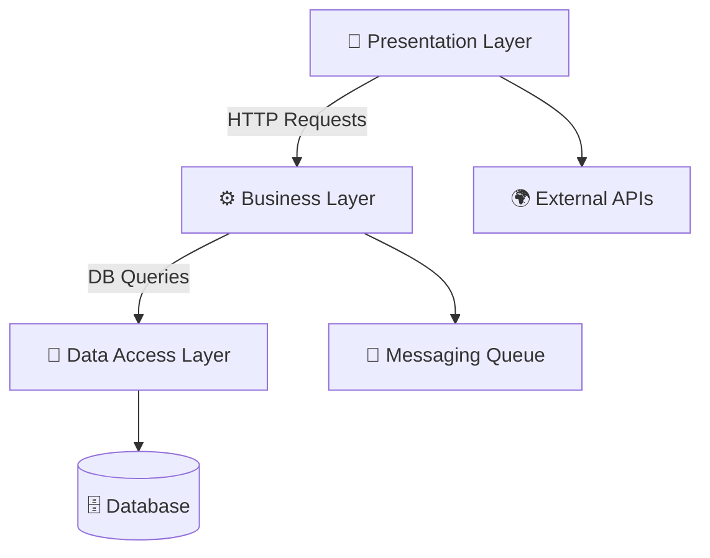
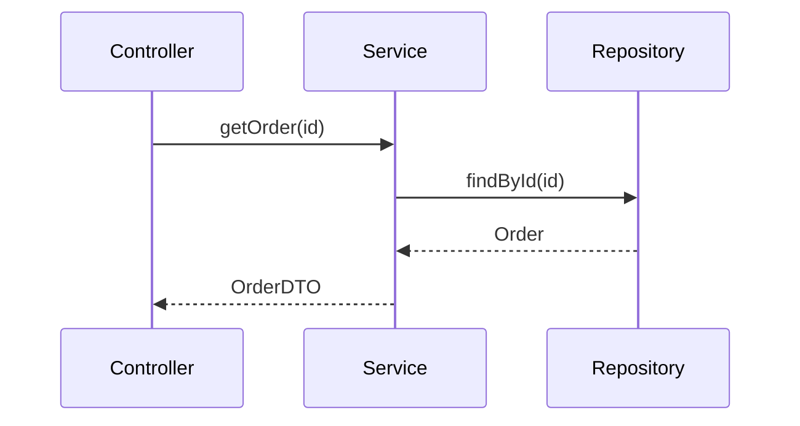

# 🏗️ Layered (N-Tier) Architecture: A Comprehensive Guide for Interview Preparation

## 📜 Table of Contents
1. [What is Layered Architecture?](#-what-is-layered-architecture)
2. [Why Should We Use It?](#-why-should-we-use-it)
3. [Why Not to Use It?](#-why-not-to-use-it)
4. [Motivation Behind Layered Architecture](#-why-it-came-what-is-the-motivation-behind)
5. [Problems It Solves](#-what-problems-exactly-it-is-solving)
6. [Suitable Applications](#-what-kind-of-application-is-suitable-or-perfectly-to-utilize-this)
7. [Industry Best Practices](#-industry-best-practices)
8. [How Big Companies Implement It](#-how-big-companies-do-this)
9. [Recommended Technologies](#-recommended-technologies)
10. [Advantages & Disadvantages](#-advantages-disadvantages)
11. [Code Example (Java + Spring Boot)](#-code-examples-using-java-spring-boot)
12. [Interview Q&A](#-interview-qa)

---

## 🏛️ What is Layered Architecture?
Layered (or **N-Tier**) Architecture is a **software design pattern** where an application is divided into **logical layers**, each with a **specific responsibility**.

### 🔹 Key Layers (Most Common 3-Tier)
| Layer | Responsibility | Example Components |  
|-------|---------------|-------------------|  
| **Presentation Layer (UI)** | Handles user interaction | REST APIs, Thymeleaf, React, Angular |  
| **Business Logic Layer (Service)** | Contains business rules | Spring Services, Domain Logic |  
| **Data Access Layer (Persistence)** | Manages data storage | JPA, Hibernate, JDBC, Repositories |  

*(Some architectures include an additional **API Layer** or **Integration Layer** for external services.)*

### 🔹 Visualization
```
📱 Presentation Layer (Controller)  
    ↓  
⚙️ Business Layer (Service)  
    ↓  
💾 Data Access Layer (Repository)  
    ↓  
🗄️ Database / External Services
```
---

## 📊 Architecture Diagram

---

## 🔄 Layer Communication Patterns

### 1. **Synchronous (Direct Call)**


---

## 🎯 Why Should We Use It?
✅ **Separation of Concerns (SoC)** – Each layer has a single responsibility.  
✅ **Easier Maintenance** – Changes in one layer don’t heavily impact others.  
✅ **Scalability** – Layers can be scaled independently (e.g., only the API layer).  
✅ **Testability** – Mocking dependencies becomes easier.  
✅ **Reusability** – Business logic can be reused across different UIs (Web, Mobile, CLI).

### 🏢 Industry Example
- **Banking Apps**:
    - Presentation: Mobile/Web UI
    - Business: Transaction validation, fraud detection
    - Data Access: Customer accounts database

---

## ❌ Why Not to Use It?
🚫 **Overhead for Simple Apps** – A small CRUD app may not need multiple layers.  
🚫 **Performance Impact** – Each layer adds latency (e.g., passing data through multiple tiers).  
🚫 **Tight Coupling Risk** – If layers are not properly isolated, changes may ripple.

### ⚠️ When to Avoid?
- Microservices (where each service is small and independent).
- Real-time systems requiring ultra-low latency.

---

## 🔍 Why It Came? What is the Motivation Behind?
Before layered architecture, applications were **monolithic and tightly coupled**, making them:
- Hard to maintain
- Difficult to test
- Inflexible to changes

### 📜 Historical Context
- **Early Software**: Spaghetti code (no separation).
- **Enterprise Needs**: Large systems needed structure (e.g., banking, ERP).
- **Evolution**: From 1-Tier (Mainframe) → 2-Tier (Client-Server) → 3-Tier (Modern Web).

---

## 📜 Historical Evolution Table
| Era | Architecture | Problem Solved |  
|------|-------------|----------------|  
| 1960s | 1-Tier (Mainframe) | Centralized computing |  
| 1980s | 2-Tier (Client-Server) | Distributed UI & DB |  
| 2000s | 3-Tier (Web) | Scalable web apps |  
| 2010s | Microservices | Independent scaling |  


---

## 🛠️ What Problems Exactly It is Solving?
| Problem | Solution |  
|---------|----------|  
| Spaghetti Code | Clear separation of layers |  
| Difficult Testing | Mock layers independently |  
| Inflexible Scaling | Scale layers separately (e.g., only UI servers) |  
| Low Reusability | Business logic reused across UIs |  


---

## 🧪 Testing Strategies per Layer
| Layer | Testing Approach | Tools |  
|-------|-----------------|-------|  
| Presentation | MockMVC, Postman | JUnit, Mockito |  
| Business | Unit Tests | JUnit, TestContainers |  
| Data Access | @DataJpaTest | H2, Flyway |  

---

## 📱 What Kind of Application is Suitable?
✔️ **Enterprise Applications** (ERP, CRM)  
✔️ **E-Commerce Platforms** (Order processing, inventory)  
✔️ **Banking Systems** (Transaction handling)  
✔️ **Content Management Systems (CMS)**

### 🚫 Not Ideal For
- **Real-time gaming** (needs high performance, minimal layers).
- **IoT edge computing** (requires lightweight processing).

---

## 🏆 Industry Best Practices
1. **Strict Layer Isolation** – A layer should only call the layer directly below it.
2. **Use DTOs (Data Transfer Objects)** – Avoid exposing DB entities to UI.
3. **Dependency Injection (DI)** – Keeps layers loosely coupled (Spring Boot does this well).
4. **API Contracts** – Define clear interfaces between layers.

### 🔥 Anti-Patterns to Avoid
- **Layer Skipping**: UI calling Repository directly.
- **Business Logic in Controllers**.
- **Overloading Layers** (e.g., Data Access Layer doing business logic).

---

## 🌍 How Big Companies Do This?
| Company | Implementation |  
|---------|---------------|  
| **Amazon** | Web (React) → API Gateway → Microservices (Lambda) → DynamoDB |  
| **Netflix** | UI (React) → Backend (Spring Boot) → Cassandra DB |  
| **Uber** | Mobile App → API Layer → Microservices → PostgreSQL |  

*(Most big companies now use **Microservices**, but each microservice internally follows Layered Architecture.)*

---

## 💻 Recommended Technologies
| Layer | Tech Stack |  
|-------|-----------|  
| **Presentation** | React, Angular, Thymeleaf |  
| **Business** | Spring Boot, .NET Core |  
| **Data Access** | JPA (Hibernate), JDBC, MyBatis |  
| **Database** | PostgreSQL, MySQL, MongoDB |  

---

## ✔️ Advantages & Disadvantages
| Advantages | Disadvantages |  
|------------|--------------|  
| ✅ Clean separation of concerns | ❌ Adds complexity |  
| ✅ Easier debugging | ❌ Slight performance overhead |  
| ✅ Better teamwork (frontend/backend split) | ❌ Overkill for small apps |  

---

## 👨‍💻 Code Examples (Java + Spring Boot)

### 🏹️ **1. Presentation Layer (Controller)**
```java
@RestController  
@RequestMapping("/api/users")  
public class UserController {  

    @Autowired  
    private UserService userService;  // Business Layer Dependency  

    @GetMapping("/{id}")  
    public ResponseEntity<UserDTO> getUser(@PathVariable Long id) {  
        UserDTO user = userService.getUserById(id);  
        return ResponseEntity.ok(user);  
    }  
}
```

### ⚙️ **2. Business Layer (Service)**
```java
@Service  
public class UserService {  

    @Autowired  
    private UserRepository userRepository;  // Data Access Layer Dependency  

    public UserDTO getUserById(Long id) {  
        User user = userRepository.findById(id)  
            .orElseThrow(() -> new UserNotFoundException("User not found"));  
        return convertToDTO(user);  
    }  

    private UserDTO convertToDTO(User user) {  
        // Business logic (e.g., masking sensitive data)  
        return new UserDTO(user.getId(), user.getName(), "****");  
    }  
}
```

### 💾 **3. Data Access Layer (Repository)**
```java
@Repository  
public interface UserRepository extends JpaRepository<User, Long> {  
    // Spring Data JPA provides CRUD operations  
}
```

### 📊 **4. Entity & DTO**
```java
@Entity  
public class User {  
    @Id @GeneratedValue  
    private Long id;  
    private String name;  
    private String password;  
}  

public class UserDTO {  
    private Long id;  
    private String name;  
    private String maskedPassword;  
    // Getters & Setters  
}
```

*(Full code with explanations available on [GitHub]())*

---

## ❓ Interview Q&A

### Q1: What is the difference between **Layered** and **Microservices** Architecture?
✅ **Layered**: Monolithic, internal separation.  
✅ **Microservices**: Independent services, external separation.

### Q2: Can a layer call another layer skipping the immediate next one?
❌ **No!** This violates layer isolation (e.g., Controller → Repository is bad).

### Q3: What is the role of **DTOs** in Layered Architecture?
✅ **Prevents exposing DB entities** to UI, improves security & flexibility.

### Q4: How does **Dependency Injection (DI)** help in Layered Architecture?
✅ **Reduces tight coupling**, makes testing easier (mock dependencies).

### Q5: When would you **not** use Layered Architecture?
🚫 **Small apps, real-time systems, IoT** (where minimal layers are needed).

---


## 💡 Pro Tips for Interviews
1. **Always mention trade-offs**: "While layered architecture provides X, it may not suit Y scenario."
2. **Compare with alternatives**: "Unlike Microservices, layered apps deploy as a single unit."
3. **Use concrete examples**: "At my previous company, we separated concerns by..."

---

## 🎉 Conclusion
Layered Architecture is **essential for structured, maintainable, and scalable applications**. While newer patterns (Microservices, Serverless) exist, **most still use Layered internally**.

🔗 **Further Reading**:
- [Spring Boot Layered Architecture](https://spring.io)
- [Martin Fowler’s Patterns](https://martinfowler.com)

Would you like a **diagram** or **extended code samples**? Let me know! 🚀
