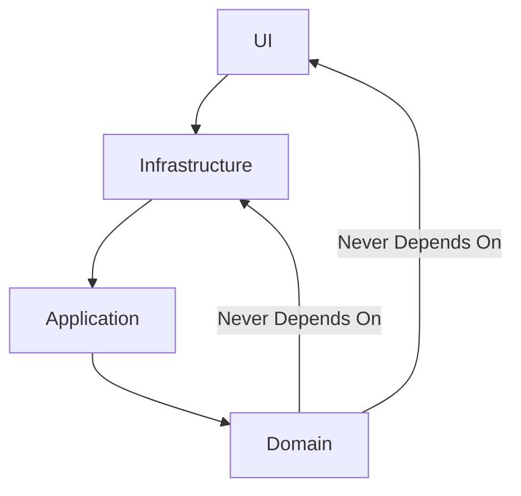
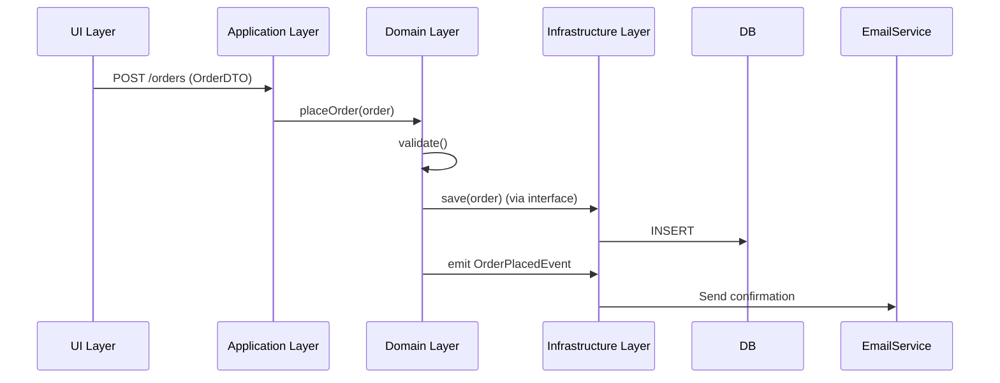

# 🧅 Onion Architecture: A Comprehensive Guide for Interview Preparation 🚀

## 📌 Table of Contents
1. [What is Onion Architecture?](#-what-is-onion-architecture)
2. [Why Should We Use It?](#-why-should-we-use-it)
3. [Why Not to Use It?](#-why-not-to-use-it)
4. [Motivation Behind Onion Architecture](#-why-it-came-what-is-the-motivation-behind)
5. [Problems It Solves](#-what-problems-exactly-it-is-solving)
6. [Suitable Applications](#-what-kind-of-application-is-suitable-or-perfect-to-utilize-this)
7. [Industry Adoption & Best Practices](#-how-big-companies-do-this)
8. [Recommended Technologies](#-recommended-technologies)
9. [Advantages & Disadvantages](#-advantages-disadvantages)
10. [Code Example (Java + Spring Boot)](#-code-examples-using-java-spring-boot)
11. [Interview Q&A](#-interview-qa)
12. [Summary](#-summary)

---

## 🏗️ What is Onion Architecture?
Onion Architecture is a **layered, domain-centric** architectural style that emphasizes:  
✅ **Decoupling** of business logic from infrastructure  
✅ **Dependency Inversion Principle (DIP)** – Inner layers do not depend on outer layers  
✅ **Testability** & **Maintainability**

### 🔍 Core Layers:
| Layer | Responsibility | Example Components |  
|--------|----------------|-------------------|  
| **Domain (Core)** 🎯 | Business models & rules | `Entities`, `Value Objects`, `Domain Services` |  
| **Application** 📜 | Use cases & workflows | `Commands`, `Queries`, `Application Services` |  
| **Infrastructure** 🛠️ | External interactions | `Repositories`, `APIs`, `DB`, `Email Services` |  
| **UI/Presentation** 🖥️ | User interaction | `Controllers`, `REST APIs`, `GraphQL` |  

---

## 🖼️ **Visualization & Diagram**
### 1. **Onion Architecture Diagram** (Simplified)
```
───────────────────────────────────────
|             UI/Presentation         |  
|─────────────────────────────────────|  
|           Infrastructure            | ← DB, APIs, External Services  
|─────────────────────────────────────|  
|           Application               | ← Use Cases, DTOs  
|─────────────────────────────────────|  
|             Domain (Core)           | ← Entities, Value Objects, Domain Services  
───────────────────────────────────────
```
**Key:**
- **Arrows show dependency direction**: Outer layers depend on inner layers, but **Domain never depends on outer layers**.
- **Infrastructure implements interfaces** defined in Domain/Application.

### 2. **Dependency Flow**


---

## � Why Should We Use It?
✔ **Clean Separation of Concerns** – Business logic remains pure  
✔ **Easy to Test** – Mock outer layers (DB, APIs) easily  
✔ **Long-term Maintainability** – Changes in UI/DB don’t break domain  
✔ **Flexibility** – Swap infrastructure (SQL → NoSQL) without altering business logic

### 🏢 Industry Example:
- **Microsoft eShopOnContainers** – Uses Onion Architecture for microservices
- **Banking Systems** – Core domain (transactions) remains unchanged while UI/DB evolves

---

## ❌ Why Not to Use It?
🚫 **Overkill for Simple CRUD Apps** – Adds unnecessary complexity  
🚫 **Learning Curve** – Requires DIP & Domain-Driven Design (DDD) knowledge  
🚫 **Initial Setup Cost** – More boilerplate than traditional 3-tier architecture

---

## 🎯 Why It Came? What is the Motivation Behind?
🔹 **Problem:** Traditional architectures (like **Layered Architecture**) make the **Domain depend on Infrastructure** (e.g., Entities tied to DB schema).  
🔹 **Solution:** Onion Architecture **inverts dependencies**, keeping the **Domain independent**.

### 📜 Historical Context:
- Introduced by **Jeffrey Palermo (2008)**
- Inspired by **Hexagonal (Ports & Adapters)** and **Domain-Driven Design (DDD)**

---

## 🛠️ What Problems Exactly It is Solving?
1. **Tight Coupling** – Prevents mixing business logic with DB/API calls
2. **Testability Issues** – Enables unit testing without DB/HTTP calls
3. **Tech Lock-in** – Easily replace frameworks (e.g., Spring → Quarkus)

---

## 🏆 What Kind of Application is Perfect to Utilize This?
✅ **Complex Business Domains** (Banking, Healthcare, E-commerce)  
✅ **Long-lived Projects** – Where maintainability matters  
✅ **Microservices** – Independent domain models per service

---

## 🏢 How Big Companies Do This?
| Company | Implementation |  
|---------|---------------|  
| **Microsoft** | eShopOnContainers (Onion + DDD + CQRS) |  
| **Uber** | Domain-centric microservices |  
| **Spotify** | Isolated domain models for playlists, billing |  

### 🔥 Best Practices:
- **Use Interfaces** for Repository/Service contracts
- **Avoid Anemic Domain Models** – Keep logic in Entities
- **Leverage Dependency Injection (DI)**

---

## ⚙️ Recommended Technologies
- **Java/Spring Boot** – `@Service`, `@Repository`, DIP
- **.NET Core** – Dependency Injection, MediatR (CQRS)
- **Node.js** – NestJS (modular architecture)

---

## 🌐 **Real-World Example: E-Commerce Flow**
1. **UI Layer**: User clicks "Place Order" → REST call to `OrderController`.
2. **Application Layer**:
    - Validates input → Calls `OrderService.placeOrder()`.
3. **Domain Layer**:
    - Calculates order total → Emits `OrderPlacedEvent`.
4. **Infrastructure Layer**:
    - Saves to DB (`JpaOrderRepository`).
    - Sends confirmation email (`EmailService`).



## ✔️ Advantages & Disadvantages
| **Pros** | **Cons** |  
|----------|----------|  
| ✅ Clean architecture | ❌ Steeper learning curve |  
| ✅ High testability | ❌ More boilerplate |  
| ✅ Flexible infrastructure | ❌ Not ideal for simple apps |  

---

## 💻 Code Examples (Java + Spring Boot)

### 🎯 Domain Layer (Core)
```java
// Entity (Pure Business Logic)  
public class Order {  
    private Long id;  
    private String customerId;  
    private List<OrderItem> items;  

    public BigDecimal calculateTotal() {  
        return items.stream()  
            .map(item -> item.getPrice().multiply(item.getQuantity()))  
            .reduce(BigDecimal.ZERO, BigDecimal::add);  
    }  
}  

// Domain Service Interface (Defined in Core)  
public interface OrderService {  
    Order placeOrder(Order order);  
}  
```

### 📜 Application Layer
```java
// Application Service (Implements Domain Interface)  
@Service  
public class OrderServiceImpl implements OrderService {  
    private final OrderRepository orderRepo;  

    @Autowired  
    public OrderServiceImpl(OrderRepository orderRepo) {  
        this.orderRepo = orderRepo; // Dependency Inversion!  
    }  

    @Override  
    public Order placeOrder(Order order) {  
        // Business logic here  
        return orderRepo.save(order);  
    }  
}  
```

### 🛠️ Infrastructure Layer
```java
// Repository (DB Interaction)  
@Repository  
public class JpaOrderRepository implements OrderRepository {  
    @Override  
    public Order save(Order order) {  
        // JPA/Hibernate logic  
    }  
}  
```

### 🖥️ UI Layer (REST API)
```java
@RestController  
@RequestMapping("/orders")  
public class OrderController {  
    private final OrderService orderService;  

    @PostMapping  
    public ResponseEntity<Order> createOrder(@RequestBody Order order) {  
        Order savedOrder = orderService.placeOrder(order);  
        return ResponseEntity.ok(savedOrder);  
    }  
}  
```

---

## 🎤 Interview Q&A

### Q1: What is the key principle of Onion Architecture?
**A:** Dependency Inversion Principle (DIP) – Inner layers (Domain) should not depend on outer layers (Infrastructure).

### Q2: When should you avoid Onion Architecture?
**A:** For simple CRUD apps where business logic is minimal.

### Q3: How does Onion differ from Layered Architecture?
**A:** In Layered, Domain depends on Infrastructure. In Onion, dependencies point inward.

### Q4: Name a big company using Onion Architecture.
**A:** Microsoft (eShopOnContainers).

---

## 📝 Summary
Onion Architecture is **ideal for complex domains** where **maintainability** and **testability** matter. It’s **not a silver bullet** but a powerful pattern when applied correctly.

🔗 **Further Reading:**
- [Microsoft eShopOnContainers](https://github.com/dotnet-architecture/eShopOnContainers)
- **Books:** "Domain-Driven Design" by Eric Evans

🚀 **Happy Coding!** 🚀
