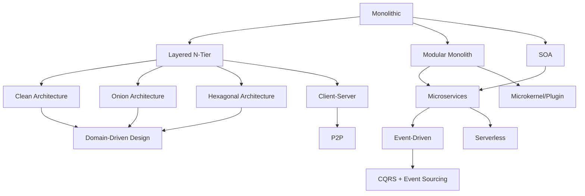

# 🏛️ Software Architecture Mastery: From Zero to Architect Hero 🚀

---

## 🌟 Welcome to Your Architecture Journey!

> **"Architecture is about the important stuff. Whatever that is."** — Martin Fowler

> **"Any fool can write code that a computer can understand. Good programmers write code that humans can understand."** — Martin Fowler

Welcome to the most comprehensive, interview-focused **Software Architecture** guide designed specifically for **Java developers** and **software engineers** preparing to crack top tech company interviews! This isn't just another boring documentation — it's your **architecture superpowers training ground** 🦸‍♂️

---

## 🎯 What Makes This Tutorial Series Special?

✅ **Interview-Hack Focused**: Every pattern linked to real system design interview questions  
✅ **Decision Framework**: Learn WHEN to use WHICH architecture (not just WHAT they are)  
✅ **Gamified Learning**: Challenges, puzzles, boss battles, and achievement milestones  
✅ **Real-World War Stories**: See how Google, Amazon, Netflix, Uber choose architectures  
✅ **Java & Spring Boot Centric**: All examples in Java with production-ready patterns  
✅ **Visual Learning**: Diagrams, mermaid charts, and ASCII art explanations  
✅ **Trade-off Thinking**: Master the art of "it depends" with structured reasoning  
✅ **Progressive Difficulty**: From monolith basics to distributed architecture mastery  

---

## 🎮 How to Use This Tutorial (Gamified Approach)

### 🏆 Achievement Levels — Unlock Your Architect Title!

| Level | Title | Criteria | Badge |
|-------|-------|----------|-------|
| 1️⃣ | **Architecture Apprentice** | Understand Layered & Client-Server | 🎖️ Foundation Badge |
| 2️⃣ | **Pattern Explorer** | Master Clean, Onion, Hexagonal | 🔍 Explorer Badge |
| 3️⃣ | **Event Wizard** | Complete Event-Driven & CQRS | ⚡ Wizard Badge |
| 4️⃣ | **Module Master** | Understand Modular & Microkernel | 🧩 Master Badge |
| 5️⃣ | **Enterprise Sage** | Master SOA & Serverless | 🏢 Enterprise Badge |
| 6️⃣ | **Architecture Guru** | Compare all patterns & make decisions | 🧠 Guru Badge |
| 7️⃣ | **System Design Legend** | Solve 10+ architecture case studies | 👑 Legend Status |

### 🎲 Boss Battle Challenges

After completing each section, face a **Boss Battle** — a real system design interview question that requires the architecture you just learned!

---

## 🧠 The Architecture Mindset — Before You Dive In

### 🔑 The Golden Rule of Architecture

```
┌─────────────────────────────────────────────────────────────────────┐
│                                                                     │
│   🎯 ARCHITECTURE IS ABOUT TRADE-OFFS, NOT BEST PRACTICES!         │
│                                                                     │
│   There is NO "best" architecture.                                  │
│   There is only the "best fit" for YOUR problem.                    │
│                                                                     │
│   Every architecture decision = choosing WHICH problems             │
│   you'd rather have vs. which ones you want to solve.               │
│                                                                     │
└─────────────────────────────────────────────────────────────────────┘
```

### 🤔 The 5 Questions Every Architect Must Ask

Before choosing any architecture, ask yourself:

1. **📏 Scale**: How many users? How much data? How fast does it grow?
2. **⚡ Performance**: What are the latency requirements? Throughput?
3. **🔄 Change Frequency**: How often will requirements change?
4. **👥 Team Size**: How many devs? How experienced?
5. **💰 Budget**: What's the infrastructure budget? Time to market?

---

## 📚 Recommended Learning Path

```
Start Here! 👇
│
├─► 🏗️ FOUNDATION (Week 1) — "Where Every App Begins"
│   ├─► [Layered (N-Tier) Architecture](./Layered_N-Tier.md) ← Start here!
│   ├─► [Client-Server & P2P](./ClientServer_P2P.md)
│   └─► [Architecture Overview & Comparison](./Overview.md)
│
├─► 🧅 DOMAIN-CENTRIC ARCHITECTURES (Week 2) — "The Clean Code Family"
│   ├─► [Clean Architecture](./Clean.md) ← Uncle Bob's masterpiece
│   ├─► [Onion Architecture](./Onion.md) ← Layers like an onion
│   └─► [Hexagonal Architecture](./Hexagonal.md) ← Ports & Adapters
│
├─► ⚡ EVENT & DATA ARCHITECTURES (Week 3) — "React to Everything!"
│   ├─► [Event-Driven Architecture](./Event_Driven.md) ← Real-time power
│   └─► [CQRS](./CQRS.md) ← Read/Write separation magic
│
├─► 🧩 MODULAR ARCHITECTURES (Week 4) — "Build Like LEGO"
│   ├─► [Modular Architecture](./Modular.md) ← Feature-first thinking
│   └─► [Microkernel Architecture](./Microkernel.md) ← Plugin power
│
├─► 🌐 ENTERPRISE & CLOUD (Week 5) — "Scale to Millions"
│   ├─► [SOA (Service-Oriented)](./SOA.md) ← Enterprise backbone
│   └─► [Serverless Architecture](./Serverless.md) ← Pay-per-use magic
│
└─► 🧠 MASTERY (Week 6) — "The Architect's Decision Matrix"
    ├─► [Architecture Decision Records](./DecisionRecords.md)
    └─► [Architecture Anti-Patterns](./AntiPatterns.md)
```

---

## 🗺️ Architecture Family Tree — How They're Related



---

## 🎯 Architecture Decision Matrix — "Which One Should I Use?"

### Quick Decision Guide 🧭

| If Your App Needs... | Use This Architecture | Why? |
|---------------------|----------------------|------|
| 🏃 Quick MVP/prototype | Layered (N-Tier) | Simple, fast to build |
| 🧪 Heavy testing requirements | Clean / Hexagonal | Framework-independent core |
| 📊 More reads than writes | CQRS | Optimized read/write models |
| ⚡ Real-time notifications | Event-Driven | Async, reactive processing |
| 🔌 Plugin/extension system | Microkernel | Core + plugins architecture |
| 🏢 Enterprise integration | SOA | Reusable services + ESB |
| 💰 Minimize infrastructure cost | Serverless | Pay only when code runs |
| 🧩 Large team, parallel work | Modular | Independent feature modules |
| 🔄 Frequent DB/framework changes | Hexagonal | Ports isolate external deps |
| 📈 Complex domain logic | Onion / Clean | Domain at the center |

---

## 🏢 Big Tech Architecture Choices — What They Actually Use

| Company | Primary Architecture | Why They Chose It |
|---------|---------------------|-------------------|
| **Netflix** 🎬 | Event-Driven + Microservices | 200M+ users, real-time recommendations |
| **Amazon** 🛒 | SOA → Microservices + CQRS | 1000+ services, independent team scaling |
| **Uber** 🚗 | Event-Driven + Domain-Driven | Real-time ride matching, surge pricing |
| **Spotify** 🎵 | Modular Monolith → Microservices | Squad-based development model |
| **Airbnb** 🏠 | SOA + Event-Driven | Booking events, payment processing |
| **Google** 🔍 | Clean + Modular + Custom | Billions of queries, extreme reliability |
| **Meta** 📱 | Event-Driven + Serverless | 3B+ users, real-time feeds |
| **Twitter/X** 🐦 | Event-Driven + CQRS | High write (tweets) + High read (timeline) |

---

## 🧪 Architecture Interview Patterns

### 💡 Common Interview Questions That Test Architecture Knowledge

| Question Type | Example | Architecture Tested |
|--------------|---------|-------------------|
| **"Design a..."** | "Design Netflix" | Event-Driven + CQRS |
| **"How would you..."** | "Handle 1M concurrent users?" | Layered + Scaling patterns |
| **"Compare..."** | "Monolith vs Microservices" | All patterns (trade-offs) |
| **"What went wrong?"** | "Why did X system fail?" | Anti-patterns identification |
| **"Migrate from..."** | "Monolith to Microservices" | Modular → Event-Driven |

---

## 🎲 Quick Architecture Puzzle — Test Yourself!

### Puzzle #1: The Startup Dilemma 🧩

> **Scenario**: You're the first engineer at a startup. Budget is tight, team is 3 people, and you need to ship in 2 months. The app is a basic e-commerce platform.
>
> **Question**: Which architecture do you choose? Why?
>
> <details>
> <summary>🔓 Click to reveal answer</summary>
>
> **Answer**: **Layered (N-Tier)** with a **Modular Monolith** structure.
>
> **Why?**
> - ✅ Simple to understand and build quickly
> - ✅ 3-person team doesn't need microservices overhead
> - ✅ Modular structure allows future decomposition
> - ✅ Saves money on infrastructure (single deployment)
> - ❌ Microservices = overkill for 3 devs
> - ❌ CQRS = overkill for basic CRUD
>
> **Key Insight**: "Start monolith, extract services later" — Sam Newman
> </details>

### Puzzle #2: The Scale Problem 🧩

> **Scenario**: Your e-commerce app now has 10M users. Reads are 100x more than writes. The product catalog page takes 5 seconds to load. What architecture pattern solves this?
>
> <details>
> <summary>🔓 Click to reveal answer</summary>
>
> **Answer**: **CQRS** (Command Query Responsibility Segregation)
>
> **Why?**
> - Separate read model (denormalized, cached) for fast queries
> - Write model keeps data integrity
> - Read replicas can scale horizontally
> - Product catalog → materialized view optimized for reads
>
> **Big Tech Example**: Amazon product pages use CQRS — write to normalized DB, read from denormalized cache.
> </details>

---

## 📊 Complete Comparison Matrix

| Aspect | Layered | Clean | Onion | Hexagonal | Event-Driven | CQRS | Modular | Microkernel | SOA | Serverless |
|--------|---------|-------|-------|-----------|-------------|------|---------|-------------|-----|-----------|
| **Complexity** | 🟢 Low | 🔴 High | 🟡 Med | 🟡 Med | 🔴 High | 🔴 High | 🟡 Med | 🟡 Med | 🟡 Med | 🟡 Med |
| **Testability** | 🟡 | 🟢 | 🟢 | 🟢 | 🟡 | 🟢 | 🟢 | 🟢 | 🟡 | 🟡 |
| **Scalability** | 🔴 | 🟡 | 🟡 | 🟡 | 🟢 | 🟢 | 🟢 | 🟡 | 🟢 | 🟢 |
| **Learning Curve** | 🟢 Easy | 🔴 Hard | 🟡 Med | 🟡 Med | 🔴 Hard | 🔴 Hard | 🟡 Med | 🟡 Med | 🟡 Med | 🟡 Med |
| **Time to Build** | 🟢 Fast | 🔴 Slow | 🟡 Med | 🟡 Med | 🔴 Slow | 🔴 Slow | 🟡 Med | 🟡 Med | 🟡 Med | 🟢 Fast |
| **Maintenance** | 🟡 | 🟢 | 🟢 | 🟢 | 🟡 | 🟡 | 🟢 | 🟢 | 🟡 | 🟢 |
| **Best For** | CRUD | Enterprise | DDD | Integrations | Real-time | High R/W | Teams | Plugins | Reuse | Events |

---

## 🎓 Pro Tips for Architecture Interviews

### 🔥 The TRADE Framework (for answering "Design X" questions)

```
T - Traffic patterns (read-heavy? write-heavy? both?)
R - Reliability requirements (99.9%? 99.99%?)
A - Availability vs Consistency (CAP theorem choice)
D - Data model (relational? document? graph? time-series?)
E - Evolution plan (how will this grow in 2-5 years?)
```

### 💬 Magic Phrases Interviewers Love to Hear

- "It depends on the trade-offs we're optimizing for..."
- "Given the scale requirements, I'd choose X because..."
- "We could start with Y and evolve toward Z as we grow..."
- "The bottleneck here is [reads/writes/latency], so..."
- "Let me consider the failure modes of this approach..."

---

## 🚀 Ready to Begin?

👉 **[Start with Layered Architecture →](./Layered_N-Tier.md)** — Every journey starts with the basics!

Or if you're already familiar with basics:
👉 **[Jump to Clean Architecture →](./Clean.md)** — The most asked pattern in interviews!

---

## 📖 Supplementary Resources

- 📕 "Clean Architecture" by Robert C. Martin
- 📗 "Fundamentals of Software Architecture" by Mark Richards & Neal Ford
- 📘 "Building Evolutionary Architectures" by Ford, Parsons, Kua
- 📙 "Designing Data-Intensive Applications" by Martin Kleppmann
- 🎥 [Martin Fowler's Architecture Guide](https://martinfowler.com/architecture/)

---

*Happy Architecting! Remember: The best architecture is one that solves YOUR problem, not the one that's trendy on Twitter.* 🏗️✨
