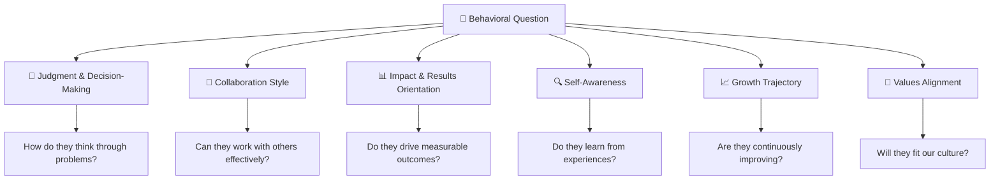

# 📖 Chapter 1: Foundations of Behavioral Interviews 🧠

---

## 🎯 Learning Objectives

By the end of this chapter, you will:
- ✅ Understand **what** behavioral interviews are and **why** they exist
- ✅ Know the **psychology** behind behavioral questioning
- ✅ Understand **how interviewers evaluate** your answers (the scoring rubric)
- ✅ Debunk common **myths** that trip up even experienced engineers
- ✅ Build your **mental model** for approaching any behavioral question

**🎮 XP Reward: +10 XP | Achievement: 🎖️ Foundation Badge**

---

## 🤔 What Are Behavioral Interviews, Really?

### The Simple Definition

> **Behavioral Interview** = A structured conversation where the interviewer asks you to describe **specific past experiences** to predict how you'll behave in **future situations**.

### The Not-So-Simple Reality

Think of it like this:

```
╔══════════════════════════════════════════════════════════════╗
║                                                              ║
║   Technical Interview:  "Can you solve this problem?"        ║
║   Behavioral Interview: "Have you solved problems LIKE       ║
║                          this before, and HOW?"              ║
║                                                              ║
╠══════════════════════════════════════════════════════════════╣
║                                                              ║
║   Technical Interview:  Tests your SKILLS                    ║
║   Behavioral Interview: Tests your CHARACTER + JUDGMENT      ║
║                                                              ║
╚══════════════════════════════════════════════════════════════╝
```

### 🎮 Mini Puzzle #1: Spot the Behavioral Question

Which of these are behavioral questions? (Answers below)

| # | Question | Behavioral? |
|---|----------|------------|
| A | "How would you design a chat system?" | ❓ |
| B | "Tell me about a time you disagreed with your manager." | ❓ |
| C | "What is the difference between an interface and abstract class?" | ❓ |
| D | "Describe a situation where you had to deliver under a tight deadline." | ❓ |
| E | "What would you do if a teammate wasn't pulling their weight?" | ❓ |
| F | "Walk me through a time you made a mistake in production." | ❓ |

<details>
<summary>🔑 Click to reveal answers!</summary>

- **A**: ❌ System Design question
- **B**: ✅ **Behavioral** — asks about a past experience
- **C**: ❌ Technical knowledge question
- **D**: ✅ **Behavioral** — asks for a specific past situation
- **E**: ⚠️ **Situational** (hypothetical) — close but not purely behavioral
- **F**: ✅ **Behavioral** — asks for a real past event

**Key Insight**: True behavioral questions always ask about something that **already happened**. The magic words are: *"Tell me about a time..."*, *"Describe a situation..."*, *"Walk me through..."*, *"Give me an example of..."*

</details>

---

## 🧬 The Psychology Behind Behavioral Questions

### Why Companies Use Them (The Science)

In 1982, industrial psychologist **Tom Janz** formalized the concept based on a powerful principle:

> 🧠 **"Past behavior is the best predictor of future behavior"**
> — Behavioral Consistency Principle

Here's why this matters:

```
Traditional Interview (Hypothetical):
❌ "What would you do if..." → Candidate gives IDEAL answer
                                (what they WISH they'd do)

Behavioral Interview (Evidence-based):
✅ "Tell me about a time when..." → Candidate reveals ACTUAL behavior
                                     (what they REALLY did)
```

### 🎯 The Interviewer's Hidden Agenda

When an interviewer asks a behavioral question, they're actually evaluating **multiple dimensions simultaneously**:



### 🎮 Real-World Analogy: The Job Interview as a Movie Audition 🎬

Think of a behavioral interview like a movie audition:

| Movie Audition | Behavioral Interview |
|----------------|---------------------|
| 🎬 Director wants to see your acting | 👔 Interviewer wants to see your behavior |
| 📜 You perform scenes from past roles | 📖 You describe scenes from past work |
| 🌟 They assess range & authenticity | 🌟 They assess competency & authenticity |
| ❌ Reading a script = Fail | ❌ Memorized generic answer = Fail |
| ✅ Natural, believable performance = Win | ✅ Specific, authentic story = Win |

---

## 🏗️ The Architecture of a Behavioral Interview

### Typical Interview Structure

```
╔═══════════════════════════════════════════════════════════╗
║ 📅 45-60 Minute Behavioral Interview                      ║
╠═══════════════════════════════════════════════════════════╣
║                                                           ║
║  ⏱️ 0-5 min   │ Introduction & rapport building          ║
║  ⏱️ 5-10 min  │ "Tell me about yourself" (elevator pitch)║
║  ⏱️ 10-45 min │ 4-6 behavioral questions (core)          ║
║  ⏱️ 45-55 min │ Follow-up / deeper dives                 ║
║  ⏱️ 55-60 min │ Your questions for them                  ║
║                                                           ║
╚═══════════════════════════════════════════════════════════╝
```

### How Many Questions to Expect

| Interview Type | # of Behavioral Qs | Time per Q |
|---------------|-------------------|-----------|
| Phone Screen | 2-3 | 5-8 min |
| Dedicated Behavioral Round | 5-7 | 7-10 min |
| Mixed Technical + Behavioral | 2-4 | 5-7 min |
| Amazon Loop (each round) | 2-3 per principle | 15-20 min per principle |
| Bar Raiser (Amazon) | 3-4 deep dives | 8-12 min |

---

## 📊 How Interviewers Actually Score You (The Hidden Rubric)

### The Standard Evaluation Framework

Most top tech companies use a variation of this scoring system:

```
╔═══════════════════════════════════════════════════════════════════╗
║  SCORING RUBRIC (1-4 Scale, typical at FAANG)                    ║
╠═══════════════════════════════════════════════════════════════════╣
║                                                                   ║
║  1 - 🔴 STRONG NO HIRE                                           ║
║      • Vague, generic answers                                     ║
║      • No specific examples                                       ║
║      • Blamed others for failures                                 ║
║      • Red flags in judgment/values                               ║
║                                                                   ║
║  2 - 🟡 LEAN NO HIRE                                             ║
║      • Some examples but lacking depth                            ║
║      • Limited self-awareness                                     ║
║      • Results unclear or unimpressive                            ║
║      • Missed key competency signals                              ║
║                                                                   ║
║  3 - 🟢 LEAN HIRE                                                ║
║      • Clear specific examples                                    ║
║      • Good self-awareness and reflection                         ║
║      • Demonstrated positive impact                               ║
║      • Aligned with company values                                ║
║                                                                   ║
║  4 - 🟣 STRONG HIRE                                              ║
║      • Exceptional stories with measurable impact                 ║
║      • Deep self-awareness and growth narrative                   ║
║      • Went above and beyond expectations                         ║
║      • Clear values alignment with leadership qualities           ║
║                                                                   ║
╚═══════════════════════════════════════════════════════════════════╝
```

### What Makes the Difference Between a 2 and a 4?

| Dimension | Score 2 (Lean No) | Score 4 (Strong Hire) |
|-----------|-------------------|----------------------|
| **Specificity** | "I worked on a project once..." | "In Q3 2023, our payment service was handling 2M daily transactions when..." |
| **Ownership** | "The team delivered..." | "I identified the bottleneck, proposed the solution, and led the implementation..." |
| **Impact** | "Things got better" | "Reduced latency by 65%, saving $2M annually in infrastructure costs" |
| **Self-Awareness** | "Everything went well" | "In hindsight, I should have involved QA earlier — I've since changed my approach" |
| **Depth** | Surface-level description | Explains WHY they made each decision |

---

## 🎭 The 8 Core Competencies Every Company Evaluates

Regardless of the company, behavioral questions always map to these fundamental competencies:

```
┌─────────────────────────────────────────────────────┐
│           THE 8 UNIVERSAL COMPETENCIES              │
├─────────────────────────────────────────────────────┤
│                                                     │
│  1. 👑 LEADERSHIP          5. 📞 COMMUNICATION     │
│  2. 🤝 TEAMWORK            6. 🎯 RESULTS FOCUS     │
│  3. 🧩 PROBLEM SOLVING     7. 🌱 ADAPTABILITY      │
│  4. ⚖️ JUDGMENT            8. 🔥 DRIVE/INITIATIVE  │
│                                                     │
└─────────────────────────────────────────────────────┘
```

### How They Map to Real Questions:

| Competency | Example Questions |
|-----------|-------------------|
| 👑 **Leadership** | "Tell me about a time you led a project." / "How did you influence without authority?" |
| 🤝 **Teamwork** | "Describe working with a difficult colleague." / "How do you handle disagreements?" |
| 🧩 **Problem Solving** | "Walk me through a complex bug you fixed." / "How did you approach an ambiguous problem?" |
| ⚖️ **Judgment** | "Tell me about a risky decision you made." / "How do you make decisions with incomplete data?" |
| 📞 **Communication** | "How did you explain a technical concept to non-technical stakeholders?" |
| 🎯 **Results** | "What's your biggest achievement?" / "How did you deliver under constraints?" |
| 🌱 **Adaptability** | "Tell me about adapting to a major change." / "How did you handle a pivot?" |
| 🔥 **Initiative** | "Tell me about something you did without being asked." / "How did you go above and beyond?" |

---

## 🚫 Common Myths DEBUNKED

### Myth #1: "Behavioral interviews are just about being likeable"
```
❌ MYTH: Be charming and you'll pass
✅ REALITY: Interviewers use structured rubrics.
            Charm without substance = FAIL
            Substance without charm = PASS (usually)
```

### Myth #2: "I need to have perfect answers with no failures"
```
❌ MYTH: Never show weakness
✅ REALITY: Stories about FAILURES (with lessons learned) 
            score HIGHER than "everything was perfect" stories.
            Self-awareness is a KEY hiring signal!
```

### Myth #3: "I can wing it because I have lots of experience"
```
❌ MYTH: Experience = good answers
✅ REALITY: Without preparation, even experienced engineers give
            RAMBLING, UNFOCUSED answers that score poorly.
            Structure > Experience in interviews.
```

### Myth #4: "Behavioral is less important than technical"
```
❌ MYTH: Focus 90% on LeetCode
✅ REALITY: At Amazon, a perfect technical round + failed behavioral = REJECT
            At Google, "Googleyness" can tip borderline cases either way
            At Netflix, culture fit outweighs technical skills
```

### Myth #5: "I should memorize scripted answers"
```
❌ MYTH: Prepare word-for-word scripts
✅ REALITY: Interviewers can DETECT memorized answers instantly.
            Prepare FRAMEWORKS and KEY POINTS, not scripts.
            Practice until it's NATURAL, not REHEARSED.
```

### Myth #6: "Only managers get leadership questions"
```
❌ MYTH: Leadership = management position
✅ REALITY: ALL levels get leadership questions!
            IC (Individual Contributor) leadership = 
            Mentoring, technical influence, driving decisions,
            raising the bar, challenging status quo
```

---

## 🧠 The Engineer's Mental Model for Behavioral Interviews

### Think of It Like Writing Clean Code

| Code Principle | Behavioral Interview Equivalent |
|---------------|-------------------------------|
| **DRY** (Don't Repeat Yourself) | Don't reuse the same story for every question |
| **Single Responsibility** | Each answer should demonstrate ONE clear competency |
| **KISS** (Keep It Simple) | Don't over-complicate your stories |
| **Clean Architecture** | Structure your answer with clear layers (STAR) |
| **Testing** | Validate your stories with a friend before the interview |
| **Refactoring** | Iterate on your stories — first draft is never the best |
| **Documentation** | Write down your stories (Story Bank) for easy retrieval |
| **Error Handling** | Have a plan for when you draw a blank |

### 🎮 The Interview as a Game: Level Design

```
Level 1: PHONE SCREEN
┌─────────────────────────────────────────┐
│ 🎮 Boss: Recruiter / Junior Interviewer │
│ 🗡️ Weapons Needed: 3-4 stories         │
│ ⏱️ Time Limit: 30 minutes              │
│ 💰 Reward: Advance to on-site          │
└─────────────────────────────────────────┘

Level 2: ON-SITE BEHAVIORAL ROUND
┌─────────────────────────────────────────┐
│ 🎮 Boss: Hiring Manager / Sr. Engineer  │
│ 🗡️ Weapons Needed: 8-10 stories        │
│ ⏱️ Time Limit: 45-60 minutes           │
│ 💰 Reward: Strong signal for hire       │
└─────────────────────────────────────────┘

Level 3: BAR RAISER / LEADERSHIP ROUND
┌─────────────────────────────────────────┐
│ 🎮 Boss: Senior Leader / Bar Raiser     │
│ 🗡️ Weapons Needed: Deep, impactful     │
│    stories with exceptional results      │
│ ⏱️ Time Limit: 60 minutes              │
│ 💰 Reward: Offer / Level determination  │
└─────────────────────────────────────────┘
```

---

## 🏢 How Big Tech Companies Think About Behavioral Interviews

### Amazon: The Most Behavioral-Heavy Company

```
📋 Amazon's Approach:
┌───────────────────────────────────────────────┐
│ • Every interview round includes behavioral   │
│ • Each interviewer "owns" 2-3 LPs             │
│ • The Bar Raiser ensures high standards        │
│ • They dig DEEP with follow-ups               │
│ • "Tell me more about..." is their weapon      │
└───────────────────────────────────────────────┘
```

### Google: "Googleyness & Leadership" (GnL)

```
📋 Google's Approach:
┌───────────────────────────────────────────────┐
│ • One dedicated behavioral round              │
│ • Focus on: Cognitive ability, Role-related   │
│   knowledge, Leadership, Googleyness          │
│ • Googleyness = doing the right thing,        │
│   working well in ambiguity, pushing back     │
│   constructively                              │
└───────────────────────────────────────────────┘
```

### Meta: "Move Fast" Culture Fit

```
📋 Meta's Approach:
┌───────────────────────────────────────────────┐
│ • Values: Move Fast, Be Bold, Focus on        │
│   Long-Term Impact, Build Awesome Things      │
│ • They want to see speed + quality balance    │
│ • Heavy emphasis on collaboration             │
│ • Building social experiences is key          │
└───────────────────────────────────────────────┘
```

---

## 🧩 Real-World Use Case: Why Behavioral Skills Matter in Daily Engineering

### Scenario: The Monday Morning Sprint Planning 🌅

Imagine you're a Java developer in a typical sprint planning:

```java
// Your typical Monday...
public class MondayMorning {
    
    // These "behavioral skills" are used EVERY SINGLE DAY:
    
    void sprintPlanning() {
        // COMMUNICATION: Explaining your estimates
        estimate("This story needs 5 points because the 
                  payment gateway has undocumented rate limits");
        
        // NEGOTIATION: Pushing back on unrealistic scope
        pushBack("We can't do all 3 features in one sprint. 
                  Let me propose which to prioritize...");
        
        // LEADERSHIP: Volunteering for the hard problem
        volunteer("I'll take the caching redesign — it's risky 
                   but I've researched the approach");
        
        // CONFLICT RESOLUTION: When PM and Tech Lead disagree
        mediate("Both perspectives are valid. Here's a middle 
                 ground that satisfies the deadline AND quality...");
        
        // OWNERSHIP: Following through
        commit("I'll have the RFC doc by Wednesday and 
                prototype by Friday. I'll flag blockers early.");
    }
}
```

> 💡 **Key Insight**: Behavioral interview questions aren't testing hypothetical scenarios — they're testing skills you use **every single day** as an engineer. The interview is just a formalized way of assessing what you ALREADY do (or should do) at work!

---

## ✅ Chapter 1 Summary & Key Takeaways

| # | Key Takeaway |
|---|-------------|
| 1 | Behavioral interviews test **past behavior** to predict **future performance** |
| 2 | Companies use **structured rubrics** — it's not subjective "gut feel" |
| 3 | The **8 core competencies** are universal across all companies |
| 4 | **Specificity** and **impact** differentiate strong from weak answers |
| 5 | **Failures with lessons** score HIGHER than "perfect" stories |
| 6 | **Structure** (STAR) is more important than rehearsed scripts |
| 7 | These skills aren't "interview tricks" — they're **daily engineering skills** |
| 8 | Every engineer (not just managers) gets leadership questions |

---

## 🎮 Chapter 1 Exercises

### Exercise 1.1: Question Classification
Go through the following 10 questions and classify each as: **Behavioral (B)**, **Technical (T)**, **Situational (S)**, or **System Design (SD)**:

1. "How would you design a URL shortener?"
2. "Tell me about a time you missed a deadline."
3. "What's the difference between REST and GraphQL?"
4. "Describe a situation where you had to learn something quickly."
5. "If your teammate pushed buggy code, what would you do?"
6. "Walk me through how you debugged a production issue."
7. "What are the SOLID principles?"
8. "Tell me about your biggest professional failure."
9. "How would you handle a stakeholder who keeps changing requirements?"
10. "Give me an example of when you went above and beyond."

<details>
<summary>🔑 Answers</summary>

1. SD (System Design)
2. **B (Behavioral)** ✅
3. T (Technical)
4. **B (Behavioral)** ✅
5. S (Situational — hypothetical)
6. **B (Behavioral)** ✅ — asks to "walk through" a real past event
7. T (Technical)
8. **B (Behavioral)** ✅
9. S (Situational — "how would you")
10. **B (Behavioral)** ✅

</details>

### Exercise 1.2: Self-Reflection Starter
Write down **3 work experiences** from your career that were:
- 🏆 A big success/achievement
- 💥 A challenging failure/mistake
- 🤝 A collaboration challenge

Don't worry about structure yet — just brain-dump the raw stories. We'll shape them in Chapter 2!

---

## ⏭️ What's Next?

**[Chapter 2: STAR Method Mastery →](./02_STAR_Method_Mastery.md)**

In the next chapter, you'll learn the **STAR framework** in depth — the most powerful tool for structuring behavioral answers. We'll also cover advanced variations (STAR+, CAR, PAR) and practice with real examples!

---

> 🧠 **Remember**: "Everyone has stories worth telling. The interview just requires you to tell them **well**."

---

*Chapter 1 Complete! 🎉 You've earned +10 XP and the 🎖️ Foundation Badge!*
