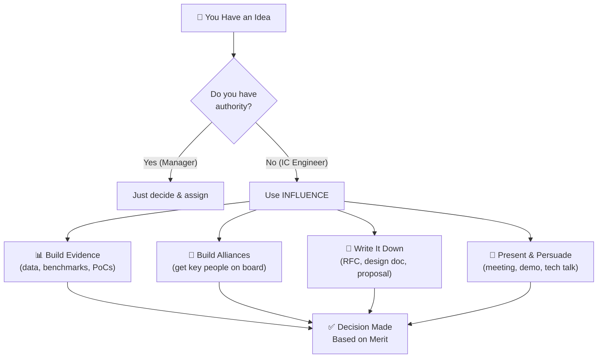

# 👑 Chapter 3: Leadership & Influence - Leading Without the Title 🚀

---

## 🎯 Learning Objectives

By the end of this chapter, you will:
- ✅ Understand that **leadership ≠ management** (especially for ICs)
- ✅ Master the **5 Types of Engineering Leadership**
- ✅ Craft compelling stories about **influencing without authority**
- ✅ Know exactly what interviewers look for in leadership answers
- ✅ Build a toolkit of **leadership STAR stories**

**🎮 XP Reward: +10 XP | Achievement: 👑 Leader Badge**

---

## 🧠 The #1 Misconception About Leadership Questions

```
╔══════════════════════════════════════════════════════════════════╗
║                                                                  ║
║  ❌ What most engineers think:                                    ║
║     "I'm not a manager, so I don't have leadership stories"      ║
║                                                                  ║
║  ✅ What interviewers actually mean:                              ║
║     "Show me you can drive impact beyond just writing code"      ║
║                                                                  ║
╚══════════════════════════════════════════════════════════════════╝
```

### The Truth About Engineering Leadership

| Management Leadership | Engineering Leadership |
|----------------------|----------------------|
| 📋 Assign tasks | 🧭 Set technical direction |
| 👥 Manage people | 🌟 Influence decisions |
| 📊 Track progress | 🔍 Identify problems proactively |
| 🏢 Org chart authority | 💡 Expertise-based authority |
| 📝 Write performance reviews | 🎓 Mentor & grow others |
| 🗓️ Run meetings | 🏗️ Design systems others build on |

> 💡 **Key Insight**: At FAANG companies, **Senior Engineers** (L5+) are evaluated MORE on leadership than technical skills. You don't need a team to lead — you need **impact beyond yourself**.

---

## 🎯 The 5 Types of Engineering Leadership

### Type 1: 🏗️ Technical Leadership

**What it means**: Making architectural decisions that shape the team/org's direction.

**Example Signals**:
- Designed a system that became the team's standard
- Created technical RFCs that influenced the roadmap
- Made technology choices (e.g., choosing Kafka over RabbitMQ)
- Defined coding standards or best practices

**Common Questions**:
- "Tell me about a time you made an important technical decision"
- "Describe when you had to choose between multiple architectural approaches"
- "How did you drive a technical standard across your team?"

#### 🎮 Real-World Scenario: The Architecture Decision

```java
// The situation: Your team is debating microservices vs monolith

public class TechnicalLeadership {
    
    // 🔴 NON-LEADER approach:
    void passiveEngineer() {
        // Wait for someone else to decide
        // Follow whatever the loudest voice says
        // Never voice your opinion in meetings
    }
    
    // 🟢 LEADER approach (even as IC):
    void technicalLeader() {
        // 1. Research both approaches thoroughly
        analyzeTradeoffs("monolith", "microservices");
        
        // 2. Write an RFC with data
        writeRFC("Proposed: Start monolithic, extract services " +
                 "when team reaches 15+ engineers. Here's why...");
        
        // 3. Present to the team with evidence
        presentWithData(latencyBenchmarks, teamSizeGrowthProjection);
        
        // 4. Build consensus, don't dictate
        gatherFeedback();
        incorporateCounterArguments();
        
        // 5. Document the decision for future reference
        createADR("ADR-015: Modular monolith with service extraction plan");
    }
}
```

---

### Type 2: 🎓 Mentorship Leadership

**What it means**: Growing others, sharing knowledge, raising the team's bar.

**Example Signals**:
- Mentored junior developers
- Created onboarding documentation
- Led tech talks or knowledge-sharing sessions
- Pair-programmed to upskill teammates
- Created code review culture

**Common Questions**:
- "Tell me about a time you helped someone grow"
- "How do you help junior developers on your team?"
- "Describe when you raised the bar for your team"

#### 🌟 STAR Example: Mentoring a Junior Developer

> **S**: "On my team, we hired a junior Java developer who was struggling with our microservices architecture — specifically around async messaging with Kafka and event-driven design patterns."
>
> **T**: "I volunteered to be their mentor, with the goal of making them productive and independent within 3 months."
>
> **A**: "I created a structured learning plan:
> 1. **Week 1-2**: Paired on simple bug fixes to understand the codebase
> 2. **Week 3-4**: Assigned progressively complex tasks with guided code reviews
> 3. **Week 5-8**: Had them design a small feature end-to-end (I reviewed the design doc)
> 4. **Week 9-12**: They led a sprint task independently while I was available for questions
> 
> Key things I did differently:
> - Instead of giving answers, I asked **guiding questions** ('What happens if this consumer fails?')
> - Shared my **debugging mental model** (check logs → check metrics → check dependencies)
> - Created a **'Microservices Survival Guide'** doc that became our team's onboarding bible"
>
> **R**: "After 3 months, they independently shipped a notification service handling 100K events/day. They got recognized in our quarterly review. Within a year, they were mentoring the NEXT new hire. The onboarding doc reduced our new-hire ramp-up time from 6 weeks to 3 weeks."

---

### Type 3: 🔄 Process Leadership

**What it means**: Improving how the team works, not just what they build.

**Example Signals**:
- Improved CI/CD pipelines or deployment process
- Introduced code review standards
- Set up monitoring/alerting systems
- Reduced toil through automation
- Improved incident response processes

**Common Questions**:
- "Tell me about a time you improved a process"
- "Describe when you identified and fixed an inefficiency"
- "How did you drive adoption of a new practice?"

---

### Type 4: 🤝 Cross-Team Leadership

**What it means**: Driving alignment and collaboration across team boundaries.

**Example Signals**:
- Coordinated a project spanning multiple teams
- Resolved cross-team technical conflicts
- Built shared libraries/platforms used by other teams
- Represented your team in architectural decisions

**Common Questions**:
- "Tell me about working with a team with conflicting priorities"
- "How did you drive alignment across teams?"
- "Describe coordinating a complex multi-team project"

---

### Type 5: 🌊 Crisis Leadership

**What it means**: Stepping up when things go wrong — production outages, missed deadlines, team challenges.

**Example Signals**:
- Led incident response during production outages
- Rallied the team during a critical deadline
- Made tough calls under pressure
- Communicated effectively during uncertainty

**Common Questions**:
- "Tell me about a time you handled a crisis"
- "Describe leading through uncertainty"
- "How did you manage a high-pressure situation?"

---

## 🏢 How Big Tech Evaluates Leadership (By Level)

```
┌─────────────────────────────────────────────────────────────┐
│ LEADERSHIP EXPECTATIONS BY ENGINEERING LEVEL                 │
├─────────────────────────────────────────────────────────────┤
│                                                             │
│ 👶 Junior (L3-L4):                                          │
│    • Take ownership of assigned tasks                       │
│    • Ask good questions, seek mentorship                    │
│    • Start contributing to code reviews                     │
│                                                             │
│ 💪 Mid-Level (L4-L5):                                       │
│    • Own features end-to-end                                │
│    • Mentor juniors informally                              │
│    • Influence team decisions                               │
│    • Improve processes proactively                          │
│                                                             │
│ 🧠 Senior (L5-L6):                                          │
│    • Set technical direction for team/area                  │
│    • Lead cross-team initiatives                            │
│    • Mentor multiple people                                 │
│    • Drive org-wide improvements                            │
│    • Make trade-off decisions with business impact          │
│                                                             │
│ 🏛️ Staff+ (L6-L7):                                          │
│    • Shape company technical strategy                       │
│    • Lead multi-quarter, multi-team projects                │
│    • Influence beyond your org                              │
│    • Define best practices at scale                         │
│    • Be a "multiplier" — make everyone better               │
│                                                             │
└─────────────────────────────────────────────────────────────┘
```

---

## 🎯 The "Influence Without Authority" Framework

This is the #1 leadership skill interviewers test for engineers:



### The 6 Weapons of Engineering Influence:

| # | Weapon | How It Works | Example |
|---|--------|-------------|---------|
| 1 | 📊 **Data** | Numbers don't lie | "Our p99 latency is 3x competitors. Here's the proof." |
| 2 | 🛠️ **Prototype** | Show, don't tell | "I built a PoC over the weekend. Here's the demo." |
| 3 | 📝 **Written Proposal** | Structured thinking | "Here's my RFC with trade-offs, risks, and timeline." |
| 4 | 🤝 **Coalition Building** | Get allies first | "I talked to the platform team — they support this approach." |
| 5 | 🎓 **Expertise** | Be the domain expert | "Based on my experience with similar systems at scale..." |
| 6 | ⏱️ **Timing** | Seize the right moment | "Since we're refactoring anyway, now is the perfect time to..." |

---

## 🌟 Complete STAR Examples for Leadership Questions

### Question: "Tell me about a time you led a project"

#### ⭐ SITUATION
> "Our payment processing system was built on a legacy SOAP-based architecture that was becoming a bottleneck — 45-minute deployment cycles, frequent XML parsing errors, and no way to scale individual services. The business was losing approximately $100K monthly in failed transactions due to system limitations."

#### 📋 TASK
> "No one had formally proposed a migration. I took the initiative to champion the move to a modern REST/microservices architecture. My self-assigned task was to get buy-in, design the migration path, and lead the first phase of implementation."

#### ⚡ ACTION
> "**Phase 1 — Building the Case (Week 1-2):**
> - Collected data: outage hours, failed transactions, developer productivity metrics
> - Wrote a detailed RFC comparing 3 approaches: Big Bang rewrite, Strangler Fig pattern, and API Gateway facade
> - Recommended Strangler Fig with API Gateway — lowest risk, incremental value delivery
> 
> **Phase 2 — Getting Buy-In (Week 3):**
> - Presented to my manager and director with cost-benefit analysis
> - Addressed concerns: 'What about our Java developers who only know SOAP?' → Proposed training plan
> - Got 3 senior engineers excited by showing them the Spring Boot + Kafka architecture
> - Secured a 2-sprint window for the PoC
> 
> **Phase 3 — Leading Implementation (Week 4-10):**
> - Led a team of 4 engineers (I was IC, not their manager)
> - Set up weekly architecture reviews
> - Made key decisions: chose Spring Boot over Quarkus (team familiarity), selected PostgreSQL for new services
> - Personally implemented the API Gateway routing layer using Spring Cloud Gateway
> - Created the service template that all new microservices would follow
> 
> **Phase 4 — Enabling Others (Ongoing):**
> - Conducted 3 workshops on microservices patterns for the broader team
> - Created a 'Migration Playbook' documenting how to extract any service"

#### 🏆 RESULT
> "Within 6 months:
> - 4 core services migrated (payments, notifications, user profile, authentication)
> - Deployment time: 45 min → 3 min (98% reduction)
> - Failed transactions: down 80% ($80K/month saved)
> - Developer satisfaction survey: improved from 3.2 to 4.5/5
> - 3 other teams adopted our service template
> 
> I was promoted to Senior Engineer at the next review cycle, largely based on the impact of this initiative. The key lesson: you don't need a title to lead — you need a vision, evidence, and the willingness to do the work."

---

### Question: "How do you influence technical decisions?"

#### ⭐ SITUATION
> "Our team was about to choose a message broker for our event-driven architecture. The tech lead wanted RabbitMQ because it was simpler. I believed Kafka was the right choice given our scale requirements (50M events/day) and event sourcing needs."

#### 📋 TASK
> "I needed to influence this decision without overstepping — the tech lead had seniority and the final say. My task was to present a compelling case for Kafka while respecting the decision-making process."

#### ⚡ ACTION
> "I took a collaborative, evidence-based approach:
> 
> 1. **Listened First**: I asked the tech lead to explain his reasoning. His concerns were valid: RabbitMQ has simpler operations, lower learning curve, and we had existing expertise.
> 
> 2. **Acknowledged Valid Points**: I didn't dismiss his concerns. Instead, I said 'You're right about operational simplicity. Let me address that specifically.'
> 
> 3. **Built a Comparison Document**: I created a decision matrix:
>    | Criteria | RabbitMQ | Kafka | Weight |
>    |----------|----------|-------|--------|
>    | Throughput | 20K msg/s | 1M msg/s | High |
>    | Event Replay | ❌ | ✅ | High |
>    | Operations | Simple | Complex | Medium |
>    | Learning Curve | Low | Medium | Low |
>    | Our Scale Needs | Barely fits | 20x headroom | Critical |
> 
> 4. **Built a PoC**: Over a weekend, I set up a Kafka cluster with Docker Compose and demonstrated it handling our projected load with event replay capability.
> 
> 5. **Proposed a Compromise**: 'What if we use Kafka for high-throughput events but keep RabbitMQ for simple task queues?' This addressed both our concerns.
> 
> 6. **Got Allies**: Before the decision meeting, I shared my findings with two other senior engineers who agreed with the data."

#### 🏆 RESULT
> "The tech lead appreciated the thorough analysis and agreed to the hybrid approach. We deployed Kafka for the event backbone (handling 50M events/day) and kept RabbitMQ for background jobs.
> 
> Six months later, the tech lead thanked me — saying if we'd gone pure RabbitMQ, we would have hit a wall at 10M events/day.
> 
> Key lesson: Influence isn't about being right — it's about making it easy for others to see what's right. Data, prototypes, and respect for others' concerns are more powerful than any argument."

---

## 🎮 The Leadership Story Builder: Interactive Exercise

### Exercise 3.1: Identify Your Leadership Moments

Most engineers have MORE leadership stories than they realize! Check if any of these apply to you:

| # | Situation | ✅/❌ |
|---|-----------|:---:|
| 1 | You proposed a new technology/tool for the team | ⬜ |
| 2 | You mentored someone (formally or informally) | ⬜ |
| 3 | You improved a CI/CD pipeline or deployment process | ⬜ |
| 4 | You led an incident response / production outage | ⬜ |
| 5 | You wrote a design doc that others implemented | ⬜ |
| 6 | You organized a code review or created standards | ⬜ |
| 7 | You resolved a disagreement between team members | ⬜ |
| 8 | You identified a problem before anyone else noticed | ⬜ |
| 9 | You volunteered for a task no one wanted to do | ⬜ |
| 10 | You created documentation that helped others | ⬜ |
| 11 | You pushed back on a bad decision (respectfully) | ⬜ |
| 12 | You raised a concern about quality or technical debt | ⬜ |

> 💡 If you checked **3 or more**, you have leadership stories! You just need to frame them properly.

### Exercise 3.2: The "Before/After" Reframe

Take any story and reframe it from "I just did my job" to "I led":

**Before (passive)**: "I was assigned to fix the deployment pipeline"  
**After (leadership)**: "I identified that our 45-minute deployments were costing us $10K/sprint in developer time, proposed a containerized approach, and led the implementation that cut deployment to 3 minutes"

Now try it with your own story:
- **Before**: "I ________________"
- **After**: "I identified/proposed/led/drove ________________"

---

## 🧩 Puzzle: The Leadership Judgment Call

### Scenario:
You're a senior Java developer. Your team's codebase has grown to 500K lines with zero integration tests. You believe this is a ticking time bomb, but:
- Your manager says "we don't have time for tests — ship features!"
- Your teammates agree with the manager
- The next release is in 3 weeks

**What do you do?** Think about how you'd frame this as a leadership story.

<details>
<summary>🔑 One Strong Approach</summary>

**The Leader's Approach:**

1. **Quantify the risk**: Track how many production bugs came from untested integrations in the last quarter. ("We had 12 integration-related bugs that cost us 40 engineering hours to fix")

2. **Propose incrementally**: Don't ask to pause everything for tests. Instead: "What if we add integration tests ONLY for the new code we're writing this sprint? It adds ~20% time per feature but prevents the 40-hour bug-fix cycles."

3. **Lead by example**: Write integration tests for YOUR code first. When it catches a bug before production, share the win.

4. **Find the right moment**: After the next production bug caused by missing tests, suggest the change. Timing matters!

5. **Build alliance**: Get one other senior engineer on board before the team discussion.

**Why this is leadership**: You identified a risk, built evidence, proposed a pragmatic solution, and drove change without authority. That's EXACTLY what interviewers want to hear!

</details>

---

## 🏆 The Leadership Question Cheat Sheet

| Question Type | What They're Evaluating | Key Focus |
|--------------|------------------------|-----------|
| "Led a project" | Can you drive from vision to execution? | Initiative, planning, execution |
| "Influenced without authority" | Can you persuade through evidence? | Data-driven, collaborative |
| "Mentored someone" | Do you grow others? | Patience, teaching ability |
| "Made a tough call" | How do you handle pressure decisions? | Judgment, accountability |
| "Handled a crisis" | Can you lead in chaos? | Calm, structured, decisive |
| "Changed a process" | Are you proactive about improvement? | Initiative, follow-through |
| "Disagreed with management" | Can you push back constructively? | Courage, diplomacy, data |

---

## ✅ Chapter 3 Summary

| # | Key Takeaway |
|---|-------------|
| 1 | Leadership for engineers = **impact beyond yourself** (not management) |
| 2 | 5 types: Technical, Mentorship, Process, Cross-team, Crisis |
| 3 | **Influence without authority** is the #1 tested leadership skill |
| 4 | Use data, prototypes, and coalition-building to influence |
| 5 | Every level has leadership expectations — even juniors |
| 6 | Frame stories as "I identified → proposed → led → delivered" |
| 7 | Respect others' perspectives while presenting your case |
| 8 | You already have leadership stories — you just need to **recognize and frame** them |

---

## ⏭️ What's Next?

**[Chapter 4: Conflict Resolution & Teamwork →](./04_Conflict_Resolution_And_Teamwork.md)**

Next, we tackle the SCARY questions — disagreements, difficult teammates, and workplace conflicts. You'll learn frameworks that turn potentially negative stories into powerful demonstrations of emotional intelligence and professionalism.

---

*Chapter 3 Complete! 🎉 You've earned +10 XP and the 👑 Leader Badge!*

---

*Previous: [← STAR Method Mastery](./02_STAR_Method_Mastery.md) | Next: [Conflict Resolution And Teamwork →](./04_Conflict_Resolution_And_Teamwork.md)*
