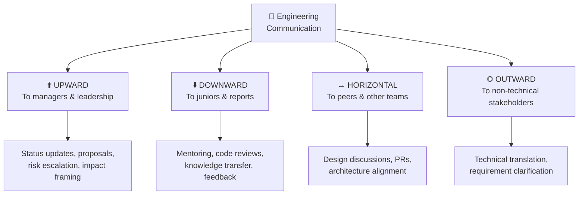

# 🎤 Chapter 5: Communication & Collaboration - The Engineer's Superpower 💬

---

## 🎯 Learning Objectives

By the end of this chapter, you will:
- ✅ Master **explaining technical concepts to non-technical stakeholders**
- ✅ Learn **cross-functional collaboration** strategies
- ✅ Understand **giving & receiving feedback** professionally
- ✅ Navigate **remote/distributed team** communication challenges
- ✅ Build compelling stories about communication skills

**🎮 XP Reward: +10 XP | Achievement: 🎤 Communicator Badge**

---

## 🧠 Why Communication is the #1 Career Multiplier

```
╔══════════════════════════════════════════════════════════════════╗
║                                                                  ║
║  The uncomfortable truth for engineers:                          ║
║                                                                  ║
║  👨‍💻 10x Engineer with poor communication = 2x impact            ║
║  👨‍💻 5x Engineer with great communication  = 20x impact           ║
║                                                                  ║
║  Communication is a MULTIPLIER, not an addition.                 ║
║                                                                  ║
╚══════════════════════════════════════════════════════════════════╝
```

### The Communication Spectrum for Engineers:

```
Level 1: 🤐 Can't explain what they built
Level 2: 🗣️ Can explain to other engineers
Level 3: 📊 Can explain to non-technical people
Level 4: 🎤 Can persuade & influence through communication
Level 5: 📝 Can write docs that scale beyond conversations
Level 6: 🌟 Can inspire & align entire teams through vision
```

> 💡 **Interview Truth**: Most engineers are stuck at Level 2-3. Getting to Level 4-5 is what gets you promoted to Senior and beyond.

---

## 🔑 The 4 Communication Dimensions in Engineering



---

## 🎯 Skill 1: Explaining Technical Concepts to Non-Technical People

### The "Elevator Analogy" Method 🛗

The best technical communicators have a **library of analogies** ready:

| Technical Concept | Non-Technical Analogy |
|-------------------|----------------------|
| **Load Balancer** | "Like a restaurant host who distributes diners evenly across waiters so no one gets overwhelmed" |
| **Caching** | "Like keeping a photocopy of a frequently-used document on your desk instead of walking to the filing cabinet every time" |
| **Microservices** | "Instead of one big restaurant kitchen, it's like a food court — each stall specializes in one dish and scales independently" |
| **API** | "Like a waiter — you don't go to the kitchen yourself, you tell the waiter what you want, and they bring it back" |
| **Database Index** | "Like the index at the back of a textbook — instead of reading every page to find a topic, you look up the page number directly" |
| **Circuit Breaker** | "Like a fuse in your house — if there's a problem, it trips to prevent the whole house from catching fire" |
| **Event-Driven** | "Like a newspaper subscription — instead of checking the store daily, the news comes to YOU when it's ready" |
| **Kubernetes** | "Like an airport control tower — it manages where all the planes (containers) go, handles failures, and ensures smooth operations" |

### The 3-Level Explanation Framework:

When asked to explain something, offer 3 levels:

```
👶 Level 1 (CEO/VP): ONE SENTENCE
   "We're making the system faster so customers wait less."

🧑‍💼 Level 2 (Product Manager): ONE PARAGRAPH  
   "Currently, our search takes 3 seconds because it queries 
   the database every time. By adding a caching layer, we'll 
   store popular results in memory, reducing search time to 
   200ms. This should increase conversion by 15% based on 
   industry data."

👨‍💻 Level 3 (Engineer): FULL DETAIL
   "We're implementing Redis as a read-through cache with 
   TTL-based invalidation for the product catalog endpoint.
   I'm using Spring Cache abstraction with @Cacheable annotations
   and a custom key generator based on search parameters..."
```

### 🌟 STAR Example: Communicating with Non-Technical Stakeholders

#### ⭐ SITUATION
> "Our product team wanted a 'real-time dashboard' showing live transaction data. They imagined something like a stock ticker — updating every millisecond. The engineering cost of true real-time was enormous (WebSocket infrastructure, event streaming, etc.) but what they actually NEEDED was 30-second refresh intervals."

#### 📋 TASK
> "I needed to bridge the gap between what they imagined ('real-time') and what would actually solve their business problem, without making them feel like I was dismissing their request."

#### ⚡ ACTION
> "I approached this communication challenge methodically:
> 
> **1. Asked 'Why' Not 'What'**:
> Instead of arguing about WebSockets, I asked: 'What decision will you make differently if data is 1 second old vs 30 seconds old?' They realized: for their use case (monitoring daily trends), 30 seconds was perfect.
> 
> **2. Used a Visual Demo**:
> I built two side-by-side mockups:
> - Left: Data updating every second (barely noticeable difference)
> - Right: Data updating every 30 seconds (same business insights!)
> 
> **3. Translated Cost to Business Terms**:
> NOT: 'WebSockets are expensive to maintain and require sticky sessions'
> INSTEAD: 'The 1-second version would cost $50K/month in infrastructure and delay the project by 6 weeks. The 30-second version delivers the same insights for $2K/month and ships in 2 weeks.'
> 
> **4. Gave Them a Choice**:
> 'You could have 30-second refresh in 2 weeks, or true real-time in 8 weeks. Which serves the Q3 goal better?'"

#### 🏆 RESULT
> "They chose the 30-second approach and it shipped in 10 days. The product manager later told me it was 'exactly what they needed.' They also appreciated that I didn't just say 'no' or talk in technical jargon — I helped them make an informed decision.
> 
> Lesson: Most communication problems between engineering and business aren't about intelligence — they're about vocabulary. Translate technical trade-offs into business impact."

---

## 🔑 Skill 2: Cross-Functional Collaboration

### The "Context Switching" Matrix

Different stakeholders need different communication styles:

| Audience | They Care About | Speak In Terms Of | Avoid |
|----------|----------------|-------------------|-------|
| 🎯 **Product Manager** | User value, deadlines, scope | Features, metrics, timelines | Architecture details |
| 💰 **Business/Finance** | Revenue, cost, risk | ROI, savings, growth % | Technical jargon |
| 🎨 **Designers** | UX, feasibility, constraints | Interactions, states, edge cases | Backend complexity |
| 🔒 **Security Team** | Vulnerabilities, compliance | Threats, controls, risk levels | Implementation details |
| 🏗️ **DevOps/SRE** | Reliability, operability | SLOs, runbooks, observability | Business logic |
| 👨‍💻 **Other Engineers** | Architecture, trade-offs | Patterns, performance, scalability | Business buzzwords |

### 🌟 STAR Example: Cross-Team Collaboration

#### ⭐ SITUATION
> "I was building a payment integration that required coordination between our backend team (Java/Spring Boot), the mobile team (React Native), the security team, and an external payment provider (Stripe). Each team had different priorities and timelines."

#### 📋 TASK
> "As the backend engineer owning the API layer, I needed to align all teams on the integration approach, API contract, and timeline — despite having no authority over the other teams."

#### ⚡ ACTION
> "I played the role of 'integration glue':
> 
> **1. Created a Shared Document** 📝
> I wrote a 2-page integration spec that used language EACH team could understand:
> - For mobile: API endpoints, response formats, error codes
> - For security: Data flow diagram, encryption approach, PCI compliance checkpoints
> - For the payment provider: Webhook requirements, idempotency keys
> 
> **2. Ran a 30-Minute Alignment Meeting** 🤝
> Agenda was tight: 
> - 5 min: Big picture overview
> - 10 min: Each team's concerns
> - 10 min: Decisions & action items
> - 5 min: Timeline alignment
> 
> **3. Established Communication Channels** 📱
> - Slack channel: `#payment-integration` for daily questions
> - Weekly 15-min standup (async-friendly for timezone differences)
> - Shared Notion page for decisions and FAQs
> 
> **4. Spoke Each Team's Language** 🌐
> When talking to security: focused on data protection, tokenization
> When talking to mobile: focused on user experience, error handling
> When talking to the PM: focused on timeline risk and user stories
> 
> **5. Created Contract Tests** 🧪
> I wrote API contract tests (using Spring Cloud Contract) that gave ALL teams confidence the integration points would work."

#### 🏆 RESULT
> "Delivered the payment integration 1 week ahead of schedule — unusual for a multi-team project. Zero integration bugs at launch. The security team complimented the clean data flow. The mobile team said our API was 'the best documented internal API they'd worked with.'
> 
> My manager noted this as a 'Staff-level behavior' — driving alignment without authority."

---

## 🔑 Skill 3: Giving & Receiving Feedback

### The SBI Model for Giving Feedback

```
╔══════════════════════════════════════════════════════════════╗
║  S ─── SITUATION  │ When/where did this happen?             ║
║  B ─── BEHAVIOR   │ What specific behavior did you observe? ║
║  I ─── IMPACT     │ What was the effect of that behavior?   ║
╚══════════════════════════════════════════════════════════════╝
```

#### Examples:

| Type | SBI Feedback |
|------|-------------|
| ✅ **Positive** | "During yesterday's design review **(S)**, when you created that sequence diagram to explain the async flow **(B)**, it made the discussion 10x more productive — everyone immediately understood the approach **(I)**." |
| 🔧 **Constructive** | "In the last 3 PRs **(S)**, I've noticed the error handling returns generic 500 errors without specific messages **(B)**. This makes it harder for the mobile team to show meaningful error states to users **(I)**." |

### ❌ Common Feedback Mistakes:

| Bad Feedback | Why It Fails | Better Version |
|-------------|-------------|---------------|
| "Your code is bad" | Vague, personal attack | "The nested loops in line 45 have O(n³) complexity — could we discuss alternatives?" |
| "You always do this" | Absolute language, accusatory | "I've noticed this pattern in the last 2 PRs" |
| "Just do it my way" | Dismissive, authoritarian | "Here's why I suggest this approach — what do you think?" |
| Feedback in public | Embarrassing, defensive reaction | Private 1:1 for constructive feedback |

### 🎮 The Feedback Receiving Framework:

```java
// How to receive feedback like a Senior Engineer:
public class FeedbackReceiver {
    
    public void receiveFeedback(String feedback) {
        // Step 1: Don't react — BREATHE
        pause();
        
        // Step 2: Listen fully (don't interrupt!)
        listenCompletely(feedback);
        
        // Step 3: Acknowledge and clarify
        say("Thank you for sharing that. " + 
            "Can you give me a specific example so I understand better?");
        
        // Step 4: Separate emotion from information
        String actionableInsight = extractInsight(feedback);
        
        // Step 5: Commit to action (or explain perspective)
        say("I can see how that affected the team. " +
            "Here's what I'll do differently...");
        
        // Step 6: Follow up later
        scheduleFollowUp("Did the change I made address your concern?");
    }
}
```

---

## 🔑 Skill 4: Written Communication (The Silent Superpower)

### The Engineer's Writing Portfolio:

| Document Type | Purpose | When Excellence Matters |
|--------------|---------|----------------------|
| 📝 **Design Docs/RFCs** | Propose & align on technical decisions | Promotions, cross-team work |
| 💬 **PR Descriptions** | Explain changes clearly | Code review efficiency |
| 🐛 **Bug Reports** | Reproduce & communicate issues | Incident management |
| 📧 **Status Updates** | Keep stakeholders informed | Manager relationships |
| 📖 **Documentation** | Enable others to use your systems | Team scalability |
| ⚠️ **Incident Reports** | Post-mortem communication | Leadership visibility |

### The "Good PR Description" Template:

```markdown
## What
Brief description of the change (1-2 sentences)

## Why
Business/technical reason this change is needed

## How
Key technical decisions and approach

## Testing
How this was verified

## Risks
Any potential issues or rollback plan

## Screenshots/Metrics (if applicable)
Before/after comparison
```

### The "Good Incident Report" Template:

```markdown
## Incident: [Service] — [Brief Description]
**Duration**: Start → End (total minutes)
**Severity**: P1/P2/P3
**Impact**: X users affected, $Y revenue impact

## Timeline
- HH:MM — First alert triggered
- HH:MM — Engineer engaged  
- HH:MM — Root cause identified
- HH:MM — Fix deployed
- HH:MM — Service fully recovered

## Root Cause
[1-2 paragraphs]

## Action Items
| # | Action | Owner | Deadline |
|---|--------|-------|----------|
| 1 | Add monitoring for X | @you | Next sprint |
```

---

## 🔑 Skill 5: Remote/Distributed Team Communication

### The Async-First Principle:

```
╔══════════════════════════════════════════════════════════╗
║  🏠 Remote Work Communication Hierarchy:                 ║
║                                                          ║
║  1️⃣ Document it (accessible to everyone, any time)       ║
║  2️⃣ Async message (Slack, email — read when convenient) ║
║  3️⃣ Scheduled meeting (only when 1 & 2 aren't enough)  ║
║  4️⃣ Immediate call (only for emergencies/blocking)      ║
║                                                          ║
║  Rule: Always ask "Can this be async?" FIRST             ║
╚══════════════════════════════════════════════════════════╝
```

### Communication Patterns for Distributed Teams:

| Challenge | Solution | Tool/Pattern |
|-----------|----------|-------------|
| Timezone gaps | Overlap hours + async handoff | "EOD summary" in Slack |
| Context loss | Written decisions, not verbal | ADR (Architecture Decision Records) |
| Feeling disconnected | Virtual social rituals | Coffee chats, game sessions |
| Meetings fatigue | Async video updates (Loom) | 5-min recorded updates |
| Unclear ownership | RACI matrix for projects | Confluence/Notion page |
| Blocked waiting for response | Set SLA for response times | "Respond within 4 hours" agreement |

---

## 🧩 Common Interview Questions & Frameworks

### Question Map:

| Question | Framework to Use | Key Signal |
|----------|-----------------|-----------|
| "How do you explain technical concepts to non-technical people?" | 3-Level Explanation + Analogy | Translation ability |
| "Describe working across teams" | Cross-functional collaboration STAR | Coordination without authority |
| "How do you give feedback to teammates?" | SBI model + Specific example | Emotional intelligence |
| "Tell me about a miscommunication" | What went wrong → What you learned → What you changed | Self-awareness |
| "How do you keep stakeholders informed?" | Status update cadence + escalation strategy | Proactive communication |
| "Describe communicating bad news" | Direct + empathetic + action-oriented | Maturity under pressure |

---

## 🎮 Practice Exercise: The Translation Challenge

Take these technical explanations and rewrite them for a **non-technical VP**:

### Challenge 1:
> **Technical**: "We need to implement a Redis-based distributed cache with LRU eviction and TTL-based expiration to reduce our PostgreSQL query load from 50K QPS to 5K QPS."

Write your non-technical version: ___________________

<details>
<summary>🔑 Example Answer</summary>

> "Our database is getting overwhelmed with requests, causing slow page loads. By adding a 'memory layer' that remembers frequently-accessed data, we can reduce database stress by 90% — making pages load 5x faster without buying more expensive database servers. Expected savings: $30K/month."

</details>

### Challenge 2:
> **Technical**: "The deployment pipeline needs a blue-green deployment strategy with automated canary analysis to reduce our MTTR from 45 minutes to under 5 minutes."

Write your non-technical version: ___________________

<details>
<summary>🔑 Example Answer</summary>

> "Currently, when we release updates, if something goes wrong it takes 45 minutes to fix — meaning customers are affected for that long. With the new approach, we can detect problems within 2 minutes and automatically switch back to the working version in seconds. Think of it like having two stages: we test on one stage privately before opening the curtain to the audience."

</details>

---

## ✅ Chapter 5 Summary

| # | Key Takeaway |
|---|-------------|
| 1 | Communication is a **multiplier**, not just an "add-on" skill |
| 2 | Master the **3-Level Explanation** (CEO → PM → Engineer) |
| 3 | **Analogies** are your best friend for technical translation |
| 4 | Cross-functional work needs **context-switching** communication styles |
| 5 | Use **SBI model** for structured feedback (Situation → Behavior → Impact) |
| 6 | **Written communication** (docs, PRs, reports) scales beyond conversations |
| 7 | Remote work requires **async-first** communication |
| 8 | Ask **"why"** before **"what"** when requirements seem unclear |
| 9 | Always frame technical decisions in **business impact** terms |
| 10 | Communication stories should show **bridge-building** between worlds |

---

## ⏭️ What's Next?

**[Chapter 6: Problem-Solving & Decision Making →](./06_Problem_Solving_And_Decision_Making.md)**

Next, we tackle the technical-behavioral hybrid: how you approach complex problems, make decisions with incomplete information, and handle ambiguity — the questions that separate Senior from Staff engineers.

---

*Chapter 5 Complete! 🎉 You've earned +10 XP and the 🎤 Communicator Badge!*
