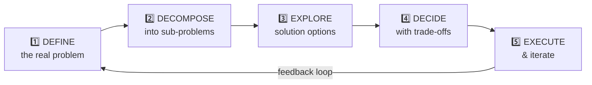

# 🏛️ Chapter 6: Problem-Solving & Decision Making 🧩

---

## 🎯 Learning Objectives

By the end of this chapter, you will:
- ✅ Master **technical decision-making frameworks** used by senior engineers
- ✅ Learn to navigate **ambiguity** — the hallmark of staff-level thinking
- ✅ Understand **trade-off analysis** and how to communicate it
- ✅ Build stories about **complex problem-solving** with clear methodology
- ✅ Know how to answer "How do you make decisions with incomplete information?"

**🎮 XP Reward: +10 XP | Achievement: 🏛️ Architect Badge**

---

## 🧠 The Engineer's Problem-Solving DNA

```
╔══════════════════════════════════════════════════════════════════╗
║                                                                  ║
║  The interviewers' #1 goal with problem-solving questions:       ║
║                                                                  ║
║  "Can this person think clearly under ambiguity?"                ║
║  "Do they have a METHODOLOGY, or do they just wing it?"          ║
║  "Can they make good decisions with imperfect information?"      ║
║                                                                  ║
║  🧠 It's not about the ANSWER — it's about the THINKING.        ║
║                                                                  ║
╚══════════════════════════════════════════════════════════════════╝
```

---

## 🔬 The 5-Step Engineering Problem-Solving Framework



### Step 1: 🔍 DEFINE — Is This Even the Right Problem?

> 💡 "A problem well-stated is a problem half-solved." — Charles Kettering

The #1 mistake engineers make: **solving the wrong problem**.

```java
// ❌ Jumping to solution without understanding the problem
public class JuniorApproach {
    void onBugReport(String report) {
        // "It's slow!" → immediately start optimizing code
        optimize(entireCodebase); // WRONG!
    }
}

// ✅ Senior approach: DEFINE first
public class SeniorApproach {
    void onBugReport(String report) {
        // Step 1: What EXACTLY is slow?
        identify(specificEndpoint);
        
        // Step 2: How slow? What's acceptable?
        measure(currentLatency, targetLatency);
        
        // Step 3: WHO is affected? How many users?
        assessImpact(affectedUsers, businessCost);
        
        // Step 4: WHEN did it start?
        correlate(recentChanges, deployments, trafficPatterns);
        
        // NOW we know the real problem — not "it's slow" but
        // "the /search endpoint P99 is 3s (target: 500ms) 
        //  affecting 40% of users since Tuesday's deploy"
    }
}
```

#### The "5 Whys" Technique:
```
Problem: "The API is slow"
  Why? → Database queries are taking too long
    Why? → Missing index on the orders table
      Why? → The new feature added a filter we didn't index
        Why? → Our PR review checklist doesn't include query plan analysis
          Why? → We never formalized our database change process

Root Cause: Missing process, not missing index!
Fix: Add query plan review to PR checklist (prevents future issues)
```

---

### Step 2: 🧩 DECOMPOSE — Break It Into Solvable Pieces

```
Big Scary Problem: "Make the system handle 10x traffic"

Decomposed:
├── 🔍 Identify bottlenecks (profile under load)
│   ├── Database queries (N+1, missing indexes)
│   ├── No caching layer
│   └── Synchronous external API calls
│
├── 🏗️ Address each bottleneck independently
│   ├── Add Redis cache for read-heavy endpoints
│   ├── Fix N+1 queries with batch fetching
│   └── Make external calls async with CompletableFuture
│
├── 🧪 Validate with load tests
│   ├── Gatling test simulating 10x load
│   └── Gradual rollout with feature flags
│
└── 📊 Monitor in production
    ├── Prometheus metrics for p50/p95/p99
    └── Alerts for regression
```

---

### Step 3: 💡 EXPLORE — Generate Multiple Options

The worst thing you can say in an interview: **"The solution is..."** (singular)

Senior engineers always present **options**:

```
╔══════════════════════════════════════════════════════════════╗
║  OPTION GENERATION FRAMEWORK                                 ║
╠══════════════════════════════════════════════════════════════╣
║                                                              ║
║  Option A: "The Quick Fix" (Short-term)                      ║
║     → Pros: Fast to implement, low risk                      ║
║     → Cons: Doesn't scale, creates tech debt                 ║
║                                                              ║
║  Option B: "The Right Fix" (Medium-term)                     ║
║     → Pros: Proper architecture, maintainable                ║
║     → Cons: Takes longer, needs design review                ║
║                                                              ║
║  Option C: "The Dream Fix" (Long-term)                       ║
║     → Pros: Future-proof, best architecture                  ║
║     → Cons: Over-engineering risk, delayed delivery          ║
║                                                              ║
║  RECOMMENDED: Usually Option B (or A → B phased approach)    ║
║                                                              ║
╚══════════════════════════════════════════════════════════════╝
```

---

### Step 4: ⚖️ DECIDE — The Trade-Off Matrix

Every engineering decision has trade-offs. Show you understand them:

| Decision Factor | Option A (Cache All) | Option B (Selective Cache) | Option C (No Cache, Scale DB) |
|----------------|---------------------|--------------------------|------------------------------|
| 🚀 **Performance Gain** | High (90% reduction) | Medium (70% reduction) | Low (30% with read replicas) |
| 💰 **Cost** | Medium (Redis cluster) | Low (single Redis) | High (DB scaling) |
| 🔧 **Complexity** | High (invalidation hell) | Medium (manageable) | Low (no new infra) |
| 🐛 **Risk** | Medium (stale data) | Low (controlled TTL) | Low (proven pattern) |
| ⏱️ **Time to Implement** | 3 weeks | 2 weeks | 4 weeks |
| 📈 **Future Scalability** | Excellent | Good | Limited |

**Decision**: Option B — best balance of performance, risk, and timeline.

---

### Step 5: 🚀 EXECUTE — With Feedback Loops

```
Execute → Measure → Learn → Adjust
    ↑                           ↓
    └───────────────────────────┘
```

---

## 🎯 Handling Ambiguity (The Staff Engineer Skill)

### What Interviewers Mean by "Ambiguity":

| Ambiguity Type | Example | How to Handle |
|---------------|---------|---------------|
| **Unclear requirements** | "Make it faster" — how fast? | Ask clarifying questions, propose metrics |
| **Multiple valid approaches** | REST vs gRPC vs GraphQL | Establish criteria, then evaluate |
| **Unknown unknowns** | Building in a new domain | Start with research spike, prototype |
| **Conflicting constraints** | "Ship fast AND don't break anything" | Make trade-offs explicit, get sign-off |
| **Missing data** | "Will users want this feature?" | Propose experiment/MVP to gather data |

### The "Disambiguate Then Decide" Framework:

```
1. ACKNOWLEDGE the ambiguity
   "This is an open-ended problem. Let me break it down..."

2. STATE your assumptions  
   "I'm assuming we prioritize latency over consistency. 
    Is that correct?"

3. IDENTIFY what you need to know
   "Before deciding, I need to understand: 
    - Expected traffic patterns
    - Acceptable data staleness
    - Budget constraints"

4. MAKE PROGRESS despite uncertainty
   "Given what we know, I'd recommend starting with X,
    while we gather data on Y to validate the approach."
```

### 🌟 STAR Example: Making Decisions with Incomplete Information

#### ⭐ SITUATION
> "We received a vague requirement from the product team: 'Make the checkout process real-time.' No specifications on what 'real-time' meant, no performance targets, no user research data, and a 4-week deadline."

#### 📋 TASK
> "As the senior backend developer, I needed to turn this ambiguous requirement into a concrete technical plan — fast — without spending weeks in analysis paralysis."

#### ⚡ ACTION
> "I applied a structured disambiguation process:
> 
> **Step 1: Ask Smart Questions (Day 1)**
> - 'Real-time for WHO?' → Discovered it was for inventory updates, not the entire checkout
> - 'What does failure look like?' → User sees 'In Stock' but item is actually sold out
> - 'How often does this happen today?' → ~200 times/day during flash sales
> 
> **Step 2: Define 'Good Enough' Criteria (Day 1-2)**
> - Acceptable staleness: Under 5 seconds (not milliseconds — huge simplification!)
> - Success metric: Reduce 'false stock' incidents from 200/day to under 10/day
> 
> **Step 3: Start Small, Learn Fast (Day 3-5)**
> - Built a PoC with Redis pub/sub for inventory updates
> - Tested with simulated flash sale traffic
> - Discovered that 2-second propagation was achievable with simple approach
> 
> **Step 4: Decide with Explicit Trade-offs (Day 5)**
> - Presented the team with options and my recommendation
> - 'We can get 2-second freshness with Redis pub/sub (2 weeks) or sub-second with Kafka Streams (6 weeks). Given our 4-week deadline and the 5-second target, I recommend Redis.'
> 
> **Step 5: Build with Measurement (Week 2-3)**
> - Implemented the solution with comprehensive metrics
> - Added Prometheus gauges for stock-accuracy latency
> - Built rollback plan: feature flag to revert to polling"

#### 🏆 RESULT
> "Delivered in 3 weeks. False stock incidents dropped from 200/day to 3/day (98.5% reduction). The PM said: 'This is exactly what I meant by real-time — I just didn't know how to specify it.'
> 
> Key lesson: Don't wait for perfect requirements. Define 'good enough,' build, measure, and iterate. Most ambiguity can be resolved with 3-5 good questions."

---

## 🧠 Decision-Making Frameworks for Engineers

### Framework 1: The Reversibility Test

```
╔══════════════════════════════════════════════════════════════╗
║  ONE-WAY DOOR vs TWO-WAY DOOR (Amazon's Framework)          ║
╠══════════════════════════════════════════════════════════════╣
║                                                              ║
║  🚪 ONE-WAY DOOR (Type 1 — Irreversible):                   ║
║     • Database schema migration                              ║
║     • Choosing a cloud provider                              ║
║     • Public API contract                                    ║
║     → Requires: More analysis, group decision, escalation    ║
║                                                              ║
║  🚪🚪 TWO-WAY DOOR (Type 2 — Reversible):                   ║
║     • Choosing a library/framework                           ║
║     • Feature behind a flag                                  ║
║     • Internal refactoring                                   ║
║     → Requires: Quick decision, individual judgment, bias    ║
║       toward action                                          ║
║                                                              ║
║  RULE: Most decisions are Type 2.                            ║
║        Don't overthink reversible decisions.                  ║
║                                                              ║
╚══════════════════════════════════════════════════════════════╝
```

### Framework 2: The "Regret Minimization" Framework

```
Ask yourself: "In 6 months, which decision would I regret more?"

Scenario: Ship with known technical debt vs Delay launch by 2 weeks

Regret Analysis:
├── If we ship now and it breaks: Weekend incident, 
│   customer impact, team morale hit, reputation damage
│
└── If we delay 2 weeks: Miss the launch window, 
    competitor advantage, team frustration with "perfection"

Decision: Ship now WITH a feature flag + monitoring + 
          scheduled tech debt sprint immediately after
```

### Framework 3: The RAPID Decision Model

```
R — RECOMMEND: Who proposes the solution? (Often IC engineer)
A — AGREE: Who must agree? (Blocking stakeholders)
P — PERFORM: Who implements? (Engineering team)
I — INPUT: Who provides input? (Anyone with relevant context)
D — DECIDE: Who makes the final call? (One person — NOT a committee)
```

---

## 🎮 The "What Would You Do?" Interview Game

### Scenario 1: The Impossible Deadline
> Your manager says the feature must ship in 2 weeks. Your estimate is 6 weeks. What do you do?

<details>
<summary>🔑 Strong Answer Framework</summary>

1. **Don't just say "no"** — present options
2. **Decompose**: What can ship in 2 weeks? What can wait?
3. **Present trade-offs**:
   - "We can ship the MVP (core flow) in 2 weeks, but without edge case handling"
   - "We can ship everything in 6 weeks with full quality"
   - "We can ship in 3 weeks if we add 2 engineers and accept some manual processes initially"
4. **Recommend**: "I suggest shipping the MVP in 2 weeks behind a feature flag, with full rollout in week 6"
5. **Get explicit agreement** on what's being traded

</details>

### Scenario 2: The Technology Gamble
> A new technology (e.g., Reactive Spring WebFlux) could solve your performance problem perfectly, but no one on the team knows it. The alternative is a proven approach that gets you 70% of the way. What do you choose?

<details>
<summary>🔑 Strong Answer Framework</summary>

1. **Assess risk**: How critical is this system? (Payments = proven tech. Internal tool = experiment ok)
2. **Time-box the unknown**: "Can we learn enough in a 2-day spike to validate feasibility?"
3. **Consider the team**: Will this create a single-point-of-failure person?
4. **Decision matrix**:
   - If timeline is tight → proven approach (70% is usually enough)
   - If team growth matters → invest in new tech (the 30% often becomes important later)
   - If system is critical → NEVER bet production on unproven tech
5. **My typical recommendation**: "Start with proven approach, build abstraction layer that allows future migration to new tech when the team is ready"

</details>

### Scenario 3: The Data vs Gut Decision
> You have strong intuition that the current architecture will fail at 10x scale, but you have no data to prove it. Your manager says "let's wait until we see the problem." What do you do?

<details>
<summary>🔑 Strong Answer Framework</summary>

1. **Respect their position** — they might be right about priorities
2. **Generate data cheaply**: "Can I spend 2 hours writing a load test to validate my concern?"
3. **Quantify the risk**: "If I'm right and we wait, the fix will cost 3 months. If I'm wrong, we lost 2 hours on a load test."
4. **Propose lightweight preparation**: "Even if we don't rebuild now, can we add instrumentation so we'll see the problem coming early?"
5. **Document your concern**: "I'd like to write down my concern so we can track it. If I'm wrong, great. If I'm right, we'll be ready."

</details>

---

## 🏢 How Big Tech Tests Problem-Solving

### Amazon LP: "Dive Deep"
```
What they want: 
• You don't accept surface-level answers
• You dig into root causes
• You use data to inform decisions

Sample question: "Tell me about a time you went 
beyond the obvious to find the root cause"
```

### Google: "Cognitive Ability"
```
What they want:
• Structured thinking process
• Ability to handle ambiguity
• Creative problem-solving

Sample question: "How would you approach a problem 
you've never seen before?"
```

### Amazon LP: "Bias for Action"
```
What they want:
• You don't get paralyzed by analysis
• You make progress with imperfect info
• You can distinguish reversible from irreversible decisions

Sample question: "Tell me about a time you made a 
decision without having all the data"
```

---

## 🧩 The Problem-Solving Story Template

Use this template to structure any problem-solving STAR story:

```markdown
SITUATION: [What was the problem? Why was it hard?]

TASK: [What was YOUR specific role in solving it?]

ACTION:
1. DEFINED the real problem (not symptoms)
   → [What was the actual root cause?]
   
2. EXPLORED options (generated alternatives)
   → Option A: [description + trade-offs]
   → Option B: [description + trade-offs]
   → Option C: [description + trade-offs]
   
3. DECIDED with rationale
   → "I chose Option B because [specific reasons]"
   
4. EXECUTED with measurement
   → [What did you build? How did you validate?]
   
5. ITERATED based on results
   → [What did you adjust after initial deployment?]

RESULT: [Quantified outcomes]
REFLECTION: [What would you do differently?]
```

---

## ✅ Chapter 6 Summary

| # | Key Takeaway |
|---|-------------|
| 1 | Problem-solving questions test your **THINKING PROCESS**, not the answer |
| 2 | Always **DEFINE the real problem** before solving (5 Whys technique) |
| 3 | **Decompose** big problems into independent, solvable pieces |
| 4 | Present **multiple options** with trade-offs — never just one solution |
| 5 | Use the **reversibility test** to calibrate decision speed |
| 6 | Handle ambiguity by **asking questions, stating assumptions, making progress** |
| 7 | **Data > intuition** — but don't let perfect data paralyze you |
| 8 | Show **iteration** — first solution rarely stays unchanged |
| 9 | Frame decisions in **business impact**, not just technical elegance |
| 10 | The best answer to "How do you decide?" is "**It depends — here's my framework**" |

---

## ⏭️ What's Next?

**[Chapter 7: Growth Mindset & Adaptability →](./07_Growth_Mindset_And_Adaptability.md)**

Next, we explore how to talk about failures, learning, and adaptability — the questions that reveal your character and resilience as an engineer.

---

*Chapter 6 Complete! 🎉 You've earned +10 XP and the 🏛️ Architect Badge!*
