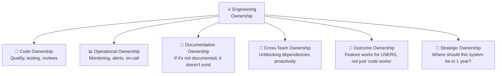

# ⚔️ Chapter 9: Ownership & Accountability - The Career Accelerator 🚀

---

## 🎯 Learning Objectives

By the end of this chapter, you will:
- ✅ Understand **ownership vs responsibility** (they're NOT the same!)
- ✅ Master the **End-to-End Ownership** mindset that gets promotions
- ✅ Learn to discuss **taking initiative** without sounding arrogant
- ✅ Handle questions about **mistakes and accountability**
- ✅ Build stories about **going above and beyond** authentically

**🎮 XP Reward: +10 XP | Achievement: ⚔️ Warrior Badge**

---

## 🧠 Ownership vs Responsibility: The Critical Difference

```
╔══════════════════════════════════════════════════════════════════╗
║                                                                  ║
║  📋 RESPONSIBILITY (what you're assigned):                       ║
║     "I'll complete the tickets assigned to me in this sprint"    ║
║                                                                  ║
║  ⚔️ OWNERSHIP (what you choose to own):                          ║
║     "I ensure this service works reliably in production,         ║
║      regardless of what's in my sprint tickets"                  ║
║                                                                  ║
║  📋 Responsibility = Doing your job                              ║
║  ⚔️ Ownership = Caring about the OUTCOME, not just the task     ║
║                                                                  ║
╚══════════════════════════════════════════════════════════════════╝
```

### The Ownership Spectrum:

```
Level 1: 🐣 "I do what I'm told"
         → Does assigned work, waits for instructions

Level 2: 🐥 "I complete my tasks well"
         → Delivers quality work on assigned tasks

Level 3: 🐓 "I own my component"
         → Proactively improves what they own, monitors it

Level 4: 🦅 "I own the outcome"
         → Thinks beyond their code — considers users, business,
           team, and drives the RIGHT results

Level 5: 🦈 "I own what SHOULD exist"
         → Identifies gaps nobody assigned, creates solutions
           the org didn't know it needed
```

> 💡 **Interview Truth**: Most companies hire for Level 3+. FAANG hires for Level 4+. Staff+ engineers operate at Level 5.

---

## 🎯 The 6 Dimensions of Engineering Ownership



### What Each Dimension Looks Like:

| Dimension | Non-Owner | Owner |
|-----------|-----------|-------|
| 🔧 **Code** | "My code compiles" | "My code is tested, reviewed, documented, and monitored" |
| 📊 **Operations** | "It works on my machine" | "I have alerts for this in production and a runbook for failures" |
| 📝 **Documentation** | "People can read the code" | "A new hire can understand and contribute within a week" |
| 🤝 **Cross-Team** | "I'm blocked by Team X" | "I reached out to Team X, proposed a solution, and offered to help" |
| 🎯 **Outcome** | "I built what the ticket said" | "I validated with users that this actually solves their problem" |
| 🔮 **Strategic** | "I'll build what you ask" | "Based on our growth trajectory, we should consider Y by Q3" |

---

## 🌟 Complete STAR Examples

### Question: "Tell me about a time you went above and beyond"

#### ⭐ SITUATION
> "Our team shipped a new checkout flow optimized for conversion. I was the backend developer who built the payment processing API. After launch, the PM reported: 'Conversion is up 5% — great success!' Everyone was happy."

#### 📋 TASK
> "Technically, my job was done. The feature was shipped, metrics were positive, and the PM was satisfied. But something nagged me — I'd noticed in the logs that while conversion was up, payment FAILURE rates had also increased by 2%."

#### ⚡ ACTION
> "Nobody asked me to investigate this. It wasn't a bug — it was a side effect. But I chose to own the outcome, not just the task:
> 
> **What I Did (Unprompted):**
> 
> 1. **Dug into the data**: I queried our payment logs and found that the new flow was converting users who had EXPIRED cards or insufficient funds — they were getting further in checkout before failing.
> 
> 2. **Quantified the problem**: 2% of 500K daily checkouts = 10,000 frustrated users daily seeing 'Payment Failed' at the last step. That's BAD UX.
> 
> 3. **Proposed a solution**: I wrote a brief proposal for 'pre-flight payment validation' — check card validity BEFORE the final submit button.
> 
> 4. **Built a PoC**: Over 2 days, I implemented Stripe's card check API integration to validate card status early in the flow.
> 
> 5. **Presented to the PM**: 'Hey, we're celebrating 5% conversion up, but we're also frustrating 10K users/day. Here's a fix I prototyped that could reduce payment failures by 80%.'
> 
> 6. **Collaborated with frontend**: Paired with the frontend developer to integrate the early validation UX."

#### 🏆 RESULT
> "Pre-flight validation reduced payment failures from 2% to 0.4%. That's 8,000 fewer frustrated users daily. The PM estimated this saved $200K annually in support tickets and lost customers.
> 
> My manager's feedback: 'This is what ownership looks like. Nobody asked you to do this — you saw the full picture and acted.'
> 
> This was cited as a key example in my promotion to Senior Engineer.
> 
> Lesson: 'Done' isn't when the code ships. 'Done' is when the OUTCOME is right."

---

### Question: "Tell me about a mistake you made and how you handled it"

#### ⭐ SITUATION
> "I accidentally deleted a production Redis cache cluster while performing what I thought was a staging environment cleanup. This caused a cascading failure — our product catalog API went from 50ms response time to 8 seconds (hitting the cold database directly), affecting all customers during peak hours."

#### 📋 TASK
> "My immediate task was to restore service, but my bigger responsibility was to own this mistake completely — communicate transparently, fix the issue, and prevent it from ever happening again."

#### ⚡ ACTION
> "Here's exactly what I did in the next 4 hours:
> 
> **Minute 0-5: Acknowledge immediately**
> - Announced in our #incidents channel: 'I may have caused the current latency spike. Investigating.'
> - No hiding, no delay, no hoping it would fix itself
> 
> **Minute 5-30: Restore service**
> - Spun up new Redis cluster from last backup (15 min to warm up)
> - Temporarily increased database connection pool to handle direct load
> - Set up manual cache warming for critical keys
> 
> **Minute 30-60: Full restoration**
> - Redis cache warmed, response times back to normal
> - Verified all services recovering via Grafana dashboards
> - Sent 'all clear' communication with timeline
> 
> **Hour 2-4: Post-mortem & prevention**
> - Wrote a blameless post-mortem (blamed the PROCESS, not myself)
> - Identified root cause: production and staging clusters had nearly identical names (`redis-prod-catalog` vs `redis-stg-catalog`)
> - Proposed and implemented fixes:
>   - Added deletion protection for production resources
>   - Created mandatory confirmation step with resource name verification
>   - Color-coded our terminal prompts (red = production)
>   - Added `aws-vault` with separate profiles to prevent accidental cross-environment actions"

#### 🏆 RESULT
> "Total customer impact: 25 minutes of degraded performance. No data loss.
> 
> The post-mortem was praised by leadership as 'exactly how to handle incidents.' Three prevention measures became org-wide standards.
> 
> What I learned: 
> - Mistakes in ops often come from ambiguous naming and insufficient guardrails
> - Owning mistakes IMMEDIATELY builds more trust than hiding them
> - The post-mortem is more valuable than the fix — it prevents FUTURE incidents
> 
> My director told me: 'I'd rather have an engineer who breaks things and owns it than one who never takes risks. Your response was exemplary.'"

---

### Question: "Tell me about a time you took initiative without being asked"

#### ⭐ SITUATION
> "Our Spring Boot services took 12 minutes to deploy through our CI/CD pipeline. Every developer experienced this pain daily — at least 4-5 deploys per day meant nearly an hour of waiting time per person. Nobody had prioritized fixing it because it wasn't 'a product feature.'"

#### 📋 TASK
> "Nobody assigned this to me. It wasn't in any sprint. But I calculated: 8 developers × 5 deploys × 12 minutes = 8 hours of lost engineering time DAILY. That's basically losing one full engineer's productivity to pipeline waste."

#### ⚡ ACTION
> "I treated this like a side-quest in a game — high value, self-motivated:
> 
> **Phase 1: Measure (1 day)**
> - Instrumented the pipeline to identify where time was spent
> - Found: 4 min in dependency download, 5 min in integration tests, 3 min in Docker build
> 
> **Phase 2: Quick Wins (2 days)**
> - Added dependency caching (Gradle build cache + Docker layer caching)
> - Parallelized independent test suites
> - Used multi-stage Docker builds with cache-from
> 
> **Phase 3: Optimize (3 days — over lunches/slack time)**
> - Replaced full integration tests with contract tests for CI (full tests in nightly)
> - Implemented incremental Docker builds using Jib (no Docker daemon needed)
> - Created shared base images for common dependencies
> 
> **Phase 4: Share & Standardize (1 day)**
> - Documented the optimizations in a runbook
> - Created a reusable pipeline template for all services
> - Presented results at team standup"

#### 🏆 RESULT
> "Pipeline time: 12 minutes → 2.5 minutes (79% reduction).
> Daily time saved: 8 hours across the team.
> Monthly time saved: ~160 engineering hours (basically 1 full engineer).
> Annual estimated value: ~$150K in recovered productivity.
> 
> Every engineer on the team thanked me. The template was adopted by 4 other teams. This went into my promotion packet as 'initiative and engineering excellence.'
> 
> Lesson: The best initiative isn't the flashiest — it's the thing that makes EVERYONE'S life better, even if it's 'just infrastructure.'"

---

## 🎮 The Ownership Mindset Assessment

Rate yourself on each ownership behavior:

| Behavior | Never | Sometimes | Always |
|----------|:-----:|:---------:|:------:|
| I monitor my services in production, not just deploy and forget | ⬜ | ⬜ | ⬜ |
| I investigate anomalies even if they're not "my bug" | ⬜ | ⬜ | ⬜ |
| I document my systems for others to understand | ⬜ | ⬜ | ⬜ |
| I communicate blockers proactively, not when asked | ⬜ | ⬜ | ⬜ |
| I volunteer for tasks nobody wants to do | ⬜ | ⬜ | ⬜ |
| I admit mistakes immediately and fix them | ⬜ | ⬜ | ⬜ |
| I think about what could go wrong BEFORE it does | ⬜ | ⬜ | ⬜ |
| I follow up on work until the OUTCOME is achieved, not just the task | ⬜ | ⬜ | ⬜ |
| I improve processes/tools for the whole team | ⬜ | ⬜ | ⬜ |
| I raise concerns about quality/risk even if it's uncomfortable | ⬜ | ⬜ | ⬜ |

**Scoring**: "Always" on 7+ = Strong ownership mindset. Less = growth opportunity!

---

## 🏢 Company-Specific Ownership Evaluation

### Amazon LP: "Ownership"
```
"Leaders are owners. They think long term and don't sacrifice 
 long-term value for short-term results. They act on behalf of 
 the entire company, beyond just their own team."

Key signals Amazon looks for:
✅ "I own it" mentality (not "that's not my team's responsibility")
✅ Long-term thinking (not just sprint-to-sprint)
✅ Cross-boundary action (helping other teams proactively)
✅ "The buck stops here" accountability
```

### Google: "Ownership & Initiative" (part of Leadership)
```
Key signals Google evaluates:
✅ Proactive problem identification
✅ Self-directed improvement
✅ End-to-end thinking (from code to user impact)
✅ Taking on unglamorous but important work
```

### Netflix: "Judgment + Selflessness"
```
Netflix values:
✅ "Do what's best for Netflix, not what's best for you"
✅ Make the company better, not just your code
✅ Own the outcome for customers
✅ Treat company resources as your own
```

---

## 🚫 Ownership Anti-Patterns (Red Flags)

| Anti-Pattern | What It Signals | Better Approach |
|-------------|----------------|----------------|
| 🔴 "That's not my job" | Limited thinking, siloed | "Let me see how I can help or connect you to the right person" |
| 🔴 "It works on my machine" | Doesn't own production | Own it until it works for USERS |
| 🔴 "Nobody told me to do that" | Reactive, needs instructions | Proactively identify what needs doing |
| 🔴 "The spec was wrong" | Blaming others | "I should have validated the spec earlier" |
| 🔴 "I just write code" | Narrow scope | Think about the full product lifecycle |
| 🔴 "We'll fix it later" (and never does) | Technical debt avoidance | Create a ticket, schedule it, follow through |

---

## ✅ Chapter 9 Summary

| # | Key Takeaway |
|---|-------------|
| 1 | **Ownership ≠ Responsibility** — ownership is about OUTCOMES, not tasks |
| 2 | The **5 levels** range from "do what I'm told" to "create what should exist" |
| 3 | **6 dimensions** of ownership: Code, Ops, Docs, Cross-team, Outcome, Strategy |
| 4 | "Going above and beyond" means **owning the outcome**, not just the ticket |
| 5 | **Mistakes + immediate ownership** = trust (hiding mistakes = termination) |
| 6 | Best initiative stories: solve **widespread pain** nobody assigned |
| 7 | Own your mistakes with: **Acknowledge → Fix → Prevent → Share** |
| 8 | Companies promote engineers who think **beyond their immediate scope** |
| 9 | **"Done"** isn't when code ships — it's when the user outcome is achieved |
| 10 | Ownership is the #1 predictor of career acceleration in engineering |

---

## ⏭️ What's Next?

**[Chapter 10: Big Tech Company-Specific Guide →](./10_Big_Tech_Company_Specific_Guide.md)**

Next, we dive deep into company-specific behavioral preparation — Amazon's 16 Leadership Principles, Google's Googleyness, Meta's core values, and more. Learn exactly what each company evaluates and how to tailor your stories.

---

*Chapter 9 Complete! 🎉 You've earned +10 XP and the ⚔️ Warrior Badge!*

---

*Previous: [← Time Management And Prioritization](./08_Time_Management_And_Prioritization.md) | Next: [Big Tech Company Specific Guide →](./10_Big_Tech_Company_Specific_Guide.md)*
