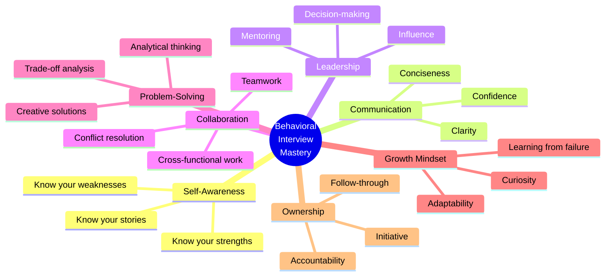

# 🎯 Engineering Behavioral Interview Mastery: The Complete Tutorial Series 🚀

---

## 🌟 Welcome to Your Behavioral Interview Journey!

> **"Hiring for attitude, training for skill."** — Southwest Airlines Principle  
> **"The best predictor of future behavior is past behavior."** — Every Hiring Manager Ever

Welcome to the most comprehensive, gamified, and deeply explained **Engineering Behavioral Interview** tutorial series designed specifically for **Software Engineers**, **Java Developers**, and **Tech Professionals** preparing to crack top-tier company interviews!

This isn't just another boring list of "tell me about a time when..." questions — this is your **complete battle plan** for mastering the human side of engineering interviews.

---

## 🧠 Why Behavioral Questions Matter More Than You Think

```
╔══════════════════════════════════════════════════════════════════╗
║  🏢 Technical Skills get you the INTERVIEW                      ║
║  🧠 Behavioral Skills get you the JOB                           ║
║  🚀 Combined Mastery gets you the CAREER                        ║
╚══════════════════════════════════════════════════════════════════╝
```

### The Hard Truth 📊

| Company | Behavioral Weight in Hiring | # of Behavioral Rounds |
|---------|---------------------------|----------------------|
| 🍎 Apple | 40% | 2-3 rounds |
| 🔍 Google | 35% (Googleyness & Leadership) | 1-2 rounds |
| 📦 Amazon | 50% (Leadership Principles) | Every single round |
| 🔵 Meta | 30% | 1 dedicated round |
| 🟢 Spotify | 45% | 2 rounds |
| 💼 Microsoft | 40% | 2 rounds |
| 🎮 Netflix | 50% (Culture fit) | Multiple rounds |

> 💡 **Fun Fact**: Amazon rejects more candidates for behavioral reasons than technical ones. Their 16 Leadership Principles aren't just wall posters — they're the evaluation framework!

---

## 🎮 How This Tutorial Series Works (Gamified Approach)

### 🏆 Achievement System

| Level | Title | What You'll Master | Badge |
|-------|-------|-------------------|-------|
| 1️⃣ | **Behavioral Rookie** | Understanding what behavioral interviews are | 🎖️ Foundation Badge |
| 2️⃣ | **STAR Apprentice** | Mastering the STAR framework | ⭐ STAR Badge |
| 3️⃣ | **Story Crafter** | Building compelling narratives | 📖 Storyteller Badge |
| 4️⃣ | **Leadership Explorer** | Leadership & influence answers | 👑 Leader Badge |
| 5️⃣ | **Conflict Navigator** | Handling disagreements gracefully | 🕊️ Peacemaker Badge |
| 6️⃣ | **Communication Master** | Clear, impactful communication | 🎤 Communicator Badge |
| 7️⃣ | **Decision Architect** | Problem-solving & judgment | 🏛️ Architect Badge |
| 8️⃣ | **Growth Champion** | Adaptability & learning mindset | 🌱 Growth Badge |
| 9️⃣ | **Ownership Warrior** | Accountability & initiative | ⚔️ Warrior Badge |
| 🔟 | **Interview Legend** | Big Tech specific mastery | 👑 Legend Status |

### 📈 XP (Experience Points) System

- 📖 Reading a chapter = **+10 XP**
- ✍️ Completing exercises = **+25 XP**
- 🎯 Crafting your own STAR story = **+50 XP**
- 🧩 Solving puzzle scenarios = **+30 XP**
- 🏆 Mock interview practice = **+100 XP**
- 💡 Teaching someone else = **+200 XP** (The Feynman Technique!)

---

## 📚 Complete Tutorial Series - Learning Path

```
🎬 START HERE! 
│
├─► 📖 Chapter 1: Foundations of Behavioral Interviews
│   └─► [01_Foundations_Of_Behavioral_Interviews.md](./01_Foundations_Of_Behavioral_Interviews.md)
│       ├── What are behavioral interviews & why they exist
│       ├── The psychology behind behavioral questions
│       ├── How interviewers evaluate your answers
│       └── Common myths debunked
│
├─► ⭐ Chapter 2: STAR Method Mastery
│   └─► [02_STAR_Method_Mastery.md](./02_STAR_Method_Mastery.md)
│       ├── Deep dive into STAR framework
│       ├── Advanced variations (STAR+, CAR, PAR)
│       ├── Story banking technique
│       └── Practice templates & exercises
│
├─► 👑 Chapter 3: Leadership & Influence
│   └─► [03_Leadership_And_Influence.md](./03_Leadership_And_Influence.md)
│       ├── Leading without authority
│       ├── Influencing technical decisions
│       ├── Mentoring & growing others
│       └── Driving organizational change
│
├─► 🕊️ Chapter 4: Conflict Resolution & Teamwork
│   └─► [04_Conflict_Resolution_And_Teamwork.md](./04_Conflict_Resolution_And_Teamwork.md)
│       ├── Handling disagreements professionally
│       ├── Working with difficult personalities
│       ├── Building consensus
│       └── Team dynamics & collaboration
│
├─► 🎤 Chapter 5: Communication & Collaboration
│   └─► [05_Communication_And_Collaboration.md](./05_Communication_And_Collaboration.md)
│       ├── Communicating technical concepts to non-technical stakeholders
│       ├── Cross-functional collaboration
│       ├── Giving & receiving feedback
│       └── Remote/distributed team communication
│
├─► 🏛️ Chapter 6: Problem-Solving & Decision Making
│   └─► [06_Problem_Solving_And_Decision_Making.md](./06_Problem_Solving_And_Decision_Making.md)
│       ├── Technical decision-making frameworks
│       ├── Handling ambiguity
│       ├── Trade-off analysis
│       └── Risk assessment & mitigation
│
├─► 🌱 Chapter 7: Growth Mindset & Adaptability
│   └─► [07_Growth_Mindset_And_Adaptability.md](./07_Growth_Mindset_And_Adaptability.md)
│       ├── Learning from failures
│       ├── Adapting to change
│       ├── Continuous improvement
│       └── Handling feedback & criticism
│
├─► ⏰ Chapter 8: Time Management & Prioritization
│   └─► [08_Time_Management_And_Prioritization.md](./08_Time_Management_And_Prioritization.md)
│       ├── Managing competing priorities
│       ├── Handling tight deadlines
│       ├── Scope management
│       └── Work-life balance discussions
│
├─► ⚔️ Chapter 9: Ownership & Accountability
│   └─► [09_Ownership_And_Accountability.md](./09_Ownership_And_Accountability.md)
│       ├── Taking initiative
│       ├── Going above & beyond
│       ├── Handling mistakes & failures
│       └── End-to-end ownership mindset
│
├─► 🏢 Chapter 10: Big Tech Company-Specific Guide
│   └─► [10_Big_Tech_Company_Specific_Guide.md](./10_Big_Tech_Company_Specific_Guide.md)
│       ├── Amazon Leadership Principles breakdown
│       ├── Google "Googleyness" evaluation
│       ├── Meta core values alignment
│       ├── Microsoft growth mindset culture
│       └── Netflix culture deck analysis
│
├─► 🧩 Chapter 11: Practice Exercises & Mock Scenarios
│   └─► [11_Practice_Exercises_And_Gamification.md](./11_Practice_Exercises_And_Gamification.md)
│       ├── 50+ practice questions with frameworks
│       ├── Role-play scenarios
│       ├── Self-assessment rubrics
│       └── Mock interview scripts
│
└─► 📋 Chapter 12: Cheat Sheet & Quick Reference
    └─► [12_CheatSheet_And_Quick_Reference.md](./12_CheatSheet_And_Quick_Reference.md)
        ├── One-page summary of all frameworks
        ├── Question-to-framework mapping
        ├── Last-minute preparation checklist
        └── Red flags to avoid
```

---

## 🧠 The Core Philosophy: Roots, Not Tools

```
🌳 Think of Behavioral Skills Like a Tree:

         🍎 🍎 🍎 (Fruits = Job Offers)
        /    |    \
       /     |     \
   🌿🌿🌿🌿🌿🌿🌿🌿 (Branches = Specific Answers)
      \      |     /
       \     |    /
        🪵🪵🪵🪵 (Trunk = Frameworks like STAR)
            |
            |
        🌱🌱🌱🌱 (Roots = Core Soft Skills & Mindset)
```

> **Our Focus**: We build from the **roots up**. Tools and specific answers come and go, but the fundamental **communication**, **leadership**, and **problem-solving** skills remain constant across every company, every role, and every era.

---

## 🎯 Who Is This For?

| Audience | What You'll Get |
|----------|----------------|
| 🧑‍💻 **Junior Developers** | Build a strong foundation for your first big interviews |
| 👨‍💻 **Mid-Level Engineers** | Level up your storytelling and leadership narrative |
| 👩‍💻 **Senior Engineers** | Craft compelling stories about system-level impact |
| ☕ **Java Developers** | Java/Spring Boot specific examples throughout |
| 🔄 **Career Switchers** | Translate your experience into tech behavioral answers |
| 🎯 **FAANG Aspirants** | Company-specific preparation strategies |

---

## 🔑 The 7 Pillars of Behavioral Interview Success



---

## 📊 Quick Self-Assessment: Where Are You Now?

Before diving in, rate yourself honestly (1-5) on each pillar:

| Skill Area | 1 (Beginner) | 2 (Basic) | 3 (Intermediate) | 4 (Advanced) | 5 (Expert) |
|-----------|:---:|:---:|:---:|:---:|:---:|
| STAR Method Fluency | ⬜ | ⬜ | ⬜ | ⬜ | ⬜ |
| Leadership Stories | ⬜ | ⬜ | ⬜ | ⬜ | ⬜ |
| Conflict Resolution | ⬜ | ⬜ | ⬜ | ⬜ | ⬜ |
| Communication Clarity | ⬜ | ⬜ | ⬜ | ⬜ | ⬜ |
| Problem-Solving Narrative | ⬜ | ⬜ | ⬜ | ⬜ | ⬜ |
| Growth & Adaptability | ⬜ | ⬜ | ⬜ | ⬜ | ⬜ |
| Ownership & Accountability | ⬜ | ⬜ | ⬜ | ⬜ | ⬜ |
| Time Management | ⬜ | ⬜ | ⬜ | ⬜ | ⬜ |
| Big Tech Specifics | ⬜ | ⬜ | ⬜ | ⬜ | ⬜ |

**Scoring:**
- 🔴 **9-18**: Start from Chapter 1, you need the full journey
- 🟡 **19-30**: Good foundation, focus on weak areas
- 🟢 **31-40**: Advanced — jump to Big Tech specifics
- 🏆 **41-45**: Legend! Help others and refine your stories

---

## 💡 Pro Tips Before You Start

### The Golden Rules of Behavioral Interviews:

1. **🎯 Be Specific, Not Generic** — "I improved performance" ❌ vs "I reduced API latency from 800ms to 120ms" ✅
2. **📊 Quantify Everything** — Numbers build credibility and trust
3. **🪞 Show Self-Awareness** — Acknowledge what you'd do differently
4. **🤝 Give Credit** — "We achieved" not just "I achieved"
5. **⏱️ Keep It Concise** — 2-3 minutes per answer, not 10
6. **🔄 Prepare 8-10 Versatile Stories** — One story can answer multiple questions
7. **🎭 Practice Out Loud** — Silent reading ≠ smooth delivery

---

## 🚀 Ready to Begin?

**Start your journey now:** 👇

📖 **[Chapter 1: Foundations of Behavioral Interviews →](./01_Foundations_Of_Behavioral_Interviews.md)**

---

## 📖 Additional Resources

| Resource | Link | Type |
|----------|------|------|
| Amazon Leadership Principles | [Official Page](https://www.amazon.jobs/principles) | Company-Specific |
| Google Interview Prep | [Google Careers](https://careers.google.com/how-we-hire/) | Company-Specific |
| "Cracking the Coding Interview" Ch. 5 | Book | Behavioral Prep |
| "The Manager's Path" by Camille Fournier | Book | Leadership Growth |
| "Crucial Conversations" | Book | Communication |
| "Thinking, Fast and Slow" by Daniel Kahneman | Book | Decision Making |

---

## 🏗️ How This Repository Is Structured

```
EngineeringBehavioral/
├── README.md (📍 You are here!)
├── 01_Foundations_Of_Behavioral_Interviews.md
├── 02_STAR_Method_Mastery.md
├── 03_Leadership_And_Influence.md
├── 04_Conflict_Resolution_And_Teamwork.md
├── 05_Communication_And_Collaboration.md
├── 06_Problem_Solving_And_Decision_Making.md
├── 07_Growth_Mindset_And_Adaptability.md
├── 08_Time_Management_And_Prioritization.md
├── 09_Ownership_And_Accountability.md
├── 10_Big_Tech_Company_Specific_Guide.md
├── 11_Practice_Exercises_And_Gamification.md
└── 12_CheatSheet_And_Quick_Reference.md
```

---

> 🎯 **Remember**: The goal isn't to memorize answers — it's to develop the **mindset** and **framework** that lets you answer ANY behavioral question authentically and compellingly!

---

*Happy Learning! May your next behavioral interview be your best one yet!* 🎉
