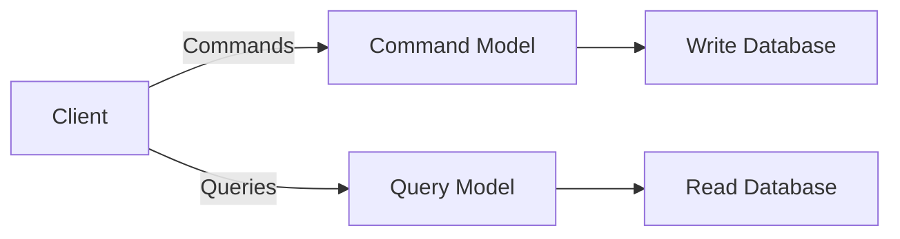
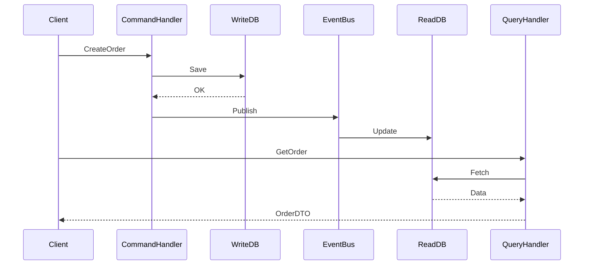
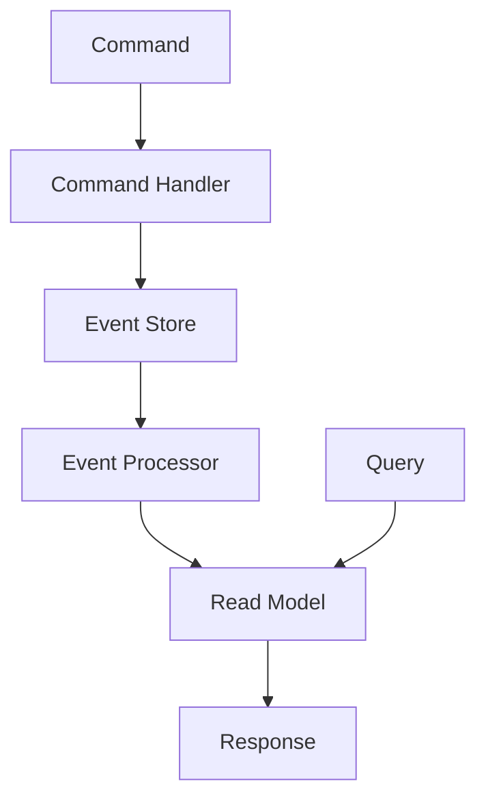

# **CQRS Pattern – The Complete Guide for Interview Preparation** 🚀

CQRS (Command Query Responsibility Segregation) is a powerful architectural pattern that fundamentally changes how we design data flows in applications. This guide provides everything you need to know for interviews and real-world implementation, with **Java examples, industry insights, and visual explanations**.

---

## **Table of Contents** 📑
1. [What is CQRS?](#1-what-is-cqrs)
2. [Core Concepts](#2-core-concepts)
3. [Why Use CQRS?](#3-why-use-cqrs)
4. [When NOT to Use CQRS](#4-when-not-to-use-cqrs)
5. [Implementation Approaches](#5-implementation-approaches)
6. [Java Code Example](#6-java-code-example)
7. [Industry Use Cases](#7-industry-use-cases)
8. [Best Practices](#8-best-practices)
9. [Technology Stack](#9-technology-stack)
10. [Visual Diagrams](#10-visual-diagrams)
11. [Summary Table](#11-summary-table)

---

## **1. What is CQRS?** 🏗️
CQRS separates **read operations (Queries)** from **write operations (Commands)** at the architectural level. Unlike traditional CRUD, it uses different models for reading and writing data.



---

## **2. Core Concepts** 🧠

### **Command Model**
- Handles **create, update, delete** operations
- Returns only success/failure, not data
- Validates business rules

### **Query Model**
- Handles **read** operations
- Optimized for fast data retrieval
- Can denormalize data for performance

### **Event Sourcing (Common Companion)**
- Stores state changes as events
- Enables temporal queries ("what was the state at X time?")

---

## **3. Why Use CQRS?** ✅

| Advantage | Explanation | Industry Example |
|-----------|-------------|------------------|
| **Scalability** | Scale reads and writes independently | Twitter handles 500M+ tweets/day |
| **Performance** | Optimized read models | Amazon product pages load in <100ms |
| **Security** | Different permission models | Banking: tellers vs analysts |
| **Flexibility** | Evolve read/write sides separately | Netflix recommendation engine |

---

## **4. When NOT to Use CQRS** ❌

| Situation | Reason | Alternative |
|-----------|--------|-------------|
| Simple CRUD apps | Overhead > benefit | Traditional 3-tier architecture |
| Low traffic systems | Not worth complexity | REST API with single DB |
| Strong consistency required | Eventual consistency is inherent | Transactional systems |

**Quote from Martin Fowler:**  
*"CQRS is a significant mental leap for most teams. Don't use it unless the benefits outweigh the costs."*

---

## **5. Implementation Approaches** ⚙️

### **Basic CQRS**
```java
// Command Side
public class AccountCommandService {
    public void createAccount(CreateAccountCommand cmd) {
        // Validate and persist
    }
}

// Query Side
public class AccountQueryService {
    public AccountDTO getAccount(String id) {
        // Optimized read
    }
}
```

### **CQRS with Event Sourcing**
```java
public class Account {
    void apply(AccountCreatedEvent event) { /*...*/ }
}

public class AccountEventStore {
    void save(Event event) { /*...*/ }
    List<Event> load(String id) { /*...*/ }
}
```

---

## **6. Java Code Example** ☕

### **Command Handler**
```java
public class CreateOrderCommandHandler {
    private final OrderRepository repository;
    
    public void handle(CreateOrderCommand command) {
        Order order = new Order(
            command.orderId(),
            command.customerId(),
            command.items()
        );
        repository.save(order);
        eventBus.publish(new OrderCreatedEvent(order.getId()));
    }
}
```

### **Query Handler**
```java
public class OrderQueryService {
    private final OrderReadRepository readRepository;
    
    public OrderDTO getOrder(String orderId) {
        return readRepository.findById(orderId)
            .orElseThrow(OrderNotFoundException::new);
    }
}
```

### **Synchronization (Projection)**
```java
@EventListener
public void on(OrderCreatedEvent event) {
    OrderDTO dto = convertToDTO(event.getOrder());
    readRepository.save(dto);
}
```

---

## **7. Industry Use Cases** 🏢

| Company | Implementation | Benefit |
|---------|---------------|---------|
| **Uber** | Driver dispatch system | Real-time location updates |
| **Airbnb** | Search vs Booking | Different read/write SLAs |
| **Robinhood** | Portfolio views | Sub-millisecond reads |
| **LinkedIn** | Profile views | 100M+ reads/day |

---

## **8. Best Practices** 💡

1. **Start Simple**  
   Begin with separate models before introducing event sourcing

2. **Eventual Consistency**  
   Clearly communicate sync delays to users

3. **Monitoring**  
   Track read/write synchronization latency

4. **Caching Strategy**  
   Use Redis for frequent queries

5. **Versioning**  
   Plan for schema evolution in events

---

## **9. Technology Stack** ⚡

| Component | Technologies |
|-----------|--------------|
| **Commands** | Axon Framework, Spring Boot |
| **Queries** | Spring Data, JPA, MyBatis |
| **Event Store** | Kafka, EventStoreDB |
| **Read DB** | MongoDB, Elasticsearch |
| **Sync** | Debezium, CDC |

---

## **10. Visual Diagrams** 📊

### **Basic CQRS Flow**


### **With Event Sourcing**


---

## **11. Summary Table** 📋

| Aspect | CQRS Characteristic |
|--------|---------------------|
| **Read/Write Separation** | Complete model isolation |
| **Data Freshness** | Eventually consistent |
| **Scalability** | Independent scaling |
| **Complexity** | High implementation cost |
| **Best Fit** | High-traffic, complex domains |
| **Team Skills** | Requires DDD knowledge |

---

## **Final Thoughts** 🎯

CQRS shines in scenarios where:
- Read and write workloads differ significantly
- Extreme performance is required
- The domain benefits from explicit modeling

**Interview Tip:**  
Be prepared to discuss:
1. How you'd handle consistency issues
2. Your experience with event-driven systems
3. Tradeoffs vs traditional CRUD

**"When applied judiciously, CQRS can transform system performance and scalability."** - Greg Young (CQRS originator)
