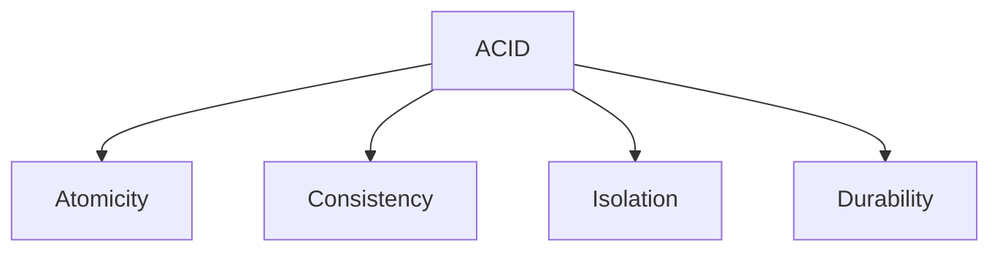
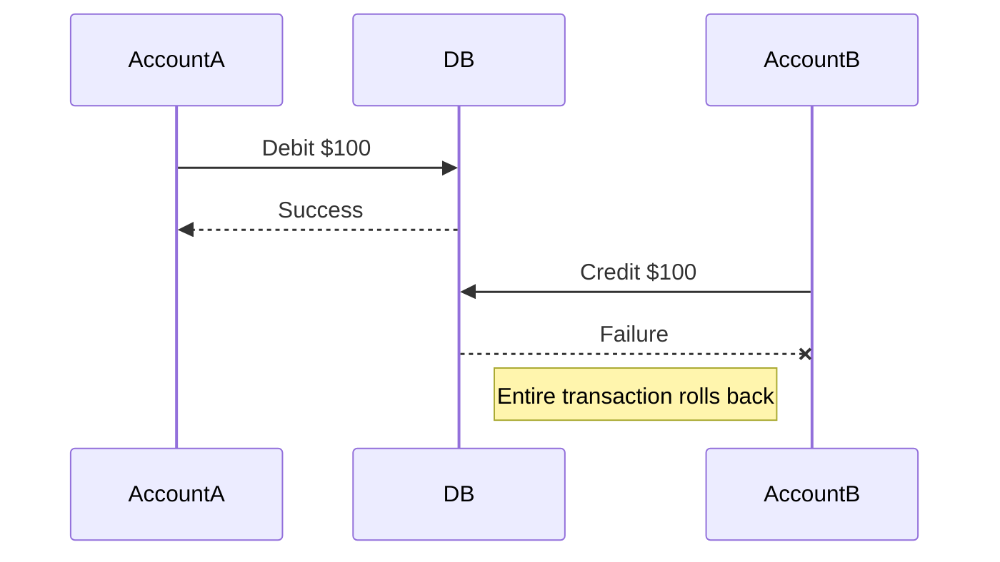
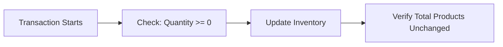
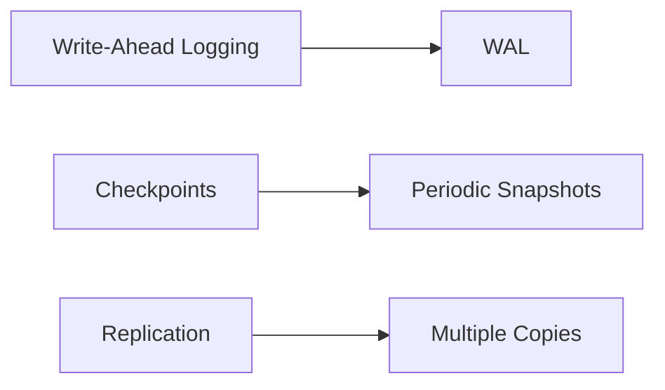
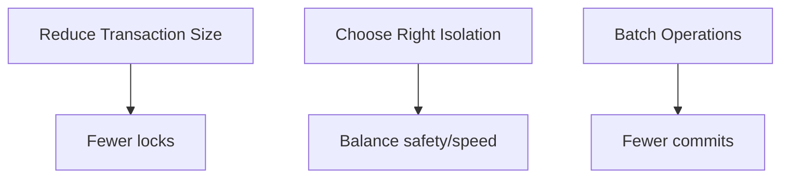
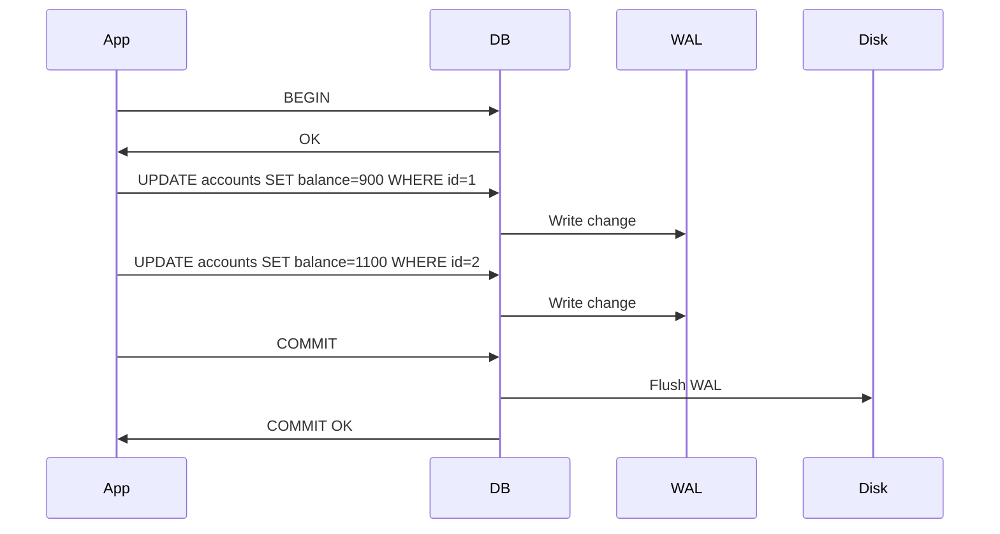

# **ACID Properties – The Ultimate Guide for Interview Preparation** 🚀

This comprehensive guide covers everything you need to know about ACID properties for technical interviews, including deep dives into each principle, real-world implementations, Java examples, and industry best practices.

---

## **Table of Contents** 📑
1. [What are ACID Properties?](#1-what-are-acid-properties)
2. [Atomicity Explained](#2-atomicity-explained)
3. [Consistency Explained](#3-consistency-explained)
4. [Isolation Explained](#4-isolation-explained)
5. [Durability Explained](#5-durability-explained)
6. [ACID vs BASE](#6-acid-vs-base)
7. [Implementation in Databases](#7-implementation-in-databases)
8. [Java Code Examples](#8-java-code-examples)
9. [Industry Use Cases](#9-industry-use-cases)
10. [When NOT to Use ACID](#10-when-not-to-use-acid)
11. [Performance Considerations](#11-performance-considerations)
12. [Visual Diagrams](#12-visual-diagrams)
13. [Comparison Tables](#13-comparison-tables)
14. [Interview Cheat Sheet](#14-interview-cheat-sheet)

---

## **1. What are ACID Properties?** 🏗️

ACID is a set of properties that guarantee reliable processing of database transactions:



**Why ACID Matters:**
- Prevents data corruption
- Ensures reliable transactions
- Maintains data integrity
- Critical for financial systems

---

## **2. Atomicity Explained** ⚛️

### **Definition**
"All or nothing" principle - either ALL operations complete successfully, or NONE do.

### **Real-World Example: Bank Transfer**


### **Java Implementation**
```java
// Using JDBC transaction
try {
    connection.setAutoCommit(false);
    
    // Transfer $100 from account1 to account2
    withdraw(account1, 100);
    deposit(account2, 100);
    
    connection.commit();
} catch (SQLException e) {
    connection.rollback(); // Atomicity in action
}
```

**Key Technologies:**
- Transaction logs
- Two-phase commit protocol
- Undo/Redo mechanisms

---

## **3. Consistency Explained** ⚖️

### **Definition**
Transactions bring the database from one valid state to another, maintaining all defined rules.

### **Real-World Example: Inventory System**


**Enforcement Methods:**
- Primary/foreign keys
- Unique constraints
- Check constraints
- Triggers

### **Java Example**
```java
// Using Spring's @Transactional with validation
@Transactional
public void placeOrder(Order order) {
    if (order.getQuantity() <= 0) {
        throw new ConstraintViolationException("Quantity must be positive");
    }
    inventoryRepository.reduceStock(order.getItemId(), order.getQuantity());
    orderRepository.save(order);
}
```

---

## **4. Isolation Explained** 🏝️

### **Definition**
Concurrent transactions execute as if sequentially, preventing dirty reads/non-repeatable reads.

### **Isolation Levels**
| Level | Dirty Reads | Non-Repeatable | Phantom |
|-------|-------------|----------------|---------|
| Read Uncommitted | ✅ Possible | ✅ | ✅ |
| Read Committed | ❌ | ✅ | ✅ |
| Repeatable Read | ❌ | ❌ | ✅ |
| Serializable | ❌ | ❌ | ❌ |

### **Java Example**
```java
// Setting isolation level in Spring
@Transactional(isolation = Isolation.SERIALIZABLE)
public void processPayment(Payment payment) {
    // Critical financial operation
}
```

**Industry Case:**  
Stock trading platforms use SERIALIZABLE for order matching.

---

## **5. Durability Explained** 💾

### **Definition**
Committed transactions survive system failures.

### **Implementation Techniques**


### **Java Example**
```java
// Using Hibernate with WAL
@Entity
public class Transaction {
    @Id
    private Long id;
    private BigDecimal amount;
    // Persisted to disk immediately on commit
}
```

**Enterprise Solutions:**
- Oracle REDO logs
- PostgreSQL WAL
- MySQL InnoDB doublewrite buffer

---

## **6. ACID vs BASE** ⚖️

| Property | ACID | BASE |
|----------|------|------|
| **Consistency** | Strong | Eventual |
| **Availability** | Lower | Higher |
| **Partition Tolerance** | Limited | Strong |
| **Use Case** | Banking | Social Media |

**Example:**
- **ACID:** Bank transfers (MySQL)
- **BASE:** Facebook likes (Cassandra)

---

## **7. Implementation in Databases** 🗃️

| Database | ACID Implementation |
|----------|---------------------|
| **PostgreSQL** | MVCC + WAL |
| **Oracle** | UNDO tablespaces |
| **MySQL InnoDB** | Doublewrite buffer |
| **MongoDB** | Multi-document transactions |

---

## **8. Java Code Examples** ☕

### **Complete Banking Transaction**
```java
@Transactional(
    isolation = Isolation.REPEATABLE_READ,
    propagation = Propagation.REQUIRED,
    timeout = 30,
    rollbackFor = {InsufficientFundsException.class}
)
public void transferFunds(Long from, Long to, BigDecimal amount) {
    Account source = accountRepository.findById(from)
        .orElseThrow(AccountNotFoundException::new);
    
    Account destination = accountRepository.findById(to)
        .orElseThrow(AccountNotFoundException::new);
    
    if (source.getBalance().compareTo(amount) < 0) {
        throw new InsufficientFundsException();
    }
    
    source.debit(amount);
    destination.credit(amount);
    
    accountRepository.save(source);
    accountRepository.save(destination);
    
    auditLog.logTransfer(from, to, amount);
}
```

---

## **9. Industry Use Cases** 🏢

| Company | ACID Application | Technology |
|---------|------------------|------------|
| **Banks** | Core transactions | IBM DB2 |
| **Stock Exchanges** | Trade settlement | Oracle RAC |
| **Healthcare** | Patient records | PostgreSQL |
| **E-commerce** | Order processing | SQL Server |

---

## **10. When NOT to Use ACID** ❌

| Scenario | Problem | Alternative |
|----------|---------|-------------|
| Global distributed systems | High latency | BASE/Eventual consistency |
| High-throughput analytics | Lock contention | Read replicas |
| Temporary data | Unnecessary overhead | Redis/Memcached |

---

## **11. Performance Considerations** ⚡

**Optimization Techniques:**


---

## **12. Visual Diagrams** 📊

### **ACID Transaction Flow**


---

## **13. Comparison Tables** 📋

### **Database ACID Support**
| Database | Atomicity | Consistency | Isolation | Durability |
|----------|-----------|-------------|-----------|------------|
| PostgreSQL | ✅ | ✅ | Configurable | ✅ |
| MongoDB | Multi-doc | ✅ | Snapshot | ✅ |
| Cassandra | ❌ | Tunable | ❌ | ✅ |

---

## **14. Interview Cheat Sheet** 🎯

**Key Points:**
1. Atomicity = All or nothing
2. Consistency = Rules always valid
3. Isolation = Concurrent control
4. Durability = Survives crashes

**Common Questions:**
1. How would you implement money transfer respecting ACID?
2. Explain isolation levels with examples
3. When would you relax ACID properties?
4. How do NoSQL databases handle ACID?

**"ACID is the foundation of reliable data processing - understand it deeply to build robust systems."** - Database Experts
