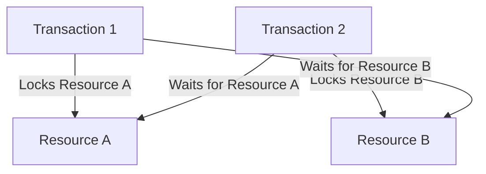
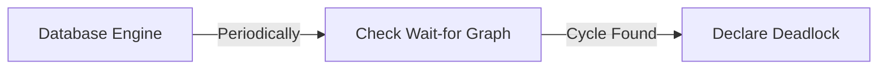
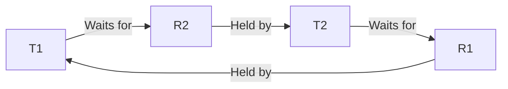
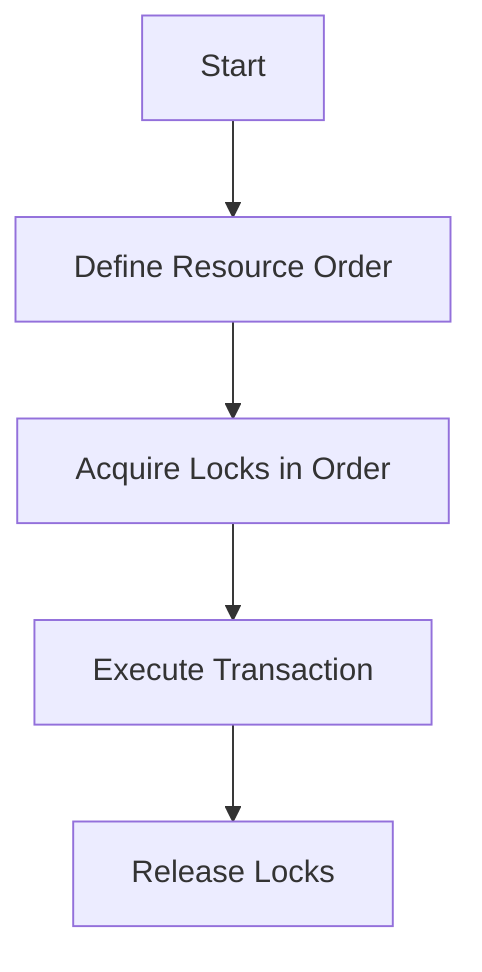

# **Database Deadlocks – The Complete Interview Guide** 🚀

This comprehensive guide covers everything you need to know about database deadlocks for technical interviews, including detection, prevention, and resolution strategies with Java examples and industry best practices.

---

## **Table of Contents** 📑
1. [What is a Database Deadlock?](#1-what-is-a-database-deadlock)
2. [How Deadlocks Occur](#2-how-deadlocks-occur)
3. [Deadlock Detection](#3-deadlock-detection)
4. [Prevention Strategies](#4-prevention-strategies)
5. [Resolution Techniques](#5-resolution-techniques)
6. [Java Code Examples](#6-java-code-examples)
7. [Database-Specific Handling](#7-database-specific-handling)
8. [Industry Best Practices](#8-industry-best-practices)
9. [When Deadlocks Are Acceptable](#9-when-deadlocks-are-acceptable)
10. [Monitoring & Tools](#10-monitoring--tools)
11. [Visual Diagrams](#11-visual-diagrams)
12. [Comparison Tables](#12-comparison-tables)
13. [Interview Cheat Sheet](#13-interview-cheat-sheet)

---

## **1. What is a Database Deadlock?** 💀

A deadlock occurs when two or more transactions permanently block each other by each holding a lock that the other needs.



**Key Characteristics:**
- Mutual exclusion
- Hold and wait
- No preemption
- Circular wait

---

## **2. How Deadlocks Occur** 🔄

### **Classic Deadlock Scenario**

```java
// Transaction 1
BEGIN;
UPDATE accounts SET balance = balance - 100 WHERE id = 1; -- Locks row 1
UPDATE accounts SET balance = balance + 100 WHERE id = 2; -- Waits for T2's lock
COMMIT;

// Transaction 2 (executed concurrently)
BEGIN;
UPDATE accounts SET balance = balance - 50 WHERE id = 2; -- Locks row 2
UPDATE accounts SET balance = balance + 50 WHERE id = 1; -- Waits for T1's lock
COMMIT;
```

### **Common Deadlock Patterns**
1. **Table/Row Lock Contention**
2. **Index Lock Collisions**
3. **Application-Level Deadlocks**
4. **ORM N+1 Problem**

---

## **3. Deadlock Detection** 🔍

### **Database Detection Methods**


### **Java Detection Example**
```java
try {
    // Execute transaction
} catch (SQLException e) {
    if (e.getSQLState().equals("40001") || e.getMessage().contains("deadlock")) {
        // Deadlock detected
        logger.warn("Deadlock encountered, retrying...");
        retryTransaction();
    }
}
```

**Database-Specific Deadlock Codes:**
- MySQL: Error 1213
- PostgreSQL: Error 40P01
- Oracle: ORA-00060
- SQL Server: Error 1205

---

## **4. Prevention Strategies** 🛡️

### **1. Lock Ordering**
Always acquire locks in a predefined global order.

```java
public void transferFunds(Account from, Account to, BigDecimal amount) {
    // Determine lock order (e.g., by account ID)
    Account firstLock = from.getId() < to.getId() ? from : to;
    Account secondLock = from.getId() < to.getId() ? to : from;
    
    synchronized (firstLock) {
        synchronized (secondLock) {
            // Perform transfer
        }
    }
}
```

### **2. Lock Timeout**
```java
// JDBC example
connection.setTransactionIsolation(Connection.TRANSACTION_SERIALIZABLE);
connection.createStatement().execute("SET LOCK_TIMEOUT 5000"); // 5 seconds
```

### **3. Optimistic Concurrency Control**
```java
// JPA/Hibernate
@Entity
public class Account {
    @Version
    private Long version;
    // ...
}
```

---

## **5. Resolution Techniques** ⚔️

### **Database Automatic Resolution**
Most databases use **victim selection** based on:
- Transaction age
- Number of changes
- Deadlock priority

### **Application-Level Handling**
```java
int retries = 3;
while (retries > 0) {
    try {
        executeTransaction();
        break;
    } catch (DeadlockException e) {
        retries--;
        Thread.sleep(50 * (4 - retries)); // Exponential backoff
    }
}
```

---

## **6. Java Code Examples** ☕

### **Complete Deadlock Handling**
```java
public class AccountService {
    private static final int MAX_RETRIES = 3;
    
    @Transactional(isolation = Isolation.SERIALIZABLE)
    public void transferMoney(Long fromId, Long toId, BigDecimal amount) {
        int attempts = 0;
        
        while (attempts < MAX_RETRIES) {
            try {
                Account from = accountRepository.findById(fromId)
                    .orElseThrow(() -> new AccountNotFoundException(fromId));
                
                Account to = accountRepository.findById(toId)
                    .orElseThrow(() -> new AccountNotFoundException(toId));
                
                if (from.getBalance().compareTo(amount) < 0) {
                    throw new InsufficientFundsException();
                }
                
                from.debit(amount);
                to.credit(amount);
                
                accountRepository.saveAll(List.of(from, to));
                break;
            } catch (ObjectOptimisticLockingFailureException | PessimisticLockingFailureException e) {
                if (++attempts == MAX_RETRIES) throw e;
                exponentialBackoff(attempts);
            }
        }
    }
    
    private void exponentialBackoff(int attempt) {
        try {
            Thread.sleep(100 * (long) Math.pow(2, attempt));
        } catch (InterruptedException ignored) {}
    }
}
```

---

## **7. Database-Specific Handling** 🗃️

| Database | Deadlock Handling | Recommended Approach |
|----------|-------------------|----------------------|
| **MySQL** | InnoDB rollback smallest transaction | Use `FOR UPDATE SKIP LOCKED` |
| **PostgreSQL** | Random victim selection | Use `NOWAIT` option |
| **Oracle** | Smart victim selection | Use `SELECT FOR UPDATE NO WAIT` |
| **SQL Server** | Deadlock priority hints | Set `DEADLOCK_PRIORITY` |

---

## **8. Industry Best Practices** 💡

1. **Keep Transactions Short**  
   "Do it fast or do it last"

2. **Access Resources in Consistent Order**  
   Alphabetical, ID-based, etc.

3. **Use Appropriate Isolation Levels**  
   Avoid `SERIALIZABLE` unless necessary

4. **Implement Retry Logic**  
   With exponential backoff

5. **Monitor Deadlock Rates**  
   Alert if exceeding thresholds

**Big Tech Examples:**
- **Banking Systems**: Aggressive deadlock prevention
- **E-commerce**: Optimistic concurrency for carts
- **Gaming**: Short transactions with retries

---

## **9. When Deadlocks Are Acceptable** 🤷

| Scenario | Reason | Handling |
|----------|--------|----------|
| Low-frequency operations | Retry is acceptable | Simple retry logic |
| Non-critical systems | Availability less important | Let DB handle it |
| Analytics workloads | Read-mostly systems | Use snapshot isolation |

---

## **10. Monitoring & Tools** 📊

### **Key Metrics to Track**
- Deadlocks per minute
- Victim transaction details
- Average deadlock duration

### **Diagnostic Queries**
**MySQL:**
```sql
SHOW ENGINE INNODB STATUS;
```

**PostgreSQL:**
```sql
SELECT * FROM pg_stat_activity WHERE wait_event_type = 'Lock';
```

---

## **11. Visual Diagrams** 📉

### **Deadlock Wait-for Graph**


### **Prevention Flow**


---

## **12. Comparison Tables** 📋

### **Deadlock Handling Approaches**
| Method | Pros | Cons |
|--------|------|------|
| **Prevention** | No deadlocks occur | Complex implementation |
| **Detection** | Simple | Transaction rollbacks |
| **Avoidance** | Balanced approach | Requires analysis |

### **Isolation Levels vs Deadlocks**
| Level | Deadlock Probability | Performance |
|-------|----------------------|-------------|
| READ UNCOMMITTED | Low | High |
| READ COMMITTED | Medium | Medium |
| REPEATABLE READ | High | Medium |
| SERIALIZABLE | Very High | Low |

---

## **13. Interview Cheat Sheet** 🎯

**Key Points:**
1. Deadlocks require 4 conditions (mutual exclusion, hold/wait, etc.)
2. Prevention > Detection > Resolution
3. Always implement retry logic
4. Monitor deadlock rates in production

**Common Questions:**
1. Explain the dining philosophers problem
2. How would you design a deadlock-free banking system?
3. Compare optimistic vs pessimistic locking
4. How does MySQL detect deadlocks?
5. When would you accept deadlocks in a system?

**"Deadlocks are inevitable in complex systems - the key is handling them gracefully."** - Database Engineers
