# **Database Indexing – The Complete Interview Guide** 🚀

This comprehensive guide covers everything you need to know about database indexing for technical interviews, including implementation strategies, Java examples, and real-world industry applications.

---

## **Table of Contents** 📑
1. [What is Database Indexing?](#1-what-is-database-indexing)
2. [Types of Indexes](#2-types-of-indexes)
3. [Index Data Structures](#3-index-data-structures)
4. [Indexing Strategies](#4-indexing-strategies)
5. [Java Implementation](#5-java-implementation)
6. [Performance Impact](#6-performance-impact)
7. [Industry Best Practices](#7-industry-best-practices)
8. [When NOT to Index](#8-when-not-to-index)
9. [Big Company Approaches](#9-big-company-approaches)
10. [Monitoring & Maintenance](#10-monitoring--maintenance)
11. [Visual Diagrams](#11-visual-diagrams)
12. [Comparison Tables](#12-comparison-tables)
13. [Interview Cheat Sheet](#13-interview-cheat-sheet)

---

## **1. What is Database Indexing?** 🏗️

An index is a **performance optimization technique** that speeds up data retrieval operations by creating a separate data structure that allows faster search.


**Key Benefits:**
- Faster SELECT queries
- Improved JOIN performance
- Better sorting and grouping
- Enhanced UNIQUE constraint enforcement

---

## **2. Types of Indexes** 🔢

### **1. Single-Column Index**
```sql
CREATE INDEX idx_customer_name ON customers(name);
```

### **2. Composite Index**
```sql
CREATE INDEX idx_customer_name_email ON customers(name, email);
```

### **3. Unique Index**
```sql
CREATE UNIQUE INDEX idx_customer_email ON customers(email);
```

### **4. Partial Index**
```sql
CREATE INDEX idx_active_orders ON orders(status) WHERE status = 'ACTIVE';
```

### **5. Full-Text Index**
```sql
CREATE FULLTEXT INDEX idx_product_desc ON products(description);
```

---

## **3. Index Data Structures** 🌲

### **1. B-Tree (Balanced Tree)**

**Best for:** Range queries, equality searches (Default in PostgreSQL/MySQL)

### **2. Hash Index**

**Best for:** Exact match lookups (Used in MySQL MEMORY tables)

### **3. Bitmap Index**

**Best for:** Low-cardinality columns (Data warehouses)

---

## **4. Indexing Strategies** 🎯

### **1. Covering Index**
```sql
-- Index covers all selected columns
CREATE INDEX idx_covering ON orders(customer_id, order_date, total)
-- Query uses index only
SELECT customer_id, order_date FROM orders WHERE customer_id = 100;
```

### **2. Index-Only Scan**
```java
@Entity
@Table(indexes = @Index(name = "idx_employee_dept", 
                       columnList = "department_id, salary"))
public class Employee {
    // JPA will use index for filtering and sorting
    @ManyToOne
    private Department department;
    private BigDecimal salary;
}
```

### **3. Index Intersection**
```sql
-- Database combines multiple indexes
CREATE INDEX idx_name ON customers(name);
CREATE INDEX idx_city ON customers(city);
-- Query uses both indexes
SELECT * FROM customers WHERE name = 'John' AND city = 'NY';
```

---

## **5. Java Implementation** ☕

### **JPA/Hibernate Index Annotations**
```java
@Entity
@Table(name = "products",
       indexes = {
           @Index(name = "idx_product_name", columnList = "name"),
           @Index(name = "idx_product_category_price", 
                 columnList = "category_id, price DESC")
       })
public class Product {
    @Id
    private Long id;
    
    private String name;
    
    @ManyToOne
    private Category category;
    
    private BigDecimal price;
    
    @Column(length = 1000)
    private String description;
    
    @Index(name = "idx_product_stock") // Hibernate 5+
    private Integer stockQuantity;
}
```

### **Spring Data JPA Query Optimization**
```java
public interface OrderRepository extends JpaRepository<Order, Long> {
    // Uses index on customer_id and order_date
    @QueryHints(@QueryHint(name = "org.hibernate.fetchSize", value = "100"))
    List<Order> findByCustomerIdAndOrderDateBetween(
        Long customerId, 
        LocalDate start, 
        LocalDate end);
}
```

---

## **6. Performance Impact** ⚡

### **Read vs Write Tradeoff**
| Operation | Without Index | With Index |
|-----------|--------------|------------|
| SELECT | O(n) | O(log n) |
| INSERT | O(1) | O(log n) |
| UPDATE | O(1) | O(log n) |
| DELETE | O(1) | O(log n) |

### **Execution Plan Analysis**
```sql
EXPLAIN ANALYZE 
SELECT * FROM customers 
WHERE email = 'user@example.com';
```
**Output:**
```
Index Scan using idx_customer_email on customers  (cost=0.42..8.44 rows=1)
  Index Cond: (email = 'user@example.com'::text)
```

---

## **7. Industry Best Practices** 💡

1. **Index SELECTIVE columns** (High cardinality)
    - Good: User emails, IDs
    - Bad: Gender, boolean flags

2. **Follow the 20/80 rule**
    - Indexes should benefit 80% of queries
    - Limit to 20% of table columns

3. **Composite index column order matters**
   ```sql
   -- Optimal for queries filtering on both or just customer_id
   CREATE INDEX idx_optimal ON orders(customer_id, status);
   ```

4. **Monitor unused indexes**
   ```sql
   -- PostgreSQL example
   SELECT * FROM pg_stat_all_indexes 
   WHERE idx_scan = 0;
   ```

**Big Tech Examples:**
- **Amazon**: Uses covering indexes heavily for product searches
- **Uber**: Geospatial indexes for driver locations
- **Twitter**: Composite indexes for timeline queries

---

## **8. When NOT to Index** ❌

| Scenario | Reason | Alternative |
|----------|--------|-------------|
| Small tables (<1000 rows) | Full scan faster | No index |
| Frequently updated columns | Write penalty | Batch updates |
| Low-cardinality columns | Minimal benefit | Bitmap indexes |
| Blob/Text columns | Too large | Full-text index |

---

## **9. Big Company Approaches** 🏢

### **Google Spanner**
- Global secondary indexes
- TrueTime-synchronized

### **Amazon DynamoDB**
- GSIs (Global Secondary Indexes)
- LSIs (Local Secondary Indexes)

### **MongoDB Atlas**
- Multikey indexes for arrays
- Wildcard indexes for flexible schemas

---

## **10. Monitoring & Maintenance** 🛠️

### **Index Health Checks**
```sql
-- MySQL
SELECT * FROM sys.schema_unused_indexes;

-- PostgreSQL
SELECT * FROM pg_stat_user_indexes;
```

### **Rebuilding Indexes**
```sql
-- SQL Server
ALTER INDEX ALL ON orders REBUILD;

-- Oracle
ALTER INDEX idx_customer_name REBUILD ONLINE;
```

---

## **11. Visual Diagrams** 📊

### **B-Tree Index Structure**

```mermaid
graph TD
    Root[Root: 50] --> Left[<50]
    Root --> Right[≥50]
    Left --> L1[20]
    Left --> L2[30-49]
    Right --> R1[50-70]
    Right --> R2[>70]
```


### **Index vs Full Table Scan**


---

## **12. Comparison Tables** 📋

### **Index Types Comparison**
| Type | Best For | Worst For | Storage Cost |
|------|----------|-----------|--------------|
| B-Tree | Range queries | Large blobs | Medium |
| Hash | Exact matches | Range queries | Low |
| Bitmap | Data warehousing | OLTP systems | High |

### **Database Index Limits**
| Database | Max Indexes/Table | Max Columns/Index |
|----------|------------------|-------------------|
| MySQL | 64 | 16 |
| PostgreSQL | Unlimited | 32 |
| SQL Server | 1000 | 16 |
| Oracle | Unlimited | 32 |

---

## **13. Interview Cheat Sheet** 🎯

**Key Concepts:**
1. Indexes trade storage space for faster reads
2. B-Tree is most common (O(log n) search)
3. Composite indexes follow leftmost prefix rule
4. Over-indexing hurts write performance

**Common Questions:**
1. Explain how a database chooses which index to use
2. How would you index a users table for email login?
3. When would a query ignore an available index?
4. How do you identify missing indexes in production?
5. Compare clustered vs non-clustered indexes

**"Proper indexing is the difference between a query taking milliseconds or minutes."** - Database Performance Experts
