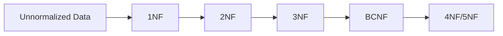
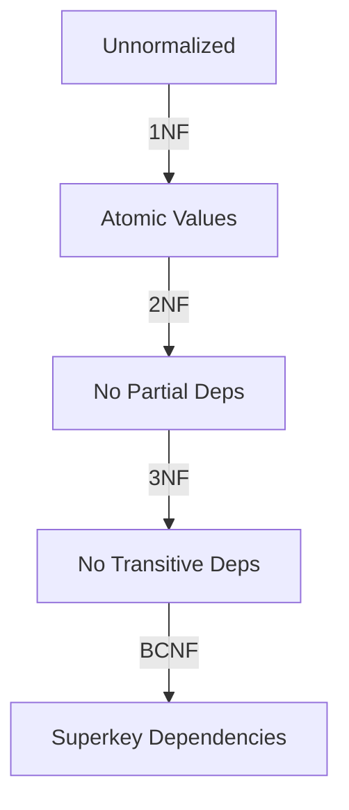
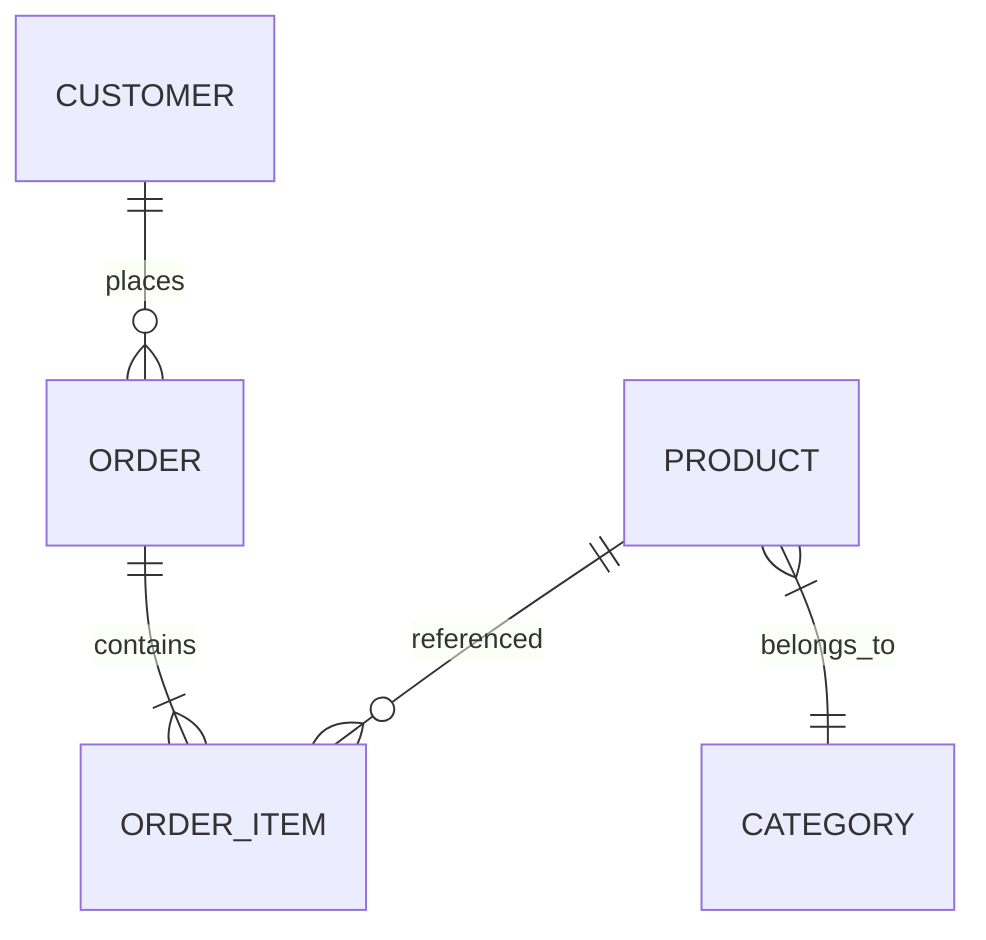

# **Database Normalization – The Complete Interview Guide** 🚀

This ultimate guide covers database normalization from fundamentals to advanced concepts, complete with Java examples, visual diagrams, and real-world industry applications to help you ace technical interviews.

---

## **Table of Contents** 📑
1. [What is Database Normalization?](#1-what-is-database-normalization)
2. [1NF (First Normal Form)](#2-1nf-first-normal-form)
3. [2NF (Second Normal Form)](#3-2nf-second-normal-form)
4. [3NF (Third Normal Form)](#4-3nf-third-normal-form)
5. [BCNF (Boyce-Codd NF)](#5-bcnf-boyce-codd-normal-form)
6. [4NF & 5NF](#6-4nf--5nf)
7. [Denormalization](#7-denormalization)
8. [Java Implementation](#8-java-implementation)
9. [Industry Best Practices](#9-industry-best-practices)
10. [When NOT to Normalize](#10-when-not-to-normalize)
11. [Comparison: SQL vs NoSQL](#11-comparison-sql-vs-nosql)
12. [Visual Diagrams](#12-visual-diagrams)
13. [Summary Tables](#13-summary-tables)
14. [Interview Cheat Sheet](#14-interview-cheat-sheet)

---

## **1. What is Database Normalization?** 🏗️

**Normalization** is the process of organizing data to minimize redundancy and dependency by dividing tables and establishing relationships.



**Key Goals:**
- Eliminate duplicate data
- Ensure data dependencies make sense
- Reduce data modification anomalies
- Optimize storage space

---

## **2. 1NF (First Normal Form)** 🔢

### **Rules**
1. Each table cell should contain atomic values
2. Each record needs to be unique
3. No repeating groups

### **Example: Student Courses**

**Before 1NF:**
| Student_ID | Name | Courses |
|------------|------|---------|
| 101 | John | Math, Physics |

**After 1NF:**
| Student_ID | Name | Course |
|------------|------|--------|
| 101 | John | Math |
| 101 | John | Physics |

### **Java Entity**
```java
@Entity
@Table(name = "student_courses")
public class StudentCourse {
    @Id
    @GeneratedValue
    private Long id;
    
    @Column(name = "student_id")
    private Long studentId;
    
    @Column(name = "course_name")
    private String courseName;
    
    // Getters and setters
}
```

---

## **3. 2NF (Second Normal Form)** 🔢🔢

### **Rules**
1. Must be in 1NF
2. No partial dependency (all non-key attributes depend on the entire primary key)

### **Example: Order Items**

**Before 2NF:**
| Order_ID | Product_ID | Product_Name | Quantity |
|----------|------------|--------------|----------|

**After 2NF:**
**Orders:**
| Order_ID | Product_ID | Quantity |
|----------|------------|----------|

**Products:**
| Product_ID | Product_Name |
|------------|--------------|

### **Java Implementation**
```java
// Order entity
@Entity
public class Order {
    @Id
    private Long orderId;
    
    @OneToMany(mappedBy = "order")
    private List<OrderItem> items;
}

// OrderItem entity
@Entity
public class OrderItem {
    @Id
    @GeneratedValue
    private Long id;
    
    @ManyToOne
    private Order order;
    
    @ManyToOne
    private Product product;
    
    private int quantity;
}

// Product entity
@Entity
public class Product {
    @Id
    private Long productId;
    private String productName;
}
```

---

## **4. 3NF (Third Normal Form)** 🔢🔢🔢

### **Rules**
1. Must be in 2NF
2. No transitive dependencies (non-key attributes shouldn't depend on other non-key attributes)

### **Example: Employee Department**

**Before 3NF:**
| Employee_ID | Name | Dept_ID | Dept_Name | Dept_Location |
|-------------|------|---------|-----------|---------------|

**After 3NF:**
**Employees:**
| Employee_ID | Name | Dept_ID |
|-------------|------|---------|

**Departments:**
| Dept_ID | Dept_Name | Dept_Location |
|---------|-----------|---------------|

### **Java Code**
```java
@Entity
public class Employee {
    @Id
    private Long employeeId;
    private String name;
    
    @ManyToOne
    @JoinColumn(name = "dept_id")
    private Department department;
}

@Entity
public class Department {
    @Id
    private Long deptId;
    private String deptName;
    private String deptLocation;
}
```

---

## **5. BCNF (Boyce-Codd Normal Form)** 🔍

### **Rules**
1. Must be in 3NF
2. For any dependency A → B, A must be a superkey

### **Example: Student Advisor**

**Problem Scenario:**
- One student → one advisor
- One advisor → one department
- But department may have multiple advisors

**Solution:**
Separate student-advisor and advisor-department relationships

### **Java Implementation**
```java
@Entity
public class StudentAdvisor {
    @Id
    private Long studentId;
    
    @ManyToOne
    private Advisor advisor;
}

@Entity
public class AdvisorDepartment {
    @Id
    private Long advisorId;
    
    @ManyToOne
    private Department department;
}
```

---

## **6. 4NF & 5NF** 🔢🔢🔢🔢

### **4NF (Fourth Normal Form)**
- Eliminate multi-valued dependencies
- Example: Separate student-course-instructor relationships

### **5NF (Fifth Normal Form)**
- Deal with join dependencies
- Rarely used in practice

---

## **7. Denormalization** ↔️

**When to Denormalize:**
- Read-heavy applications
- Analytics/Reporting databases
- Performance-critical operations

**Industry Example:**  
Twitter denormalizes tweet counts for faster reads

```java
@Entity
public class User {
    @Id
    private Long userId;
    private String username;
    private int tweetCount; // Denormalized field
}
```

---

## **8. Java Implementation** ☕

### **Complete Normalized Schema**
```java
// Customer.java
@Entity
public class Customer {
    @Id
    @GeneratedValue
    private Long customerId;
    private String name;
    private String email;
    
    @OneToMany(mappedBy = "customer")
    private List<Order> orders;
}

// Order.java
@Entity
public class Order {
    @Id
    @GeneratedValue
    private Long orderId;
    private LocalDate orderDate;
    
    @ManyToOne
    private Customer customer;
    
    @OneToMany(mappedBy = "order")
    private List<OrderItem> items;
}

// Product.java
@Entity
public class Product {
    @Id
    @GeneratedValue
    private Long productId;
    private String name;
    private BigDecimal price;
    
    @ManyToOne
    private Category category;
}

// OrderItem.java
@Entity
public class OrderItem {
    @Id
    @GeneratedValue
    private Long id;
    
    @ManyToOne
    private Order order;
    
    @ManyToOne
    private Product product;
    
    private int quantity;
}
```

---

## **9. Industry Best Practices** 💡

1. **Normalize First, Denormalize Later**  
   Start with 3NF, then denormalize based on performance needs

2. **Index Properly**  
   Create indexes on foreign keys and frequently queried columns

3. **Consider Read/Write Ratio**  
   Normalize write-heavy, denormalize read-heavy systems

4. **Document Design Decisions**  
   Explain normalization choices in schema documentation

**Big Tech Examples:**
- **Amazon**: Normalized for orders, denormalized for product listings
- **LinkedIn**: 3NF for core data, denormalized for social graphs
- **Uber**: Normalized for trip data, denormalized for driver dispatch

---

## **10. When NOT to Normalize** ❌

| Scenario | Reason | Alternative |
|----------|--------|-------------|
| Analytics/Reporting | Joins are expensive | Star schema |
| High-read systems | Faster reads needed | Denormalize |
| Simple applications | Overengineering | Flat structure |
| NoSQL databases | Different paradigm | Document model |

---

## **11. Comparison: SQL vs NoSQL** ⚖️

| Feature | SQL (Normalized) | NoSQL (Denormalized) |
|---------|------------------|----------------------|
| **Structure** | Rigid schema | Flexible schema |
| **Scaling** | Vertical | Horizontal |
| **Transactions** | ACID | BASE |
| **Joins** | In-database | Application-side |
| **Best For** | Complex queries | High velocity data |

---

## **12. Visual Diagrams** 📊

### **Normalization Process**


### **ER Diagram (3NF Example)**


---

## **13. Summary Tables** 📋

### **Normal Forms Quick Reference**
| NF | Rule | Fixes |
|----|------|-------|
| 1NF | Atomic values | Repeating groups |
| 2NF | No partial deps | Partial dependencies |
| 3NF | No transitive deps | Indirect relationships |
| BCNF | Superkey deps | Remaining anomalies |

### **Pros and Cons of Normalization**
| Pros | Cons |
|------|------|
| Reduced redundancy | More complex queries |
| Better integrity | More joins needed |
| Easier modifications | Potential performance impact |
| Flexible design | Higher design cost |

---

## **14. Interview Cheat Sheet** 🎯

**Key Points to Remember:**
1. 1NF = Atomic values + no repeating groups
2. 2NF = Eliminate partial dependencies
3. 3NF = Eliminate transitive dependencies
4. Normalize first, denormalize for performance
5. Tradeoffs between integrity and speed

**Common Interview Questions:**
1. Explain 1NF through 3NF with examples
2. When would you denormalize a database?
3. How does normalization affect query performance?
4. Design a normalized schema for an e-commerce system
5. Compare normalized vs denormalized approaches

**"Normalization is the foundation of database design - master these concepts to build scalable, maintainable data architectures."** - Database Experts
