# **CI/CD Fundamentals – The Backbone of DevOps** 🚀🔄

**Master Continuous Integration and Continuous Delivery/Deployment - Essential for Every DevOps Role**

---

## **Table of Contents** 📑
1. [What is CI/CD?](#1-what-is-cicd)
2. [CI/CD Architecture & Components](#2-cicd-architecture--components)
3. [Continuous Integration (CI)](#3-continuous-integration-ci)
4. [Continuous Delivery vs Continuous Deployment](#4-continuous-delivery-vs-continuous-deployment)
5. [CI/CD Pipeline Stages](#5-cicd-pipeline-stages)
6. [Key Concepts & Terminology](#6-key-concepts--terminology)
7. [CI/CD Tools Comparison](#7-cicd-tools-comparison)
8. [Best Practices](#8-best-practices)
9. [Common Patterns & Strategies](#9-common-patterns--strategies)
10. [Security in CI/CD (DevSecOps)](#10-security-in-cicd-devsecops)
11. [Monitoring & Metrics](#11-monitoring--metrics)
12. [Interview Cheat Sheet](#12-interview-cheat-sheet)

---

## **1. What is CI/CD?** 🎯

### **Definition:**

**CI/CD** is a method of frequently delivering apps to customers by introducing automation into the stages of app development. The main concepts attributed to CI/CD are:
- **Continuous Integration (CI)**: Automatically build and test code changes
- **Continuous Delivery (CD)**: Automatically prepare code for release
- **Continuous Deployment (CD)**: Automatically deploy to production

### **Why CI/CD Matters:**

```
Without CI/CD                         With CI/CD
┌─────────────────┐                  ┌─────────────────┐
│ Manual Build    │                  │ Automated Build │
│ Manual Testing  │                  │ Automated Tests │
│ Manual Deploy   │                  │ Auto Deploy     │
│                 │                  │                 │
│ Days/Weeks      │    ──────>       │ Minutes/Hours   │
│ High Risk       │                  │ Low Risk        │
│ Infrequent      │                  │ Frequent        │
│ Error-Prone     │                  │ Reliable        │
└─────────────────┘                  └─────────────────┘
```

### **Business Benefits:**

| Benefit | Impact |
|---------|--------|
| **Faster Time to Market** | Deploy features in hours instead of weeks |
| **Reduced Risk** | Small, incremental changes are easier to troubleshoot |
| **Higher Quality** | Automated testing catches bugs earlier |
| **Better Collaboration** | Developers integrate work continuously |
| **Cost Reduction** | Fewer manual processes, faster feedback |
| **Improved Productivity** | Automation frees teams for innovation |

### **Evolution of Software Delivery:**

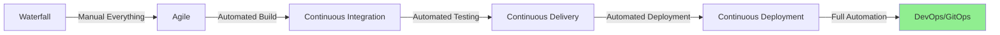

---

## **2. CI/CD Architecture & Components** 🏗️

### **High-Level Architecture:**

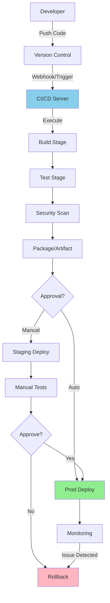

### **Core Components:**

#### **1. Source Control Management (SCM)**
```
┌──────────────────────────────────┐
│  Git Repository (GitHub/GitLab)  │
│  - Code versioning               │
│  - Branch management             │
│  - Merge requests/Pull requests  │
│  - Webhooks for triggers         │
└──────────────────────────────────┘
```

#### **2. CI/CD Server/Platform**
```
┌──────────────────────────────────┐
│  Jenkins / GitLab CI / GH Actions│
│  - Pipeline orchestration        │
│  - Job execution                 │
│  - Agent/Runner management       │
│  - Plugin/Extension ecosystem    │
└──────────────────────────────────┘
```

#### **3. Build Tools**
```
┌──────────────────────────────────┐
│  Maven, Gradle, npm, Docker      │
│  - Compile code                  │
│  - Dependency management         │
│  - Create artifacts              │
└──────────────────────────────────┘
```

#### **4. Testing Frameworks**
```
┌──────────────────────────────────┐
│  JUnit, PyTest, Selenium, Jest   │
│  - Unit tests                    │
│  - Integration tests             │
│  - End-to-end tests              │
│  - Performance tests             │
└──────────────────────────────────┘
```

#### **5. Artifact Repository**
```
┌──────────────────────────────────┐
│  Nexus, Artifactory, Docker Hub  │
│  - Store build artifacts         │
│  - Version management            │
│  - Binary repository             │
└──────────────────────────────────┘
```

#### **6. Deployment Tools**
```
┌──────────────────────────────────┐
│  Kubernetes, Docker, Ansible     │
│  - Container orchestration       │
│  - Configuration management      │
│  - Infrastructure provisioning   │
└──────────────────────────────────┘
```

#### **7. Monitoring & Logging**
```
┌──────────────────────────────────┐
│  Prometheus, Grafana, ELK Stack  │
│  - Application monitoring        │
│  - Log aggregation              │
│  - Alerting                      │
│  - Performance metrics           │
└──────────────────────────────────┘
```

### **Component Interaction Flow:**

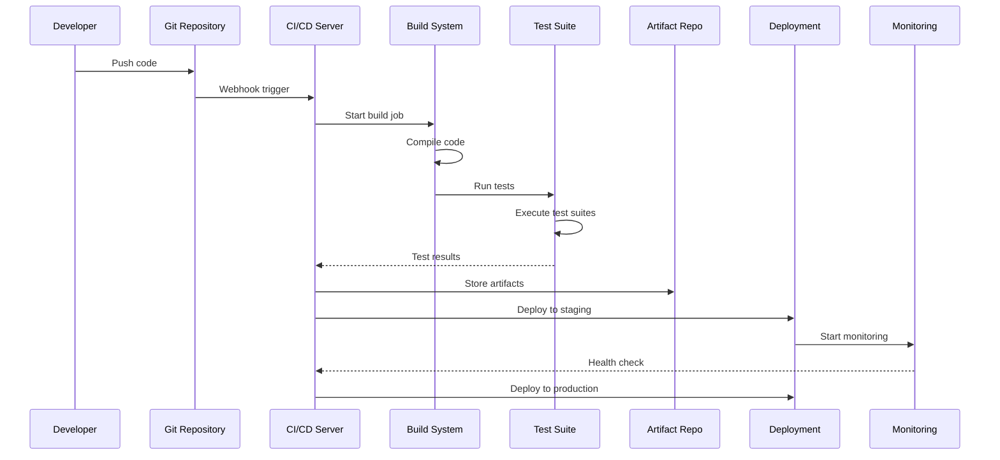

---

## **3. Continuous Integration (CI)** 🔧

### **What is CI?**

**Continuous Integration** is a development practice where developers integrate code into a shared repository frequently, preferably several times a day. Each integration is verified by an automated build and automated tests.

### **CI Workflow:**

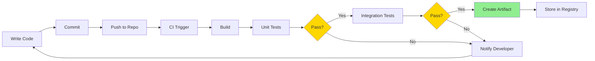

### **CI Principles:**

1. **Maintain a Single Source Repository**
```bash
# All code in version control
git clone https://github.com/company/project.git
```

2. **Automate the Build**
```bash
# Build triggered automatically
npm run build
mvn clean install
docker build -t myapp:latest .
```

3. **Make Your Build Self-Testing**
```bash
# Automated tests in build
npm test
pytest
mvn test
```

4. **Everyone Commits to Mainline Every Day**
```bash
# Frequent small commits
git commit -m "feat: Add user validation"
git push origin main
```

5. **Every Commit Builds Mainline on Integration Machine**
```yaml
# CI automatically builds every commit
on:
  push:
    branches: [main]
```

6. **Keep the Build Fast**
```
Target: Build + Tests < 10 minutes
Parallel execution, caching, incremental builds
```

7. **Test in Clone of Production Environment**
```yaml
# Use production-like containers
services:
  postgres:
    image: postgres:14
  redis:
    image: redis:7
```

8. **Make it Easy to Get Latest Deliverables**
```bash
# Artifacts readily available
curl -O https://artifacts.company.com/app/latest/app.jar
```

9. **Everyone Can See What's Happening**
```
Dashboard shows:
- Build status
- Test results
- Code coverage
- Deployment status
```

10. **Automate Deployment**
```yaml
# Automated deployment after successful build
deploy:
  stage: deploy
  script: ./deploy.sh staging
```

### **CI Build Process:**

```
┌─────────────────────────────────────────────────────────┐
│                    CI Build Pipeline                    │
├─────────────────────────────────────────────────────────┤
│                                                         │
│  1. Checkout Code                                       │
│     ├─ Clone repository                                │
│     └─ Checkout specific branch/commit                 │
│                                                         │
│  2. Dependency Resolution                               │
│     ├─ Download dependencies                           │
│     ├─ Cache management                                │
│     └─ Version verification                            │
│                                                         │
│  3. Compilation                                         │
│     ├─ Compile source code                             │
│     ├─ Generate bytecode                               │
│     └─ Check for compilation errors                    │
│                                                         │
│  4. Static Analysis                                     │
│     ├─ Code linting                                    │
│     ├─ Security scanning                               │
│     └─ Code quality checks                             │
│                                                         │
│  5. Unit Testing                                        │
│     ├─ Run unit tests                                  │
│     ├─ Generate coverage report                        │
│     └─ Fail if coverage < threshold                    │
│                                                         │
│  6. Integration Testing                                 │
│     ├─ Setup test environment                          │
│     ├─ Run integration tests                           │
│     └─ Teardown environment                            │
│                                                         │
│  7. Package Application                                 │
│     ├─ Create artifacts (JAR, Docker)                  │
│     ├─ Version tagging                                 │
│     └─ Store in artifact repository                    │
│                                                         │
│  8. Notification                                        │
│     ├─ Send build status                               │
│     └─ Update dashboards                               │
│                                                         │
└─────────────────────────────────────────────────────────┘
```

---

## **4. Continuous Delivery vs Continuous Deployment** 🚀

### **Continuous Delivery:**

**Continuous Delivery** ensures that code is always in a deployable state and ready for production release at any time, but deployment requires manual approval.

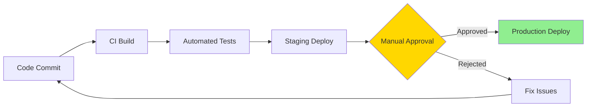

### **Continuous Deployment:**

**Continuous Deployment** goes one step further - every change that passes automated tests is automatically deployed to production without manual intervention.

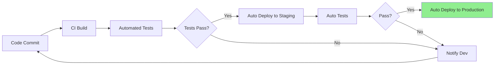

### **Comparison:**

| Aspect | Continuous Delivery | Continuous Deployment |
|--------|-------------------|---------------------|
| **Production Deploy** | Manual approval required | Fully automated |
| **Speed** | Deploy when ready | Deploy every change |
| **Risk** | Lower (human gate) | Higher (full automation) |
| **Frequency** | On-demand | Multiple times/day |
| **Use Cases** | Regulated industries, critical systems | Fast-moving products, SaaS |
| **Control** | High | Medium |
| **Feedback Speed** | Moderate | Very fast |
| **Best For** | Banking, Healthcare | E-commerce, Social Media |

### **Visual Comparison:**

```
Continuous Delivery:
─────────────────────────────────────────────────────────
Commit → Build → Test → Staging → [HUMAN GATE] → Production
                                       ↑
                                  Manual Click

Continuous Deployment:
─────────────────────────────────────────────────────────
Commit → Build → Test → Staging → Production
         (All Automated, No Human Intervention)
```

### **When to Use Each:**

**Use Continuous Delivery when:**
- Compliance requires manual approval
- Business wants control over release timing
- Working in regulated industries (finance, healthcare)
- Need coordinated marketing releases
- High-risk applications

**Use Continuous Deployment when:**
- Fast feedback is critical
- Small, low-risk changes
- Mature testing infrastructure
- Ability to rollback quickly
- SaaS/Cloud-native applications

---

## **5. CI/CD Pipeline Stages** 🔄

### **Complete Pipeline Overview:**

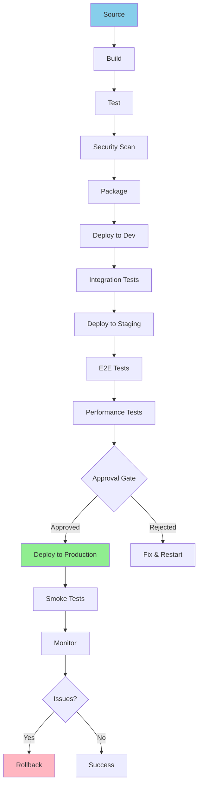

### **Detailed Stage Breakdown:**

#### **Stage 1: Source** 📝
```yaml
Purpose: Trigger pipeline on code changes
Triggers:
  - Push to branch
  - Pull request opened
  - Scheduled (cron)
  - Manual trigger
  
Actions:
  - Checkout code
  - Set environment variables
  - Validate triggers
```

#### **Stage 2: Build** 🔨
```yaml
Purpose: Compile and create executable artifacts
Steps:
  - Install dependencies
  - Compile source code
  - Bundle application
  - Version tagging
  
Tools:
  - Maven, Gradle (Java)
  - npm, webpack (JavaScript)
  - pip, setuptools (Python)
  - Docker build
```

#### **Stage 3: Test** ✅
```yaml
Purpose: Verify code quality and functionality
Test Types:
  - Unit tests (individual functions)
  - Integration tests (component interaction)
  - Contract tests (API contracts)
  - Code coverage analysis
  
Quality Gates:
  - Coverage > 80%
  - All tests pass
  - No critical bugs
```

#### **Stage 4: Security Scan** 🔒
```yaml
Purpose: Identify security vulnerabilities
Scans:
  - SAST (Static Application Security Testing)
  - Dependency scanning
  - Container image scanning
  - License compliance
  
Tools:
  - SonarQube (code quality)
  - Snyk (dependencies)
  - Trivy (containers)
  - OWASP ZAP (dynamic analysis)
```

#### **Stage 5: Package** 📦
```yaml
Purpose: Create deployable artifacts
Artifacts:
  - Docker images
  - JAR/WAR files
  - npm packages
  - Binaries
  
Actions:
  - Build container image
  - Tag with version
  - Push to registry
  - Create release notes
```

#### **Stage 6: Deploy to Dev** 🚀
```yaml
Purpose: Deploy to development environment
Steps:
  - Pull latest artifacts
  - Deploy to dev cluster
  - Run database migrations
  - Update configurations
  
Environment:
  - Isolated namespace
  - Development databases
  - Mock external services
```

#### **Stage 7: Integration Tests** 🔗
```yaml
Purpose: Test component interactions
Tests:
  - API integration tests
  - Database integration
  - Service-to-service communication
  - Third-party integrations
  
Duration: 5-15 minutes
```

#### **Stage 8: Deploy to Staging** 🎭
```yaml
Purpose: Deploy to production-like environment
Characteristics:
  - Mirrors production
  - Production data subset
  - Similar infrastructure
  - Same configurations
```

#### **Stage 9: E2E Tests** 🎯
```yaml
Purpose: Test complete user workflows
Tools:
  - Selenium (web)
  - Cypress (modern web)
  - Playwright (cross-browser)
  - Appium (mobile)
  
Scenarios:
  - User login flow
  - Purchase workflow
  - Admin operations
```

#### **Stage 10: Performance Tests** ⚡
```yaml
Purpose: Validate performance requirements
Tests:
  - Load testing
  - Stress testing
  - Spike testing
  - Endurance testing
  
Tools:
  - JMeter
  - Gatling
  - K6
  - Locust
  
Metrics:
  - Response time < 200ms
  - Throughput > 1000 req/s
  - Error rate < 0.1%
```

#### **Stage 11: Approval Gate** 🚦
```yaml
Purpose: Manual review before production
Reviewers:
  - Release manager
  - QA lead
  - Product owner
  
Checks:
  - Review test results
  - Verify release notes
  - Check dependencies
  - Approve deployment
```

#### **Stage 12: Production Deployment** 🌟
```yaml
Purpose: Deploy to production
Strategies:
  - Blue/Green deployment
  - Canary deployment
  - Rolling update
  - Feature flags
  
Steps:
  - Deploy to subset
  - Monitor metrics
  - Gradually increase traffic
  - Complete rollout
```

#### **Stage 13: Smoke Tests** 💨
```yaml
Purpose: Verify basic production functionality
Tests:
  - Health checks
  - Critical path testing
  - Key API endpoints
  - Database connectivity
  
Duration: 2-5 minutes
```

#### **Stage 14: Monitoring** 📊
```yaml
Purpose: Continuous monitoring of production
Metrics:
  - Application performance
  - Error rates
  - Resource utilization
  - Business KPIs
  
Tools:
  - Prometheus + Grafana
  - DataDog
  - New Relic
  - ELK Stack
```

---

## **6. Key Concepts & Terminology** 📚

### **Pipeline**
A pipeline is a set of automated processes that allow developers to reliably and efficiently compile, build, and deploy their code.

```yaml
# Example pipeline definition
pipeline:
  - checkout
  - build
  - test
  - deploy
```

### **Job**
A job is a collection of steps that run sequentially on the same runner.

```yaml
# Example job
build-job:
  stage: build
  script:
    - npm install
    - npm run build
```

### **Step/Task**
Individual commands executed within a job.

```bash
# Example steps
- npm install        # Step 1
- npm test          # Step 2
- npm run build     # Step 3
```

### **Runner/Agent**
A machine (physical or virtual) that executes CI/CD jobs.

```
Types:
- Shared runners (multi-project)
- Specific runners (dedicated)
- Docker executors
- Kubernetes pods
```

### **Artifact**
Files produced by a build that need to be stored or passed between stages.

```yaml
artifacts:
  paths:
    - build/
    - dist/
    - target/*.jar
  expire_in: 1 week
```

### **Environment**
A deployment target (dev, staging, production).

```yaml
environments:
  - development
  - staging
  - production
```

### **Trigger**
An event that starts a pipeline execution.

```yaml
triggers:
  - push
  - pull_request
  - schedule
  - manual
```

### **Webhook**
HTTP callback that triggers pipeline when events occur in version control.

```json
{
  "event": "push",
  "repository": "myapp",
  "branch": "main",
  "commit": "abc123"
}
```

### **Build Cache**
Stored dependencies to speed up subsequent builds.

```yaml
cache:
  paths:
    - node_modules/
    - .m2/repository/
    - vendor/
```

### **Matrix Build**
Running the same job with different configurations.

```yaml
matrix:
  python: [3.8, 3.9, 3.10]
  os: [ubuntu, windows, macos]
# Results in 9 jobs (3 x 3)
```

### **Rollback**
Reverting to a previous version when deployment fails.

```bash
# Rollback strategies
kubectl rollout undo deployment/myapp
docker service update --rollback myservice
```

### **Blue/Green Deployment**
Running two identical production environments, switching traffic between them.

```
Blue (Current)    ──┐
                    ├─→ Load Balancer → Users
Green (New)      ──┘
```

### **Canary Deployment**
Gradually rolling out changes to a small subset of users before full rollout.

```
Version 1: 95% traffic
Version 2:  5% traffic  (canary)
          ↓
Monitor metrics
          ↓
Version 2: 100% traffic (if successful)
```

---

## **7. CI/CD Tools Comparison** ⚖️

### **Popular CI/CD Tools:**

| Tool | Type | Best For | Hosting | Pricing |
|------|------|----------|---------|---------|
| **Jenkins** | Self-hosted | Complex, customizable pipelines | On-premise/Cloud | Free (OSS) |
| **GitLab CI** | Integrated | GitLab users, full DevOps | Cloud/Self-hosted | Free tier + Paid |
| **GitHub Actions** | Integrated | GitHub users, cloud-native | Cloud | Free tier + Paid |
| **CircleCI** | Cloud | Fast builds, Docker-centric | Cloud | Free tier + Paid |
| **Travis CI** | Cloud | Open source projects | Cloud | Free OSS + Paid |
| **Azure DevOps** | Integrated | Microsoft ecosystem | Cloud/Hybrid | Free tier + Paid |
| **TeamCity** | Self-hosted | Enterprise Java projects | On-premise | Free tier + Paid |
| **Bamboo** | Self-hosted | Atlassian ecosystem | On-premise | Paid only |

### **Detailed Comparison:**

#### **Jenkins** 🔧

```
Pros:
✅ Highly customizable
✅ Massive plugin ecosystem (1800+)
✅ Free and open source
✅ Platform agnostic
✅ Large community

Cons:
❌ Complex setup
❌ Requires maintenance
❌ UI can be outdated
❌ Manual agent management

Best For:
- Complex enterprise pipelines
- Full control requirements
- Existing Jenkins investments
```

**Jenkins Pipeline Example:**
```groovy
pipeline {
    agent any
    stages {
        stage('Build') {
            steps {
                sh 'mvn clean package'
            }
        }
        stage('Test') {
            steps {
                sh 'mvn test'
            }
        }
        stage('Deploy') {
            steps {
                sh './deploy.sh'
            }
        }
    }
}
```

#### **GitLab CI** 🦊

```
Pros:
✅ Integrated with GitLab
✅ Auto DevOps features
✅ Built-in container registry
✅ Kubernetes integration
✅ Modern UI

Cons:
❌ Less plugin ecosystem
❌ Resource intensive
❌ Learning curve
❌ Can be expensive at scale

Best For:
- Teams using GitLab
- Container-based workflows
- Full DevOps platform
```

**GitLab CI Example:**
```yaml
stages:
  - build
  - test
  - deploy

build:
  stage: build
  script:
    - mvn clean package

test:
  stage: test
  script:
    - mvn test

deploy:
  stage: deploy
  script:
    - ./deploy.sh
  only:
    - main
```

#### **GitHub Actions** 🐙

```
Pros:
✅ Native GitHub integration
✅ Large marketplace
✅ Easy to start
✅ Matrix builds
✅ Generous free tier

Cons:
❌ GitHub-only
❌ Less mature than Jenkins
❌ Vendor lock-in
❌ Limited self-hosted options

Best For:
- GitHub-hosted projects
- Open source projects
- Quick setup needs
```

**GitHub Actions Example:**
```yaml
name: CI/CD Pipeline

on:
  push:
    branches: [main]
  pull_request:
    branches: [main]

jobs:
  build:
    runs-on: ubuntu-latest
    steps:
      - uses: actions/checkout@v3
      - name: Build
        run: mvn clean package
      - name: Test
        run: mvn test
      - name: Deploy
        run: ./deploy.sh
```

### **Selection Matrix:**

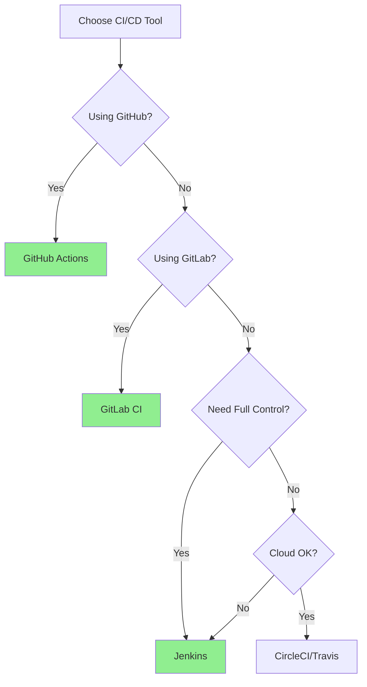

### **Feature Comparison:**

| Feature | Jenkins | GitLab CI | GitHub Actions |
|---------|---------|-----------|----------------|
| **Self-Hosted** | ✅ Yes | ✅ Yes | ⚠️ Limited |
| **Cloud Option** | ⚠️ Vendor | ✅ Yes | ✅ Yes |
| **Pipeline as Code** | ✅ Jenkinsfile | ✅ .gitlab-ci.yml | ✅ workflow.yml |
| **Container Support** | ✅ Plugins | ✅ Native | ✅ Native |
| **Kubernetes** | ✅ Plugin | ✅ Native | ✅ Actions |
| **Matrix Builds** | ✅ Yes | ✅ Yes | ✅ Yes |
| **Secrets Management** | ✅ Credentials | ✅ Variables | ✅ Secrets |
| **Caching** | ✅ Yes | ✅ Yes | ✅ Yes |
| **Parallel Jobs** | ✅ Yes | ✅ Yes | ✅ Yes |
| **Free Tier** | ✅ OSS | ✅ 400 min/month | ✅ 2000 min/month |
| **Learning Curve** | 🔴 High | 🟡 Medium | 🟢 Low |
| **Maintenance** | 🔴 High | 🟡 Medium | 🟢 Low |

---

## **8. Best Practices** ⭐

### **1. Pipeline Design**

#### **Keep Pipelines Fast**
```yaml
# Bad: Sequential execution
build → test → security-scan → deploy
Total time: 60 minutes

# Good: Parallel execution
      ┌─ Unit tests
build ┼─ Integration tests  → deploy
      └─ Security scan
Total time: 25 minutes
```

#### **Fail Fast**
```yaml
stages:
  - lint          # 30 seconds
  - unit-test     # 5 minutes
  - build         # 10 minutes
  - integration   # 15 minutes
# If lint fails, don't waste 30 minutes on later stages
```

#### **Pipeline as Code**
```yaml
# Store pipeline config in repository
.gitlab-ci.yml
Jenkinsfile
.github/workflows/ci.yml

Benefits:
- Version controlled
- Code reviewed
- Reproducible
- Documented
```

### **2. Version Control**

#### **Commit Early, Commit Often**
```bash
# Bad: One commit after 3 days
git commit -m "Implemented entire feature"

# Good: Multiple small commits
git commit -m "feat: Add user validation"
git commit -m "test: Add validation tests"
git commit -m "docs: Update API docs"
```

#### **Use Conventional Commits**
```bash
feat:     New feature
fix:      Bug fix
docs:     Documentation
style:    Code style (formatting)
refactor: Code refactoring
test:     Add tests
chore:    Maintenance

Example:
git commit -m "feat(api): Add user authentication endpoint"
```

### **3. Testing Strategy**

#### **Test Pyramid**
```
         /\
        /E2E\      ← Few, slow, expensive
       /------\
      /  Inte- \   ← Moderate number
     / gration  \
    /------------\
   /   Unit Tests \ ← Many, fast, cheap
  /________________\

Ratio: 70% Unit : 20% Integration : 10% E2E
```

#### **Test Coverage**
```yaml
# Set coverage thresholds
coverage:
  minimum: 80%
  target: 90%
  
# Generate reports
coverage_report:
  - html
  - xml
  - console
```

### **4. Security**

#### **Never Store Secrets in Code**
```bash
# ❌ Bad
password="admin123"
API_KEY="sk-123456789"

# ✅ Good - Use secret management
password=${DB_PASSWORD}      # From env variable
API_KEY=${SECRETS_API_KEY}   # From vault/secrets manager
```

#### **Scan for Vulnerabilities**
```yaml
security-scan:
  stage: security
  script:
    - npm audit              # Dependency scanning
    - trivy image myapp:tag  # Container scanning
    - sonar-scanner          # Code quality
```

### **5. Artifact Management**

#### **Version Everything**
```bash
# Semantic versioning
v1.0.0 - Major.Minor.Patch
v1.0.1 - Patch (bugfix)
v1.1.0 - Minor (feature)
v2.0.0 - Major (breaking change)

# Tag builds
myapp:1.0.0
myapp:1.0.0-beta
myapp:latest
```

#### **Artifact Retention**
```yaml
artifacts:
  paths:
    - dist/
    - build/
  expire_in: 30 days  # Auto cleanup
```

### **6. Environment Management**

#### **Environment Parity**
```
Development ≈ Staging ≈ Production

Use:
- Same OS versions
- Same dependencies
- Same configurations
- Containerization (Docker)
```

#### **Infrastructure as Code**
```yaml
# Define infrastructure in code
terraform apply
ansible-playbook deploy.yml
kubectl apply -f k8s/
```

### **7. Deployment Strategies**

#### **Use Blue/Green Deployment**
```bash
# Zero-downtime deployment
1. Deploy to Green (inactive)
2. Run tests on Green
3. Switch traffic to Green
4. Keep Blue as rollback
```

#### **Implement Canary Releases**
```bash
# Gradual rollout
Phase 1: 5% traffic   (monitor)
Phase 2: 25% traffic  (monitor)
Phase 3: 50% traffic  (monitor)
Phase 4: 100% traffic (complete)
```

### **8. Monitoring & Feedback**

#### **Monitor Everything**
```yaml
metrics:
  - build_duration
  - test_pass_rate
  - deployment_frequency
  - mean_time_to_recovery
  - change_failure_rate
```

#### **Fast Feedback Loops**
```
Code Push → Build → Test → Deploy → Monitor
    ↑                                  ↓
    └──────── Feedback ←───────────────┘

Target: < 15 minutes for feedback
```

### **9. Documentation**

#### **Document Pipeline**
```markdown
# CI/CD Pipeline

## Stages
1. Build - Compiles code
2. Test - Runs test suite
3. Deploy - Deploys to staging

## Environment Variables
- DB_HOST - Database hostname
- API_KEY - External API key

## Troubleshooting
...
```

### **10. Cost Optimization**

#### **Efficient Resource Usage**
```yaml
# Use caching
cache:
  paths:
    - node_modules/
    - .m2/repository/

# Clean up old artifacts
expire_in: 7 days

# Scale runners appropriately
small-job:
  tags: [small-runner]
  
large-job:
  tags: [large-runner]
```

---

## **9. Common Patterns & Strategies** 🎯

### **Branch-Based Strategies:**

#### **1. Git Flow**
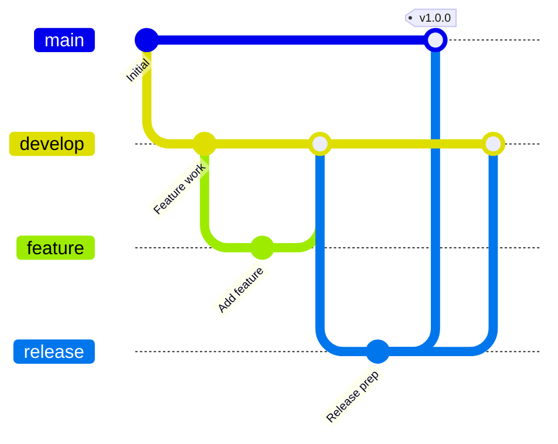

**Pipeline Strategy:**
```yaml
main branch:
  - Full pipeline
  - Deploy to production
  
develop branch:
  - Full pipeline
  - Deploy to staging
  
feature branches:
  - Build + Test only
  - No deployment
```

#### **2. Trunk-Based Development**
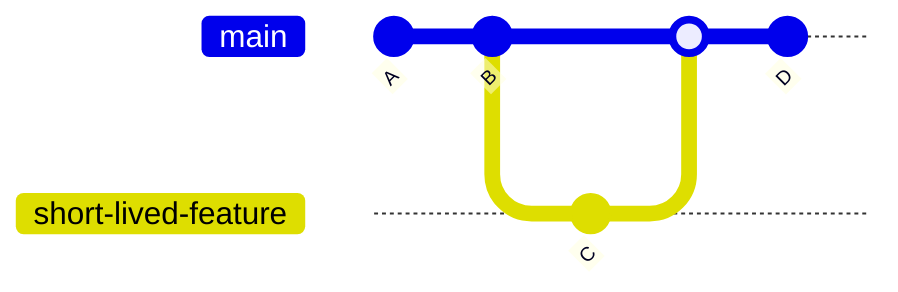

**Pipeline Strategy:**
```yaml
every commit to main:
  - Build
  - Test
  - Auto-deploy to production
  
short-lived branches:
  - Build + Test only
  - Merge quickly (same day)
```

### **Deployment Patterns:**

#### **Blue/Green Deployment**
```yaml
# Step-by-step process
1. Deploy to Green environment (inactive)
   ├─ Install new version
   ├─ Run smoke tests
   └─ Warm up application

2. Switch traffic to Green
   └─ Update load balancer

3. Monitor Green environment
   ├─ Check error rates
   ├─ Monitor performance
   └─ Validate functionality

4. If issues detected:
   └─ Rollback to Blue (instant)
   
5. If successful:
   └─ Decommission Blue (becomes new Green)
```

**Benefits:**
- Zero downtime
- Instant rollback
- Full testing before switch

**Implementation:**
```yaml
deploy:
  script:
    # Deploy to green
    - kubectl apply -f k8s/green/
    # Run tests
    - ./smoke-test.sh green
    # Switch traffic
    - kubectl patch service myapp -p '{"spec":{"selector":{"version":"green"}}}'
    # Monitor
    - ./monitor.sh green 300  # 5 minutes
```

#### **Canary Deployment**
```yaml
# Gradual rollout process
Phase 1 (5% traffic):
  - Deploy canary
  - Route 5% to canary
  - Monitor for 30 minutes
  - Check metrics
  
Phase 2 (25% traffic):
  - Increase to 25%
  - Monitor for 1 hour
  
Phase 3 (50% traffic):
  - Increase to 50%
  - Monitor for 2 hours
  
Phase 4 (100% traffic):
  - Complete rollout
  - Remove old version
```

**Implementation:**
```yaml
deploy-canary:
  script:
    - kubectl apply -f k8s/canary.yaml
    - ./set-traffic.sh canary 5
    - sleep 1800  # 30 min
    - ./check-metrics.sh canary
    - ./set-traffic.sh canary 25
```

#### **Rolling Deployment**
```yaml
# Kubernetes rolling update
deployment:
  strategy:
    type: RollingUpdate
    rollingUpdate:
      maxUnavailable: 1     # Max pods down at once
      maxSurge: 1           # Max extra pods during update
      
Process:
  1. Create 1 new pod
  2. Wait for ready
  3. Terminate 1 old pod
  4. Repeat until complete
```

### **Testing Patterns:**

#### **Shift-Left Testing**
```yaml
# Move testing earlier in pipeline

Traditional:          Shift-Left:
Code                  Code
 ↓                     ↓
Build                Build + Unit Tests
 ↓                     ↓
Test                 Static Analysis
 ↓                     ↓
Deploy               Integration Tests
                       ↓
                     Deploy + Smoke Tests
```

#### **Smoke Testing**
```bash
# Quick validation after deployment
smoke_test() {
    # Health check
    curl -f http://myapp/health || exit 1
    
    # Key endpoint
    curl -f http://myapp/api/v1/status || exit 1
    
    # Database connectivity
    curl -f http://myapp/db-check || exit 1
}
```

### **Caching Strategies:**

#### **Dependency Caching**
```yaml
# GitLab CI
cache:
  key: ${CI_COMMIT_REF_SLUG}
  paths:
    - node_modules/
    - .npm/

# GitHub Actions
- uses: actions/cache@v3
  with:
    path: ~/.npm
    key: ${{ runner.os }}-node-${{ hashFiles('**/package-lock.json') }}
```

#### **Docker Layer Caching**
```dockerfile
# Optimize layer ordering
FROM node:18

# Cache dependencies separately
COPY package*.json ./
RUN npm install  # Cached unless package.json changes

# Copy code (changes frequently)
COPY . .
RUN npm run build
```

### **Parallelization Patterns:**

```yaml
# Run jobs in parallel
jobs:
  unit-tests:
    parallel: 4  # Split tests across 4 runners
    
  lint:
    # Runs in parallel with tests
    
  security-scan:
    # Also runs in parallel
```

---

## **10. Security in CI/CD (DevSecOps)** 🔒

### **Security-First Pipeline:**

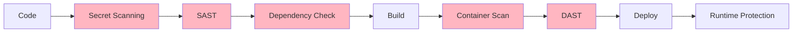

### **Security Scanning Types:**

#### **1. Secret Scanning**
```yaml
# Detect hardcoded secrets
scan-secrets:
  script:
    - git-secrets --scan
    - trufflehog . --json
    - gitleaks detect

Detects:
  - API keys
  - Passwords
  - Private keys
  - Tokens
```

#### **2. SAST (Static Application Security Testing)**
```yaml
# Code analysis without execution
sast:
  script:
    - sonar-scanner
    - semgrep --config=auto
    
Finds:
  - SQL injection
  - XSS vulnerabilities
  - Insecure crypto
  - Code quality issues
```

#### **3. Dependency Scanning**
```yaml
# Check for vulnerable dependencies
dependencies:
  script:
    - npm audit
    - snyk test
    - safety check  # Python
    - bundler-audit # Ruby
    
Checks:
  - Known CVEs
  - License compliance
  - Outdated packages
```

#### **4. Container Scanning**
```yaml
# Scan Docker images
container-scan:
  script:
    - trivy image myapp:latest
    - grype myapp:latest
    - docker scan myapp:latest
    
Scans:
  - Base image vulnerabilities
  - Package vulnerabilities
  - Configuration issues
```

#### **5. DAST (Dynamic Application Security Testing)**
```yaml
# Test running application
dast:
  script:
    - zap-baseline.py -t http://staging.example.com
    
Tests:
  - Authentication flaws
  - Authorization issues
  - Runtime vulnerabilities
```

### **Secret Management:**

#### **Using Environment Variables**
```yaml
# GitLab CI
deploy:
  script:
    - echo $DB_PASSWORD | docker login
  variables:
    DB_HOST: $DB_HOST  # From CI/CD settings
```

#### **Using Secret Managers**
```yaml
# Fetch from Vault
deploy:
  script:
    - export DB_PASS=$(vault kv get -field=password secret/db)
    - ./deploy.sh
```

#### **Using Encrypted Files**
```bash
# Ansible Vault
ansible-vault encrypt secrets.yml
ansible-playbook --vault-password-file=.vault-pass playbook.yml
```

### **Secure Pipeline Configuration:**

```yaml
# Principle of Least Privilege
deploy:
  only:
    - main
  only:
    refs:
      - main
  environment:
    name: production
  when: manual
  allow_failure: false
```

### **Security Best Practices:**

1. **Enable Branch Protection**
```yaml
main branch:
  - Require PR reviews
  - Require status checks
  - No force push
  - No deletions
```

2. **Audit Trails**
```yaml
# Log all pipeline executions
- Who triggered
- What changed
- When executed
- Result status
```

3. **Immutable Infrastructure**
```yaml
# Never modify running systems
# Always deploy new versions
# Treat servers as cattle, not pets
```

4. **Network Segmentation**
```yaml
environments:
  dev:
    network: isolated
  staging:
    network: restricted
  production:
    network: hardened
```

---

## **11. Monitoring & Metrics** 📊

### **Key DevOps Metrics (DORA):**

#### **1. Deployment Frequency**
```
How often do you deploy to production?

Elite:      Multiple deploys per day
High:       Once per day to once per week
Medium:     Once per week to once per month
Low:        Less than once per month

Target: Daily deployments
```

#### **2. Lead Time for Changes**
```
Time from code commit to production deploy

Elite:      Less than 1 hour
High:       1 day to 1 week
Medium:     1 week to 1 month
Low:        More than 1 month

Target: < 1 day
```

#### **3. Mean Time to Recovery (MTTR)**
```
How long to recover from failure?

Elite:      Less than 1 hour
High:       Less than 1 day
Medium:     1 day to 1 week
Low:        More than 1 week

Target: < 4 hours
```

#### **4. Change Failure Rate**
```
% of deployments causing failure

Elite:      0-15%
High:       16-30%
Medium:     31-45%
Low:        46-60%

Target: < 15%
```

### **Pipeline Metrics:**

```yaml
Metrics to Track:
  - Build success rate
  - Average build duration
  - Test pass rate
  - Coverage trends
  - Pipeline queue time
  - Deployment success rate
  - Rollback frequency
  - Time to feedback
```

### **Monitoring Dashboard:**

```yaml
# Grafana Dashboard Panels

Pipeline Health:
  - Success rate (24h)
  - Average duration
  - Current queue
  - Failed builds

Deployment Metrics:
  - Deployments/day
  - Success rate
  - Rollback count
  - MTTR

Quality Metrics:
  - Test pass rate
  - Code coverage %
  - Security vulnerabilities
  - Code quality score

Resource Usage:
  - Runner utilization
  - Build minutes used
  - Storage consumed
  - Cost per build
```

### **Alerting Strategy:**

```yaml
alerts:
  critical:
    - Production deployment failed
    - Security vulnerability HIGH
    - 3 consecutive build failures
    
  warning:
    - Build duration > 30 minutes
    - Test coverage dropped > 5%
    - Deployment queue > 10
    
  info:
    - Successful deployment
    - New dependency available
```

### **Log Aggregation:**

```yaml
# Centralized logging
logs:
  - Build logs → ELK Stack
  - Test results → S3
  - Deployment logs → CloudWatch
  - Security scans → SIEM

Benefits:
  - Searchable
  - Correlatable
  - Retention policies
  - Compliance
```

---

## **12. Interview Cheat Sheet** 🎯

### **Common Questions:**

**Q1: What is the difference between Continuous Delivery and Continuous Deployment?**
```
Answer:
Continuous Delivery:
- Code is always ready for production
- Deployment requires manual approval
- Used in regulated industries

Continuous Deployment:
- Every change auto-deploys to production
- No manual intervention
- Requires mature testing
- Faster feedback

Example: Netflix uses Continuous Deployment, banks use Continuous Delivery.
```

**Q2: Explain a typical CI/CD pipeline.**
```
Answer:
1. Source - Trigger on code commit
2. Build - Compile and package
3. Test - Unit, integration, E2E tests
4. Security - Scan for vulnerabilities
5. Deploy to Staging - Production-like environment
6. Acceptance Tests - Validate functionality
7. Approval Gate - Manual review (optional)
8. Deploy to Production - Blue/Green or Canary
9. Monitor - Continuous monitoring

Duration: 15-45 minutes typically
```

**Q3: What are the benefits of CI/CD?**
```
Answer:
1. Faster Time to Market - Deploy features quickly
2. Higher Quality - Automated testing catches bugs early
3. Reduced Risk - Small, frequent changes
4. Better Collaboration - Shared pipelines
5. Cost Efficiency - Less manual work
6. Faster Feedback - Know issues immediately
7. Improved Productivity - Focus on features, not deployment

ROI: Studies show 40-60% reduction in deployment time
```

**Q4: How do you handle secrets in CI/CD?**
```
Answer:
Never in code or config files!

Methods:
1. CI/CD Secret Variables (GitLab, GitHub Secrets)
2. Secret Managers (HashiCorp Vault, AWS Secrets Manager)
3. Encrypted files (Ansible Vault)
4. Environment-specific configs

Example:
- Store DB password in GitLab CI Variables
- Reference as ${DB_PASSWORD} in pipeline
- Masked in logs
- Rotated regularly
```

**Q5: Describe Blue/Green deployment.**
```
Answer:
Two identical production environments:

Blue: Current production (v1.0)
Green: New version (v1.1)

Process:
1. Deploy v1.1 to Green
2. Run tests on Green
3. Switch load balancer to Green
4. Blue becomes rollback option
5. If issues, instant rollback to Blue

Benefits:
- Zero downtime
- Instant rollback
- Full testing before switch
- Risk mitigation

Used by: Amazon, Netflix, Etsy
```

**Q6: What is a Canary deployment?**
```
Answer:
Gradual rollout to subset of users:

Phase 1: 5% users → New version
         95% users → Old version
         Monitor for 30 minutes
         
Phase 2: 25% → New
Phase 3: 50% → New
Phase 4: 100% → New (if metrics good)

Benefits:
- Early issue detection
- Limited blast radius
- Real user testing
- Gradual risk management

Rollback: If issues, route everyone to old version
```

**Q7: How do you optimize slow CI/CD pipelines?**
```
Answer:
1. Parallelize jobs
   - Run tests in parallel
   - Independent stages concurrently
   
2. Use caching
   - Cache dependencies
   - Docker layer caching
   
3. Fail fast
   - Run quick tests first
   - Lint before build
   
4. Incremental builds
   - Build only changed components
   
5. Resource optimization
   - Right-sized runners
   - Distributed builds
   
6. Remove unnecessary steps
   - Eliminate redundant tests
   - Optimize Docker images

Example: Reduced 60-min pipeline to 15 min
```

**Q8: What testing should be in CI/CD?**
```
Answer:
Test Pyramid:

70% Unit Tests
- Fast (seconds)
- Test individual functions
- High coverage

20% Integration Tests
- Medium speed (minutes)
- Test component interaction
- API contracts

10% E2E Tests
- Slow (10-30 minutes)
- Test user workflows
- Critical paths only

Also include:
- Security scans
- Performance tests
- Smoke tests

Total duration target: < 15 minutes
```

**Q9: Compare Jenkins, GitLab CI, and GitHub Actions.**
```
Answer:

Jenkins:
+ Highly customizable
+ Free, open source
+ 1800+ plugins
- Complex setup
- Requires maintenance

GitLab CI:
+ Integrated platform
+ Auto DevOps
+ Built-in registry
- Resource heavy
- Learning curve

GitHub Actions:
+ Easy to start
+ Large marketplace
+ Native GitHub integration
- GitHub only
- Newer platform

Choice depends on:
- Existing tools
- Team expertise
- Hosting preferences
- Budget
```

**Q10: What is GitOps?**
```
Answer:
Git as single source of truth for infrastructure and applications.

Principles:
1. Everything in Git (IaC, configs, apps)
2. Declarative definitions (Kubernetes YAML)
3. Automated synchronization
4. Git workflow for changes (PR-based)

Example with ArgoCD/Flux:
1. Update Kubernetes manifest in Git
2. ArgoCD detects change
3. Automatically applies to cluster
4. Cluster state matches Git

Benefits:
- Version control for infrastructure
- Easy rollback (Git revert)
- Audit trail
- Disaster recovery
- Collaboration via PRs
```

### **Scenario Questions:**

**Scenario 1: Production deployment fails. What do you do?**
```
Answer:
1. Immediate: Trigger rollback
   - Switch to previous version
   - Verify service restored
   
2. Investigate:
   - Check logs
   - Review changes
   - Identify root cause
   
3. Communicate:
   - Notify stakeholders
   - Update status page
   - Provide ETA
   
4. Fix:
   - Create hotfix branch
   - Write failing test
   - Fix issue
   - Test thoroughly
   
5. Redeploy:
   - Deploy fix via pipeline
   - Monitor closely
   - Verify success
   
6. Post-mortem:
   - Document incident
   - Improve pipeline
   - Prevent recurrence
```

**Scenario 2: Build suddenly takes 2x longer. How to debug?**
```
Answer:
1. Check recent changes
   - Review last commits
   - Check dependency updates
   
2. Analyze logs
   - Identify slow stages
   - Look for new steps
   
3. Check resources
   - Runner capacity
   - Network issues
   - Repository size
   
4. Compare with history
   - Duration trends
   - Changes in test count
   
5. Common causes:
   - New dependencies
   - More tests added
   - Cache invalidated
   - Runner performance
   
Solutions:
   - Parallelize tests
   - Restore cache
   - Upgrade runners
   - Remove unnecessary steps
```

### **Commands to Know:**

```bash
# Jenkins CLI
java -jar jenkins-cli.jar -s http://jenkins:8080/ build job-name
java -jar jenkins-cli.jar -s http://jenkins:8080/ console job-name

# GitLab CI
gitlab-runner register
gitlab-runner verify
gitlab-runner list

# GitHub CLI
gh workflow list
gh workflow run ci.yml
gh run list
gh run watch

# Docker for CI/CD
docker build -t myapp:${CI_COMMIT_SHA} .
docker push myapp:${CI_COMMIT_SHA}
docker run --rm myapp:${CI_COMMIT_SHA} npm test

# Kubernetes deployments
kubectl apply -f deployment.yaml
kubectl rollout status deployment/myapp
kubectl rollout undo deployment/myapp

# Common CI/CD operations
ansible-playbook deploy.yml
terraform apply -auto-approve
helm upgrade myapp ./chart
```

---

## **Next Steps** 📚

### **Deep Dive into Specific Tools:**

- **[Jenkins Tutorials](Jenkins/README.md)** - Master Jenkins pipelines and automation
- **[GitLab CI Tutorials](GitLabCI/README.md)** - Learn GitLab's integrated CI/CD
- **[GitHub Actions Tutorials](GitHubActions/README.md)** - Explore GitHub's native automation

### **Related Topics:**

- **Docker** - Containerization for CI/CD
- **Kubernetes** - Container orchestration
- **Infrastructure as Code** - Terraform, Ansible
- **Monitoring** - Prometheus, Grafana

---

**🎯 Master CI/CD, Master DevOps!**

*CI/CD is not just a tool or process - it's a culture of continuous improvement, automation, and collaboration. These fundamentals apply regardless of which tools you choose.*
