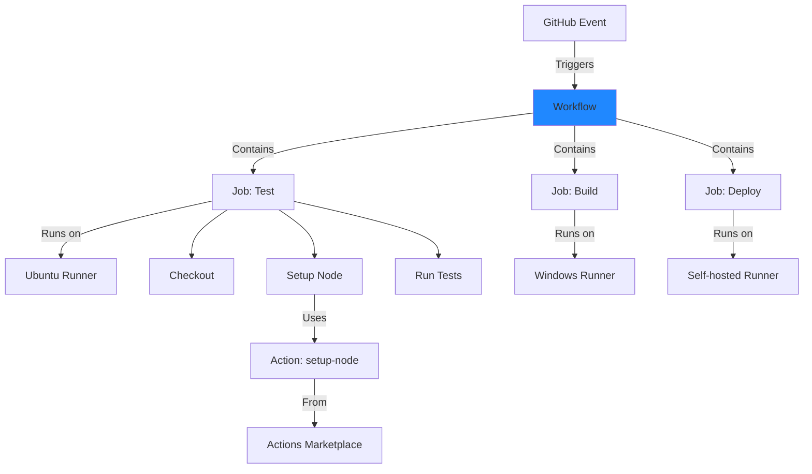

# **GitHub Actions - Cloud-Native CI/CD** 🚀

**Master GitHub's Integrated Automation Platform**

---

## **📋 Overview**

GitHub Actions is GitHub's built-in CI/CD and automation platform integrated directly into GitHub. It enables event-driven workflows that automate your software development lifecycle - from code to deployment, all within GitHub.

```
✅ Native GitHub integration
✅ Zero infrastructure setup
✅ Event-driven (40+ trigger types)
✅ Actions Marketplace (12,000+ actions)
✅ Multi-OS runners (Linux, Windows, macOS)
✅ GitHub-hosted & self-hosted runners
✅ Free tier (2,000 min/month for private repos)
✅ Unlimited for public repositories
```

---

## **🎯 Why Learn GitHub Actions?**

### **Industry Adoption**
- **Fast Growing**: Fastest-growing CI/CD platform
- **GitHub Native**: Seamless if you use GitHub
- **Open Source Friendly**: Unlimited free for public repos
- **Popular With**: Open source projects, startups, cloud-native companies

### **Technical Benefits**
- **No Setup**: Zero infrastructure to manage
- **Event-Driven**: 40+ GitHub event triggers
- **Marketplace**: 12,000+ reusable actions
- **Multi-Platform**: Linux, Windows, macOS runners
- **Matrix Builds**: Test across multiple OS/versions
- **Generous Free Tier**: 2,000 minutes/month for private repos

---

## **📚 Tutorial Structure**

### **GitHub Actions Complete Guide** ⭐ COMPREHENSIVE
**[GitHubActions_Complete_Guide.md](GitHubActions_Complete_Guide.md)** (12 sections, ~65KB)

Everything you need to master GitHub Actions:

```
✅ GitHub Actions overview
✅ Architecture (workflows, jobs, steps, actions, runners)
✅ Workflow syntax (complete YAML reference)
✅ Events & triggers (40+ event types)
✅ Jobs, steps, and actions
✅ GitHub-hosted and self-hosted runners
✅ Advanced workflows (reusable, composite actions)
✅ Actions Marketplace
✅ Real-world workflow examples
✅ Best practices
✅ Troubleshooting
✅ Interview cheat sheet
```

**Time Investment**: 6-8 hours  
**Prerequisites**: GitHub account, basic Git knowledge  
**Outcome**: Build production-ready GitHub Actions workflows

---

## **🚀 Quick Start (2 Minutes)**

### **Create Your First Workflow**

```yaml
# .github/workflows/ci.yml

name: CI

on: [push, pull_request]

jobs:
  build:
    runs-on: ubuntu-latest
    
    steps:
      - name: Checkout code
        uses: actions/checkout@v4
        
      - name: Setup Node.js
        uses: actions/setup-node@v4
        with:
          node-version: '18'
          
      - name: Install dependencies
        run: npm install
        
      - name: Run tests
        run: npm test
```

**That's it!** Push to GitHub and your workflow runs automatically.

### **With Docker Build & Deploy**

```yaml
# .github/workflows/deploy.yml

name: Deploy

on:
  push:
    branches: [main]

env:
  REGISTRY: ghcr.io
  IMAGE_NAME: ${{ github.repository }}

jobs:
  build-and-deploy:
    runs-on: ubuntu-latest
    
    permissions:
      contents: read
      packages: write
    
    steps:
      - uses: actions/checkout@v4
      
      - name: Login to GitHub Container Registry
        uses: docker/login-action@v3
        with:
          registry: ghcr.io
          username: ${{ github.actor }}
          password: ${{ secrets.GITHUB_TOKEN }}
      
      - name: Build and push Docker image
        uses: docker/build-push-action@v5
        with:
          context: .
          push: true
          tags: ghcr.io/${{ env.IMAGE_NAME }}:latest
      
      - name: Deploy to production
        run: |
          kubectl set image deployment/myapp \
            myapp=ghcr.io/${{ env.IMAGE_NAME }}:latest
```

---

## **📖 Learning Paths**

### **Path 1: Beginner (1-2 weeks)**

```
Week 1: Fundamentals
  Day 1-2: Read guide sections 1-4 (overview, architecture, syntax, events)
  Day 3-4: Create your first workflow
  Day 5-6: Add multiple jobs and steps
  Day 7: Implement artifacts and caching
  
Week 2: First Production Workflow
  Day 8-9: Read sections 5-7 (jobs, runners, advanced workflows)
  Day 10-11: Build and test workflow
  Day 12-13: Add Docker build
  Day 14: Deploy to cloud platform
  
✅ Goal: Build complete CI/CD workflows with GitHub Actions
```

### **Path 2: DevOps Professional (3-4 weeks)**

```
Week 1: Core Mastery
  - Complete GitHub Actions guide
  - Master workflow syntax
  - Understand event triggers
  - Build multi-job workflows
  
Week 2: Advanced Features
  - Reusable workflows
  - Composite actions
  - Matrix strategy
  - Environment deployments with approvals
  
Week 3: Actions Marketplace
  - Explore popular actions
  - Create custom actions
  - Docker container actions
  - JavaScript actions
  
Week 4: Production Patterns
  - Multi-environment deployments
  - Security scanning
  - Performance optimization
  - Self-hosted runners
  
✅ Goal: Production-ready GitHub Actions expertise
```

### **Path 3: Platform Engineering (4-6 weeks)**

```
Week 1-2: Advanced Workflows
  - Complex workflow orchestration
  - Workflow dependencies
  - Dynamic matrices
  - Custom actions development
  
Week 3-4: Self-hosted Infrastructure
  - Self-hosted runner setup
  - Runner groups (Enterprise)
  - Auto-scaling runners
  - Security hardening
  
Week 5-6: Enterprise Patterns
  - Organization-level workflows
  - Secrets management at scale
  - Compliance and audit
  - Cost optimization
  
✅ Goal: Design and operate GitHub Actions at scale
```

### **Path 4: Interview Preparation (1 week)**

```
Day 1-2: Fundamentals Review
  - GitHub Actions architecture
  - Workflow syntax
  - Events and triggers
  - Jobs, steps, and actions
  
Day 3-4: Advanced Topics
  - Reusable workflows
  - Custom actions
  - Matrix builds
  - Self-hosted runners
  
Day 5-6: Practical Scenarios
  - Design workflows for various projects
  - Troubleshoot workflow issues
  - Optimize workflow performance
  - Implement security best practices
  
Day 7: Mock Interviews
  - Interview cheat sheet (in guide)
  - Whiteboard workflow designs
  - Live YAML editing
  
✅ Goal: Ace GitHub Actions interviews
```

---

## **🔍 When to Use GitHub Actions**

### **✅ Best Use Cases**

```
GitHub Integration:
  - Already using GitHub for source control
  - Open source projects (unlimited free)
  - Want zero infrastructure
  - Need multi-OS testing (Linux, Windows, Mac)
  
Technical Requirements:
  - Event-driven automation needed
  - Quick setup (< 5 minutes)
  - Cloud-native applications
  - Reusable actions from marketplace
  - Want integrated platform
```

### **⚠️ Consider Alternatives If**

```
- Using GitLab (use GitLab CI)
- Need maximum customization (Jenkins)
- Self-hosted only (Jenkins)
- Complex enterprise build systems

Alternatives:
  - GitLab CI (integrated GitLab platform)
  - Jenkins (maximum flexibility)
  - CircleCI (cloud-hosted simplicity)
```

---

## **💡 Key Concepts**

### **GitHub Actions Architecture**



### **Event Types**

| Event | Trigger | Use Case |
|-------|---------|----------|
| **push** | Code pushed | CI builds |
| **pull_request** | PR opened/updated | PR validation |
| **schedule** | Cron schedule | Nightly builds |
| **workflow_dispatch** | Manual trigger | On-demand runs |
| **release** | Release created | Release automation |

### **Runner Types**

| Runner | OS Options | Cost | Use Case |
|--------|------------|------|----------|
| **GitHub-hosted** | Ubuntu, Windows, macOS | Free tier | Most projects |
| **Self-hosted** | Any | Infrastructure only | Custom requirements |

---

## **🎯 Interview Preparation**

### **Common Interview Questions**

1. **What is GitHub Actions and how does it differ from Jenkins?**
2. **Explain the structure of a GitHub Actions workflow**
3. **What events can trigger GitHub Actions workflows?**
4. **What is the Actions Marketplace?**
5. **How do you create a reusable workflow?**
6. **What's the difference between GitHub-hosted and self-hosted runners?**
7. **How do you handle secrets in GitHub Actions?**
8. **How do matrix builds work?**
9. **How do you optimize GitHub Actions workflows?**
10. **How do you create custom actions?**

**Detailed answers**: See interview cheat sheet in the guide!

### **Practical Exercises**

- Create multi-job workflow
- Implement matrix strategy
- Use marketplace actions
- Build Docker images
- Deploy to cloud platforms
- Create reusable workflow
- Develop custom action

---

## **🔧 Common Workflow Patterns**

### **Basic Node.js CI/CD**

```yaml
name: Node.js CI/CD

on:
  push:
    branches: [main]
  pull_request:
    branches: [main]

jobs:
  test:
    runs-on: ubuntu-latest
    
    strategy:
      matrix:
        node: [16, 18, 20]
    
    steps:
      - uses: actions/checkout@v4
      
      - name: Setup Node.js
        uses: actions/setup-node@v4
        with:
          node-version: ${{ matrix.node }}
          cache: 'npm'
      
      - name: Install dependencies
        run: npm ci
      
      - name: Run tests
        run: npm test
```

### **Docker Build & Push**

```yaml
name: Docker

on:
  push:
    branches: [main]
    tags: ['v*']

env:
  REGISTRY: ghcr.io
  IMAGE_NAME: ${{ github.repository }}

jobs:
  build:
    runs-on: ubuntu-latest
    
    permissions:
      contents: read
      packages: write
    
    steps:
      - uses: actions/checkout@v4
      
      - name: Login to GitHub Container Registry
        uses: docker/login-action@v3
        with:
          registry: ${{ env.REGISTRY }}
          username: ${{ github.actor }}
          password: ${{ secrets.GITHUB_TOKEN }}
      
      - name: Build and push
        uses: docker/build-push-action@v5
        with:
          context: .
          push: true
          tags: |
            ${{ env.REGISTRY }}/${{ env.IMAGE_NAME }}:latest
            ${{ env.REGISTRY }}/${{ env.IMAGE_NAME }}:${{ github.sha }}
```

### **Multi-Environment Deployment**

```yaml
name: Deploy

on:
  push:
    branches: [main, develop]

jobs:
  deploy-staging:
    if: github.ref == 'refs/heads/develop'
    runs-on: ubuntu-latest
    environment: staging
    
    steps:
      - uses: actions/checkout@v4
      - name: Deploy to staging
        run: ./deploy.sh staging
  
  deploy-production:
    if: github.ref == 'refs/heads/main'
    runs-on: ubuntu-latest
    environment: production
    
    steps:
      - uses: actions/checkout@v4
      - name: Deploy to production
        run: ./deploy.sh production
```

### **Reusable Workflow**

```yaml
# .github/workflows/reusable-test.yml
name: Reusable Test

on:
  workflow_call:
    inputs:
      node-version:
        required: true
        type: string

jobs:
  test:
    runs-on: ubuntu-latest
    steps:
      - uses: actions/checkout@v4
      - uses: actions/setup-node@v4
        with:
          node-version: ${{ inputs.node-version }}
      - run: npm ci && npm test
```

```yaml
# .github/workflows/main.yml (caller)
name: Main

on: [push]

jobs:
  test-node-16:
    uses: ./.github/workflows/reusable-test.yml
    with:
      node-version: '16'
  
  test-node-18:
    uses: ./.github/workflows/reusable-test.yml
    with:
      node-version: '18'
```

---

## **📊 Best Practices Summary**

### **✅ Do**
```
✓ Use workflows in .github/workflows/
✓ Pin actions to SHA (not tag) for security
✓ Use GitHub-hosted runners when possible
✓ Implement caching for dependencies
✓ Use matrix for multi-platform testing
✓ Set appropriate permissions
✓ Use secrets for sensitive data
✓ Implement artifact retention policies
✓ Use concurrency to cancel old runs
✓ Create reusable workflows
```

### **❌ Don't**
```
✗ Hardcode secrets in workflows
✗ Use latest tags in production
✗ Expose secrets in logs
✗ Keep unlimited workflow runs
✗ Ignore security updates
✗ Run untrusted code without review
✗ Use excessive runner minutes
✗ Skip workflow optimization
```

---

## **🌟 GitHub Actions Advantages**

### **Zero Infrastructure**
```
No Setup Needed:
  ✅ GitHub-hosted runners (free tier)
  ✅ No servers to maintain
  ✅ Automatic updates
  ✅ Multi-OS support
  ✅ Scale automatically
  
Fast Start:
  - Create workflow file
  - Push to GitHub
  - That's it!
```

### **Event-Driven Power**
```
40+ Event Types:
  ✅ push, pull_request
  ✅ issues, issue_comment
  ✅ release, deployment
  ✅ schedule (cron)
  ✅ workflow_dispatch (manual)
  ✅ repository_dispatch (API)
  ✅ And many more...
  
Automate Everything:
  - Not just CI/CD
  - Issue management
  - Release automation
  - Project automation
```

### **Actions Marketplace**
```
12,000+ Reusable Actions:
  ✅ Setup languages
  ✅ Deploy to clouds
  ✅ Security scanning
  ✅ Notifications
  ✅ Code quality
  ✅ And much more...
  
Don't Reinvent:
  - Use community actions
  - Share your own
  - Rapid development
```

---

## **🔗 Related Resources**

### **Within This CI/CD Collection**
- **[CI/CD Fundamentals](../CI_CD_Fundamentals.md)** - Core concepts
- **[Jenkins](../Jenkins/)** - Alternative: Self-hosted flexibility
- **[GitLab CI](../GitLabCI/)** - Alternative: Integrated platform
- **[Main CI/CD README](../README.md)** - Tool comparison and selection

### **Related DevOps Topics**
- **[Docker](../../Docker.md)** - Containerization
- **[Kubernetes](../../Kubernetes.md)** - Container orchestration
- **[Shell Scripting](../../ShellScripting.md)** - Automation scripts

### **External Resources**
- [GitHub Actions Documentation](https://docs.github.com/en/actions)
- [Actions Marketplace](https://github.com/marketplace?type=actions)
- [Workflow Syntax Reference](https://docs.github.com/en/actions/reference/workflow-syntax-for-github-actions)
- [GitHub Community](https://github.community/)
- [Awesome Actions](https://github.com/sdras/awesome-actions)

---

## **📈 Your Learning Checklist**

- [ ] Create GitHub account (if not already)
- [ ] Read GitHub Actions Complete Guide
- [ ] Create your first workflow file
- [ ] Understand workflow syntax
- [ ] Use actions from marketplace
- [ ] Implement matrix builds
- [ ] Configure secrets
- [ ] Build Docker images
- [ ] Deploy to cloud platform
- [ ] Create reusable workflow
- [ ] Develop custom action
- [ ] Set up self-hosted runner (optional)
- [ ] Review interview cheat sheet

---

## **⚡ GitHub Actions vs Competitors**

### **vs Jenkins**
```
GitHub Actions:
  ✅ Zero setup
  ✅ GitHub integration
  ✅ Cloud-hosted runners
  ✅ Event-driven
  ❌ Less flexible
  
Jenkins:
  ✅ More plugins
  ✅ More customization
  ❌ Complex setup
  ❌ Separate tool
```

### **vs GitLab CI**
```
GitHub Actions:
  ✅ Larger marketplace (12,000 actions)
  ✅ Multi-OS (Mac, Win, Linux)
  ✅ Event-driven (40+ events)
  ❌ GitHub only
  
GitLab CI:
  ✅ Integrated platform
  ✅ Auto DevOps
  ✅ Self-hosted option
  ❌ Smaller marketplace
```

---

**🚀 Ready to Master GitHub Actions?**

**Start Here**: [GitHub Actions Complete Guide](GitHubActions_Complete_Guide.md) ➡️ Create Workflow ➡️ Automate Everything!

*GitHub Actions makes CI/CD accessible to everyone - from first commit to production, all within GitHub.*

---

**Quick Stats:**
- **1 Comprehensive Guide**: Complete workflow reference (~65KB)
- **12 Sections**: From basics to advanced
- **50+ Code Examples**: Real-world workflow files
- **10+ Interview Q&A**: Scenario-based questions
- **Multiple Learning Paths**: Beginner to Platform Engineer

💡 **Pro Tip**: Start with a simple push-triggered workflow, then expand with more events and actions from the marketplace!
