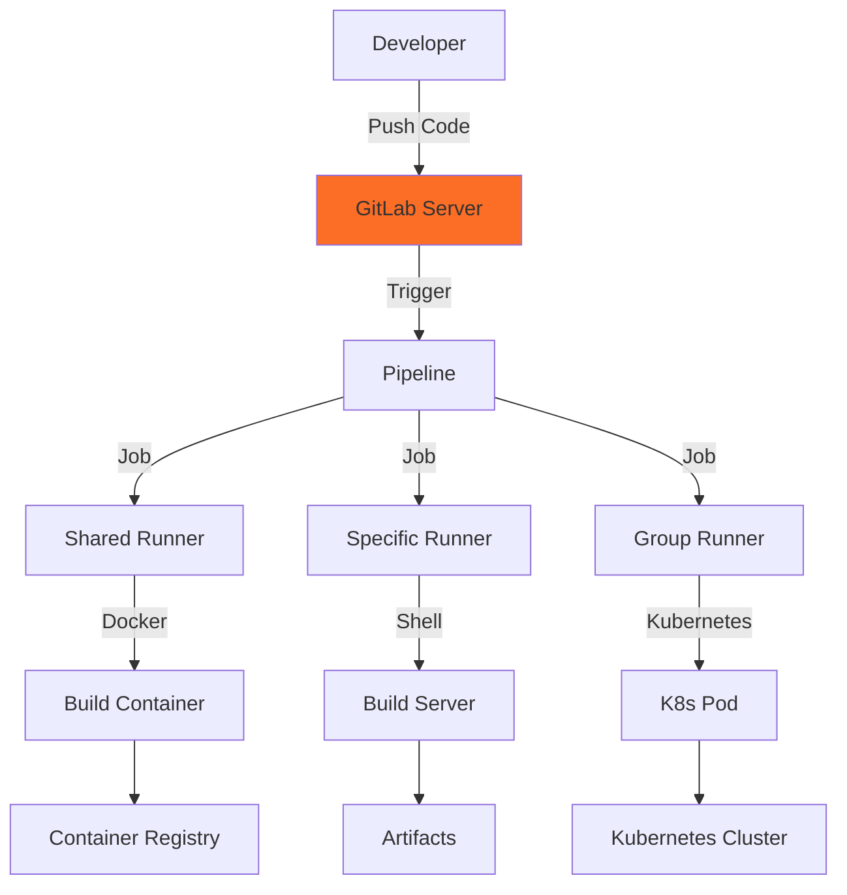

# **GitLab CI/CD - Integrated DevOps Platform** 🦊

**Master GitLab's Complete DevOps Platform: From Git to Production**

---

## **📋 Overview**

GitLab CI/CD is a built-in continuous integration and delivery platform integrated directly into GitLab. It provides a complete DevOps lifecycle in a single application - from planning and source code management to CI/CD, security, and monitoring.

```
✅ Integrated into GitLab (all-in-one)
✅ Built-in Container Registry
✅ Kubernetes native
✅ Auto DevOps (zero-config)
✅ Security scanning (SAST, DAST, dependency)
✅ Review Apps
✅ SaaS or Self-hosted
✅ Generous free tier
```

---

## **🎯 Why Learn GitLab CI/CD?**

### **Industry Adoption**
- **Fast Growing**: Adoption increasing 40% year-over-year
- **Complete Platform**: Git + CI/CD + Security + Deployment
- **Cloud Native**: Kubernetes-first approach
- **Popular With**: Startups, cloud-native companies, security-conscious orgs

### **Technical Benefits**
- **Zero Configuration**: Auto DevOps for instant CI/CD
- **Built-in Registry**: Container images stored with code
- **Kubernetes Integration**: Native deployment support
- **Security First**: SAST, DAST, dependency scanning included
- **Review Apps**: Temporary environments per merge request

---

## **📚 Tutorial Structure**

### **GitLab CI Complete Guide** ⭐ COMPREHENSIVE
**[GitLabCI_Complete_Guide.md](GitLabCI_Complete_Guide.md)** (12 sections, ~55KB)

Everything you need to master GitLab CI/CD:

```
✅ GitLab CI/CD overview
✅ Architecture (GitLab server, runners, executors)
✅ .gitlab-ci.yml syntax (complete reference)
✅ Jobs, stages, and pipelines
✅ GitLab Runners (installation, configuration)
✅ Advanced pipeline features (rules, DAG, merge requests)
✅ Docker & Kubernetes integration
✅ Auto DevOps (zero-config pipelines)
✅ Real-world pipeline examples
✅ Best practices
✅ Troubleshooting
✅ Interview cheat sheet
```

**Time Investment**: 6-8 hours  
**Prerequisites**: Basic Git, Docker understanding  
**Outcome**: Build production-ready GitLab CI/CD pipelines

---

## **🚀 Quick Start (3 Minutes)**

### **Option 1: GitLab.com (Fastest)**

```yaml
# .gitlab-ci.yml in your repository root

stages:
  - build
  - test
  - deploy

build-job:
  stage: build
  script:
    - echo "Building the application..."
    - npm install
    - npm run build
  artifacts:
    paths:
      - dist/

test-job:
  stage: test
  script:
    - echo "Running tests..."
    - npm test

deploy-job:
  stage: deploy
  script:
    - echo "Deploying to production..."
    - ./deploy.sh
  only:
    - main
```

**That's it!** Push to GitLab and your pipeline runs automatically.

### **Option 2: With Docker**

```yaml
# .gitlab-ci.yml with Docker

image: node:18-alpine

stages:
  - build
  - test
  - deploy

cache:
  paths:
    - node_modules/

build:
  stage: build
  script:
    - npm ci
    - npm run build
  artifacts:
    paths:
      - dist/
    expire_in: 1 week

test:
  stage: test
  script:
    - npm test -- --coverage
  coverage: '/All files[^|]*\|[^|]*\s+([\d\.]+)/'

deploy:
  stage: deploy
  script:
    - kubectl set image deployment/myapp myapp=$CI_REGISTRY_IMAGE:$CI_COMMIT_SHA
  only:
    - main
  environment:
    name: production
    url: https://myapp.com
```

---

## **📖 Learning Paths**

### **Path 1: Beginner (1-2 weeks)**

```
Week 1: Fundamentals
  Day 1-2: Read guide sections 1-4 (overview, architecture, syntax)
  Day 3-4: Create .gitlab-ci.yml for a sample project
  Day 5-6: Add jobs, stages, and artifacts
  Day 7: Implement caching and environments
  
Week 2: First Production Pipeline
  Day 8-9: Read sections 5-7 (runners, advanced features, Docker)
  Day 10-11: Build Docker images
  Day 12-13: Deploy to Kubernetes
  Day 14: Try Auto DevOps
  
✅ Goal: Build complete CI/CD pipelines with GitLab
```

### **Path 2: DevOps Professional (3-4 weeks)**

```
Week 1: Core Mastery
  - Complete GitLab CI guide
  - Master .gitlab-ci.yml syntax
  - Understand runner types
  - Configure GitLab Runner
  
Week 2: Advanced Features
  - DAG pipelines (directed acyclic graph)
  - Merge request pipelines
  - Review Apps implementation
  - Parent-child pipelines
  
Week 3: Container & Kubernetes
  - Container Registry usage
  - Multi-stage Docker builds
  - Kubernetes deployments
  - Helm chart deployments
  
Week 4: Security & Compliance
  - SAST integration
  - DAST scanning
  - Dependency scanning
  - Container scanning
  - Compliance pipelines
  
✅ Goal: Production-ready GitLab CI/CD expertise
```

### **Path 3: GitLab Platform Admin (4-6 weeks)**

```
Week 1-2: GitLab Administration
  - Self-hosted GitLab installation
  - Runner infrastructure (Docker, Kubernetes)
  - Scaling strategies
  - Backup and recovery
  
Week 3-4: Enterprise Features
  - Group-level CI/CD variables
  - Compliance frameworks
  - Security dashboard
  - Audit logs
  
Week 5-6: Platform Engineering
  - Runner auto-scaling
  - Shared runners management
  - CI/CD templates
  - Cost optimization
  
✅ Goal: Administer enterprise GitLab platforms
```

### **Path 4: Interview Preparation (1 week)**

```
Day 1-2: Fundamentals Review
  - GitLab CI/CD architecture
  - .gitlab-ci.yml structure
  - Runner types and executors
  
Day 3-4: Advanced Topics
  - Auto DevOps benefits
  - Review Apps use cases
  - Security scanning types
  - GitLab CI vs competitors
  
Day 5-6: Practical Scenarios
  - Design .gitlab-ci.yml for various projects
  - Troubleshoot pipeline issues
  - Optimize pipeline performance
  - Implement security scanning
  
Day 7: Mock Interviews
  - Interview cheat sheet (in guide)
  - Whiteboard pipeline designs
  - Live YAML editing
  
✅ Goal: Ace GitLab CI/CD interviews
```

---

## **🔍 When to Use GitLab CI/CD**

### **✅ Best Use Cases**

```
Integrated Platform Needs:
  - Want all DevOps tools in one place
  - Git + CI/CD + Security + Deployment
  - Kubernetes-native deployments
  - Built-in container registry needed
  
Technical Requirements:
  - Zero-config CI/CD (Auto DevOps)
  - Review Apps for merge requests
  - Built-in security scanning
  - Self-hosted or SaaS flexibility
  - Complete audit trail
```

### **⚠️ Consider Alternatives If**

```
- Already using GitHub (use GitHub Actions)
- Need Jenkins plugins ecosystem
- Simple projects (GitHub Actions may be simpler)
- Windows-heavy environment

Alternatives:
  - GitHub Actions (GitHub integration)
  - Jenkins (maximum flexibility)
  - Azure DevOps (Microsoft stack)
```

---

## **💡 Key Concepts**

### **GitLab CI/CD Architecture**



### **Runner Types**

| Type | Scope | Use Case |
|------|-------|----------|
| **Shared** | All projects | GitLab.com runners |
| **Group** | Group projects | Team/department runners |
| **Specific** | One project | Dedicated project runner |

### **Executor Types**

| Executor | Environment | Use Case |
|----------|-------------|----------|
| **Shell** | Host machine | Simple scripts |
| **Docker** | Docker container | Isolated builds |
| **Kubernetes** | K8s pod | Cloud-native |
| **Docker Machine** | Auto-scaling | Variable load |

---

## **🎯 Interview Preparation**

### **Common Interview Questions**

1. **What is GitLab CI/CD and how is it different from Jenkins?**
2. **Explain GitLab Runner and executor types**
3. **What is Auto DevOps?**
4. **How do Review Apps work?**
5. **What security scanning does GitLab provide?**
6. **How do you implement Kubernetes deployment in GitLab CI?**
7. **What is the difference between artifacts and cache?**
8. **How do you optimize GitLab CI pipelines?**
9. **What are DAG pipelines?**
10. **How do you handle secrets in GitLab CI?**

**Detailed answers**: See interview cheat sheet in the guide!

### **Practical Exercises**

- Create multi-stage .gitlab-ci.yml
- Implement Review Apps
- Configure GitLab Runner
- Build and push Docker images
- Deploy to Kubernetes
- Enable security scanning

---

## **🔧 Common Pipeline Patterns**

### **Basic Multi-Stage Pipeline**

```yaml
stages:
  - build
  - test
  - deploy

build:
  stage: build
  script:
    - npm ci
    - npm run build
  artifacts:
    paths:
      - dist/

test:
  stage: test
  script:
    - npm test
  coverage: '/All files.*?(\d+\.\d+)/'

deploy:
  stage: deploy
  script:
    - ./deploy.sh
  only:
    - main
  environment:
    name: production
    url: https://myapp.com
```

### **Docker Build & Push**

```yaml
docker-build:
  stage: build
  image: docker:latest
  services:
    - docker:dind
  before_script:
    - docker login -u $CI_REGISTRY_USER -p $CI_REGISTRY_PASSWORD $CI_REGISTRY
  script:
    - docker build -t $CI_REGISTRY_IMAGE:$CI_COMMIT_SHA .
    - docker push $CI_REGISTRY_IMAGE:$CI_COMMIT_SHA
  only:
    - main
```

### **Kubernetes Deployment**

```yaml
deploy-k8s:
  stage: deploy
  image: bitnami/kubectl:latest
  script:
    - kubectl set image deployment/myapp myapp=$CI_REGISTRY_IMAGE:$CI_COMMIT_SHA
    - kubectl rollout status deployment/myapp
  environment:
    name: production
    kubernetes:
      namespace: production
  only:
    - main
```

### **Review Apps (Merge Requests)**

```yaml
review:
  stage: deploy
  script:
    - kubectl create namespace review-$CI_MERGE_REQUEST_IID || true
    - helm upgrade --install review-$CI_MERGE_REQUEST_IID ./chart
  environment:
    name: review/$CI_MERGE_REQUEST_IID
    url: https://review-$CI_MERGE_REQUEST_IID.example.com
    on_stop: stop-review
    auto_stop_in: 1 day
  only:
    - merge_requests

stop-review:
  stage: deploy
  script:
    - helm uninstall review-$CI_MERGE_REQUEST_IID
    - kubectl delete namespace review-$CI_MERGE_REQUEST_IID
  environment:
    name: review/$CI_MERGE_REQUEST_IID
    action: stop
  when: manual
  only:
    - merge_requests
```

---

## **📊 Best Practices Summary**

### **✅ Do**
```
✓ Use .gitlab-ci.yml in repository root
✓ Define stages for clear pipeline flow
✓ Use artifacts to pass files between jobs
✓ Cache dependencies (node_modules, .m2, etc.)
✓ Use rules instead of only/except (modern)
✓ Implement Review Apps for merge requests
✓ Set artifact expiration to save space
✓ Use CI/CD variables for configuration
✓ Enable security scanning (SAST, DAST)
✓ Use needs for DAG pipelines (faster)
```

### **❌ Don't**
```
✗ Hardcode credentials in .gitlab-ci.yml
✗ Use latest tags in production
✗ Keep artifacts forever (set expire_in)
✗ Run all jobs sequentially (use needs)
✗ Commit CI/CD variables in code
✗ Skip security scanning
✗ Use only/except (use rules instead)
✗ Ignore pipeline optimization
```

---

## **🌟 GitLab CI/CD Advantages**

### **All-in-One Platform**
```
Single Application:
  ✅ Git repository
  ✅ CI/CD pipelines
  ✅ Container Registry
  ✅ Security scanning
  ✅ Issue tracking
  ✅ Wiki/Documentation
  ✅ Kubernetes integration
  
No Integration Needed:
  - Everything works together out-of-box
  - Single authentication
  - Unified permissions
  - One tool to learn
```

### **Auto DevOps Magic**
```
Zero Configuration:
  ✅ Automatic language detection
  ✅ Auto builds
  ✅ Auto testing
  ✅ Auto security scanning
  ✅ Auto deployments
  ✅ Auto monitoring
  
Just push code → Full CI/CD automatically!
```

### **Kubernetes Native**
```
Built-in Features:
  ✅ GitLab Agent for Kubernetes
  ✅ Deploy to multiple clusters
  ✅ Review Apps on K8s
  ✅ Auto scaling
  ✅ Canary deployments
  ✅ Feature flags
```

---

## **🔗 Related Resources**

### **Within This CI/CD Collection**
- **[CI/CD Fundamentals](../CI_CD_Fundamentals.md)** - Core concepts
- **[Jenkins](../Jenkins/)** - Alternative: Maximum flexibility
- **[GitHub Actions](../GitHubActions/)** - Alternative: GitHub-native
- **[Main CI/CD README](../README.md)** - Tool comparison and selection

### **Related DevOps Topics**
- **[Docker](../../Docker.md)** - Containerization
- **[Kubernetes](../../Kubernetes.md)** - Container orchestration
- **[Shell Scripting](../../ShellScripting.md)** - Automation scripts

### **External Resources**
- [GitLab CI/CD Documentation](https://docs.gitlab.com/ee/ci/)
- [GitLab CI/CD Examples](https://docs.gitlab.com/ee/ci/examples/)
- [GitLab Runner Docs](https://docs.gitlab.com/runner/)
- [GitLab Forum](https://forum.gitlab.com/)
- [Auto DevOps Guide](https://docs.gitlab.com/ee/topics/autodevops/)

---

## **📈 Your Learning Checklist**

- [ ] Create GitLab account (GitLab.com or self-hosted)
- [ ] Read GitLab CI Complete Guide
- [ ] Create your first .gitlab-ci.yml
- [ ] Understand stages and jobs
- [ ] Implement artifacts and caching
- [ ] Configure environments
- [ ] Install GitLab Runner (if self-hosted)
- [ ] Build Docker images
- [ ] Push to Container Registry
- [ ] Deploy to Kubernetes
- [ ] Implement Review Apps
- [ ] Try Auto DevOps
- [ ] Enable security scanning
- [ ] Review interview cheat sheet

---

## **🎓 Certification**

**GitLab Certified CI/CD Associate**
- Validates GitLab CI/CD expertise
- Covers .gitlab-ci.yml, runners, deployments
- Industry-recognized credential

**Preparation**: Complete the guide + hands-on projects

---

## **⚡ GitLab CI/CD vs Competitors**

### **vs Jenkins**
```
GitLab CI/CD:
  ✅ Integrated (no separate tool)
  ✅ Easier setup
  ✅ Built-in features
  ❌ Fewer plugins
  
Jenkins:
  ✅ More plugins
  ✅ More flexible
  ❌ Separate tool
  ❌ Complex setup
```

### **vs GitHub Actions**
```
GitLab CI/CD:
  ✅ Self-hosted option
  ✅ Auto DevOps
  ✅ Built-in security scanning
  ❌ Smaller marketplace
  
GitHub Actions:
  ✅ Larger marketplace
  ✅ Multi-OS (Mac, Win, Linux)
  ✅ If already on GitHub
  ❌ SaaS primarily
```

---

**🦊 Ready to Master GitLab CI/CD?**

**Start Here**: [GitLab CI Complete Guide](GitLabCI_Complete_Guide.md) ➡️ Create .gitlab-ci.yml ➡️ Deploy to Production!

*GitLab CI/CD offers the most integrated DevOps experience - from planning to production deployment, all in one platform.*

---

**Quick Stats:**
- **1 Comprehensive Guide**: Complete CI/CD reference (~55KB)
- **12 Sections**: From basics to advanced
- **50+ Code Examples**: Real-world .gitlab-ci.yml files
- **10+ Interview Q&A**: Scenario-based questions
- **Multiple Learning Paths**: Beginner to Platform Admin

💡 **Pro Tip**: Start with GitLab.com (free SaaS) for instant access, then try Auto DevOps for zero-config CI/CD!
