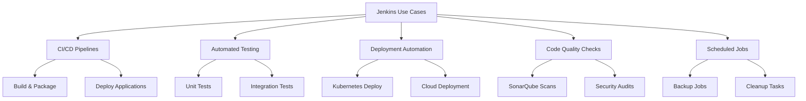
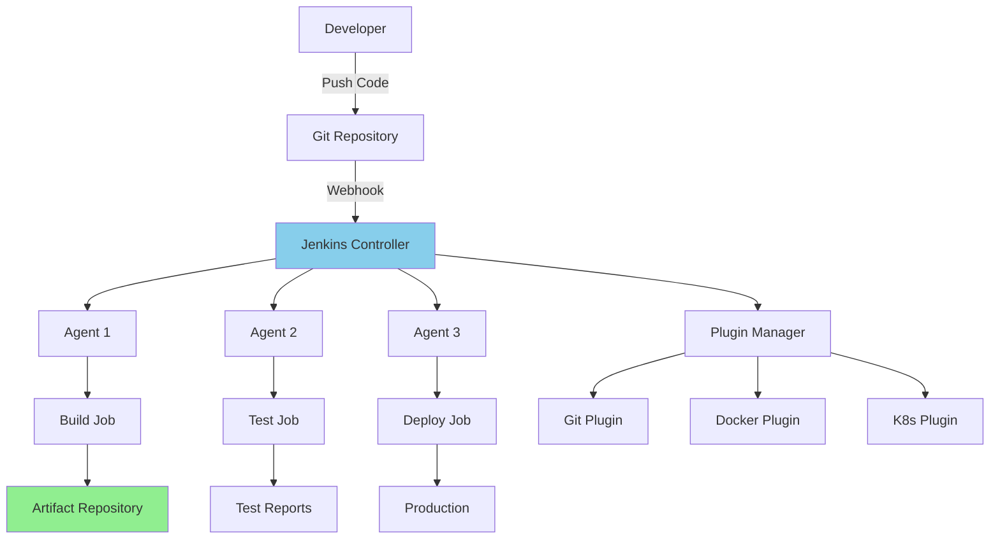
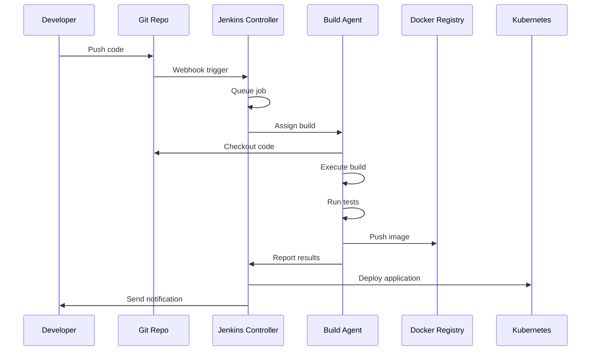
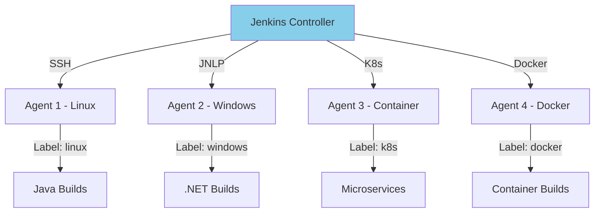

# **Jenkins Fundamentals** 🔧⚙️

**Master Jenkins - The Most Popular CI/CD Automation Server**

---

## **Table of Contents** 📑
1. [What is Jenkins?](#1-what-is-jenkins)
2. [Jenkins Architecture](#2-jenkins-architecture)
3. [Installation & Setup](#3-installation--setup)
4. [Jenkins UI Overview](#4-jenkins-ui-overview)
5. [Jobs, Projects & Builds](#5-jobs-projects--builds)
6. [Plugins Ecosystem](#6-plugins-ecosystem)
7. [Distributed Builds](#7-distributed-builds)
8. [Security & User Management](#8-security--user-management)
9. [Backup & Disaster Recovery](#9-backup--disaster-recovery)
10. [Configuration as Code](#10-configuration-as-code)
11. [Integration with Version Control](#11-integration-with-version-control)
12. [Interview Cheat Sheet](#12-interview-cheat-sheet)

---

## **1. What is Jenkins?** 🎯

### **Definition:**

**Jenkins** is an open-source automation server that enables developers to reliably build, test, and deploy their software. It's the most widely used CI/CD tool with over 1800 plugins supporting virtually any technology stack.

### **Key Features:**

```
✅ Open Source & Free
✅ Extensible (1800+ plugins)
✅ Distributed builds
✅ Easy installation
✅ Configuration as code
✅ Rich plugin ecosystem
✅ Strong community support
✅ Platform independent
```

### **History:**

```
2004 → Hudson (by Kohsuke Kawaguchi at Sun)
2011 → Fork renamed to Jenkins (Oracle dispute)
2014 → Jenkins 2.0 (Pipeline as Code)
2020 → Jenkins X (Cloud-native)
2023 → 300,000+ installations worldwide
```

### **Why Jenkins?**

| Aspect | Value |
|--------|-------|
| **Market Share** | 70%+ of CI/CD market |
| **Flexibility** | Works with any stack |
| **Customization** | Highly configurable |
| **Cost** | Free and open source |
| **Community** | Massive ecosystem |
| **Maturity** | 15+ years of development |

### **Use Cases:**



---

## **2. Jenkins Architecture** 🏗️

### **Core Architecture:**



### **Components:**

#### **1. Jenkins Controller (Master)**
```
Role: Central coordination server

Responsibilities:
  - Schedule builds
  - Dispatch builds to agents
  - Monitor agents
  - Record and present build results
  - Execute builds on built-in node (optional)
  
Resources:
  - Jenkins home directory (~/.jenkins)
  - Configuration data
  - Build history
  - Plugin binaries
```

#### **2. Jenkins Agent (Slave)**
```
Role: Build execution environment

Types:
  - Permanent agents (always connected)
  - Cloud agents (dynamic, on-demand)
  - Docker agents (containerized)
  - Kubernetes pods (ephemeral)
  
Connection Methods:
  - SSH
  - JNLP (Java Web Start)
  - WebSocket
  
Configuration:
  - Labels (java, docker, linux)
  - Executors (parallel builds)
  - Tools (JDK, Maven, Node)
```

#### **3. Jobs/Projects**
```
Types:
  - Freestyle Project (GUI-based)
  - Pipeline (Pipeline as Code)
  - Multibranch Pipeline (multiple branches)
  - Organization Folder (scan repos)
  
Components:
  - Source code management
  - Build triggers
  - Build steps
  - Post-build actions
```

#### **4. Plugins**
```
Categories:
  - Source Control (Git, SVN)
  - Build Tools (Maven, Gradle)
  - Cloud (AWS, Azure, GCP)
  - Containers (Docker, Kubernetes)
  - Notifications (Slack, Email)
  - Security (LDAP, OAuth)
  
Management:
  - Plugin Manager UI
  - Auto-update capabilities
  - Dependency resolution
```

### **Data Flow:**



### **Jenkins Home Directory:**

```
$JENKINS_HOME/
├── config.xml                 # Main Jenkins config
├── credentials.xml            # Stored credentials
├── jobs/                      # Job configurations
│   ├── my-pipeline/
│   │   ├── config.xml        # Job config
│   │   ├── builds/           # Build history
│   │   │   ├── 1/
│   │   │   ├── 2/
│   │   │   └── legacyIds
│   │   └── nextBuildNumber
├── nodes/                     # Agent configurations
│   ├── agent-1/
│   └── agent-2/
├── plugins/                   # Installed plugins
│   ├── git.jpi
│   ├── workflow-aggregator.jpi
│   └── ...
├── secrets/                   # Encryption keys
│   ├── master.key
│   └── hudson.util.Secret
├── users/                     # User data
├── workspace/                 # Build workspaces
├── logs/                      # Jenkins logs
└── updates/                   # Update center data
```

### **Build Execution Flow:**

```
1. Trigger Build
   ├─ Manual trigger
   ├─ SCM polling
   ├─ Webhook
   └─ Scheduled (cron)
   
2. Queue Job
   ├─ Check dependencies
   ├─ Wait for available executor
   └─ Assign priority
   
3. Checkout Code
   ├─ Clone repository
   ├─ Checkout branch/commit
   └─ Apply patches
   
4. Execute Build Steps
   ├─ Set environment
   ├─ Run shell commands
   ├─ Execute build tools
   └─ Run tests
   
5. Post-Build Actions
   ├─ Archive artifacts
   ├─ Publish reports
   ├─ Send notifications
   └─ Trigger downstream jobs
   
6. Cleanup
   ├─ Workspace cleanup
   ├─ Temporary file removal
   └─ Resource deallocation
```

---

## **3. Installation & Setup** 🚀

### **System Requirements:**

```
Minimum:
  RAM: 256 MB
  Disk: 1 GB
  Java: JDK 11 or 17
  
Recommended (Small Team):
  RAM: 4 GB+
  Disk: 50 GB+
  Java: JDK 17 LTS
  CPU: 2+ cores
  
Enterprise (Large Team):
  RAM: 16 GB+
  Disk: 500 GB+ (SSD)
  CPU: 8+ cores
  Java: JDK 17 LTS
  High Availability Setup
```

### **Installation Methods:**

#### **Method 1: Docker (Recommended for Testing)**

```bash
# Pull official Jenkins image
docker pull jenkins/jenkins:lts

# Run Jenkins container
docker run -d \
  --name jenkins \
  -p 8080:8080 \
  -p 50000:50000 \
  -v jenkins_home:/var/jenkins_home \
  -v /var/run/docker.sock:/var/run/docker.sock \
  jenkins/jenkins:lts

# Get initial admin password
docker exec jenkins cat /var/jenkins_home/secrets/initialAdminPassword

# Access Jenkins
# Open browser: http://localhost:8080
```

**Docker Compose:**
```yaml
version: '3.8'
services:
  jenkins:
    image: jenkins/jenkins:lts
    container_name: jenkins
    ports:
      - "8080:8080"
      - "50000:50000"
    volumes:
      - jenkins_home:/var/jenkins_home
      - /var/run/docker.sock:/var/run/docker.sock
    environment:
      - JAVA_OPTS=-Djenkins.install.runSetupWizard=false
    networks:
      - jenkins
      
volumes:
  jenkins_home:
  
networks:
  jenkins:
    driver: bridge
```

```bash
# Start Jenkins
docker-compose up -d

# View logs
docker-compose logs -f jenkins

# Stop Jenkins
docker-compose down
```

#### **Method 2: Ubuntu/Debian**

```bash
# Add Jenkins repository
curl -fsSL https://pkg.jenkins.io/debian-stable/jenkins.io-2023.key | \
  sudo tee /usr/share/keyrings/jenkins-keyring.asc > /dev/null

echo deb [signed-by=/usr/share/keyrings/jenkins-keyring.asc] \
  https://pkg.jenkins.io/debian-stable binary/ | \
  sudo tee /etc/apt/sources.list.d/jenkins.list > /dev/null

# Update package list
sudo apt-get update

# Install Java (required)
sudo apt-get install -y openjdk-17-jdk

# Install Jenkins
sudo apt-get install -y jenkins

# Start Jenkins service
sudo systemctl start jenkins
sudo systemctl enable jenkins

# Check status
sudo systemctl status jenkins

# Get initial password
sudo cat /var/lib/jenkins/secrets/initialAdminPassword

# Access Jenkins
# Open browser: http://your-server-ip:8080
```

#### **Method 3: RHEL/CentOS**

```bash
# Add Jenkins repository
sudo wget -O /etc/yum.repos.d/jenkins.repo \
  https://pkg.jenkins.io/redhat-stable/jenkins.repo

sudo rpm --import https://pkg.jenkins.io/redhat-stable/jenkins.io-2023.key

# Install Java
sudo yum install -y java-17-openjdk

# Install Jenkins
sudo yum install -y jenkins

# Start Jenkins
sudo systemctl start jenkins
sudo systemctl enable jenkins

# Configure firewall
sudo firewall-cmd --permanent --add-port=8080/tcp
sudo firewall-cmd --reload

# Get initial password
sudo cat /var/lib/jenkins/secrets/initialAdminPassword
```

#### **Method 4: Kubernetes (Production)**

```yaml
# jenkins-deployment.yaml
apiVersion: apps/v1
kind: Deployment
metadata:
  name: jenkins
  namespace: jenkins
spec:
  replicas: 1
  selector:
    matchLabels:
      app: jenkins
  template:
    metadata:
      labels:
        app: jenkins
    spec:
      containers:
      - name: jenkins
        image: jenkins/jenkins:lts
        ports:
        - containerPort: 8080
          name: http
        - containerPort: 50000
          name: agent
        volumeMounts:
        - name: jenkins-home
          mountPath: /var/jenkins_home
        env:
        - name: JAVA_OPTS
          value: "-Xmx2048m"
        resources:
          requests:
            memory: "2Gi"
            cpu: "1000m"
          limits:
            memory: "4Gi"
            cpu: "2000m"
      volumes:
      - name: jenkins-home
        persistentVolumeClaim:
          claimName: jenkins-pvc

---
apiVersion: v1
kind: Service
metadata:
  name: jenkins
  namespace: jenkins
spec:
  type: LoadBalancer
  ports:
  - name: http
    port: 8080
    targetPort: 8080
  - name: agent
    port: 50000
    targetPort: 50000
  selector:
    app: jenkins

---
apiVersion: v1
kind: PersistentVolumeClaim
metadata:
  name: jenkins-pvc
  namespace: jenkins
spec:
  accessModes:
  - ReadWriteOnce
  resources:
    requests:
      storage: 20Gi
```

```bash
# Create namespace
kubectl create namespace jenkins

# Apply configuration
kubectl apply -f jenkins-deployment.yaml

# Get external IP
kubectl get svc -n jenkins

# Get initial password
kubectl exec -n jenkins -it $(kubectl get pods -n jenkins -l app=jenkins -o name) \
  -- cat /var/jenkins_home/secrets/initialAdminPassword
```

### **Initial Configuration:**

#### **Step 1: Unlock Jenkins**
```
1. Access http://your-jenkins-url:8080
2. Enter initial admin password
3. Click "Continue"
```

#### **Step 2: Customize Jenkins**
```
Options:
a) Install suggested plugins (recommended for beginners)
   - Git
   - Pipeline
   - Workflow
   - SSH Slaves
   - Email Extension
   
b) Select plugins to install (advanced)
   - Choose specific plugins
   - Skip plugins
```

#### **Step 3: Create Admin User**
```
Username: admin
Password: <strong-password>
Full name: Jenkins Administrator
Email: admin@company.com
```

#### **Step 4: Instance Configuration**
```
Jenkins URL: http://your-domain:8080
(Configure proper URL for webhooks and notifications)
```

#### **Step 5: Start Using Jenkins**
```
Jenkins is ready!
```

### **Post-Installation Configuration:**

```bash
# Configure Java heap size
# Edit /etc/default/jenkins (Linux) or systemd service
JAVA_ARGS="-Xmx2048m -XX:MaxPermSize=512m"

# Configure Jenkins home (if needed)
JENKINS_HOME="/var/lib/jenkins"

# Configure port (if 8080 is used)
HTTP_PORT=8080

# Restart Jenkins
sudo systemctl restart jenkins
```

### **Securing Jenkins:**

```bash
# Enable CSRF protection
Dashboard → Manage Jenkins → Security → Prevent Cross Site Request Forgery

# Configure authentication
Dashboard → Manage Jenkins → Security → Security Realm
Options:
  - Jenkins' own user database
  - LDAP
  - Active Directory
  - SAML
  
# Configure authorization
Dashboard → Manage Jenkins → Security → Authorization
Options:
  - Matrix-based security
  - Project-based matrix
  - Role-Based Strategy (plugin)
```

---

## **4. Jenkins UI Overview** 🖥️

### **Main Dashboard:**

```
┌──────────────────────────────────────────────────────────┐
│ Jenkins                              [User] [Search]      │
├──────────────────────────────────────────────────────────┤
│ ┌────────┐ ┌────────┐ ┌────────┐ ┌────────┐             │
│ │  New   │ │ People │ │ Build  │ │Manage  │             │
│ │  Item  │ │        │ │History │ │Jenkins │  <-- Menu   │
│ └────────┘ └────────┘ └────────┘ └────────┘             │
├──────────────────────────────────────────────────────────┤
│                                                          │
│ All Jobs                                                 │
│ ┌────────────────────────────────────────────┬─────────┐ │
│ │ Name              │ Last Success │ Last Failed │ ...  │ │
│ ├────────────────────────────────────────────┼─────────┤ │
│ │ ☁️ my-pipeline    │ #45 (3m)    │ #44 (1h)   │ Build│ │
│ │ 📦 build-job      │ #123 (1h)   │ -          │ Build│ │
│ │ 🧪 test-suite     │ #89 (30m)   │ #88 (2h)   │ Build│ │
│ └────────────────────────────────────────────┴─────────┘ │
│                                                          │
│ Build Queue: Empty                                       │
│ Build Executor Status: 2 of 4 executors busy             │
└──────────────────────────────────────────────────────────┘
```

### **Key UI Sections:**

#### **1. New Item**
```
Create new job types:
  - Freestyle project
  - Pipeline
  - Multibranch Pipeline
  - Folder
  - Organization Folder
  - Multi-configuration project
```

#### **2. People**
```
User management:
  - All users
  - User permissions
  - User activity
  - Build history per user
```

#### **3. Build History**
```
Recent builds:
  - Build number
  - Status (success/failure)
  - Duration
  - Triggered by
  - Branch/Commit
```

#### **4. Manage Jenkins**
```
System configuration:
  ├─ Configure System
  ├─ Global Tool Configuration
  ├─ Manage Plugins
  ├─ Manage Nodes and Clouds
  ├─ Configure Global Security
  ├─ Manage Credentials
  ├─ System Information
  ├─ System Log
  ├─ Script Console
  └─ Prepare for Shutdown
```

### **Job/Build Page:**

```
┌──────────────────────────────────────────────────────────┐
│ my-pipeline                                              │
├──────────────────────────────────────────────────────────┤
│ ┌────────┐ ┌────────┐ ┌────────┐ ┌────────┐             │
│ │ Status │ │Changes │ │ Build  │ │Pipeline│             │
│ │        │ │        │ │  Now   │ │ Syntax │             │
│ └────────┘ └────────┘ └────────┘ └────────┘             │
├──────────────────────────────────────────────────────────┤
│                                                          │
│ Stage View:                                              │
│ ┌────────┐   ┌────────┐   ┌────────┐   ┌────────┐       │
│ │ Build  │───│  Test  │───│ Deploy │───│ Verify │       │
│ │  ✓ 2m  │   │  ✓ 5m  │   │  ✓ 3m  │   │  ✓ 1m  │       │
│ └────────┘   └────────┘   └────────┘   └────────┘       │
│                                                          │
│ Build History:                                           │
│ #45 ✓ (11m) - Deploy to production                      │
│ #44 ✗ (8m)  - Tests failed                              │
│ #43 ✓ (10m) - Feature update                            │
└──────────────────────────────────────────────────────────┘
```

### **Build Console Output:**

```
┌──────────────────────────────────────────────────────────┐
│ Build #45                                                │
├──────────────────────────────────────────────────────────┤
│ Started by user admin                                    │
│ Running as SYSTEM                                        │
│                                                          │
│ [Pipeline] Start of Pipeline                             │
│ [Pipeline] node                                          │
│ Running on agent-1 in /var/jenkins/workspace/my-pipeline │
│ [Pipeline] {                                             │
│ [Pipeline] stage                                         │
│ [Pipeline] { (Build)                                     │
│ [Pipeline] sh                                            │
│ + npm install                                            │
│ added 234 packages in 12s                                │
│ [Pipeline] sh                                            │
│ + npm run build                                          │
│ Build successful!                                        │
│ [Pipeline] }                                             │
│ [Pipeline] // stage                                      │
│ ...                                                      │
│ [Pipeline] End of Pipeline                               │
│ Finished: SUCCESS                                        │
└──────────────────────────────────────────────────────────┘
```

---

## **5. Jobs, Projects & Builds** 📋

### **Job Types:**

#### **1. Freestyle Project** (Legacy but still widely used)

```
Configuration:
  Source Code Management:
    ├─ Git
    ├─ SVN
    └─ Mercurial
    
  Build Triggers:
    ├─ Poll SCM
    ├─ GitHub hook
    ├─ Build periodically
    └─ Trigger by other projects
    
  Build Environment:
    ├─ Delete workspace
    ├─ Set environment variables
    └─ Timestamps
    
  Build Steps:
    ├─ Execute shell
    ├─ Invoke Maven
    ├─ Invoke Gradle
    └─ Custom scripts
    
  Post-build Actions:
    ├─ Archive artifacts
    ├─ Publish test results
    ├─ Send email
    └─ Trigger other projects
```

**Example:**
```
Job Name: build-java-app
SCM: Git (https://github.com/company/app.git)
Branch: main
Build Trigger: Poll SCM (H/5 * * * *)
Build Step: Execute shell
  #!/bin/bash
  mvn clean package
Post-build: Archive artifacts (target/*.jar)
```

#### **2. Pipeline** (Modern, recommended)

```groovy
// Declarative Pipeline
pipeline {
    agent any
    
    stages {
        stage('Build') {
            steps {
                sh 'mvn clean package'
            }
        }
        
        stage('Test') {
            steps {
                sh 'mvn test'
            }
        }
        
        stage('Deploy') {
            steps {
                sh './deploy.sh'
            }
        }
    }
}
```

**Features:**
- Pipeline as Code
- Version controlled
- Supports complex workflows
- Resumable after Jenkins restart
- Visualized execution

#### **3. Multibranch Pipeline**

```
Purpose: Automatically create pipelines for each branch

Configuration:
  Branch Sources:
    - GitHub
    - GitLab
    - Bitbucket
    - Git
    
  Discover branches:
    - All branches
    - Only PRs
    - Exclude branches (pattern)
    
  Build Configuration:
    - by Jenkinsfile
    - by script path
    
Behavior:
  - Scans repository periodically
  - Creates job per branch
  - Automatically removes jobs for deleted branches
  - Detects Jenkinsfile changes
```

**Example:**
```
Project: my-microservice
Repository: https://github.com/company/service.git
Script Path: Jenkinsfile
Scan interval: 1 hour

Results:
  ├─ main (Jenkinsfile)
  ├─ develop (Jenkinsfile)
  ├─ feature/auth (Jenkinsfile)
  └─ PR-123 (Jenkinsfile)
```

#### **4. Organization Folder**

```
Purpose: Scan entire GitHub/GitLab organization

Configuration:
  Organization: company-org
  Credentials: GitHub token
  Repository pattern: .*
  Discover repositories: All
  
Automatically finds:
  - All repositories
  - All branches with Jenkinsfile
  - All pull requests
  
Creates:
  - Folder per repository
  - Multibranch pipeline per repo
  - Job per branch
```

### **Build Parameters:**

```groovy
// Parameterized build
pipeline {
    agent any
    
    parameters {
        string(name: 'ENVIRONMENT', defaultValue: 'staging', description: 'Target environment')
        choice(name: 'VERSION', choices: ['1.0', '1.1', '2.0'], description: 'Version to deploy')
        booleanParam(name: 'RUN_TESTS', defaultValue: true, description: 'Run tests?')
    }
    
    stages {
        stage('Deploy') {
            steps {
                echo "Deploying version ${params.VERSION} to ${params.ENVIRONMENT}"
                script {
                    if (params.RUN_TESTS) {
                        sh 'npm test'
                    }
                }
            }
        }
    }
}
```

### **Build Triggers:**

```yaml
Trigger Types:

1. Manual:
   - Click "Build Now"
   - Trigger via API/CLI
   
2. SCM Polling:
   Schedule: H/5 * * * *  (every 5 min)
   Checks: Repository for changes
   
3. Webhook:
   GitHub: Configure webhook URL
   Event: Push, PR, Tag
   Immediate: Yes
   
4. Scheduled (Cron):
   Schedule: 0 2 * * *  (2 AM daily)
   Use case: Nightly builds
   
5. Upstream Jobs:
   Trigger: After another job succeeds
   Example: Test job → Deploy job
   
6. Remote Trigger:
   URL: /job/my-job/build?token=SECRET
   Authentication: Required
```

---

## **6. Plugins Ecosystem** 🔌

### **Essential Plugins:**

#### **Source Control:**
```
✅ Git Plugin
   - Git repository integration
   - Branch management
   - Commit hooks
   
✅ GitHub Plugin
   - GitHub integration
   - PR builder
   - Status updates
   
✅ GitLab Plugin
   - GitLab integration
   - Merge request builder
   - Webhooks
```

#### **Pipeline:**
```
✅ Pipeline Plugin Suite
   - Pipeline: Workflow Aggregator
   - Pipeline: Stage View
   - Pipeline: Declarative
   - Pipeline: Groovy
   
✅ Blue Ocean
   - Modern UI
   - Visual pipeline editor
   - Better UX
```

#### **Build Tools:**
```
✅ Maven Integration
✅ Gradle Plugin
✅ NodeJS Plugin
✅ Python Plugin
✅ Docker Pipeline
```

#### **Cloud & Containers:**
```
✅ Docker Plugin
   - Docker build/push
   - Docker agents
   
✅ Kubernetes Plugin
   - K8s agents
   - Dynamic pod creation
   
✅ AWS
 Steps
   - S3, EC2, ECS integration
```

#### **Notifications:**
```
✅ Email Extension
✅ Slack Notification
✅ Microsoft Teams
✅ Telegram Notifications
```

#### **Security:**
```
✅ Credentials Binding
✅ Role-based Authorization Strategy
✅ LDAP Plugin
✅ Active Directory
```

#### **Quality & Testing:**
```
✅ JUnit Plugin
✅ Code Coverage
✅ SonarQube Scanner
✅ HTML Publisher
```

### **Installing Plugins:**

#### **Method 1: UI**
```
1. Dashboard → Manage Jenkins → Manage Plugins
2. Go to "Available" tab
3. Search for plugin
4. Check desired plugins
5. Click "Install without restart" or "Download and install after restart"
6. Wait for installation
7. Restart Jenkins if required
```

#### **Method 2: Jenkins CLI**
```bash
# Install plugin
java -jar jenkins-cli.jar -s http://localhost:8080/ \
  install-plugin git docker-workflow

# List installed plugins
java -jar jenkins-cli.jar -s http://localhost:8080/ list-plugins

# Update all plugins
java -jar jenkins-cli.jar -s http://localhost:8080/ \
  install-plugin $(java -jar jenkins-cli.jar -s http://localhost:8080/ \
  list-plugins | awk '{print $1}')
```

#### **Method 3: Plugin Installation Manager CLI**
```bash
# Using jenkins-plugin-cli (in Docker)
jenkins-plugin-cli --plugins \
  git:latest \
  docker-workflow:latest \
  kubernetes:latest \
  slack:latest
```

#### **Method 4: plugins.txt + Docker**
```dockerfile
# Dockerfile
FROM jenkins/jenkins:lts

# Copy plugins list
COPY plugins.txt /usr/share/jenkins/ref/plugins.txt

# Install plugins
RUN jenkins-plugin-cli --plugin-file /usr/share/jenkins/ref/plugins.txt
```

```
# plugins.txt
git:latest
docker-workflow:latest
kubernetes:latest
configuration-as-code:latest
slack:latest
```

### **Plugin Management Best Practices:**

```
✅ Keep plugins updated (security)
✅ Remove unused plugins
✅ Test plugins in staging first
✅ Document required plugins
✅ Use Plugin Manager for bulk updates
✅ Backup before major updates
❌ Don't install everything
❌ Avoid untrusted sources
```

---

## **7. Distributed Builds** ⚡

### **Architecture:**



### **Why Distributed Builds?**

```
Benefits:
✅ Parallel execution (faster builds)
✅ Different environments (OS, tools)
✅ Resource isolation
✅ Scalability
✅ High availability
✅ Cost optimization (cloud agents)

Use Cases:
- Multi-platform builds (Linux, Windows, Mac)
- Resource-intensive jobs
- Isolated test environments
- Different tool versions
```

### **Agent Types:**

#### **1. Permanent Agent (SSH)**

```
Configuration:
  Name: agent-linux-1
  Remote root directory: /var/jenkins
  Labels: linux java maven
  Usage: Use this node as possible
  Launch method: SSH
  Host: 192.168.1.100
  Credentials: jenkins-ssh-key
  Port: 22
```

**Setup Steps:**
```bash
# On agent machine

# 1. Create Jenkins user
sudo useradd -m -d /var/jenkins jenkins
sudo su - jenkins

# 2. Create workspace
mkdir -p /var/jenkins/workspace

# 3. Install Java
sudo apt-get install openjdk-17-jdk

# 4. Add controller's SSH key
mkdir -p ~/.ssh
# Paste controller's public key to authorized_keys
echo "ssh-rsa AAAAB3..." >> ~/.ssh/authorized_keys
chmod 700 ~/.ssh
chmod 600 ~/.ssh/authorized_keys

#5. Test connection from controller
ssh jenkins@192.168.1.100
```

#### **2. JNLP Agent**

```
Configuration:
  Name: agent-windows-1
  Remote root directory: C:\jenkins
  Labels: windows dotnet
  Launch method: Launch agent via Java Web Start
```

**Setup:**
```powershell
# On Windows agent

# 1. Download agent.jar from controller
Invoke-WebRequest -Uri http://jenkins:8080/jnlpJars/agent.jar -OutFile agent.jar

# 2. Run agent
java -jar agent.jar -jnlpUrl http://jenkins:8080/computer/agent-windows-1/jenkins-agent.jnlp -secret <secret> -workDir "C:\jenkins"

# 3. Install as Windows service (optional)
# Download winsw.exe and create XML config
```

#### **3. Docker Agent**

```groovy
// In Jenkinsfile
pipeline {
    agent {
        docker {
            image 'maven:3.8-openjdk-17'
            label 'docker'
            args '-v $HOME/.m2:/root/.m2'
        }
    }
    
    stages {
        stage('Build') {
            steps {
                sh 'mvn clean package'
            }
        }
    }
}
```

**Docker Plugin Configuration:**
```
Manage Jenkins → Configure System → Cloud → Docker

Docker Host URI: unix:///var/run/docker.sock
Docker Agent templates:
  - Label: docker-maven
  - Docker Image: maven:3.8-openjdk-17
  - Remote Filing System Root: /home/jenkins
```

#### **4. Kubernetes Agent**

```groovy
// Dynamic Kubernetes pods
pipeline {
    agent {
        kubernetes {
            yaml '''
apiVersion: v1
kind: Pod
spec:
  containers:
  - name: maven
    image: maven:3.8-openjdk-17
    command: ['cat']
    tty: true
  - name: docker
    image: docker:latest
    command: ['cat']
    tty: true
    volumeMounts:
    - name: docker-sock
      mountPath: /var/run/docker.sock
  volumes:
  - name: docker-sock
    hostPath:
      path: /var/run/docker.sock
            '''
        }
    }
    
    stages {
        stage('Build') {
            steps {
                container('maven') {
                    sh 'mvn clean package'
                }
            }
        }
        
        stage('Docker Build') {
            steps {
                container('docker') {
                    sh 'docker build -t myapp .'
                }
            }
        }
    }
}
```

**Kubernetes Plugin Configuration:**
```
Manage Jenkins → Configure System → Cloud → Kubernetes

Kubernetes URL: https://kubernetes.default.svc
Kubernetes Namespace: jenkins
Credentials: service-account-token
Jenkins URL: http://jenkins.jenkins.svc.cluster.local:8080
```

### **Node Labels & Selection:**

```groovy
// Use specific label
pipeline {
    agent {
        label 'linux && docker'
    }
}

// Multiple agents
pipeline {
    agent none
    
    stages {
        stage('Build on Linux') {
            agent { label 'linux' }
            steps {
                sh 'make build'
            }
        }
        
        stage('Test on Windows') {
            agent { label 'windows' }
            steps {
                bat 'run-tests.bat'
            }
        }
    }
}
```

### **Agent Management:**

```bash
# View all nodes
http://jenkins:8080/computer/

# Take node offline
http://jenkins:8080/computer/agent-1/toggleOffline

# Delete node
http://jenkins:8080/computer/agent-1/doDelete

# Via CLI
java -jar jenkins-cli.jar -s http://localhost:8080/ \
  offline-node "agent-1" -m "Maintenance"

java -jar jenkins-cli.jar -s http://localhost:8080/ \
  online-node "agent-1"
```

---

## **8. Security & User Management** 🔐

### **Security Realms (Authentication):**

#### **1. Jenkins' Own User Database**
```
Manage Jenkins → Security → Security Realm

✅ Jenkins' own user database
✅ Allow users to sign up (optional)

Create users:
  - Manage Jenkins → Manage Users → Create User
```

#### **2. LDAP**
```
Configuration:
  Server: ldap://ldap.company.com
  Root DN: dc=company,dc=com
  User search base: ou=users
  User search filter: uid={0}
  Group search base: ou=groups
```

#### **3. Active Directory**
```
Domain: company.com
Domain Controller: ad.company.com
Bind DN: CN=jenkins,CN=Users,DC=company,DC=com
Bind Password: ********
```

#### **4. SAML / OAuth**
```
Plugins:
  - SAML Plugin (Okta, Azure AD)
  - GitHub Authentication
  - Google Login
  - GitLab Authentication
```

### **Authorization Strategies:**

#### **1. Matrix-Based Security**
```
Permissions Matrix:

User/Group          | Admin | Read | Create | Build | Delete
--------------------|-------|------|--------|-------|--------
admin               |   ✓   |  ✓   |   ✓    |   ✓   |   ✓
developers          |       |  ✓   |   ✓    |   ✓   |
viewers             |       |  ✓   |        |       |
ci-service-account  |       |  ✓   |   ✓    |   ✓   |
```

#### **2. Project-Based Matrix**
```
Global permissions + per-project permissions

Project: production-deploy
  admin: All
  devops-team: Build, Read
  developers: Read only
  
Project: dev-builds
  developers: All
  admin: All
```

#### **3. Role-Based Strategy (Plugin)**
```
Global Roles:
  - admin (all permissions)
  - developer (build, read)
  - viewer (read only)
  
Project Roles:
  - Pattern: production-.*
    Role: production-deployer
    Users: devops-team
    
  - Pattern: dev-.*
    Role: developer
    Users: all-developers
```

### **Credentials Management:**

```
Types:
  - Username with password
  - SSH Username with private key
  - Secret text
  - Secret file
  - Certificate
  - Docker credentials
```

**Adding Credentials:**
```
Manage Jenkins → Manage Credentials → (global) → Add Credentials

Example - SSH Key:
  Kind: SSH Username with private key
  ID: github-ssh-key
  Description: GitHub deployment key
  Username: git
  Private Key: [Enter directly or from file]
  Passphrase: ***** (if encrypted)
```

**Using in Pipeline:**
```groovy
pipeline {
    agent any
    
    stages {
        stage('Deploy') {
            steps {
                withCredentials([
                    usernamePassword(
                        credentialsId: 'docker-hub',
                        usernameVariable: 'DOCKER_USER',
                        passwordVariable: 'DOCKER_PASS'
                    )
                ]) {
                    sh '''
                        echo $DOCKER_PASS | docker login -u $DOCKER_USER --password-stdin
                        docker push myapp:latest
                    '''
                }
            }
        }
    }
}
```

### **Security Best Practices:**

```
✅ Enable CSRF protection
✅ Use HTTPS (configure reverse proxy)
✅ Regular security updates
✅ Principle of least privilege
✅ Audit user permissions
✅ Use credentials plugin
✅ Enable build timeouts
✅ Restrict script execution
✅ Regular backup
✅ Monitor authentication failures

❌ Don't use default admin
❌ Don't store secrets in code
❌ Don't allow anonymous access
❌ Don't disable CSRF
```

###**Script Security:**

```
Manage Jenkins → In-process Script Approval

Purpose:
  - Approve scripts before execution
  - Prevent malicious code
  - Sandbox protection
  
Approved Scripts:
  - method java.lang.String trim
  - method java.util.List size
  
Pending Approval:
  - new java.io.File(String)  [Approve/Reject]
```

---

## **9. Backup & Disaster Recovery** 💾

### **What to Backup:**

```
Critical Data:
✅ $JENKINS_HOME/config.xml          (main config)
✅ $JENKINS_HOME/jobs/               (all jobs)
✅ $JENKINS_HOME/credentials.xml     (credentials)
✅ $JENKINS_HOME/plugins/            (installed plugins)
✅ $JENKINS_HOME/users/              (user data)
✅ $JENKINS_HOME/secrets/            (encryption keys)
✅ $JENKINS_HOME/nodes/              (agent configs)

Optional:
⚠️ $JENKINS_HOME/workspace/         (build workspaces - large)
⚠️ $JENKINS_HOME/builds/            (build history - large)
```

### **Backup Methods:**

#### **Method 1: ThinBackup Plugin**

```
Install Plugin:
  Manage Jenkins → Manage Plugins → ThinBackup

Configuration:
  Backup directory: /var/backups/jenkins
  Schedule: H 2 * * *  (daily at 2 AM)
  Max backups: 30
  Backup build results: No (saves space)
  Cleanup old backups: Yes

Manual Backup:
  Manage Jenkins → ThinBackup → Backup Now
  
Restore:
  Manage Jenkins → ThinBackup → Restore
  Select backup date → Restore
```

#### **Method 2: Script-Based Backup**

```bash
#!/bin/bash
# jenkins-backup.sh

JENKINS_HOME=/var/lib/jenkins
BACKUP_DIR=/var/backups/jenkins
DATE=$(date +%Y%m%d-%H%M%S)
BACKUP_FILE="jenkins-backup-$DATE.tar.gz"

# Stop Jenkins
systemctl stop jenkins

# Create backup
tar -czf "$BACKUP_DIR/$BACKUP_FILE" \
  --exclude='workspace/*' \
  --exclude='builds/*/archive' \
  --exclude='*.log' \
  "$JENKINS_HOME"

# Start Jenkins
systemctl start jenkins

# Keep only last 30 backups
find "$BACKUP_DIR" -name "jenkins-backup-*.tar.gz" -mtime +30 -delete

echo "Backup complete: $BACKUP_FILE"
```

```bash
# Schedule with cron
sudo crontab -e
0 2 * * * /usr/local/bin/jenkins-backup.sh
```

#### **Method 3: Volume Snapshots (Cloud)**

```bash
# AWS EBS Snapshot
aws ec2 create-snapshot \
  --volume-id vol-1234567890abcdef0 \
  --description "Jenkins backup $(date +%Y-%m-%d)"

# Retain snapshots
aws ec2 describe-snapshots \
  --owner-ids self \
  --filters "Name=description,Values=Jenkins backup*" \
  --query 'Snapshots[?StartTime<=`'"$(date -d '30 days ago' -Iso-8601)"'`].SnapshotId' \
  --output text | xargs -n 1 aws ec2 delete-snapshot --snapshot-id
```

```bash
# GCP Disk Snapshot
gcloud compute disks snapshot jenkins-disk \
  --snapshot-names=jenkins-backup-$(date +%Y%m%d) \
  --zone=us-central1-a

# Delete old snapshots
gcloud compute snapshots list \
  --filter="creationTimestamp<-P30D" \
  --uri | xargs -n 1 gcloud compute snapshots delete --quiet
```

#### **Method 4: Configuration as Code Backup**

```yaml
# Export Jenkins config to YAML
# jenkins.yaml
jenkins:
  systemMessage: "Jenkins configured with JCasC"
  numExecutors: 2
  mode: NORMAL
  scmCheckoutRetryCount: 3
  
  securityRealm:
    local:
      allowsSignup: false
      users:
        - id: "admin"
          password: "${ADMIN_PASSWORD}"
          
  authorizationStrategy:
    globalMatrix:
      permissions:
        - "Overall/Administer:admin"
        - "Overall/Read:authenticated"
        
credentials:
  system:
    domainCredentials:
      - credentials:
          - usernamePassword:
              scope: GLOBAL
              id: "docker-hub"
              username: "${DOCKER_USER}"
              password: "${DOCKER_PASS}"
              
jobs:
  - script: >
      folder('DevOps')
  - script: >
      pipelineJob('DevOps/my-pipeline') {
        definition {
          cpsScm {
            scm {
              git('https://github.com/company/repo.git')
            }
            scriptPath('Jenkinsfile')
          }
        }
      }
```

```bash
# Store in Git repository
git add jenkins.yaml
git commit -m "Update Jenkins config"
git push origin main
```

### **Disaster Recovery Plan:**

```
Recovery Steps:

1. Install Jenkins (same version)
   - Use same Java version
   - Same OS if possible
   
2. Stop Jenkins
   systemctl stop jenkins
   
3. Restore JENKINS_HOME
   tar -xzf jenkins-backup-YYYYMMDD.tar.gz -C /var/lib/jenkins
   
4. Set correct permissions
   chown -R jenkins:jenkins /var/lib/jenkins
   
5. Start Jenkins
   systemctl start jenkins
   
6. Verify:
   - Jobs present
   - Credentials working
   - Agents connected
   - Plugins loaded
   
7. Test critical pipelines

Recovery Time Objective (RTO): < 2 hours
Recovery Point Objective (RPO): < 24 hours
```

### **High Availability Setup:**

```yaml
# Active-Passive HA
Primary Jenkins:
  - Handles all builds
  - Shared storage (NFS/EFS)
  
Secondary Jenkins:
  - Standby mode
  - Same JENKINS_HOME (shared)
  - Activated on primary failure
  
Load Balancer:
  - Health checks
  - Automatic failover
  - Session stickiness
```

```yaml
# Active-Active (Distributed)
Multiple Jenkins instances:
  - Different purposes (CI/CD/QA)
  - Separate JENKINS_HOME
  - Share agents
  - Centralized monitoring
```

---

## **10. Configuration as Code** 📄

### **JCasC (Jenkins Configuration as Code):**

**Benefits:**
```
✅ Reproducible setups
✅ Version controlled configuration
✅ Easy disaster recovery
✅ Automated deployments
✅ No manual clicking
✅ Consistent environments
```

### **Installation:**

```
1. Install JCasC Plugin:
   Manage Jenkins → Manage Plugins → Available
   Search: "Configuration as Code"
   Install and restart

2. Set environment variable:
   export CASC_JENKINS_CONFIG=/var/jenkins/casc.yaml
   
   Or in Dockerfile:
   ENV CASC_JENKINS_CONFIG=/var/jenkins_home/casc.yaml
```

### **Example Configuration:**

```yaml
# casc.yaml
jenkins:
  systemMessage: |
    Welcome to our Jenkins!
    Configured with JCasC
    
  numExecutors: 2
  mode: NORMAL
  quiet Period: 5
  scmCheckoutRetryCount: 3
  
  clouds:
    - docker:
        name: "docker-cloud"
        dockerApi:
          dockerHost:
            uri: "unix:///var/run/docker.sock"
        templates:
          - labelString: "docker-agent"
            dockerTemplateBase:
              image: "jenkins/inbound-agent:latest"
              
    - kubernetes:
        name: "kubernetes-cloud"
        serverUrl: "https://kubernetes.default"
        namespace: "jenkins"
        jenkinsUrl: "http://jenkins:8080"
        jenkinsTunnel: "jenkins-agent:50000"
        templates:
          - name: "maven"
            label: "maven"
            containers:
              - name: "maven"
                image: "maven:3.8-openjdk-17"
                command: "sleep"
                args: "infinity"
                
  securityRealm:
    local:
      allowsSignup: false
      users:
        - id: "admin"
          password: "${ADMIN_PASSWORD}"
        - id: "developer"
          password: "${DEVELOPER_PASSWORD}"
          
  authorizationStrategy:
    globalMatrix:
      permissions:
        - "Overall/Administer:admin"
        - "Overall/Read:authenticated"
        - "Job/Build:developer"
        - "Job/Cancel:developer"
        - "Job/Read:developer"
        - "View/Read:developer"
        
tool:
  git:
    installations:
      - name: "Default"
        home: "/usr/bin/git"
        
  maven:
    installations:
      - name: "Maven 3.8"
        properties:
          - installSource:
              installers:
                - maven:
                    id: "3.8.6"
                    
  jdk:
    installations:
      - name: "JDK 17"
        properties:
          - installSource:
              installers:
                - adoptOpenJdkInstaller:
                    id: "jdk-17.0.5+8"
                    
credentials:
  system:
    domainCredentials:
      - credentials:
          - usernamePassword:
              scope: GLOBAL
              id: "github-credentials"
              username: "jenkins-bot"
              password: "${GITHUB_TOKEN}"
              description: "GitHub credentials"
              
          - string:
              scope: GLOBAL
              id: "api-token"
              secret: "${API_TOKEN}"
              description: "API Token"
              
          - basicSSHUserPrivateKey:
              scope: GLOBAL
              id: "ssh-key"
              username: "jenkins"
              privateKeySource:
                directEntry:
                  privateKey: "${SSH_PRIVATE_KEY}"
                  
unclassified:
  location:
    url: "https://jenkins.company.com"
    adminAddress: "jenkins-admin@company.com"
    
  mailer:
    replyToAddress: "noreply@company.com"
    smtpHost: "smtp.company.com"
    smtpPort: "25"
    
  slackNotifier:
    teamDomain: "myteam"
    tokenCredentialId: "slack-token"
    room: "#ci-cd"
```

### **Secrets Management:**

```bash
# Use environment variables
export ADMIN_PASSWORD="secretpass"
export GITHUB_TOKEN="ghp_xxxxxxxxxxxx"
export SSH_PRIVATE_KEY="$(cat ~/.ssh/id_rsa)"

# Or use secrets file
# secrets.env
ADMIN_PASSWORD=secretpass
GITHUB_TOKEN=ghp_xxxxxxxxxxxx

# Load in Docker
docker run -d \
  --env-file secrets.env \
  -v jenkins_home:/var/jenkins_home \
  -v $(pwd)/casc.yaml:/var/jenkins_home/casc.yaml \
  -e CASC_JENKINS_CONFIG=/var/jenkins_home/casc.yaml \
  jenkins/jenkins:lts
```

### **Validating Configuration:**

```
Manage Jenkins → Configuration as Code → Reload existing configuration

Or via API:
curl -X POST http://localhost:8080/configuration-as-code/reload \
  --user admin:password
```

### **Exporting Current Config:**

```
Manage Jenkins → Configuration as Code → View Configuration

Or download:
curl http://localhost:8080/configuration-as-code/export \
  --user admin:password > jenkins-export.yaml
```

---

## **11. Integration with Version Control** 🔄

### **Git Integration:**

#### **Install Git Plugin:**
```
Manage Jenkins → Manage Plugins → Available → Git Plugin
```

#### **Configure Git:**
```
Manage Jenkins → Global Tool Configuration → Git

Git installations:
  Name: Default
  Path to Git executable: /usr/bin/git  (auto-detect)
```

#### **Use in Freestyle Job:**
```
Job Configuration:
  Source Code Management: Git
  Repository URL: https://github.com/company/repo.git
  Credentials: github-credentials
  Branches to build: */main
  
  Additional Behaviours:
    - Clean before checkout
    - Advanced clone behaviours
    - Check out to specific local branch
```

#### **Use in Pipeline:**
```groovy
pipeline {
    agent any
    
    stages {
        stage('Checkout') {
            steps {
                git branch: 'main',
                    credentialsId: 'github-credentials',
                    url: 'https://github.com/company/repo.git'
            }
        }
        
        stage('Build') {
            steps {
                sh 'make build'
            }
        }
    }
}
```

### **GitHub Integration:**

#### **Webhooks:**

```
GitHub Repository → Settings → Webhooks → Add webhook

Payload URL: http://jenkins.company.com/github-webhook/
Content type: application/json
Secret: <webhook-secret>
Events:
  - Push events
  - Pull requests
  - Create/delete branches
```

#### **GitHub Branch Source:**

```groovy
// Multibranch Pipeline
branchSources {
    github {
        id('my-repo')
        repoOwner('company')
        repository('myapp')
        credentials('github-credentials')
        
        buildForkPRMerge(true)
        buildForkPRHead(false)
        buildOriginBranch(true)
        buildOriginBranchWithPR(true)
        buildOriginPRMerge(false)
        buildOriginPRHead(true)
    }
}
```

#### **GitHub Status Updates:**

```groovy
pipeline {
    agent any
    
    options {
        githubProjectProperty(projectUrlStr: 'https://github.com/company/repo')
    }
    
    stages {
        stage('Build') {
            steps {
                script {
                    // Status automatically updated by GitHub plugin
                    sh 'npm run build'
                }
            }
        }
    }
    
    post {
        success {
            githubNotify status: 'SUCCESS',
                        description: 'Build succeeded',
                        context: 'continuous-integration/jenkins'
        }
        failure {
            githubNotify status: 'FAILURE',
                        description: 'Build failed',
                        context: 'continuous-integration/jenkins'
        }
    }
}
```

### **GitLab Integration:**

#### **GitLab Plugin Configuration:**
```
Manage Jenkins → Configure System → GitLab

GitLab connections:
  Connection name: gitlab-main
  GitLab host URL: https://gitlab.company.com
  Credentials: gitlab-api-token
```

#### **GitLab Webhook:**
```
GitLab Project → Settings → Webhooks

URL: http://jenkins/project/my-pipeline
Secret Token: <secret>
Trigger:
  - Push events
  - Merge request events
  - Tag push events
```

#### **Multibranch Pipeline:**
```groovy
// Jenkinsfile in GitLab repo
pipeline {
    agent any
    
    stages {
        stage('Build') {
            steps {
                updateGitlabCommitStatus name: 'build', state: 'running'
                sh 'npm run build'
                updateGitlabCommitStatus name: 'build', state: 'success'
            }
        }
    }
    
    post {
        failure {
            updateGitlabCommitStatus name: 'build', state: 'failed'
        }
    }
}
```

### **Bitbucket Integration:**

```groovy
// Jenkinsfile
pipeline {
    agent any
    
    triggers {
        bitbucketPush()
    }
    
    stages {
        stage('Checkout') {
            steps {
                checkout([
                    $class: 'GitSCM',
                    branches: [[name: '*/main']],
                    userRemoteConfigs: [[
                        url: 'https://bitbucket.org/company/repo.git',
                        credentialsId: 'bitbucket-credentials'
                    ]]
                ])
            }
        }
    }
}
```

---

## **12. Interview Cheat Sheet** 🎯

### **Q1: What is Jenkins and why use it?**
```
Answer:
Jenkins is an open-source automation server for CI/CD.

Why use Jenkins:
✅ Free and open source
✅ 1800+ plugins (extensible)
✅ Platform-independent (Java-based)
✅ Distributed builds (master-agent)
✅ Pipeline as Code
✅ Large community support
✅ Flexible and customizable

Used by: Netflix, LinkedIn, eBay, NASA

Alternative tools: GitLab CI, GitHub Actions, CircleCI
```

### **Q2: Explain Jenkins architecture.**
```
Answer:
Components:

1. Jenkins Controller (Master):
   - Schedules builds
   - Manages agents
   - Web UI
   - Stores configuration
   
2. Jenkins Agent (Slave):
   - Executes builds
   - Different platforms
   - Connected via SSH/JNLP/K8s
   
3. Jobs/Pipelines:
   - Build definitions
   - Jenkinsfile (Pipeline as Code)
   
4. Plugins:
   - Extend functionality
   - 1800+ available
   
Flow:
Developer → Git Push → Webhook → Jenkins Controller →
Assign to Agent → Agent Executes → Return Results →
Notify Developer
```

### **Q3: What are different types of Jenkins projects?**
```
Answer:
1. Freestyle Project:
   - GUI-based configuration
   - Simple jobs
   - Legacy but still used
   
2. Pipeline:
   - Pipeline as Code (Jenkinsfile)
   - Declarative or Scripted
   - Version controlled
   - Recommended for new projects
   
3. Multibranch Pipeline:
   - Automatic job per branch
   - Scans repository
   - Creates jobs for branches with Jenkinsfile
   
4. Organization Folder:
   - Scans entire GitHub/GitLab org
   - Auto-discovers repositories
   - Creates multibranch pipelines
   
5. Multi-configuration:
   - Matrix builds
   - Different environments
   - (Now replaced by Pipeline matrix)
```

### **Q4: Declarative vs Scripted Pipeline?**
```
Answer:

Declarative Pipeline:
- Simpler syntax
- Structured format
- Recommended for most cases
- pipeline { agent any stages { } }

Scripted Pipeline:
- Groovy-based
- More flexible
- Advanced use cases
- node { stage('Build') { } }

Example Declarative:
pipeline {
    agent any
    stages {
        stage('Build') {
            steps {
                sh 'make build'
            }
        }
    }
}

Example Scripted:
node {
    stage('Build') {
        sh 'make build'
    }
}

Recommendation: Use Declarative unless you need advanced Groovy features
```

### **Q5: How to secure Jenkins?**
```
Answer:
1. Authentication:
   - Enable security
   - LDAP/AD integration
   - SAML/OAuth
   - Strong passwords
   
2. Authorization:
   - Matrix-based security
   - Role-based access control
   - Project-based permissions
   - Principle of least privilege
   
3. Network Security:
   - Use HTTPS (reverse proxy)
   - Firewall rules
   - VPN for agents
   - Disable unnecessary ports
   
4. Credentials:
   - Credentials plugin
   - Never store in code
   - Rotate regularly
   - Use secrets managers (Vault)
   
5. Updates:
   - Keep Jenkins updated
   - Update plugins regularly
   - Security advisories
   
6. Other:
   - Enable CSRF protection
   - Script approval
   - Audit logs
   - Regular backups
```

### **Q6: How to backup Jenkins?**
```
Answer:
What to backup:
✅ $JENKINS_HOME/config.xml (main config)
✅ $JENKINS_HOME/jobs/ (all jobs)
✅ $JENKINS_HOME/credentials.xml
✅ $JENKINS_HOME/plugins/
✅ $JENKINS_HOME/secrets/
⚠️ Optional: workspace/, builds/

Methods:
1. ThinBackup Plugin:
   - Scheduled backups
   - Incremental backups
   - Easy restore
   
2. Script-based:
   - tar/rsync JENKINS_HOME
   - S3 sync
   - Automated via cron
   
3. Volume snapshots:
   - AWS EBS snapshots
   - GCP disk snapshots
   - Azure backups
   
4. Configuration as Code:
   - JCasC plugin
   - Export to YAML
   - Version controlled
   
Best Practice:
- Daily automated backups
- Test restore procedure
- Offsite storage
- 30+ day retention
```

### **Q7: Explain distributed builds.**
```
Answer:
Why:
- Parallel execution (faster)
- Different platforms (Linux/Windows/Mac)
- Resource isolation
- Scalability

Setup:
1. Create agent nodes
2. Configure connection (SSH/JNLP)
3. Add labels (linux, docker, java)
4. Assign jobs to agents

Agent Types:
- Permanent (always connected)
- Cloud (dynamic - Docker/K8s)
- On-demand (scale based on load)

Example:
pipeline {
    agent { label 'linux && docker' }
    stages {
        stage('Build') {
            steps {
                sh 'docker build .'
            }
        }
    }
}

Benefits:
- Build Java on Linux agent
- Build .NET on Windows agent
- Run tests in isolated containers
- Scale with demand
```

### **Q8: How to integrate Jenkins with Kubernetes?**
```
Answer:
1. Install Kubernetes Plugin:
   Manage Jenkins → Plugins → Kubernetes
   
2. Configure Cloud:
   Manage Jenkins → Manage Nodes and Clouds → Configure Clouds
   
   Kubernetes URL: https://kubernetes.default
   Kubernetes Namespace: jenkins
   Jenkins URL: http://jenkins:8080
   
3. Use in Pipeline:
   pipeline {
       agent {
           kubernetes {
               yaml '''
               apiVersion: v1
               kind: Pod
               spec:
                 containers:
                 - name: maven
                   image: maven:3.8
                   command: ['cat']
                   tty: true
               '''
           }
       }
       stages {
           stage('Build') {
               steps {
                   container('maven') {
                       sh 'mvn clean package'
                   }
               }
           }
       }
   }

Benefits:
- Dynamic agents (no pre-provisioning)
- Resource efficiency
- Isolated builds
- Auto-scaling
- Cost-effective
```

### **Q9: Jenkins performance optimization?**
```
Answer:
1. Distributed Builds:
   - Use agents for execution
   - Don't build on master
   
2. Limit Build History:
   - Discard old builds
   - Keep last 30 builds
   - Save disk space
   
3. Clean Workspaces:
   - Delete workspace after build
   - Or use fresh workspace
   
4. Use Caching:
   - Cache dependencies
   - Incremental builds
   
5. Parallel Execution:
   - Run tests in parallel
   - Use matrix builds
   
6. Resource Allocation:
   - Adequate RAM/CPU for master
   - SSD for faster I/O
   - Network bandwidth
   
7. Plugin Management:
   - Remove unused plugins
   - Keep plugins updated
   - Avoid redundant plugins
   
8. Database:
   - Use external database (for large installs)
   - Regular maintenance
   
Example:
pipeline {
    options {
        buildDiscarder(logRotator(numToKeepStr: '30'))
    }
    stages {
        stage('Test') {
            parallel {
                stage('Unit') { steps { sh 'npm run test:unit' } }
                stage('Integration') { steps { sh 'npm run test:integration' } }
                stage('E2E') { steps { sh 'npm run test:e2e' } }
            }
        }
    }
}
```

### **Q10: Common Jenkins pipeline stages?**
```
Answer:
Typical stages:

1. Checkout:
   - Clone repository
   - Checkout branch
   
2. Build:
   - Compile code
   - Package application
   - Create binaries
   
3. Unit Test:
   - Run unit tests
   - Code coverage
   - Fast feedback
   
4. Code Quality:
   - Linting
   - SonarQube scan
   - Security scan
   
5. Integration Test:
   - Test component interaction
   - Database integration
   - API tests
   
6. Build Docker Image:
   - Create container image
   - Tag with version
   -Push to registry
   
7. Deploy to Staging:
   - Deploy to staging env
   - Run smoke tests
   
8. E2E Tests:
   - Full user workflows
   - UI testing
   
9. Approval Gate:
   - Manual approval
   - Review results
   
10. Deploy to Production:
    - Blue/Green deployment
    - Canary release
    
11. Smoke Tests:
    - Quick production validation
    
12. Notify:
    - Slack/Email notification
    - Update dashboards

Time: 15-45 minutes total
```

---

## **Next Steps** 📚

### **Deep Dive Topics:**

- **[Jenkins Pipeline Basics](Jenkins_Pipeline_Basics.md)** - Master Declarative and Scripted pipelines
- **[Jenkins Advanced Pipelines](Jenkins_Advanced_Pipelines.md)** - Shared libraries, complex workflows
- **[Jenkinsfile Examples](Jenkinsfile_Examples.md)** - Real-world pipeline examples
- **[Jenkins Best Practices](Jenkins_Best_Practices.md)** - Production patterns and troubleshooting

### **Related Topics:**

- **[CI/CD Fundamentals](../CI_CD_Fundamentals.md)** - Core CI/CD concepts
- **[Docker](../../Docker/Docker.md)** - Containerization for Jenkins
- **[Kubernetes](../../Kubernetes/Kubernetes.md)** - Kubernetes for Jenkins agents

---

**🔧 Master Jenkins, Master CI/CD!**

*Jenkins is the most battle-tested CI/CD tool - mastering it opens doors to DevOps opportunities worldwide.*
