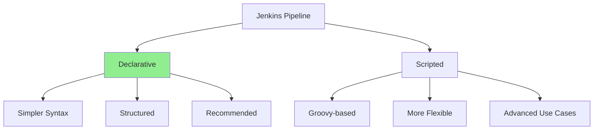

# **Jenkins Pipelines - Complete Guide** 🔄📋

**Master Declarative & Scripted Pipelines, Shared Libraries, and Advanced Patterns**

---

## **Table of Contents** 📑
1. [Pipeline Overview](#1-pipeline-overview)
2. [Declarative Pipeline](#2-declarative-pipeline)
3. [Scripted Pipeline](#3-scripted-pipeline)
4. [Pipeline Syntax & Structure](#4-pipeline-syntax--structure)
5. [Advanced Pipeline Features](#5-advanced-pipeline-features)
6. [Shared Libraries](#6-shared-libraries)
7. [Real-World Jenkinsfile Examples](#7-real-world-jenkinsfile-examples)
8. [Best Practices](#8-best-practices)
9. [Troubleshooting](#9-troubleshooting)
10. [Performance Optimization](#10-performance-optimization)
11. [Security in Pipelines](#11-security-in-pipelines)
12. [Interview Cheat Sheet](#12-interview-cheat-sheet)

---

## **1. Pipeline Overview** 🎯

### **What is a Jenkins Pipeline?**

A **Pipeline** is a suite of plugins that supports implementing and integrating continuous delivery pipelines into Jenkins. A pipeline is defined in a `Jenkinsfile` using Groovy DSL.

### **Why Pipeline as Code?**

```
Benefits:
✅ Version controlled
✅ Code review process
✅ Single source of truth
✅ Automated testing of pipeline
✅ Supports complex workflows
✅ Survives Jenkins restarts
✅ Declarative or Scripted syntax
```

### **Pipeline Types:**



### **Basic Structure:**

```groovy
// Declarative Pipeline
pipeline {
    agent any
    stages {
        stage('Build') {
            steps {
                echo 'Building...'
            }
        }
    }
}
```

```groovy
// Scripted Pipeline
node {
    stage('Build') {
        echo 'Building...'
    }
}
```

---

## **2. Declarative Pipeline** 📝

### **Structure:**

```groovy
pipeline {
    agent { /* Where to run */ }
    environment { /* Environment variables */ }
    options { /* Pipeline options */ }
    parameters { /* Build parameters */ }
    triggers { /* Build triggers */ }
    tools { /* Tool installations */ }
    
    stages {
        stage('Name') {
            steps {
                /* Build steps */
            }
        }
    }
    
    post { /* Post-build actions */ }
}
```

### **Complete Example:**

```groovy
pipeline {
    // Agent section
    agent {
        label 'linux && docker'
    }
    
    // Environment variables
    environment {
        DOCKER_REGISTRY = 'docker.io'
        APP_NAME = 'myapp'
        VERSION = "${env.BUILD_NUMBER}"
    }
    
    // Options
    options {
        buildDiscarder(logRotator(numToKeepStr: '30'))
        timestamps()
        timeout(time: 1, unit: 'HOURS')
        disableConcurrentBuilds()
    }
    
    // Build parameters
    parameters {
        choice(name: 'ENVIRONMENT', choices: ['dev', 'staging', 'production'])
        string(name: 'BRANCH', defaultValue: 'main', description: 'Git branch')
        booleanParam(name: 'RUN_TESTS', defaultValue: true)
    }
    
    // Triggers
    triggers {
        pollSCM('H/5 * * * *')  // Every 5 minutes
        cron('H 2 * * *')       // Daily at 2 AM
    }
    
    // Tools
    tools {
        maven 'Maven-3.8'
        jdk 'JDK-17'
    }
    
    // Stages
    stages {
        stage('Checkout') {
            steps {
                checkout scm
                sh 'git log -1'
            }
        }
        
        stage('Build') {
            steps {
                script {
                    echo "Building version ${VERSION}"
                }
                sh 'mvn clean package -DskipTests'
            }
        }
        
        stage('Test') {
            when {
                expression { params.RUN_TESTS == true }
            }
            parallel {
                stage('Unit Tests') {
                    steps {
                        sh 'mvn test'
                    }
                }
                stage('Integration Tests') {
                    steps {
                        sh 'mvn verify'
                    }
                }
            }
            post {
                always {
                    junit '**/target/surefire-reports/*.xml'
                }
            }
        }
        
        stage('Code Quality') {
            steps {
                withSonarQubeEnv('SonarQube') {
                    sh 'mvn sonar:sonar'
                }
            }
        }
        
        stage('Build Docker Image') {
            steps {
                script {
                    docker.build("${DOCKER_REGISTRY}/${APP_NAME}:${VERSION}")
                }
            }
        }
        
        stage('Push Docker Image') {
            steps {
                script {
                    docker.withRegistry('https://docker.io', 'docker-credentials') {
                        docker.image("${DOCKER_REGISTRY}/${APP_NAME}:${VERSION}").push()
                        docker.image("${DOCKER_REGISTRY}/${APP_NAME}:${VERSION}").push('latest')
                    }
                }
            }
        }
        
        stage('Deploy') {
            when {
                branch 'main'
            }
            steps {
                sh """
                    kubectl set image deployment/${APP_NAME} \
                        ${APP_NAME}=${DOCKER_REGISTRY}/${APP_NAME}:${VERSION} \
                        --namespace=${params.ENVIRONMENT}
                """
                sh "kubectl rollout status deployment/${APP_NAME} -n ${params.ENVIRONMENT}"
            }
        }
    }
    
    // Post-build actions
    post {
        always {
            cleanWs()
        }
        success {
            slackSend(
                color: 'good',
                message: "Build #${BUILD_NUMBER} succeeded - ${JOB_NAME}"
            )
        }
        failure {
            slackSend(
                color: 'danger',
                message: "Build #${BUILD_NUMBER} failed - ${JOB_NAME}"
            )
            emailext(
                subject: "Build Failed: ${JOB_NAME} #${BUILD_NUMBER}",
                body: "Check console output at ${BUILD_URL}",
                to: 'team@company.com'
            )
        }
        unstable {
            echo 'Build is unstable'
        }
        aborted {
            echo 'Build was aborted'
        }
    }
}
```

### **Agent Specifications:**

```groovy
// Any available agent
agent any

// Specific node label
agent { label 'linux' }

// Multiple labels (AND)
agent { label 'linux && docker' }

// Multiple labels (OR)
agent { label 'linux || macos' }

// Docker agent
agent {
    docker {
        image 'maven:3.8-openjdk-17'
        label 'docker'
        args '-v $HOME/.m2:/root/.m2'
    }
}

// Kubernetes pod
agent {
    kubernetes {
        yaml '''
apiVersion: v1
kind: Pod
spec:
  containers:
  - name: maven
    image: maven:3.8-openjdk-17
    command: ['cat']
    tty: true
        '''
    }
}

// No global agent (stage-specific)
agent none

stages {
    stage('Build') {
        agent { label 'linux' }
        steps {
            sh 'make build'
        }
    }
}
```

### **When Conditions:**

```groovy
stage('Deploy to Production') {
    when {
        // Single condition
        branch 'main'
    }
    steps {
        echo 'Deploying to production'
    }
}

stage('Deploy') {
    when {
        // Multiple conditions (AND)
        allOf {
            branch 'main'
            environment name: 'DEPLOY_ENV', value: 'production'
        }
    }
    steps {
        echo 'Deploying'
    }
}

stage('Deploy') {
    when {
        // Multiple conditions (OR)
        anyOf {
            branch 'main'
            branch 'develop'
        }
    }
    steps {
        echo 'Deploying'
    }
}

stage('Deploy') {
    when {
        // Complex conditions
        expression {
            return params.DEPLOY == true && env.BRANCH_NAME == 'main'
        }
    }
    steps {
        echo 'Deploying'
    }
}

// Other conditions
when {
    tag "release-*"                    // Git tag match
    changeRequest()                    // Pull request
    changeset "src/**"                 // Files changed
    triggeredBy 'TimerTrigger'        // Cron trigger
    not { branch 'main' }             // NOT condition
}
```

### **Parallel Stages:**

```groovy
stage('Tests') {
    parallel {
        stage('Unit Tests') {
            steps {
                sh 'npm run test:unit'
            }
        }
        stage('Integration Tests') {
            steps {
                sh 'npm run test:integration'
            }
        }
        stage('E2E Tests') {
            steps {
                sh 'npm run test:e2e'
            }
        }
        stage('Security Scan') {
            steps {
                sh 'npm audit'
            }
        }
    }
}

// Advanced parallel with failFast
stage('Tests') {
    failFast true  // Stop all if one fails
    parallel {
        stage('Unit') { /* ... */ }
        stage('Integration') { /* ... */ }
    }
}
```

### **Matrix Builds:**

```groovy
stage('Test') {
    matrix {
        axes {
            axis {
                name 'PLATFORM'
                values 'linux', 'windows', 'mac'
            }
            axis {
                name 'NODE_VERSION'
                values '14', '16', '18'
            }
        }
        stages {
            stage('Build & Test') {
                steps {
                    echo "Testing on ${PLATFORM} with Node ${NODE_VERSION}"
                    sh "node --version"
                    sh "npm test"
                }
            }
        }
    }
}
// Results in 9 combinations (3 x 3)
```

---

## **3. Scripted Pipeline** 🎭

### **Structure:**

```groovy
node {
    // Pipeline code here
    stage('Build') {
        // Build steps
    }
}
```

### **Complete Example:**

```groovy
// Global variables
def appName = 'myapp'
def version = ''

node('linux && docker') {
    try {
        // Checkout stage
        stage('Checkout') {
            checkout scm
            version = sh(returnStdout: true, script: 'git rev-parse --short HEAD').trim()
        }
        
        // Build stage
        stage('Build') {
            sh 'mvn clean package -DskipTests'
        }
        
        // Test stage
        stage('Test') {
            parallel(
                'Unit Tests': {
                    sh 'mvn test'
                },
                'Integration Tests': {
                    sh 'mvn verify'
                }
            )
        }
        
        // Docker build
        stage('Docker Build') {
            docker.build("${appName}:${version}")
        }
        
        // Docker push
        stage('Docker Push') {
            docker.withRegistry('https://docker.io', 'docker-credentials') {
                def image = docker.image("${appName}:${version}")
                image.push()
                image.push('latest')
            }
        }
        
        // Deploy
        stage('Deploy') {
            if (env.BRANCH_NAME == 'main') {
                sh """
                    kubectl set image deployment/${appName} \
                        ${appName}=${appName}:${version}
                """
            }
        }
        
        // Success notification
        currentBuild.result = 'SUCCESS'
        slackSend(color: 'good', message: "Build succeeded - ${env.JOB_NAME} #${env.BUILD_NUMBER}")
        
    } catch (Exception e) {
        // Error handling
        currentBuild.result = 'FAILURE'
        slackSend(color: 'danger', message: "Build failed - ${env.JOB_NAME} #${env.BUILD_NUMBER}")
        throw e
        
    } finally {
        // Cleanup
        cleanWs()
    }
}
```

### **Advanced Scripted Features:**

```groovy
// Functions
def buildApp() {
    sh 'mvn clean package'
}

def runTests() {
    sh 'mvn test'
}

def deployToK8s(String namespace, String image) {
    sh "kubectl set image deployment/myapp myapp=${image} -n ${namespace}"
}

node {
    stage('Build') {
        buildApp()
    }
    stage('Test') {
        runTests()
    }
    stage('Deploy') {
        deployToK8s('production', 'myapp:latest')
    }
}
```

```groovy
// Conditionals
node {
    stage('Deploy') {
        if (env.BRANCH_NAME == 'main') {
            echo 'Deploying to production'
            sh './deploy-prod.sh'
        } else if (env.BRANCH_NAME == 'develop') {
            echo 'Deploying to staging'
            sh './deploy-staging.sh'
        } else {
            echo 'Skipping deployment for feature branch'
        }
    }
}
```

```groovy
// Loops
node {
    stage('Multi-Deploy') {
        def environments = ['dev', 'staging', 'production']
        for (env in environments) {
            echo "Deploying to ${env}"
            sh "./deploy.sh ${env}"
        }
    }
}
```

```groovy
// Try-Catch-Finally
node {
    try {
        stage('Build') {
            sh 'mvn clean package'
        }
    } catch (Exception e) {
        echo "Build failed: ${e.message}"
        currentBuild.result = 'FAILURE'
        throw e
    } finally {
        stage('Cleanup') {
            cleanWs()
        }
    }
}
```

---

## **4. Pipeline Syntax & Structure** 📖

### **Common Steps:**

```groovy
// Shell commands
sh 'echo "Hello World"'
sh '''
    echo "Multi-line"
    echo "shell script"
'''

// Batch (Windows)
bat 'echo Hello World'

// PowerShell
powershell 'Write-Host "Hello World"'

// Echo
echo 'Message'

// Error
error 'Build failed!'

// Timeout
timeout(time: 10, unit: 'MINUTES') {
    sh 'long-running-command'
}

// Retry
retry(3) {
    sh 'flaky-command'
}

// Wait for input
input message: 'Deploy to production?', ok: 'Deploy'

// Sleep
sleep time: 30, unit: 'SECONDS'

// Archive artifacts
archiveArtifacts artifacts: 'target/*.jar', fingerprint: true

// Publish JUnit results
junit 'target/surefire-reports/*.xml'

// Publish HTML reports
publishHTML([
    reportDir: 'coverage',
    reportFiles: 'index.html',
    reportName: 'Coverage Report'
])
```

### **Credentials:**

```groovy
// Username/Password
withCredentials([
    usernamePassword(
        credentialsId: 'docker-hub',
        usernameVariable: 'USER',
        passwordVariable: 'PASS'
    )
]) {
    sh 'echo $PASS | docker login -u $USER --password-stdin'
}

// Secret text
withCredentials([string(credentialsId: 'api-token', variable: 'TOKEN')]) {
    sh 'curl -H "Authorization: Bearer $TOKEN" https://api.example.com'
}

// SSH key
withCredentials([sshUserPrivateKey(
    credentialsId: 'ssh-key',
    keyFileVariable: 'SSH_KEY',
    usernameVariable: 'SSH_USER'
)]) {
    sh 'ssh -i $SSH_KEY $SSH_USER@server.com "deploy.sh"'
}

// File
withCredentials([file(credentialsId: 'config-file', variable: 'CONFIG')]) {
    sh 'cp $CONFIG /etc/myapp/config.yaml'
}

// Multiple credentials
withCredentials([
    usernamePassword(credentialsId: 'db', usernameVariable: 'DB_USER', passwordVariable: 'DB_PASS'),
    string(credentialsId: 'api-key', variable: 'API_KEY')
]) {
    sh './deploy.sh'
}
```

### **Environment Variables:**

```groovy
pipeline {
    agent any
    
    environment {
        // Global environment variables
        APP_NAME = 'myapp'
        DOCKER_REGISTRY = 'docker.io'
        VERSION = "${env.BUILD_NUMBER}"
    }
    
    stages {
        stage('Build') {
            environment {
                // Stage-specific variables
                BUILD_ENV = 'production'
            }
            steps {
                echo "Building ${APP_NAME} version ${VERSION}"
                sh 'printenv | sort'
            }
        }
    }
}

// Built-in variables
env.BUILD_NUMBER          // Build number
env.BUILD_ID             // Build ID (same as BUILD_NUMBER)
env.BUILD_URL            // Full URL of build
env.JOB_NAME             // Name of the job
env.JOB_URL              // Full URL of job
env.WORKSPACE            // Workspace directory
env.JENKINS_HOME         // Jenkins home directory
env.BRANCH_NAME          // Branch name (Multibranch)
env.CHANGE_ID            // PR number (Multibranch)
env.GIT_COMMIT           // Git commit hash
env.GIT_BRANCH           // Git branch
```

### **Stashing & Unstashing:**

```groovy
pipeline {
    agent none
    
    stages {
        stage('Build') {
            agent { label 'linux' }
            steps {
                sh 'make build'
                stash includes: 'target/*.jar', name: 'built-artifacts'
            }
        }
        
        stage('Test') {
            agent { label 'test-server' }
            steps {
                unstash 'built-artifacts'
                sh 'make test'
            }
        }
        
        stage('Deploy') {
            agent { label 'deploy-server' }
            steps {
                unstash 'built-artifacts'
                sh 'make deploy'
            }
        }
    }
}
```

---

## **5. Advanced Pipeline Features** ⚡

### **Blue/Green Deployment:**

```groovy
pipeline {
    agent any
    
    stages {
        stage('Deploy to Green') {
            steps {
                sh 'kubectl apply -f k8s/green-deployment.yaml'
                sh 'kubectl wait --for=condition=available deployment/myapp-green --timeout=300s'
            }
        }
        
        stage('Run Smoke Tests') {
            steps {
                sh './smoke-test.sh http://green.myapp.com'
            }
        }
        
        stage('Switch Traffic') {
            input {
                message "Switch traffic to Green?"
                ok "Yes, switch traffic"
            }
            steps {
                sh 'kubectl patch service myapp -p \'{"spec":{"selector":{"version":"green"}}}\''
                echo 'Traffic switched to Green environment'
            }
        }
        
        stage('Decommission Blue') {
            steps {
                sh 'kubectl delete deployment myapp-blue'
                echo 'Blue environment decommissioned'
            }
        }
    }
}
```

### **Canary Deployment:**

```groovy
pipeline {
    agent any
    
    stages {
        stage('Deploy Canary') {
            steps {
                sh 'kubectl apply -f k8s/canary-deployment.yaml'
                sh './set-traffic-split.sh canary=10 stable=90'
            }
        }
        
        stage('Monitor Canary') {
            steps {
                script {
                    sleep time: 300, unit: 'SECONDS'  // 5 minutes
                    def errorRate = sh(
                        script: './check-error-rate.sh canary',
                        returnStdout: true
                    ).trim()
                    
                    if (errorRate.toFloat() > 1.0) {
                        error "Canary error rate too high: ${errorRate}%"
                    }
                }
            }
        }
        
        stage('Increase Traffic') {
            steps {
                sh './set-traffic-split.sh canary=50 stable=50'
                sleep time: 300, unit: 'SECONDS'
                sh './set-traffic-split.sh canary=100 stable=0'
            }
        }
        
        stage('Finalize') {
            steps {
                sh 'kubectl delete deployment myapp-stable'
                sh 'kubectl label deployment myapp-canary version=stable'
            }
        }
    }
    
    post {
        failure {
            sh './set-traffic-split.sh canary=0 stable=100'
            sh 'kubectl delete deployment myapp-canary'
        }
    }
}
```

### **Multi-Stage Docker Build:**

```groovy
pipeline {
    agent any
    
    stages {
        stage('Build Docker Images') {
            parallel {
                stage('Build App') {
                    steps {
                        script {
                            docker.build('myapp:latest', '-f Dockerfile .')
                        }
                    }
                }
                stage('Build Nginx') {
                    steps {
                        script {
                            docker.build('myapp-nginx:latest', '-f Dockerfile.nginx .')
                        }
                    }
                }
            }
        }
        
        stage('Test Containers') {
            steps {
                sh '''
                    docker-compose up -d
                    sleep 10
                    curl -f http://localhost || exit 1
                    docker-compose down
                '''
            }
        }
        
        stage('Push Images') {
            steps {
                script {
                    docker.withRegistry('https://docker.io', 'docker-credentials') {
                        docker.image('myapp:latest').push()
                        docker.image('myapp-nginx:latest').push()
                    }
                }
            }
        }
    }
}
```

### **Dynamic Stages:**

```groovy
pipeline {
    agent any
    
    stages {
        stage('Generate Stages') {
            steps {
                script {
                    def environments = ['dev', 'staging', 'production']
                    
                    for (env in environments) {
                        stage("Deploy to ${env}") {
                            echo "Deploying to ${env}"
                            sh "./deploy.sh ${env}"
                            
                            if (env == 'production') {
                                input message: "Approve ${env} deployment?"
                            }
                        }
                    }
                }
            }
        }
    }
}
```

---

## **6. Shared Libraries** 📚

### **What are Shared Libraries?**

Shared Libraries allow you to share common pipeline code across multiple projects, promoting DRY (Don't Repeat Yourself) principle.

### **Directory Structure:**

```
my-shared-library/
├── vars/
│   ├── buildJavaApp.groovy
│   ├── deployToK8s.groovy
│   └── sendNotification.groovy
├── src/
│   └── com/
│       └── company/
│           └── Pipeline.groovy
└── resources/
    └── com/
        └── company/
            └── config.yaml
```

### **Configure Shared Library:**

```
Manage Jenkins → Configure System → Global Pipeline Libraries

Name: my-shared-library
Default version: main
Retrieval method: Modern SCM
Source Code Management: Git
Project Repository: https://github.com/company/jenkins-shared-library.git
```

### **vars/ Directory (Global Variables):**

```groovy
// vars/buildJavaApp.groovy
def call(Map config = [:]) {
    pipeline {
        agent any
        
        stages {
            stage('Checkout') {
                steps {
                    checkout scm
                }
            }
            
            stage('Build') {
                steps {
                    sh "mvn clean package ${config.mvnArgs ?: ''}"
                }
            }
            
            stage('Test') {
                steps {
                    sh 'mvn test'
                }
                post {
                    always {
                        junit '**/target/surefire-reports/*.xml'
                    }
                }
            }
            
            stage('Deploy') {
                when {
                    branch 'main'
                }
                steps {
                    sh "./deploy.sh ${config.environment ?: 'staging'}"
                }
            }
        }
        
        post {
            success {
                sendNotification(status: 'SUCCESS')
            }
            failure {
                sendNotification(status: 'FAILURE')
            }
        }
    }
}
```

```groovy
// vars/deployToK8s.groovy
def call(String appName, String version, String namespace = 'default') {
    sh """
        kubectl set image deployment/${appName} \
            ${appName}=${appName}:${version} \
            --namespace=${namespace}
    """
    
    sh """
        kubectl rollout status deployment/${appName} \
            --namespace=${namespace} \
            --timeout=5m
    """
}
```

```groovy
// vars/sendNotification.groovy
def call(Map config = [:]) {
    def color = config.status == 'SUCCESS' ? 'good' : 'danger'
    def emoji = config.status == 'SUCCESS' ? '✅' : '❌'
    
    slackSend(
        color: color,
        message: "${emoji} Build ${config.status}: ${env.JOB_NAME} #${env.BUILD_NUMBER}\n${env.BUILD_URL}"
    )
}
```

### **Using Shared Library:**

```groovy
// Jenkinsfile
@Library('my-shared-library') _

buildJavaApp(
    mvnArgs: '-DskipTests',
    environment: 'production'
)
```

```groovy
// Or use specific functions
@Library('my-shared-library') _

pipeline {
    agent any
    
    stages {
        stage('Build') {
            steps {
                sh 'mvn clean package'
            }
        }
        
        stage('Deploy') {
            steps {
                deployToK8s('myapp', "${BUILD_NUMBER}", 'production')
            }
        }
    }
    
    post {
        always {
            sendNotification(status: currentBuild.result)
        }
    }
}
```

### **src/ Directory (Classes):**

```groovy
// src/com/company/Pipeline.groovy
package com.company

class Pipeline implements Serializable {
    def script
    
    Pipeline(script) {
        this.script = script
    }
    
    def buildDockerImage(String imageName, String tag) {
        script.sh "docker build -t ${imageName}:${tag} ."
    }
    
    def pushDockerImage(String imageName, String tag, String registry = 'docker.io') {
        script.sh """
            docker tag ${imageName}:${tag} ${registry}/${imageName}:${tag}
            docker push ${registry}/${imageName}:${tag}
        """
    }
    
    def deployToKubernetes(String deployment, String image) {
        script.sh "kubectl set image deployment/${deployment} app=${image}"
        script.sh "kubectl rollout status deployment/${deployment}"
    }
}
```

### **Using Classes:**

```groovy
@Library('my-shared-library') _

import com.company.Pipeline

pipeline {
    agent any
    
    stages {
        stage('Build & Deploy') {
            steps {
                script {
                    def pipeline = new Pipeline(this)
                    pipeline.buildDockerImage('myapp', env.BUILD_NUMBER)
                    pipeline.pushDockerImage('myapp', env.BUILD_NUMBER)
                    pipeline.deployToKubernetes('myapp-deployment', "myapp:${env.BUILD_NUMBER}")
                }
            }
        }
    }
}
```

---

## **7. Real-World Jenkinsfile Examples** 📋

### **Example 1: Node.js Application**

```groovy
pipeline {
    agent {
        docker {
            image 'node:18-alpine'
        }
    }
    
    environment {
        NPM_CONFIG_CACHE = "${WORKSPACE}/.npm"
    }
    
    stages {
        stage('Checkout') {
            steps {
                checkout scm
            }
        }
        
        stage('Install Dependencies') {
            steps {
                sh 'npm ci'
            }
        }
        
        stage('Lint') {
            steps {
                sh 'npm run lint'
            }
        }
        
        stage('Test') {
            parallel {
                stage('Unit Tests') {
                    steps {
                        sh 'npm run test:unit -- --coverage'
                    }
                }
                stage('Integration Tests') {
                    steps {
                        sh 'npm run test:integration'
                    }
                }
            }
            post {
                always {
                    publishHTML([
                        reportDir: 'coverage',
                        reportFiles: 'index.html',
                        reportName: 'Coverage Report'
                    ])
                }
            }
        }
        
        stage('Build') {
            steps {
                sh 'npm run build'
            }
        }
        
        stage('Docker Build & Push') {
            when {
                branch 'main'
            }
            steps {
                script {
                    docker.withRegistry('https://docker.io', 'docker-credentials') {
                        def image = docker.build("myapp:${BUILD_NUMBER}")
                        image.push()
                        image.push('latest')
                    }
                }
            }
        }
        
        stage('Deploy to Kubernetes') {
            when {
                branch 'main'
            }
            steps {
                sh """
                    kubectl set image deployment/myapp \
                        myapp=myapp:${BUILD_NUMBER} \
                        --namespace=production
                """
                sh 'kubectl rollout status deployment/myapp -n production'
            }
        }
    }
    
    post {
        always {
            cleanWs()
        }
        success {
            slackSend color: 'good', message: "✅ Build succeeded: ${env.JOB_NAME} #${env.BUILD_NUMBER}"
        }
        failure {
            slackSend color: 'danger', message: "❌ Build failed: ${env.JOB_NAME} #${env.BUILD_NUMBER}"
        }
    }
}
```

### **Example 2: Python Application**

```groovy
pipeline {
    agent {
        docker {
            image 'python:3.11'
            args '-u root'
        }
    }
    
    environment {
        PYTHONUNBUFFERED = '1'
    }
    
    stages {
        stage('Checkout') {
            steps {
                checkout scm
            }
        }
        
        stage('Setup Virtual Environment') {
            steps {
                sh '''
                    python -m venv venv
                    . venv/bin/activate
                    pip install --upgrade pip
                    pip install -r requirements.txt
                    pip install -r requirements-dev.txt
                '''
            }
        }
        
        stage('Lint') {
            steps {
                sh '''
                    . venv/bin/activate
                    flake8 src/
                    black --check src/
                    mypy src/
                '''
            }
        }
        
        stage('Test') {
            steps {
                sh '''
                    . venv/bin/activate
                    pytest tests/ \
                        --cov=src \
                        --cov-report=html \
                        --cov-report=xml \
                        --junitxml=junit.xml
                '''
            }
            post {
                always {
                    junit 'junit.xml'
                    publishHTML([
                        reportDir: 'htmlcov',
                        reportFiles: 'index.html',
                        reportName: 'Coverage Report'
                    ])
                }
            }
        }
        
        stage('Build') {
            steps {
                sh '''
                    . venv/bin/activate
                    python setup.py sdist bdist_wheel
                '''
            }
        }
        
        stage('Docker Build') {
            steps {
                script {
                    docker.build("python-app:${BUILD_NUMBER}")
                }
            }
        }
        
        stage('Security Scan') {
            steps {
                sh '''
                    . venv/bin/activate
                    safety check
                    bandit -r src/
                '''
            }
        }
        
        stage('Deploy') {
            when {
                branch 'main'
            }
            steps {
                sh './deploy.sh production'
            }
        }
    }
}
```

### **Example 3: Microservices (Multi-Module)**

```groovy
pipeline {
    agent any
    
    environment {
        DOCKER_REGISTRY = 'docker.io/company'
    }
    
    stages {
        stage('Checkout') {
            steps {
                checkout scm
            }
        }
        
        stage('Build Services') {
            parallel {
                stage('User Service') {
                    steps {
                        dir('user-service') {
                            sh 'mvn clean package'
                        }
                    }
                }
                stage('Product Service') {
                    steps {
                        dir('product-service') {
                            sh 'mvn clean package'
                        }
                    }
                }
                stage('Order Service') {
                    steps {
                        dir('order-service') {
                            sh 'mvn clean package'
                        }
                    }
                }
            }
        }
        
        stage('Test Services') {
            parallel {
                stage('User Service Tests') {
                    steps {
                        dir('user-service') {
                            sh 'mvn test'
                        }
                    }
                }
                stage('Product Service Tests') {
                    steps {
                        dir('product-service') {
                            sh 'mvn test'
                        }
                    }
                }
                stage('Order Service Tests') {
                    steps {
                        dir('order-service') {
                            sh 'mvn test'
                        }
                    }
                }
            }
        }
        
        stage('Build Docker Images') {
            parallel {
                stage('User Service Image') {
                    steps {
                        dir('user-service') {
                            script {
                                docker.build("${DOCKER_REGISTRY}/user-service:${BUILD_NUMBER}")
                            }
                        }
                    }
                }
                stage('Product Service Image') {
                    steps {
                        dir('product-service') {
                            script {
                                docker.build("${DOCKER_REGISTRY}/product-service:${BUILD_NUMBER}")
                            }
                        }
                    }
                }
                stage('Order Service Image') {
                    steps {
                        dir('order-service') {
                            script {
                                docker.build("${DOCKER_REGISTRY}/order-service:${BUILD_NUMBER}")
                            }
                        }
                    }
                }
            }
        }
        
        stage('Push Images') {
            steps {
                script {
                    docker.withRegistry('https://docker.io', 'docker-credentials') {
                        ['user', 'product', 'order'].each { service ->
                            def image = docker.image("${DOCKER_REGISTRY}/${service}-service:${BUILD_NUMBER}")
                            image.push()
                            image.push('latest')
                        }
                    }
                }
            }
        }
        
        stage('Deploy to Kubernetes') {
            steps {
                sh """
                    kubectl set image deployment/user-service user-service=${DOCKER_REGISTRY}/user-service:${BUILD_NUMBER}
                    kubectl set image deployment/product-service product-service=${DOCKER_REGISTRY}/product-service:${BUILD_NUMBER}
                    kubectl set image deployment/order-service order-service=${DOCKER_REGISTRY}/order-service:${BUILD_NUMBER}
                """
            }
        }
    }
}
```

---

## **8. Best Practices** ⭐

### **Pipeline Design:**

```groovy
// ✅ Use declarative pipeline (easier to read)
pipeline {
    agent any
    stages {
        stage('Build') {
            steps {
                sh 'make build'
            }
        }
    }
}

// ❌ Avoid overly complex scripted pipelines
node {
    if (env.BRANCH_NAME == 'main') {
        if (params.DEPLOY == true) {
            // Complex nested logic
        }
    }
}

// ✅ Use meaningful stage names
stage('Build Docker Image and Push to Registry') {
    // ...
}

// ❌ Avoid vague names
stage('Step 1') {
    // ...
}

// ✅ Fail fast
stages {
    stage('Lint') {  // Fast
        steps { sh 'npm run lint' }
    }
    stage('Build') {  // Slower
        steps { sh 'npm run build' }
    }
    stage('Test') {  // Slowest
        steps { sh 'npm test' }
    }
}

// ✅ Use timeouts
options {
    timeout(time: 1, unit: 'HOURS')
}

stage('Deploy') {
    options {
        timeout(time: 10, unit: 'MINUTES')
    }
    steps {
        sh './deploy.sh'
    }
}
```

### **Code Quality:**

```groovy
// ✅ Keep Jenkinsfiles small
// Move complex logic to scripts
stages {
    stage('Deploy') {
        steps {
            sh './scripts/deploy.sh'  // Better
        }
    }
}

// ❌ Avoid inline complex scripts
stages {
    stage('Deploy') {
        steps {
            sh '''
                # 100 lines of bash
                # ...
            '''  // Harder to maintain
        }
    }
}

// ✅ Use shared libraries for reusable code
@Library('my-library') _
buildAndDeploy(appName: 'myapp')

// ✅ Use proper error handling
stage('Deploy') {
    steps {
        script {
            try {
                sh './deploy.sh'
            } catch (Exception e) {
                echo "Deployment failed: ${e.message}"
                currentBuild.result = 'FAILURE'
                throw e
            }
        }
    }
}
```

### **Security:**

```groovy
// ✅ Use credentials binding
withCredentials([string(credentialsId: 'api-key', variable: 'API_KEY')]) {
    sh 'curl -H "Authorization: Bearer $API_KEY" ...'
}

// ❌ Never hardcode secrets
environment {
    API_KEY = 'super-secret-key'  // NEVER DO THIS
}

// ✅ Use least privilege
agent { label 'restricted-agent' }

// ✅ Mask sensitive output
steps {
    sh 'echo "Password: ***hidden***" | sed "s/***hidden***/${PASSWORD}/"'
}

// ✅ Regular credential rotation
// Store credentials in Jenkins Credentials Store
// Rotate every 90 days
```

### **Performance:**

```groovy
// ✅ Use parallel stages
stage('Tests') {
    parallel {
        stage('Unit') { steps { sh 'npm run test:unit' } }
        stage('Integration') { steps { sh 'npm run test:integration' } }
        stage('E2E') { steps { sh 'npm run test:e2e' } }
    }
}

// ✅ Cache dependencies
steps {
    sh '''
        if [ -d "node_modules" ]; then
            echo "Using cached dependencies"
        else
            npm ci
        fi
    '''
}

// ✅ Use specific agents
agent { label 'docker && linux && ssd' }

// ✅ Clean workspace selectively
post {
    always {
        cleanWs(
            deleteDirs: true,
            patterns: [[pattern: 'target/**', type: 'INCLUDE']]
        )
    }
}
```

---

## **9. Troubleshooting** 🔧

### **Common Issues:**

#### **Issue: Pipeline Not Triggering**

```
Solutions:
1. Check webhook configuration
   - GitHub: Settings → Webhooks
   - Verify URL: http://jenkins/github-webhook/
   - Check recent deliveries for errors
   
2. Verify SCM polling
   H/5 * * * *  (Every 5 minutes)
   
3. Check branch filters
   In Multibranch Pipeline:
   - Branch discovery strategy
   - Include/exclude patterns
   
4. Review logs
   Jenkins → Manage Jenkins → System Log
```

#### **Issue: Build Hangs/Timeouts**

```groovy
// Solution: Add timeouts
options {
    timeout(time: 30, unit: 'MINUTES')
}

// For specific stages
stage('Long Running') {
    options {
        timeout(time: 10, unit: 'MINUTES')
    }
    steps {
        sh 'long-command'
    }
}

// Check for prompts
// Use -y flag for confirmations
sh 'apt-get install -y package'
```

#### **Issue: Workspace Issues**

```groovy
// Solution: Clean workspace
post {
    always {
        cleanWs()
    }
}

// Or at the start
stage('Checkout') {
    steps {
        cleanWs()
        checkout scm
    }
}

// Or check disk space
sh 'df -h'
sh 'du -sh ${WORKSPACE}'
```

#### **Issue: Permission Denied**

```bash
# Solution: Fix permissions
sh 'chmod +x scripts/deploy.sh'

# Or use sudo (if allowed)
sh 'sudo systemctl restart myapp'

# Or run as specific user
sh 'sudo -u jenkins ./script.sh'
```

#### **Issue: Credentials Not Working**

```groovy
// Debug credentials
withCredentials([string(credentialsId: 'my-secret', variable: 'SECRET')]) {
    sh 'echo "Secret length: ${#SECRET}"'  // Don't echo actual secret!
    sh 'test -n "$SECRET" || echo "SECRET is empty"'
}

// Verify credentials exist
// Jenkins → Credentials → Global → Check ID

// Verify scope
// Global vs System scope
```

### **Debugging Techniques:**

```groovy
// Enable debug output
steps {
    sh 'set -x'  // Bash debug mode
    sh './script.sh'
    sh 'set +x'  // Disable debug
}

// Print environment
steps {
    sh 'printenv | sort'
}

// Check docker connectivity
steps {
    sh 'docker info'
    sh 'docker ps'
}

// Kubernetes connectivity
steps {
    sh 'kubectl cluster-info'
    sh 'kubectl get nodes'
}

// Use echo extensively
steps {
    echo "Starting deployment"
    echo "Environment: ${params.ENVIRONMENT}"
    echo "Version: ${env.BUILD_NUMBER}"
    sh './deploy.sh'
    echo "Deployment complete"
}
```

---

## **10. Performance Optimization** ⚡

### **Strategies:**

```groovy
// 1. Parallel execution
stage('Tests') {
    parallel {
        stage('Unit') { steps { sh 'npm run test:unit' } }
        stage('Lint') { steps { sh 'npm run lint' } }
        stage('Security') { steps { sh 'npm audit' } }
    }
}

// 2. Sparse checkouts (large repos)
checkout([
    $class: 'GitSCM',
    branches: [[name: '*/main']],
    extensions: [
        [$class: 'SparseCheckoutPaths', sparseCheckoutPaths: [
            [$class: 'SparseCheckoutPath', path: 'src/']
        ]]
    ]
])

// 3. Shallow clone
checkout([
    $class: 'GitSCM',
    branches: [[name: '*/main']],
    extensions: [
        [$class: 'CloneOption', depth: 1, shallow: true]
    ]
])

// 4. Skip unnecessary stages
stage('Deploy') {
    when {
        allOf {
            branch 'main'
            expression { return currentBuild.resultIsBetterOrEqualTo('SUCCESS') }
        }
    }
    steps {
        sh './deploy.sh'
    }
}

// 5. Build discarder
options {
    buildDiscarder(logRotator(
        numToKeepStr: '30',
        artifactNumToKeepStr: '10'
    ))
}

// 6. Disable concurrent builds
options {
    disableConcurrentBuilds()
}

// 7. Use caching
steps {
    sh '''
        # Maven cache
        mvn -Dmaven.repo.local=$WORKSPACE/.m2 clean package
        
        # npm cache
        npm ci --cache $WORKSPACE/.npm
        
        # Docker layer caching
        docker build --cache-from myapp:latest -t myapp:${BUILD_NUMBER} .
    '''
}

// 8. Use lightweight agents
agent {
    docker {
        image 'maven:3.8-openjdk-17-slim'  // Slim image
        reuseNode true  // Reuse workspace
    }
}
```

---

## **11. Security in Pipelines** 🔒

### **Best Practices:**

```groovy
// 1. Never expose secrets in logs
withCredentials([string(credentialsId: 'api-key', variable: 'API_KEY')]) {
    // ✅ Good - secret is masked
    sh 'curl -H "Authorization: Bearer $API_KEY" https://api.example.com'
    
    // ❌ Bad - might leak in error messages
    sh 'export API_KEY && ./script.sh'
}

// 2. Use sandboxed execution
@NonCPS
def processData(data) {
    // Non-CPS methods are sandboxed
    return data.collect { it.trim() }
}

// 3. Validate inputs
script {
    if (!params.VERSION.matches(/^\d+\.\d+\.\d+$/)) {
        error "Invalid version format: ${params.VERSION}"
    }
}

// 4. Limit permissions
stage('Deploy') {
    agent { label 'deploy-restricted' }
    steps {
        sh './deploy.sh'
    }
}

// 5. Use approved images
agent {
    docker {
        image 'company/approved-image:latest'
        registryUrl 'https://company-registry.com'
        registryCredentialsId 'registry-creds'
    }
}

// 6. Scan for vulnerabilities
stage('Security Scan') {
    parallel {
        stage('Dependency Check') {
            steps {
                sh 'npm audit'
                sh 'snyk test'
            }
        }
        stage('Container Scan') {
            steps {
                sh 'trivy image myapp:${BUILD_NUMBER}'
            }
        }
        stage('SAST') {
            steps {
                sh 'sonar-scanner'
            }
        }
    }
}

// 7. Audit trail
post {
    always {
        script {
            def auditLog = """
                Build: ${env.BUILD_NUMBER}
                User: ${env.BUILD_USER_ID}
                Time: ${new Date()}
                Branch: ${env.BRANCH_NAME}
                Result: ${currentBuild.result}
            """
            writeFile file: 'audit.log', text: auditLog
            archiveArtifacts 'audit.log'
        }
    }
}
```

---

## **12. Interview Cheat Sheet** 🎯

### **Q1: Declarative vs Scripted Pipeline?**
```
Declarative:
✅ Simpler, structured syntax
✅ Built-in error handling
✅ Restart from stage
✅ Recommended for most cases
✅ pipeline { agent any stages { } }

Scripted:
✅ Full Groovy power
✅ More flexible
✅ Complex conditional logic
✅ Older syntax
✅ node { stage('Build') { } }

Recommendation: Use Declarative unless you need advanced Groovy features.
```

### **Q2: How to secure Jenkins pipelines?**
```
1. Credentials:
   - Use Jenkins Credentials Store
   - withCredentials() wrapper
   - Never hardcode secrets
   
2. Sandbox:
   - Script approval
   - Whitelist Groovy methods
   
3. Access Control:
   - Restrict who can edit Jenkinsfiles
   - Use GitHub/GitLab protected branches
   
4. Security Scans:
   - Dependency scanning (npm audit, snyk)
   - Container scanning (trivy, grype)
   - SAST (SonarQube)
   
5. Audit:
   - Log all pipeline executions
   - Track who triggered builds
   - Archive artifacts securely
```

### **Q3: How to optimize slow pipelines?**
```
1. Parallel Execution:
   parallel {
       stage('Unit') { }
       stage('Integration') { }
   }
   
2. Caching:
   - Cache dependencies (npm, maven)
   - Docker layer caching
   - Reuse workspaces
   
3. Fail Fast:
   - Run quick tests first
   - Lint before build
   
4. Lightweight Agents:
   - Use Docker containers
   - Kubernetes ephemeral pods
   
5. Sparse Checkouts:
   - Only checkout needed files
   - Shallow clones
   
6. Build Discarder:
   - Clean old builds
   - Save disk space
   
Example: Reduced 60-min pipeline to 15 min with parallelization and caching.
```

### **Q4: What are Shared Libraries?**
```
Shared libraries allow reusable pipeline code across projects.

Structure:
my-library/
├── vars/           # Global variables (callable)
│   └── build.groovy
├── src/            # Classes
│   └── com/company/Pipeline.groovy
└── resources/      # Config files

Usage:
@Library('my-library') _
buildAndDeploy(appName: 'myapp')

Benefits:
✅ DRY principle
✅ Centralized updates
✅ Consistent patterns
✅ Easier maintenance

Use cases:
- Common build steps
- Deployment procedures
- Notification templates
- Utility functions
```

### **Q5: Handle failures in pipelines?**
```
1. Post Sections:
   post {
       failure {
           slackSend(message: "Build failed")
           emailext(to: 'team@company.com')
       }
       always {
           cleanWs()
       }
   }
   
2. Try-Catch:
   try {
       sh './deploy.sh'
   } catch (Exception e) {
       echo "Deploy failed: ${e.message}"
       sh './rollback.sh'
       throw e
   }
   
3. Retry:
   retry(3) {
       sh 'flaky-test.sh'
   }
   
4. Timeout:
   timeout(time: 10, unit: 'MINUTES') {
       sh 'long-command'
   }
   
5. Input Approval:
   input message: 'Deploy failed. Retry?'
   sh './retry-deploy.sh'
```

### **Common Commands:**

```bash
# Trigger build via CLI
curl -X POST http://jenkins:8080/job/my-pipeline/build \
  --user admin:token \
  --data-urlencode json='{"parameter": [{"name":"ENV", "value":"prod"}]}'

# Get build status
curl http://jenkins:8080/job/my-pipeline/lastBuild/api/json --user admin:token

# Stop build
curl -X POST http://jenkins:8080/job/my-pipeline/123/stop --user admin:token

# Replay pipeline
# Jenkins UI → Build → Replay → Modify script → Run
```

---

## **Next Steps** 📚

- **[Jenkins Fundamentals](Jenkins_Fundamentals.md)** - Architecture and setup
- **[CI/CD Fundamentals](../CI_CD_Fundamentals.md)** - Core concepts
- **[GitLab CI](../GitLabCI/)** - Alternative CI/CD platform
- **[GitHub Actions](../GitHubActions/)** - Cloud-native CI/CD

---

**🔄 Master Jenkins Pipelines, Master Automation!**

*Pipeline as Code is the foundation of modern DevOps - master it to build robust, maintainable CI/CD workflows.*
