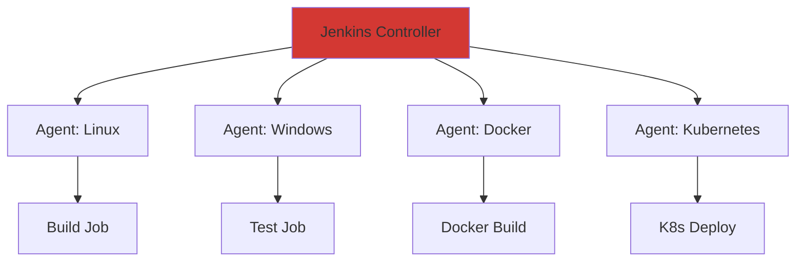

# **Jenkins - The World's Leading CI/CD Platform** 🔧

**Master Jenkins: From Installation to Production-Ready Pipelines**

---

## **📋 Overview**

Jenkins is the most widely adopted CI/CD automation server with **70%+ market share**. It's free, open-source, and offers unmatched flexibility through its extensive plugin ecosystem (1,800+ plugins).

```
✅ Free and open source
✅ Self-hosted (full control)
✅ 1,800+ plugins
✅ Pipeline as Code
✅ Distributed builds
✅ Mature and battle-tested
✅ Active community
```

---

## **🎯 Why Learn Jenkins?**

### **Industry Demand**
- **Most Popular**: 70%+ of enterprises use Jenkins
- **Job Market**: Required for most DevOps positions
- **Enterprise Standard**: Financial services, healthcare, government
- **Legacy Support**: Integrates with older systems

### **Technical Benefits**
- **Unlimited Customization**: Groovy-based pipelines
- **Scalability**: Distributed architecture (controller + agents)
- **Integration**: Any tool via plugins
- **Flexibility**: On-premises, cloud, hybrid

---

## **📚 Tutorial Structure**

### **1. Jenkins Fundamentals** ⭐ START HERE
**[Jenkins_Fundamentals.md](Jenkins_Fundamentals.md)** (12 sections, ~65KB)

Learn Jenkins architecture, installation, and core concepts:

```
✅ What is Jenkins (history, features, use cases)
✅ Architecture (controller, agents, jobs, plugins)
✅ Installation (Docker, Ubuntu, RHEL, Kubernetes)
✅ Initial configuration and setup
✅ UI overview and navigation
✅ Job types (Freestyle, Pipeline, Multibranch, Organization)
✅ Plugin ecosystem
✅ Distributed builds (permanent, cloud, Docker, K8s agents)
✅ Security & user management
✅ Backup & disaster recovery
✅ Configuration as Code (JCasC)
✅ Git/GitHub/GitLab integration
```

**Time Investment**: 4-6 hours  
**Prerequisites**: Basic Linux, Docker understanding  
**Outcome**: Install and configure Jenkins, understand architecture

---

### **2. Jenkins Pipelines Complete Guide** 🚀
**[Jenkins_Pipelines_Complete_Guide.md](Jenkins_Pipelines_Complete_Guide.md)** (12 sections, ~60KB)

Master Pipeline as Code with real-world examples:

```
✅ Pipeline overview (Declarative vs Scripted)
✅ Declarative pipeline syntax
✅ Complete declarative examples
✅ Agent specifications (any, label, docker, kubernetes)
✅ When conditions and parallel stages
✅ Matrix builds
✅ Scripted pipeline syntax
✅ Advanced scripted features
✅ Pipeline syntax reference
✅ Advanced features (Blue/Green, Canary deployments)
✅ Shared libraries (vars/, src/, resources/)
✅ Real-world Jenkinsfile examples
✅ Best practices
✅ Troubleshooting
✅ Performance optimization
✅ Security in pipelines
```

**Time Investment**: 6-8 hours  
**Prerequisites**: Jenkins Fundamentals  
**Outcome**: Write production-ready Jenkinsfiles, implement advanced patterns

---

## **🚀 Quick Start (5 Minutes)**

### **Option 1: Docker (Recommended for Learning)**

```bash
# Run Jenkins in Docker
docker run -d \
  --name jenkins \
  -p 8080:8080 -p 50000:50000 \
  -v jenkins_home:/var/jenkins_home \
  jenkins/jenkins:lts

# Get initial admin password
docker exec jenkins cat /var/jenkins_home/secrets/initialAdminPassword

# Open browser
open http://localhost:8080
```

### **Option 2: Create Your First Pipeline**

```groovy
// Jenkinsfile
pipeline {
    agent any
    
    stages {
        stage('Build') {
            steps {
                echo 'Building...'
                sh 'npm install'
                sh 'npm run build'
            }
        }
        
        stage('Test') {
            steps {
                echo 'Testing...'
                sh 'npm test'
            }
        }
        
        stage('Deploy') {
            when {
                branch 'main'
            }
            steps {
                echo 'Deploying...'
                sh './deploy.sh'
            }
        }
    }
}
```

**Next**: Save as `Jenkinsfile` in your repo root, create a Pipeline job in Jenkins!

---

## **📖 Learning Paths**

### **Path 1: Beginner (1-2 weeks)**

```
Week 1: Installation & Basics
  Day 1-2: Install Jenkins (Docker or Linux)
  Day 3-4: Read Jenkins Fundamentals (sections 1-6)
  Day 5-6: Create Freestyle jobs
  Day 7: Explore plugins, configure security
  
Week 2: First Pipeline
  Day 8-10: Read Pipeline guide (sections 1-4)
  Day 11-12: Write your first Jenkinsfile
  Day 13-14: Add testing and deployment stages
  
✅ Goal: Understand Jenkins basics, create simple pipelines
```

### **Path 2: DevOps Professional (3-4 weeks)**

```
Week 1: Core Mastery
  - Complete Jenkins Fundamentals
  - Setup distributed builds
  - Configure agent nodes
  - Master plugin management
  
Week 2: Pipeline Expertise
  - Complete Pipeline guide
  - Write declarative pipelines
  - Learn scripted pipelines
  - Implement parallel stages
  
Week 3: Advanced Patterns
  - Shared libraries
  - Multi-branch pipelines
  - Blue/Green deployments
  - Canary releases
  
Week 4: Production Ready
  - Security hardening
  - Backup strategy
  - Monitoring setup
  - Performance optimization
  
✅ Goal: Production-ready Jenkins expertise
```

### **Path 3: Jenkins Administrator (4-6 weeks)**

```
Week 1-2: Deep Architecture
  - Controller architecture
  - Agent types and executors
  - Plugin development basics
  - JCasC (Configuration as Code)
  
Week 3-4: Enterprise Setup
  - High availability setup
  - Kubernetes-based agents
  - Scaling strategies
  - Security and compliance
  
Week 5-6: Platform Engineering
  - Multi-tenancy
  - Self-service pipelines
  - Observability stack
  - Cost optimization
  
✅ Goal: Administer enterprise Jenkins platforms
```

### **Path 4: Interview Preparation (1 week)**

```
Day 1: Fundamentals Review
  - Architecture (controller, agents, jobs)
  - Plugin ecosystem
  - Job types
  
Day 2-3: Pipelines Deep Dive
  - Declarative vs Scripted
  - Shared libraries
  - Best practices
  
Day 4-5: Practical Scenarios
  - Design CI/CD pipelines
  - Troubleshoot issues
  - Optimize performance
  - Security implementation
  
Day 6-7: Mock Interviews
  - Interview cheat sheets (in each guide)
  - Whiteboard pipeline designs
  - Live coding exercises
  
✅ Goal: Ace Jenkins interviews
```

---

## **🔍 When to Use Jenkins**

### **✅ Best Use Cases**

```
Enterprise Environments:
  - Large organizations with dedicated DevOps teams
  - Financial services (compliance requirements)
  - Healthcare (on-premises mandates)
  - Government (security requirements)
  
Technical Requirements:
  - Need maximum customization
  - Complex build systems
  - Integration with legacy tools
  - Self-hosted infrastructure
  - Multi-tool orchestration
```

### **⚠️ Consider Alternatives If**

```
- Small team (<5 developers)
- Cloud-first, no infrastructure team
- Want zero-config CI/CD
- Using GitHub exclusively
- Need integrated DevOps platform

Alternatives:
  - GitHub Actions (GitHub users, cloud-native)
  - GitLab CI (integrated platform, Kubernetes)
  - CircleCI (cloud-hosted simplicity)
```

---

## **💡 Key Concepts**

### **Jenkins Architecture**



### **Pipeline Types**

| Type | Use Case | Complexity | Best For |
|------|----------|------------|----------|
| **Freestyle** | Simple tasks | Low | Legacy jobs, quick tasks |
| **Pipeline** | CI/CD workflows | Medium-High | Modern CI/CD |
| **Multibranch** | Multiple branches | Medium | Feature branches |
| **Organization** | Multiple repos | High | GitHub/GitLab orgs |

### **Declarative vs Scripted Pipelines**

```groovy
// Declarative (recommended)
pipeline {
    agent any
    stages {
        stage('Build') {
            steps {
                sh 'make build'
            }
        }
    }
}

// Scripted (advanced)
node {
    stage('Build') {
        sh 'make build'
    }
}
```

---

## **🎯 Interview Preparation**

Each tutorial includes comprehensive interview sections:

### **Common Interview Questions**

1. **What is Jenkins and why is it popular?**
2. **Explain Jenkins architecture (controller, agents, jobs)**
3. **Declarative vs Scripted pipeline - when to use each?**
4. **How do you scale Jenkins?**
5. **How do you secure Jenkins?**
6. **What are Jenkins shared libraries?**
7. **How do you implement Blue/Green deployment in Jenkins?**
8. **How do you backup Jenkins?**
9. **How do you integrate Jenkins with Kubernetes?**
10. **How do you optimize slow Jenkins pipelines?**

**Detailed answers**: See interview cheat sheets in each tutorial!

### **Practical Exercises**

- Design a multi-stage CI/CD pipeline
- Implement distributed builds
- Create shared libraries
- Troubleshoot pipeline failures
- Optimize build performance

---

## **🔧 Common Jenkinsfile Patterns**

### **Node.js Application**

```groovy
pipeline {
    agent {
        docker {
            image 'node:18-alpine'
            args '-v $HOME/.npm:/root/.npm'
        }
    }
    
    stages {
        stage('Build') {
            steps {
                sh 'npm ci'
                sh 'npm run build'
            }
        }
        
        stage('Test') {
            steps {
                sh 'npm test -- --coverage'
            }
        }
        
        stage('Docker Build') {
            steps {
                script {
                    docker.build("myapp:${env.BUILD_ID}")
                }
            }
        }
    }
    
    post {
        always {
            cleanWs()
        }
    }
}
```

### **Multi-Branch Pipeline**

```groovy
pipeline {
    agent any
    
    stages {
        stage('Build') {
            steps {
                sh 'make build'
            }
        }
        
        stage('Test') {
            steps {
                sh 'make test'
            }
        }
        
        stage('Deploy to Staging') {
            when {
                branch 'develop'
            }
            steps {
                sh './deploy.sh staging'
            }
        }
        
        stage('Deploy to Production') {
            when {
                branch 'main'
            }
            steps {
                input 'Deploy to production?'
                sh './deploy.sh production'
            }
        }
    }
}
```

---

## **📊 Best Practices Summary**

### **✅ Do**
```
✓ Use Pipeline as Code (Jenkinsfile)
✓ Version control your Jenkinsfiles
✓ Use declarative pipelines (easier to maintain)
✓ Implement shared libraries for reusability
✓ Use Docker agents for consistent builds
✓ Implement proper error handling
✓ Add timeout to prevent hanging jobs
✓ Use credentials plugin for secrets
✓ Set up build discarder (limit history)
✓ Monitor Jenkins performance
```

### **❌ Don't**
```
✗ Hardcode credentials in Jenkinsfile
✗ Run all jobs on controller (use agents)
✗ Ignore security updates
✗ Skip backups
✗ Use latest tags in production
✗ Run untrusted code without sandboxing
✗ Keep unlimited build history
✗ Ignore pipeline optimization
```

---

## **🔗 Related Resources**

### **Within This CI/CD Collection**
- **[CI/CD Fundamentals](../CI_CD_Fundamentals.md)** - Core concepts
- **[GitLab CI](../GitLabCI/)** - Alternative: Integrated platform
- **[GitHub Actions](../GitHubActions/)** - Alternative: Cloud-native
- **[Main CI/CD README](../README.md)** - Tool comparison and selection

### **Related DevOps Topics**
- **[Docker](../../Docker.md)** - Containerization for builds
- **[Kubernetes](../../Kubernetes.md)** - Container orchestration
- **[Shell Scripting](../../ShellScripting.md)** - Automation scripts

### **External Resources**
- [Official Jenkins Documentation](https://www.jenkins.io/doc/)
- [Jenkins Pipeline Syntax](https://www.jenkins.io/doc/book/pipeline/syntax/)
- [Jenkins Plugin Index](https://plugins.jenkins.io/)
- [Jenkins Community](https://www.jenkins.io/participate/)

---

## **📈 Your Learning Checklist**

- [ ] Install Jenkins (Docker or Linux)
- [ ] Complete Jenkins Fundamentals tutorial
- [ ] Create your first Freestyle job
- [ ] Install essential plugins
- [ ] Configure Git integration
- [ ] Write your first Jenkinsfile
- [ ] Complete Pipeline tutorial
- [ ] Implement declarative pipeline
- [ ] Try scripted pipeline
- [ ] Set up distributed builds
- [ ] Create shared library
- [ ] Implement Blue/Green deployment
- [ ] Configure security
- [ ] Set up backup strategy
- [ ] Review interview cheat sheets

---

## **🎓 Certification**

**Certified Jenkins Engineer (CJE)**
- Validates Jenkins expertise
- Covers installation, configuration, pipelines
- Industry-recognized credential

**Preparation**: Complete both tutorials + hands-on practice

---

**🔧 Ready to Master Jenkins?**

**Start Here**: [Jenkins Fundamentals](Jenkins_Fundamentals.md) ➡️ [Pipelines Guide](Jenkins_Pipelines_Complete_Guide.md) ➡️ Build Production Pipelines!

*Jenkins powers CI/CD for 70%+ of enterprises. Master it to unlock countless DevOps opportunities.*

---

**Quick Stats:**
- **2 Comprehensive Guides**: Fundamentals + Pipelines (~125KB total)
- **24 Sections**: 12 per guide
- **100+ Code Examples**: Real-world Jenkinsfiles
- **20+ Interview Q&A**: Scenario-based questions
- **Multiple Learning Paths**: Beginner to Administrator

💡 **Pro Tip**: Start with Docker installation for fastest setup, then progress to production configurations!
