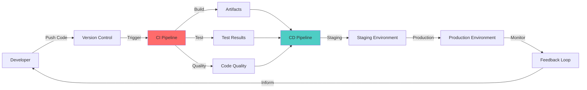

# **CI/CD - The Backbone of DevOps** 🚀🔄

**Continuous Integration and Continuous Delivery/Deployment - Master the core of modern software delivery**

---

## **📋 Table of Contents**

- [Overview](#overview)
- [What You'll Learn](#what-youll-learn)
- [Learning Paths](#learning-paths)
- [Tool Selection Guide](#tool-selection-guide)
- [Quick Start](#quick-start)
- [Tutorials](#tutorials)
- [Interview Preparation](#interview-preparation)
- [Real-World Scenarios](#real-world-scenarios)
- [Next Steps](#next-steps)

---

## **Overview** 🎯

**Every single DevOps job requires CI/CD knowledge. No exceptions.**

CI/CD (Continuous Integration/Continuous Delivery) automates the software delivery pipeline from code commit to production deployment. It's the foundation of modern DevOps practices, enabling teams to deliver high-quality software faster and more reliably.



### **Why CI/CD Matters:**

```
✅ Faster time to market
✅ Higher code quality
✅ Reduced manual errors
✅ Earlier bug detection
✅ Consistent deployments
✅ Improved collaboration
✅ Better developer productivity
✅ Rapid feedback loops
```

---

## **What You'll Learn** 📚

### **CI/CD Fundamentals**
- What is CI/CD and why it matters
- CI vs CD vs CD (Continuous Delivery vs Continuous Deployment)
- Pipeline architecture and components
- Best practices and common patterns
- DevSecOps integration
- Monitoring and metrics

### **Tool-Specific Mastery**

#### **Jenkins** 🔧
- Most popular CI/CD tool (70%+ market share)
- On-premises and cloud deployment
- Extensive plugin ecosystem (1,800+)
- Pipeline as Code (Declarative and Scripted)
- Distributed builds and scaling
- Shared libraries and reusability

#### **GitLab CI** 🦊
- Integrated DevOps platform
- Zero-configuration Auto DevOps
- Kubernetes-native deployments
- Built-in Container Registry
- Security scanning (SAST, DAST, dependencies)
- Review Apps and merge request pipelines

#### **GitHub Actions** 🚀
- Cloud-native CI/CD
- Event-driven workflows (40+ event types)
- Actions Marketplace (12,000+ reusable actions)
- Matrix builds for multi-platform testing
- GitHub-hosted and self-hosted runners
- Seamless GitHub integration

---

## **Learning Paths** 🛤️

### **Path 1: Beginner - Getting Started** (1-2 weeks)
```
Week 1: Fundamentals
  Day 1-2: Read CI/CD Fundamentals
  Day 3-4: Choose your primary tool (Jenkins/GitLab/GitHub Actions)
  Day 5-7: Complete tool's fundamentals guide
  
Week 2: First Pipeline
  Day 8-10: Follow quick start guide
  Day 11-12: Build a simple pipeline for a sample project
  Day 13-14: Add testing and basic deployment
  
✅ Goal: Understand CI/CD concepts and build your first pipeline
```

### **Path 2: DevOps Professional - Production Ready** (3-4 weeks)
```
Week 1: Core Competency
  - Master CI/CD Fundamentals
  - Deep dive into your primary tool
  - Learn pipeline best practices
  
Week 2: Multi-Tool Proficiency
  - Learn second CI/CD tool
  - Compare tools and understand trade-offs
  - Practice migrating pipelines between tools
  
Week 3: Advanced Features
  - Distributed builds and scaling
  - Security scanning integration
  - Multi-environment deployments
  - Monitoring and observability
  
Week 4: Real-World Projects
  - Build complete CI/CD for microservices
  - Implement Blue/Green deployments
  - Set up Canary releases
  - Create shared libraries/reusable workflows
  
✅ Goal: Production-ready CI/CD expertise
```

### **Path 3: Platform Engineering** (4-6 weeks)
```
Week 1-2: Master All Tools
  - Jenkins architecture and administration
  - GitLab CI/CD configuration
  - GitHub Actions at scale
  
Week 3-4: Platform Design
  - Runner/agent infrastructure (Kubernetes, cloud)
  - Secrets management (Vault, cloud KMS)
  - Artifact storage and management
  - Observability stack (Prometheus, Grafana)
  
Week 5-6: Enterprise Patterns
  - Multi-tenancy and isolation
  - Compliance and audit trails
  - Cost optimization
  - Platform API and self-service
  
✅ Goal: Design and operate CI/CD platforms at scale
```

### **Path 4: Interview Preparation** (1 week intensive)
```
Day 1: Fundamentals Review
  - CI/CD concepts (interview cheat sheet)
  - Common terminology
  - Industry best practices
  
Day 2-3: Tool Deep Dives
  - Jenkins interview questions
  - GitLab CI scenarios
  - GitHub Actions use cases
  
Day 4-5: Practical Scenarios
  - Design a CI/CD pipeline (whiteboard)
  - Troubleshoot pipeline issues
  - Optimize slow pipelines
  - Security and compliance
  
Day 6-7: Mock Interviews
  - Practice explaining pipelines
  - Live coding exercises
  - System design (CI/CD architecture)
  
✅ Goal: Ace DevOps interviews
```

---

## **Tool Selection Guide** 🔍

### **When to Use Jenkins** 🔧

```
Best for:
✅ On-premises deployments
✅ Maximum customization needed
✅ Large plugin ecosystem required
✅ Complex, enterprise build systems
✅ Multi-tool integration (non-Git VCS)
✅ Legacy system support

Industry Usage:
  - Financial services (compliance)
  - Healthcare (on-premises requirements)
  - Large enterprises with existing Jenkins
  - Government and regulated industries

Developer Profile:
  - Java/Groovy familiarity helpful
  - Comfortable with infrastructure management
  - Need full control over build environment
```

### **When to Use GitLab CI** 🦊

```
Best for:
✅ Integrated DevOps platform wanted
✅ Kubernetes-native deployments
✅ Built-in security scanning needed
✅ Auto DevOps (zero-config CI/CD)
✅ Self-hosted or SaaS flexibility
✅ Complete SDLC in one tool

Industry Usage:
  - Startups (fast setup)
  - Cloud-native companies
  - Security-conscious organizations
  - Kubernetes-first companies

Developer Profile:
  - YAML-based configuration preference
  - Container/Kubernetes expertise
  - Want integrated platform (Git + CI/CD + Security)
```

### **When to Use GitHub Actions** 🚀

```
Best for:
✅ Already using GitHub
✅ Cloud-native applications
✅ Open source projects
✅ Event-driven automation
✅ Multi-platform builds (Linux, Windows, Mac)
✅ Quick setup, zero infrastructure

Industry Usage:
  - Open source projects (free)
  - Startups on GitHub
  - Web/mobile app companies
  - Microsoft/.NET ecosystem

Developer Profile:
  - GitHub user
  - No infrastructure management wanted
  - Need multi-OS testing
  - Prefer marketplace for reusable actions
```

### **Feature Comparison Matrix**

| Feature | Jenkins | GitLab CI | GitHub Actions |
|---------|---------|-----------|----------------|
| **Setup** | Complex | Medium | Easy |
| **Cost** | Free (infra costs) | Free tier + paid | Free tier + paid |
| **Hosting** | Self-hosted | Both | Both |
| **Integration** | Plugins | Built-in | GitHub native |
| **Scalability** | High | High | High |
| **Learning Curve** | Steep | Medium | Gentle |
| **Kubernetes** | Plugin | Native | Actions |
| **Security Scanning** | Plugins | Built-in | Actions |
| **Market Share** | 70%+ | Growing | Fast growing |
| **Best For** | Enterprise | All-in-one | GitHub users |

---

## **Quick Start** ⚡

### **Jenkins Quick Start**

```groovy
// Jenkinsfile
pipeline {
    agent any
    
    stages {
        stage('Build') {
            steps {
                sh 'npm install'
                sh 'npm run build'
            }
        }
        stage('Test') {
            steps {
                sh 'npm test'
            }
        }
        stage('Deploy') {
            steps {
                sh './deploy.sh'
            }
        }
    }
}
```

**Time to First Pipeline:** 30 minutes (after Jenkins installation)

### **GitLab CI Quick Start**

```yaml
# .gitlab-ci.yml
stages:
  - build
  - test
  - deploy

build:
  stage: build
  script:
    - npm install
    - npm run build

test:
  stage: test
  script:
    - npm test

deploy:
  stage: deploy
  script:
    - ./deploy.sh
  only:
    - main
```

**Time to First Pipeline:** 5 minutes (with GitLab.com)

### **GitHub Actions Quick Start**

```yaml
# .github/workflows/ci.yml
name: CI

on: [push, pull_request]

jobs:
  build:
    runs-on: ubuntu-latest
    
    steps:
      - uses: actions/checkout@v4
      
      - name: Setup Node.js
        uses: actions/setup-node@v4
        with:
          node-version: '18'
          
      - name: Install dependencies
        run: npm install
        
      - name: Build
        run: npm run build
        
      - name: Test
        run: npm test
        
      - name: Deploy
        run: ./deploy.sh
```

**Time to First Pipeline:** 3 minutes (with GitHub repo)

---

## **Tutorials** 📖

### **Core Fundamentals**
- **[CI/CD Fundamentals](CI_CD_Fundamentals.md)** ⭐ START HERE
  - What is CI/CD (concepts, benefits, evolution)
  - Pipeline architecture and components
  - Continuous Integration principles
  - Continuous Delivery vs Deployment
  - Pipeline stages and workflow
  - Tools comparison
  - Best practices and patterns
  - DevSecOps integration
  - Monitoring and metrics

### **Jenkins** 🔧
- **[Jenkins Fundamentals](Jenkins/Jenkins_Fundamentals.md)**
  - Jenkins architecture (controller, agents, jobs)
  - Installation and setup (Docker, Linux, Kubernetes)
  - UI navigation and configuration
  - Job types (Freestyle, Pipeline, Multibranch)
  - Plugin ecosystem
  - Distributed builds
  - Security and user management
  - Backup and disaster recovery
  - Configuration as Code (JCasC)
  
- **[Jenkins Pipelines Complete Guide](Jenkins/Jenkins_Pipelines_Complete_Guide.md)**
  - Declarative vs Scripted pipelines
  - Complete pipeline syntax
  - Agent specifications
  - Parallel and matrix builds
  - Shared libraries
  - Real-world Jenkinsfile examples
  - Best practices
  - Troubleshooting
  - Performance optimization
  - Security in pipelines

### **GitLab CI** 🦊
- **[GitLab CI Complete Guide](GitLabCI/GitLabCI_Complete_Guide.md)**
  - GitLab CI/CD architecture
  - `.gitlab-ci.yml` syntax
  - Jobs, stages, and pipelines
  - GitLab Runners (installation, configuration)
  - Advanced pipeline features (rules, merge requests, review apps)
  - Docker and Kubernetes integration
  - Auto DevOps
  - Real-world pipeline examples
  - Best practices
  - Troubleshooting

### **GitHub Actions** 🚀
- **[GitHub Actions Complete Guide](GitHubActions/GitHubActions_Complete_Guide.md)**
  - GitHub Actions architecture
  - Workflow syntax (YAML)
  - Events and triggers (40+ event types)
  - Jobs, steps, and actions
  - GitHub-hosted and self-hosted runners
  - Advanced workflows (reusable, composite actions)
  - Actions Marketplace
  - Real-world workflow examples
  - Best practices
  - Troubleshooting

---

## **Interview Preparation** 🎯

### **Common Interview Topics**

#### **Conceptual Questions**
```
1. What is CI/CD and why is it important?
2. Explain the difference between CI, CD (Delivery), and CD (Deployment)
3. What are the key stages in a CI/CD pipeline?
4. How do you ensure quality in a CI/CD pipeline?
5. What is Infrastructure as Code and how does it relate to CI/CD?
```

#### **Tool-Specific Questions**
```
Jenkins:
1. What is a Jenkinsfile?
2. Declarative vs Scripted pipeline?
3. How do you scale Jenkins?
4. What are shared libraries?
5. How do you secure Jenkins?

GitLab CI:
1. What is .gitlab-ci.yml?
2. How do GitLab Runners work?
3. What is Auto DevOps?
4. How do you implement review apps?
5. GitLab CI vs Jenkins?

GitHub Actions:
1. What is a GitHub Actions workflow?
2. How do you trigger workflows?
3. What are Actions and where do you find them?
4. Self-hosted vs GitHub-hosted runners?
5. How do you create reusable workflows?
```

#### **Scenario-Based Questions**
```
1. Design a CI/CD pipeline for a microservices application
2. How would you implement Blue/Green deployment?
3. What's your approach to handling secrets in CI/CD?
4. How do you optimize a slow pipeline?
5. How would you migrate from Jenkins to GitLab CI?
6. Describe a multi-environment deployment strategy
7. How do you implement security scanning in CI/CD?
8. What metrics do you track for CI/CD?
```

### **Preparation Resources**

Each tutorial includes:
- ✅ Interview Cheat Sheet (10+ Q&A)
- ✅ Common commands and CLI usage
- ✅ Best practices and anti-patterns
- ✅ Real-world scenarios
- ✅ Troubleshooting guides

---

## **Real-World Scenarios** 💼

### **Scenario 1: Startup (Fast Time to Market)**
```
Challenge:
  - Small team (3-5 developers)
  - Cloud-native application
  - Limited DevOps expertise
  - Need quick setup
  
Solution: GitHub Actions
  ✅ Zero infrastructure
  ✅ GitHub-hosted runners
  ✅ Fast setup (< 1 hour)
  ✅ Marketplace for common tasks
  ✅ Free tier sufficient
  
Pipeline:
  - Push to GitHub
  - Build and test (GitHub Actions)
  - Deploy to cloud (Heroku/Vercel/Netlify)
  - Monitor (integrated tools)
```

### **Scenario 2: Financial Services (Compliance)**
```
Challenge:
  - Strict compliance requirements
  - On-premises deployment only
  - Legacy systems integration
  - Audit trail needed
  
Solution: Jenkins
  ✅ Self-hosted (full control)
  ✅ Extensive plugin ecosystem
  ✅ Mature and proven
  ✅ Audit logs and traceability
  ✅ Role-based access control
  
Pipeline:
  - Code review (Gerrit)
  - Build and test (Jenkins)
  - Security scans (SonarQube, Fortify)
  - Deploy to on-premises
  - Compliance reports
```

### **Scenario 3: Cloud-Native SaaS (Kubernetes)**
```
Challenge:
  - Microservices architecture (20+ services)
  - Kubernetes deployments
  - Need security scanning
  - Want integrated platform
  
Solution: GitLab CI
  ✅ Kubernetes-native
  ✅ Built-in Container Registry
  ✅ Security scanners (SAST, DAST)
  ✅ Auto DevOps
  ✅ Review apps
  
Pipeline:
  - Push to GitLab
  - Build Docker images
  - Security scans (automatic)
  - Deploy to Kubernetes (Helm)
  - Review apps for merge requests
  - Production deployment (manual approval)
```

---

## **Best Practices Across All Tools** ⭐

### **Pipeline Design**
```yaml
✅ Fail fast (lint and quick tests first)
✅ Parallel execution where possible
✅ Use caching for dependencies
✅ Keep builds reproducible
✅ Version control your pipeline code
✅ Use environment variables for configuration
✅ Implement proper error handling
❌ Don't commit secrets in code
❌ Don't run tests serially if they can be parallel
❌ Don't skip quality gates
```

### **Security**
```yaml
✅ Scan dependencies for vulnerabilities
✅ Run SAST (Static Application Security Testing)
✅ Use secrets management (Vault, cloud KMS)
✅ Implement least privilege access
✅ Audit pipeline changes
✅ Sign and verify artifacts
✅ Scan Docker images
❌ Don't hardcode credentials
❌ Don't use latest tags in production
❌ Don't skip security scans for speed
```

### **Testing**
```yaml
✅ Unit tests (fast feedback)
✅ Integration tests
✅ End-to-end tests (critical paths)
✅ Performance tests
✅ Security tests
✅ Code coverage tracking
✅ Test in production-like environment
❌ Don't test only on developer machines
❌ Don't skip flaky tests (fix them)
❌ Don't test in production only
```

### **Deployment**
```yaml
✅ Blue/Green for zero-downtime
✅ Canary for gradual rollout
✅ Feature flags for incremental releases
✅ Automated rollback on failure
✅ Smoke tests after deployment
✅ Multiple environment strategy (dev, staging, prod)
✅ Infrastructure as Code
❌ Don't deploy directly to production
❌ Don't deploy without rollback plan
❌ Don't skip staging environment
```

---

## **Next Steps** 🚀

### **1. Start Learning**
- Read [CI/CD Fundamentals](CI_CD_Fundamentals.md) first
- Choose your primary tool
- Follow the quick start guide
- Build your first pipeline

### **2. Practice**
- Create pipelines for personal projects
- Contribute to open source projects with CI/CD
- Break things and fix them (best way to learn)
- Try all three tools to understand differences

### **3. Go Deeper**
- Learn Docker and Kubernetes ([Docker Guide](../Docker.md), [Kubernetes Guide](../Kubernetes.md))
- Study Infrastructure as Code (Terraform, Ansible)
- Explore monitoring and observability
- Master security best practices

### **4. Get Certified** (Optional)
- **Jenkins**: Certified Jenkins Engineer (CJE)
- **GitLab**: GitLab Certified CI/CD Associate
- **GitHub**: GitHub Actions certification (unofficial via learning path)
- **General**: AWS DevOps Professional, Azure DevOps Engineer

---

## **Additional Resources** 📚

### **Official Documentation**
- [Jenkins Documentation](https://www.jenkins.io/doc/)
- [GitLab CI/CD Docs](https://docs.gitlab.com/ee/ci/)
- [GitHub Actions Docs](https://docs.github.com/en/actions)

### **Community**
- [Jenkins Community](https://www.jenkins.io/participate/)
- [GitLab Forum](https://forum.gitlab.com/)
- [GitHub Community](https://github.community/)

### **Books**
- "Continuous Delivery" by Jez Humble
- "The Phoenix Project" by Gene Kim
- "Accelerate" by Nicole Forsgren

---

## **Related Topics** 🔗

- **[Docker](../Docker.md)** - Containerization for consistent builds
- **[Kubernetes](../Kubernetes.md)** - Container orchestration and deployment
- **[Shell Scripting](../ShellScripting.md)** - Automation and scripting
- **[Git](/Git/)** - Version control fundamentals

---

**🚀 Welcome to CI/CD Mastery!**

*"Automate everything from commit to production. CI/CD is not optional in modern software development - it's the foundation of DevOps culture."*

**Start Your Journey:** [CI/CD Fundamentals](CI_CD_Fundamentals.md) ➡️ Choose Your Tool ➡️ Build Your First Pipeline ➡️ Master DevOps

---

**📊 Quick Stats:**
- **3 Major Tools Covered**: Jenkins, GitLab CI, GitHub Actions
- **12+ Comprehensive Guides**: From fundamentals to advanced topics
- **100+ Code Examples**: Real-world, production-ready pipelines
- **30+ Interview Questions**: Per tool, with detailed answers
- **Multiple Learning Paths**: Beginner to Platform Engineer

**💡 Remember:** Every DevOps engineer needs CI/CD expertise. Master these tools to accelerate your career!
