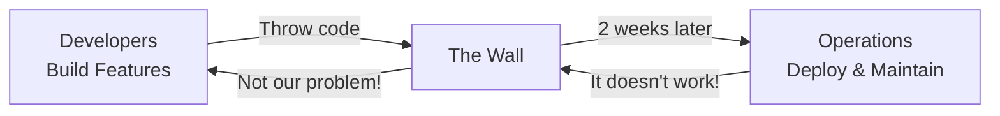
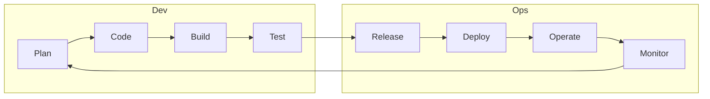

# **What Is DevOps?** 🎯

**Understanding the Culture, Philosophy, and Movement (Not Just Tools!)**

---

## **Table of Contents** 📑
1. [The Origin Story](#1-the-origin-story)
2. [The Pre-DevOps Dark Ages](#2-the-pre-devops-dark-ages)
3. [The DevOps Philosophy](#3-the-devops-philosophy)
4. [Core Principles](#4-core-principles)
5. [The DevOps Lifecycle](#5-the-devops-lifecycle)
6. [DevOps vs Traditional IT](#6-devops-vs-traditional-it)
7. [Real-World Big Tech Examples](#7-real-world-big-tech-examples)
8. [Common Misconceptions](#8-common-misconceptions)
9. [For Java Developers](#9-for-java-developers)
10. [Gamified Challenges](#10-gamified-challenges)
11. [Interview Preparation](#11-interview-preparation)
12. [Key Takeaways](#12-key-takeaways)

---

## **1. The Origin Story** 📖

### **🎬 Scene: A Company in 2008**

```
Dev Team Office:
Dev: "We finished the feature! Here's the code."
*throws code over the wall*

Operations Office (2 weeks later):
Ops: "Your code doesn't work in production!"
Dev: "It works on my machine! 🤷"
Ops: "Well, production isn't your machine!"

*Repeat this drama every release*
```

**Sound familiar?** This was software development before DevOps.

### **The Birth of DevOps** 🐣

In 2009, **Patrick Debois** organized the first "DevOpsDays" conference in Ghent, Belgium. The term **DevOps** was born from:

```
Dev (Development) + Ops (Operations) = DevOps
```

But it's not just merging two words. It's merging two **cultures**.

---

## **2. The Pre-DevOps Dark Ages** 🌑

### **The Traditional Model** (The Wrong Way)



### **The Problems** 😱

**Problem 1: The Blame Game** 🎯
```
Production is down!

Dev Team: "It worked in dev!"
Ops Team: "You wrote bad code!"
QA Team: "Nobody tested this!"
Manager: "Whose fault is this?!"

*Everyone points fingers*
*Customer unhappy*
*Revenue lost*
```

**Problem 2: Slow Releases** 🐌
```
Development Timeline:
Month 1-3: Write code
Month 4: Testing
Month 5: Waiting for deployment window
Month 6: Deploy (on Friday night, naturally)
Weekend: Production is on fire 🔥
Monday: Rollback and start over

Release Frequency: Quarterly (if lucky)
```

**Problem 3: Environment Hell** 💀
```
Developer Laptop: JDK 11, Tomcat 9, MySQL 8
Staging Server: JDK 8, Tomcat 8.5, MySQL 5.7
Production Server: JDK 7, Tomcat 7, PostgreSQL (!?)

Result: "It works on my machine" syndrome
```

### **Real Company Example** 🏢

**Before DevOps**:
```
Company: Traditional Bank
Release Cycle: Every 6 months
Deployment: Manual, takes 48 hours
Success Rate: 30% (most rollback)
Team Morale: Low (on-call nightmares)
Customer Satisfaction: Poor (bugs take months to fix)
```

---

## **3. The DevOps Philosophy** 🧘

### **DevOps Is NOT** ❌

```
❌ A tool (It's not just Docker or Kubernetes)
❌ A job title (Though "DevOps Engineer" exists)
❌ A team (Separate "DevOps team" defeats the purpose)
❌ A certification (You can't just "become DevOps")
❌ Automation (Automation is a practice, not the goal)
```

### **DevOps IS** ✅

```
✅ A Culture - How teams work together
✅ A Philosophy - Shared responsibility
✅ A Movement - Continuous improvement
✅ A Practice - Automation, measurement, sharing
✅ A Mindset - Breaking down silos
```

### **The Core Equation** 🧮

```
DevOps = Culture + Automation + Measurement + Sharing (CAMS)

Culture: Collaboration over competition
Automation: Eliminate manual toil
Measurement: Data-driven decisions
Sharing: Knowledge across teams
```

### **The Real Definition** 📝

> **DevOps is a cultural and professional movement that stresses communication, collaboration, integration, and automation in order to improve the flow of work between software developers and IT operations professionals.**

**Translation**: Stop fighting, start collaborating, automate everything possible, and measure results.

---

## **4. Core Principles** 🎯

### **The Three Ways** 🛤️

**First Way: Flow** ⏩
```
Optimize the flow from Dev → Ops → Customer

Traditional:
Dev → QA → Staging → Ops → Production
  ↓      ↓      ↓       ↓        ↓
 Slow   Slow   Slow    Slow    Slow
 
DevOps:
Dev → Automated Tests → Automated Deploy → Production
  ↓            ↓                 ↓             ↓
Fast        Fast              Fast          Fast

Goal: Reduce time from commit to production
```

**Second Way: Feedback** 🔄
```
Create fast feedback loops

Without DevOps:
Write Code → Deploy → Customer Complaint (2 months later)
         ↓
    Way too late!

With DevOps:
Write Code → Auto Test → Deploy → Monitor → Alert (2 minutes later)
         ↓
    Quick fix!

Goal: Detect and fix problems FAST
```

**Third Way: Continuous Learning** 📚
```
Experimentation and learning from failures

Old Way:
Production Incident → Blame someone → Move on
                            ↓
                    Nothing improves

DevOps Way:
Production Incident → Postmortem → Learn → Improve
                            ↓
                    System gets better

Goal: Turn failures into improvements
```

### **🎮 Challenge #1: The Three Ways Quiz**

```
Scenario: Your Java app crashes in production

Which "Way" would help prevent this in the future?

A) First Way (Flow) - Deploy faster
B) Second Way (Feedback) - Better monitoring
C) Third Way (Learning) - Blameless postmortem

Answer: ALL THREE!
  - Flow: Faster deployments = smaller changes = easier to fix
  - Feedback: Monitoring catches issues before customers do
  - Learning: Postmortem prevents same issue again

+25 XP for understanding this!
```

---

## **5. The DevOps Lifecycle** 🔄

### **The Infinity Loop** ♾️



### **Breaking Down Each Phase** 🔍

**1. Plan** 📋
```
What: Define requirements, user stories, architecture
Tools Category: Project management
DevOps Mindset: Plan for operations from day one

Traditional: "Just build the feature"
DevOps: "How will we deploy this? Monitor this? Scale this?"
```

**2. Code** 💻
```
What: Write code, commit to version control
Tools Category: Version control, IDEs
DevOps Mindset: Small, frequent commits

Traditional: Work for weeks, then commit
DevOps: Commit multiple times per day
```

**3. Build** 🏗️
```
What: Compile code, create artifacts
Tools Category: Build tools (Maven, Gradle)
DevOps Mindset: Automated, consistent builds

Traditional: "Works on my machine"
DevOps: Same build everywhere
```

**4. Test** 🧪
```
What: Automated testing (unit, integration, e2e)
Tools Category: Testing frameworks
DevOps Mindset: Test early, test often

Traditional: Manual testing before release
DevOps: Automated tests on every commit
```

**5. Release** 📦
```
What: Package for deployment
Tools Category: Artifact repositories
DevOps Mindset: Versioned, immutable artifacts

Traditional: Manually create deployment package
DevOps: Automated, reproducible releases
```

**6. Deploy** 🚀
```
What: Move to production
Tools Category: Deployment automation
DevOps Mindset: Frequent, low-risk deployments

Traditional: Big-bang releases quarterly
DevOps: Small releases multiple times per day
```

**7. Operate** ⚙️
```
What: Keep systems running
Tools Category: Configuration management
DevOps Mindset: Infrastructure as code

Traditional: Manual server configuration
DevOps: Automated, version-controlled infrastructure
```

**8. Monitor** 📊
```
What: Observe system health
Tools Category: Monitoring, logging, alerting
DevOps Mindset: Proactive, not reactive

Traditional: Wait for customer complaints
DevOps: Know about issues before customers do
```

---

## **6. DevOps vs Traditional IT** ⚔️

### **The Great Comparison** 📊

| Aspect | Traditional IT | DevOps |
|--------|---------------|---------|
| **Team Structure** | Siloed (Dev vs Ops) | Collaborative (One team) |
| **Deployment Frequency** | Quarterly/Monthly | Daily/Hourly |
| **Deployment Method** | Manual | Automated |
| **Change Size** | Large (months of work) | Small (hours of work) |
| **Failure Recovery** | Slow (hours/days) | Fast (minutes) |
| **Testing** | Manual, end of cycle | Automated, continuous |
| **Infrastructure** | Pets (servers with names) | Cattle (disposable instances) |
| **Documentation** | Manual docs (often outdated) | Code as documentation |
| **Responsibility** | Dev writes, Ops runs | You build it, you run it |
| **Communication** | Formal, scheduled | Continuous, informal |

### **The Culture Shift** 🔄

**Traditional Culture**:
```
Development Team:
  - Goal: Ship features fast
  - Measured by: Features delivered
  - Mindset: "Not my problem after deploy"

Operations Team:
  - Goal: Keep systems stable
  - Measured by: Uptime
  - Mindset: "Don't change anything"

Result: Conflict! 💥
```

**DevOps Culture**:
```
Unified Team:
  - Goal: Deliver value to customers
  - Measured by: Customer satisfaction + system reliability
  - Mindset: "We build it, we run it, we own it"

Result: Collaboration! 🤝
```

---

## **7. Real-World Big Tech Examples** 🏢

### **Netflix: The DevOps Pioneer** 🎬

**Before DevOps (2008)**:
```
Problem: DVD shipping business needed streaming
Challenge: Monolithic application couldn't scale
Deployments: Took hours, often failed
```

**After DevOps**:
```
Architecture: Microservices (700+ services)
Deployments: 4,000+ times per DAY
Strategy: Chaos Engineering (deliberately break things to test resilience)
Result: 99.99% uptime serving 230M+ subscribers

DevOps Practices:
  ✅ Continuous Deployment
  ✅ Automated Testing (thousands of tests per deploy)
  ✅ Monitoring (real-time metrics)
  ✅ Chaos Monkey (kills servers randomly)
```

**The "You Build It, You Run It" Philosophy**:
```
Netflix Engineer's Responsibilities:
  - Write code
  - Write tests
  - Deploy to production
  - Monitor in production
  - On-call for their service
  - Fix issues 24/7

No separate ops team!
Everyone is responsible for their code in production.
```

### **Amazon: The Two-Pizza Team Rule** 🍕

**The Problem (Early 2000s)**:
```
Amazon had monolithic codebase
Deployment required coordination of 100+ developers
Releases were slow and risky
```

**The Solution**:
```
Two-Pizza Team Rule:
  - Team should be small enough to feed with 2 pizzas
  - Each team owns their service end-to-end
  - Autonomous deployment
  - Clear APIs between services

Result:
  - Microservices architecture
  - Independent deployments
  - Faster innovation
```

**By the Numbers**:
```
Deployments: Every 11.6 seconds (yes, seconds!)
Services: Thousands of microservices
Availability: 99.99%+

DevOps enabled Amazon's growth from online bookstore to cloud giant.
```

### **Google: Site Reliability Engineering** 🔍

**The SRE Model**:
```
Google's approach to DevOps:
  - SRE = DevOps + Software Engineering
  - Ops work treated as software problem
  - 50% time on ops, 50% on development

Key Practices:
  ✅ Error Budgets (allow controlled failures)
  ✅ Blameless Postmortems
  ✅ Automation over manual toil
  ✅ SLOs/SLIs (Service Level Objectives/Indicators)
```

**Error Budget Example**:
```
SLA: 99.9% uptime = 43 minutes downtime per month

Error Budget: 43 minutes

How it works:
  - If budget not used → Take more risks, deploy faster
  - If budget exceeded → Focus on reliability, freeze features
  
This aligns Dev (wants features) and Ops (wants stability)!
```

### **Facebook (Meta): Move Fast** ⚡

**DevOps Philosophy**:
```
"Move fast and break things" (original motto)
Later: "Move fast with stable infrastructure"

Practices:
  ✅ Dark launches (deploy to subset of users)
  ✅ Feature flags (turn features on/off without deployment)
  ✅ Continuous deployment (multiple times per day)
  ✅ Blameless culture (learn from failures)
```

### **Etsy: DevOps Success Story** 🛍️

**Before DevOps (2009)**:
```
Deployments: Every 2-3 months
Process: Manual, took hours
Success rate: 50% (half rolled back)
Fear: Everyone afraid to deploy
```

**After DevOps (2012)**:
```
Deployments: 25-50 times PER DAY
Process: Automated, takes minutes
Success rate: 99%+
Culture: Anyone can deploy to production

How they did it:
  1. Automated everything
  2. Continuous deployment pipeline
  3. Real-time monitoring
  4. Blameless postmortems
  5. Shared responsibility
```

---

## **8. Common Misconceptions** 🚫

### **Myth #1: "DevOps = Automation Tools"** 

```
Wrong: "We use Jenkins, we do DevOps!"
Right: "We collaborate, automate toil, and share responsibility"

Tools enable DevOps, but they aren't DevOps.
```

### **Myth #2: "We Need a DevOps Team"**

```
Wrong: Dev Team → DevOps Team → Ops Team
       (Just another silo!)

Right: Cross-functional teams where everyone does DevOps
       (Shared responsibility)
```

### **Myth #3: "DevOps Means No Operations"**

```
Wrong: "Developers do everything, fire all ops!"
Right: "Operations expertise embedded in teams"

Operations skills are more important than ever!
Just distributed across teams, not siloed.
```

### **Myth #4: "DevOps Is Only for Startups"**

```
Wrong: "Traditional enterprise can't do DevOps"
Right: "Any organization can adopt DevOps"

Examples:
  - Target (retail): DevOps transformation
  - Capital One (banking): Cloud-first DevOps
  - GE (manufacturing): Embraced DevOps culture
```

### **🎮 Challenge #2: Myth Busting**

```
Quiz: Which statement is TRUE?

A) DevOps is a tool you can buy
B) DevOps means developers do operations
C) DevOps is about collaboration and automation
D) Only tech startups can do DevOps

Answer: C!

If you chose A, B, or D, re-read section 8! 😊
+15 XP for getting it right!
```

---

## **9. For Java Developers** ☕

### **How DevOps Changes Your Java Development** 🔄

**Traditional Java Development**:
```java
// Write code
public class OrderService {
    public void processOrder(Order order) {
        // business logic
    }
}

// Compile locally
mvn package

// Hand WAR file to ops team
// "Good luck deploying this!"
// Never think about production again
```

**DevOps Java Development**:
```java
// Write code WITH observability
@RestController
public class OrderController {
    
    @Autowired
    private MeterRegistry registry;
    
    @PostMapping("/orders")
    public Order processOrder(@RequestBody Order order) {
        Timer.Sample sample = Timer.start(registry);
        
        try {
            Order result = orderService.process(order);
            
            // Increment success counter
            registry.counter("orders.processed", "status", "success").increment();
            
            return result;
        } catch (Exception e) {
            // Increment error counter
            registry.counter("orders.processed", "status", "error").increment();
            throw e;
        } finally {
            sample.stop(registry.timer("order.processing.time"));
        }
    }
}

// Write Dockerfile
FROM openjdk:11-jre-slim
COPY target/app.jar /app.jar
EXPOSE 8080
ENTRYPOINT ["java", "-jar", "/app.jar"]

// Write deployment config (Kubernetes)
apiVersion: apps/v1
kind: Deployment
metadata:
  name: order-service
spec:
  replicas: 3
  template:
    spec:
      containers:
      - name: order-service
        image: order-service:1.0
        ports:
        - containerPort: 8080
        livenessProbe:
          httpGet:
            path: /actuator/health
            port: 8080
        readinessProbe:
          httpGet:
            path: /actuator/health/readiness
            port: 8080

// CI/CD pipeline automatically:
// 1. Runs tests
// 2. Builds Docker image
// 3. Deploys to staging
// 4. Runs integration tests
// 5. Deploys to production
// 6. Monitors metrics

// You're on-call for this service
// You own it from code to production!
```

### **DevOps Skills for Java Developers** 📚

```
Core Java Skills:
  ✅ Spring Boot / Jakarta EE
  ✅ JUnit / Testcontainers
  ✅ Maven / Gradle

+DevOps Skills:
  ✅ Containerization (Docker)
  ✅ Orchestration concepts (Kubernetes)
  ✅ CI/CD pipelines (Jenkins, GitLab CI)
  ✅ Monitoring (Prometheus, Grafana)
  ✅ Logging (ELK stack)
  ✅ Infrastructure as Code (Terraform)
  ✅ Cloud platforms (AWS, Azure, GCP)

Result: You're a more valuable engineer!
```

---

## **10. Gamified Challenges** 🎮

### **Challenge #3: The DevOps Transformation Game** 🏢

```
You are hired as DevOps consultant for MegaCorp

Current State:
  - Deployments: Quarterly (4 times per year)
  - Process: 2-day manual deployment
  - Success rate: 40%
  - Team morale: Very low
  - Customer satisfaction: Poor

Your Mission: Transform to DevOps

Phase 1: Assess (What problems exist?)
  [ ] Identify bottlenecks
  [ ] Map current process
  [ ] Talk to teams
  
Phase 2: Quick Wins (Build momentum)
  [ ] Automate one manual task
  [ ] Implement version control
  [ ] Set up basic monitoring
  
Phase 3: Build Foundation
  [ ] Create CI pipeline
  [ ] Containerize applications
  [ ] Implement automated testing
  
Phase 4: Scale
  [ ] Continuous deployment
  [ ] Advanced monitoring
  [ ] Self-service infrastructure
  
Success Metrics:
  - Deployment frequency: Daily
  - Deployment time: < 10 minutes
  - Success rate: > 95%
  - Team morale: High
  
Can you transform MegaCorp? +100 XP for completing!
```

### **Challenge #4: The Architecture Decision** 🤔

```
Scenario: E-commerce Startup

Problem: Black Friday is coming. Your monolithic Java app can't handle load.

Current Architecture:
  - Single WAR file
  - Deploys to one server
  - Manual deployment
  - No monitoring

Options:
A) Buy bigger server (scale up)
B) Add more servers manually (scale out)
C) Containerize + orchestration (DevOps approach)

Analyze each option:

Option A: Scale Up
  Pros:
    - Simple
    - Quick fix
  Cons:
    - Expensive
    - Single point of failure
    - Doesn't solve deployment issues
  DevOps Score: 2/10

Option B: Manual Scale Out
  Pros:
    - More capacity
    - Some redundancy
  Cons:
    - Manual configuration nightmare
    - Inconsistent environments
    - Still manual deployment
  DevOps Score: 4/10

Option C: DevOps Approach
  Pros:
    - Auto-scaling
    - Consistent environments
    - Fast deployments
    - Easy rollbacks
    - Monitoring built-in
  Cons:
    - Learning curve
    - Initial setup time
  DevOps Score: 9/10

Best Answer: C (with proper planning)

+50 XP for choosing DevOps approach!
```

### **Challenge #5: Spot the Anti-Pattern** 🚨

```
Which scenario violates DevOps principles?

Scenario A:
"We have separate Dev, QA, and Ops teams. Code flows between teams via tickets and meetings."

Scenario B:
"Our team owns the service end-to-end. We write code, deploy, monitor, and fix issues."

Scenario C:
"We deployed our DevOps tools team! They handle Jenkins, Docker, and Kubernetes for everyone."

Scenario D:
"Developers can deploy to production after automated tests pass. We all share on-call rotation."

Anti-Patterns: A and C!

A: Silos prevent collaboration
C: "DevOps Team" creates new silo

Good Patterns: B and D!

+25 XP for identifying both anti-patterns!
```

---

## **11. Interview Preparation** 🎯

### **Common Interview Questions** 💼

**Q1: What is DevOps?**

❌ **Bad Answer**:
```
"DevOps is using Docker and Kubernetes."
```

✅ **Good Answer**:
```
"DevOps is a cultural movement that emphasizes collaboration between 
development and operations teams. It's about breaking down silos, 
automating repetitive tasks, and creating fast feedback loops. 

The goal is to deliver value to customers faster and more reliably.
Tools like Docker and Kubernetes can help, but they're not DevOps itself.

Key principles include:
- Continuous integration and deployment
- Infrastructure as code
- Monitoring and logging
- Shared responsibility
- Blameless culture

For example, at my previous company, we adopted DevOps by..."
[Give specific example]
```

**Q2: How is DevOps different from Agile?**

✅ **Strong Answer**:
```
"Agile and DevOps are complementary but different:

Agile:
- Focus: Software development methodology
- Scope: Development team
- Goal: Iterative development, customer feedback
- Timeframe: Sprints (2-4 weeks)

DevOps:
- Focus: End-to-end software delivery
- Scope: Development + Operations + entire pipeline
- Goal: Fast, reliable deployment to production
- Timeframe: Continuous (multiple deploys per day)

Integration:
Agile gets features ready in sprints. DevOps ensures those features
reach production quickly and safely.

Think of it as: Agile builds the right thing. DevOps delivers it right."
```

**Q3: Why should we adopt DevOps?**

✅ **Compelling Answer**:
```
"Based on industry data and real-world examples:

Business Benefits:
1. Faster Time to Market
   - Traditional: Quarterly releases
   - DevOps: Daily/hourly releases
   - Example: Amazon deploys every 11.6 seconds

2. Higher Quality
   - Automated testing catches bugs early
   - Smaller changes = easier to fix
   - Example: Etsy went from 50% to 99%+ deployment success

3. Better Reliability
   - Faster recovery from failures
   - Proactive monitoring
   - Example: Netflix achieves 99.99% uptime

4. Cost Reduction
   - Automation reduces manual work
   - Better resource utilization
   - Fewer production incidents

5. Team Satisfaction
   - Less firefighting
   - More time for innovation
   - Shared ownership

The real question isn't 'Why DevOps?' but 'Why not?'"
```

**Q4: What are the key DevOps practices?**

✅ **Comprehensive Answer**:
```
"The key DevOps practices, which I like to remember as CALMS:

1. Culture
   - Collaboration over silos
   - Shared responsibility
   - Blameless postmortems
   
2. Automation
   - CI/CD pipelines
   - Infrastructure as Code
   - Automated testing
   
3. Lean
   - Small batch sizes
   - Eliminate waste
   - Focus on flow
   
4. Measurement
   - Monitor everything
   - Data-driven decisions
   - Key metrics: DORA metrics
   
5. Sharing
   - Knowledge sharing
   - Open communication
   - Document learnings

In practice, this means:
- Version control everything
- Automate builds and deployments
- Test continuously
- Monitor proactively
- Learn from failures
- Share knowledge"
```

### **Scenario-Based Questions** 🎭

**Q: Your company wants to adopt DevOps. How would you start?**

✅ **Strategic Answer**:
```
"I'd approach this systematically:

Phase 1: Assessment (Week 1-2)
- Current state analysis
- Identify pain points
- Map deployment process
- Talk to teams

Phase 2: Quick Wins (Month 1)
- Implement version control (if not already)
- Automate one manual task
- Set up basic monitoring
- Success builds momentum!

Phase 3: Foundation (Month 2-3)
- CI pipeline for automated builds
- Automated testing
- Staging environment
- Basic deployment automation

Phase 4: Advanced Practices (Month 4-6)
- Continuous deployment
- Infrastructure as Code
- Advanced monitoring
- On-call rotations

Phase 5: Culture Change (Ongoing)
- Cross-functional teams
- Shared on-call
- Blameless postmortems
- Knowledge sharing

Key Success Factors:
- Executive buy-in
- Start small, prove value
- Measure improvements
- Celebrate wins
- Be patient with culture change

Red Flags to Avoid:
- Creating separate 'DevOps team'
- Buying tools without culture change
- Expecting overnight transformation"
```

---

## **12. Key Takeaways** 🎯

### **The Essential Truths** ⭐

```
1. DevOps is Culture First
   Tools don't make DevOps. People do.

2. Break Down Silos
   Dev + Ops = One Team, One Goal

3. Automate Relentlessly
   If you do it twice, automate it.

4. Measure Everything
   You can't improve what you don't measure.

5. Fail Fast, Learn Faster
   Failures are learning opportunities.

6. Continuous Improvement
   DevOps is a journey, not a destination.

7. Shared Responsibility
   You build it, you run it, you own it.

8. Customer Focus
   Deliver value faster and more reliably.
```

### **The DevOps Mindset Shift** 🧠

```
From → To

"Not my problem" → "Our shared responsibility"
"Works on my machine" → "Works everywhere"
"Don't break production" → "Deploy safely and often"
"Blame the person" → "Improve the system"
"Manual process" → "Automated pipeline"
"Once a quarter" → "Multiple times a day"
"Documentation" → "Code as documentation"
"Hope it works" → "Know it works"
```

### **Next Steps** 🚀

You've completed Level 1! You now understand:
- ✅ What DevOps really is (culture, not tools)
- ✅ Why DevOps exists (solve real problems)
- ✅ The DevOps lifecycle
- ✅ How big tech companies use DevOps
- ✅ Common myths and misconceptions

**Your Achievement**: 🏆 **DevOps Philosophy Master** (+200 XP)

**Ready for the next level?**

👉 Continue to: [Version Control Concepts](02_Version_Control_Concepts.md)

Or explore:
- [CI/CD Pipeline Concepts](04_CI_CD_Pipeline_Concepts.md)
- [Containerization Concepts](07_Containerization_Concepts.md)

---

**Remember**: 
> *"DevOps is not a goal, but a never-ending process of continual improvement."* - Jez Humble

Now you understand the **WHY**. Next, we'll dive into the **HOW**! 🎯

---

**Related Resources**:
- [The Phoenix Project](https://www.amazon.com/Phoenix-Project-DevOps-Helping-Business/dp/0988262592) - DevOps novel
- [The DevOps Handbook](https://www.amazon.com/DevOps-Handbook-World-Class-Reliability-Organizations/dp/1942788002) - Practical guide
- [Accelerate](https://www.amazon.com/Accelerate-Software-Performing-Technology-Organizations/dp/1942788339) - Research-backed insights

**Share Your Learning**:
- Tweet your biggest aha moment with #DevOpsConcepts
- Write a blog post: "What I Learned About DevOps"
- Explain DevOps to a friend (best way to solidify understanding)

**Happy Learning! 🚀✨**
