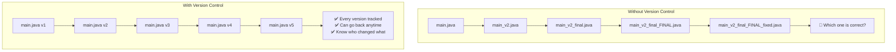
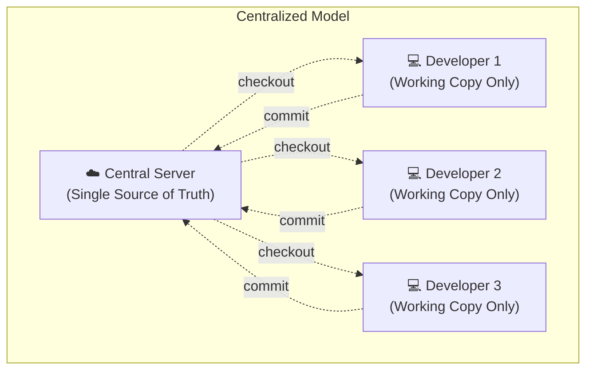
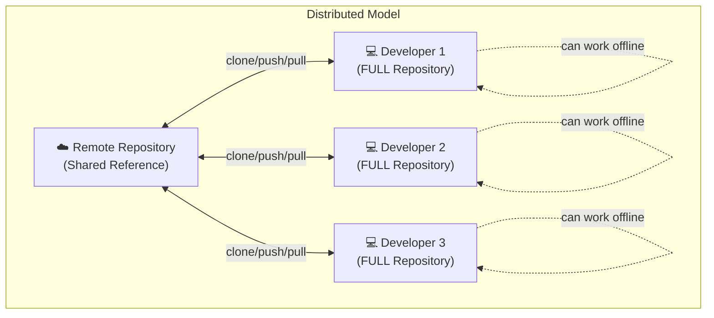
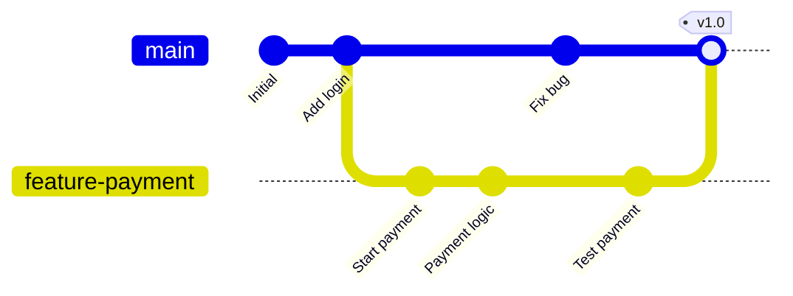
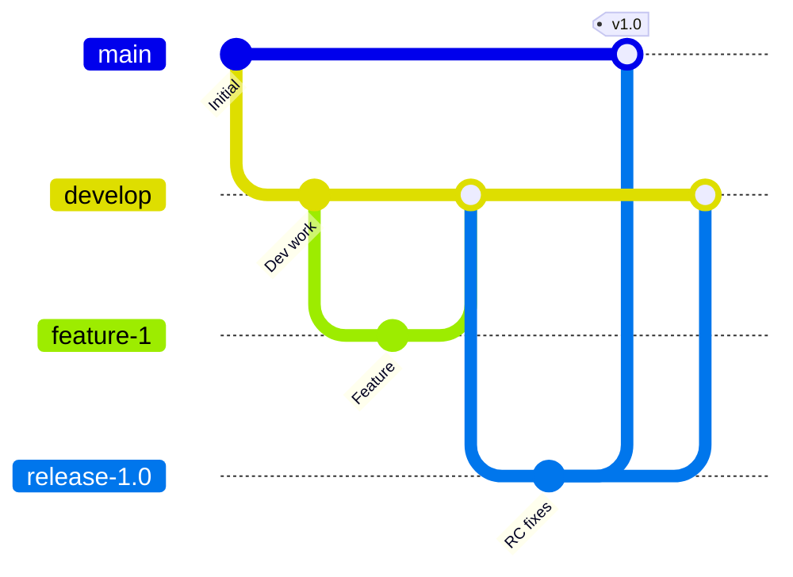
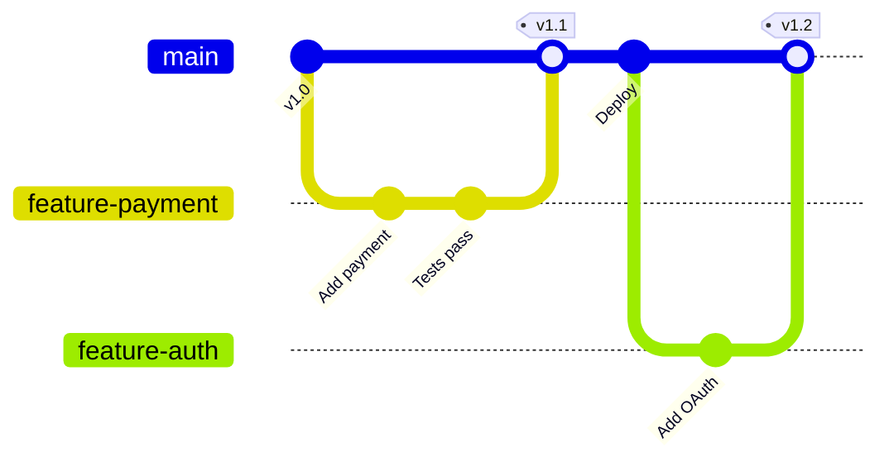
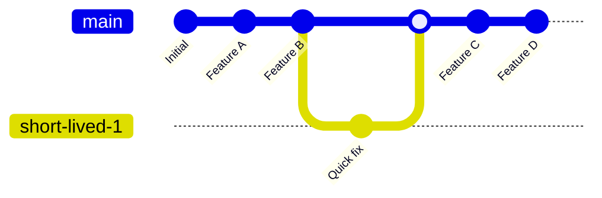
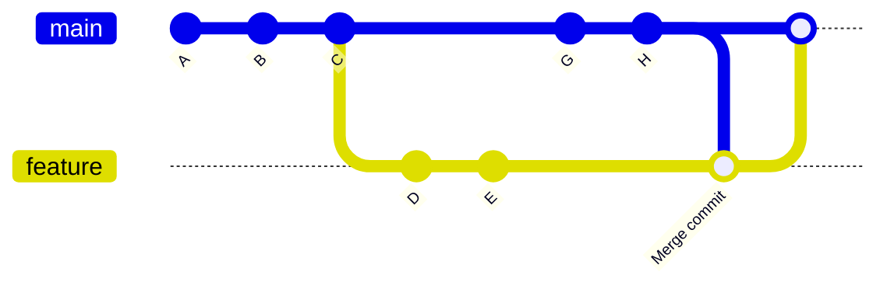
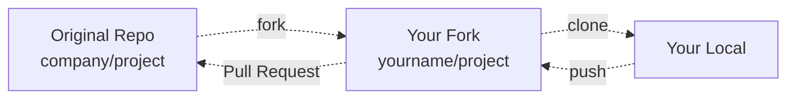
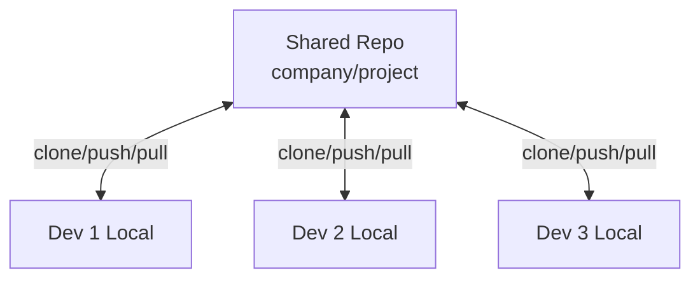

# **Tutorial 02: Version Control Concepts** 🔀

**Master Version Control Before Git Commands**

---

## **📋 Table of Contents**

1. [The Nightmare Scenario](#1-the-nightmare-scenario)
2. [What is Version Control Really?](#2-what-is-version-control-really)
3. [Distributed vs Centralized Version Control](#3-distributed-vs-centralized-version-control)
4. [Branching Strategies Deep Dive](#4-branching-strategies-deep-dive)
5. [Merge vs Rebase: The Eternal Debate](#5-merge-vs-rebase-the-eternal-debate)
6. [Collaboration Workflows](#6-collaboration-workflows)
7. [Repository Organization Patterns](#7-repository-organization-patterns)
8. [Commit Best Practices](#8-commit-best-practices)
9. [How Big Tech Uses Version Control](#9-how-big-tech-uses-version-control)
10. [Version Control for Java Projects](#10-version-control-for-java-projects)
11. [Interview Questions & Answers](#11-interview-questions--answers)
12. [Hands-on Challenges](#12-hands-on-challenges)

---

## **1. The Nightmare Scenario**

### **The "Works On My Machine" Disaster** 💥

```
Monday 9:00 AM - Sprint Planning
You: "I'll implement the payment feature"
Sarah: "I'll work on user authentication"
Mike: "I'll refactor the database layer"

Friday 4:00 PM - Integration Hell
You: "My code works perfectly!"
Sarah: "Mine too!"
Mike: "Same here!"

Manager: "Great! Let's integrate everything for demo..."

*30 minutes later*

🔥 Application won't compile
🔥 Conflicts in 47 files
🔥 Database migrations are out of order
🔥 Three different versions of the same file
🔥 Nobody knows which changes to keep
🔥 Demo is in 1 hour

You: "Let me just email you my files..."
Sarah: "Wait, which version? I have payment_v2_final_FINAL.java"
Mike: "I already overwrote that file yesterday!"

Manager: "Why don't we have proper version control?!"
```

**Without Version Control:**
- 😱 Lost code when someone overwrites files
- 🤯 No history of who changed what and why
- 💀 Cannot roll back to working state
- 🔥 Integration takes days instead of minutes
- 😩 Blaming game when things break

**The Real Problem**: You're managing code like you manage Word documents - manually copying, renaming, emailing, praying nothing breaks.

---

## **2. What is Version Control Really?**

### **Beyond "Git Commands"**

Most tutorials teach you:
```bash
git add .
git commit -m "changes"
git push
```

But they don't explain **WHY** version control exists or **WHAT** problems it solves.

### **Version Control = Time Machine + Parallel Universes + Collaboration Hub**



### **Core Concepts Version Control Provides**

#### **1. History Tracking**
```
Every change is recorded with:
  - What changed (diff)
  - Who changed it (author)
  - When it changed (timestamp)
  - Why it changed (commit message)
```

**Example:**
```
Commit: a7b8c9d
Author: John Doe <john@example.com>
Date: May 15, 2026 10:30 AM

Fix payment processing timeout

- Increased connection timeout from 5s to 30s
- Added retry logic for failed transactions
- This fixes bug #1234 where large orders failed
```

#### **2. Parallel Development**
```
Multiple developers work simultaneously:
  - On different features (parallel branches)
  - Without blocking each other
  - Merge when ready
```

#### **3. Rollback Capability**
```
Deployment fails in production?
  → Rollback to last working version in seconds
  → Not days of "trying to remember what we changed"
```

#### **4. Code Review & Collaboration**
```
Before merging code:
  - Others review your changes
  - Discuss improvements
  - Catch bugs before production
  - Share knowledge
```

---

## **3. Distributed vs Centralized Version Control**

### **Centralized VCS (CVS, SVN)**



**How it Works:**
```
1. Central server has the ONLY complete history
2. Developers checkout working copies
3. Must connect to server to commit
4. Must connect to server to see history
5. Server down = everyone blocked
```

**Limitations:**
- ❌ Single point of failure
- ❌ Slow (network required for everything)
- ❌ Cannot work offline
- ❌ Difficult branching
- ❌ Limited local experimentation

### **Distributed VCS (Git, Mercurial)**



**How it Works:**
```
1. Every developer has FULL repository
2. Complete history available locally
3. Work offline, commit locally
4. Push changes when ready
5. Remote server is just another copy
```

**Advantages:**
- ✅ No single point of failure
- ✅ Fast (local operations)
- ✅ Work offline
- ✅ Easy branching/merging
- ✅ Experiment freely

### **Comparison Table**

| Aspect | Centralized (SVN) | Distributed (Git) |
|--------|-------------------|-------------------|
| **Repository** | Single central server | Every clone is full repo |
| **Offline Work** | ❌ No | ✅ Yes |
| **Speed** | Slow (network) | Fast (local) |
| **Branching** | Difficult | Easy and cheap |
| **Backup** | Single point of failure | Every clone is backup |
| **Scalability** | Limited | Excellent |
| **Learning Curve** | Easier | Steeper |
| **Commit Access** | Network required | Local always |

**Why Git Won:**
- Speed: Local operations 100x faster
- Branching: Create branches in seconds
- Offline: Work on plane, train, anywhere
- Flexibility: Multiple workflows supported

---

## **4. Branching Strategies Deep Dive**

### **What is Branching Really?**

Think of branches as **parallel universes** where you can experiment without affecting the main reality.



**Concept**: 
- `main` branch = production-ready code
- `feature-payment` branch = experimental payment feature
- Work independently, merge when ready

### **Common Branching Strategies**

#### **Strategy 1: Git Flow** 🌊



**Branches:**
- `main` - Production releases only
- `develop` - Integration branch
- `feature/*` - Individual features
- `release/*` - Release preparation
- `hotfix/*` - Emergency production fixes

**When to Use:**
- Scheduled releases
- Multiple versions in production
- Large teams
- Enterprise projects

**Pros:**
- ✅ Clear separation of concerns
- ✅ Supports multiple versions
- ✅ Well-documented process

**Cons:**
- ❌ Complex workflow
- ❌ Slower releases
- ❌ Overhead for small teams

#### **Strategy 2: GitHub Flow** 🚀



**Workflow:**
1. Create feature branch from `main`
2. Work on feature
3. Open Pull Request
4. Code review
5. Merge to `main`
6. Deploy immediately

**When to Use:**
- Continuous deployment
- Web applications
- Small to medium teams
- Fast iteration

**Pros:**
- ✅ Simple
- ✅ Fast releases
- ✅ Always deployable main

**Cons:**
- ❌ Not for scheduled releases
- ❌ Requires good CI/CD
- ❌ No release branches

#### **Strategy 3: Trunk-Based Development** 🌳



**Workflow:**
- Everyone commits to `main` (or very short-lived branches)
- Branches live < 1 day
- Feature flags for incomplete work
- Deploy from main multiple times/day

**When to Use:**
- High-performing teams
- Continuous delivery
- Google, Facebook scale

**Pros:**
- ✅ Maximum integration
- ✅ Fastest feedback
- ✅ Reduces merge conflicts

**Cons:**
- ❌ Requires discipline
- ❌ Needs feature flags
- ❌ Requires strong testing

### **Comparison**

| Strategy | Complexity | Release Speed | Team Size | CI/CD Required |
|----------|-----------|---------------|-----------|----------------|
| **Git Flow** | High | Slow | Large | Moderate |
| **GitHub Flow** | Low | Fast | Small-Medium | High |
| **Trunk-Based** | Medium | Very Fast | Any | Very High |

**Choose Based On:**
- Release schedule (scheduled vs continuous)
- Team size and experience
- CI/CD maturity
- Application type

---

## **5. Merge vs Rebase: The Eternal Debate**

### **Understanding The Problem**

```
Your feature branch:
main: A - B - C
              \
feature:       D - E - F

Meanwhile, main moved forward:
main: A - B - C - G - H

Now what? Merge or Rebase?
```

### **Option 1: Merge** 🔀



**What Happens:**
```
main: A - B - C ------- G - H --------- M
              \                       /
feature:       D - E - F -------------

Result: Merge commit 'M' that combines both
```

**Pros:**
- ✅ Preserves complete history
- ✅ Safe (non-destructive)
- ✅ Clear feature timeline
- ✅ Easy to understand

**Cons:**
- ❌ Creates merge commits
- ❌ "Messy" history with many branches
- ❌ Harder to read history

### **Option 2: Rebase** 📝


**What Happens:**
```
Before:
main: A - B - C - G - H
              \
feature:       D - E - F

After Rebase:
main: A - B - C - G - H
                      \
feature:               D' - E' - F'

(D, E, F are "replayed" on top of H)
```

**Pros:**
- ✅ Linear history (easier to read)
- ✅ No merge commits
- ✅ Cleaner git log
- ✅ Easier bisect for bugs

**Cons:**
- ❌ Rewrites history (dangerous if shared)
- ❌ Loses context of when features diverged
- ❌ Can be confusing for beginners

### **The Golden Rules**

```
✅ Merge when:
  - Working on shared branches
  - Want to preserve complete history
  - Team prefers it
  - Feature branches

✅ Rebase when:
  - Cleaning up local commits before pushing
  - Want linear history
  - Personal feature branches
  - Updating feature branch with main changes

❌ NEVER Rebase:
  - Public/shared branches (main, develop)
  - Commits that others have based work on
  - Release branches
```

### **Real-World Example: Spring Boot Project**

```bash
# Scenario: You're working on payment feature
# Meanwhile, someone merged authentication to main

# Option 1: Merge
git checkout feature-payment
git merge main  # Brings main changes, creates merge commit

# Option 2: Rebase
git checkout feature-payment
git rebase main  # Replays your commits on top of main
# If conflicts, resolve and continue:
git rebase --continue
```

**Google's Approach**: Mostly trunk-based (like rebase)
**GitHub's Approach**: Merge commits with squash option
**Your Approach**: Depends on team agreement!

---

## **6. Collaboration Workflows**

### **Workflow 1: Fork & Pull Request** 🍴

**Used By**: Open source projects, external contributors



**Process:**
```
1. Fork original repository (creates your copy)
2. Clone your fork locally
3. Create feature branch
4. Make changes, commit
5. Push to your fork
6. Open Pull Request to original repo
7. Code review & discussion
8. Maintainer merges (or requests changes)
```

**Benefits:**
- No direct access needed to original repo
- Safe for open source
- Isolated experimentation

### **Workflow 2: Shared Repository** 🤝

**Used By**: Private company projects, trusted teams



**Process:**
```
1. Clone shared repository
2. Create feature branch
3. Push branch to shared repo
4. Open Pull Request
5. Code review
6. Merge to main
```

**Benefits:**
- Simpler workflow
- Direct collaboration
- Centralized access control

### **Pull Request Best Practices**

#### **Bad Pull Request** ❌
```
Title: "Updates"
Description: "Made some changes"

Files changed: 47 files, +2,847 −1,234
Commits: 23 commits over 3 weeks
```

#### **Good Pull Request** ✅
```
Title: "Add payment processing with Stripe integration"

Description:
## What
Implements credit card payment processing using Stripe API

## Why
Closes #234 - Need payment for premium features

## How
- Added StripeService for API integration
- Created Payment entity and repository
- Implemented webhook handler for payment events
- Added integration tests

## Testing
- Unit tests: PaymentServiceTest
- Integration tests: StripeIntegrationTest
- Manual testing on staging

Files changed: 8 files, +487 −23
Commits: 3 logical commits
```

---

## **7. Repository Organization Patterns**

### **Pattern 1: Monorepo** 📦

```
monorepo/
├── services/
│   ├── user-service/
│   │   ├── src/
│   │   └── pom.xml
│   ├── payment-service/
│   │   ├── src/
│   │   └── pom.xml
│   └── notification-service/
├── libraries/
│   ├── common-utils/
│   └── domain-models/
├── infrastructure/
│   └── terraform/
└── pom.xml (parent)
```

**Pros:**
- ✅ Shared code easily
- ✅ Atomic cross-project changes
- ✅ Single version of truth
- ✅ Easier refactoring

**Cons:**
- ❌ Larger repository
- ❌ CI/CD complexity
- ❌ Access control harder

**Used By**: Google, Facebook, Twitter

### **Pattern 2: Polyrepo** 🗂️

```
org/user-service/
org/payment-service/
org/notification-service/
org/shared-library/
org/infrastructure/
```

**Pros:**
- ✅ Clear ownership
- ✅ Independent versioning
- ✅ Smaller repos
- ✅ Granular access control

**Cons:**
- ❌ Code sharing harder
- ❌ Cross-repo changes difficult
- ❌ Version dependencies complex

**Used By**: Netflix, Amazon (mostly)

### **Choosing**

```
Choose Monorepo when:
  - Tight coupling between projects
  - Same team owns everything
  - Frequent cross-project refactoring
  - Need atomic changes

Choose Polyrepo when:
  - Independent teams
  - Different release cycles
  - Clear service boundaries
  - Microservices architecture
```

---

## **8. Commit Best Practices**

### **Commit Messages That Don't Suck**

#### **Bad Commits** ❌
```
- "fix"
- "changes"
- "asdfasdf"
- "final version"
- "Update file.java"
```

#### **Good Commits** ✅
```
feat: Add Stripe payment integration

- Implement StripeService with payment methods
- Add webhook handler for payment events
- Create Payment entity and repository

Closes #234
```

### **Conventional Commits Format**

```
<type>(<scope>): <subject>

<body>

<footer>
```

**Types:**
```
feat:     New feature
fix:      Bug fix
docs:     Documentation
style:    Formatting, no code change
refactor: Code restructuring
test:     Adding tests
chore:    Build, dependencies
```

**Example:**
```
fix(payment): Handle timeout in Stripe API calls

Added retry logic with exponential backoff when Stripe
API calls timeout. This prevents payment failures during
high load periods.

- Retry up to 3 times
- Exponential backoff: 1s, 2s, 4s
- Log all retry attempts

Fixes #456
```

### **Atomic Commits**

```
❌ Bad: One huge commit
git add .
git commit -m "Worked all day"

✅ Good: Logical, atomic commits
git add src/service/PaymentService.java
git commit -m "feat: Add payment service skeleton"

git add src/config/StripeConfig.java
git commit -m "feat: Configure Stripe SDK"

git add src/controller/PaymentController.java
git commit -m "feat: Add payment REST endpoints"
```

**Why Atomic:**
- Easier code review
- Easier rollback
- Clearer history
- Better git bisect

---

## **9. How Big Tech Uses Version Control**

### **Google** 🔍

```
Strategy: Trunk-Based Development (Monorepo)

Repo: One massive repository
  - 2+ billion lines of code
  - 86 TB repository
  - 25,000 engineers committing

Workflow:
  - Everyone commits to trunk
  - Commits every ~30 seconds
  - Automated testing before merge
  - Feature flags for incomplete work
  - Custom tools (not standard Git)
```

**Lessons:**
- Monorepo works at massive scale
- Automation is critical
- Trunk-based requires discipline
- Custom tooling when needed

### **Facebook** 📘

```
Strategy: Trunk-Based (Monorepo)

Workflow:
  - Ship code to production twice/day
  - All developers commit to main
  - Extensive automated testing
  - Canary deployments
  - Quick rollback capability
```

**Lessons:**
- Fast feedback loops essential
- Testing prevents trunk chaos
- Deployment speed matters

### **Netflix** 🎬

```
Strategy: Polyrepo (Microservices)

Workflow:
  - Separate repo per microservice
  - GitHub Flow style
  - Pull requests required
  - Spinnaker for deployments
  - Each team owns services
```

**Lessons:**
- Polyrepo fits microservices
- Team autonomy important
- Need orchestration tools

### **Amazon** 📦

```
Strategy: Polyrepo (Service-Oriented)

Workflow:
  - ~1000s of repositories
  - Teams own their repos
  - Internal package system
  - Deploy independently
  - Service contracts enforced
```

**Lessons:**
- Scale with team independence
- Clear boundaries critical
- Internal tooling required

---

## **10. Version Control for Java Projects**

### **What to Commit** ✅

```
your-java-project/
├── src/
│   ├── main/java/          ✅ Commit
│   └── test/java/          ✅ Commit
├── pom.xml                  ✅ Commit (or build.gradle)
├── README.md                ✅ Commit
├── .gitignore               ✅ Commit
└── Dockerfile               ✅ Commit
```

### **What NOT to Commit** ❌

```
your-java-project/
├── target/                  ❌ Build output
├── .idea/                   ❌ IDE settings
├── *.iml                    ❌ IDE files
├── .DS_Store                ❌ OS files
├── application-local.yml    ❌ Local config
├── .env                     ❌ Secrets
└── dependency-reduced-pom.xml ❌ Generated
```

### **Essential .gitignore for Java**

```gitignore
# Build outputs
target/
build/
out/
*.jar
*.war
*.ear

# IDE
.idea/
*.iml
.vscode/
*.swp
.DS_Store

# Gradle
.gradle/
gradle-app.setting

# Logs
*.log

# Secrets
.env
application-local.yml
application-local.properties

# OS
Thumbs.db
```

### **Spring Boot Project Example**

```java
// PaymentService.java
package com.example.payment;

/**
 * Service for processing payments via Stripe.
 * 
 * @version 1.0
 * @since 2026-05-15
 * @author DevOps Team
 */
@Service
public class PaymentService {
    
    private final StripeClient stripeClient;
    private final PaymentRepository repository;
    
    /**
     * Process payment with retry logic.
     * 
     * @param amount Payment amount in cents
     * @param token  Stripe payment token
     * @return Payment confirmation
     * @throws PaymentException if payment fails after retries
     */
    @Retryable(maxAttempts = 3, backoff = @Backoff(delay = 1000))
    public PaymentConfirmation processPayment(int amount, String token) {
        // Implementation
    }
}
```

**Version Control Benefits:**
- See who added `@Retryable` and why
- Track when retry logic was introduced
- Rollback if retry causes issues
- Code review caught timeout bug

---

## **11. Interview Questions & Answers**

### **Q1: Explain Git vs GitHub**

**❌ Bad Answer:**
"GitHub is where you store Git code."

**✅ Good Answer:**
"Git is the distributed version control system that runs locally on your machine, tracking code changes, managing branches, and maintaining history. GitHub is a cloud platform that hosts Git repositories and adds collaboration features like pull requests, code review, CI/CD integrations, and issue tracking. You can use Git without GitHub, but GitHub makes team collaboration much easier."

---

### **Q2: When would you use rebase vs merge?**

**❌ Bad Answer:**
"Rebase is better because it keeps history clean."

**✅ Good Answer:**
"It depends on the context. I use merge for integrating feature branches into main because it preserves the complete history and is safe for shared branches. I use rebase for cleaning up my local commits before pushing—for example, if I made 10 small commits while developing, I'll rebase interactively to squash them into logical units. The golden rule I follow: never rebase public branches that others might have based work on."

**Follow-up - Real Experience:**
"In my last project, we used merge for all pull requests to main, which gave us clear feature boundaries in the history. But before opening a PR, I'd rebase my feature branch onto the latest main to avoid merge conflicts and ensure my changes apply cleanly."

---

### **Q3: How do you handle merge conflicts?**

**❌ Bad Answer:**
"I just accept incoming changes."

**✅ Good Answer:**
"Merge conflicts happen when two branches modify the same code. My process: First, I understand what both changes are trying to accomplish by looking at the context and commit messages. Then I decide which to keep, or often, how to combine them intelligently. After resolving, I test the code to ensure it still works—conflicts often break functionality even if they compile. Finally, I commit the resolution with a clear message explaining what was merged."

**Real Example:**
"Recently, I had a conflict where two team members modified the same Spring Boot configuration. One added database pooling settings, the other added caching config. I kept both changes, ensured they didn't conflict, and tested that both features worked together."

---

### **Q4: Explain trunk-based development**

**❌ Bad Answer:**
"Everyone commits to main."

**✅ Good Answer:**
"Trunk-based development is a practice where developers commit to the main branch (trunk) frequently—at least daily. Instead of long-lived feature branches, we use very short-lived branches (hours, not days) or commit directly to main. The key enablers are comprehensive automated testing, feature flags to hide incomplete work, and strong CI/CD. The benefit is continuous integration, which reduces merge conflicts and accelerates feedback loops."

**Tradeoffs:**
"It requires high discipline and excellent test coverage. Not suitable for teams without mature CI/CD. But it's used by high-performers like Google and Facebook because it prevents integration problems and enables continuous delivery."

---

## **12. Hands-on Challenges**

### **Challenge 1: Branch Strategy Decision** 🎯

**Scenario:**
You're joining a startup with:
- 5 developers
- Web application (React + Spring Boot)
- Deploy to production 2-3 times per week
- No legacy versions to maintain
- Good test coverage

**Task:** Choose branching strategy and justify

<details>
<summary>💡 Solution</summary>

**Recommended: GitHub Flow**

**Reasoning:**
1. Small team (5 devs) → Don't need Git Flow complexity
2. Web app → Can deploy anytime (unlike mobile)
3. 2-3 deploys/week → Regular cadence, not continuous
4. No multiple versions → Don't need release branches
5. Good tests → Safe to merge to main

**Workflow:**
```
1. Create feature branch from main
2. Develop feature
3. Open PR when ready
4. Code review + CI tests
5. Merge to main
6. Auto-deploy to staging
7. Manual deploy to production
```

**Why Not Others:**
- Git Flow: Too complex for small team
- Trunk-Based: Not deploying frequently enough (need 10+/day)

</details>

**XP: +50** 🏆

---

### **Challenge 2: Monorepo vs Polyrepo** 🏗️

**Scenario:**
Your company has:
- User service (Team A)
- Payment service (Team B)
- Notification service (Team C)
- Shared library (used by all)

Teams want to:
- Deploy independently
- Share common code
- Own their services

**Task:** Recommend repo structure

<details>
<summary>💡 Solution</summary>

**Recommended: Hybrid Approach**

**Structure:**
```
Monorepo:
  company/backend/
    ├── services/
    │   ├── user-service/
    │   ├── payment-service/
    │   └── notification-service/
    └── shared/
        └── common-library/

Deploy:
  - CI detects which service changed
  - Only build/deploy that service
  - Services have independent versions
```

**Why:**
1. Monorepo benefits:
   - Atomic updates to shared library
   - Easy refactoring across services
   - Single version of truth

2. Independent deployment:
   - CI builds only changed services
   - Each service has own version tag
   - Deploy separately to production

**Implementation:**
```yaml
# .github/workflows/ci.yml
on:
  push:
    paths:
      - 'services/user-service/**'
      
jobs:
  build-user-service:
    # Only runs when user-service changed
```

**Alternative:** If teams truly independent, use polyrepo + publish shared library to package registry.

</details>

**XP: +60** 🏆

---

### **Challenge 3: Fix The Mess** 🔥

**Scenario:**
Your git log looks like this:
```
abc123 - asdf
def456 - fix
ghi789 - more changes
jkl012 - final
mno345 - final FINAL
pqr678 - actually final
```

All commits are on your local feature branch, not pushed yet.

**Task:** Clean this up before opening PR

<details>
<summary>💡 Solution</summary>

**Use Interactive Rebase:**

```bash
# Rebase last 6 commits
git rebase -i HEAD~6

# Interactive editor opens:
pick abc123 asdf
squash def456 fix
squash ghi789 more changes
squash jkl012 final
squash mno345 final FINAL
squash pqr678 actually final

# Save and editor opens for commit message:
feat: Add payment service with Stripe integration

- Implement PaymentService class
- Add Stripe API client configuration
- Create payment REST endpoints
- Add validation for payment requests

Closes #234
```

**Result:**
- 6 messy commits → 1 clean commit
- Clear description
- Ready for PR review

**Why Safe:**
- Commits not pushed yet (only local)
- Can abort with `git rebase --abort`
- Your feature branch, you control it

</details>

**XP: +40** 🏆

---

### **Challenge 4: Disaster Recovery** 💀

**Scenario:**
```
Disaster: You committed secrets to Git!

git log:
abc123 - Add payment integration
       ↳ contains application.yml with Stripe API key!

Already pushed to GitHub (public repo!)
```

**Task:** Fix this immediately

<details>
<summary>💡 Solution</summary>

**Immediate Actions:**

**1. Revoke Compromised Secrets** (FIRST!)
```
Priority 1: Revoke Stripe API key
  - Log into Stripe dashboard
  - Revoke exposed key immediately
  - Generate new key
  - Update in secure secret store
```

**2. Remove from History**
```bash
# Remove file from all history
git filter-branch --force --index-filter \
  "git rm --cached --ignore-unmatch src/main/resources/application.yml" \
  --prune-empty --tag-name-filter cat -- --all

# Or use BFG (faster):
bfg --delete-files application.yml

# Force push to remote
git push origin --force --all
```

**3. Prevent Future Incidents**
```gitignore
# Update .gitignore
application.yml
application-*.yml
.env
*.pem
*.key

# Use git-secrets tool
git secrets --install
git secrets --register-aws
```

**4. Use Proper Secret Management**
```yaml
# application.yml (committed)
stripe:
  api-key: ${STRIPE_API_KEY}  # From environment

# Actual secret in:
# - AWS Secrets Manager
# - HashiCorp Vault
# - GitHub Secrets (for CI)
```

**Lessons:**
- Revoke first, clean later
- Use secret management tools
- Pre-commit hooks prevent this
- Secrets never in Git, period

</details>

**XP: +100** (Important lesson!) 🏆

---

## **🎓 Summary: Concepts Over Commands**

### **Key Takeaways**

1. **Version Control** = Time machine + Collaboration tool
2. **Distributed > Centralized** for modern workflows
3. **Branching Strategy** depends on team size and release cycle
4. **Merge vs Rebase** each has proper use cases
5. **Commit Quality** matters for long-term maintainability
6. **Repository Organization** aligns with team structure
7. **Secrets Management** is critical from day one

### **Interview Sound Bites**

```
"Version control isn't just about saving files—it's about 
 enabling collaboration, maintaining history, and supporting 
 complex workflows like parallel development and safe rollbacks."

"I choose merge for shared branches to preserve history, and 
 rebase for cleaning up local commits. Never rebase public branches."

"Trunk-based development enables continuous delivery but requires 
 strong testing and feature flags. Git Flow provides structure but 
 slows down delivery. Choose based on team maturity and release needs."
```

---

**Achievement Unlocked**: 🏆 **Version Control Master** (+500 XP)

You now understand version control **concepts**, not just Git commands!

---

**Next**: [03: Build & Artifact Concepts →](03_Build_Artifact_Concepts.md)

**Related**: 
- [04: CI/CD Pipeline Concepts](04_CI_CD_Pipeline_Concepts.md)
- [15: GitOps Concepts](15_GitOps_Concepts.md)

---

**Total XP Available**: +250 from challenges, +500 achievement = **+750 XP** 🚀
