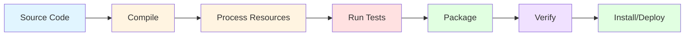
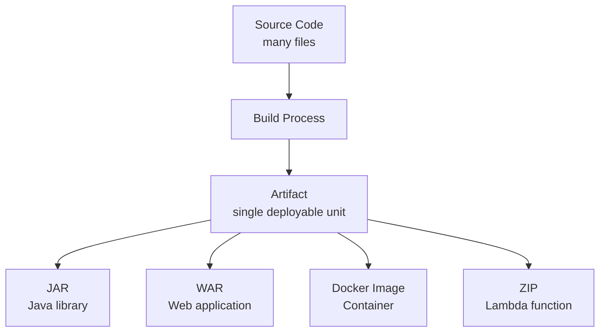
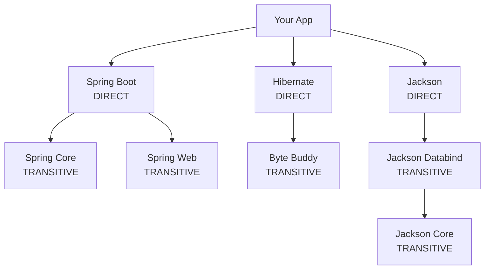
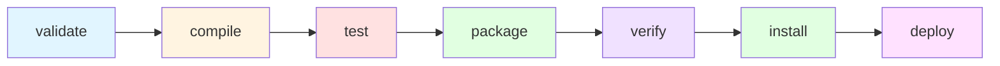
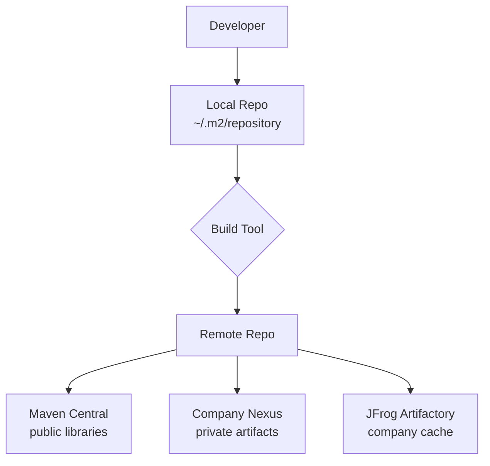

# **Tutorial 03: Build & Artifact Concepts** 🔨

**Understand Build Systems Before Maven/Gradle**

---

## **📋 Table of Contents**

1. [The JAR Hell Nightmare](#1-the-jar-hell-nightmare)
2. [What is a Build Really?](#2-what-is-a-build-really)
3. [What Are Artifacts?](#3-what-are-artifacts)
4. [Dependency Management Deep Dive](#4-dependency-management-deep-dive)
5. [Build Tool Concepts](#5-build-tool-concepts)
6. [Artifact Repositories](#6-artifact-repositories)
7. [Versioning Strategies](#7-versioning-strategies)
8. [Build Optimization](#8-build-optimization)
9. [How Big Tech Handles Builds](#9-how-big-tech-handles-builds)
10. [Java Build Ecosystem](#10-java-build-ecosystem)
11. [Interview Questions & Answers](#11-interview-questions--answers)
12. [Hands-on Challenges](#12-hands-on-challenges)

---

## **1. The JAR Hell Nightmare**

### **The "It Works On My Machine" Build Edition** 💥

```
Monday Morning - New Developer Onboarding

Dev: "I cloned the repo. How do I build it?"
You: "Just run the build script"

Dev: *runs build*
ERROR: Cannot find commons-lang-2.3.jar
ERROR: Cannot find spring-core-5.2.jar
ERROR: Cannot find 47 other dependencies

Dev: "Where are these JARs?"
You: "Oh, you need to download them manually"

Dev: "From where?"
You: "Let me find the links... wait, some are from SourceForge, 
     some from Apache, some from that website that no longer exists..."

2 Hours Later

Dev: "Okay, I downloaded all JARs"
*puts them in random folders*

Dev: *runs build*
ERROR: ClassNotFoundException
ERROR: NoSuchMethodError
ERROR: Version conflict

Dev: "Which version of commons-lang?"
You: "2.3... or wait, we might have upgraded to 2.6"
Dev: "I have 3.0"
You: "That won't work!"

4 Hours Later

Dev: "It compiles now!"
*tries to run tests*
ERROR: Different versions on my machine vs yours

Manager: "Why is onboarding taking 2 days?!"
```

**Without Build Tools:**
- 😱 Manual dependency management
- 🤯 "Works on my machine" syndrome
- 💀 Unreproducible builds
- 🔥 Version conflicts everywhere
- 😩 Hours wasted on setup

**The Real Problem**: You're building software like it's 1995.

---

## **2. What is a Build Really?**

### **Beyond "Running javac"**

Most people think building is:
```bash
javac MyApp.java
```

But a real build does WAY more:



### **Complete Build Process**

```
Step 1: Resolve Dependencies
  ↓ Download external libraries (Spring, Hibernate, etc.)
  ↓ Verify versions and checksums
  ↓ Handle transitive dependencies

Step 2: Compile Source Code
  ↓ src/main/java → target/classes
  ↓ Generate bytecode
  ↓ Check for errors

Step 3: Process Resources
  ↓ Copy application.yml to classpath
  ↓ Replace variables (version, env)
  ↓ Process templates

Step 4: Compile Test Code
  ↓ src/test/java → target/test-classes
  ↓ Include test dependencies

Step 5: Run Tests
  ↓ Execute unit tests
  ↓ Generate coverage reports
  ↓ Fail build if tests fail

Step 6: Package
  ↓ Create JAR/WAR file
  ↓ Include manifest
  ↓ Bundle resources

Step 7: Verify
  ↓ Run integration tests
  ↓ Security scans
  ↓ Code quality checks

Step 8: Install/Deploy
  ↓ Install to local repository (for development)
  ↓ Deploy to remote repository (for sharing)
```

### **Build vs Compile**

| Aspect | Compile | Build |
|--------|---------|-------|
| **Scope** | Source → Bytecode | Complete process |
| **Dependencies** | Must be present | Automatically fetched |
| **Testing** | No | Yes |
| **Packaging** | No | Yes (JAR/WAR) |
| **Artifacts** | .class files | Deployable package |
| **Automation** | Manual | Automated |

**Key Insight**: 
```
Compile = One step
Build   = Complete automation of software creation
```

---

## **3. What Are Artifacts?**

### **Artifact = Deployable Output of Build**



### **Types of Artifacts**

#### **1. JAR (Java ARchive)**
```
my-app-1.0.0.jar
├── META-INF/
│   └── MANIFEST.MF       (metadata)
├── com/example/
│   └── MyApp.class       (compiled code)
├── application.yml       (resources)
└── lib/ (if fat JAR)
```

**Use Case**: 
- Standalone applications
- Libraries
- Microservices

**Example:**
```java
// Build creates:
user-service-1.2.3.jar

// Run with:
java -jar user-service-1.2.3.jar
```

#### **2. WAR (Web ARchive)**
```
my-webapp-1.0.0.war
├── META-INF/
├── WEB-INF/
│   ├── web.xml           (servlet config)
│   ├── classes/          (compiled code)
│   └── lib/              (dependencies)
└── static/
    └── index.html        (web content)
```

**Use Case**:
- Traditional web applications
- Deploy to Tomcat, JBoss, etc.

#### **3. Docker Image**
```
my-app:1.0.0

Layers:
  - Base OS (Alpine)
  - JRE
  - Application JAR
  - Configuration
```

**Use Case**:
- Cloud deployments
- Kubernetes
- Microservices

#### **4. Fat JAR (Uber JAR)**
```
my-app-1.0.0.jar (50 MB)
  ↓ Contains
  ├── Your application code
  ├── ALL dependencies (Spring, Hibernate, etc.)
  └── Embedded server (Tomcat)

Run anywhere with:
java -jar my-app-1.0.0.jar
```

**Pros:**
- ✅ Single file to deploy
- ✅ No dependency hell
- ✅ Version consistency

**Cons:**
- ❌ Large file size
- ❌ Duplicates libraries across services

### **Artifact Naming Convention**

```
{artifactId}-{version}.{extension}

Examples:
  user-service-1.2.3.jar
  payment-api-2.0.0-SNAPSHOT.war
  notification-service-1.0.0-RC1.jar
```

**Version Components:**
```
1.2.3-SNAPSHOT

1     = Major (breaking changes)
2     = Minor (new features)
3     = Patch (bug fixes)
SNAPSHOT = In development
```

---

## **4. Dependency Management Deep Dive**

### **The Dependency Problem**

```
Your Application
  ├─ needs Spring Boot 2.7.0
  │    └─ needs Spring Core 5.3.20
  │         └─ needs Commons Logging 1.2
  ├─ needs Hibernate 5.6.0
  │    └─ needs Byte Buddy 1.12.10
  └─ needs Jackson 2.13.0
       └─ needs Jackson Databind 2.13.0
            └─ needs Jackson Core 2.13.0

Transitive Dependencies = 100+ JARs automatically!
```

### **Direct vs Transitive Dependencies**



**Direct**: You explicitly declare
**Transitive**: Required by your dependencies

### **Dependency Scopes**

```xml
<!-- Maven example -->
<dependencies>
    <!-- Compile Scope (default) -->
    <dependency>
        <groupId>org.springframework.boot</groupId>
        <artifactId>spring-boot-starter-web</artifactId>
        <!-- Available in all phases -->
    </dependency>
    
    <!-- Test Scope -->
    <dependency>
        <groupId>junit</groupId>
        <artifactId>junit</artifactId>
        <scope>test</scope>
        <!-- Only available during testing -->
    </dependency>
    
    <!-- Provided Scope -->
    <dependency>
        <groupId>javax.servlet</groupId>
        <artifactId>servlet-api</artifactId>
        <scope>provided</scope>
        <!-- Available at compile, provided by runtime (Tomcat) -->
    </dependency>
    
    <!-- Runtime Scope -->
    <dependency>
        <groupId>mysql</groupId>
        <artifactId>mysql-connector-java</artifactId>
        <scope>runtime</scope>
        <!-- Not needed for compilation, needed for execution -->
    </dependency>
</dependencies>
```

| Scope | Compile Time | Test Time | Runtime | Packaged |
|-------|-------------|-----------|---------|----------|
| **compile** | ✅ | ✅ | ✅ | ✅ |
| **provided** | ✅ | ✅ | ✅ | ❌ |
| **runtime** | ❌ | ✅ | ✅ | ✅ |
| **test** | ❌ | ✅ | ❌ | ❌ |

### **Version Conflicts**

```
Problem: Diamond Dependency

Your App
  ├─ Library A → needs Commons Lang 2.6
  └─ Library B → needs Commons Lang 3.0

Which version gets used?
```

**Maven Solution**: Dependency Mediation
```
Rules:
1. Nearest Definition wins
   (Your direct dependency beats transitive)
   
2. First Declaration wins
   (If same depth, first in pom.xml)
```

**Gradle Solution**: Latest Version
```
By default: Uses highest version
Can customize with resolution strategy
```

**Best Practice**: Explicitly declare version
```xml
<dependency>
    <groupId>commons-lang</groupId>
    <artifactId>commons-lang3</artifactId>
    <version>3.12.0</version>  <!-- Explicit -->
</dependency>
```

### **Bill of Materials (BOM)**

```xml
<!-- Import Spring Boot BOM -->
<dependencyManagement>
    <dependencies>
        <dependency>
            <groupId>org.springframework.boot</groupId>
            <artifactId>spring-boot-dependencies</artifactId>
            <version>2.7.0</version>
            <type>pom</type>
            <scope>import</scope>
        </dependency>
    </dependencies>
</dependencyManagement>

<!-- Now use without versions -->
<dependencies>
    <dependency>
        <groupId>org.springframework.boot</groupId>
        <artifactId>spring-boot-starter-web</artifactId>
        <!-- Version inherited from BOM -->
    </dependency>
</dependencies>
```

**Benefits:**
- ✅ Consistent versions across related libraries
- ✅ Tested combinations
- ✅ Easier upgrades

---

## **5. Build Tool Concepts**

### **Build Lifecycle**



### **Maven Phases**

```bash
mvn validate  # Check project structure
mvn compile   # Compile source code
mvn test      # Run unit tests
mvn package   # Create JAR/WAR
mvn verify    # Run integration tests
mvn install   # Install to local repo (~/.m2)
mvn deploy    # Deploy to remote repo
```

**Key Concept**: Phases are sequential
```
mvn package
  ↓ Automatically runs:
  - validate
  - compile
  - test
  - package
```

### **Declarative vs Imperative Builds**

#### **Declarative (Maven)**
```xml
<!-- WHAT you want -->
<project>
    <dependencies>
        <dependency>
            <groupId>org.springframework.boot</groupId>
            <artifactId>spring-boot-starter-web</artifactId>
        </dependency>
    </dependencies>
</project>

<!-- Maven figures out HOW to build -->
```

**Pros:**
- Convention over configuration
- Less to write
- Standardized structure

**Cons:**
- Less flexible
- Harder to customize

#### **Imperative (Gradle)**
```groovy
// HOW to build
dependencies {
    implementation 'org.springframework.boot:spring-boot-starter-web'
}

// Custom task
task customBuild {
    doLast {
        println 'Custom build logic'
    }
}
```

**Pros:**
- More flexible
- Programmable builds
- Faster (incremental builds)

**Cons:**
- More complex
- Can be inconsistent

### **Build Tool Comparison**

| Feature | Maven | Gradle | Ant |
|---------|-------|--------|-----|
| **Type** | Declarative | Imperative | Imperative |
| **Config** | XML | Groovy/Kotlin | XML |
| **Speed** | Slower | Faster | Fast |
| **Learning** | Easier | Harder | Hardest |
| **Flexibility** | Lower | Higher | Highest |
| **Convention** | Strong | Medium | None |

**Market Share (2026):**
- Maven: 55%
- Gradle: 40%
- Others: 5%

---

## **6. Artifact Repositories**

### **Repository Types**



### **Local Repository**

```
~/.m2/repository/
├── org/
│   └── springframework/
│       └── spring-core/
│           └── 5.3.20/
│               ├── spring-core-5.3.20.jar
│               ├── spring-core-5.3.20.pom
│               └── spring-core-5.3.20.jar.sha1
```

**Purpose:**
- Cache downloaded dependencies
- Store locally installed artifacts
- Avoid re-downloading

### **Remote Repositories**

#### **1. Maven Central** (Public)
```
https://repo.maven.apache.org/maven2/

Contains:
  - Open source libraries
  - Public frameworks
  - Community packages
  - Free to use
```

#### **2. Company Repository** (Private)
```
https://nexus.company.com/

Contains:
  - Internal libraries
  - Proprietary code
  - Snapshots
  - Access controlled
```

### **Repository Configuration**

```xml
<!-- Maven pom.xml -->
<repositories>
    <!-- Public repo -->
    <repository>
        <id>maven-central</id>
        <url>https://repo.maven.apache.org/maven2</url>
    </repository>
    
    <!-- Company repo -->
    <repository>
        <id>company-nexus</id>
        <url>https://nexus.company.com/repository/maven-releases</url>
    </repository>
</repositories>

<!-- Where to publish artifacts -->
<distributionManagement>
    <repository>
        <id>company-releases</id>
        <url>https://nexus.company.com/repository/maven-releases</url>
    </repository>
    <snapshotRepository>
        <id>company-snapshots</id>
        <url>https://nexus.company.com/repository/maven-snapshots</url>
    </snapshotRepository>
</distributionManagement>
```

### **Nexus vs Artifactory**

| Feature | Nexus | JFrog Artifactory |
|---------|-------|-------------------|
| **Open Source** | Yes (OSS version) | No (free tier) |
| **Docker Support** | Yes | Yes |
| **NPM/PyPI** | Yes | Yes |
| **UI** | Good | Better |
| **Price** | Free/$) | $$$ |

**Most Companies**: Use Nexus for cost, Artifactory for features

---

## **7. Versioning Strategies**

### **Semantic Versioning (SemVer)**

```
MAJOR.MINOR.PATCH-QUALIFIER

Examples:
  1.0.0         First release
  1.2.3         Normal release
  2.0.0         Breaking change
  1.3.0-SNAPSHOT  In development
  1.3.0-RC1     Release candidate
```

**Rules:**
```
MAJOR (1.x.x → 2.x.x)
  - Breaking changes
  - Incompatible API changes
  - Remove deprecated features

MINOR (1.2.x → 1.3.x)
  - New features
  - Backwards compatible
  - Add functionality

PATCH (1.2.3 → 1.2.4)
  - Bug fixes only
  - No new features
  - Backwards compatible
```

### **Version Qualifiers**

```
1.0.0-SNAPSHOT     Development version
1.0.0-alpha        Early preview
1.0.0-beta         Feature complete, unstable
1.0.0-RC1          Release candidate
1.0.0              Stable release
1.0.1              Patch release
```

### **SNAPSHOT vs RELEASE**

```
SNAPSHOT:
  - Mutable (can be replaced)
  - For development
  - Not for production
  - Updated frequently

Example: 1.2.0-SNAPSHOT
  ↓ Each build replaces previous
  1.2.0-20260515.120000-1
  1.2.0-20260515.140000-2
  1.2.0-20260515.160000-3

RELEASE:
  - Immutable (cannot be changed)
  - For production
  - Specific version
  - Permanent

Example: 1.2.0
  ↓ Once deployed, never changes
  Always points to same artifact
```

### **Versioning Best Practices**

```
✅ DO:
  - Use semantic versioning
  - Never reuse version numbers
  - Increment appropriately
  - Document breaking changes
  - Use SNAPSHOTs for dev

❌ DON'T:
  - Deploy SNAPSHOTs to production
  - Change released artifacts
  - Skip versions randomly
  - Use v1, v2 without specifics
```

---

## **8. Build Optimization**

### **Slow Build Problem**

```
Before Optimization:
  mvn clean install: 12 minutes
  
  ├─ Download dependencies: 3 min
  ├─ Compile: 2 min
  ├─ Run 1000 tests: 6 min
  └─ Package: 1 min
```

### **Optimization Strategies**

#### **1. Incremental Builds**
```bash
# Don't always clean
mvn install       # Instead of: mvn clean install

# Only rebuild changed modules
mvn install -pl :user-service -am
```

#### **2. Parallel Builds**
```bash
# Maven parallel execution
mvn -T 4 install     # 4 threads
mvn -T 1C install    # 1 thread per CPU core

# Gradle parallel
gradle build --parallel
```

#### **3. Skip Tests (When Safe)**
```bash
# During development iteration
mvn package -DskipTests

# But NEVER in CI/CD!
```

#### **4. Dependency Caching**
```yaml
# GitHub Actions example
- uses: actions/cache@v3
  with:
    path: ~/.m2/repository
    key: ${{ runner.os }}-maven-${{ hashFiles('**/pom.xml') }}
```

#### **5. Multi-Module Builds**
```bash
# Only build what changed
mvn install -pl :payment-service -am
  # -pl: project list
  # -am: also make dependencies
```

### **Build Time Improvements**

```
Original: 12 minutes
  ↓ Add parallel builds (-T 1C)
8 minutes (33% faster)
  ↓ Enable incremental compilation
5 minutes (58% faster)
  ↓ Cache dependencies in CI
2 minutes (83% faster)
```

---

## **9. How Big Tech Handles Builds**

### **Google** 🔍

```
Build System: Bazel

Scale:
  - 2+ billion lines of code
  - 25,000+ engineers
  - 100,000+ builds per day

Key Features:
  - Hermetic builds (reproducible)
  - Distributed caching
  - Incremental builds
  - Build anything in seconds
```

**Lessons:**
- Reproducibility critical at scale
- Caching is essential
- Monorepo needs custom tools

### **Netflix** 🎬

```
Build Approach:
  - Gradle for Java services
  - Nebula plugins (open source)
  - Artifact publishing to Artifactory
  - Immutable versioning

Pipeline:
  Build → Test → Publish → Deploy
  5-10 minutes per service
```

**Lessons:**
- Standard plugins enforce consistency
- Artifact immutability prevents issues
- Speed enables frequent deployments

### **Facebook** 📘

```
Build System: Buck (now deprecated, moving to Bazel)

Features:
  - Incremental builds
  - Distributed builds
  - Caching across machines
  - Mobile + Backend

Speed:
  - Full build: 15 minutes
  - Incremental: 30 seconds
```

**Lessons:**
- Invest in build infrastructure
- Speed enables developer productivity
- Custom tools for specific needs

### **Amazon** 📦

```
Build Infrastructure:
  - Internal build system (Brazil)
  - Package-based dependencies
  - Versioned artifacts
  - Reproducible builds

Focus:
  - Service isolation
  - Clear dependencies
  - Fast iteration
```

**Lessons:**
- Clear service boundaries
- Dependency management is critical
- Build for scalability

---

## **10. Java Build Ecosystem**

### **Minimal Spring Boot Build**

```xml
<!-- pom.xml -->
<project>
    <modelVersion>4.0.0</modelVersion>
    
    <groupId>com.example</groupId>
    <artifactId>payment-service</artifactId>
    <version>1.0.0</version>
    <packaging>jar</packaging>
    
    <parent>
        <groupId>org.springframework.boot</groupId>
        <artifactId>spring-boot-starter-parent</artifactId>
        <version>2.7.0</version>
    </parent>
    
    <dependencies>
        <dependency>
            <groupId>org.springframework.boot</groupId>
            <artifactId>spring-boot-starter-web</artifactId>
        </dependency>
    </dependencies>
    
    <build>
        <plugins>
            <plugin>
                <groupId>org.springframework.boot</groupId>
                <artifactId>spring-boot-maven-plugin</artifactId>
            </plugin>
        </plugins>
    </build>
</project>
```

**Build:**
```bash
mvn package

# Creates:
target/payment-service-1.0.0.jar
  ↓ Executable fat JAR with embedded Tomcat
  
java -jar target/payment-service-1.0.0.jar
  ↓ Application starts on port 8080
```

### **Multi-Module Project**

```
company-backend/
├── pom.xml (parent)
├── user-service/
│   └── pom.xml
├── payment-service/
│   └── pom.xml
└── shared-library/
    └── pom.xml
```

```xml
<!-- Parent pom.xml -->
<modules>
    <module>shared-library</module>
    <module>user-service</module>
    <module>payment-service</module>
</modules>

<!-- Build order automatically determined -->
mvn install
  1. shared-library (no dependencies)
  2. user-service (depends on shared-library)
  3. payment-service (depends on shared-library)
```

---

## **11. Interview Questions & Answers**

### **Q1: What's the difference between compile and build?**

**❌ Bad Answer:**
"They're the same thing."

**✅ Good Answer:**
"Compilation is just one step in the build process—it transforms source code into bytecode. Building is the complete process that includes resolving dependencies, compiling source and test code, running tests, processing resources, and packaging everything into a deployable artifact like a JAR or WAR file. A build ensures you have a tested, ready-to-deploy package, not just compiled classes."

---

### **Q2: Explain Maven's dependency resolution**

**❌ Bad Answer:**
"Maven downloads JARs from the internet."

**✅ Good Answer:**
"Maven resolves dependencies using a specific order: first, it checks the local repository (~/.m2), then configured remote repositories, and finally Maven Central. It handles transitive dependencies automatically—if I declare Spring Boot, Maven also downloads Spring Core, Spring Web, and all their dependencies. For version conflicts, Maven uses dependency mediation rules: the nearest definition wins, and at the same depth, the first declaration wins. I can override this with explicit declarations or dependency management sections."

**Real Example:**
"In our project, we had a conflict where Spring Boot brought in Jackson 2.12 but another library needed 2.13. Maven chose 2.12 by default, but we explicitly declared 2.13 in dependency management to ensure consistency."

---

### **Q3: What is a fat JAR and when would you use it?**

**❌ Bad Answer:**
"A big JAR file."

**✅ Good Answer:**
"A fat JAR, or uber JAR, packages your application code plus all dependencies into a single executable JAR file. It's useful for microservices and cloud deployments because you can deploy a single self-contained artifact without worrying about dependency management on the target system. Spring Boot creates fat JARs by default with an embedded server like Tomcat, so you can run the application with just 'java -jar app.jar' anywhere Java is installed."

**Tradeoffs:**
"The downside is file size—a Spring Boot fat JAR might be 50MB compared to a 1MB thin JAR. If you have multiple microservices, you're duplicating common libraries. But the deployment simplicity and version consistency usually outweigh the size cost."

---

### **Q4: How do you handle dependency version conflicts?**

**❌ Bad Answer:**
"Use the latest version."

**✅ Good Answer:**
"I use a systematic approach: First, I identify conflicts with 'mvn dependency:tree' to see the full dependency graph. Then I understand why the conflict exists—often it's transitive dependencies from different libraries. I resolve it by explicitly declaring the version I want in the dependency management section, which takes precedence. For complex cases, I use exclusions to prevent unwanted transitive dependencies. Finally, I test thoroughly because version changes can introduce subtle bugs."

**Tool Usage:**
"I also use dependency analysis plugins to detect vulnerabilities and outdated dependencies, and I prefer using BOMs like Spring Boot Dependencies to ensure tested, compatible version combinations."

---

## **12. Hands-on Challenges**

### **Challenge 1: Dependency Conflict Resolution** 🔍

**Scenario:**
```
Your build fails with:
NoSuchMethodError: com.fasterxml.jackson.databind.JsonNode.has(String)

dependency:tree shows:
[INFO] +- org.springframework.boot:spring-boot-starter-web:jar:2.7.0
[INFO] |  \- com.fasterxml.jackson.core:jackson-databind:jar:2.13.0
[INFO] +- com.external:old-library:jar:1.0.0
[INFO]    \- com.fasterxml.jackson.core:jackson-databind:jar:2.8.0
```

**Task:** Fix the version conflict

<details>
<summary>💡 Solution</summary>

**Problem**: Two versions of jackson-databind (2.13.0 and 2.8.0)

**Solution 1: Dependency Management** (Recommended)
```xml
<dependencyManagement>
    <dependencies>
        <dependency>
            <groupId>com.fasterxml.jackson.core</groupId>
            <artifactId>jackson-databind</artifactId>
            <version>2.13.0</version>
        </dependency>
    </dependencies>
</dependencyManagement>
```

**Solution 2: Exclusion**
```xml
<dependency>
    <groupId>com.external</groupId>
    <artifactId>old-library</artifactId>
    <version>1.0.0</version>
    <exclusions>
        <exclusion>
            <groupId>com.fasterxml.jackson.core</groupId>
            <artifactId>jackson-databind</artifactId>
        </exclusion>
    </exclusions>
</dependency>
```

**Verify:**
```bash
mvn dependency:tree | grep jackson-databind
# Should show only 2.13.0

mvn clean test
# All tests pass
```

**Why This Works:**
- Dependency management enforces version across all transitive dependencies
- Exclusion removes old version from specific dependency
- Both ensure only 2.13.0 is used

</details>

**XP: +50** 🏆

---

### **Challenge 2: Build Optimization** ⚡

**Scenario:**
```
CI build time: 15 minutes
  - Dependency download: 4 min
  - Compilation: 2 min
  - Tests (500 tests): 8 min
  - Packaging: 1 min

Goal: Reduce to under 5 minutes
```

**Task:** Optimize the build

<details>
<summary>💡 Solution</summary>

**Optimization 1: Cache Dependencies**
```yaml
# .github/workflows/ci.yml
- uses: actions/cache@v3
  with:
    path: ~/.m2/repository
    key: ${{ runner.os }}-maven-${{ hashFiles('**/pom.xml') }}
    restore-keys: |
      ${{ runner.os }}-maven-

# Result: 4 min → 30 sec (first run still 4 min)
```

**Optimization 2: Parallel Testing**
```xml
<!-- pom.xml -->
<plugin>
    <groupId>org.apache.maven.plugins</groupId>
    <artifactId>maven-surefire-plugin</artifactId>
    <configuration>
        <parallel>classes</parallel>
        <threadCount>4</threadCount>
    </configuration>
</plugin>

# Result: 8 min → 3 min (with 4 cores)
```

**Optimization 3: Skip Redundant Steps**
```bash
# Don't clean every time
mvn verify   # Instead of: mvn clean verify

# Result: 2 min → 1 min (incremental compile)
```

**Total Improvement:**
```
Before: 15 minutes
After:  4.5 minutes (70% faster!)

Breakdown:
  - Dependencies: 30 sec (cached)
  - Compilation: 1 min (incremental)
  - Tests: 3 min (parallel)
  - Packaging: 1 min
```

</details>

**XP: +75** 🏆

---

### **Challenge 3: Multi-Module Build** 🏗️

**Scenario:**
```
You have:
  shared-library (used by both services)
  user-service (depends on shared-library)
  payment-service (depends on shared-library)

Bug fixed in shared-library
Need to rebuild only affected modules
```

**Task:** Configure efficient multi-module build

<details>
<summary>💡 Solution</summary>

**Project Structure:**
```xml
<!-- parent/pom.xml -->
<modules>
    <module>shared-library</module>
    <module>user-service</module>
    <module>payment-service</module>
</modules>
```

**Build Strategy:**

**1. Full Build** (First time or major changes)
```bash
mvn clean install
# Builds all modules in order
```

**2. Incremental Build** (Bug fix in shared-library)
```bash
# Build shared-library and downstream dependents
mvn install -pl :shared-library -amd
#  -pl: project list
#  -amd: also make dependents

# Builds:
#   1. shared-library
#   2. user-service (depends on it)
#   3. payment-service (depends on it)
```

**3. Single Service** (Testing payment-service)
```bash
# Build payment-service and its dependencies
mvn install -pl :payment-service -am
#  -am: also make (dependencies)

# Builds:
#   1. shared-library (dependency)
#   2. payment-service
```

**Time Saved:**
```
Full build: 6 minutes
Incremental: 3 minutes (50% faster)
Single service: 2 minutes (67% faster)
```

**CI/CD Integration:**
```yaml
# Only build changed modules
- name: Detect changes
  run: |
    CHANGED_MODULES=$(git diff --name-only HEAD~1 | 
      grep -oP '(?<=\/).+?(?=\/)' | uniq)
    
- name: Build changed
  run: mvn install -pl $CHANGED_MODULES -amd
```

</details>

**XP: +60** 🏆

---

### **Challenge 4: Artifact Versioning Strategy** 📦

**Scenario:**
```
Your team deploys microservices independently
Need version strategy that:
  - Allows parallel development
  - Enables rollback
  - Tracks what's in production
  - Works with CI/CD
```

**Task:** Design versioning strategy

<details>
<summary>💡 Solution</summary>

**Strategy: Semantic Versioning + Build Metadata**

**Development:**
```
1.2.0-SNAPSHOT
  ↓ Continuous development
  Updated with each commit
```

**Release Candidates:**
```
1.2.0-RC1
1.2.0-RC2
  ↓ Feature complete, testing
```

**Production:**
```
1.2.0
  ↓ Immutable, permanent
  Tagged in Git: v1.2.0
```

**Hotfixes:**
```
1.2.1  (critical bug)
1.2.2  (security issue)
```

**CI/CD Automation:**
```yaml
# .github/workflows/release.yml
name: Release
on:
  push:
    tags:
      - 'v*'

jobs:
  release:
    steps:
      - name: Extract version
        run: echo "VERSION=${GITHUB_REF#refs/tags/v}" >> $GITHUB_ENV
        
      - name: Update pom.xml
        run: mvn versions:set -DnewVersion=$VERSION
        
      - name: Build and deploy
        run: |
          mvn clean deploy
          docker build -t payment-service:$VERSION .
          docker push payment-service:$VERSION
```

**Tracking in Production:**
```java
// Built into artifact
@RestController
public class HealthController {
    
    @Value("${app.version}")
    private String version;
    
    @GetMapping("/health")
    public Map<String, String> health() {
        return Map.of(
            "status", "UP",
            "version", version,  // "1.2.0"
            "commit", getGitCommit()
        );
    }
}

# Query production:
curl https://api.company.com/health
{
  "status": "UP",
  "version": "1.2.0",
  "commit": "a7b8c9d"
}
```

**Rollback Process:**
```bash
# Current: payment-service:1.2.0 (broken)
# Rollback to: payment-service:1.1.0

kubectl set image deployment/payment-service \
  app=payment-service:1.1.0

# Artifacts are immutable, rollback is instant
```

</details>

**XP: +80** 🏆

---

## **🎓 Summary: Build Concepts Mastered**

### **Key Takeaways**

1. **Build** ≠ Compile → Complete automation of software creation
2. **Artifacts** = Deployable outputs (JAR, WAR, Docker images)
3. **Dependencies** = Managed automatically with transitive resolution
4. **Versioning** = Semantic versioning for clarity and compatibility
5. **Repositories** = Artifact storage (local + remote)
6. **Optimization** = Caching, parallelization, incremental builds
7. **Tools** = Maven (declarative) vs Gradle (imperative)

### **Interview Sound Bites**

```
"A build is the complete process of transforming source code into 
 a deployable artifact, including dependency resolution, compilation, 
 testing, and packaging—not just running javac."

"Fat JARs bundle all dependencies for simple deployment, but at the 
 cost of larger file sizes. They're ideal for microservices where 
 deployment simplicity outweighs the duplication of libraries."

"I handle dependency conflicts by first identifying them with 
 dependency:tree, then explicitly declaring versions in dependency 
 management, and finally testing to ensure compatibility."
```

---

**Achievement Unlocked**: 🏆 **Build Master** (+500 XP)

You understand build systems beyond running Maven commands!

---

**Next**: [05: Testing Concepts →](05_Testing_Concepts.md)

**Related**: 
- [02: Version Control Concepts](02_Version_Control_Concepts.md)
- [04: CI/CD Pipeline Concepts](04_CI_CD_Pipeline_Concepts.md)

---

**Total XP Available**: +265 from challenges, +500 achievement = **+765 XP** 🚀
