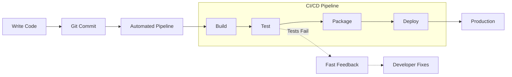
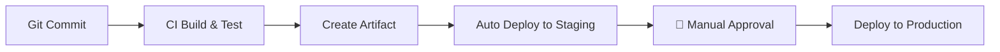
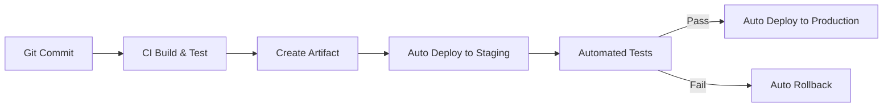
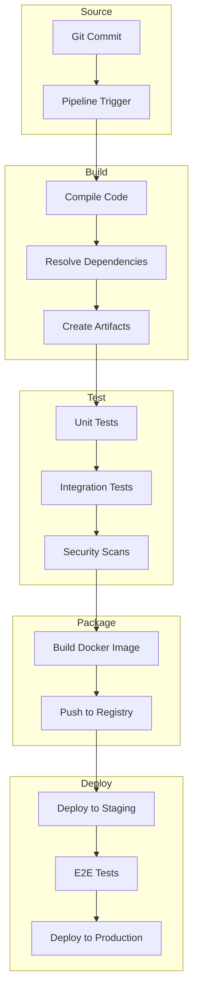
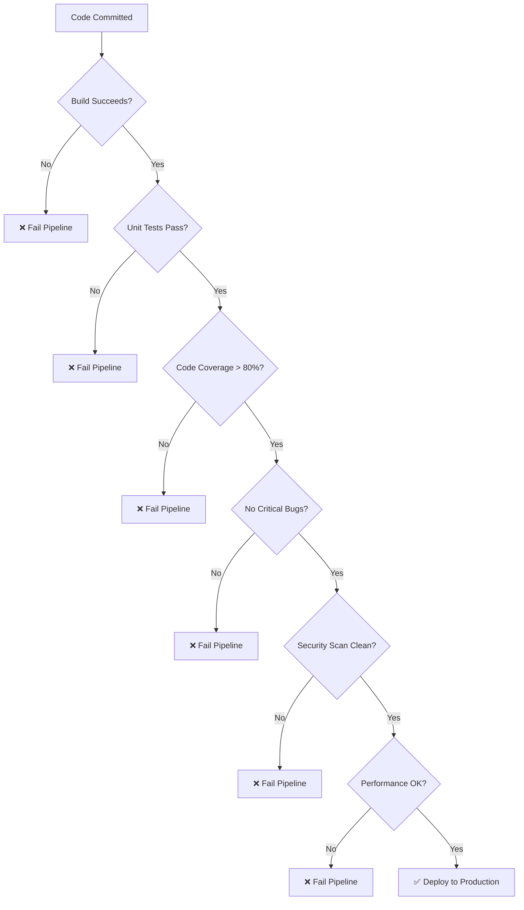

# **CI/CD Pipeline Concepts** 🔄

**Understanding Continuous Integration and Continuous Deployment (Before Learning Jenkins, GitLab CI, or GitHub Actions!)**

---

## **Table of Contents** 📑
1. [The Manual Deployment Nightmare](#1-the-manual-deployment-nightmare)
2. [What Is CI/CD?](#2-what-is-cicd)
3. [Continuous Integration Concepts](#3-continuous-integration-concepts)
4. [Continuous Delivery vs Continuous Deployment](#4-continuous-delivery-vs-continuous-deployment)
5. [Pipeline Stages Explained](#5-pipeline-stages-explained)
6. [Quality Gates](#6-quality-gates)
7. [Real-World Big Tech Pipelines](#7-real-world-big-tech-pipelines)
8. [For Java Developers](#8-for-java-developers)
9. [Gamified Challenges](#9-gamified-challenges)
10. [Troubleshooting Pipelines](#10-troubleshooting-pipelines)
11. [Interview Preparation](#11-interview-preparation)
12. [Key Takeaways](#12-key-takeaways)

---

## **1. The Manual Deployment Nightmare** 😱

### **🎬 Scene: Friday 5 PM Deployment**

```
Project Manager: "We need to deploy the new feature by 6 PM!"

Developer: "Okay, let me start..."

Manual Deployment Checklist (2 hours):
  ☐ Pull latest code from Git
  ☐ Run tests manually (30 minutes)
    - Wait, 3 tests failed!
    - Fix bugs
    - Run tests again
  ☐ Build WAR file with Maven
    - Build failed! Missing dependency
    - Fix pom.xml
    - Build again (10 minutes)
  ☐ SSH into server
    - Which server? Staging or production?
    - What's the password again?
  ☐ Stop Tomcat
  ☐ Backup old WAR file
  ☐ Copy new WAR file
    - Wait, wrong WAR file!
    - Copy correct one
  ☐ Start Tomcat
    - Application won't start!
    - Check logs... ClassNotFoundException
    - Wrong Java version on server
  ☐ Rollback
  
Time: 8 PM (still not deployed)
Status: Production is still running old version
Team: Frustrated, tired, hungry
Weekend plans: Ruined

Monday morning: Try again...
```

**Sound familiar?** This was (and sadly still is) reality for many teams.

### **The Cost of Manual Deployments** 💸

```
Real Company Example: Traditional Bank (2015)

Deployment Frequency: Every 3 months
Deployment Duration: 48 hours
Team Size: 20 people
Success Rate: 30% (70% rollback!)

Cost Calculation:
  Time cost: 20 people × 48 hours × 4 deployments/year = 3,840 hours/year
  Hourly rate: $50/hour (conservative)
  Total cost: $192,000/year just for deployments
  
  Failed deployments: 70% need rollback
  Rework cost: Additional $134,400/year
  
  Total annual cost: $326,400
  
  Benefits: Still deploying quarterly (slow innovation)
```

---

## **2. What Is CI/CD?** 🤔

### **The Core Concepts** 🎯

```
CI/CD is NOT a tool.
CI/CD is a PRACTICE enabled by automation.

CI = Continuous Integration
CD = Continuous Delivery OR Continuous Deployment

Think of it as an assembly line for software!
```

### **The Manufacturing Analogy** 🏭

```
Traditional Software:
  Artisan Craftsman Model
  └─ One person builds entire product
  └─ Quality checked at the end
  └─ Slow, inconsistent, error-prone

CI/CD Software:
  Assembly Line Model
  └─ Multiple automated stages
  └─ Quality checked at each stage
  └─ Fast, consistent, reliable
```



---

## **3. Continuous Integration Concepts** 🔗

### **What Is Continuous Integration?** 📦

> **Continuous Integration (CI)** is the practice of merging all developers' working copies to a shared mainline several times a day, with automated build and tests.

### **The Core Idea** 💡

```
Without CI:
  Developer A: Works for 2 weeks on feature A
  Developer B: Works for 2 weeks on feature B
  Developer C: Works for 2 weeks on feature C
  
  Integration Day (Friday):
    Merge all code → CONFLICTS EVERYWHERE! 🔥
    "It worked on my machine!"
    Weekend: Spent resolving conflicts
  
  Result: Integration Hell

With CI:
  Developer A: Commits 5 times/day
  Developer B: Commits 5 times/day
  Developer C: Commits 5 times/day
  
  After Each Commit:
    ✓ Automatic merge
    ✓ Automatic build
    ✓ Automatic tests
    ✓ Fast feedback (5 minutes)
  
  Conflicts: Small and easy to fix
  Integration: Painless
  
  Result: Integration Heaven ✨
```

### **The CI Principles** 📜

**1. Single Source Repository** 📚
```
Everyone commits to the same repository (usually main/master branch)

Bad Practice:
  developer-a-feature-branch (not merged for weeks)
  developer-b-feature-branch (not merged for weeks)
  developer-c-feature-branch (not merged for weeks)
  └─ Integration nightmare when merging

Good Practice:
  Feature branches live < 1 day
  Merge to main multiple times daily
  Main branch always buildable
```

**2. Automate the Build** 🏗️
```
Every commit triggers automatic build

Traditional: "Hey Bob, can you run the build?"
CI: Commit → Automatic build (no human intervention)

Build includes:
  ✓ Compile code
  ✓ Resolve dependencies
  ✓ Run static analysis
  ✓ Package artifacts
```

**3. Make Build Self-Testing** 🧪
```
Build doesn't just compile—it tests!

Traditional Build:
  compile → create JAR → done

CI Build:
  compile → run unit tests → run integration tests → 
  run security scans → create JAR → run smoke tests

If ANY step fails → build fails → developer notified
```

**4. Fast Feedback** ⚡
```
Build should complete in < 10 minutes

Why 10 minutes?
  - Developer still has context
  - Can fix immediately
  - Won't start new work

If build takes 1 hour:
  - Developer moves to next task
  - Context switch cost
  - Delayed feedback
```

**5. Test in Clone of Production** 🎭
```
"Works on my machine" syndrome

Without CI:
  Dev Machine: Windows, JDK 11, MySQL 8
  Production: Linux, JDK 8, PostgreSQL 12
  Result: Surprise failures! 💥

With CI:
  CI Server: Same OS, JDK, DB as production
  Result: Catch environment issues early
```

**6. Everyone Sees Results** 👀
```
Build status should be visible to entire team

Traditional: Build fails silently
CI: 
  - Dashboard shows build status
  - Slack notifications
  - Email alerts
  - Rotating monitor with build status
  
Broken build = TOP PRIORITY
Team drops everything to fix it
```

### **🎮 Challenge #1: CI Quiz**

```
Question: Your team commits code daily but doesn't run automated tests.
Is this Continuous Integration?

A) Yes - They're integrating code continuously
B) No - CI requires automated testing
C) Partially - It's integration but not "continuous"

Answer: B! 

CI requires:
  ✓ Frequent commits (✓ You have this)
  ✓ Automated builds (?)
  ✓ Automated tests (✗ Missing!)
  ✓ Fast feedback (✗ Missing!)

Without automated tests, you're just integrating code—not practicing CI.

+25 XP for understanding the difference!
```

---

## **4. Continuous Delivery vs Continuous Deployment** 🚀

### **The Confusion** 🤔

```
People often use "Continuous Delivery" and "Continuous Deployment" 
interchangeably. They're NOT the same!

Both start with CI, but differ in the final step.
```

### **Continuous Delivery** 📦

> **Continuous Delivery** means code is ALWAYS in a deployable state. Deployment to production is a MANUAL decision.



**Key Characteristics**:
```
✅ Every commit could be deployed
✅ Automated through staging
✅ Manual gate before production
✅ Business decides WHEN to deploy

Example: E-commerce site
  - Auto-deploy to staging after every commit
  - Marketing decides when to deploy to prod
    (avoid deploying during Black Friday!)
```

### **Continuous Deployment** 🚁

> **Continuous Deployment** means every code change that passes tests AUTOMATICALLY goes to production. NO manual gate.



**Key Characteristics**:
```
✅ Every commit could be deployed
✅ Fully automated pipeline
✅ NO manual approval
✅ Code decides WHEN to deploy (when tests pass)

Example: Netflix
  - Commit code
  - If tests pass → Production (no human intervention)
  - Deploy 4,000+ times per day
```

### **The Comparison** ⚖️

| Aspect | Continuous Delivery | Continuous Deployment |
|--------|-------------------|---------------------|
| **Automation** | Almost complete | Fully automated |
| **Production Deploy** | Manual decision | Automatic |
| **Frequency** | As business decides | Every commit that passes tests |
| **Risk** | Lower (human review) | Higher (no review) |
| **Speed** | Fast | Fastest |
| **Control** | More control | Less control |
| **Best For** | Regulated industries, B2B | SaaS, web apps |

### **Which Should You Use?** 🤷

```
Use Continuous Delivery if:
  ✓ Regulated industry (banking, healthcare)
  ✓ Need approval gates
  ✓ Coordinated releases (mobile apps)
  ✓ Marketing-driven releases
  ✓ B2B with scheduled maintenance windows

Use Continuous Deployment if:
  ✓ Web applications / SaaS
  ✓ High trust in tests
  ✓ Fast feedback critical
  ✓ Mature DevOps culture
  ✓ Can handle quick rollbacks

Most companies start with Continuous Delivery,
then graduate to Continuous Deployment.
```

---

## **5. Pipeline Stages Explained** 🎬

### **The Standard Pipeline** 🔄



### **Stage 1: Source / Trigger** 📝

```
What Happens:
  - Developer pushes code to Git
  - Webhook triggers CI/CD pipeline
  - Pipeline clones repository

Time: 10-30 seconds

Example (Git):
  git commit -m "Add payment feature"
  git push origin main
  
  → Triggers pipeline automatically
```

### **Stage 2: Build** 🏗️

```
What Happens:
  - Compile source code
  - Resolve dependencies
  - Run static analysis
  - Create build artifacts

Time: 2-5 minutes

Example (Java with Maven):
  mvn clean compile
  mvn dependency:resolve
  mvn package
  
  Output: target/myapp-1.0.jar

Quality Checks:
  ✓ Code compiles without errors
  ✓ All dependencies available
  ✓ No critical SonarQube issues
  ✓ Code coverage > 80%
```

### **Stage 3: Test** 🧪

```
What Happens:
  - Run unit tests
  - Run integration tests
  - Security vulnerability scanning
  - Performance tests (optional)

Time: 3-7 minutes

Test Pyramid:
         /\
        /E2E\      Few (slow, expensive)
       /------\
      / Integr \  Some (medium speed/cost)
     /----------\
    / Unit Tests\ Many (fast, cheap)
   /--------------\

Example (Java):
  mvn test (Unit tests - 1000+ tests in 2 minutes)
  mvn verify (Integration tests - 100 tests in 3 minutes)
  OWASP dependency check (Security scan - 1 minute)
  
Fail Fast:
  If unit tests fail → stop immediately
  Don't waste time on integration tests
```

### **Stage 4: Package** 📦

```
What Happens:
  - Create deployment package
  - Build Docker image (if containerized)
  - Tag with version
  - Push to artifact repository

Time: 1-3 minutes

Example (Java + Docker):
  # Build Docker image
  docker build -t myapp:1.0.${BUILD_NUMBER} .
  
  # Tag as latest
  docker tag myapp:1.0.${BUILD_NUMBER} myapp:latest
  
  # Push to registry
  docker push myapp:1.0.${BUILD_NUMBER}
  docker push myapp:latest

Artifact Examples:
  - Java: JAR/WAR file → Nexus/Artifactory
  - Docker: Container image → Docker Hub/ECR
  - npm: Package → npm registry
  - Python: Wheel → PyPI
```

### **Stage 5: Deploy to Staging** 🎭

```
What Happens:
  - Deploy to staging environment
  - Run smoke tests
  - Run E2E tests
  - Performance tests

Time: 5-10 minutes

Staging Environment:
  - Clone of production
  - Same configuration
  - Test data (not real customer data)
  - Isolated from production

Example (Kubernetes):
  kubectl set image deployment/myapp \
    myapp=myapp:1.0.${BUILD_NUMBER} \
    --namespace=staging
    
  # Wait for deployment
  kubectl rollout status deployment/myapp -n staging
  
  # Run smoke tests
  curl https://staging.myapp.com/health
  
  # Run E2E tests
  npm run test:e2e
```

### **Stage 6: Deploy to Production** 🚀

```
What Happens:
  - Deploy to production
  - Monitor key metrics
  - Gradual rollout (canary/blue-green)
  - Automatic rollback if issues

Time: 5-15 minutes

Deployment Strategies:
  1. Rolling Update (most common)
  2. Blue-Green (zero downtime)
  3. Canary (gradual rollout)
  4. Feature Flags (toggle features)

Example (Rolling Update):
  # Deploy new version
  kubectl set image deployment/myapp \
    myapp=myapp:1.0.${BUILD_NUMBER} \
    --namespace=production
  
  # Monitor rollout
  kubectl rollout status deployment/myapp -n production
  
  # If problems detected
  kubectl rollout undo deployment/myapp -n production
```

### **Total Pipeline Time** ⏱️

```
Ideal Pipeline Duration:

Source:     30 seconds
Build:      3 minutes
Test:       5 minutes
Package:    2 minutes
Staging:    8 minutes
Production: 10 minutes
─────────────────────────
Total:      ~28 minutes

Fast Feedback Loop ✅
```

---

## **6. Quality Gates** 🚦

### **What Are Quality Gates?** 🛑

> **Quality Gates** are automated checkpoints in the pipeline that prevent bad code from reaching production.

```
Think of Quality Gates as airport security:
  - Passport check (code compiles?)
  - Security scan (vulnerabilities?)
  - Boarding pass (tests pass?)
  
You can't board the flight (deploy) without passing ALL checks.
```

### **Common Quality Gates** 📋



**Gate 1: Build Success** 🏗️
```
Check: Does code compile?

Fail if:
  ✗ Compilation errors
  ✗ Missing dependencies
  ✗ Syntax errors

Example:
  [ERROR] Failed to execute goal compile
  └─ Fix errors before proceeding
```

**Gate 2: Unit Tests** 🧪
```
Check: Do all unit tests pass?

Fail if:
  ✗ Any test fails
  ✗ Tests don't run
  ✗ Test coverage too low

Example:
  Tests run: 1247
  Failures: 3 ❌
  └─ Pipeline stops, developer notified
```

**Gate 3: Code Coverage** 📊
```
Check: Is enough code tested?

Threshold: Usually 80%+

Fail if:
  ✗ Coverage < threshold
  ✗ Critical paths untested

Example:
  Coverage: 75% (❌ Required: 80%)
  Uncovered: PaymentService.processPayment()
  └─ Add tests before proceeding
```

**Gate 4: Code Quality** 💎
```
Check: Code maintainability

Tools: SonarQube, CodeClimate

Fail if:
  ✗ Critical bugs found
  ✗ Code smells > threshold
  ✗ Technical debt too high
  ✗ Duplicated code > 3%

Example:
  Critical Issues: 2
    - Possible SQL injection
    - Hardcoded credentials
  └─ Fix before deploying!
```

**Gate 5: Security Scan** 🔒
```
Check: Known vulnerabilities

Tools: OWASP Dependency Check, Snyk

Fail if:
  ✗ Critical vulnerabilities
  ✗ High-risk dependencies
  ✗ Outdated libraries

Example:
  Vulnerable dependency: log4j 2.14.0
  CVE-2021-44228 (Critical)
  └─ Update to 2.17.1
```

**Gate 6: Performance** ⚡
```
Check: Response time acceptable?

Thresholds:
  - API response < 200ms
  - Page load < 2 seconds
  - Database queries < 100ms

Fail if:
  ✗ Regression detected
  ✗ Memory leak found
  ✗ Excessive resource usage

Example:
  Previous: 150ms
  Current: 350ms (❌ Regression!)
  └─ Investigate performance issue
```

### **🎮 Challenge #2: Design Quality Gates**

```
Scenario: E-commerce Application

You're building a payment processing feature. Design quality gates.

Feature: Process Credit Card Payment

Required Gates:
  1. [ ] Unit tests for payment logic
  2. [ ] Integration test with payment gateway (test mode)
  3. [ ] Security scan (PCI compliance)
  4. [ ] No hardcoded credentials
  5. [ ] Response time < 500ms
  6. [ ] Error handling tested
  7. [ ] Logging in place
  8. [ ] Code reviewed by security team

Missing ANY gate = Don't deploy!

Why so strict?
  - Payment bugs = Lost money
  - Security issues = Data breach
  - Slow performance = Abandoned carts

+50 XP for designing comprehensive gates!
```

---

## **7. Real-World Big Tech Pipelines** 🏢

### **Netflix: Continuous Deployment at Scale** 🎬

```
Pipeline Stats:
  - 4,000+ deployments per day
  - 700+ microservices
  - Fully automated (no manual approvals)
  - Average pipeline time: 20-30 minutes

Pipeline Stages:
  1. Commit → Git
  2. Build → Gradle/Maven
  3. Test → Unit + Integration
  4. Bake → AMI creation
  5. Deploy → Canary (1% traffic)
  6. Monitor → Real-time metrics
  7. Scale → Gradual rollout to 100%
  8. Rollback → Automatic if issues

Key Practices:
  ✓ Chaos Engineering (Chaos Monkey)
  ✓ Feature Flags
  ✓ Canary Analysis
  ✓ Automatic Rollback
  ✓ Comprehensive Monitoring

Result: 99.99% uptime despite 4K+ daily deploys!
```

### **Amazon: Deploy Every 11.6 Seconds** 📦

```
Stats (2021):
  - Deployments: 5.2 million per year
  - Frequency: Every 11.6 seconds
  - Services: Thousands of microservices
  - Developers: Can deploy independently

Pipeline Approach:
  - Two-Pizza Team owns service end-to-end
  - Each team has own pipeline
  - Automated testing at every stage
  - Gradual rollout across regions
  - Automatic rollback on errors

Example: Adding Feature to Amazon.com
  Time from commit to production: ~15 minutes
  
  09:00:00 - Developer commits code
  09:00:30 - Build starts
  09:03:00 - Tests pass
  09:05:00 - Deploy to staging
  09:10:00 - E2E tests pass
  09:12:00 - Deploy to 1% production (Canary)
  09:14:00 - Metrics look good
  09:15:00 - Deploy to 100% production
  
  09:15:00 - Feature live for 500M+ users!
```

### **Google: Test-Driven Pipeline** 🔍

```
The Google Approach:
  - Every commit creates multiple builds
  - Tested across multiple configurations
  - 100 million+ tests run per day
  - Average: 50,000 tests per build

Pipeline Philosophy:
  "If it's not tested, it doesn't exist"

Test Levels:
  1. Small Tests (Unit)
     - Run in < 1 minute
     - No network, file, database
     - 80% of all tests
  
  2. Medium Tests (Integration)
     - Run in < 5 minutes
     - Can use localhost
     - 15% of all tests
  
  3. Large Tests (E2E)
     - Run in < 15 minutes
     - Full system test
     - 5% of all tests

Quality Gates:
  - 100% small tests must pass
  - 95%+ medium tests must pass
  - 90%+ large tests must pass

Result: 4 billion lines of code, single repository!
```

### **Facebook: Dark Launches** 🌓

```
The Facebook Strategy:
  - Deploy code disabled (dark launch)
  - Enable for employees first
  - Gradual rollout to 1%, 5%, 25%, 50%, 100%
  - A/B test everything

Pipeline Stages:
  1. Commit to master
  2. Automated tests
  3. Deploy to production (disabled via feature flag)
  4. Enable for Facebook employees (dogfooding)
  5. Enable for 1% users
  6. Monitor metrics (engagement, performance, errors)
  7. Gradual increase if metrics good
  8. 100% rollout or rollback

Example: New News Feed Algorithm
  Week 1: Deployed (dark launch)
  Week 2: Enabled for employees
  Week 3: 1% users
  Week 4: 10% users (metrics looking good)
  Week 5: 50% users
  Week 6: 100% users
  
  Result: Minimize risk, maximize data
```

---

## **8. For Java Developers** ☕

### **Java CI/CD Pipeline Example** 📝

```yaml
# Example pipeline for Spring Boot app
name: Java CI/CD Pipeline

on:
  push:
    branches: [ main ]

jobs:
  build:
    runs-on: ubuntu-latest
    steps:
      # Stage 1: Checkout
      - name: Checkout code
        uses: actions/checkout@v2
      
      # Stage 2: Setup
      - name: Set up JDK 11
        uses: actions/setup-java@v2
        with:
          java-version: '11'
      
      # Stage 3: Build
      - name: Build with Maven
        run: mvn clean package -DskipTests
      
      # Stage 4: Unit Tests
      - name: Run unit tests
        run: mvn test
      
      # Stage 5: Integration Tests
      - name: Run integration tests
        run: mvn verify
      
      # Stage 6: Code Coverage
      - name: Generate coverage report
        run: mvn jacoco:report
      
      # Quality Gate: Check coverage
      - name: Check coverage
        run: |
          COVERAGE=$(mvn jacoco:check -Dcoverage=80)
          if [ $? -ne 0 ]; then
            echo "Coverage below 80%"
            exit 1
          fi
      
      # Stage 7: Security Scan
      - name: OWASP Dependency Check
        run: mvn dependency-check:check
      
      # Stage 8: Build Docker Image
      - name: Build Docker image
        run: docker build -t myapp:${{ github.sha }} .
      
      # Stage 9: Push to Registry
      - name: Push to Docker Hub
        run: |
          echo "${{ secrets.DOCKER_PASSWORD }}" | docker login -u "${{ secrets.DOCKER_USERNAME }}" --password-stdin
          docker push myapp:${{ github.sha }}
      
      # Stage 10: Deploy to Staging
      - name: Deploy to Staging
        run: |
          kubectl set image deployment/myapp myapp=myapp:${{ github.sha }} -n staging
          kubectl rollout status deployment/myapp -n staging
      
      # Stage 11: E2E Tests on Staging
      - name: Run E2E tests
        run: npm run test:e2e -- --baseUrl=https://staging.myapp.com
      
      # Stage 12: Deploy to Production
      - name: Deploy to Production
        if: success()
        run: |
          kubectl set image deployment/myapp myapp=myapp:${{ github.sha }} -n production
          kubectl rollout status deployment/myapp -n production
      
      # Stage 13: Notify Team
      - name: Notify Slack
        if: always()
        run: |
          curl -X POST ${{ secrets.SLACK_WEBHOOK }} \
            -H 'Content-Type: application/json' \
            -d '{"text":"Deployment ${{ job.status }}"}'
```

### **Spring Boot CI/CD Best Practices** 🌱

```java
// 1. Health Check Endpoints
@RestController
public class HealthController {
    
    @GetMapping("/actuator/health")
    public ResponseEntity<String> health() {
        // Pipeline can check this endpoint
        return ResponseEntity.ok("UP");
    }
    
    @GetMapping("/actuator/ready")
    public ResponseEntity<String> ready() {
        // Kubernetes readiness probe
        if (isApplicationReady()) {
            return ResponseEntity.ok("READY");
        }
        return ResponseEntity.status(503).body("NOT READY");
    }
}

// 2. Build Info for Tracking
@Component
public class BuildInfo {
    
    @Value("${build.version}")
    private String version;
    
    @Value("${build.time}")
    private String buildTime;
    
    @Value("${git.commit}")
    private String gitCommit;
    
    @GetMapping("/actuator/info")
    public Map<String, String> info() {
        return Map.of(
            "version", version,
            "buildTime", buildTime,
            "gitCommit", gitCommit
        );
    }
}

// 3. Feature Flags for Gradual Rollout
@Service
public class PaymentService {
    
    @Autowired
    private FeatureFlagService featureFlags;
    
    public void processPayment(Payment payment) {
        if (featureFlags.isEnabled("new-payment-provider")) {
            // New implementation
            newPaymentProvider.process(payment);
        } else {
            // Old implementation
            oldPaymentProvider.process(payment);
        }
    }
}
```

---

## **9. Gamified Challenges** 🎮

### **Challenge #3: Fix the Broken Pipeline** 🔧

```
Your pipeline is failing. Debug it!

Pipeline Failure Log:
  ✅ Stage 1: Checkout - SUCCESS
  ✅ Stage 2: Build - SUCCESS
  ❌ Stage 3: Test - FAILURE
  
  Error:
  Tests run: 150, Failures: 3, Errors: 0, Skipped: 0
  
  Failed Tests:
    - PaymentServiceTest.testProcessPayment
    - OrderServiceTest.testCreateOrder  
    - UserServiceTest.testRegisterUser

What's wrong?

A) Tests are flaky (random failures)
B) Tests have hardcoded values (environment-specific)
C) Tests have dependencies on each other
D) Tests require external service (database not available in CI)

Common Answer: D!

Solution:
  // Bad: Real database required
  @Test
  public void testProcessPayment() {
      Payment payment = new Payment();
      paymentRepository.save(payment); // Needs real DB
  }
  
  // Good: Use TestContainers or mocks
  @Test
  public void testProcessPayment() {
      Payment payment = new Payment();
      when(paymentRepository.save(any())).thenReturn(payment);
      // Test runs anywhere!
  }

+40 XP for fixing pipeline!
```

### **Challenge #4: Optimize Pipeline Speed** ⚡

```
Your pipeline takes 45 minutes. Too slow!

Current Pipeline:
  Checkout:        1 min
  Build:           5 min
  Unit Tests:      15 min (too slow!)
  Integration:     10 min
  Security Scan:   8 min
  Docker Build:    4 min
  Deploy Staging:  2 min
  ─────────────────────
  Total:          45 min

How can you optimize to < 15 minutes?

Optimization Strategies:

1. Parallel Execution
   Before:
     Unit → Integration → Security (Sequential)
   After:
     Unit, Integration, Security (Parallel)
   Savings: 10 minutes

2. Test Optimization
   - Profile slow tests
   - Use test categories
   - Run only affected tests
   Savings: 8 minutes

3. Caching
   - Cache Maven dependencies
   - Cache Docker layers
   Savings: 3 minutes

4. Better Hardware
   - Use faster CI runners
   Savings: 4 minutes

New Pipeline Time:
  ~15 minutes! ✅

+60 XP for optimization mastery!
```

---

## **10. Troubleshooting Pipelines** 🔧

### **Common Pipeline Failures** 🚨

**Problem 1: Flaky Tests** 😡
```
Symptom: Tests sometimes pass, sometimes fail

Causes:
  ✗ Race conditions
  ✗ Time-dependent tests
  ✗ External dependencies
  ✗ Shared state

Solution:
  // Bad: Time-dependent
  @Test
  public void testTimeout() {
      Thread.sleep(1000); // Flaky!
      assertTrue(service.isReady());
  }
  
  // Good: Explicit wait
  @Test
  public void testTimeout() {
      await().atMost(5, SECONDS)
             .until(() -> service.isReady());
  }
```

**Problem 2: "Works on My Machine"** 💻
```
Symptom: Fails in CI, works locally

Causes:
  ✗ Different environments
  ✗ Missing dependencies
  ✗ Hardcoded paths
  ✗ OS-specific code

Solution:
  - Use containers for consistency
  - Document all dependencies
  - Use environment variables
  - Test locally in CI environment
```

---

## **11. Interview Preparation** 🎯

### **Q1: Explain CI/CD**

✅ **Excellent Answer**:
```
"CI/CD stands for Continuous Integration and Continuous Delivery/Deployment.

Continuous Integration means:
  - Developers merge code to main branch frequently (multiple times/day)
  - Each merge triggers automated build and tests
  - Fast feedback if something breaks
  - Prevents integration hell

Continuous Delivery means:
  - Code is always in deployable state
  - Automated pipeline through staging
  - Manual decision to deploy to production

Continuous Deployment goes further:
  - Every change that passes tests goes to production automatically
  - No manual approval

Real example from my experience:
At [Company], we implemented CI/CD and went from quarterly releases to daily deployments. Our pipeline runs in 15 minutes and includes automated tests, security scans, and gradual rollout."
```

### **Q2: What are quality gates?**

✅ **Strong Answer**:
```
"Quality gates are automated checkpoints in a CI/CD pipeline that enforce quality standards.

Common gates include:
  - Build must compile successfully
  - All tests must pass
  - Code coverage must exceed threshold (e.g., 80%)
  - No critical security vulnerabilities
  - Code quality metrics met (SonarQube)
  - Performance within acceptable range

If any gate fails, the pipeline stops and deployment is blocked.

For example, in our Spring Boot project, we have gates for:
  - 85%+ test coverage
  - No blocker/critical SonarQube issues
  - Zero high-severity vulnerabilities
  - API response time < 200ms

This ensures only high-quality code reaches production."
```

---

## **12. Key Takeaways** 🎯

```
CI/CD Core Concepts:
  ✅ Automate everything
  ✅ Test continuously
  ✅ Deploy frequently
  ✅ Fast feedback loops
  ✅ Quality gates enforce standards
  ✅ Monitor and rollback quickly

Success Metrics:
  - Deployment frequency: Daily+
  - Lead time: < 1 hour
  - Mean time to recovery: < 1 hour
  - Change failure rate: < 15%

Remember:
  CI/CD is a practice, not a tool.
  Jenkins, GitLab CI, GitHub Actions are tools that enable the practice.
  Master the concepts, tools become easy.
```

**Your Achievement**: 🏆 **CI/CD Master** (+300 XP)

👉 **Next**: [Containerization Concepts](07_Containerization_Concepts.md)

**Happy Learning! 🚀✨**
