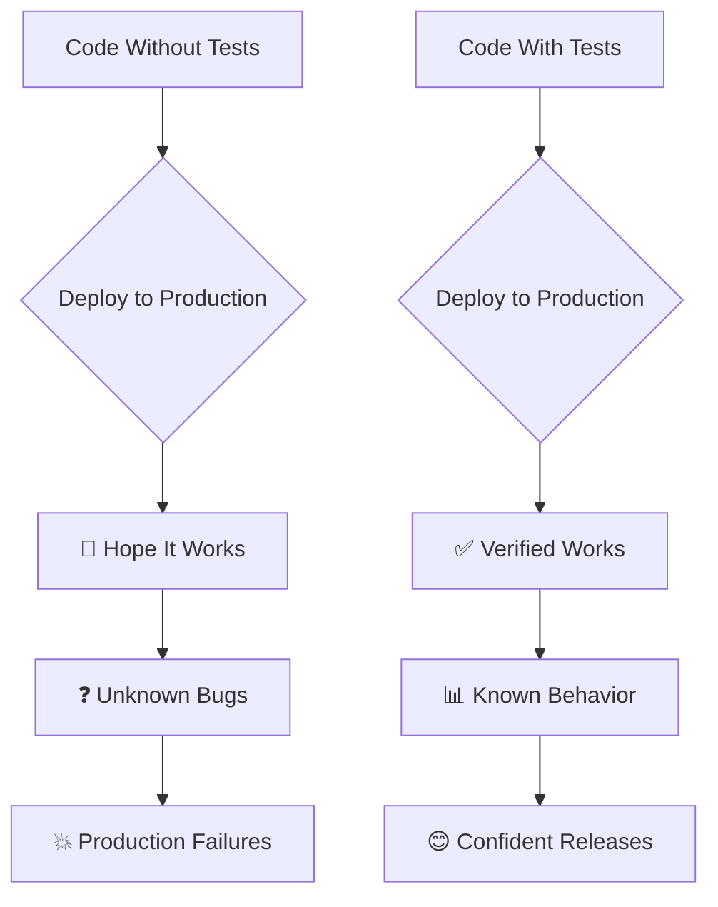
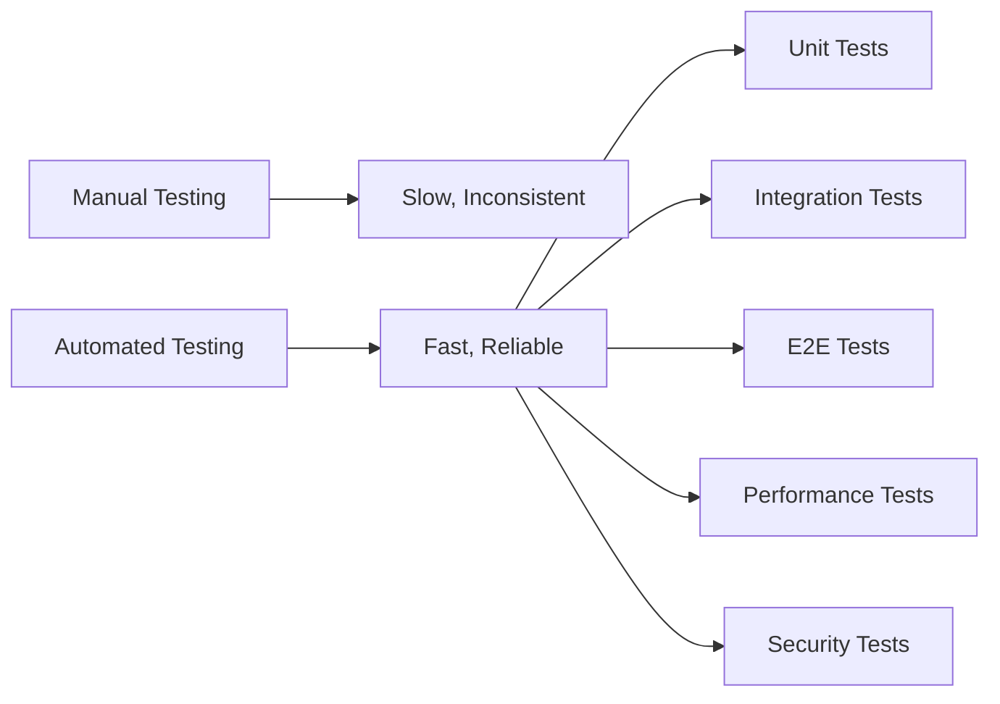
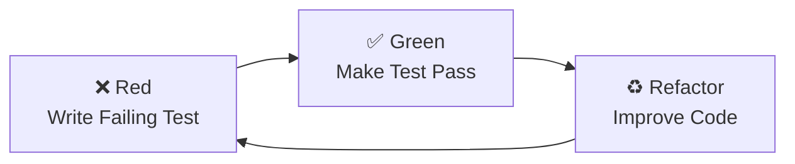
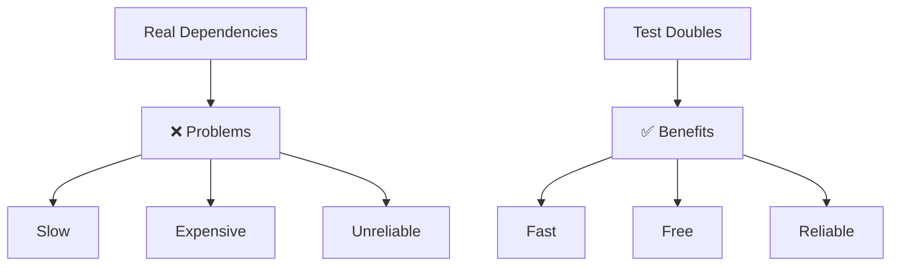
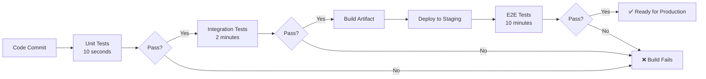

# **Tutorial 05: Testing Concepts** 🧪

**Master Testing Strategy Before Test Frameworks**

---

## **📋 Table of Contents**

1. [The Production Bug Nightmare](#1-the-production-bug-nightmare)
2. [What is Testing Really?](#2-what-is-testing-really)
3. [The Testing Pyramid](#3-the-testing-pyramid)
4. [Unit vs Integration vs E2E Tests](#4-unit-vs-integration-vs-e2e-tests)
5. [Test-Driven Development (TDD)](#5-test-driven-development-tdd)
6. [Mocking and Test Doubles](#6-mocking-and-test-doubles)
7. [Code Coverage vs Test Quality](#7-code-coverage-vs-test-quality)
8. [Testing in CI/CD](#8-testing-in-cicd)
9. [How Big Tech Tests](#9-how-big-tech-tests)
10. [Java Testing Ecosystem](#10-java-testing-ecosystem)
11. [Interview Questions & Answers](#11-interview-questions--answers)
12. [Hands-on Challenges](#12-hands-on-challenges)

---

## **1. The Production Bug Nightmare**

### **"It Worked On My Machine"** 💥

```
Friday 5:00 PM - Deployment to Production

Developer: "Tested locally, everything works!"
QA: "Passed all manual tests!"
Manager: "Great! Deploy to production."

*Deploy*

Friday 5:15 PM
☎️ Support: "Payment processing is down!"
☎️ Support: "Users can't checkout!"
☎️ Support: "We're losing $10,000 per minute!"

Developer: "But it worked on my machine!"
Manager: "What tests did you run?"
Developer: "I clicked through the UI... it worked!"

Root Cause Analysis:
❌ No automated tests
❌ No integration tests with real database
❌ No load testing
❌ No error scenario testing
❌ Relied on manual clicking

Bug: Payment service crashes when database 
     connection pool exhausted under load
     
Time to fix: 4 hours
Revenue lost: $240,000
Customer trust: Damaged
Weekend: Ruined
```

**Without Proper Testing:**
- 😱 Bugs found in production by customers
- 🤯 No confidence in deployments
- 💀 Fear-driven releases
- 🔥 Frequent rollbacks
- 😩 Weekend firefighting

**The Real Problem**: Treating testing as optional or someone else's job.

---

## **2. What is Testing Really?**

### **Beyond "Running JUnit"**

Testing is **risk mitigation** through automated verification.



### **What Tests Give You**

#### **1. Confidence**
```
With Tests:
  "I can refactor this code safely because tests 
   will catch if I break something"

Without Tests:
  "I'm afraid to touch this code. What if it breaks?"
```

#### **2. Documentation**
```java
@Test
public void shouldRejectPaymentWhenInsufficientFunds() {
    // This test DOCUMENTS the behavior:
    // System rejects payments when balance < amount
}
```

**Better than comments!** Tests prove the documentation is accurate.

#### **3. Fast Feedback**
```
Without Tests:
  Code → Manual Test → Find Bug → Fix → Repeat
  Cycle Time: Hours to Days

With Automated Tests:
  Code → Run Tests → Find Bug → Fix → Repeat
  Cycle Time: Seconds to Minutes
```

#### **4. Regression Prevention**
```
Bug found in production:
  1. Write failing test that reproduces bug
  2. Fix the code
  3. Test passes
  4. Bug can never come back (test catches it)
```

### **Types of Testing**



---

## **3. The Testing Pyramid**

### **The Concept**

```
           /\
          /  \         E2E Tests (Few)
         /____\        - Slow
        /      \       - Brittle
       /        \      - Expensive
      /__________\     
     /            \    Integration Tests (Some)
    /              \   - Medium speed
   /________________\  - Medium cost
  /                  \ 
 /                    \ Unit Tests (Many)
/______________________\ - Fast, Cheap, Stable

BASE = Many fast unit tests
MIDDLE = Some integration tests  
TOP = Few end-to-end tests
```

### **Why Pyramid Shape?**

```
Unit Tests (70%):
  ✅ Run in milliseconds
  ✅ Test single function/class
  ✅ No external dependencies
  ✅ Easy to debug
  ✅ Cheap to maintain
  
Integration Tests (20%):
  ✅ Test component interactions
  ✅ Verify database queries
  ✅ Check API contracts
  ⚠️ Slower (seconds)
  ⚠️ Need test database
  
E2E Tests (10%):
  ✅ Test complete user workflows
  ✅ Verify UI + Backend + Database
  ❌ Slow (minutes)
  ❌ Brittle (break easily)
  ❌ Hard to debug
```

### **Anti-Pattern: Ice Cream Cone** 🍦

```
  /______________________\  Many E2E tests (Bad!)
 /                        \ - Slow test suite
/                          \ - Brittle
\                          / - Expensive
 \                        /
  \                      /   Few unit tests (Bad!)
   \____________________/
```

**Problem:**
```
Test suite takes 2 hours to run
Breaks frequently due to UI changes
Developers skip running tests
Defeats the purpose!
```

---

## **4. Unit vs Integration vs E2E Tests**

### **Unit Tests** 🔬

**What**: Test single unit in isolation

**Example:**
```java
public class PaymentService {
    public boolean processPayment(Account account, int amount) {
        if (account.getBalance() < amount) {
            return false;  // Insufficient funds
        }
        account.deduct(amount);
        return true;
    }
}

// UNIT TEST
@Test
public void shouldRejectPaymentWhenInsufficientFunds() {
    // Arrange
    Account account = new Account(100);  // $100 balance
    PaymentService service = new PaymentService();
    
    // Act
    boolean result = service.processPayment(account, 200);  // Try $200
    
    // Assert
    assertFalse(result);
    assertEquals(100, account.getBalance());  // Balance unchanged
}
```

**Characteristics:**
- ✅ Tests logic only
- ✅ No database, no network
- ✅ Runs in milliseconds
- ✅ Easy to debug

### **Integration Tests** 🔗

**What**: Test components working together

**Example:**
```java
@SpringBootTest
public class PaymentIntegrationTest {
    
    @Autowired
    private PaymentService paymentService;
    
    @Autowired
    private AccountRepository accountRepository;
    
    @Test
    @Transactional
    public void shouldDeductFromDatabaseWhenPaymentSucceeds() {
        // Arrange - Create real account in test database
        Account account = new Account("user123", 1000);
        accountRepository.save(account);
        
        // Act - Call service (which hits real database)
        PaymentResult result = paymentService.processPayment("user123", 200);
        
        // Assert - Verify database updated
        assertTrue(result.isSuccess());
        
        Account updated = accountRepository.findById("user123").get();
        assertEquals(800, updated.getBalance());  // $1000 - $200
    }
}
```

**Characteristics:**
- ✅ Tests multiple components
- ✅ Uses test database
- ⚠️ Slower (seconds)
- ⚠️ Requires test infrastructure

### **End-to-End (E2E) Tests** 🎭

**What**: Test complete user journey

**Example:**
```java
@Test
public void userCanPurchaseProductAndReceiveConfirmation() {
    // Start browser
    WebDriver driver = new ChromeDriver();
    
    // 1. Login
    driver.get("https://app.example.com/login");
    driver.findElement(By.id("username")).sendKeys("testuser");
    driver.findElement(By.id("password")).sendKeys("password123");
    driver.findElement(By.id("login-btn")).click();
    
    // 2. Add product to cart
    driver.get("https://app.example.com/products/123");
    driver.findElement(By.id("add-to-cart")).click();
    
    // 3. Checkout
    driver.findElement(By.id("checkout-btn")).click();
    driver.findElement(By.id("card-number")).sendKeys("4111111111111111");
    driver.findElement(By.id("pay-btn")).click();
    
    // 4. Verify confirmation
    WebElement confirmation = driver.findElement(By.id("order-confirmation"));
    assertTrue(confirmation.isDisplayed());
    assertTrue(confirmation.getText().contains("Order #"));
    
    driver.quit();
}
```

**Characteristics:**
- ✅ Tests real user scenarios
- ✅ Catches integration issues
- ❌ Slow (minutes per test)
- ❌ Brittle (UI changes break tests)
- ❌ Hard to debug

### **Comparison**

| Aspect | Unit | Integration | E2E |
|--------|------|-------------|-----|
| **Speed** | Milliseconds | Seconds | Minutes |
| **Scope** | Single function | Multiple components | Full system |
| **Dependencies** | None (mocked) | Some (test DB) | All (real system) |
| **Flakiness** | Very stable | Stable | Can be flaky |
| **Debugging** | Easy | Medium | Hard |
| **Quantity** | 1000s | 100s | 10s |

---

## **5. Test-Driven Development (TDD)**

### **The TDD Cycle: Red-Green-Refactor** 🔴 🟢 ♻️



### **How TDD Works**

**Step 1: Red** ❌ - Write Test First
```java
@Test
public void shouldCalculateDiscountedPrice() {
    PricingService pricing = new PricingService();
    
    // Original: $100, Discount: 20%
    int result = pricing.applyDiscount(100, 20);
    
    assertEquals(80, result);  // Expect $80
}

// ❌ This test FAILS (PricingService doesn't exist yet)
```

**Step 2: Green** ✅ - Make It Pass
```java
public class PricingService {
    public int applyDiscount(int price, int discountPercent) {
        return price - (price * discountPercent / 100);
    }
}

// ✅ Test now PASSES
```

**Step 3: Refactor** ♻️ - Improve Code
```java
public class PricingService {
    
    private static final int PERCENT_MULTIPLIER = 100;
    
    public int applyDiscount(int price, int discountPercent) {
        validateInputs(price, discountPercent);
        return price - calculateDiscountAmount(price, discountPercent);
    }
    
    private int calculateDiscountAmount(int price, int discountPercent) {
        return price * discountPercent / PERCENT_MULTIPLIER;
    }
    
    private void validateInputs(int price, int discountPercent) {
        if (price < 0 || discountPercent < 0 || discountPercent > 100) {
            throw new IllegalArgumentException("Invalid inputs");
        }
    }
}

// ✅ Test still PASSES, code is better
```

### **Benefits of TDD**

```
1. Better Design
   - Forces you to think about API before implementation
   - Leads to more testable code
   
2. Complete Coverage
   - Every line written has a test
   - No untested code paths
   
3. Living Documentation
   - Tests show how to use the code
   - Always up to date
   
4. Fearless Refactoring
   - Change code confidently
   - Tests catch regressions
```

### **TDD vs Test-After**

**Test-After:**
```
Write Code → Hopefully Write Tests → Often Skip Tests
Result: 30-50% coverage, low confidence
```

**TDD:**
```
Write Test → Write Code → Refactor
Result: 90-100% coverage, high confidence
```

---

## **6. Mocking and Test Doubles**

### **The Problem**

```java
public class OrderService {
    private PaymentGateway paymentGateway;  // External service
    private EmailService emailService;      // External service
    private OrderRepository repository;     // Database
    
    public Order placeOrder(Order order) {
        // How to unit test this?
        // Don't want to:
        //   - Charge real credit cards
        //   - Send real emails
        //   - Hit real database
    }
}
```

### **Solution: Test Doubles**



### **Types of Test Doubles**

#### **1. Stub** - Returns Predefined Data
```java
public class StubPaymentGateway implements PaymentGateway {
    @Override
    public PaymentResult charge(String cardNumber, int amount) {
        // Always return success
        return new PaymentResult(true, "txn_123");
    }
}

@Test
public void testWithStub() {
    OrderService service = new OrderService(new StubPaymentGateway());
    
    Order order = service.placeOrder(new Order(100));
    
    assertTrue(order.isPaid());
}
```

#### **2. Mock** - Verifies Interactions
```java
@Test
public void shouldChargeCorrectAmount() {
    // Create mock
    PaymentGateway mockGateway = Mockito.mock(PaymentGateway.class);
    when(mockGateway.charge(anyString(), eq(100)))
        .thenReturn(new PaymentResult(true, "txn_123"));
    
    OrderService service = new OrderService(mockGateway);
    
    // Execute
    service.placeOrder(new Order(100));
    
    // Verify interaction
    verify(mockGateway).charge(anyString(), eq(100));
    // ✅ Ensures charge() was called with correct amount
}
```

#### **3. Spy** - Partial Mock
```java
@Test
public void testWithSpy() {
    OrderService realService = new OrderService();
    OrderService spy = Mockito.spy(realService);
    
    // Override only one method
    doReturn(true).when(spy).validateInventory(any());
    
    // Other methods use real implementation
    spy.placeOrder(new Order(100));
}
```

#### **4. Fake** - Working Implementation
```java
public class FakeOrderRepository implements OrderRepository {
    private Map<Long, Order> orders = new HashMap<>();
    
    @Override
    public void save(Order order) {
        orders.put(order.getId(), order);
    }
    
    @Override
    public Order findById(Long id) {
        return orders.get(id);
    }
}

// Fast, in-memory, no database needed
```

### **When to Use What**

```
Stub:
  Use when you need data returned
  Example: External API returning product info

Mock:
  Use when verifying method calls
  Example: Email service - verify email sent

Spy:
  Use when testing partial behavior
  Example: Override one method, use rest

Fake:
  Use for simple in-memory replacement
  Example: In-memory database for tests
```

---

## **7. Code Coverage vs Test Quality**

### **The Coverage Trap**

```
Manager: "We need 100% code coverage!"
Developer: *writes tests to hit lines, not test logic*

Result:
  ✅ 100% coverage
  ❌ Still have bugs in production
```

### **Coverage Metrics**

```java
public class Calculator {
    public int divide(int a, int b) {
        if (b == 0) {
            throw new ArithmeticException("Division by zero");
        }
        return a / b;
    }
}

// BAD TEST - 100% coverage but doesn't test logic
@Test
public void testDivide() {
    Calculator calc = new Calculator();
    calc.divide(10, 2);  // Just call it
    // No assertions! ❌
}

// GOOD TEST - Tests actual behavior
@Test
public void shouldDivideNumbersCorrectly() {
    Calculator calc = new Calculator();
    assertEquals(5, calc.divide(10, 2));
}

@Test
public void shouldThrowExceptionWhenDividingByZero() {
    Calculator calc = new Calculator();
    assertThrows(ArithmeticException.class, () -> {
        calc.divide(10, 0);
    });
}
```

### **Coverage Metrics Explained**

```
Line Coverage:
  Lines executed / Total lines
  Example: 90% = 90 out of 100 lines executed

Branch Coverage:
  Branches taken / Total branches
  Example: 80% = 8 out of 10 if/else branches tested

Statement Coverage:
  Statements executed / Total statements

Path Coverage:
  Execution paths tested / Total paths
  (Most comprehensive, hardest to achieve)
```

### **The Right Goal**

```
❌ Wrong Goal:
  100% code coverage

✅ Right Goal:
  - Test critical business logic: 100%
  - Test error handling: 100%
  - Test edge cases: 80%+
  - Focus on behavior, not lines
```

**Quality Over Quantity:**
```
10 tests that verify critical behavior > 100 tests that hit lines
```

---

## **8. Testing in CI/CD**

### **Test Automation Pipeline**



### **Fast Feedback Loop**

```
Strategy: Fail Fast

1. Run fastest tests first (unit tests)
   → If they fail, stop immediately
   → Developer gets feedback in seconds
   
2. Then run slower tests (integration)
   → Only if unit tests pass
   → Feedback in minutes
   
3. Finally run slowest tests (E2E)
   → Only if everything else passes
   → Feedback in 10-15 minutes

vs Running all tests in parallel:
   → Wait 15 minutes to find out unit test failed
   → Wasted 14.99 minutes
```

### **Test Parallelization**

```yaml
# GitHub Actions example
jobs:
  unit-tests:
    runs-on: ubuntu-latest
    steps:
      - run: mvn test
      - time: ~10 seconds
      
  integration-tests:
    runs-on: ubuntu-latest
    needs: unit-tests  # Only after unit tests pass
    strategy:
      matrix:
        test-suite: [database, api, messaging]
    steps:
      - run: mvn verify -Dtest=${{ matrix.test-suite }}
      - time: ~2 minutes (parallel)
      
  e2e-tests:
    needs: integration-tests
    strategy:
      matrix:
        browser: [chrome, firefox, safari]
    steps:
      - run: npm run e2e --browser=${{ matrix.browser }}
      - time: ~10 minutes (parallel across browsers)
```

### **Test Environments**

```
Local:
  - Developer machine
  - Fast feedback
  - Subset of tests

CI:
  - Every commit
  - All unit + integration tests
  - Code coverage reporting

Staging:
  - Before production
  - Full E2E test suite
  - Performance tests
  - Security scans

Production:
  - Smoke tests after deployment
  - Health checks
  - Monitoring alerts
```

---

## **9. How Big Tech Tests**

### **Google** 🔍

```
Test Philosophy: "Test at the appropriate level"

Scale:
  - 150+ million tests run per day
  - 75% unit, 20% integration, 5% E2E
  - Average test: 100 milliseconds

Culture:
  - Code review requires tests
  - Coverage tracked per team
  - Flaky test detection automated
  - Test ownership enforced
```

**Key Practice: Small Tests**
```
Small Test:
  - Runs in process
  - No external calls
  - Deterministic
  - < 60 seconds
  
Medium Test:
  - Can hit localhost services
  - < 5 minutes
  
Large Test:
  - Can call external services
  - < 15 minutes
```

### **Facebook** 📘

```
Testing Approach: Continuous Testing

Pipeline:
  - Commit → Test within 10 minutes
  - Deploy to 1% users (canary)
  - Monitor metrics
  - Gradual rollout if tests pass

Innovation:
  - Screenshot testing for UI
  - A/B testing framework
  - Automated rollback on test failures
```

### **Netflix** 🎬

```
Philosophy: Chaos Engineering + Testing

Strategy:
  - Unit tests for business logic
  - Integration tests for services
  - Chaos Monkey in production (!)
    → Randomly kills services
    → Tests resilience
  
Monitoring as Testing:
  - Synthetic transactions
  - Real user monitoring
  - Alert on anomalies
```

### **Amazon** 📦

```
Testing Culture: "You build it, you test it"

Practices:
  - Developers write all tests
  - Automated deployment pipeline
  - Canary deployments (1% → 10% → 50% → 100%)
  - Rollback on any metric regression

Scale:
  - Deploy every 11.6 seconds
  - Requires extensive automation
```

---

## **10. Java Testing Ecosystem**

### **Testing Stack**

```
Testing Layers:

Unit Testing:
  - JUnit 5 (Jupiter)
  - AssertJ (fluent assertions)
  - Mockito (mocking)

Integration Testing:
  - Spring Boot Test
  - Testcontainers (Docker containers in tests)
  - H2 (in-memory database)

E2E Testing:
  - Selenium (browser automation)
  - RestAssured (API testing)
  - WireMock (HTTP mocking)

Performance Testing:
  - JMeter
  - Gatling
```

### **Spring Boot Test Example**

```java
@SpringBootTest
@AutoConfigureMockMvc
public class PaymentControllerIntegrationTest {
    
    @Autowired
    private MockMvc mockMvc;
    
    @MockBean  // Mock external service
    private StripeService stripeService;
    
    @Autowired
    private PaymentRepository paymentRepository;
    
    @Test
    @Transactional
    public void shouldProcessPaymentSuccessfully() throws Exception {
        // Arrange - Mock external service
        when(stripeService.charge(any(), anyInt()))
            .thenReturn(new ChargeResult(true, "ch_123"));
        
        // Act - Make HTTP request
        mockMvc.perform(post("/api/payments")
                .contentType(MediaType.APPLICATION_JSON)
                .content("{\"amount\": 1000, \"card\": \"tok_visa\"}"))
                
                // Assert - Verify response
                .andExpect(status().isOk())
                .andExpect(jsonPath("$.success").value(true))
                .andExpect(jsonPath("$.chargeId").value("ch_123"));
        
        // Assert - Verify database
        List<Payment> payments = paymentRepository.findAll();
        assertEquals(1, payments.size());
        assertEquals(1000, payments.get(0).getAmount());
    }
}
```

### **Testcontainers Example**

```java
@SpringBootTest
@Testcontainers
public class PaymentRepositoryTest {
    
    @Container
    static PostgreSQLContainer<?> postgres = new PostgreSQLContainer<>("postgres:14")
        .withDatabaseName("testdb")
        .withUsername("test")
        .withPassword("test");
    
    @DynamicPropertySource
    static void configureProperties(DynamicPropertyRegistry registry) {
        registry.add("spring.datasource.url", postgres::getJdbcUrl);
        registry.add("spring.datasource.username", postgres::getUsername);
        registry.add("spring.datasource.password", postgres::getPassword);
    }
    
    @Autowired
    private PaymentRepository repository;
    
    @Test
    public void shouldSavePaymentToRealPostgres() {
        // Uses real PostgreSQL running in Docker
        Payment payment = new Payment(1000, "tok_visa");
        Payment saved = repository.save(payment);
        
        assertNotNull(saved.getId());
        assertEquals(1000, saved.getAmount());
    }
}
```

---

## **11. Interview Questions & Answers**

### **Q1: Explain the testing pyramid**

**❌ Bad Answer:**
"It's about having more unit tests than integration tests."

**✅ Good Answer:**
"The testing pyramid is a strategy that advocates for a base of many fast, isolated unit tests, a smaller layer of integration tests, and a minimal top layer of end-to-end tests. This shape is optimal because unit tests are fast, stable, and easy to debug, giving quick feedback. Integration tests verify components work together but are slower. E2E tests validate complete workflows but are slow, brittle, and expensive to maintain. The pyramid ensures we get maximum coverage with minimum cost and time."

**Follow-up:**
"The anti-pattern is the ice cream cone, where teams have many slow E2E tests and few unit tests, leading to slow feedback loops and brittle test suites that developers avoid running."

---

### **Q2: What's the difference between mocks and stubs?**

**❌ Bad Answer:**
"They're the same thing—fake objects for testing."

**✅ Good Answer:**
"Stubs and mocks are both test doubles, but serve different purposes. A stub provides predefined responses to method calls—it's about data. For example, a stub payment gateway always returns success. A mock verifies that specific interactions occurred—it's about behavior. For instance, a mock verifies that the email service's send() method was called with the correct parameters. In practice, I use stubs when I need data returned, and mocks when I need to verify a side effect happened."

**Example:**
"Testing an order service: I'd stub the product catalog to return test products, but mock the email service to verify a confirmation email was sent with the right order details."

---

### **Q3: How do you handle flaky tests?**

**❌ Bad Answer:**
"Just retry them until they pass."

**✅ Good Answer:**
"Flaky tests are tests that randomly pass or fail without code changes, and they're a serious problem that erodes trust. My approach: First, identify the root cause—common culprits are timing issues, shared state, or external dependencies. For timing, I use explicit waits instead of sleeps. For shared state, I ensure tests are isolated and can run in any order. For external dependencies, I use mocks or contract testing. If a test is consistently flaky and hard to fix, I either delete it or demote it to a separate suite that doesn't block builds. The goal is a trustworthy test suite where failures always mean real problems."

---

### **Q4: Is 100% code coverage necessary?**

**❌ Bad Answer:**
"Yes, always aim for 100%."

**✅ Good Answer:**
"Code coverage is a useful metric but not a goal in itself. High coverage doesn't guarantee quality—you can have 100% coverage with tests that don't assert anything meaningful. I focus on testing critical business logic, error handling, and edge cases thoroughly. In practice, 70-80% coverage with well-designed tests is better than 100% coverage with poor tests. Some code, like simple getters/setters or framework boilerplate, may not need explicit tests. I use coverage to identify untested areas, but I prioritize test quality over hitting a specific percentage."

---

## **12. Hands-on Challenges**

### **Challenge 1: Test Pyramid Audit** 📊

**Scenario:**
```
Your test suite:
  - 50 unit tests (run in 5 seconds)
  - 200 integration tests (run in 20 minutes)
  - 300 E2E tests (run in 2 hours)

Total test time: 2 hours 20 minutes
Developers skip running tests locally
CI pipeline times out
```

**Task:** Fix the test pyramid

<details>
<summary>💡 Solution</summary>

**Analysis: Inverted Pyramid (Ice Cream Cone!)**
```
Current:
  E2E: 300 tests (54%)
  Integration: 200 tests (36%)
  Unit: 50 tests (9%)

Target:
  E2E: 50 tests (9%)
  Integration: 150 tests (27%)
  Unit: 350 tests (64%)
```

**Refactoring Strategy:**

**1. Convert E2E to Integration Tests (250 tests)**
```java
// Before: E2E test
@Test
public void testCheckoutFlow() {
    // Start browser, login, add to cart, checkout
    // Time: 2 minutes
}

// After: Integration test
@Test
@SpringBootTest
public void shouldProcessCheckout() {
    // Direct API calls, no browser
    // Time: 2 seconds
}
```

**2. Convert Integration to Unit Tests (100 tests)**
```java
// Before: Integration test
@Test
@SpringBootTest
public void testPriceCalculation() {
    // Loads entire Spring context
    // Time: 5 seconds
}

// After: Unit test
@Test
public void shouldCalculateDiscountedPrice() {
    PricingService service = new PricingService();
    assertEquals(80, service.applyDiscount(100, 20));
    // Time: 10 milliseconds
}
```

**3. Keep Critical E2E Tests (50 tests)**
```
Focus on:
  - Happy path user journeys
  - Critical business flows
  - Cross-browser compatibility
  
Example: Login → Search → Add to Cart → Checkout
```

**Result:**
```
New test suite:
  - 350 unit tests: 35 seconds
  - 150 integration tests: 5 minutes
  - 50 E2E tests: 20 minutes

Total: ~25 minutes (94% faster!)

Developers now run tests locally
CI pipeline completes quickly
```

</details>

**XP: +75** 🏆

---

### **Challenge 2: Write TDD Style** 🔴🟢♻️

**Scenario:**
Implement a simple shopping cart discount calculator:
- Regular price: $100
- 10% discount for orders > $500
- 20% discount for orders > $1000
- Free shipping for orders > $2000

**Task:** Write tests first, then implement

<details>
<summary>💡 Solution</summary>

**Step 1: Red** - Write Failing Tests

```java
public class DiscountCalculatorTest {
    
    @Test
    public void shouldReturnFullPriceForSmallOrders() {
        DiscountCalculator calc = new DiscountCalculator();
        assertEquals(100, calc.calculate(100));
        assertEquals(400, calc.calculate(400));
    }
    
    @Test
    public void shouldApply10PercentDiscountForOrdersOver500() {
        DiscountCalculator calc = new DiscountCalculator();
        assertEquals(540, calc.calculate(600));  // $600 - 10% = $540
    }
    
    @Test
    public void shouldApply20PercentDiscountForOrdersOver1000() {
        DiscountCalculator calc = new DiscountCalculator();
        assertEquals(960, calc.calculate(1200));  // $1200 - 20% = $960
    }
    
    @Test
    public void shouldApplyFreeShippingForOrdersOver2000() {
        DiscountCalculator calc = new DiscountCalculator();
        DiscountResult result = calc.calculateWithShipping(2500);
        assertEquals(2000, result.getTotal());  // $2500 - 20% = $2000
        assertTrue(result.hasFreeShipping());
    }
}

// ❌ All tests FAIL (class doesn't exist)
```

**Step 2: Green** - Make Tests Pass

```java
public class DiscountCalculator {
    
    private static final int TIER1_THRESHOLD = 500;
    private static final int TIER2_THRESHOLD = 1000;
    private static final int FREE_SHIPPING_THRESHOLD = 2000;
    
    private static final double TIER1_DISCOUNT = 0.10;
    private static final double TIER2_DISCOUNT = 0.20;
    
    public int calculate(int amount) {
        double discount = getDiscountRate(amount);
        return (int) (amount * (1 - discount));
    }
    
    public DiscountResult calculateWithShipping(int amount) {
        int discounted = calculate(amount);
        boolean freeShipping = amount > FREE_SHIPPING_THRESHOLD;
        return new DiscountResult(discounted, freeShipping);
    }
    
    private double getDiscountRate(int amount) {
        if (amount > TIER2_THRESHOLD) {
            return TIER2_DISCOUNT;
        } else if (amount > TIER1_THRESHOLD) {
            return TIER1_DISCOUNT;
        }
        return 0;
    }
}

public class DiscountResult {
    private final int total;
    private final boolean freeShipping;
    
    public DiscountResult(int total, boolean freeShipping) {
        this.total = total;
        this.freeShipping = freeShipping;
    }
    
    public int getTotal() { return total; }
    public boolean hasFreeShipping() { return freeShipping; }
}

// ✅ All tests PASS
```

**Step 3: Refactor** - Improve (tests still pass)

```java
public class DiscountCalculator {
    
    private final List<DiscountTier> tiers = List.of(
        new DiscountTier(1000, 0.20),
        new DiscountTier(500, 0.10)
    );
    
    private static final int FREE_SHIPPING_THRESHOLD = 2000;
    
    public int calculate(int amount) {
        double discount = tiers.stream()
            .filter(tier -> amount > tier.threshold)
            .map(tier -> tier.rate)
            .findFirst()
            .orElse(0.0);
            
        return (int) (amount * (1 - discount));
    }
    
    public DiscountResult calculateWithShipping(int amount) {
        return new DiscountResult(
            calculate(amount),
            amount > FREE_SHIPPING_THRESHOLD
        );
    }
    
    private record DiscountTier(int threshold, double rate) {}
}

// ✅ Tests still PASS, code is cleaner and extensible
```

**Benefits of TDD Here:**
- Tests written first forced good API design
- 100% coverage by default
- Easy to add new tiers (just add to list)
- Refactored confidently with test safety net

</details>

**XP: +60** 🏆

---

### **Challenge 3: Mock vs Stub Decision** 🎭

**Scenario:**
```java
public class OrderService {
    private PaymentGateway paymentGateway;
    private EmailService emailService;
    private InventoryService inventoryService;
    
    public OrderResult placeOrder(Order order) {
        // 1. Check inventory
        boolean available = inventoryService.checkStock(order.getProductId());
        
        // 2. Process payment
        PaymentResult payment = paymentGateway.charge(order.getTotal());
        
        // 3. Send confirmation email
        emailService.sendConfirmation(order.getCustomerEmail(), order.getId());
        
        return new OrderResult(payment.isSuccess());
    }
}
```

**Task:** For each dependency, decide mock or stub and why

<details>
<summary>💡 Solution</summary>

**Analysis:**

**1. InventoryService → STUB**
```java
// Why: Need data returned (stock availability)
// Don't care HOW it's called, just need response

@Test
public void testWithStubInventory() {
    InventoryService stubInventory = Mockito.mock(InventoryService.class);
    when(stubInventory.checkStock(anyString())).thenReturn(true);
    
    // Just need it to return data, no verification needed
}
```

**2. PaymentGateway → STUB + MOCK**
```java
// STUB: Need payment result
// MOCK: Verify correct amount charged

@Test
public void shouldChargeCorrectAmount() {
    PaymentGateway mockGateway = Mockito.mock(PaymentGateway.class);
    
    // Stub behavior
    when(mockGateway.charge(100))
        .thenReturn(new PaymentResult(true, "txn_123"));
    
    OrderService service = new OrderService(null, mockGateway, null);
    service.placeOrder(new Order(100));
    
    // Mock verification
    verify(mockGateway).charge(100);  // Verify exact amount
}
```

**3. EmailService → MOCK**
```java
// Why: Email is side effect, need to verify it happened
// Don't care about return value, care THAT it was called

@Test
public void shouldSendConfirmationEmail() {
    EmailService mockEmail = Mockito.mock(EmailService.class);
    
    OrderService service = new OrderService(null, null, mockEmail);
    Order order = new Order("customer@example.com");
    service.placeOrder(order);
    
    // Verify email sent with correct parameters
    verify(mockEmail).sendConfirmation(
        eq("customer@example.com"),
        eq(order.getId())
    );
}
```

**Complete Test:**
```java
@Test
public void shouldPlaceOrderSuccessfully() {
    // Stub - Returns data
    InventoryService stubInventory = mock(InventoryService.class);
    when(stubInventory.checkStock(anyString())).thenReturn(true);
    
    // Stub + Mock - Returns data AND verify behavior
    PaymentGateway mockPayment = mock(PaymentGateway.class);
    when(mockPayment.charge(100))
        .thenReturn(new PaymentResult(true, "txn_123"));
    
    // Mock - Verify side effect
    EmailService mockEmail = mock(EmailService.class);
    
    // System under test
    OrderService service = new OrderService(
        stubInventory,
        mockPayment,
        mockEmail
    );
    
    // Execute
    Order order = new Order("customer@example.com", "product_1", 100);
    OrderResult result = service.placeOrder(order);
    
    // Assertions
    assertTrue(result.isSuccess());
    
    // Verifications (mocks)
    verify(mockPayment).charge(100);
    verify(mockEmail).sendConfirmation(
        "customer@example.com",
        order.getId()
    );
    
    // No verification for stub (don't care how it was called)
}
```

**Decision Framework:**
```
Use STUB when:
  ✓ Need data returned
  ✓ Don't care about interaction
  ✓ Example: Database query, API call

Use MOCK when:
  ✓ Verify interaction happened
  ✓ Check parameters passed
  ✓ Example: Email sent, event published, audit logged

Use BOTH when:
  ✓ Need data AND verify behavior
  ✓ Example: Payment processed (need result + verify amount)
```

</details>

**XP: +65** 🏆

---

## **🎓 Summary: Testing Mastery**

### **Key Takeaways**

1. **Testing Pyramid** - Many unit, some integration, few E2E
2. **TDD** - Write tests first for better design
3. **Test Doubles** - Stub for data, mock for behavior
4. **Coverage** - Quality over quantity, focus on critical paths
5. **CI/CD** - Fast feedback with automated test pipelines
6. **Real Testing** - Big tech invests heavily in test infrastructure

### **Interview Sound Bites**

```
"The testing pyramid guides us to have many fast unit tests,
 some integration tests, and few E2E tests. This maximizes
 coverage while minimizing cost and time."

"TDD isn't just writing tests first—it's a design technique
 that forces you to think about your API before implementation,
 leading to more testable and better-designed code."

"Code coverage measures lines executed, not quality. I focus
 on testing critical business logic and edge cases thoroughly
 rather than chasing a specific percentage."
```

---

**Achievement Unlocked**: 🏆 **Testing Master** (+500 XP)

You understand testing strategy, not just testing frameworks!

---

**Next**: [06: Deployment Strategies →](06_Deployment_Strategies.md)

**Related**: 
- [04: CI/CD Pipeline Concepts](04_CI_CD_Pipeline_Concepts.md)
- [13: DevSecOps Concepts](13_DevSecOps_Concepts.md)

---

**Total XP Available**: +200 from challenges, +500 achievement = **+700 XP** 🚀
