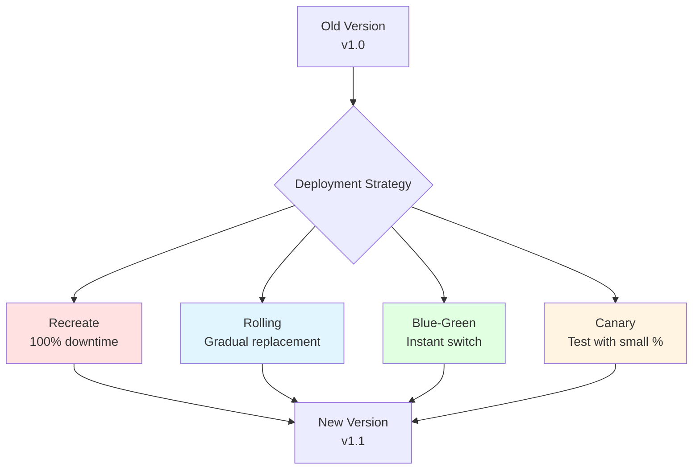
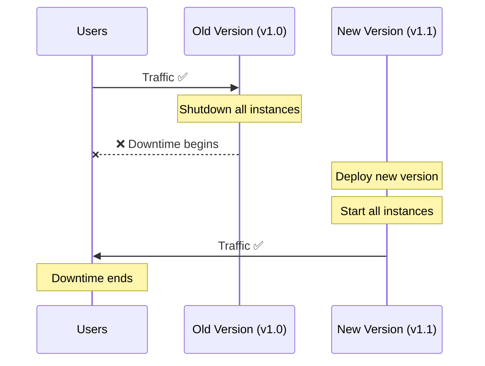
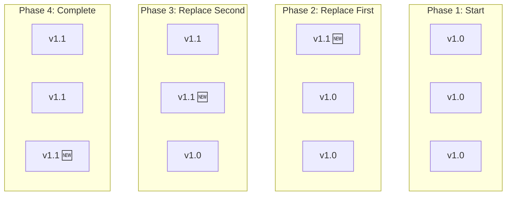
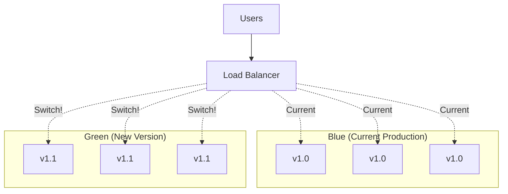
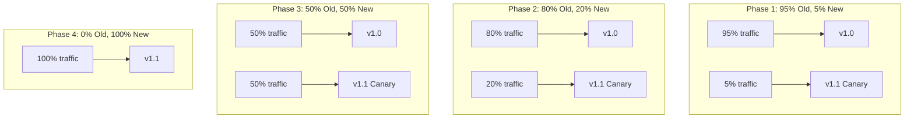
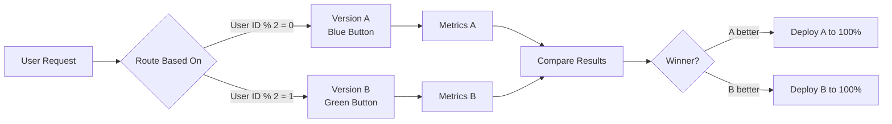
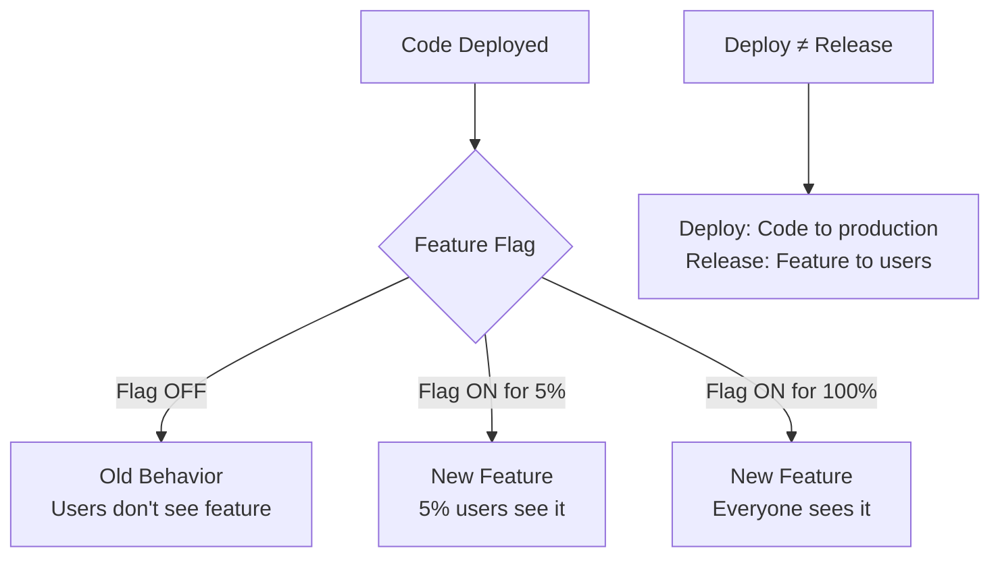
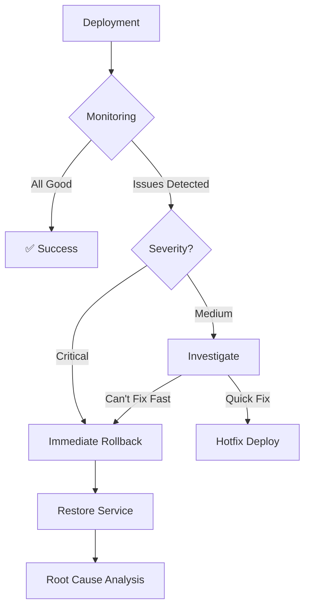

# **Tutorial 06: Deployment Strategies** 🚀

**Master Deployment Patterns Before kubectl/helm**

---

## **📋 Table of Contents**

1. [The Deployment Disaster](#1-the-deployment-disaster)
2. [What is a Deployment Strategy?](#2-what-is-a-deployment-strategy)
3. [Recreate Deployment](#3-recreate-deployment)
4. [Rolling Deployment](#4-rolling-deployment)
5. [Blue-Green Deployment](#5-blue-green-deployment)
6. [Canary Deployment](#6-canary-deployment)
7. [A/B Testing Deployment](#7-ab-testing-deployment)
8. [Feature Flags & Dark Launches](#8-feature-flags--dark-launches)
9. [Rollback Strategies](#9-rollback-strategies)
10. [How Big Tech Deploys](#10-how-big-tech-deploys)
11. [Interview Questions & Answers](#11-interview-questions--answers)
12. [Hands-on Challenges](#12-hands-on-challenges)

---

## **1. The Deployment Disaster**

### **Friday Night Production Deploy** 💥

```
Friday 4:00 PM - Release Meeting

Manager: "We're deploying the new payment feature tonight"
Developer: "All tests passed, we're ready!"
Ops: "Okay, I'll take down the old version and deploy the new one"

Friday 6:00 PM - Deployment Starts

Ops: "Shutting down all 50 servers..."
*All instances stop*
*Begins deploying new version*

Friday 6:15 PM - Disaster Strikes

🔥 Deployment script fails at server 25
🔥 Database migration didn't run correctly
🔥 New code can't connect to database
🔥 Old code is gone

Result:
  ❌ Website completely down
  ❌ Zero users can access the site
  ❌ 100% downtime
  
Support Calls:
  "Your site is down!"
  "I was in the middle of checkout!"
  "I lost my shopping cart!"
  
Revenue Lost: $50,000 per hour
Social Media: #YourCompanyIsDown trending

Friday 6:30 PM - Panic Mode

Manager: "Roll back! Roll back!"
Ops: "Can't! Old version deleted!"
Developer: "The database schema changed!"
Ops: "We need to debug in production..."

Friday 11:00 PM - Finally Fixed
  ↓ 5 hours of downtime
  ↓ $250,000 revenue lost
  ↓ Customer trust damaged
  ↓ Team exhausted
  
Manager: "Why didn't we have a better deployment strategy?!"
```

**Without Deployment Strategy:**
- 😱 All-or-nothing deployments
- 🤯 Complete downtime
- 💀 No rollback plan
- 🔥 Production debugging
- 😩 Weekend emergencies

**The Real Problem**: Treating deployment as "turn off old, turn on new."

---

## **2. What is a Deployment Strategy?**

### **Beyond "kubectl apply"**

A deployment strategy is your **plan for safely transitioning from version N to version N+1** with minimal risk and downtime.



### **Key Questions Every Strategy Answers**

```
1. Downtime?
   - How long will users be affected?
   - Can we achieve zero downtime?

2. Rollback Speed?
   - How fast can we revert if something breaks?
   - What's the blast radius?

3. Risk?
   - How many users exposed to new version?
   - Can we test in production safely?

4. Complexity?
   - Infrastructure requirements?
   - Operational overhead?

5. Cost?
   - Extra resources needed?
   - Worth the tradeoff?
```

### **Strategy Selection Matrix**

| Strategy | Downtime | Rollback | Risk | Complexity | Cost |
|----------|----------|----------|------|------------|------|
| **Recreate** | High | Slow | High | Low | Low |
| **Rolling** | None | Medium | Medium | Medium | Low |
| **Blue-Green** | None | Instant | Medium | Medium | High |
| **Canary** | None | Fast | Low | High | Medium |
| **A/B Test** | None | Instant | Low | High | Medium |

---

## **3. Recreate Deployment**

### **The "Turn It Off and On Again" Strategy**



### **How It Works**

```
Step 1: Stop ALL old instances
  v1.0 server-1: ❌ Stopped
  v1.0 server-2: ❌ Stopped
  v1.0 server-3: ❌ Stopped
  
  ⚠️ 100% DOWNTIME

Step 2: Deploy new version
  v1.1 server-1: 🔄 Deploying
  v1.1 server-2: 🔄 Deploying
  v1.1 server-3: 🔄 Deploying

Step 3: Start new instances
  v1.1 server-1: ✅ Running
  v1.1 server-2: ✅ Running
  v1.1 server-3: ✅ Running
  
  ✅ Service restored
```

### **Kubernetes Example**

```yaml
apiVersion: apps/v1
kind: Deployment
metadata:
  name: payment-service
spec:
  replicas: 3
  strategy:
    type: Recreate  # All pods replaced at once
  template:
    spec:
      containers:
      - name: payment
        image: payment-service:1.1.0
```

**Deployment Process:**
```
$ kubectl apply -f deployment.yaml

1. Kubernetes terminates all 3 old pods
2. Waits for termination to complete
3. Creates 3 new pods with v1.1.0
4. Waits for new pods to be ready
5. Routes traffic to new pods

Downtime: ~2-5 minutes
```

### **When to Use**

```
✅ Good For:
  - Development/staging environments
  - Internal tools with scheduled maintenance
  - When database migrations require downtime
  - Small applications where downtime acceptable

❌ Bad For:
  - Customer-facing applications
  - 24/7 services
  - High-availability requirements
  - E-commerce sites
```

### **Real Example: Internal Admin Panel**

```
Scenario: Company admin panel for HR

Traffic Pattern:
  - Used 9 AM - 5 PM
  - No usage nights/weekends
  
Deployment Window:
  - Saturday 2 AM
  - 10-minute downtime acceptable
  
Strategy: Recreate
  ✅ Simple
  ✅ Zero cost
  ✅ No complexity
  ✅ Downtime doesn't matter
```

**Pros:**
- ✅ Simplest strategy
- ✅ Easy to understand
- ✅ No extra infrastructure
- ✅ Application state reset

**Cons:**
- ❌ Downtime (100%)
- ❌ Slow rollback (redeploy old version)
- ❌ All users affected
- ❌ Not suitable for production

---

## **4. Rolling Deployment**

### **The "One at a Time" Strategy**



### **How It Works**

```
Start: 3 instances running v1.0
  [v1.0] [v1.0] [v1.0]  ← 100% old
  
Step 1: Deploy to 1 instance
  [v1.1] [v1.0] [v1.0]  ← 33% new, 67% old
  ↓ Verify it works
  
Step 2: Deploy to another instance
  [v1.1] [v1.1] [v1.0]  ← 67% new, 33% old
  ↓ Verify it works
  
Step 3: Deploy to final instance
  [v1.1] [v1.1] [v1.1]  ← 100% new
  ✅ Deployment complete

Downtime: ZERO
Users: Some hit v1.0, some hit v1.1 during rollout
```

### **Kubernetes Example**

```yaml
apiVersion: apps/v1
kind: Deployment
metadata:
  name: payment-service
spec:
  replicas: 10
  strategy:
    type: RollingUpdate
    rollingUpdate:
      maxUnavailable: 1     # Max pods down during update
      maxSurge: 1           # Max extra pods during update
  template:
    spec:
      containers:
      - name: payment
        image: payment-service:1.1.0
        readinessProbe:     # Critical!
          httpGet:
            path: /health
            port: 8080
          initialDelaySeconds: 10
          periodSeconds: 5
```

**Deployment Process:**
```
Initial: 10 pods running v1.0

Step 1: Create 1 new pod (maxSurge=1)
  v1.0: 10 pods
  v1.1: 1 pod (starting)
  Total: 11 pods

Step 2: New pod ready, kill 1 old pod (maxUnavailable=1)
  v1.0: 9 pods
  v1.1: 1 pod (ready)
  Total: 10 pods

Step 3: Create another new pod
  v1.0: 9 pods
  v1.1: 2 pods (1 ready, 1 starting)
  Total: 11 pods

Repeat until all pods replaced...

Final: 10 pods running v1.1
```

### **Configuration Options**

```yaml
# Slow and safe (one at a time)
maxUnavailable: 1
maxSurge: 1

# Faster (2 at a time)
maxUnavailable: 2
maxSurge: 2

# Ultra-safe (no capacity loss)
maxUnavailable: 0
maxSurge: 3  # Add new first, then remove old

# Aggressive (faster but riskier)
maxUnavailable: 50%
maxSurge: 50%
```

### **Real Example: E-commerce API**

```
Service: Product Catalog API
Instances: 20 servers
Strategy: Rolling Update

Configuration:
  maxUnavailable: 2  (10% at a time)
  maxSurge: 2
  
Deployment Timeline:
  0:00 - Start: 20 × v1.0
  0:30 - 2 × v1.1, 18 × v1.0
  1:00 - 4 × v1.1, 16 × v1.0
  2:00 - 8 × v1.1, 12 × v1.0
  3:00 - 12 × v1.1, 8 × v1.0
  4:00 - 16 × v1.1, 4 × v1.0
  4:30 - 18 × v1.1, 2 × v1.0
  5:00 - Complete: 20 × v1.1

Total Time: 5 minutes
Downtime: ZERO
Capacity: 90-100% throughout
```

### **Health Checks Are Critical**

```java
@RestController
public class HealthController {
    
    @GetMapping("/health/readiness")
    public ResponseEntity<String> readiness() {
        // Check if service is ready to receive traffic
        if (databaseConnected() && warmupComplete()) {
            return ResponseEntity.ok("Ready");
        }
        return ResponseEntity.status(503).body("Not Ready");
    }
    
    @GetMapping("/health/liveness")
    public ResponseEntity<String> liveness() {
        // Check if service is alive (don't kill it)
        if (applicationRunning()) {
            return ResponseEntity.ok("Alive");
        }
        return ResponseEntity.status(503).body("Dead");
    }
}
```

**Why Critical:**
```
Without Health Checks:
  Kubernetes thinks pod is ready immediately
  Routes traffic to pod still starting up
  Users get errors

With Health Checks:
  Kubernetes waits for /health to return 200
  Only routes traffic when service truly ready
  Zero errors during deployment
```

**Pros:**
- ✅ Zero downtime
- ✅ Gradual rollout
- ✅ Early issue detection
- ✅ Resource efficient

**Cons:**
- ❌ Both versions running simultaneously
- ❌ Requires backward compatibility
- ❌ Slower rollback (gradual)
- ❌ Complexity with stateful apps

---

## **5. Blue-Green Deployment**

### **The "Instant Switch" Strategy**



### **How It Works**

```
Step 1: Blue (Production) - v1.0
  Load Balancer → Blue Environment
  Users get v1.0
  Green Environment: Empty

Step 2: Deploy to Green - v1.1
  Load Balancer → Blue Environment (still)
  Users still get v1.0
  Green Environment: v1.1 deployed, warmed up, tested

Step 3: Switch Traffic
  Load Balancer → Green Environment
  Users now get v1.1
  Blue Environment: v1.0 still running (kept for rollback)

Step 4: Monitor & Decide
  If v1.1 works: Delete Blue Environment
  If v1.1 fails: Switch back to Blue (instant rollback)
```

### **Infrastructure Setup**

```
Production Environment:

┌─────────────────────┐
│   Load Balancer     │
│   Route53 / ALB     │
└──────────┬──────────┘
           │
     ┌─────┴─────┐
     ▼           ▼
┌─────────┐ ┌─────────┐
│  BLUE   │ │  GREEN  │
│  v1.0   │ │  v1.1   │
│         │ │         │
│ 3 nodes │ │ 3 nodes │
└─────────┘ └─────────┘
```

### **Kubernetes Example**

```yaml
# Blue Deployment
apiVersion: apps/v1
kind: Deployment
metadata:
  name: payment-service-blue
  labels:
    app: payment-service
    version: blue
spec:
  replicas: 3
  selector:
    matchLabels:
      app: payment-service
      version: blue
  template:
    metadata:
      labels:
        app: payment-service
        version: blue
    spec:
      containers:
      - name: payment
        image: payment-service:1.0.0

---
# Green Deployment
apiVersion: apps/v1
kind: Deployment
metadata:
  name: payment-service-green
  labels:
    app: payment-service
    version: green
spec:
  replicas: 3
  selector:
    matchLabels:
      app: payment-service
      version: green
  template:
    metadata:
      labels:
        app: payment-service
        version: green
    spec:
      containers:
      - name: payment
        image: payment-service:1.1.0

---
# Service (routes to active version)
apiVersion: v1
kind: Service
metadata:
  name: payment-service
spec:
  selector:
    app: payment-service
    version: blue  # ← Switch to 'green' to cut over
  ports:
  - port: 80
    targetPort: 8080
```

**Switching Process:**
```bash
# 1. Deploy green version
kubectl apply -f payment-green.yaml

# 2. Wait for green to be ready
kubectl wait --for=condition=available deployment/payment-service-green

# 3. Test green internally
curl http://payment-service-green/health

# 4. Switch traffic (instant!)
kubectl patch service payment-service -p '{"spec":{"selector":{"version":"green"}}}'

# 5. Monitor for issues
# If problems:
kubectl patch service payment-service -p '{"spec":{"selector":{"version":"blue"}}}'
# ← Instant rollback!
```

### **Real Example: Banking App**

```
Application: Online Banking
Deployment: Every 2 weeks
Requirements: Zero errors, instant rollback

Blue-Green Process:
  
Friday 2:00 PM:
  Deploy Green environment with v1.1
  Run smoke tests on Green
  
Friday 3:00 PM:
  Internal team tests Green
  Product manager approves
  
Friday 4:00 PM:
  Switch 100% traffic to Green
  Monitor metrics (latency, errors, business KPIs)
  
Friday 4:05 PM:
  Issue detected: Payment failures increased by 2%
  
Friday 4:06 PM:
  Instant rollback to Blue
  Total exposure: 1 minute
  Customers affected: <100
  
Monday:
  Fix bug in code
  Redeploy to Green
  Try again
```

### **Database Challenges**

```
Problem: What about the database?

Option 1: Backward-Compatible Changes
  ✅ Make schema changes compatible with both versions
  
  Example: Adding a column
    1. Add column as nullable
    2. Deploy Green (works with or without column)
    3. Switch to Green
    4. Migrate data
    5. Make column non-nullable later

Option 2: Separate Databases
  ❌ Expensive
  ❌ Data sync complexity
  ✅ Complete isolation
  
Option 3: Read Replicas
  Blue: Read from primary
  Green: Read from replica
  ✅ Database isolation
  ⚠️ Replication lag
```

**Pros:**
- ✅ Zero downtime
- ✅ Instant rollback
- ✅ Full testing in prod environment
- ✅ Simple switch mechanism

**Cons:**
- ❌ 2× infrastructure cost
- ❌ Database complexity
- ❌ Resource intensive
- ❌ Not suitable for all apps

---

## **6. Canary Deployment**

### **The "Test in Production Safely" Strategy**



### **How It Works**

```
Concept: Test new version with small % of real traffic

Step 1: Deploy canary (5%)
  95% users → v1.0 (stable)
  5% users → v1.1 (canary)
  Monitor metrics closely

Step 2: If metrics good, increase (20%)
  80% users → v1.0
  20% users → v1.1
  Continue monitoring

Step 3: Gradual increase (50%)
  50% users → v1.0
  50% users → v1.1
  
Step 4: Full rollout (100%)
  100% users → v1.1
  Canary becomes production

If ANY stage fails:
  Rollback to 100% v1.0
  Limited blast radius!
```

### **Traffic Splitting**

```yaml
# Using Istio VirtualService
apiVersion: networking.istio.io/v1beta1
kind: VirtualService
metadata:
  name: payment-service
spec:
  hosts:
  - payment-service
  http:
  - match:
    - headers:
        canary-user:
          exact: "true"
    route:
    - destination:
        host: payment-service
        subset: v1.1
  - route:
    - destination:
        host: payment-service
        subset: v1.0
      weight: 95  # 95% to stable
    - destination:
        host: payment-service
        subset: v1.1
      weight: 5   # 5% to canary
```

### **Monitoring Metrics**

```java
@RestController
public class PaymentController {
    
    private final MeterRegistry metrics;
    
    @PostMapping("/payments")
    public PaymentResponse processPayment(@RequestBody PaymentRequest request) {
        Timer.Sample sample = Timer.start(metrics);
        
        try {
            PaymentResponse response = paymentService.process(request);
            
            // Record success
            metrics.counter("payment.success",
                "version", getVersion()).increment();
            
            return response;
            
        } catch (Exception e) {
            // Record failure
            metrics.counter("payment.failure",
                "version", getVersion(),
                "error", e.getClass().getSimpleName()).increment();
            throw e;
            
        } finally {
            sample.stop(metrics.timer("payment.duration",
                "version", getVersion()));
        }
    }
}
```

**Compare Metrics:**
```
Canary Decision Dashboard:

v1.0 (Stable)          v1.1 (Canary)
─────────────          ─────────────
Requests: 950/min      Requests: 50/min
Errors: 5 (0.5%)       Errors: 3 (6%) ← ⚠️ Higher!
Latency p95: 200ms     Latency p95: 350ms ← ⚠️ Slower!
Success: 99.5%         Success: 94% ← ⚠️ Lower!

Decision: ROLLBACK CANARY
Reason: Error rate 12× higher than stable
```

### **Canary Deployment Progression**

```
Typical Schedule:

Hour 0: Deploy canary to 5%
  ↓ Monitor for 30 minutes
  ↓ All metrics green?

Hour 0.5: Increase to 10%
  ↓ Monitor for 30 minutes
  ↓ All metrics green?

Hour 1: Increase to 25%
  ↓ Monitor for 1 hour
  ↓ All metrics green?

Hour 2: Increase to 50%
  ↓ Monitor for 2 hours
  ↓ All metrics green?

Hour 4: Increase to 75%
  ↓ Monitor for 2 hours
  ↓ All metrics green?

Hour 6: Promote to 100%
  ✅ Deployment complete

If ANY stage shows issues:
  STOP and ROLLBACK to 0%
```

### **Real Example: Netflix**

```
Service: Video Streaming API
Scale: 200 million users
Strategy: Automated Canary

Process:
  1. Deploy new version to 0.1% of users
     (200,000 users as canary)
  
  2. Automated metrics comparison:
     - Startup time
     - Error rate
     - Stream quality
     - User engagement
  
  3. If metrics within 5% of baseline:
     Automatically increase to 1%
  
  4. If metrics within 2% of baseline:
     Automatically increase to 10%
  
  5. Continue until 100% or rollback
  
  6. Any anomaly triggers automatic rollback

Result:
  - Catch production issues early
  - Limit blast radius to <1% users
  - Fully automated (no human intervention)
```

**Pros:**
- ✅ Safe testing in production
- ✅ Small blast radius
- ✅ Gradual rollout
- ✅ Real traffic validation

**Cons:**
- ❌ Complex infrastructure
- ❌ Requires metrics/monitoring
- ❌ Slow full rollout
- ❌ Need traffic splitting capability

---

## **7. A/B Testing Deployment**

### **The "Test Business Impact" Strategy**



### **Canary vs A/B Testing**

```
Canary Deployment:
  Goal: Verify technical stability
  Metrics: Errors, latency, availability
  Users: Random sample
  Duration: Hours to days
  Decision: Deploy or rollback
  
A/B Testing:
  Goal: Test business impact
  Metrics: Conversion, engagement, revenue
  Users: Statistically significant cohorts
  Duration: Days to weeks
  Decision: Which version performs better
```

### **A/B Test Example**

```java
@RestController
public class CheckoutController {
    
    @GetMapping("/checkout")
    public String showCheckout(
            @RequestHeader("User-Id") String userId,
            Model model) {
        
        // Determine variant based on user ID
        String variant = getVariant(userId);
        
        // Record variant assignment
        analytics.track("checkout.viewed", Map.of(
            "variant", variant,
            "userId", userId
        ));
        
        if ("B".equals(variant)) {
            return "checkout-v2";  // New one-click checkout
        } else {
            return "checkout-v1";  // Original multi-step
        }
    }
    
    private String getVariant(String userId) {
        // Consistent hashing: same user always gets same variant
        int hash = userId.hashCode();
        return (hash % 2 == 0) ? "A" : "B";
    }
    
    @PostMapping("/checkout/complete")
    public Response completeCheckout(@RequestBody Order order) {
        // Track conversion
        analytics.track("checkout.completed", Map.of(
            "variant", getVariant(order.getUserId()),
            "revenue", order.getTotal()
        ));
        
        return processOrder(order);
    }
}
```

### **Statistical Analysis**

```
A/B Test: Checkout Flow Redesign

Version A (Control):
  Users: 50,000
  Checkouts: 5,000
  Conversion: 10%
  Revenue: $500,000
  
Version B (Treatment):
  Users: 50,000
  Checkouts: 6,500
  Conversion: 13%
  Revenue: $650,000

Results:
  Conversion Lift: +30%
  Revenue Lift: +30%
  Statistical Significance: p < 0.001
  
Decision: ✅ Deploy Version B to 100%
Impact: +$150,000 per 50K users
```

### **Traffic Routing Strategies**

```yaml
# Route by User Attribute
apiVersion: networking.istio.io/v1beta1
kind: VirtualService
metadata:
  name: checkout-ab-test
spec:
  http:
  - match:
    - headers:
        user-type:
          exact: "premium"
    route:
    - destination:
        host: checkout-service
        subset: version-b  # Premium users get new experience
        
  - route:
    - destination:
        host: checkout-service
        subset: version-a
      weight: 50
    - destination:
        host: checkout-service
        subset: version-b
      weight: 50  # Everyone else: 50/50 split
```

### **Real Example: Amazon**

```
Test: Product Page Redesign

Variant A: Current product page
Variant B: Larger images, better reviews placement

Test Parameters:
  Duration: 2 weeks
  Sample Size: 1 million users each
  Primary Metric: Add-to-cart rate
  Secondary Metrics:
    - Time on page
    - Bounce rate
    - Purchase completion
  
Results After 1 Week:
  Add-to-cart: +5% (B wins)
  Time on page: +15% (B wins)
  Bounce rate: -10% (B wins)
  
Decision: Early rollout to 100%
Impact: +$10M annual revenue
```

**Pros:**
- ✅ Data-driven decisions
- ✅ Test business hypotheses
- ✅ Measure real impact
- ✅ Optimize for revenue/engagement

**Cons:**
- ❌ Requires analytics infrastructure
- ❌ Need statistical significance
- ❌ Longer duration
- ❌ Complexity managing variants

---

## **8. Feature Flags & Dark Launches**

### **The "Deploy Anytime, Release Separately" Strategy**



### **Feature Flag Implementation**

```java
@Service
public class PaymentService {
    
    @Autowired
    private FeatureFlagService featureFlags;
    
    public PaymentResult processPayment(PaymentRequest request) {
        
        // Check feature flag
        if (featureFlags.isEnabled("new-payment-flow", request.getUserId())) {
            // NEW: Payment with Stripe
            return processWithStripe(request);
        } else {
            // OLD: Payment with PayPal
            return processWithPayPal(request);
        }
    }
    
    private PaymentResult processWithStripe(PaymentRequest request) {
        // New implementation
        return stripeService.charge(request);
    }
    
    private PaymentResult processWithPayPal(PaymentRequest request) {
        // Existing implementation
        return paypalService.charge(request);
    }
}
```

### **Feature Flag Service**

```java
@Service
public class FeatureFlagService {
    
    private final Map<String, FeatureFlag> flags = new ConcurrentHashMap<>();
    
    public boolean isEnabled(String flagName, String userId) {
        FeatureFlag flag = flags.get(flagName);
        if (flag == null) {
            return false;  // Default: disabled
        }
        
        // Check if user in enabled cohort
        return flag.isEnabledForUser(userId);
    }
    
    public void updateFlag(String flagName, FeatureFlag flag) {
        flags.put(flagName, flag);
    }
}

public class FeatureFlag {
    private boolean globallyEnabled;
    private int rolloutPercentage;  // 0-100
    private Set<String> enabledUserIds;
    private Set<String> enabledUserGroups;
    
    public boolean isEnabledForUser(String userId) {
        // Explicit user
        if (enabledUserIds.contains(userId)) {
            return true;
        }
        
        // User group
        if (userInEnabledGroup(userId)) {
            return true;
        }
        
        // Percentage rollout
        if (globallyEnabled && rolloutPercentage > 0) {
            int hash = Math.abs(userId.hashCode() % 100);
            return hash < rolloutPercentage;
        }
        
        return false;
    }
}
```

### **Feature Flag Lifecycle**

```
Week 1: Development
  Flag: "new-checkout" = OFF for everyone
  Developers work on feature
  Code deployed multiple times
  Users see nothing

Week 2: Internal Testing
  Flag: "new-checkout" = ON for employees
  Internal team tests
  Find and fix bugs
  Users still see nothing

Week 3: Beta Testing
  Flag: "new-checkout" = ON for beta users
  100 selected users test
  Collect feedback
  Most users see nothing

Week 4: Gradual Rollout
  Day 1: 5% of all users
  Day 2: 10% of all users
  Day 3: 25% of all users
  Day 5: 50% of all users
  Day 7: 100% of all users
  
Week 5: Cleanup
  Remove old code path
  Remove feature flag
  Single code path remains
```

### **Dark Launch**

```
Dark Launch = Deploy feature, collect data, but users don't see it

Example: New Recommendation Algorithm

@GetMapping("/products/recommended")
public List<Product> getRecommendations(@RequestParam String userId) {
    
    // Current algorithm (shown to user)
    List<Product> current = currentRecommendationEngine.recommend(userId);
    
    // NEW algorithm (dark launch - not shown)
    if (featureFlags.isEnabled("new-recommendation-engine")) {
        CompletableFuture.runAsync(() -> {
            List<Product> newRecs = newRecommendationEngine.recommend(userId);
            
            // Log for comparison (don't show to user!)
            analytics.track("recommendation.comparison", Map.of(
                "userId", userId,
                "currentRecs", current,
                "newRecs", newRecs,
                "overlap", calculateOverlap(current, newRecs)
            ));
        });
    }
    
    return current;  // Always return current
}

Benefits:
  ✅ Test new algorithm with real traffic
  ✅ Compare performance without affecting users
  ✅ Collect data before launch
  ✅ Confidence in production performance
```

### **Real Example: Facebook**

```
Feature: New News Feed Algorithm

Week 1-2: Dark Launch
  - New algorithm runs in background
  - Generates feed for users
  - NOT shown to users
  - Collect performance metrics (speed, resource usage)
  
Week 3-4: Shadow Mode
  - Compare new vs old recommendations
  - Analyze which would perform better
  - Simulate engagement metrics
  
Week 5: Canary Launch
  - Show new feed to 1% of users
  - Measure actual engagement
  - Compare to control group
  
Week 6-8: Gradual Rollout
  - 1% → 5% → 10% → 25% → 50% → 100%
  - Each step: monitor engagement
  - Rollback if metrics drop
  
Result:
  - Zero downtime
  - Data-driven rollout
  - Instant rollback capability
  - Confidence through gradual exposure
```

**Pros:**
- ✅ Deploy and release separately
- ✅ Test in production safely
- ✅ Instant enable/disable
- ✅ Gradual rollout
- ✅ A/B testing capability

**Cons:**
- ❌ Code complexity (multiple paths)
- ❌ Technical debt (old code remains)
- ❌ Requires flag management
- ❌ Cleanup needed after rollout

---

## **9. Rollback Strategies**

### **When Things Go Wrong**



### **Rollback Methods**

#### **1. Redeploy Previous Version**
```bash
# Rolling deployment rollback
kubectl rollout undo deployment/payment-service

# Or specify revision
kubectl rollout undo deployment/payment-service --to-revision=3

# Kubernetes keeps history
kubectl rollout history deployment/payment-service
```

**Time to Rollback:** 2-5 minutes (rolling update)

#### **2. Blue-Green Switch Back**
```bash
# Instant switch back to blue
kubectl patch service payment-service \
  -p '{"spec":{"selector":{"version":"blue"}}}'
```

**Time to Rollback:** <10 seconds

#### **3. Canary Rollback**
```bash
# Set canary traffic to 0%
kubectl patch virtualservice payment-service \
  --type merge \
  -p '{"spec":{"http":[{"route":[{"destination":{"subset":"stable"},"weight":100},{"destination":{"subset":"canary"},"weight":0}]}]}}'
```

**Time to Rollback:** <30 seconds

#### **4. Feature Flag Disable**
```java
// Instant rollback via configuration
featureFlagService.updateFlag("new-payment-flow", 
    FeatureFlag.builder()
        .globallyEnabled(false)  // Instant disable
        .build()
);
```

**Time to Rollback:** <1 second

### **Rollback Decision Matrix**

```
Scenario: Payment failures increased by 50%

Step 1: Assess Impact
  Error rate: 5% → 7.5%
  Affected users: ~1000/hour
  Revenue impact: ~$10,000/hour
  
Step 2: Determine Severity
  ⚠️ CRITICAL: Payment is core functionality
  
Step 3: Decision
  ✅ ROLLBACK IMMEDIATELY
  
  Reasoning:
    - Can't diagnose quickly
    - Revenue impact too high
    - Fix can happen offline
    - Rollback is safe
    
Step 4: Execute
  Time: 4:32 PM - Issue detected
  Time: 4:33 PM - Decision to rollback
  Time: 4:34 PM - Rollback command executed
  Time: 4:36 PM - Service restored
  
  Total Downtime: 4 minutes
  Users Affected: ~66
  Revenue Lost: ~$660
  
Step 5: Post-Mortem
  - Why did testing miss this?
  - How to prevent in future?
  - Update deployment checklist
```

### **Automated Rollback**

```java
@Component
public class DeploymentMonitor {
    
    @Scheduled(fixedRate = 60000)  // Every minute
    public void monitorDeployment() {
        Deployment current = deploymentService.getCurrentDeployment();
        
        // Check metrics
        Metrics metrics = metricsService.getMetrics(current);
        Metrics baseline = metricsService.getBaseline();
        
        // Automated rollback triggers
        if (metrics.getErrorRate() > baseline.getErrorRate() * 1.5) {
            log.error("Error rate increased by 50%, triggering rollback");
            rollback(current, "High error rate");
        }
        
        if (metrics.getLatencyP95() > baseline.getLatencyP95() * 2) {
            log.error("Latency doubled, triggering rollback");
            rollback(current, "High latency");
        }
        
        if (metrics.getSuccessRate() < 95) {
            log.error("Success rate below 95%, triggering rollback");
            rollback(current, "Low success rate");
        }
    }
    
    private void rollback(Deployment deployment, String reason) {
        alertService.sendAlert("ROLLBACK TRIGGERED: " + reason);
        deploymentService.rollback(deployment);
        slackService.notify("#incidents", 
            "Automatic rollback executed: " + reason);
    }
}
```

**Pros:**
- ✅ Fastest possible recovery
- ✅ Restore service first, debug later
- ✅ Limit user impact
- ✅ Learn from failure

**Cons:**
- ❌ Deployment failed (time wasted)
- ❌ Must fix and redeploy
- ❌ Can mask underlying issues

---

## **10. How Big Tech Deploys**

### **Netflix** 🎬

```
Deployment Philosophy: "Deploy thousands of times per day safely"

Strategy: Spinnaker (their open-source tool)
  
Process:
  1. Code commit → Automatic build
  2. Automated tests (unit, integration)
  3. Bake AMI (Amazon Machine Image)
  4. Deploy to 1 canary instance
  5. Automated health checks
  6. Deploy to 1% of production (canary)
  7. Monitor chaos metrics (simulated failures)
  8. Gradual rollout: 1% → 10% → 50% → 100%
  9. Each stage has automated gates
  10. Any anomaly: automatic rollback

Scale:
  - 4000+ deployments per day
  - 150,000+ instances
  - Global deployment
  - Zero-downtime required

Innovation: Chaos Monkey
  - Randomly kills instances in production
  - Ensures systems handle failures
  - Deployments must work with chaos
```

### **Google** 🔍

```
Deployment Strategy: Gradual Rollout with Canarying

Process:
  1. Submit code → Code review required
  2. Automated tests (millions of tests)
  3. Canary to 1 datacenter
  4. Monitor for 24 hours
  5. If good, canary to 10% of datacenters
  6. Monitor for 48 hours
  7. Gradual rollout to 100%
  8. Fully automated

Safety Measures:
  - Every deployment has kill switch
  - Automated rollback on metrics regression
  - Gradual traffic shifts
  - Dark launches for major features

Scale:
  - Deploy to billions of users
  - Multiple deployments per day
  - 99.99% uptime SLA
```

### **Amazon** 📦

```
Deployment Philosophy: "You build it, you run it, you deploy it"

Strategy: Phased Deployment
  
Process:
  1. Developer initiates deployment
  2. Automated tests must pass
  3. Deploy to 1 box per region (OneBox)
  4. Deploy to 10% of fleet
  5. Bake time (monitor metrics)
  6. Deploy to 50% of fleet
  7. Bake time
  8. Deploy to 100%
  9. Any metric regression: automatic rollback

Deployment Frequency:
  - Every 11.6 seconds on average
  - 50+ million deployments per year
  - Microservices architecture

Safety:
  - Deployment pipeline per service
  - Team owns deployment
  - Automated gates and rollback
  - Bake time between phases
```

### **Facebook** 📘

```
Deployment Strategy: Push from master

Process:
  1. Code committed to master branch
  2. Continuous Integration (automated tests)
  3. Deploy to shadow mode (dark launch)
  4. Deploy to 1% employees
  5. Deploy to 1% users (canary)
  6. Monitor engagement metrics
  7. Gradual rollout: 1% → 10% → 50% → 100%
  8. Deploy twice per day to 3 billion users

Innovation:
  - Gatekeeper (feature flag system)
  - Shadow mode testing
  - Gradual feature rollouts
  - A/B testing built into deployment

Scale:
  - Deploy to 3+ billion users
  - 2 deployments per day
  - Monorepo (single repository)
```

---

## **11. Interview Questions & Answers**

### **Q1: When would you use blue-green vs canary deployment?**

**❌ Bad Answer:**
"Blue-green is better because it's faster."

**✅ Good Answer:**
"I'd choose based on risk tolerance and infrastructure cost. Blue-green is ideal when you need instant rollback and can afford double infrastructure—for example, a critical payment service where any issue must be reverted in seconds. Canary is better when you want to test with real traffic gradually and limit blast radius—like rolling out a new recommendation algorithm to 5% of users first, monitoring business metrics, then increasing. Canary requires more sophisticated traffic management but is more resource-efficient. In practice, I'd use blue-green for critical, well-tested changes and canary for larger, riskier features."

**Real Example:**
"At my last company, we used blue-green for our checkout service because payment failures had huge business impact and we needed instant rollback. But for our new homepage redesign, we used canary deployment, gradually exposing it to 5%, 25%, 50%, then 100% of users over a week while monitoring engagement metrics."

---

### **Q2: Explain how you'd handle a database schema change during deployment**

**❌ Bad Answer:**
"Just update the schema and deploy."

**✅ Good Answer:**
"Database schema changes require careful planning because you often have both old and new code running during deployment. My approach depends on the change type. For adding a column, I'd make it nullable first, deploy the code that can work with or without the column, backfill data, then make it non-nullable in a later deployment. For removing a column, I'd first deploy code that doesn't use it, wait for all instances to update, then drop the column. For breaking changes, I'd use the expand-contract pattern: expand the schema to support both old and new, deploy code that uses new schema, then contract by removing old schema. This ensures zero downtime even during rolling deployments."

**Example:**
"When we needed to split a 'name' column into 'first_name' and 'last_name', we first added both new columns as nullable, deployed code that wrote to both old and new columns, migrated existing data, updated code to read from new columns, then finally dropped the old 'name' column. This took three deployments over a week but maintained zero downtime."

---

### **Q3: How do you decide when to rollback vs fix forward?**

**❌ Bad Answer:**
"Always rollback if there's a problem."

**✅ Good Answer:**
"The decision depends on severity, fix complexity, and rollback safety. I rollback immediately if: the issue is critical (payment failures, data corruption), affects many users, and the fix is non-trivial. I fix forward if: the issue is minor, affects few users, the fix is simple and can be deployed quickly, or if rollback itself is risky—for example, when database migrations have already run. I also consider whether we're in a critical business period like Black Friday. The key is having automated monitoring that detects issues quickly and clear decision criteria agreed upon beforehand."

**Real Example:**
"We once deployed a feature that had a minor UI bug affecting 5% of users in a specific flow. The fix was a one-line CSS change. We fixed forward because rolling back meant redeploying a 20-minute pipeline for a trivial issue. But when we detected a payment processing bug affecting 50% of transactions, we immediately rolled back even though the fix was known—restoring service came first."

---

### **Q4: What metrics do you monitor during a canary deployment?**

**❌ Bad Answer:**
"Just check if the service is running."

**✅ Good Answer:**
"I monitor both technical and business metrics, comparing canary against stable baseline. Technical metrics include: error rate, latency percentiles (p50, p95, p99), success rate, CPU/memory usage, and dependency health. Business metrics depend on the service—for e-commerce, I'd track: conversion rate, add-to-cart rate, checkout completion, and revenue per user. I use statistical significance testing to ensure differences aren't just noise. I also set up automated alerts if any metric deviates more than 10-20% from baseline. The goal is catching issues before they affect many users."

**Example:**
"During a checkout service canary, we monitored: error rate (< 0.5%), P95 latency (< 200ms), payment success rate (> 99%), and conversion rate. When the canary showed 5% slower latency, we investigated and found an inefficient database query. We fixed it before promoting to 100%."

---

## **12. Hands-on Challenges**

### **Challenge 1: Choose the Right Strategy** 🎯

**Scenario:**
```
You need to deploy updates to 4 different services:

Service A: Payment Processing
  - Critical: Downtime = Lost Revenue
  - Traffic: 1000 req/sec
  - Change: Security patch
  
Service B: Product Recommendations
  - Non-critical: Issues = Bad UX
  - Traffic: 500 req/sec
  - Change: New ML algorithm
  
Service C: Admin Dashboard
  - Internal tool
  - Traffic: 10 req/sec (employees only)
  - Change: UI redesign
  
Service D: Email Service
  - Background job
  - Traffic: Async processing
  - Change: Switch email provider
```

**Task:** Choose deployment strategy for each

<details>
<summary>💡 Solution</summary>

**Service A: Payment Processing → Blue-Green**

**Reasoning:**
- Critical service: payment failures = revenue loss
- Security patch: well-tested, low risk
- Need instant rollback capability
- Can afford double infrastructure temporarily

**Implementation:**
```yaml
strategy:
  type: blue-green
  activeService: blue
  previewService: green
  rollbackWindow: 1 hour

steps:
  1. Deploy to green environment
  2. Run automated smoke tests
  3. Route 100% traffic to green
  4. Monitor for 1 hour
  5. If all good: delete blue
  6. If issues: instant switch to blue
```

---

**Service B: Product Recommendations → Canary**

**Reasoning:**
- New ML algorithm: needs real user validation
- Want to compare business metrics (engagement)
- Risk: poor recommendations = bad UX, not critical
- Gradual rollout allows A/B testing

**Implementation:**
```yaml
strategy:
  type: canary
  phases:
    - percentage: 5
      duration: 6 hours
    - percentage: 25
      duration: 12 hours
    - percentage: 50
      duration: 24 hours
    - percentage: 100
      
metrics:
  - click-through-rate
  - engagement-time
  - conversion-rate
  
thresholds:
  ctr-decrease: 10%  # Rollback if CTR drops >10%
```

---

**Service C: Admin Dashboard → Recreate**

**Reasoning:**
- Internal tool: employees can tolerate downtime
- UI redesign: no backward compatibility needed
- Low traffic: simple is better
- Can deploy during off-hours

**Implementation:**
```yaml
strategy:
  type: recreate
  deploymentWindow:
    day: Saturday
    time: 02:00 AM
    expectedDowntime: 5 minutes
    
notifications:
  - Send email to employees: "Maintenance 2-2:30 AM"
  - Slack announcement
```

---

**Service D: Email Service → Feature Flag + Dark Launch**

**Reasoning:**
- Switching providers: high risk of integration issues
- Background job: no immediate user impact
- Want to test with real emails without affecting users

**Implementation:**
```java
@Service
public class EmailService {
    
    public void sendEmail(EmailRequest request) {
        
        // Dark launch: test new provider
        if (featureFlags.isEnabled("new-email-provider-dark")) {
            CompletableFuture.runAsync(() -> {
                try {
                    // Send via new provider (don't fail if errors)
                    newProvider.send(request);
                    metrics.counter("email.new_provider.success").increment();
                } catch (Exception e) {
                    metrics.counter("email.new_provider.failure").increment();
                    log.error("New provider failed", e);
                }
            });
        }
        
        // Always send via current provider
        if (featureFlags.isEnabled("new-email-provider", request.getUserId())) {
            newProvider.send(request);
        } else {
            currentProvider.send(request);
        }
    }
}

// Rollout plan:
// Week 1: Dark launch (test new provider, use current)
// Week 2: Enable for 10% of emails
// Week 3: Enable for 50% of emails
// Week 4: Enable for 100%, remove current provider
```

</details>

**XP: +80** 🏆

---

### **Challenge 2: Rollback Decision** 🚨

**Scenario:**
```
Friday 3:00 PM - Deployed new version to production
Friday 3:15 PM - Monitoring shows:

Metric              Baseline    Current    Change
─────────────────   ─────────   ────────   ──────
Error Rate          0.5%        2.0%       +300%
P95 Latency         200ms       250ms      +25%
Success Rate        99.5%       98.0%      -1.5%
Requests/sec        1000        1000       0%
Database Errors     2/min       50/min     +2400%

Team Status:
  - It's Friday afternoon
  - Deploy took 30 minutes
  - Root cause unknown
  - Fix might take 2+ hours
```

**Task:** Decide and justify

<details>
<summary>💡 Solution</summary>

**Decision: IMMEDIATE ROLLBACK** ✅

**Reasoning:**

**1. Severity Assessment**
```
Error Rate: 0.5% → 2.0%
  - 4× increase
  - Affecting 20 out of 1000 requests
  - 1200 failed requests per hour
  - CRITICAL

Database Errors: 2/min → 50/min
  - 25× increase
  - Indicates serious data layer issue
  - Risk of data corruption
  - CRITICAL

Success Rate: 99.5% → 98.0%
  - Below acceptable SLA (usually 99.9%)
  - Users experiencing failures
  - CRITICAL
```

**2. Business Impact**
```
Failed Requests: 1200/hour
Revenue per Request: $10 (assumption)
Lost Revenue: $12,000/hour
Weekend ahead: 48 hours = $576,000 potential loss

Reputation Impact:
  - Users seeing errors
  - Friday = High traffic
  - Weekend = No team availability
```

**3. Risk vs Reward**
```
Fix Forward:
  - Time: Unknown (2+ hours minimum)
  - Risk: Issue might worsen
  - Friday: Team wants to go home
  - Uncertainty: High
  
Rollback:
  - Time: 5 minutes (known)
  - Risk: Low (returning to known good state)
  - Friday: Team can go home
  - Certainty: High
```

**4. Decision Criteria Met**
```
✅ Error rate > 2× baseline (300% increase)
✅ Database issues (data integrity risk)
✅ Root cause unknown
✅ Fix time uncertain
✅ Friday afternoon (limited support)
✅ Below SLA threshold
```

**Execution Plan:**
```
3:15 PM - Decision: ROLLBACK
3:16 PM - Execute rollback command
3:17 PM - Verify old version deploying
3:20 PM - Service restored
3:25 PM - Confirm metrics back to baseline
3:30 PM - Post-mortem scheduled for Monday

Communication:
  - Engineering: "Rolled back due to database errors"
  - Management: "Service restored, investigating offline"
  - Customers: No announcement needed (5-min issue)
```

**Post-Rollback Actions:**
```
Monday:
  1. Root cause analysis
     - Why did database errors spike?
     - What did we miss in testing?
  
  2. Reproduce in staging
     - Set up test database with production-like load
     - Find the bug
  
  3. Fix and verify
     - Fix the code
     - Add tests
     - Load test in staging
  
  4. Re-deploy
     - Use canary strategy this time
     - Deploy to 5% first
     - Monitor database closely
```

**Lessons Learned:**
```
1. Need better database integration testing
2. Should have used canary instead of rolling
3. Should deploy earlier in week, not Friday
4. Need automated rollback triggers
```

**Why NOT Fix Forward:**
```
❌ Unknown root cause
❌ Friday afternoon (reduced staff)
❌ Database issues (high risk)
❌ Fix time uncertain
❌ No immediate debugging path
❌ Weekend approaching
```

**Correct Decision:** Restore service FIRST, debug later

</details>

**XP: +70** 🏆

---

### **Challenge 3: Database Migration Strategy** 🗄️

**Scenario:**
```
Current Schema:
  users table:
    - id (PK)
    - name (VARCHAR)
    - email (VARCHAR)

New Requirement:
  Split 'name' into 'first_name' and 'last_name'

Constraints:
  - Zero downtime required
  - Rolling deployment (both versions running simultaneously)
  - 10 million existing users
  - High traffic (1000 writes/sec)
```

**Task:** Design migration strategy

<details>
<summary>💡 Solution</summary>

**Strategy: Expand-Contract Pattern (Multi-Phase Deployment)**

**Phase 1: Expand Schema (Week 1)**

```sql
-- Add new columns as NULLABLE
ALTER TABLE users 
  ADD COLUMN first_name VARCHAR(100) NULL,
  ADD COLUMN last_name VARCHAR(100) NULL;

-- Add index for new columns
CREATE INDEX idx_users_first_name ON users(first_name);
CREATE INDEX idx_users_last_name ON users(last_name);
```

**Phase 2: Dual-Write Code (Week 1)**

```java
@Entity
public class User {
    
    @Column(name = "name")
    private String name;  // Keep for backward compatibility
    
    @Column(name = "first_name")
    private String firstName;
    
    @Column(name = "last_name")
    private String lastName;
    
    // Setter that writes to BOTH old and new
    public void setName(String fullName) {
        this.name = fullName;  // Old column
        
        // Also populate new columns
        String[] parts = fullName.split(" ", 2);
        this.firstName = parts[0];
        this.lastName = parts.length > 1 ? parts[1] : "";
    }
    
    public void setFirstName(String first) {
        this.firstName = first;
        updateFullName();  // Keep old column in sync
    }
    
    public void setLastName(String last) {
        this.lastName = last;
        updateFullName();  // Keep old column in sync
    }
    
    private void updateFullName() {
        this.name = firstName + " " + lastName;
    }
}
```

**Deploy:** Rolling deployment
- Old instances: Write to 'name' only
- New instances: Write to 'name', 'first_name', 'last_name'
- Both can coexist!

**Phase 3: Backfill Data (Week 2)**

```java
@Component
public class UserDataMigration {
    
    @Scheduled(fixedDelay = 60000)  // Run every minute
    public void backfillNames() {
        int batchSize = 1000;
        
        // Find users without first_name/last_name
        List<User> users = userRepository
            .findByFirstNameIsNull()
            .limit(batchSize);
        
        for (User user : users) {
            if (user.getName() != null) {
                String[] parts = user.getName().split(" ", 2);
                user.setFirstName(parts[0]);
                user.setLastName(parts.length > 1 ? parts[1] : "");
            }
        }
        
        userRepository.saveAll(users);
        
        log.info("Backfilled {} users", users.size());
    }
}
```

**Progress:** 1000 users/minute = ~7 days for 10M users

**Phase 4: Read from New Columns (Week 3)**

```java
@Entity
public class User {
    
    @Column(name = "name")
    private String name;  // Still writing for old instances
    
    @Column(name = "first_name")
    private String firstName;
    
    @Column(name = "last_name")
    private String lastName;
    
    // Getters now prefer new columns
    public String getFirstName() {
        if (firstName != null) {
            return firstName;
        }
        // Fallback to old column
        return name != null ? name.split(" ")[0] : null;
    }
    
    public String getLastName() {
        if (lastName != null) {
            return lastName;
        }
        // Fallback to old column
        String[] parts = name != null ? name.split(" ", 2) : new String[0];
        return parts.length > 1 ? parts[1] : "";
    }
}
```

**Deploy:** Rolling deployment
- All instances now read from new columns
- Fallback ensures no errors if data not migrated yet

**Phase 5: Verify Migration (Week 3)**

```sql
-- Check migration progress
SELECT 
  COUNT(*) as total,
  COUNT(first_name) as migrated,
  COUNT(*) - COUNT(first_name) as remaining
FROM users;

-- Verify data quality
SELECT name, first_name, last_name
FROM users
WHERE first_name IS NOT NULL
LIMIT 100;
```

**Phase 6: Make Columns NOT NULL (Week 4)**

```sql
-- Only after 100% migrated
ALTER TABLE users 
  ALTER COLUMN first_name SET NOT NULL,
  ALTER COLUMN last_name SET NOT NULL;
```

**Phase 7: Contract - Remove Old Column (Week 5)**

```java
@Entity
public class User {
    
    // Remove 'name' column completely
    
    @Column(name = "first_name", nullable = false)
    private String firstName;
    
    @Column(name = "last_name", nullable = false)
    private String lastName;
}
```

```sql
-- Drop old column
ALTER TABLE users DROP COLUMN name;
```

**Timeline Summary:**
```
Week 1: Add new columns + dual-write code
Week 2: Backfill existing data
Week 3: Switch to reading from new columns
Week 4: Make new columns NOT NULL
Week 5: Remove old column

Total: 5 weeks for safe migration
Downtime: ZERO
Risk: LOW (each phase independently deployable)
```

**Why This Works:**
```
✅ Old and new code compatible throughout
✅ Can rollback at any phase
✅ Zero downtime
✅ Data consistency maintained
✅ Gradual, low-risk approach
```

</details>

**XP: +90** 🏆

---

## **🎓 Summary: Deployment Mastery**

### **Key Takeaways**

1. **Recreate** - Simple but causes downtime
2. **Rolling** - Zero downtime, gradual replacement
3. **Blue-Green** - Instant switch, instant rollback
4. **Canary** - Test with small %, limit blast radius
5. **A/B Testing** - Measure business impact
6. **Feature Flags** - Deploy ≠ Release
7. **Rollback** - Restore service first, debug later

### **Decision Framework**

```
Choose Based On:
  - Criticality of service
  - Downtime tolerance
  - Infrastructure cost
  - Rollback requirements
  - Team maturity
```

### **Interview Sound Bites**

```
"Blue-green deployment enables instant rollback by maintaining two
 identical environments and switching traffic between them. It's ideal
 for critical services where any issue must be reverted immediately,
 though it doubles infrastructure cost."

"Canary deployment gradually exposes new versions to increasing
 percentages of traffic, allowing you to detect issues with minimal
 user impact. If metrics deviate from baseline, you rollback before
 most users are affected."

"The decision to rollback vs fix forward depends on severity,
 fix complexity, and rollback safety. For critical issues affecting
 many users with unknown fixes, always rollback first—restore
 service, then debug offline."
```

---

**Achievement Unlocked**: 🏆 **Deployment Strategist** (+600 XP)

You understand deployment patterns, not just kubectl commands!

---

**Next**: [08: Orchestration Concepts →](08_Orchestration_Concepts.md)

**Related**: 
- [04: CI/CD Pipeline Concepts](04_CI_CD_Pipeline_Concepts.md)
- [07: Containerization Concepts](07_Containerization_Concepts.md)
- [15: GitOps Concepts](15_GitOps_Concepts.md)

---

**Total XP Available**: +240 from challenges, +600 achievement = **+840 XP** 🚀
