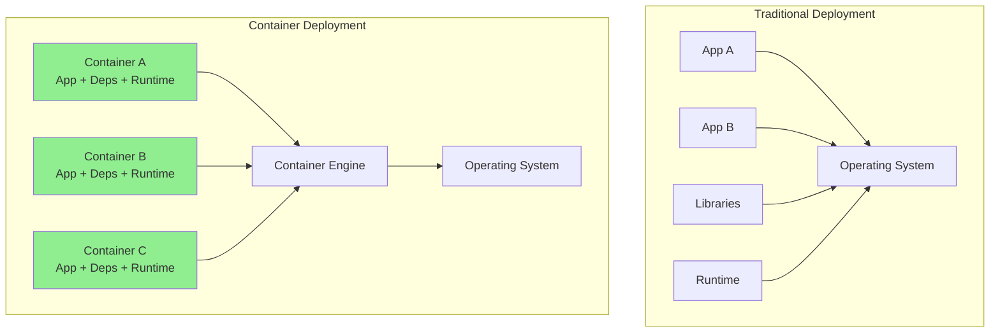
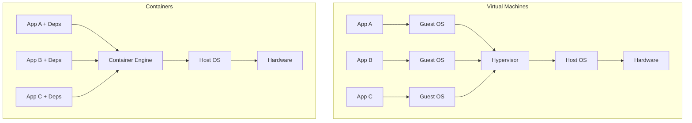
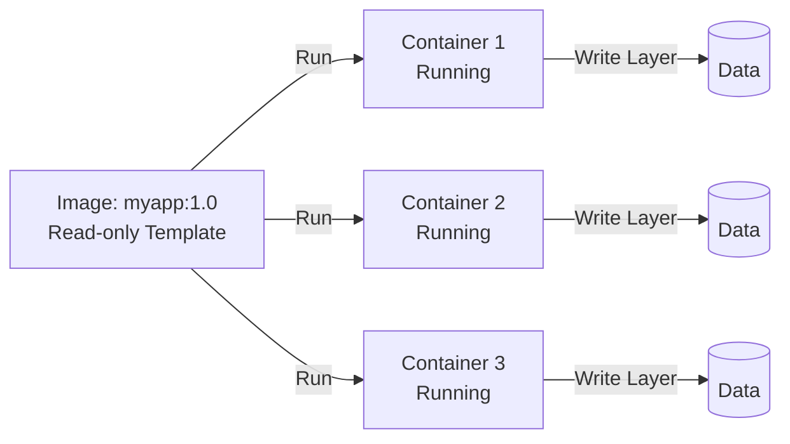
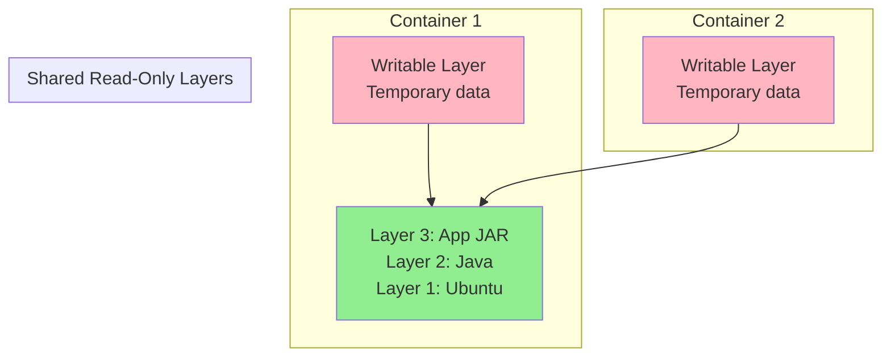

# **Containerization Concepts** 📦

**Understanding Container Technology (Before Learning Docker, Podman, or containerd!)**

---

## **Table of Contents** 📑
1. [The "Works on My Machine" Nightmare](#1-the-works-on-my-machine-nightmare)
2. [What Is Containerization?](#2-what-is-containerization)
3. [Container vs Virtual Machine](#3-container-vs-virtual-machine)
4. [Image vs Container Concepts](#4-image-vs-container-concepts)
5. [Container Architecture Internals](#5-container-architecture-internals)
6. [Container Networking Concepts](#6-container-networking-concepts)
7. [Real-World Big Tech Usage](#7-real-world-big-tech-usage)
8. [For Java Developers](#8-for-java-developers)
9. [Gamified Challenges](#9-gamified-challenges)
10. [Troubleshooting Containers](#10-troubleshooting-containers)
11. [Interview Preparation](#11-interview-preparation)
12. [Key Takeaways](#12-key-takeaways)

---

## **1. The "Works on My Machine" Nightmare** 😱

### **🎬 Scene: The Classic Developer Excuse**

```
Developer: "I swear it works on my machine!"
QA Engineer: "Well, it crashes on mine."
DevOps Engineer: "It won't even start in staging."
Manager: "Production is down. What's happening?!"

Developer's Machine:
  OS: macOS Monterey
  Java: OpenJDK 11.0.12
  Database: MySQL 8.0.26 (local)
  Environment: DEVELOPMENT
  Special configs: In my head
  
QA Environment:
  OS: Windows 10
  Java: Oracle JDK 11.0.10 (slightly different!)
  Database: MySQL 8.0.23 (older version)
  Environment: QA
  Special configs: What configs?
  
Staging Environment:
  OS: Ubuntu 20.04
  Java: OpenJDK 11.0.11
  Database: PostgreSQL 13 (Wait, different DB?!)
  Environment: STAGING
  Special configs: Partially documented
  
Production Environment:
  OS: Red Hat Enterprise Linux 8
  Java: OpenJDK 11.0.15
  Database: PostgreSQL 12
  Environment: PRODUCTION
  Special configs: "Ask Bob who left 6 months ago"

Result: Application behaves differently in each environment! 🔥
```

### **The Real Cost** 💸

```
Traditional Company (Pre-Containers):

Time spent debugging environment issues: 40% of development time
  "Why does it work on dev but not staging?"
  "Did you install the right Java version?"
  "Are you using the same database?"
  "What environment variables do you have set?"

Onboarding new developer:
  Day 1-2: Install IDE, Git, Java, Maven
  Day 3-4: Install MySQL, configure it
  Day 5: Get application running
  Day 6: Realize you installed wrong Java version
  Day 7: Start over
  Week 2: Finally ready to code
  
  Cost: 2 weeks of salary wasted on setup

Deployment failures due to environment differences: 30%
  "The library version was different"
  "Missing system dependency"
  "File permissions were wrong"
  
Cost: Delays, stress, weekend work, frustrated team
```

### **The Core Problem** 🎯

```
Problem: Applications depend on their environment

Application needs:
  ✓ Specific OS
  ✓ Specific runtime (Java, Python, Node)
  ✓ Specific libraries
  ✓ Specific system packages
  ✓ Specific configurations
  ✓ Specific environment variables
  ✓ Specific file permissions
  ✓ Specific network setup

Traditional approach:
  - Manually set up each environment
  - Hope everything matches
  - Cross fingers during deployment
  - Blame "environment differences" when it fails

There MUST be a better way!
```

---

## **2. What Is Containerization?** 🤔

### **The Core Concept** 💡

> **Containerization** is the concept of packaging an application with ALL its dependencies into a single, isolated, portable unit that runs consistently anywhere.

```
Think of it like a shipping container:

Traditional Shipping (Pre-1950s):
  - Different goods packed differently
  - Ships unloaded/loaded differently at each port
  - Slow, expensive, things got damaged
  - No standardization

Modern Shipping Container:
  - Standard size (20ft or 40ft)
  - Pack once, ship anywhere
  - Same loading mechanism worldwide
  - Ship, truck, train all use same container
  - Sealed, protected, consistent

Software Containers:
  - Package application + dependencies once
  - Run anywhere (dev, staging, production)
  - Same behavior everywhere
  - Isolated from other containers
  - Portable across different infrastructures
```

### **The Container Concept** 📦



**Key Concept**: Each container contains EVERYTHING the application needs:
```
Container = Application + Dependencies + Runtime + Configuration

Example Spring Boot Container:
  ├── Your application JAR file
  ├── Java Runtime (JRE 11)
  ├── System libraries
  ├── Configuration files
  ├── Environment variables
  └── Operating system files (minimal)

Result: Run anywhere that has a container engine!
```

### **The Magic: Process Isolation** 🪄

```
Containers use OS-level virtualization:
  - NOT a full virtual machine
  - Shared kernel
  - Isolated processes
  - Isolated filesystem
  - Isolated network

Think of it like apartments in a building:
  Building = Host OS
  Apartment = Container
  
Each apartment:
  ✓ Has own space (filesystem)
  ✓ Has own utilities (network)
  ✓ Is isolated from neighbors
  ✓ Shares building infrastructure (kernel)
  ✓ Much more efficient than separate houses (VMs)
```

### **Why Containerization Exists** 🎯

**Problem 1: Environment Consistency** 
```
Without Containers:
  Dev: Works ✅
  QA: Fails ❌ (different Java version)
  Staging: Works ✅
  Production: Fails ❌ (missing library)

With Containers:
  Dev: Works ✅
  QA: Works ✅ (same container)
  Staging: Works ✅ (same container)
  Production: Works ✅ (same container)
  
Same container = Same behavior
```

**Problem 2: Dependency Hell**
```
Without Containers:
  App A needs Python 2.7
  App B needs Python 3.9
  Both on same server → Conflict! 💥

With Containers:
  Container A: Has Python 2.7 (isolated)
  Container B: Has Python 3.9 (isolated)
  Both on same server → No conflict! ✅
```

**Problem 3: Resource Efficiency**
```
Without Containers:
  - Run 1 app per server (wasteful)
  - Or risk conflicts
  - Server utilization: 20%

With Containers:
  - Run 10-100 containers per server
  - No conflicts (isolated)
  - Server utilization: 80%+
  - Save money on infrastructure
```

---

## **3. Container vs Virtual Machine** ⚖️

### **The Architecture Difference** 🏗️



### **The Key Differences** 📊

| Aspect | Virtual Machine | Container |
|--------|----------------|-----------|
| **What It Virtualizes** | Hardware | Operating System |
| **Size** | GBs (entire OS) | MBs (just app + deps) |
| **Startup Time** | Minutes | Seconds |
| **Performance** | Slower (overhead) | Near-native speed |
| **Isolation** | Complete | Process-level |
| **Resource Usage** | Heavy | Lightweight |
| **Density** | 10s per host | 100s per host |
| **Portability** | Limited (hypervisor-specific) | High (container-native) |
| **Use Case** | Full OS isolation | Application isolation |

### **Real Numbers** 📈

```
Scenario: Run 10 Java applications

Virtual Machines:
  Each VM: 
    - Full OS: 2GB
    - Java App: 500MB
    - Total per VM: 2.5GB
  
  10 VMs total: 25GB RAM
  Boot time: 2-5 minutes each
  Server cost: $500/month (large instance)

Containers:
  Each Container:
    - Shared OS: 0GB (uses host)
    - Java App + JRE: 200MB
    - Total per container: 200MB
  
  10 Containers total: 2GB RAM
  Boot time: 2-5 seconds each
  Server cost: $50/month (small instance)
  
Savings: 90% cost reduction, 60x faster startup!
```

### **When to Use What** 🤔

```
Use Virtual Machines When:
  ✓ Need complete OS isolation
  ✓ Running different operating systems
  ✓ Strong security boundaries required
  ✓ Legacy applications
  ✓ Need different kernels
  
  Example: Running Windows app and Linux app on same hardware

Use Containers When:
  ✓ Running same OS, different apps
  ✓ Microservices architecture
  ✓ CI/CD pipelines
  ✓ Rapid scaling required
  ✓ Resource efficiency matters
  
  Example: Running 100 microservices

Modern Approach: Both!
  - VMs for coarse-grained isolation (teams, environments)
  - Containers within VMs for fine-grained isolation (apps)
  
  Example: Kubernetes cluster running in VMs, 
           each VM runs 10-20 containerized apps
```

### **🎮 Challenge #1: VM or Container?**

```
Scenario: E-commerce Platform

Requirements:
  - 20 microservices (Java, Node.js, Python)
  - Need to scale during Black Friday
  - Run on AWS
  - Development team of 50 engineers
  - Deploy 30+ times per day

Should you use VMs or Containers?

Answer: Containers! ✅

Why:
  ✓ Multiple languages → Each container has its runtime
  ✓ Need to scale → Containers start in seconds
  ✓ Frequent deploys → Container images are lightweight
  ✓ Cost → Containers use resources efficiently
  ✓ Consistency → Same container dev to production

Architecture:
  - ECS or EKS (container orchestration)
  - Each microservice in a container
  - Scale containers independently
  - Deploy without downtime

+30 XP for understanding when to use containers!
```

---

## **4. Image vs Container Concepts** 🖼️

### **The Fundamental Difference** 🎯

> **Image** = Recipe (read-only template)  
> **Container** = Dish (running instance)

```
Think of it like baking a cake:

Image (Recipe):
  - Ingredients list
  - Step-by-step instructions
  - Stored in cookbook
  - Can bake multiple cakes from one recipe
  - Recipe doesn't change

Container (Cake):
  - Actual baked cake
  - Made from recipe
  - Can eat it
  - Can have 10 cakes from same recipe
  - Each cake can be decorated differently
```

### **Image Concept** 📸

```
Container Image:
  - Read-only template
  - Contains everything needed to run application
  - Stored in registry (like Docker Hub)
  - Versioned (tags)
  - Layered architecture

Example Image Layers:
  ┌─────────────────────────────┐
  │ Your Application JAR        │ ← Layer 4
  ├─────────────────────────────┤
  │ Application Dependencies    │ ← Layer 3
  ├─────────────────────────────┤
  │ Java Runtime (JRE)          │ ← Layer 2
  ├─────────────────────────────┤
  │ Base OS (Ubuntu minimal)    │ ← Layer 1
  └─────────────────────────────┘

Why layers?
  - Reusability: Share common layers
  - Efficiency: Only download changed layers
  - Speed: Cache unchanged layers
```

### **Container Concept** 🏃

```
Container (Running Instance):
  - Created from image
  - Has writable layer on top
  - Running process
  - Can be started, stopped, deleted
  - Ephemeral (temporary)

Life Cycle:
  Image → Create Container → Start → Running → Stop → Remove
  
  myapp:1.0  →  Container ID: abc123  →  Running  →  Stopped  →  Gone
```

### **The Relationship** 🔗



```
One Image → Many Containers

Example:
  Image: spring-boot-app:1.0
  
  Container 1: Handles user requests
  Container 2: Handles user requests
  Container 3: Processes background jobs
  Container 4: Running tests
  
  Same image, different purposes!
  Each container has its own writable layer.
```

### **Image Layers Deep Dive** 🔍

```
Why Layered Images Matter:

Traditional (No Layers):
  Spring Boot App v1: 200MB download
  Spring Boot App v2: 200MB download (even for 1KB code change!)
  Total: 400MB

Layered Images:
  Version 1:
    Ubuntu base: 50MB ⬇️
    Java 11: 100MB ⬇️
    Dependencies: 30MB ⬇️
    App JAR: 20MB ⬇️
    Total: 200MB
  
  Version 2 (changed only app code):
    Ubuntu base: 50MB ✅ (cached!)
    Java 11: 100MB ✅ (cached!)
    Dependencies: 30MB ✅ (cached!)
    App JAR: 20MB ⬇️ (only this downloads!)
    Total download: 20MB
  
Savings: 90% less download!
```

### **Image Tags Concept** 🏷️

```
Image naming: repository:tag

Examples:
  myapp:1.0         → Specific version
  myapp:1.1         → Newer version
  myapp:latest      → Latest version (DON'T use in production!)
  myapp:stable      → Stable release
  myapp:dev         → Development version
  myapp:sha-abc123  → Built from specific git commit

Best Practice:
  Development: myapp:latest (always pull newest)
  Staging: myapp:1.1 (specific version for testing)
  Production: myapp:1.1-sha-abc123 (immutable, traceable)
  
Why NOT latest in production?
  "latest" is a moving target!
  Today's "latest" ≠ Tomorrow's "latest"
  Impossible to reproduce issues
  Rollback becomes difficult
```

---

## **5. Container Architecture Internals** 🔧

### **How Containers Actually Work** ⚙️

```
Container Magic = Linux Kernel Features

Three Core Technologies:
  1. Namespaces (Isolation)
  2. Control Groups (Resource Limits)
  3. Union Filesystem (Layered Storage)
```

### **1. Namespaces (Isolation)** 🔒

```
Namespaces provide isolation:
  Each container gets its own isolated view

Types of Namespaces:

PID Namespace (Process Isolation):
  Container A sees:
    PID 1: java application
    PID 2: logging agent
  
  Container B sees:
    PID 1: python application
    PID 2: nginx
  
  Same host, different process trees!

Network Namespace (Network Isolation):
  Container A: 172.17.0.2:8080
  Container B: 172.17.0.3:8080
  
  Both can use port 8080 without conflict!

Mount Namespace (Filesystem Isolation):
  Container A: /app → sees only its files
  Container B: /app → sees only its files
  
  Can't see each other's files!

User Namespace (User Isolation):
  Container: root user (UID 0)
  Host: Mapped to UID 100000
  
  Root inside container ≠ Root on host

IPC Namespace (Inter-Process Communication):
  Containers can't interfere with each other's processes

UTS Namespace (Hostname):
  Each container has its own hostname
```

### **2. Control Groups (cgroups)** 📊

```
Control Groups limit resources:
  Prevent one container from consuming all resources

Resource Limits:

CPU Limit:
  Container A: Max 1 CPU core
  Container B: Max 2 CPU cores
  Container C: Max 0.5 CPU core

Memory Limit:
  Container A: Max 512MB RAM
  Container B: Max 1GB RAM
  Container C: Max 256MB RAM
  
  If exceeded → Container killed (OOMKilled)

Disk I/O Limit:
  Container A: Max 100 MB/s read/write
  Container B: Max 50 MB/s read/write

Network Bandwidth:
  Container A: Max 100 Mbps
  Container B: Max 50 Mbps

Example Configuration:
  docker run --memory="512m" --cpus="1.0" myapp
  
  This container:
    - Can use max 512MB RAM
    - Can use max 1 CPU core
    - If it tries to use more → throttled or killed
```

### **3. Union Filesystem** 📂

```
Union Filesystem enables layers:
  Multiple read-only layers + one writable layer

How it works:

Read-only Layers (from image):
  Layer 1: Ubuntu base     (shared by all containers)
  Layer 2: Java runtime    (shared by Java containers)
  Layer 3: Your app JAR    (specific to this app)

Writable Layer (per container):
  Layer 4: Runtime changes
    - Logs written
    - Temporary files
    - Data modified

When container stops → writable layer discarded
When container restarts → fresh writable layer

This is why containers are EPHEMERAL!
```



---

## **6. Container Networking Concepts** 🌐

### **The Networking Challenge** 🤔

```
Problem: How do containers communicate?

Scenarios:
  1. Container → Outside world
  2. Outside world → Container
  3. Container → Container (same host)
  4. Container → Container (different hosts)
```

### **Network Modes** 🔌

**1. Bridge Network (Default)**
```
Concept: Private network for containers

How it works:
  - Virtual network bridge on host
  - Each container gets private IP
  - NAT to access outside world
  
Example:
  Host: 192.168.1.100
  
  Container A: 172.17.0.2
  Container B: 172.17.0.3
  Container C: 172.17.0.4
  
  Container A can talk to B and C directly
  Outside world → needs port mapping

Port Mapping:
  Container port 8080 → Host port 8080
  
  docker run -p 8080:8080 myapp
  
  Outside request to host:8080 → forwarded to container:8080
```

**2. Host Network**
```
Concept: Use host's network directly

Container uses host's IP and ports:
  No isolation
  Better performance
  Port conflicts possible

Example:
  Host: 192.168.1.100:8080
  Container: Also 192.168.1.100:8080
  
  No port mapping needed
  But only one container can use port 8080
```

**3. Overlay Network**
```
Concept: Connect containers across multiple hosts

Use case: Distributed systems

Example:
  Host 1 (192.168.1.10):
    Container A: 10.0.0.2
  
  Host 2 (192.168.1.20):
    Container B: 10.0.0.3
  
  Container A can talk to Container B directly!
  Uses VPN-like technology (VXLAN)
```

**4. None Network**
```
Concept: No networking

Use case: Isolated batch jobs
  No network access needed
  Maximum isolation
```

### **Container-to-Container Communication** 💬

```
Scenario: Microservices need to talk

Bad Way (IP addresses):
  App A → Call 172.17.0.3:8080 (App B)
  
  Problem: IP changes when container restarts!

Good Way (Service Discovery):
  App A → Call http://app-b:8080
  
  Container engine resolves "app-b" to current IP
  Works even if App B restarts with new IP

Example:
  docker run --name app-b myapp
  docker run --link app-b myapp-client
  
  Now myapp-client can reach "app-b" by name
```

---

## **7. Real-World Big Tech Usage** 🏢

### **Netflix: Containerization at Scale** 🎬

```
Stats:
  - Runs on AWS
  - Uses containers for microservices
  - 100,000s of container instances
  - Titus: Netflix's container management platform

Why Containers:
  ✓ Fast deployments (minutes → seconds)
  ✓ Resource efficiency (fit more on same hardware)
  ✓ Isolation (one service can't crash others)
  ✓ Portability (same container dev to production)

Example: Streaming Service
  User clicks "Play" →
    Container 1: Authentication service
    Container 2: Recommendation engine
    Container 3: Video streaming service
    Container 4: Billing service
  
  Each in its own container, scales independently

Result: 
  - Deploy 4,000+ times per day
  - Handle 200+ million users
  - 99.99% uptime
```

### **Spotify: Million of Container Starts Daily** 🎵

```
Stats:
  - 1+ million container starts per day
  - Helios: Spotify's container orchestration (pre-Kubernetes)
  - Now migrated to Kubernetes

Use Case: Music Processing Pipeline
  Upload new song →
    Container 1: Analyze audio
    Container 2: Generate waveform
    Container 3: Create different quality versions
    Container 4: Add to search index
  
  Spin up 4 containers, process, shut down
  Total time: Minutes instead of hours

Why Containers:
  ✓ Parallel processing (100s of songs simultaneously)
  ✓ Resource efficiency (only run when needed)
  ✓ Isolation (one bad song doesn't crash system)
```

### **Airbnb: Microservices in Containers** 🏠

```
Architecture:
  - 1,000+ microservices
  - All containerized
  - Running on Kubernetes

Migration Journey:
  2014: Monolithic Rails app
  2016: Started breaking into microservices
  2017: All services containerized
  2020: Fully container-native

Example Service:
  Search Service (Containerized):
    - Image size: 200MB
    - Runs 100+ instances
    - Scales based on traffic
    - Deploys independently from other services

Benefits:
  ✓ Faster deployments (hours → minutes)
  ✓ Better resource utilization (60% cost savings)
  ✓ Developer productivity (local dev = production)
```

---

## **8. For Java Developers** ☕

### **Containerizing Spring Boot Applications** 🌱

```dockerfile
# Dockerfile for Spring Boot app
FROM openjdk:11-jre-slim

# Set working directory
WORKDIR /app

# Copy JAR file
COPY target/myapp-1.0.jar app.jar

# Expose port
EXPOSE 8080

# Run application
ENTRYPOINT ["java", "-jar", "app.jar"]
```

**What This Does:**
```
1. FROM: Start with Java 11 base image
   - Includes JRE (no need to install Java)
   
2. WORKDIR: Set /app as working directory
   - All commands run from here
   
3. COPY: Copy your JAR into container
   - Built with: mvn clean package
   
4. EXPOSE: Document that port 8080 is used
   - Doesn't actually open port (documentation only)
   
5. ENTRYPOINT: Command to run when container starts
   - Starts your Spring Boot app
```

### **Multi-Stage Builds (Optimization)** 🚀

```dockerfile
# Stage 1: Build
FROM maven:3.8-openjdk-11 AS build
WORKDIR /app
COPY pom.xml .
COPY src ./src
RUN mvn clean package -DskipTests

# Stage 2: Runtime
FROM openjdk:11-jre-slim
WORKDIR /app
COPY --from=build /app/target/myapp-1.0.jar app.jar
EXPOSE 8080
ENTRYPOINT ["java", "-jar", "app.jar"]
```

**Why Multi-Stage?**
```
Single-Stage:
  - Includes Maven (not needed at runtime)
  - Includes source code (not needed at runtime)
  - Image size: 700MB

Multi-Stage:
  - Stage 1: Build with Maven
  - Stage 2: Only JRE + JAR
  - Image size: 200MB
  
Savings: 70% smaller image!
  - Faster downloads
  - Less storage
  - Faster deployments
```

### **Spring Boot Best Practices** 📋

```java
// 1. Externalize Configuration
// Bad: Hardcoded in application.properties
spring.datasource.url=jdbc:mysql://localhost:3306/mydb

// Good: Use environment variables
spring.datasource.url=${DB_URL}

// In container:
docker run -e DB_URL=jdbc:mysql://prod-db:3306/mydb myapp

// 2. Health Checks
@RestController
public class HealthController {
    
    @GetMapping("/actuator/health")
    public ResponseEntity<String> health() {
        return ResponseEntity.ok("UP");
    }
}

// In Dockerfile:
HEALTHCHECK --interval=30s --timeout=3s \
  CMD curl -f http://localhost:8080/actuator/health || exit 1

// Container engine checks health every 30 seconds
// If fails → restart container

// 3. Graceful Shutdown
spring.lifecycle.timeout-per-shutdown-phase=30s

// Allows container to finish requests before stopping
```

### **🎮 Challenge #2: Optimize Spring Boot Image**

```
Your Spring Boot app image is 800MB. Too big!

Current Dockerfile:
  FROM openjdk:11
  COPY target/myapp-1.0.jar app.jar
  CMD ["java", "-jar", "app.jar"]
  
  Image size: 800MB

How can you optimize to < 200MB?

Optimizations:

1. Use slim base image:
   FROM openjdk:11-jre-slim
   Savings: 300MB

2. Multi-stage build:
   Build stage separate from runtime
   Savings: 200MB

3. Layer caching:
   COPY dependencies first, then app
   Faster rebuilds

4. JLink (Java 11+):
   Create custom JRE with only needed modules
   Savings: Additional 100MB

Optimized Dockerfile:
  # Build
  FROM maven:3.8-openjdk-11 AS build
  WORKDIR /app
  COPY pom.xml .
  RUN mvn dependency:go-offline
  COPY src ./src
  RUN mvn package -DskipTests
  
  # Runtime
  FROM openjdk:11-jre-slim
  COPY --from=build /app/target/*.jar app.jar
  ENTRYPOINT ["java", "-jar", "app.jar"]

New size: 180MB (77% reduction!)

+50 XP for optimization mastery!
```

---

## **9. Gamified Challenges** 🎮

### **Challenge #3: Debug Container Failure** 🔧

```
Your container keeps crashing. Logs show:

Error: Cannot allocate memory
Container exited with code 137

What's happening?

A) Application has memory leak
B) Container hit memory limit (cgroups)
C) Host ran out of memory
D) Database connection pool too large

Answer: B! ✅

Exit code 137 = 128 + 9 = SIGKILL
Container was killed by OOMKiller (Out of Memory)

How to fix:

1. Check container limits:
   docker inspect mycontainer | grep -i memory
   
2. Increase memory:
   docker run --memory="1g" myapp
   
3. Or optimize app:
   - Reduce heap size
   - Fix memory leaks
   - Reduce connection pools

Prevention:
  docker stats  # Monitor container resource usage
  
  NAME        MEM USAGE / LIMIT
  myapp       480MB / 512MB  ← Close to limit!

+40 XP for debugging skills!
```

### **Challenge #4: Network Troubleshooting** 🌐

```
Scenario: Frontend can't reach Backend

Setup:
  Frontend container: web-app
  Backend container: api-server
  
Frontend logs:
  Error: Connection refused to api-server:8080

What's wrong?

Checklist:
  ☐ Are containers on same network?
  ☐ Is backend listening on correct port?
  ☐ Is port exposed in Dockerfile?
  ☐ Firewall blocking?

Common Mistakes:

1. Different Networks:
   docker network ls
   
   web-app → bridge network
   api-server → host network
   
   Solution: Put both on same network
   docker network create mynetwork
   docker run --network mynetwork web-app
   docker run --network mynetwork api-server

2. Backend Not Listening:
   Backend listening on 127.0.0.1:8080 (localhost only)
   
   Should listen on 0.0.0.0:8080 (all interfaces)
   
   Spring Boot:
   server.address=0.0.0.0

3. Wrong Port:
   Backend runs on 8080
   Frontend calls 3000
   
   Use environment variables:
   API_URL=http://api-server:8080

+60 XP for network mastery!
```

### **Interactive Decision Tree** 🌳

```
🎯 Container Selection Quiz

Q1: What are you deploying?
  A) Legacy monolith → Q2
  B) Microservices → Containers! ✅
  C) Static website → Q3

Q2: Can you modify the application?
  A) Yes → Containerize it! ✅
  B) No → Use VM

Q3: Need server-side logic?
  A) Yes → Containers
  B) No → Static hosting (S3, CDN)

Score:
  3/3 correct → Container Expert! (+100 XP)
  2/3 correct → Good understanding (+50 XP)
  1/3 correct → Review concepts (+25 XP)
```

---

## **10. Troubleshooting Containers** 🔧

### **Container Won't Start** ⚠️

```
Problem: Container exits immediately

Debugging Steps:

1. Check logs:
   docker logs mycontainer
   
   Common errors:
   - "No such file or directory" → Wrong path
   - "Permission denied" → File permissions
   - "Cannot allocate memory" → Resource limits

2. Check exit code:
   docker ps -a
   
   Exit codes:
   0   = Success (normal)
   1   = Application error
   137 = OOMKilled (out of memory)
   139 = Segmentation fault
   143 = SIGTERM (graceful shutdown)

3. Try interactive mode:
   docker run -it mycontainer /bin/bash
   
   Explore inside container
   Run commands manually
   Find the issue

4. Check Dockerfile:
   CMD vs ENTRYPOINT confusion
   Wrong paths
   Missing dependencies
```

### **Performance Issues** 🐌

```
Container is slow!

Diagnosis:

1. Check resource limits:
   docker stats
   
   Is container hitting CPU/memory limits?

2. Check I/O:
   docker stats --no-stream
   
   BLOCK I/O
   High? Disk bottleneck

3. Check network:
   Inside container: ping, curl
   
   Slow DNS? Network congestion?

Solutions:
  - Increase resources
  - Optimize application
  - Use better base image
  - Reduce layer count
```

---

## **11. Interview Preparation** 🎯

### **Q1: Explain Container vs VM**

✅ **Excellent Answer**:
```
"Containers and VMs both provide isolation, but at different levels.

Virtual Machines virtualize hardware:
  - Each VM runs full OS
  - Heavy (GBs), slow to start (minutes)
  - Strong isolation (separate kernels)
  - Good for running different operating systems

Containers virtualize the operating system:
  - Share host OS kernel
  - Lightweight (MBs), fast to start (seconds)
  - Process-level isolation via namespaces and cgroups
  - Good for running multiple apps on same OS

Real example from my experience:
We migrated from VMs to containers and went from 20 VMs to 200 containers on the same hardware. Deployment time went from 5 minutes to 10 seconds, and infrastructure costs dropped by 60%.

Modern architecture often uses both:
  - VMs for coarse isolation (environments, teams)
  - Containers within VMs for apps
  
This is exactly how Kubernetes works on cloud providers."
```

### **Q2: What happens when you run a container?**

✅ **Strong Answer**:
```
"When you run a container, several things happen:

1. Image Check:
   - Container engine checks if image exists locally
   - If not, pulls from registry
   - Pulls missing layers only (layer caching)

2. Create Container:
   - Creates new container from image
   - Allocates read-only layers from image
   - Creates writable layer on top

3. Apply Isolation:
   - Creates namespaces (PID, network, mount, etc.)
   - Sets up cgroups for resource limits
   - Configures networking (bridge, IP assignment)

4. Start Process:
   - Runs CMD or ENTRYPOINT from image
   - Process gets PID 1 inside container
   - Container runs as long as process runs

5. Cleanup (when stopped):
   - Writable layer can be removed
   - Network resources released
   - Container can be deleted

For example, 'docker run -p 8080:8080 --memory=512m myapp' would:
  - Pull myapp image if needed
  - Create container with 512MB memory limit
  - Map host port 8080 to container port 8080
  - Start the application defined in image"
```

### **Q3: How do containers achieve isolation?**

✅ **Comprehensive Answer**:
```
"Containers use three main Linux kernel features:

1. Namespaces (Isolation):
   - PID: Isolated process tree
   - Network: Own IP and ports
   - Mount: Isolated filesystem
   - User: User ID mapping
   - IPC: Inter-process communication
   - UTS: Hostname
   
   Each container sees its own isolated view

2. Control Groups (Resource Limits):
   - CPU limits
   - Memory limits
   - Disk I/O
   - Network bandwidth
   
   Prevents one container from starving others

3. Union Filesystem (Layering):
   - Shared read-only layers
   - Per-container writable layer
   - Efficient storage and distribution

Example:
  Container A thinks it's PID 1 and has 1GB memory
  Container B thinks it's PID 1 and has 512MB memory
  Both share the same kernel but isolated views

This is different from VMs which use hypervisor for isolation.
Containers are more lightweight but less isolated than VMs."
```

---

## **12. Key Takeaways** 🎯

```
Containerization Core Concepts:

✅ Containers package app + dependencies + runtime
✅ Solve "works on my machine" problem
✅ Lighter than VMs, faster to start
✅ Portable across environments
✅ Isolated via namespaces and cgroups
✅ Images are templates, containers are instances
✅ Layered architecture for efficiency

Key Principles:
  - Immutable infrastructure
  - Portability
  - Resource efficiency
  - Process isolation
  - Declarative configuration

Remember:
  Containerization is a CONCEPT, not a tool.
  Docker, Podman, containerd are tools that implement the concept.
  Master the concepts, tools become easy to learn.

Success Metrics:
  - Faster deployments (minutes → seconds)
  - Better resource utilization (10x density)
  - Consistent environments (dev = production)
  - Easier scaling (horizontal scaling)
```

**Your Achievement**: 🏆 **Containerization Master** (+400 XP)

### **Container Thinking Checklist** ✅

```
Before containerizing ask:
  ☐ What dependencies does my app need?
  ☐ Can I externalize configuration?
  ☐ Does my app handle signals properly (graceful shutdown)?
  ☐ Are my logs going to stdout/stderr?
  ☐ Can my app run as non-root user?
  ☐ Is my app stateless? (or state externalized)
  ☐ Does my app support horizontal scaling?

Good container characteristics:
  ✓ Single responsibility
  ✓ Stateless (or state in volumes/databases)
  ✓ Externalized configuration
  ✓ Small image size
  ✓ Fast startup
  ✓ Graceful shutdown
  ✓ Health checks
  ✓ Proper logging
```

---

👉 **Next**: [Orchestration Concepts](08_Orchestration_Concepts.md)  
👉 **Related**: [CI/CD Pipeline Concepts](04_CI_CD_Pipeline_Concepts.md)

**Happy Containerizing! 🚀✨**
