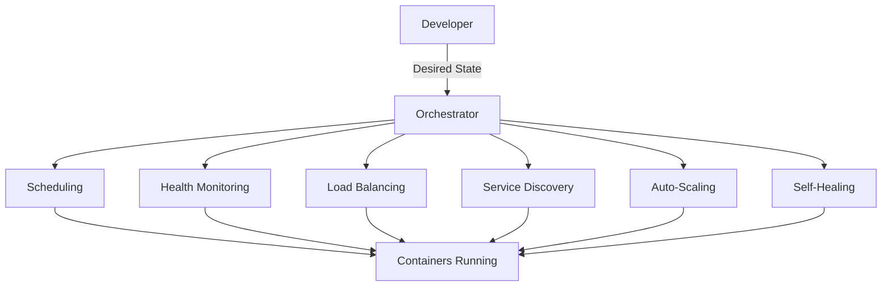
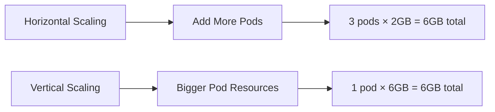

# **Tutorial 08: Orchestration Concepts** 🎼

**Master Container Orchestration Before Kubernetes**

---

## **📋 Table of Contents**

1. [The Container Chaos Nightmare](#1-the-container-chaos-nightmare)
2. [What is Orchestration?](#2-what-is-orchestration)
3. [Core Orchestration Concepts](#3-core-orchestration-concepts)
4. [Scheduling and Placement](#4-scheduling-and-placement)
5. [Service Discovery and Load Balancing](#5-service-discovery-and-load-balancing)
6. [Health Checks and Self-Healing](#6-health-checks-and-self-healing)
7. [Scaling Strategies](#7-scaling-strategies)
8. [Storage and State Management](#8-storage-and-state-management)
9. [How Big Tech Orchestrates](#9-how-big-tech-orchestrates)
10. [Java Microservices Orchestration](#10-java-microservices-orchestration)
11. [Interview Questions & Answers](#11-interview-questions--answers)
12. [Hands-on Challenges](#12-hands-on-challenges)

---

## **1. The Container Chaos Nightmare**

### **"We Have 500 Containers, Now What?"** 💥

```
Monday 9:00 AM - Production

Server 1: Running 10 containers
Server 2: Running 8 containers  
Server 3: Running 15 containers
Server 4: Running 2 containers (underutilized!)
Server 5: CRASHED (all containers dead)

Problems:
  😱 How do you know which containers are where?
  🤯 How do you restart crashed containers?
  💀 How do users find the right container?
  🔥 How do you balance load across containers?
  😩 How do you deploy new versions?

Monday 10:00 AM - Container on Server 2 Crashes

You: "Okay, let me manually SSH and restart it..."
*SSHs into server*
*Restarts container*

Monday 10:15 AM - Another Container Crashes

You: "Again? Let me SSH..."

Monday 10:30 AM - 5 More Containers Crash

You: "I can't keep doing this manually!"

Monday 11:00 AM - Server 5 Still Down

Manager: "Why haven't you restarted those containers?"
You: "I didn't know Server 5 was down!"
Manager: "Don't we have monitoring?"
You: "Yes, but no automated recovery..."

Monday 2:00 PM - New Deployment Needed

Manager: "Deploy version 1.2.0 to all payment services"
You: "Okay... which servers have payment containers?"
You: *Checks manually... finds them on servers 1, 3, 7, 12*
You: *SSHs into each server, updates containers one by one*
You: *Takes 4 hours*

Manager: "This is insane. We need orchestration!"
```

**Without Orchestration:**
- 😱 Manual container management
- 🤯 No automatic recovery
- 💀 Manual load balancing
- 🔥 No service discovery
- 😩 Deployments take forever

**The Real Problem**: Managing containers like VMs doesn't scale.

---

## **2. What is Orchestration?**

### **The Conductor of Your Container Symphony**



### **Orchestration = Automated Container Management**

```
Without Orchestration (Manual):
  ❌ You: "Start container on Server 3"
  ❌ You: "Container crashed, restart it"
  ❌ You: "Balance load manually"
  ❌ You: "Find where service X is running"

With Orchestration (Automated):
  ✅ You: "I want 10 replicas of payment service"
  ✅ Orchestrator: Places them optimally
  ✅ Orchestrator: Restarts if they crash
  ✅ Orchestrator: Balances load automatically
  ✅ Orchestrator: Provides service discovery
```

### **Desired State vs Current State**

```
You Declare (Desired State):
  "I want 5 replicas of payment-service"
  "Each needs 2GB RAM, 1 CPU"
  "Expose on port 8080"
  "Use image payment-service:1.2.0"

Orchestrator Ensures (Current State):
  Continuously checks:
    Are there 5 replicas? → If not, create more
    Are they healthy? → If not, replace them
    Do they have resources? → If not, schedule elsewhere
    Is load balanced? → If not, redistribute traffic
```

---

## **3. Core Orchestration Concepts**

### **Pods/Tasks - Smallest Deployable Unit**

```
Container vs Pod:

Container:
  Single process
  Example: nginx

Pod (Kubernetes) / Task (ECS):
  Group of containers that share:
    - Network namespace (same IP)
    - Storage volumes
    - Lifecycle (deployed together)
    
Example Pod:
  ┌──────────────────────┐
  │  Pod                 │
  │  ┌────────────────┐  │
  │  │ Main Container │  │  payment-service
  │  │ (Java app)     │  │
  │  └────────────────┘  │
  │  ┌────────────────┐  │
  │  │ Sidecar        │  │  log collector
  │  │ (Logging)      │  │
  │  └────────────────┘  │
  └──────────────────────┘
  Same IP: 10.0.0.5
```

**Why Pods?**
```
Use Case: App + Log Collector

Option 1: Single Container
  ❌ Couples app with logging
  ❌ Hard to update logger independently

Option 2: Two Pods
  ❌ Different IPs
  ❌ Complex networking

Option 3: Pod with 2 Containers
  ✅ Shared localhost
  ✅ Shared volumes
  ✅ Deploy together
  ✅ Scale together
```

### **ReplicaSets/Services - Managing Multiple Replicas**

```yaml
# Kubernetes ReplicaSet
apiVersion: apps/v1
kind: ReplicaSet
metadata:
  name: payment-service
spec:
  replicas: 5  # Desired state: 5 replicas
  selector:
    matchLabels:
      app: payment
  template:
    metadata:
      labels:
        app: payment
    spec:
      containers:
      - name: payment
        image: payment-service:1.2.0
        resources:
          requests:
            memory: "2Gi"
            cpu: "1"
```

**What Orchestrator Does:**
```
Current: 0 pods running
Desired: 5 pods running

Orchestrator:
  1. Creates 5 pods
  2. Finds servers with capacity
  3. Distributes across servers
  4. Monitors health
  5. If pod dies → creates replacement
  6. If server dies → reschedules pods
```

### **Services - Stable Networking**

```
Problem: Pod IPs change when they restart
  payment-pod-1: 10.0.0.5 → crashes → 10.0.0.8 (new IP!)
  
Solution: Service provides stable IP/DNS

Service:
  Name: payment-service
  IP: 10.100.0.1 (never changes)
  DNS: payment-service.default.svc.cluster.local
  
  Routes to backend pods:
    payment-pod-1: 10.0.0.5
    payment-pod-2: 10.0.0.6
    payment-pod-3: 10.0.0.7
```

```yaml
apiVersion: v1
kind: Service
metadata:
  name: payment-service
spec:
  selector:
    app: payment  # Routes to pods with this label
  ports:
  - port: 80
    targetPort: 8080
  type: ClusterIP  # Internal service
```

**Benefits:**
- ✅ Stable endpoint (never changes)
- ✅ Built-in load balancing
- ✅ Automatic pod discovery
- ✅ Health-based routing

---

## **4. Scheduling and Placement**

### **The Bin Packing Problem**

```
Servers Available:
  Server 1: 8 GB RAM, 4 CPU
  Server 2: 8 GB RAM, 4 CPU
  Server 3: 8 GB RAM, 4 CPU

Containers to Place:
  Payment (×3): 2 GB RAM, 1 CPU each
  User (×2): 3 GB RAM, 1 CPU each
  Notification (×2): 1 GB RAM, 0.5 CPU each

How to optimize placement?
```

### **Scheduling Algorithms**

#### **1. Spread (Even Distribution)**
```
Goal: Distribute across servers

Result:
  Server 1: 1 payment, 1 user, 1 notification
  Server 2: 1 payment, 1 user, 1 notification  
  Server 3: 1 payment

Pros:
  ✅ Fault tolerance (failure affects fewer services)
  ✅ Even resource usage

Cons:
  ❌ May waste capacity
```

#### **2. Bin Pack (Maximize Utilization)**
```
Goal: Fill servers before using next

Result:
  Server 1: 3 payment (6GB, 3CPU)
  Server 2: 2 user (6GB, 2CPU)
  Server 3: 2 notification (2GB, 1CPU)

Pros:
  ✅ Efficient resource usage
  ✅ Can reduce server count

Cons:
  ❌ Less fault tolerant
```

### **Resource Requests vs Limits**

```yaml
resources:
  requests:  # Minimum guaranteed
    memory: "2Gi"
    cpu: "1"
  limits:    # Maximum allowed
    memory: "4Gi"
    cpu: "2"
```

**How Scheduling Works:**
```
Container requests: 2GB RAM

Scheduler checks each server:
  Server 1: 8GB total, 6GB used → 2GB available ✅
  Server 2: 8GB total, 7GB used → 1GB available ❌
  Server 3: 8GB total, 3GB used → 5GB available ✅

Scheduler places on Server 3 (most available)
```

### **Affinity and Anti-Affinity**

```yaml
# Pod Anti-Affinity: Spread across nodes
apiVersion: v1
kind: Pod
spec:
  affinity:
    podAntiAffinity:
      requiredDuringSchedulingIgnoredDuringExecution:
      - labelSelector:
          matchExpressions:
          - key: app
            operator: In
            values:
            - payment
        topologyKey: "kubernetes.io/hostname"

# Result: Never place two payment pods on same server
# Benefit: High availability
```

```yaml
# Node Affinity: Prefer specific servers
spec:
  affinity:
    nodeAffinity:
      preferredDuringSchedulingIgnoredDuringExecution:
      - weight: 100
        preference:
          matchExpressions:
          - key: disk-type
            operator: In
            values:
            - ssd

# Result: Prefer servers with SSDs
# Benefit: Performance optimization
```

---

## **5. Service Discovery and Load Balancing**

### **The Service Discovery Problem**

```
Before Orchestration:
  User Service needs to call Payment Service
  
  Where is Payment Service running?
    Server 1? Port 8080? 8081?
    Server 2? Server 3?
    
  Solution: Hardcode IP in config ❌
    payment.service.url=http://10.0.0.5:8080
    
  Problem: IP changes when pod restarts!
```

### **DNS-Based Service Discovery**

```
With Orchestration:
  Create Service: "payment-service"
  
  Orchestrator automatically:
    1. Assigns stable DNS name
    2. Updates DNS when pods change
    3. Load balances requests
```

```java
@Service
public class UserService {
    
    // No hardcoded IPs!
    @Value("${payment.service.url}")
    private String paymentUrl;  // = "http://payment-service"
    
    public void checkout(Order order) {
        // DNS resolves to current pods
        PaymentResponse response = restTemplate.postForObject(
            paymentUrl + "/payments",
            order,
            PaymentResponse.class
        );
    }
}
```

**How It Works:**
```
application.yml:
  payment:
    service:
      url: http://payment-service  # Service name, not IP!

DNS Resolution:
  payment-service → 10.100.0.1 (Service IP)
  
  Service routes to backend pods:
    Round-robin:
      Request 1 → Pod 1 (10.0.0.5)
      Request 2 → Pod 2 (10.0.0.6)
      Request 3 → Pod 3 (10.0.0.7)
      Request 4 → Pod 1 (10.0.0.5)
```

### **Load Balancing Strategies**

```yaml
# 1. Round Robin (Default)
# Evenly distributes requests

# 2. Session Affinity
apiVersion: v1
kind: Service
spec:
  sessionAffinity: ClientIP
  sessionAffinityConfig:
    clientIP:
      timeoutSeconds: 10800

# Same client always hits same pod
# Use case: Stateful applications

# 3. Least Connections
# Routes to pod with fewest active connections
# Use case: Long-lived connections
```

---

## **6. Health Checks and Self-Healing**

### **Types of Health Checks**

```java
@RestController
public class HealthController {
    
    // Liveness: Is container alive?
    @GetMapping("/health/liveness")
    public ResponseEntity<String> liveness() {
        // Check if app is running (not deadlocked)
        if (isAppRunning()) {
            return ResponseEntity.ok("Alive");
        }
        return ResponseEntity.status(503).body("Dead");
    }
    
    // Readiness: Can container serve traffic?
    @GetMapping("/health/readiness")
    public ResponseEntity<String> readiness() {
        // Check if dependencies are ready
        if (databaseConnected() && cacheReady()) {
            return ResponseEntity.ok("Ready");
        }
        return ResponseEntity.status(503).body("Not Ready");
    }
    
    // Startup: Has container finished starting?
    @GetMapping("/health/startup")
    public ResponseEntity<String> startup() {
        if (startupComplete()) {
            return ResponseEntity.ok("Started");
        }
        return ResponseEntity.status(503).body("Starting");
    }
}
```

**Probe Configuration:**
```yaml
spec:
  containers:
  - name: payment
    livenessProbe:
      httpGet:
        path: /health/liveness
        port: 8080
      initialDelaySeconds: 30
      periodSeconds: 10
      failureThreshold: 3
      # If fails 3 times, restart container
    
    readinessProbe:
      httpGet:
        path: /health/readiness
        port: 8080
      initialDelaySeconds: 10
      periodSeconds: 5
      # If fails, remove from load balancer
    
    startupProbe:
      httpGet:
        path: /health/startup
        port: 8080
      initialDelaySeconds: 0
      periodSeconds: 10
      failureThreshold: 30
      # Gives app 5 minutes to start (30 × 10s)
```

### **Self-Healing in Action**

```
Scenario: Payment pod crashes

Time: 10:00:00
  Pod Status: Running
  Health Check: ✅ OK

Time: 10:00:15
  Pod Status: Running
  Health Check: ❌ FAILED (timeout)

Time: 10:00:20
  Pod Status: Running
  Health Check: ❌ FAILED (2nd failure)

Time: 10:00:25
  Pod Status: Running
  Health Check: ❌ FAILED (3rd failure)
  
  Orchestrator Action:
    1. Kill pod
    2. Schedule new pod
    3. Start new pod

Time: 10:00:40
  New Pod Status: Starting
  
Time: 10:01:00
  New Pod Status: Running
  Health Check: ✅ OK
  
  Orchestrator Action:
    Add to load balancer

Total Downtime: ~35 seconds (automatic recovery!)
```

---

## **7. Scaling Strategies**

### **Horizontal vs Vertical Scaling**



### **Horizontal Pod Autoscaling (HPA)**

```yaml
apiVersion: autoscaling/v2
kind: HorizontalPodAutoscaler
metadata:
  name: payment-hpa
spec:
  scaleTargetRef:
    apiVersion: apps/v1
    kind: Deployment
    name: payment-service
  minReplicas: 3
  maxReplicas: 20
  metrics:
  - type: Resource
    resource:
      name: cpu
      target:
        type: Utilization
        averageUtilization: 70
  - type: Pods
    pods:
      metric:
        name: http_requests_per_second
      target:
        type: AverageValue
        averageValue: "1000"
```

**How It Works:**
```
Current: 3 pods, CPU 85%, 1200 req/sec

HPA Calculation:
  CPU Target: 70%, Current: 85%
  Desired Pods: 3 × (85/70) = 3.6 → 4 pods
  
  Req/sec Target: 1000, Current: 1200
  Desired Pods: 3 × (1200/1000) = 3.6 → 4 pods
  
Decision: Scale to 4 pods

After Scaling:
  4 pods, CPU 64%, 900 req/sec
  ✅ Under target, stable
```

### **Cluster Autoscaling**

```
Scenario: All servers full, can't schedule more pods

Cluster Autoscaler:
  1. Detects pod pending (can't schedule)
  2. Requests new server from cloud
  3. Server added to cluster
  4. Pod scheduled on new server

Example:
  Servers: 10 (all full)
  Pending Pods: 5
  
  Cluster Autoscaler:
    Adds 2 more servers
    
  Result:
    Servers: 12
    Pending Pods: 0
```

---

## **8. Storage and State Management**

### **Stateless vs Stateful**

```
Stateless (Easy to Orchestrate):
  - Payment API
  - User Service
  - No local data
  - Any pod can handle any request
  - Easy to scale horizontally
  
Stateful (Hard to Orchestrate):
  - Databases
  - Message queues
  - Local data storage
  - Specific pod needed for specific data
  - Complex to scale
```

### **Volume Types**

```yaml
# 1. EmptyDir - Temporary storage
volumes:
- name: cache
  emptyDir: {}

# Use case: Temporary cache, lost when pod dies

# 2. HostPath - Server's filesystem
volumes:
- name: logs
  hostPath:
    path: /var/logs
    
# Use case: Access server logs

# 3. Persistent Volume - Durable storage
volumes:
- name: data
  persistentVolumeClaim:
    claimName: postgres-pvc

# Use case: Database storage, survives pod restarts
```

### **StatefulSets**

```yaml
apiVersion: apps/v1
kind: StatefulSet
metadata:
  name: postgres
spec:
  serviceName: postgres
  replicas: 3
  template:
    spec:
      containers:
      - name: postgres
        image: postgres:14
        volumeMounts:
        - name: data
          mountPath: /var/lib/postgresql/data
  volumeClaimTemplates:
  - metadata:
      name: data
    spec:
      accessModes: ["ReadWriteOnce"]
      resources:
        requests:
          storage: 100Gi

# Creates:
#   postgres-0 with volume vol-0
#   postgres-1 with volume vol-1
#   postgres-2 with volume vol-2
#
# Stable identities, ordered deployment
```

---

## **9. How Big Tech Orchestrates**

### **Google (Borg → Kubernetes)** 🔍

```
Borg (Internal):
  - Manages billions of containers
  - Runs everything (Search, Gmail, YouTube)
  - Kubernetes based on Borg lessons

Key Concepts from Borg:
  - Pods (borrowed concept)
  - Services (stable endpoints)
  - Labels and selectors
  - Declarative configuration
```

### **Netflix (Titus)** 🎬

```
Titus: Container orchestration on AWS

Features:
  - Runs on AWS EC2
  - 3+ million containers/week
  - Integrated with Spinnaker (deployment)
  - Custom scheduler for AWS

Use Case:
  - Video encoding jobs
  - Microservices
  - Batch processing
```

### **Uber** 🚗

```
Peloton: Custom orchestrator

Why Custom:
  - Specific requirements (stateless + stateful)
  - Massive scale
  - Multi-cloud
  
Scale:
  - 1000s of services
  - 100,000s of containers
  - 20+ data centers
```

---

## **10. Java Microservices Orchestration**

### **Spring Boot on Kubernetes**

```yaml
apiVersion: apps/v1
kind: Deployment
metadata:
  name: payment-service
spec:
  replicas: 5
  template:
    spec:
      containers:
      - name: payment
        image: payment-service:1.2.0
        env:
        - name: SPRING_PROFILES_ACTIVE
          value: "production"
        - name: DATABASE_URL
          valueFrom:
            secretKeyRef:
              name: db-credentials
              key: url
        resources:
          requests:
            memory: "1Gi"
            cpu: "500m"
          limits:
            memory: "2Gi"
            cpu: "1"
        ports:
        - containerPort: 8080
          name: http
        - containerPort: 8081
          name: actuator
        livenessProbe:
          httpGet:
            path: /actuator/health/liveness
            port: actuator
        readinessProbe:
          httpGet:
            path: /actuator/health/readiness
            port: actuator
```

---

## **11. Interview Questions & Answers**

### **Q1: Explain the difference between a Pod and a Container**

**✅ Good Answer:**
"A container is a single process running in isolation, like an nginx server. A Pod is Kubernetes' smallest deployable unit that groups one or more containers sharing the same network namespace and storage volumes. Pods enable the sidecar pattern—for example, running your main application container alongside a logging container, both sharing the same localhost and mounted volumes. This is useful when you need tightly coupled containers that should be deployed, scaled, and managed as a single unit."

---

### **Q2: How does service discovery work in Kubernetes?**

**✅ Good Answer:**
"Kubernetes provides built-in DNS-based service discovery. When you create a Service, Kubernetes assigns it a cluster IP and DNS name like 'payment-service.default.svc.cluster.local'. Applications reference services by name, and the DNS resolves to the service IP, which then load-balances to backend pods. The key advantage is that pod IPs can change, but the service IP remains stable. This decouples service consumers from specific pod locations."

---

### **Q3: What's the difference between liveness and readiness probes?**

**✅ Good Answer:**
"Liveness probes determine if a container needs to be restarted—they check if the application is deadlocked or crashed. If a liveness probe fails repeatedly, Kubernetes kills and restarts the container. Readiness probes determine if a container should receive traffic—they check if dependencies like databases are ready. If a readiness probe fails, Kubernetes removes the pod from the service's endpoints but doesn't restart it. This is critical during rolling deployments to ensure new pods don't receive traffic before they're ready."

---

## **12. Hands-on Challenges**

### **Challenge 1: Design Deployment Strategy** 🎯

**Scenario:**
```
Deploy payment-service to production
Requirements:
  - High availability (no single point of failure)
  - Can handle server failures
  - Efficient resource usage
  - 10,000 requests/second capacity
  
Available:
  - 5 servers (8GB RAM, 4 CPU each)
  - payment-service: 2GB RAM, 1 CPU per instance
  - Average latency: 50ms per request
```

**Task:** Design the deployment

<details>
<summary>💡 Solution</summary>

```yaml
apiVersion: apps/v1
kind: Deployment
metadata:
  name: payment-service
spec:
  replicas: 15  # Calculated below
  strategy:
    type: RollingUpdate
    rollingUpdate:
      maxUnavailable: 2
      maxSurge: 3
  template:
    spec:
      affinity:
        podAntiAffinity:
          preferredDuringSchedulingIgnoredDuringExecution:
          - weight: 100
            podAffinityTerm:
              labelSelector:
                matchExpressions:
                - key: app
                  operator: In
                  values:
                  - payment
              topologyKey: kubernetes.io/hostname
      containers:
      - name: payment
        image: payment-service:1.2.0
        resources:
          requests:
            memory: "2Gi"
            cpu: "1"
          limits:
            memory: "2.5Gi"
            cpu: "1.5"
---
apiVersion: autoscaling/v2
kind: HorizontalPodAutoscaler
metadata:
  name: payment-hpa
spec:
  scaleTargetRef:
    apiVersion: apps/v1
    kind: Deployment
    name: payment-service
  minReplicas: 15
  maxReplicas: 20
  metrics:
  - type: Resource
    resource:
      name: cpu
      target:
        type: Utilization
        averageUtilization: 70
```

**Calculation:**
```
Capacity per instance:
  Latency: 50ms
  Concurrent: 1 request at a time (blocking)
  Throughput: 20 req/sec per instance

Required Capacity: 10,000 req/sec
Instances Needed: 10,000 / 20 = 500 instances

Wait... that can't be right. Let me recalculate:

Assuming concurrent request handling (non-blocking):
  With proper async: ~100 req/sec per instance
  Instances Needed: 10,000 / 100 = 100

But we only have 5 servers × 3 instances = 15 max
  Each server: 8GB / 2GB = 4 instances per server
  But need CPU too: 4 CPU / 1 CPU = 4 instances
  Max per server: 3 instances (leave room for system)
  Total: 5 servers × 3 = 15 instances

Capacity: 15 × 100 = 1,500 req/sec

For 10,000 req/sec, need more servers or optimize!
```

**XP: +70** 🏆

</details>

---

**Achievement Unlocked**: 🏆 **Orchestration Master** (+500 XP)

---

**Next**: [10: Configuration Management →](10_Configuration_Management.md)

**Related**: [07: Containerization](07_Containerization_Concepts.md), [09: IaC](09_Infrastructure_as_Code.md)

---

**Total XP Available**: +70 from challenges, +500 achievement = **+570 XP** 🚀
