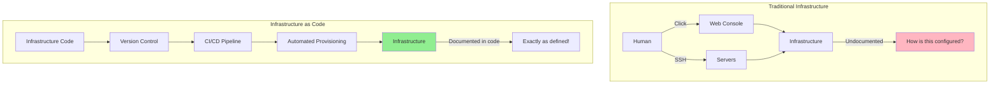
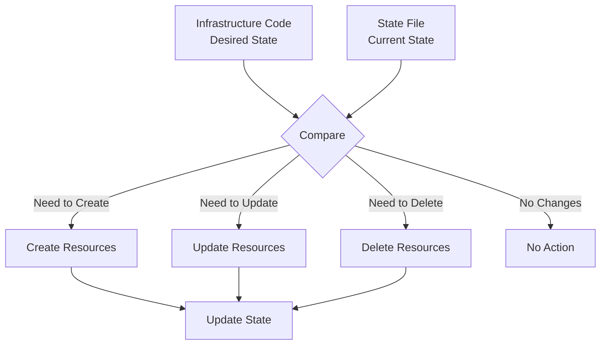
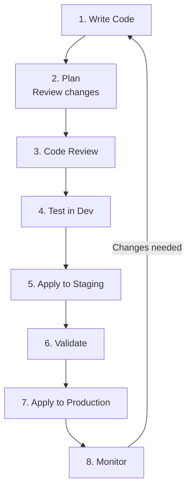

# **Infrastructure as Code Concepts** 🏗️

**Understanding IaC Principles (Before Learning Terraform, Pulumi, or CloudFormation!)**

---

## **Table of Contents** 📑
1. [The Manual Infrastructure Nightmare](#1-the-manual-infrastructure-nightmare)
2. [What Is Infrastructure as Code?](#2-what-is-infrastructure-as-code)
3. [Declarative vs Imperative](#3-declarative-vs-imperative)
4. [State Management Concepts](#4-state-management-concepts)
5. [Idempotency and Immutability](#5-idempotency-and-immutability)
6. [IaC Workflow and Lifecycle](#6-iac-workflow-and-lifecycle)
7. [Real-World Big Tech Practices](#7-real-world-big-tech-practices)
8. [For Java Developers](#8-for-java-developers)
9. [Gamified Challenges](#9-gamified-challenges)
10. [Troubleshooting IaC](#10-troubleshooting-iac)
11. [Interview Preparation](#11-interview-preparation)
12. [Key Takeaways](#12-key-takeaways)

---

## **1. The Manual Infrastructure Nightmare** 😱

### **🎬 Scene: The 2 AM Infrastructure Setup**

```
Manager: "We need a new production environment by Monday."
DevOps Engineer: "Okay, let me start..."

Friday 10 PM: Manual Server Setup Begins

Task List:
  ☐ Log into AWS console
  ☐ Create VPC (Virtual Private Cloud)
     - Subnet 1 (public)
     - Subnet 2 (private)
     - Internet Gateway
     - NAT Gateway
     - Route tables (don't forget!)
  ☐ Create Security Groups
     - Web server: Allow port 80, 443
     - App server: Allow port 8080
     - Database: Allow port 5432
     - (Wait, which ports exactly?)
  ☐ Launch EC2 instances
     - Type: t3.medium (or was it t3.large?)
     - AMI: Amazon Linux 2
     - Storage: 50GB (or 100GB?)
     - Tags: Name, Environment, Owner
  ☐ Configure Load Balancer
     - Target groups
     - Health checks
     - SSL certificate
  ☐ Set up RDS database
     - PostgreSQL 13 (or 14?)
     - Instance size: db.t3.medium
     - Multi-AZ? Yes... I think
     - Backup retention: 7 days (or 14?)
  ☐ Configure S3 buckets
     - Versioning enabled
     - Encryption
     - Lifecycle policies
  ☐ Set up CloudWatch alarms
  ☐ Configure IAM roles and policies
  
Saturday 3 AM: Still clicking buttons...
  Error: "InvalidParameterValue: Invalid subnet"
  (Which subnet was I supposed to use again?)
  
  Start over...

Saturday 11 AM: Finally done!
  Everything works! ✅

Monday Morning:
  Manager: "Great! Now we need staging environment."
  Manager: "Also, replicate this in EU region."
  
  DevOps Engineer: 😱😭
  "Let me start clicking again... for 12 hours... again..."
```

### **The Real Cost** 💸

```
Manual Infrastructure Setup:

Time Cost:
  Production setup: 12 hours
  Staging setup: 12 hours
  EU Production: 12 hours
  EU Staging: 12 hours
  Total: 48 hours (6 full work days!)

Error Rate:
  Forgot to enable Multi-AZ on staging database ❌
  Wrong security group rules in EU ❌
  Different instance types across environments ❌
  Missing tags on some resources ❌
  
  Result: Staging ≠ Production (dangerous!)

Reproducibility:
  "How did I set this up 6 months ago?"
  "What settings did I use?"
  "Documentation? What documentation?"
  
Knowledge Lost:
  Original DevOps engineer leaves
  New engineer: "How is this configured?"
  Answer: ¯\_(ツ)_/¯ "Just look in the AWS console"

Disaster Recovery:
  Production crashes, infrastructure destroyed
  Rebuild time: 12+ hours (if you remember everything)
  Business loss: $100,000+ per hour
```

### **The Core Problems** 🎯

```
Problem 1: Not Reproducible
  - Can't recreate exact same environment
  - Every setup is slightly different
  - "Snowflake servers" (each unique)

Problem 2: Not Version Controlled
  - No history of changes
  - Who changed what? When? Why?
  - Can't rollback infrastructure changes

Problem 3: Not Testable
  - Can't test infrastructure changes before applying
  - Production is the test environment (scary!)
  
Problem 4: Not Scalable
  - Need 10 environments? 10 × manual work
  - Human doesn't scale
  - Clicking doesn't scale

Problem 5: Error-Prone
  - Humans make mistakes
  - Forget steps
  - Inconsistent configurations

There MUST be a better way!
```

---

## **2. What Is Infrastructure as Code?** 🤔

### **The Core Concept** 💡

> **Infrastructure as Code (IaC)** is the practice of managing and provisioning infrastructure through machine-readable definition files, rather than physical hardware configuration or interactive configuration tools.

```
Think of it like this:

Manual Infrastructure (The Old Way):
  - Point and click in web console
  - SSH into servers, run commands
  - Configuration lives in someone's head
  - Like building a house without blueprints

Infrastructure as Code (The Modern Way):
  - Write code that describes infrastructure
  - Version control like application code
  - Automated deployment
  - Like having architectural blueprints for your house
```

### **The IaC Concept** 📝



### **Example: Creating a Server** 🖥️

**Traditional Way (Manual)**:
```
1. Open AWS console
2. Click EC2
3. Click "Launch Instance"
4. Select AMI
5. Select instance type (t3.medium)
6. Configure instance details:
   - Network: VPC-123
   - Subnet: subnet-abc
   - Auto-assign Public IP: Yes
   - IAM role: web-server-role
7. Add storage: 50GB
8. Add tags: Name=web-server
9. Configure security group
10. Review and launch
11. Wait 2 minutes
12. Server ready!

Now... how do you document what you just did?
```

**IaC Way (Code)**:
```hcl
# Terraform example (pseudocode - concepts, not specific tool)
resource "server" "web" {
  ami           = "ami-12345"
  instance_type = "t3.medium"
  
  network {
    vpc_id    = "vpc-123"
    subnet_id = "subnet-abc"
  }
  
  storage {
    size = 50
    type = "gp3"
  }
  
  tags = {
    Name = "web-server"
  }
  
  iam_role = "web-server-role"
}

# Run: apply
# Result: Server created exactly as specified
# Bonus: Code is the documentation!
```

### **Why IaC Exists** 🎯

**Problem 1: Reproducibility**
```
Without IaC:
  Prod environment setup: 12 hours of clicking
  Create staging: Another 12 hours
  Results slightly different 😱

With IaC:
  Write code once
  Run for prod: 5 minutes ✅
  Run for staging: 5 minutes ✅
  Exactly identical! ✨
```

**Problem 2: Version Control**
```
Without IaC:
  Changes made in console
  No history
  Who changed what? Mystery! 🕵️

With IaC:
  All changes in Git
  Full history
  Code reviews before changes
  Rollback possible
  
Git log:
  commit abc123: "Add load balancer"
  commit def456: "Increase RDS size"
  commit ghi789: "Add new subnet"
  
  Full audit trail! ✅
```

**Problem 3: Automation**
```
Without IaC:
  Need to scale to 3 regions?
  3 × manual work
  3 × room for errors

With IaC:
  for region in us-east-1 eu-west-1 ap-south-1; do
    terraform apply -var="region=$region"
  done
  
  3 identical environments in minutes! ✅
```

**Problem 4: Testing**
```
Without IaC:
  Make change directly in production
  Hope it works 🤞
  
With IaC:
  1. Write infrastructure code
  2. Test in dev environment
  3. Code review
  4. Apply to staging
  5. Test again
  6. Apply to production
  
  Tested before production! ✅
```

### **IaC Principles** 📜

**1. Infrastructure as Files**
```
Infrastructure = Text files

Benefits:
  ✓ Can be edited
  ✓ Can be version controlled
  ✓ Can be reviewed
  ✓ Can be tested
  ✓ Can be automated
```

**2. Version Everything**
```
Git for infrastructure code:
  - Track all changes
  - See who changed what
  - Rollback when needed
  - Branch for experiments
  
Example:
  main branch: Production infrastructure
  staging branch: Staging infrastructure
  feature/new-db: Testing new database setup
```

**3. Automate Provisioning**
```
No manual changes!

Bad:
  "I'll just quickly add this security rule in console"
  
  Result: Drift! Code ≠ Reality

Good:
  1. Update code
  2. Commit to Git
  3. Run through CI/CD
  4. Automatically applied
  
  Result: Code = Reality
```

**4. Immutable Infrastructure**
```
Don't modify, replace!

Traditional (Mutable):
  Server acting up?
  SSH in, fix it
  
  Problem: "Snowflake servers"
  Each server unique

IaC (Immutable):
  Server acting up?
  Deploy new server from code
  Delete old server
  
  Benefit: Every server identical
```

---

## **3. Declarative vs Imperative** ⚖️

### **The Fundamental Difference** 🎯

```
Imperative: HOW to do something (step-by-step)
Declarative: WHAT you want (desired state)

Think ordering at restaurant:

Imperative:
  "Take flour, add water, knead for 10 minutes,
   let rise for 1 hour, add tomato sauce,
   add cheese, bake at 450°F for 15 minutes"
   
  You tell the chef EVERY STEP

Declarative:
  "I want a Margherita pizza"
  
  You tell the chef WHAT YOU WANT
  Chef figures out HOW
```

### **Imperative Approach** 🔨

```bash
# Shell script (Imperative IaC)
#!/bin/bash

# Step 1: Create VPC
VPC_ID=$(aws ec2 create-vpc --cidr-block 10.0.0.0/16 | jq -r '.Vpc.VpcId')

# Step 2: Create subnet
SUBNET_ID=$(aws ec2 create-subnet \
  --vpc-id $VPC_ID \
  --cidr-block 10.0.1.0/24 | jq -r '.Subnet.SubnetId')

# Step 3: Create security group
SG_ID=$(aws ec2 create-security-group \
  --group-name web-sg \
  --vpc-id $VPC_ID | jq -r '.GroupId')

# Step 4: Add security group rule
aws ec2 authorize-security-group-ingress \
  --group-id $SG_ID \
  --protocol tcp \
  --port 80 \
  --cidr 0.0.0.0/0

# Step 5: Launch instance
aws ec2 run-instances \
  --image-id ami-12345 \
  --instance-type t3.medium \
  --subnet-id $SUBNET_ID \
  --security-group-ids $SG_ID

echo "Done!"
```

**Problems with Imperative**:
```
Problem 1: Run twice = Error
  First run: Creates resources ✅
  Second run: "Resource already exists" ❌
  
  Not idempotent!

Problem 2: Order matters
  Create subnet before VPC? Error!
  Must run steps in exact order

Problem 3: State in variables
  Lose VPC_ID? Can't continue
  No persistent state tracking

Problem 4: No cleanup
  Delete script? Need to write another script
  Track all resource IDs manually
```

### **Declarative Approach** 📋

```hcl
# Terraform (Declarative IaC - pseudocode)

resource "vpc" "main" {
  cidr_block = "10.0.0.0/16"
}

resource "subnet" "public" {
  vpc_id     = vpc.main.id
  cidr_block = "10.0.1.0/24"
}

resource "security_group" "web" {
  name   = "web-sg"
  vpc_id = vpc.main.id
  
  ingress {
    from_port   = 80
    to_port     = 80
    protocol    = "tcp"
    cidr_blocks = ["0.0.0.0/0"]
  }
}

resource "instance" "web" {
  ami             = "ami-12345"
  instance_type   = "t3.medium"
  subnet_id       = subnet.public.id
  security_groups = [security_group.web.id]
}
```

**Benefits of Declarative**:
```
Benefit 1: Idempotent
  Run once: Creates resources ✅
  Run again: "Everything matches desired state" ✅
  
  Safe to run multiple times!

Benefit 2: Order automatic
  IaC tool figures out dependency order
  Creates VPC before subnet automatically
  
  Dependency graph:
    instance → depends on → subnet
    subnet   → depends on → vpc

Benefit 3: State managed
  IaC tool tracks all resources
  Knows what exists
  Knows what changed
  
Benefit 4: Automatic cleanup
  Delete from code → Automatically deleted
  No need for separate cleanup script
```

### **Comparison** ⚖️

| Aspect | Imperative | Declarative |
|--------|-----------|-------------|
| **Focus** | How to achieve | What to achieve |
| **Run Twice** | Error/duplication | Idempotent |
| **Order** | Manual | Automatic |
| **State** | Manual tracking | Automatic |
| **Changes** | Complex | Simple |
| **Cleanup** | Manual | Automatic |
| **Learning Curve** | Easy | Moderate |
| **Maintenance** | Hard | Easy |
| **Example Tools** | Shell scripts, Python | Terraform, CloudFormation |

### **🎮 Challenge #1: Identify the Approach**

```
Which is declarative?

Option A:
  1. Check if server exists
  2. If not, create server
  3. Check if has tag
  4. If not, add tag
  5. Check if right size
  6. If not, resize

Option B:
  server {
    type = "t3.medium"
    tag  = "web-server"
  }

Answer: B! ✅

Option A: Imperative (step-by-step HOW)
Option B: Declarative (desired state WHAT)

IaC tool for Option B:
  - Figures out if server exists
  - Creates if missing
  - Updates if wrong size
  - Adds tag if missing
  
  You just declare WHAT you want!

+30 XP for understanding the difference!
```

---

## **4. State Management Concepts** 💾

### **What Is State?** 🤔

> **State** is the record of what infrastructure currently exists, allowing IaC tools to know what to create, update, or delete.

```
Think of state like a database:
  Tracks: What resources exist
  Where: In your cloud account
  How: Created by your IaC code
  
Without state:
  Tool doesn't know what it created before
  Can't update resources
  Can't delete resources
  Must recreate everything
  
With state:
  Tool remembers everything
  Smart updates
  Smart deletes
  Efficient changes
```

### **How State Works** ⚙️



**The Process**:
```
Step 1: Read State
  What infrastructure exists now?
  
  State says:
    - VPC: vpc-123
    - Subnet: subnet-abc
    - Instance: i-456 (t3.medium)

Step 2: Read Code
  What infrastructure SHOULD exist?
  
  Code says:
    - VPC: 10.0.0.0/16
    - Subnet: 10.0.1.0/24
    - Instance: t3.large (changed!)

Step 3: Calculate Diff
  What needs to change?
  
  Diff:
    VPC: No change ✅
    Subnet: No change ✅
    Instance: Resize from t3.medium → t3.large ⚠️

Step 4: Apply Changes
  Make infrastructure match code
  
  Action: Resize instance to t3.large

Step 5: Update State
  Record new state
  
  New State:
    - Instance: i-456 (t3.large) ✅
```

### **State Example** 📄

```json
// State file (simplified)
{
  "version": 4,
  "resources": [
    {
      "type": "aws_vpc",
      "name": "main",
      "id": "vpc-123",
      "attributes": {
        "cidr_block": "10.0.0.0/16",
        "tags": {
          "Name": "main-vpc"
        }
      }
    },
    {
      "type": "aws_instance",
      "name": "web",
      "id": "i-456",
      "attributes": {
        "ami": "ami-12345",
        "instance_type": "t3.medium",
        "subnet_id": "subnet-abc"
      }
    }
  ]
}
```

**What State Tracks**:
```
For each resource:
  ✓ Type (VPC, Instance, Database, etc.)
  ✓ Name (from your code)
  ✓ ID (from cloud provider)
  ✓ All attributes
  ✓ Dependencies
  ✓ Metadata

Why this matters:
  - Know what exists
  - Know what to update
  - Know what to delete
  - Track dependencies
```

### **State Storage** 🗄️

**Local State** (Bad for teams):
```
State stored on your computer:
  
  Pros:
    ✓ Simple
    ✓ No setup needed
  
  Cons:
    ✗ Only you can make changes
    ✗ If laptop dies, state lost!
    ✗ No collaboration
    ✗ No locking (concurrent changes = disaster)

When to use:
  - Personal projects
  - Learning/testing
  - Never for production!
```

**Remote State** (Good for teams):
```
State stored in cloud (S3, Azure Blob, etc.):
  
  Pros:
    ✓ Team collaboration
    ✓ State locking (prevents conflicts)
    ✓ Encrypted
    ✓ Versioned
    ✓ Backed up
  
  Cons:
    ✗ Needs setup
    ✗ Small cost
  
When to use:
  - Team projects
  - Production
  - Anything important

Example: S3 backend
  terraform {
    backend "s3" {
      bucket = "my-terraform-state"
      key    = "prod/infrastructure"
      region = "us-east-1"
      
      # State locking
      dynamodb_table = "terraform-locks"
    }
  }
```

### **State Locking** 🔒

```
Problem: Two people apply simultaneously

Without Locking:
  Engineer A: Starts applying changes (10:00 AM)
  Engineer B: Starts applying changes (10:00 AM)
  
  Both read same state
  Both make changes
  State file corrupted! 💥
  
  Result: Disaster!

With Locking:
  Engineer A: Starts applying (10:00 AM)
    → Acquires lock ✅
  
  Engineer B: Tries to apply (10:00 AM)
    → "Lock held by Engineer A"
    → Waits...
  
  Engineer A: Finishes (10:05 AM)
    → Releases lock
  
  Engineer B: Acquires lock (10:05 AM)
    → Applies changes ✅
  
  Result: Safe! ✅
```

---

## **5. Idempotency and Immutability** 🔄

### **Idempotency Concept** 🎯

> **Idempotency**: Running the same operation multiple times produces the same result.

```
Think of light switch:
  Press once: Light on 💡
  Press again: Light on 💡 (same result)
  Press 100 times: Light on 💡 (same result)
  
  Idempotent! ✅

Compare to elevator call button:
  Press once: Elevator comes
  Press again: Elevator comes (same result)
  Press 100 times: Still one elevator
  
  Idempotent! ✅

NOT idempotent:
  Add money to bank account:
    Add $100 once: Balance $100
    Add $100 again: Balance $200 (different!)
    Add $100 100 times: Balance $10,000
    
  NOT idempotent! ❌
```

### **Idempotency in IaC** 📋

```
Good IaC (Idempotent):

Code:
  server {
    name = "web-server"
    type = "t3.medium"
  }

Run 1: Creates server ✅
Run 2: "Server exists, nothing to do" ✅
Run 3: "Server exists, nothing to do" ✅
Run 100: "Server exists, nothing to do" ✅

Result: Safe to run anytime!


Bad Script (NOT Idempotent):

Script:
  aws ec2 run-instances --instance-type t3.medium

Run 1: Creates server ✅
Run 2: Creates ANOTHER server ❌
Run 3: Creates ANOTHER server ❌
Run 100: Creates 100 servers! 😱

Result: Disaster!
```

**Why Idempotency Matters**:
```
Benefit 1: Safe to Retry
  Deployment failed halfway?
  Just run again!
  Won't duplicate resources

Benefit 2: Convergent
  Always converges to desired state
  Multiple runs → same result

Benefit 3: CI/CD Friendly
  Can run in automated pipelines
  Failures can retry safely

Benefit 4: Easier Debugging
  Can run repeatedly while troubleshooting
  No cleanup needed between runs
```

### **Immutability Concept** 🧊

> **Immutability**: Don't modify, replace!

```
Traditional (Mutable):
  Server has bug
  → SSH into server
  → Install patch
  → Restart service
  
  Problem: "Configuration drift"
  Over time, servers become unique snowflakes
  
  Server 1: Patched 10 times
  Server 2: Patched 8 times
  Server 3: Patched 12 times
  
  All slightly different! 😱

Modern (Immutable):
  Server has bug
  → Update server image/code
  → Deploy new server
  → Delete old server
  
  Benefit: Every server identical
  
  Server 1: From image v1.5
  Server 2: From image v1.5
  Server 3: From image v1.5
  
  All exactly the same! ✅
```

**Immutable Infrastructure with IaC**:
```
Scenario: Update application

Old Way (Mutable):
  for each server:
    ssh into server
    pull new code
    restart application
  
  Problems:
    - Some updates fail
    - Servers in inconsistent state
    - Hard to rollback

New Way (Immutable):
  1. Build new server image with updated app
  2. Deploy new servers
  3. Shift traffic to new servers
  4. Delete old servers
  
  Benefits:
    - All servers identical
    - Easy rollback (keep old image)
    - Atomic switch
  
Example:
  # Old infrastructure
  instance {
    image = "app-v1.0"
    count = 3
  }
  
  # Update code to:
  instance {
    image = "app-v1.1"
    count = 3
  }
  
  # Apply:
  - Creates 3 new instances with v1.1
  - Deletes 3 old instances with v1.0
  - Atomic switch!
```

### **🎮 Challenge #2: Design for Immutability**

```
Scenario: Database needs schema migration

Option A (Mutable):
  1. Connect to production database
  2. Run migration script
  3. Hope it works
  
  Risk: If fails, database corrupted!

Option B (Immutable):
  1. Create RDS snapshot
  2. Restore snapshot to new instance
  3. Run migration on new instance
  4. Test thoroughly
  5. Switch application to new instance
  6. Keep old instance for rollback
  
  Safe! Can rollback anytime!

Which approach should you use?

Answer: B! ✅

Why:
  ✓ Old database still exists (rollback)
  ✓ Can test migration first
  ✓ Atomic switch
  ✓ Zero downtime
  
IaC Code:
  # Create new database from snapshot
  database "new" {
    snapshot_id = old_database.snapshot_id
    version     = "13.7"
  }
  
  # Run migration
  migration {
    database = database.new.endpoint
    script   = "migration_v2.sql"
  }
  
  # Update application
  app_config {
    db_endpoint = database.new.endpoint
  }

+50 XP for immutable thinking!
```

---

## **6. IaC Workflow and Lifecycle** 🔄

### **The IaC Development Cycle** 🔁



**Step-by-Step**:
```
1. Write Infrastructure Code
   - Define resources
   - Configure settings
   - Set variables
   
2. Plan (Dry Run)
   - See what will change
   - Review before applying
   - Catch errors early
   
   Output:
   Plan: 3 to add, 1 to change, 0 to destroy
     + instance.web (new)
     + database.main (new)
     + loadbalancer.pub (new)
     ~ securitygroup.web (size changed)

3. Code Review
   - Team reviews changes
   - Check for best practices
   - Security review
   
4. Test in Dev
   - Apply to development environment
   - Verify functionality
   - Smoke tests
   
5. Apply to Staging
   - Replicate production
   - Full testing
   - Performance testing
   
6. Validate
   - All tests pass?
   - No errors?
   - Performance acceptable?
   
7. Apply to Production
   - Gradually (if possible)
   - Monitor closely
   - Ready to rollback
   
8. Monitor
   - Watch metrics
   - Check logs
   - Ensure stability
```

### **The Plan Phase** 📊

```
Why Plan is Critical:

Without Plan:
  Apply code → Hope for the best 🤞
  
  Possible surprises:
  - Deletes production database 😱
  - Changes security groups
  - Costs spike unexpectedly
  
With Plan:
  Plan first → Review → Then apply
  
  Plan output shows:
  + Resource to CREATE
  ~ Resource to UPDATE
  - Resource to DELETE
  
Example Plan:
  Terraform will perform the following actions:
  
  # instance.web will be created
  + resource "instance" "web" {
      + ami           = "ami-12345"
      + instance_type = "t3.medium"
      + id            = (known after apply)
    }
  
  # database.main will be destroyed
  - resource "database" "main" {
      - id              = "db-123" -> null
      - instance_class  = "db.t3.small" -> null
    }
  
  Plan: 1 to add, 0 to change, 1 to destroy.
  
  ⚠️ WARNING: About to delete database!
  Review before applying!
```

### **Workspace/Environment Management** 🌍

```
Concept: Separate environments

Production:
  - Most resources
  - Expensive instances
  - High availability
  
Staging:
  - Smaller scale
  - Cheaper instances
  - Mirror production

Development:
  - Minimal resources
  - Cheapest instances
  - Experimentation

How to manage:

Option 1: Separate Directories
  infra/
    prod/
      main.tf
      variables.tf
    staging/
      main.tf
      variables.tf
    dev/
      main.tf
      variables.tf

Option 2: Workspaces
  Same code, different state
  
  terraform workspace new prod
  terraform workspace new staging
  terraform workspace new dev
  
  Switch: terraform workspace select prod

Option 3: Variables
  Same code, different variable files
  
  terraform apply -var-file="prod.tfvars"
  terraform apply -var-file="staging.tfvars"
```

---

## **7. Real-World Big Tech Practices** 🏢

### **Netflix: Automated Cloud at Scale** 🎬

```
IaC Usage:
  - Manages 100,000+ AWS resources
  - Multi-region deployments
  - Automated failover

Tools:
  - Spinnaker (deployment automation)
  - Custom IaC tools
  - Immutable infrastructure

Practice:
  "Red-Black Deployment"
  
  Current (Red):
    100 instances running app v1.0
  
  New (Black):
    Deploy 100 new instances with app v1.1
    Test thoroughly
  
  Switch:
    Route all traffic to Black
    Keep Red for 24 hours (rollback)
    Delete Red after validation
  
  All managed with IaC!
  
Result:
  - Zero downtime deployments
  - Easy rollbacks
  - Consistent infrastructure
```

### **Airbnb: Multi-Cloud IaC** 🏠

```
Challenge:
  - Run on AWS and GCP
  - 1000s of services
  - Multiple regions

Solution: Declarative IaC
  
  Write once, deploy anywhere:
  
  service "booking" {
    instances = 10
    cpu       = "2 cores"
    memory    = "4GB"
  }
  
  Deploy to:
    - AWS us-east-1
    - AWS eu-west-1  
    - GCP us-central1
  
  Same code, different cloud providers!

Benefits:
  ✓ No cloud lock-in
  ✓ Consistent across clouds
  ✓ Disaster recovery (multi-cloud)
  ✓ Cost optimization (choose cheaper cloud)

Tools:
  - Terraform for multi-cloud
  - Pulumi for complex logic
  - Custom abstractions
```

### **Google: Site Reliability Engineering** 🔍

```
Practice: "Infrastructure as Data"

Philosophy:
  Infrastructure code is data
  Process it, validate it, test it
  
Example:
  # Define infrastructure
  load_balancer {
    name = "prod-lb"
    backends = [server1, server2, server3]
  }
  
  # Validate
  test "lb has 3 backends" {
    assert load_balancer.backends.count == 3
  }
  
  test "all backends healthy" {
    for backend in load_balancer.backends {
      assert backend.health == "healthy"
    }
  }
  
  # Only apply if tests pass!

Benefits:
  - Catch errors before applying
  - Enforce standards
  - Continuous validation
  - Self-healing infrastructure

Result:
  - 99.99%+ uptime
  - Automated recovery
  - Scalable to Google scale
```

---

## **8. For Java Developers** ☕

### **IaC for Java Application Infrastructure** 🌱

```hcl
# Deploying Spring Boot app with IaC (pseudocode)

# Container Registry
resource "container_registry" "main" {
  name = "myapp-registry"
}

# Build and Push Image (in CI/CD)
resource "container_image" "app" {
  name       = "spring-boot-app"
  dockerfile = "./Dockerfile"
  tag        = "1.0.0"
  
  push_to = container_registry.main.url
}

# Database
resource "database" "postgres" {
  engine         = "postgres"
  version        = "13"
  instance_class = "db.t3.medium"
  storage_gb     = 100
  
  database_name = "myapp"
  username      = "admin"
  password      = var.db_password  # From secrets!
  
  backup_retention = 7
  multi_az         = true
}

# Application Servers
resource "container_service" "app" {
  name  = "spring-boot-app"
  image = container_image.app.url
  
  replicas = 3
  
  resources {
    cpu    = "1000m"
    memory = "2Gi"
  }
  
  env = {
    SPRING_PROFILES_ACTIVE     = "production"
    SPRING_DATASOURCE_URL      = "jdbc:postgresql://${database.postgres.endpoint}/myapp"
    SPRING_DATASOURCE_USERNAME = database.postgres.username
    SPRING_DATASOURCE_PASSWORD = var.db_password
  }
  
  health_check {
    path     = "/actuator/health"
    interval = 30
    timeout  = 5
  }
}

# Load Balancer
resource "load_balancer" "public" {
  name = "app-lb"
  
  listener {
    port     = 443
    protocol = "HTTPS"
    certificate = certificate.ssl.arn
  }
  
  default_action {
    forward_to = container_service.app.endpoint
  }
}

# Auto-Scaling
resource "autoscaling" "app" {
  service = container_service.app.name
  
  min_replicas = 2
  max_replicas = 10
  
  scale_up_when {
    metric    = "cpu"
    threshold = 70
  }
  
  scale_down_when {
    metric    = "cpu"
    threshold = 30
  }
}

# Monitoring
resource "monitoring" "app" {
  service = container_service.app.name
  
  alerts {
    name      = "High Error Rate"
    condition = "error_rate > 5%"
    notify    = ["team@company.com"]
  }
  
  alerts {
    name      = "High Response Time"
    condition = "p95_latency > 500ms"
    notify    = ["team@company.com"]
  }
}
```

**What This Achieves**:
```
✓ Complete Java app infrastructure
✓ Database configured
✓ Auto-scaling enabled
✓ Load balanced
✓ Health checks
✓ Monitoring and alerts
✓ All in code!
✓ Reproducible in minutes
```

### **Managing Application Configuration** ⚙️

```hcl
# Secrets Management
resource "secret" "db_password" {
  name  = "database-password"
  value = var.db_password  # Never commit actual password!
}

resource "secret" "jwt_secret" {
  name  = "jwt-signing-key"
  value = var.jwt_secret
}

# Configuration
resource "config_map" "app" {
  name = "app-config"
  
  data = {
    "application.yml" = <<EOF
spring:
  application:
    name: myapp
  jpa:
    hibernate:
      ddl-auto: validate
    properties:
      hibernate:
        dialect: org.hibernate.dialect.PostgreSQLDialect
  datasource:
    url: ${database.postgres.endpoint}
    username: ${database.postgres.username}
    password: ${secret.db_password.value}
logging:
  level:
    root: INFO
    com.myapp: DEBUG
server:
  port: 8080
  compression:
    enabled: true
EOF
  }
}

# Inject into application
resource "container_service" "app" {
  # ... other config ...
  
  volumes {
    name = "config"
    config_map = config_map.app.name
    mount_path = "/app/config"
  }
  
  env {
    name  = "SPRING_CONFIG_LOCATION"
    value = "/app/config/application.yml"
  }
}
```

---

## **9. Gamified Challenges** 🎮

### **Challenge #3: Plan Review Quiz** 📋

```
You're about to apply this IaC plan. Should you proceed?

Terraform Plan Output:
  
  # database.main will be replaced
  -/+ resource "database" "main" {
      ~ instance_class = "db.t3.small" -> "db.t3.large"
      ~ storage        = 100 -> 500
      
      (must recreate due to storage increase)
    }
  
  # instance.web will be destroyed
  - resource "instance" "web" {
      - id              = "i-123"
      - public_ip       = "54.12.34.56"
    }
  
  Plan: 1 to add, 0 to change, 2 to destroy.

Should you apply?

A) Yes, looks good!
B) No, wait! 🚨

Answer: B! ❌

Red Flags:
  
  1. "database will be REPLACED"
     = New database created
     = Old database DELETED
     = ALL DATA LOST! 😱
     
  2. "instance.web will be destroyed"
     = Web server deleted
     = Service goes down!
  
What actually happened:
  - You removed instance.web from code accidentally
  - Database resize requires recreation (provider limitation)

What to do:
  1. Create database snapshot first!
  2. Check why instance.web is being deleted
  3. Consider blue-green deployment for database
  4. Apply during maintenance window

Never blindly apply destructive changes!

+60 XP for catching the disaster!
```

### **Challenge #4: Optimize Infrastructure Cost** 💰

```
Current Infrastructure (Too Expensive):

# Development environment
resource "instance" "dev" {
  instance_type = "t3.2xlarge"  # 8 vCPU, 32GB RAM
  count         = 5
  
  runs_24_7 = true
}

resource "database" "dev" {
  instance_class = "db.m5.4xlarge"  # 16 vCPU, 64GB RAM
  multi_az       = true
  backup_retention = 35
}

Monthly Cost: $5,000 😱

Optimize for development environment:

Optimized Infrastructure:

# Development environment
resource "instance" "dev" {
  instance_type = "t3.medium"  # 2 vCPU, 4GB RAM (enough for dev!)
  count         = 2
  
  # Auto-shutdown after hours
  schedule {
    start = "8:00 AM weekdays"
    stop  = "6:00 PM weekdays"
  }
}

resource "database" "dev" {
  instance_class = "db.t3.small"  # 2 vCPU, 2GB RAM (enough for dev!)
  multi_az       = false  # Not needed for dev
  backup_retention = 3  # Keep short
  
  # Auto-shutdown after hours
  schedule {
    start = "8:00 AM weekdays"
    stop  = "6:00 PM weekdays"
  }
}

Monthly Cost: $400 ✅

Savings: 92%! ($4,600/month)

Lessons:
  ✓ Right-size for environment
  ✓ Dev doesn't need production specs
  ✓ Auto-shutdown when not in use
  ✓ Reduce redundancy for non-critical envs
  ✓ Shorter backup retention

+100 XP for cost optimization mastery!
```

---

## **10. Troubleshooting IaC** 🔧

### **State Corruption** 😱

```
Error: "state locked"

Cause:
  Previous run crashed
  Lock not released

Solution:
  # Force unlock (use with caution!)
  terraform force-unlock <LOCK_ID>
  
  # Better: Wait for timeout
  # Or check if someone else is running
```

### **Dependency Errors** 🔗

```
Error: "subnet depends on VPC that doesn't exist"

Cause:
  Resources created in wrong order
  
Solution:
  # Explicit dependency
  resource "subnet" "main" {
    vpc_id = vpc.main.id
    
    depends_on = [vpc.main]
  }
  
  # Or use references (automatic dependency)
  resource "subnet" "main" {
    vpc_id = vpc.main.id  # Auto-detects dependency
  }
```

---

## **11. Interview Preparation** 🎯

### **Q1: What is Infrastructure as Code?**

✅ **Excellent Answer**:
```
"Infrastructure as Code is the practice of managing infrastructure through code rather than manual processes.

Key Principles:
  1. Declarative: Define WHAT you want, not HOW
  2. Version Controlled: Track all changes in Git
  3. Idempotent: Safe to run multiple times
  4. Automated: No manual clicking

Benefits:
  - Reproducible: Same code = same infrastructure
  - Testable: Test before production
  - Documented: Code is documentation
  - Fast: Minutes vs hours/days
  
Real example from my experience:
We migrated from manual setup to IaC. Previously, setting up an environment took 2 days and was error-prone. With IaC, we can spin up identical environments in 10 minutes. We now have dev, staging, and production that are exactly the same. Deployment errors dropped by 80%."
```

### **Q2: Declarative vs Imperative IaC?**

✅ **Strong Answer**:
```
"Declarative: You specify the desired end state
Imperative: You specify the steps to achieve it

Example:
  Imperative (Shell script):
    - Create VPC
    - Create subnet  
    - Create instance
    Order matters, not idempotent

  Declarative (Terraform):
    resource vpc { }
    resource subnet { }
    resource instance { }
    Tool figures out order, idempotent

I prefer declarative because:
  - Idempotent (can run multiple times)
  - Self-documenting (code shows current state)
  - Handles dependencies automatically
  - Easier to maintain

Imperative has its place for complex logic, but declarative is better for infrastructure management."
```

---

## **12. Key Takeaways** 🎯

```
Infrastructure as Code Concepts:

✅ Define infrastructure in code, not clicks
✅ Version control everything
✅ Declarative over imperative
✅ State management is critical
✅ Idempotent operations
✅ Immutable infrastructure
✅ Plan before apply
✅ Automate everything

Key Principles:
  - Infrastructure = Code
  - Code = Version controlled
  - Changes = Reviewed and tested
  - Deployments = Automated
  - Environments = Identical

Remember:
  IaC is a CONCEPT, not a tool.
  Terraform, CloudFormation, Pulumi are tools.
  Master concepts, tools become easy.

Success Metrics:
  - Infrastructure deploy time: Hours → Minutes
  - Environment consistency: 100%
  - Manual changes: 0
  - Rollback time: < 5 minutes
```

**Your Achievement**: 🏆 **Infrastructure as Code Master** (+500 XP)

---

👉 **Next**: [Monitoring & Observability Concepts](11_Monitoring_Observability.md)  
👉 **Related**: [CI/CD Pipeline Concepts](04_CI_CD_Pipeline_Concepts.md)

**Happy Automating! 🚀✨**
