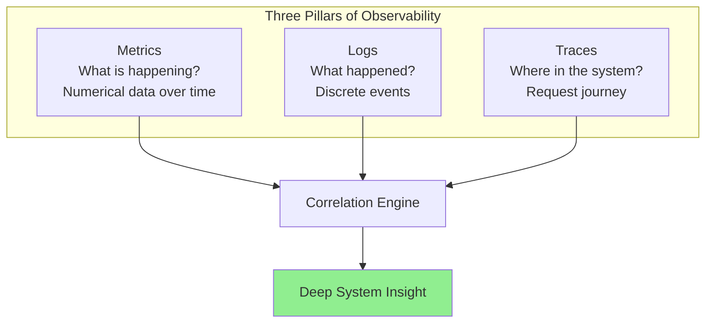
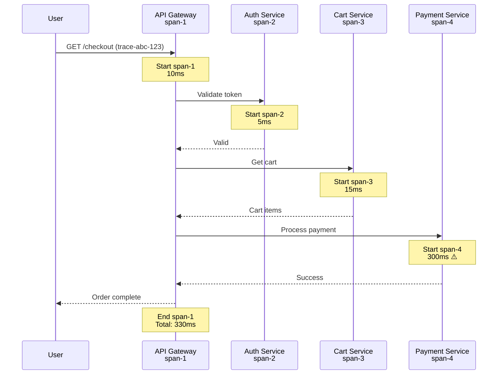

# **Monitoring & Observability Concepts** 📊

**Understanding System Visibility (Before Learning Prometheus, Grafana, or ELK Stack!)**

---

## **Table of Contents** 📑
1. [The Production Blackout Nightmare](#1-the-production-blackout-nightmare)
2. [Monitoring vs Observability](#2-monitoring-vs-observability)
3. [The Three Pillars: Metrics, Logs, Traces](#3-the-three-pillars-metrics-logs-traces)
4. [SLIs, SLOs, and SLAs](#4-slis-slos-and-slas)
5. [Alerting Strategies](#5-alerting-strategies)
6. [Distributed Tracing Concepts](#6-distributed-tracing-concepts)
7. [Real-World Big Tech Observability](#7-real-world-big-tech-observability)
8. [For Java Developers](#8-for-java-developers)
9. [Gamified Challenges](#9-gamified-challenges)
10. [Troubleshooting with Observability](#10-troubleshooting-with-observability)
11. [Interview Preparation](#11-interview-preparation)
12. [Key Takeaways](#12-key-takeaways)

---

## **1. The Production Blackout Nightmare** 😱

### **🎬 Scene: The Silent Failure**

```
Saturday 2:00 AM:
  Customer: "Your website is down!"
  (First notification: Twitter)

Engineer (woken up): 
  "What? Let me check..."
  
  Dashboard: All green ✅
  Server: Running ✅
  Database: Running ✅
  
  "Everything looks fine?"

Customer: "I'm getting 500 errors!"

Engineer: "Let me SSH into server..."
  
  $ ssh prod-server
  $ tail -f /var/log/application.log
  
  2:00 AM: ERROR OutOfMemoryError
  2:00 AM: ERROR OutOfMemoryError
  2:00 AM: ERROR OutOfMemoryError
  (repeated 10,000 times)

Engineer: "Oh no! Memory leak! But why didn't we know?!"

Checks monitoring:
  CPU: 40% ✅ (Looks fine)
  Memory: 85% ✅ (Under 90% threshold)
  Disk: 60% ✅ (Fine)
  
  "All metrics green, but app is dead!"

Root Cause Analysis (6 hours later):
  - Memory leak started Thursday
  - Gradual increase from 60% → 85%
  - Monitoring only checked: "Is memory < 90%?"
  - App crashed at 87% (before threshold!)
  - No error rate monitoring
  - No response time monitoring
  - No customer journey monitoring
  
Result:
  - 6 hours downtime
  - Lost revenue: $500,000
  - Customer complaints: 1,247
  - Reputation damage: Priceless
  
All because: "We monitored the wrong things!"
```

### **The Cost of Poor Monitoring** 💸

```
Company Metrics (Before Observability):

Mean Time To Detect (MTTD): 2+ hours
  (Customers report issues before we know)

Mean Time To Recovery (MTTR): 6 hours
  "Where's the problem? Let me SSH into 20 servers..."

Incident Frequency: 12 per month
  (Could have been prevented with better monitoring)

Engineer Burnout: High
  "Another 2 AM page-out for false alarm"

Cost Analysis:
  Downtime: $100,000 per hour
  Average incident: 4 hours  
  12 incidents/month: $4.8M/month
  
  Annual cost: $57.6 million! 😱
  
  All preventable with proper observability!
```

### **The Core Problems** 🎯

```
Problem 1: Monitoring the Wrong Things
  We check: "Is server up?"
  Should check: "Can users complete purchases?"

Problem 2: No Context
  Alert: "CPU is 80%"
  Why? Which service? Impacting what?
  No idea! Start digging...

Problem 3: Alert Fatigue
  100 alerts per day
  99 false alarms
  1 real issue: Missed!
  
  Engineers ignore alerts

Problem 4: Reactive, Not Proactive
  Find out when customers complain
  Not before

Problem 5: Can't Answer Key Questions
  "Why is the app slow?"
  "Which service is failing?"
  "What changed recently?"
  
  No visibility = No answers

There MUST be a better way!
```

---

## **2. Monitoring vs Observability** 🔍

### **The Fundamental Difference** 🎯

> **Monitoring**: Watching known failure modes  
> **Observability**: Understanding system behavior from its outputs

```
Think of it like a car:

Traditional Monitoring (Dashboard):
  Gauges you watch:
    - Speedometer (current speed)
    - Fuel gauge (gas level)
    - Temperature (engine heat)
    - Check engine light (problem detected)
  
  You can monitor: "Is gas low?"
  You can't answer: "Why is car making that noise?"

Modern Observability (Diagnostic System):
  Rich telemetry:
    - Real-time sensor data
    - Error codes with context
    - Historical patterns
    - Correlation between systems
  
  You can answer:
    "Why is car slower today?"
    "What happened before that noise started?"
    "Will this fail soon?"
```

### **Monitoring Concept** 📊

```
Monitoring = Predefined checks

What we monitor:
  ✓ Is server up? (Yes/No)
  ✓ Is CPU < 80%? (Yes/No)
  ✓ Is disk < 90%? (Yes/No)
  ✓ Is app responding? (Yes/No)

Characteristics:
  - Known failure modes
  - Predefined thresholds
  - Binary answers (Yes/No)
  - Reactive

Example Questions Monitoring Answers:
  ✓ "Is server down?" → Yes
  ✓ "Is CPU high?" → Yes
  ✗ "Why is it slow?" → Can't answer
  ✗ "Which user is affected?" → Can't answer
  ✗ "What caused this?" → Can't answer

Limitation: Unknown unknowns
  You can only monitor what you anticipated!
```

### **Observability Concept** 🔭

```
Observability = Understanding system internals from outputs

Three Pillars:
  1. Metrics (What is happening?)
  2. Logs (What happened?)
  3. Traces (Where did it happen?)

Characteristics:
  - Understand unknown failures
  - Rich context
  - Exploratory analysis
  - Proactive

Example Questions Observability Answers:
  ✓ "Why is checkout slow?"
    → Trace shows database query taking 5 seconds
  
  ✓ "Which users are affected?"
    → Logs show: Users in EU region only
  
  ✓ "What changed?"
    → Correlation shows: Started after deployment v2.3
  
  ✓ "What will break next?"
    → Trend shows: Memory leak will crash in 2 hours

Power: Unknown unknowns
  You can debug issues you never anticipated!
```

### **The Comparison** ⚖️

| Aspect | Monitoring | Observability |
|--------|-----------|---------------|
| **Purpose** | "Is system healthy?" | "Why is system behaving this way?" |
| **Questions** | Predefined | Exploratory |
| **Data** | Metrics, dashboards | Metrics + Logs + Traces |
| **Use Case** | Known issues | Unknown issues |
| **When** | Reactive (alert fires) | Proactive (investigate trends) |
| **Complexity** | Simpler | More complex |
| **Value** | Basic health checks | Deep understanding |
| **Example** | "CPU is 80%" | "CPU spike caused by query X in service Y for user Z" |

**The Truth**: You need BOTH!
```
Monitoring: Know when something is wrong
Observability: Understand why it's wrong

Modern approach:
  - Monitor critical metrics (alert on known issues)
  - Observability for investigation (debug unknown issues)
  - Together = Powerful! ⚡
```

---

## **3. The Three Pillars: Metrics, Logs, Traces** 🏛️



### **Pillar 1: Metrics** 📈

```
What are Metrics?
  Numerical values measured over time
  
Types:

1. Counter (always increases):
   - Total requests: 1,000,000
   - Total errors: 1,247
   - Bytes sent: 5,000,000,000

2. Gauge (can go up/down):
   - Current CPU: 45%
   - Active connections: 127
   - Memory usage: 2.3GB

3. Histogram (distribution):
   - Response times: [10ms, 50ms, 200ms, 1s]
   - Request sizes: [1KB, 10KB, 100KB, 1MB]

Example Metrics:
  # HTTP requests per second
  http_requests_total{method="GET", status="200"} 1523
  http_requests_total{method="POST", status="500"} 12
  
  # Response time percentiles
  http_response_time_p50 45ms   (50% of requests)
  http_response_time_p95 200ms  (95% of requests)
  http_response_time_p99 850ms  (99% of requests)
  
  # System metrics
  cpu_usage_percent 67
  memory_usage_gb 4.2
  disk_free_gb 245

Why Metrics Matter:
  ✓ Lightweight (small data)
  ✓ Fast to query
  ✓ Great for dashboards
  ✓ Perfect for alerting
  ✓ Show trends over time

Limitation:
  ✗ No context ("CPU is 80%... but why?")
  ✗ Aggregated (lose individual request details)
```

### **Pillar 2: Logs** 📝

```
What are Logs?
  Timestamped records of discrete events
  
Log Levels:
  TRACE: Very detailed (dev only)
  DEBUG: Diagnostic info
  INFO: Normal operations
  WARN: Warnings (not errors)
  ERROR: Errors (handled)
  FATAL: Critical errors (crash)

Example Logs:
  2024-05-15 14:23:15 INFO  [UserService] User login: user_id=12345
  2024-05-15 14:23:16 DEBUG [PaymentService] Processing payment: amount=$99.99
  2024-05-15 14:23:17 ERROR [PaymentService] Payment failed: Insufficient funds
  2024-05-15 14:23:17 WARN  [OrderService] Order cancelled: order_id=67890

Structured Logs (Better!):
  {
    "timestamp": "2024-05-15T14:23:15Z",
    "level": "ERROR",
    "service": "payment-service",
    "message": "Payment failed",
    "user_id": "12345",
    "order_id": "67890",
    "error": "InsufficientFundsException",
    "amount": 99.99,
    "trace_id": "abc-def-123"  ← Links to trace!
  }

Why Logs Matter:
  ✓ Detailed context
  ✓ Searchable
  ✓ Debugging tool
  ✓ Audit trail
  ✓ Root cause analysis

Limitation:
  ✗ High volume (expensive to store)
  ✗ Hard to correlate across services
  ✗ No aggregated view
```

### **Pillar 3: Traces** 🔗

```
What are Traces?
  The journey of a request through multiple services
  
Distributed Tracing:
  User clicks "Checkout" →
  
  Trace ID: abc-123
  
  Span 1: API Gateway (10ms)
    ├─ Span 2: Auth Service (5ms)
    ├─ Span 3: Cart Service (15ms)
    │   ├─ Span 4: Database Query (12ms)
    │   └─ Span 5: Cache Check (2ms)
    ├─ Span 6: Payment Service (300ms) ← SLOW!
    │   ├─ Span 7: External API Call (295ms) ← BOTTLENECK!
    │   └─ Span 8: Database Insert (3ms)
    └─ Span 9: Order Service (20ms)
  
  Total: 350ms
  
  Insight: External payment API is slow!

Trace Visualization:
  Timeline view:
  
  API Gateway     |==|
  Auth           |=|
  Cart              |====|
  Payment                   |==============| ← SLOW!
  Order                           |===|
  
  0ms        100ms       200ms       300ms

Why Traces Matter:
  ✓ See request flow
  ✓ Find bottlenecks instantly
  ✓ Understand dependencies
  ✓ Debug microservices
  ✓ Measure latency per service

Limitation:
  ✗ Complex to implement
  ✗ Overhead (adds latency)
  ✗ Large data volume
```

### **Combining All Three** 🔗

```
Scenario: "Checkout is slow"

Step 1: Check Metrics
  Dashboard shows:
    checkout_response_time_p95: 5 seconds (normally 200ms)
    checkout_error_rate: 15% (normally 0.1%)
  
  Conclusion: Something is wrong! But what?

Step 2: Check Traces
  Sample slow requests:
    Trace abc-123: Payment service took 4.8 seconds
    Trace def-456: Payment service took 5.1 seconds
    Trace ghi-789: Payment service took 4.9 seconds
  
  Conclusion: Payment service is the bottleneck!

Step 3: Check Logs
  Filter: service=payment-service, level=ERROR
  
  Logs show:
    "Timeout connecting to payment-gateway-api.com"
    "Connection pool exhausted: max=10, active=10"
  
  Conclusion: External payment API is slow + connection pool too small!

Solution:
  1. Increase connection pool: 10 → 50
  2. Add timeout: 30s → 5s (fail fast)
  3. Add retry logic
  4. Contact payment provider about slow API

Result: Issue resolved in 30 minutes!
  (Without observability: Would take hours/days)
```

---

## **4. SLIs, SLOs, and SLAs** 🎯

### **The Hierarchy** 📊

```
SLA (Service Level Agreement)
  ↓
SLO (Service Level Objective)
  ↓
SLI (Service Level Indicator)

Think of it like:
  SLA: Contract with customer
  SLO: Internal target
  SLI: Actual measurement
```

### **SLI: Service Level Indicator** 📏

```
What is SLI?
  Quantitative measure of service level
  
Common SLIs:

1. Availability
   SLI: Percentage of successful requests
   
   Formula:
   Availability = (Successful Requests / Total Requests) × 100
   
   Example:
   99,900 successful / 100,000 total = 99.9% availability

2. Latency
   SLI: Percentage of requests faster than threshold
   
   Formula:
   Latency SLI = (Requests < 200ms / Total Requests) × 100
   
   Example:
   95,000 under 200ms / 100,000 total = 95%

3. Error Rate
   SLI: Percentage of successful requests
   
   Formula:
   Success Rate = ((Total - Errors) / Total) × 100
   
   Example:
   99,500 success / 100,000 total = 99.5%

4. Throughput
   SLI: Requests processed per second
   
   Measurement:
   1,000 requests/second
```

### **SLO: Service Level Objective** 🎯

```
What is SLO?
  Target value for SLI
  Internal goal

Examples:

1. Availability SLO
   Target: 99.9% uptime
   
   Meaning:
   - 99.9% of requests succeed
   - 0.1% can fail
   - ~43 minutes downtime per month allowed

2. Latency SLO
   Target: 95% of requests < 200ms
   
   Meaning:
   - 95% of users get fast response
   - 5% might be slower (acceptable)

3. Error Rate SLO
   Target: < 0.1% error rate
   
   Meaning:
   - 99.9% requests succeed
   - 1 in 1,000 can fail

Calculating Downtime:

SLO     Monthly Downtime  Annual Downtime
99%     7h 18m           3d 15h
99.9%   43m 49s          8h 45m
99.95%  21m 54s          4h 22m
99.99%  4m 23s           52m
99.999% 26s              5m
```

### **SLA: Service Level Agreement** 📄

```
What is SLA?
  Contract with customer
  Includes consequences if not met

Example SLA:

"E-commerce Platform SLA"

Uptime Guarantee:
  - 99.9% monthly uptime
  - Measured: Successful API calls / Total API calls

If Breached:
  99.9% - 99.0%: 10% monthly fee credit
  99.0% - 95.0%: 25% monthly fee credit
  < 95.0%:        50% monthly fee credit

Exclusions:
  - Scheduled maintenance (announced 48h ahead)
  - Customer's infrastructure issues
  - Force majeure events

Latency Guarantee:
  - 95% of requests complete within 500ms
  - Measured: P95 latency

Support Response Time:
  - Critical: 15 minutes
  - High: 2 hours
  - Medium: 8 hours
  - Low: 24 hours
```

### **Error Budget Concept** 💰

```
Error Budget = Allowed downtime before breaching SLO

Calculate:
  SLO: 99.9% uptime
  
  Error Budget = 100% - 99.9% = 0.1%
  
  In a month (30 days = 43,200 minutes):
  0.1% of 43,200 = 43 minutes downtime allowed

Using Error Budget:

Month Start:
  Error Budget: 43 minutes ✅

Week 1:
  Incident: 10 minutes downtime
  Remaining: 33 minutes

Week 2:
  Deployment: 5 minutes downtime
  Remaining: 28 minutes

Week 3:
  No incidents ✅
  Remaining: 28 minutes

Week 4:
  Incident: 30 minutes downtime
  Remaining: -2 minutes ❌
  
  Budget exhausted! SLO breached!

Consequences:
  - Freeze non-critical deployments
  - Focus on stability
  - Post-incident review
  - Improve reliability
```

### **🎮 Challenge #1: Calculate SLO**

```
Your Service:
  - Total requests in March: 10,000,000
  - Failed requests: 5,000
  - Slow requests (>500ms): 200,000

Calculate:

1. Availability SLI?
   Answer: (10,000,000 - 5,000) / 10,000,000 = 99.95%

2. Latency SLI (threshold 500ms)?
   Answer: (10,000,000 - 200,000) / 10,000,000 = 98%

3. If SLO is 99.9% availability, did you meet it?
   Answer: Yes! 99.95% > 99.9% ✅

4. If SLO is 99% latency, did you meet it?
   Answer: No! 98% < 99% ❌

5. Error budget remaining (availability)?
   Allowed failures: 10,000,000 × 0.001 = 10,000
   Actual failures: 5,000
   Remaining: 5,000 failures ✅

+40 XP for SLO mastery!
```

---

## **5. Alerting Strategies** 🚨

### **The Alerting Problem** 😫

```
Bad Alerting (Alert Fatigue):

Monday:
  09:00: Alert "CPU > 70%" → Ignored (always happens)
  10:15: Alert "Disk > 80%" → Ignored (false alarm)
  11:30: Alert "CPU > 70%" → Ignored
  14:00: Alert "Memory > 85%" → Ignored
  15:45: Alert "CPU > 70%" → Ignored
  17:00: Alert "Disk > 80%" → Ignored
  20:30: Alert "ERROR RATE 50%!" → Ignored (tired of alerts)
  
  Result: Real outage ignored! 😱
  
  Daily alerts: 100+
  False positives: 95%
  Real issues: Missed

Engineer: "I ignore all alerts now"
```

### **Good Alerting Principles** ✅

**1. Alert on Symptoms, Not Causes**
```
Bad: "CPU is 80%"
  So what? Is anything broken?

Good: "Error rate > 1%"
  Users are affected!

Bad: "Disk is 85%"
  Still has 15% free

Good: "Disk will be full in 2 hours"
  Actionable! Do something NOW!
```

**2. Alert on SLO Burn Rate**
```
Concept: How fast are you consuming error budget?

Normal Burn Rate:
  SLO: 99.9% (0.1% error budget)
  Expected: 0.1% errors per month
  
Fast Burn Rate:
  Current: 1% errors
  Rate: 10× faster than acceptable!
  
  Alert: "Burning error budget 10× too fast!"
          "Will exhaust budget in 3 days!"

Why this is better:
  ✓ Tied to user impact
  ✓ Actionable (fix before SLO breach)
  ✓ Not too sensitive
```

**3. Severity Levels**
```
P1 - Critical (Wake up at 2 AM):
  - Service completely down
  - Data loss occurring
  - Security breach
  - SLO will breach in < 1 hour
  
  Example: "Payment processing down"
  Action: Immediate response

P2 - High (Respond within 1 hour):
  - Partial outage
  - Degraded performance
  - SLO will breach in < 8 hours
  
  Example: "Checkout slow for EU region"
  Action: Investigate soon

P3 - Medium (Respond within 8 hours):
  - Minor degradation
  - Low user impact
  - Trending toward issue
  
  Example: "Memory usage trending up"
  Action: Schedule investigation

P4 - Low (Respond within 24 hours):
  - No user impact
  - Preventive
  
  Example: "Certificate expires in 30 days"
  Action: Plan renewal
```

**4. Actionable Alerts**
```
Bad Alert:
  "High error rate"
  
  What now? Where? How do I fix?

Good Alert:
  Alert: "Payment Service Error Rate: 5%"
  
  Current: 5% (normally 0.1%)
  Duration: 15 minutes
  Impact: 1,247 failed payments
  
  Runbook: https://wiki.company.com/payment-errors
  Dashboard: https://grafana.company.com/payment
  Logs: https://kibana.company.com/?service=payment
  
  Likely Causes:
    1. Payment gateway API down (check status page)
    2. Database connection pool exhausted
    3. Recent deployment (v2.3.5 deployed 20 min ago)
  
  Quick Fixes:
    - Rollback deployment: kubectl rollback payment-service
    - Restart service: kubectl restart payment-service
  
  On-Call: @john-doe
  
Now engineer knows:
  ✓ What is wrong
  ✓ How bad it is
  ✓ Where to look
  ✓ What to try
```

---

## **6. Distributed Tracing Concepts** 🕸️

### **The Microservices Problem** 🤔

```
Monolith (Easy):
  Request comes in →
  One application handles it →
  Done
  
  Debugging: Check one log file
  
Microservices (Complex):
  Request comes in →
  API Gateway →
  Auth Service →
  User Service →
  Product Service →
  Inventory Service →
  Payment Service →
  Order Service →
  Notification Service →
  Done
  
  9 services! Where's the problem? 😱
```

### **Distributed Tracing Concept** 🔍

```
Trace = Request journey across all services

Trace Components:

1. Trace ID (Unique per request)
   Example: trace-abc-123-def-456
   
   Follows request through ALL services

2. Span ID (Unique per operation)
   Each service creates span(s)
   
   Example spans:
   - span-1: API Gateway receives request
   - span-2: Auth Service validates token
   - span-3: User Service fetches profile
   - span-4: Database query
   ...

3. Parent-Child Relationships
   span-1 (API Gateway)
     └─ span-2 (Auth)
     └─ span-3 (User Service)
         └─ span-4 (Database)
     └─ span-5 (Product Service)

4. Metadata
   - Service name
   - Operation name
   - Start time
   - Duration
   - Status (success/error)
   - Tags (user_id, region, etc.)
```

### **How Tracing Works** ⚙️



**Trace Propagation**:
```
Step 1: User makes request
  GET /checkout
  
Step 2: API Gateway
  Generates: trace-id: abc-123
             span-id: span-1
  
  Calls Auth Service with headers:
    X-Trace-ID: abc-123
    X-Parent-Span-ID: span-1

Step 3: Auth Service
  Receives: trace-id: abc-123
           parent: span-1
  
  Creates: span-id: span-2
  
  Calls Database with headers:
    X-Trace-ID: abc-123
    X-Parent-Span-ID: span-2

Step 4: Continue propagating...

Result: All spans share same trace-id!
  Can reconstruct full request journey!
```

---

## **7. Real-World Big Tech Observability** 🏢

### **Google: SRE and Error Budgets** 🔍

```
Google's SRE Philosophy:

1. Everything is measured by SLOs
   
   Gmail SLO: 99.99% availability
   = 52 minutes downtime per year
   
   Error Budget: 52 minutes
   
2. Error Budget Drives Decisions
   
   Budget remaining: Launch new features! ✅
   Budget exhausted: Focus on reliability! 🛑
   
3. Blameless Post-Mortems
   
   Incident happened?
   - Document what happened
   - No blame
   - Focus on systems, not people
   - Improve processes

Tools:
  - Monarch (metrics)
  - Dapper (distributed tracing)
  - Borgmon (monitoring)
  
Result:
  - 99.99%+ uptime across services
  - Fast incident resolution
  - Continuous improvement
```

### **Netflix: Chaos Engineering** 🎬

```
Netflix Observability Strategy:

1. Assume Failures Will Happen
   
   "Everything fails all the time"
   
2. Chaos Monkey
   
   Randomly kills production servers
   Tests if system survives
   
3. Deep Observability
   
   Trace every request:
   - User pressed play
   - Which microservice served request
   - Where was video streamed from
   - Quality delivered
   - Errors encountered
   
4. Real-Time Monitoring
   
   Atlas (metrics platform):
   - 1.2 trillion metrics per day
   - Second-by-second updates
   - Global view
   
Result:
  - 99.99% uptime
  - 200M+ subscribers
  - Survives AWS outages
```

### **Uber: Distributed Tracing at Scale** 🚗

```
Uber's Challenge:
  - 2,000+ microservices
  - Millions of requests per second
  - Complex request flows

Solution: Jaeger (open-sourced by Uber)

Example Trace:
  User requests ride →
  
  Trace shows:
  1. Mobile app → API Gateway (10ms)
  2. API Gateway → Auth (5ms)
  3. Auth → User Service (8ms)
  4. User Service → Location Service (12ms)
  5. Location Service → Find Drivers (50ms)
  6. Find Drivers → Database query (45ms) ← Slow!
  7. Match algorithm (100ms)
  8. Notify driver (20ms)
  
  Total: 250ms
  Bottleneck identified: Database query

Sampling Strategy:
  - Trace 1% of requests (too many to trace all)
  - Always trace errors
  - Always trace slow requests
  
Result:
  - Find bottlenecks in minutes
  - Debug across services
  - Optimize performance
```

---

## **8. For Java Developers** ☕

### **Instrumenting Spring Boot** 🌱

```java
// 1. Add Metrics with Micrometer
@RestController
public class PaymentController {
    
    private final MeterRegistry meterRegistry;
    private final Counter paymentCounter;
    private final Timer paymentTimer;
    
    public PaymentController(MeterRegistry registry) {
        this.meterRegistry = registry;
        
        // Counter: Total payments
        this.paymentCounter = Counter.builder("payment.processed")
            .tag("service", "payment")
            .register(registry);
        
        // Timer: Payment duration
        this.paymentTimer = Timer.builder("payment.duration")
            .tag("service", "payment")
            .register(registry);
    }
    
    @PostMapping("/payment")
    public PaymentResponse processPayment(@RequestBody PaymentRequest request) {
        // Record metric
        return paymentTimer.record(() -> {
            try {
                PaymentResponse response = paymentService.process(request);
                
                // Increment counter
                paymentCounter.increment();
                
                // Tag with result
                meterRegistry.counter("payment.result",
                    "status", "success",
                    "method", request.getMethod())
                    .increment();
                
                return response;
                
            } catch (Exception e) {
                meterRegistry.counter("payment.result",
                    "status", "failure",
                    "error", e.getClass().getSimpleName())
                    .increment();
                throw e;
            }
        });
    }
}

// 2. Structured Logging
@Slf4j
@Service
public class PaymentService {
    
    public PaymentResponse process(PaymentRequest request) {
        // Structured log with context
        log.info("Processing payment: " +
            "user_id={}, amount={}, method={}",
            request.getUserId(),
            request.getAmount(),
            request.getMethod()
        );
        
        try {
            PaymentResponse response = externalPaymentAPI.charge(request);
            
            log.info("Payment successful: " +
                "user_id={}, transaction_id={}, amount={}",
                request.getUserId(),
                response.getTransactionId(),
                request.getAmount()
            );
            
            return response;
            
        } catch (PaymentException e) {
            log.error("Payment failed: " +
                "user_id={}, amount={}, error={}",
                request.getUserId(),
                request.getAmount(),
                e.getMessage(),
                e  // Include stack trace
            );
            throw e;
        }
    }
}

// 3. Distributed Tracing with Spring Cloud Sleuth
@Configuration
public class TracingConfig {
    
    @Bean
    public Sampler defaultSampler() {
        // Sample 10% of requests
        return Sampler.PROBABILITY_BASED_SAMPLER(0.1);
    }
}

// Automatic trace propagation!
// Spring Cloud Sleuth automatically:
// - Adds trace-id and span-id to logs
// - Propagates trace context via HTTP headers
// - Integrates with Zipkin/Jaeger

// Example log output:
// 2024-05-15 14:23:15 INFO [payment-service,abc123,def456] Payment processed
//                                         ↑       ↑      ↑
//                                    service  trace-id span-id

// 4. Custom Span for Important Operations
@Service
public class OrderService {
    
    private final Tracer tracer;
    
    @Autowired
    public OrderService(Tracer tracer) {
        this.tracer = tracer;
    }
    
    public Order createOrder(OrderRequest request) {
        // Create custom span
        Span span = tracer.nextSpan().name("create-order").start();
        
        try (Tracer.SpanInScope ws = tracer.withSpanInScope(span)) {
            // Add tags for filtering
            span.tag("user_id", request.getUserId().toString());
            span.tag("order_value", request.getTotalAmount().toString());
            span.tag("items_count", String.valueOf(request.getItems().size()));
            
            // Business logic
            Order order = processOrder(request);
            
            // Add result tag
            span.tag("order_id", order.getId().toString());
            span.tag("status", "success");
            
            return order;
            
        } catch (Exception e) {
            span.tag("error", e.getMessage());
            span.tag("status", "failure");
            throw e;
        } finally {
            span.finish();
        }
    }
}

// 5. Health Checks and Readiness Probes
@Component
public class CustomHealthIndicator implements HealthIndicator {
    
    @Autowired
    private DatabaseService database;
    
    @Autowired
    private ExternalService externalService;
    
    @Override
    public Health health() {
        // Check dependencies
        boolean dbHealthy = database.isConnected();
        boolean apiHealthy = externalService.isReachable();
        
        if (dbHealthy && apiHealthy) {
            return Health.up()
                .withDetail("database", "connected")
                .withDetail("external_api", "reachable")
                .build();
        }
        
        return Health.down()
            .withDetail("database", dbHealthy ? "connected" : "disconnected")
            .withDetail("external_api", apiHealthy ? "reachable" : "unreachable")
            .build();
    }
}

// Kubernetes can check: /actuator/health
// If returns non-200 → restart pod
```

---

## **9. Gamified Challenges** 🎮

### **Challenge #2: Debug with Traces** 🔍

```
Scenario: "Checkout takes 5 seconds (should be < 500ms)"

Trace Analysis:

Trace ID: abc-123-456
Total Duration: 5,234ms

Spans:
  span-1: api-gateway           45ms
  span-2: auth-service          12ms
  span-3: cart-service          23ms
  span-4:  └─ db-query          18ms
  span-5: inventory-service     4,892ms ⚠️ SLOW!
  span-6:  └─ db-query          4,850ms ⚠️ BOTTLENECK!
  span-7: payment-service       156ms
  span-8: order-service         85ms

Where is the problem?

Answer: Inventory Service database query (4,850ms)!

Investigation:
  Check span-6 details:
    Query: SELECT * FROM products WHERE category = 'electronics'
    Rows returned: 1,000,000
    
  Problem: Full table scan!

Solution:
  1. Add index on category column
  2. Add pagination (don't return 1M rows!)
  3. Add caching for popular categories

After Fix:
  span-6: db-query  12ms ✅
  Total: 350ms ✅

+70 XP for trace debugging mastery!
```

### **Challenge #3: Design Monitoring Strategy** 📊

```
Scenario: New E-commerce Service

Requirements:
  - Handle 10,000 requests/second
  - 99.9% uptime SLO
  - < 200ms P95 latency SLO

Design monitoring strategy:

Key Metrics to Track:

1. Request Rate
   http_requests_total{status="200"}
   http_requests_total{status="500"}

2. Latency Percentiles
   http_response_time_p50
   http_response_time_p95
   http_response_time_p99

3. Error Rate
   http_errors_total / http_requests_total

4. Saturation
   cpu_usage_percent
   memory_usage_percent
   connection_pool_active / connection_pool_max

Alerts to Configure:

P1 - Critical:
  - Error rate > 1% for 5 minutes
  - P95 latency > 500ms for 10 minutes
  - Availability < 99% in last hour

P2 - High:
  - Error rate > 0.5% for 15 minutes
  - P95 latency > 300ms for 15 minutes
  
P3 - Medium:
  - CPU > 80% for 30 minutes
  - Memory > 85% for 30 minutes

Dashboards:

1. Overview:
   - Request rate (last 24h)
   - Error rate (last 24h)
   - Latency percentiles (last 24h)
   - Uptime percentage

2. Deep Dive:
   - Request rate by endpoint
   - Error rate by error type
   - Latency by endpoint
   - Database query performance

+100 XP for comprehensive monitoring design!
```

---

## **10. Troubleshooting with Observability** 🔧

### **The Debugging Process** 🕵️

```
1. Symptom: What's wrong?
   Check: High-level metrics dashboard
   
   Example: "Error rate spiked to 10%"

2. Scope: What's affected?
   Check: Metrics by dimension
   
   Example: "Only /checkout endpoint"
            "Only EU region"
            "Only new users"

3. When: When did it start?
   Check: Time-series graphs
   
   Example: "Started 15 minutes ago"
            "Correlates with deployment"

4. Where: Which component?
   Check: Distributed traces
   
   Example: "Payment service taking 5 seconds"

5. Why: Root cause?
   Check: Logs for that service
   
   Example: "External payment API timeout"

6. Fix: How to resolve?
   Check: Runbook
   
   Example: "Rollback deployment"
            "Increase timeout"
            "Switch to backup payment provider"
```

---

## **11. Interview Preparation** 🎯

### **Q1: Monitoring vs Observability?**

✅ **Excellent Answer**:
```
"Monitoring and observability are related but different concepts.

Monitoring is about tracking known failure modes:
  - Is the server up?
  - Is CPU high?
  - Predefined metrics and thresholds
  - Answers: "What is the current state?"

Observability is about understanding system behavior:
  - Why is the system behaving this way?
  - What's the root cause?
  - Exploratory analysis
  - Answers: "Why is this happening?"

The three pillars of observability are:
  1. Metrics: Numerical data over time (what's happening)
  2. Logs: Discrete events with context (what happened)
  3. Traces: Request journey (where in the system)

Real example from my experience:
We had alerts showing high CPU, but monitoring couldn't tell us why. Using observability, we:
  - Checked traces: Found slow database queries
  - Checked logs: Saw query pattern
  - Found root cause: Missing database index
  - Fixed in 30 minutes vs days of debugging

Both are needed: Monitor for known issues, observe to debug unknown ones."
```

### **Q2: What are SLIs, SLOs, and SLAs?**

✅ **Strong Answer**:
```
"These are three related concepts for measuring service reliability:

SLI (Service Level Indicator):
  - Actual measurement of service level
  - Examples: Availability %, P95 latency, error rate
  - Formula: (Good events / Total events) × 100

SLO (Service Level Objective):
  - Internal target for SLI
  - Example: 99.9% availability
  - Drives engineering decisions

SLA (Service Level Agreement):
  - External contract with customers
  - Includes consequences if breached
  - Example: If < 99.9%, refund 25%

Error Budget:
  - Difference between 100% and SLO
  - 99.9% SLO = 0.1% error budget
  - ~43 minutes downtime per month allowed
  - When exhausted: Focus on reliability

Example from my work:
  SLI: Measured 99.95% availability
  SLO: Target was 99.9%
  SLA: Contract guaranteed 99.5%
  
  We exceeded both SLO and SLA, had error budget remaining, so could deploy new features safely."
```

---

## **12. Key Takeaways** 🎯

```
Monitoring & Observability Concepts:

✅ Monitor known issues, observe unknown ones
✅ Three pillars: Metrics + Logs + Traces
✅ SLOs drive reliability decisions
✅ Alert on symptoms, not causes
✅ Use error budgets
✅ Distributed tracing for microservices
✅ Structured logs for searchability
✅ Make alerts actionable

Key Principles:
  - You can't improve what you can't measure
  - Observe from user perspective
  - Correlate metrics, logs, and traces
  - Alert on user impact
  - Make debugging fast

Remember:
  Observability is a CONCEPT, not a tool.
  Prometheus, Grafana, Jaeger are tools.
  Master concepts, tools become easy.

Success Metrics:
  - MTTD (Mean Time To Detect): Minutes
  - MTTR (Mean Time To Recover): < 1 hour
  - False alert rate: < 5%
  - SLO achievement: > 99.9%
```

**Your Achievement**: 🏆 **Observability Master** (+600 XP)

---

👉 **Next**: [DevOps Problem Solving](16_DevOps_Problem_Solving.md)  
👉 **Related**: [CI/CD Pipeline Concepts](04_CI_CD_Pipeline_Concepts.md)

**Happy Observing! 🚀✨**
