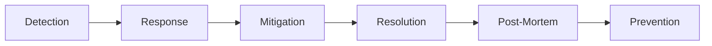

# **Tutorial 12: Incident Management** 🚨

**Master Incident Response Before PagerDuty**

---

## **📋 Table of Contents**

1. [The 3 AM Nightmare](#1-the-3-am-nightmare)
2. [What is Incident Management?](#2-what-is-incident-management)
3. [Incident Severity Levels](#3-incident-severity-levels)
4. [On-Call Best Practices](#4-on-call-best-practices)
5. [Incident Response Process](#5-incident-response-process)
6. [Communication During Incidents](#6-communication-during-incidents)
7. [Post-Mortems](#7-post-mortems)
8. [Interview Q&A](#8-interview-qa)
9. [Challenges](#9-challenges)

---

## **1. The 3 AM Nightmare**

```
Saturday 3:00 AM - Your Phone Rings

PagerDuty Alert: Payment Service Down
You: *Groggy* "What... where... what's happening?"

*Opens laptop, connects to VPN*
*Tries to remember credentials*

3:15 AM - Finally Logged In
  Error logs: "Database connection timeout"
  But which database? Why?
  No runbook, no docs
  
3:30 AM - Calling Team Members
  You: "Database is down, I think?"
  Them: "Which one? What changed?"
  You: "I don't know..."
  
4:00 AM - Still Debugging
  Customers tweeting: "Can't make payments!"
  Revenue loss: $10K per minute
  Pressure mounting
  
5:00 AM - Finally Fixed
  Issue: Database credential rotation, app didn't reload
  Fix: Restart application
  
  Could have been fixed in 5 minutes with proper runbook
  
Manager Monday: "We need better incident management"
```

**Without Incident Management:**
- No clear process
- Slow response time
- Poor communication
- No learning from failures

---

## **2. What is Incident Management?**

### **Definition**

```
Incident: Unplanned interruption or degradation of service

Incident Management: 
  Organized approach to restore service quickly
  Minimize impact
  Learn and prevent recurrence
```

### **Incident Lifecycle**



**Phases:**
1. **Detection** - Alert fires
2. **Response** - Engineer notified
3. **Mitigation** - Immediate fix to reduce impact
4. **Resolution** - Root cause fixed
5. **Post-Mortem** - Learn from incident
6. **Prevention** - Implement safeguards

---

## **3. Incident Severity Levels**

### **Severity Classification**

```
SEV-1 (Critical):
  - Complete service outage
  - Data loss
  - Security breach
  Response: IMMEDIATE
  Example: Payment processing down

SEV-2 (High):
  - Major functionality degraded
  - Significant user impact
  Response: < 30 minutes
  Example: Slow checkout (50% slower)

SEV-3 (Medium):
  - Minor functionality impacted
  - Workaround exists
  Response: < 2 hours
  Example: Search autocomplete broken

SEV-4 (Low):
  - Cosmetic issues
  - No user impact
  Response: Next business day
  Example: Logo misaligned
```

### **Response Matrix**

| Severity | Response Time | Escalation | Communication |
|----------|--------------|------------|---------------|
| **SEV-1** | Immediate | All hands | Public status page |
| **SEV-2** | < 30 min | Team lead | Internal Slack |
| **SEV-3** | < 2 hours | On-call | Ticket tracking |
| **SEV-4** | Next day | None | Email |

---

## **4. On-Call Best Practices**

### **On-Call Rotation**

```
Bad Rotation:
  Same person on-call 24/7
  ❌ Burnout
  ❌ No coverage when sick
  ❌ Reduced quality of life

Good Rotation:
  - Week-long shifts
  - Primary + Secondary on-call
  - Follow-the-sun coverage (global teams)
  - Clear handoff procedures
  
  Example:
    Week 1: Alice (Primary), Bob (Secondary)
    Week 2: Carol (Primary), Dan (Secondary)
    Week 3: Alice (Primary), Bob (Secondary)
```

### **On-Call Compensation**

```
Fair Practices:
  ✅ On-call stipend ($X per week)
  ✅ Overtime pay for incidents
  ✅ Comp time after major incidents
  ✅ Daytime coverage for overnight incidents
  
  Example:
    On-call week: +$500
    Incident (2 AM, 3 hours): +$300 + Comp day
```

### **Reducing Alert Fatigue**

```
Problem: Too many alerts
  Engineer gets 50 alerts/day
  Most are false positives
  Real issues buried in noise
  
Solution: Alert Hygiene
  1. Actionable: Every alert needs action
  2. Meaningful: High signal-to-noise ratio
  3. Contextualized: Include troubleshooting steps
  
  Before: 50 alerts/day, 5% actionable
  After: 5 alerts/day, 90% actionable
```

---

## **5. Incident Response Process**

### **Incident Commander Role**

```
IC Responsibilities:
  1. Assess severity
  2. Coordinate response
  3. Make decisions
  4. Communicate status
  5. Delegate tasks
  6. Track timeline
  
NOT responsible for:
  - Fixing the issue (delegates to experts)
  - Writing code
  - Deep debugging
```

### **Response Workflow**

```
1. Alert Fires (3:00 AM)
   └─> PagerDuty notifies on-call

2. Acknowledge (3:02 AM)
   └─> Engineer acknowledges alert

3. Assess Severity (3:05 AM)
   └─> SEV-1: Payment service down

4. Escalate (3:06 AM)
   └─> Page IC and database expert

5. Create War Room (3:08 AM)
   └─> Slack channel: #incident-2026-05-16-payment-down

6. Investigate (3:10 AM)
   └─> Check logs, metrics, recent changes

7. Mitigate (3:15 AM)
   └─> Rollback recent deployment

8. Verify (3:20 AM)
   └─> Service restored, monitoring metrics

9. Resolve (3:25 AM)
   └─> Update status page
   └─> Notify stakeholders

10. Post-Mortem (Next Day)
    └─> Schedule blameless review
```

### **Runbooks**

```markdown
# Runbook: Payment Service Down

## Symptoms
- Alert: "PaymentService 5xx errors > 10%"
- Users can't complete checkout
- Revenue impacted

## Severity
SEV-1 (Critical)

## Investigation Steps
1. Check service health:
   ```bash
   kubectl get pods -n payment
   ```

2. Check recent deployments:
   ```bash
   kubectl rollout history deployment/payment-service
   ```

3. Check database connectivity:
   ```bash
   kubectl exec -it payment-pod -- nc -zv db-host 3306
   ```

4. Check logs:
   ```bash
   kubectl logs -f deployment/payment-service --tail=100
   ```

## Common Causes
1. Database connection pool exhausted
2. Recent bad deployment
3. Dependency service down
4. Database credentials rotated

## Mitigation Steps
1. If recent deployment:
   ```bash
   kubectl rollout undo deployment/payment-service
   ```

2. If database issue:
   ```bash
   kubectl scale deployment/payment-service --replicas=0
   kubectl scale deployment/payment-service --replicas=5
   ```

3. If dependency down:
   - Enable circuit breaker
   - Route to backup service

## Escalation
- Database issues: @db-team
- Infrastructure: @platform-team
- Security: @security-team

## Validation
1. Check error rate: < 1%
2. Check latency: < 200ms p95
3. Monitor for 15 minutes
4. Update status page
```

---

## **6. Communication During Incidents**

### **Status Page Updates**

```
Good Update (3:05 AM):
  Title: Payment Processing Degraded
  
  We're investigating issues with payment processing.
  Customers may experience delays or failures when
  checking out. Our team is actively working on a fix.
  
  Started: 3:00 AM PST
  Next Update: 3:30 AM PST or when resolved

Good Update (3:20 AM):
  Title: Payment Processing Restored
  
  Payment processing has been restored. The issue was
  caused by a database connectivity problem which has
  been resolved. We're monitoring closely.
  
  Root cause analysis will be published within 48 hours.
  
  Resolved: 3:20 AM PST
  Duration: 20 minutes

Bad Update:
  "We're looking into it"  ❌ Too vague
  No timeline
  No context
```

### **Internal Communication**

```
Slack #incident Channel:

[IC] 3:05 AM: Payment service down, SEV-1 declared
[IC] 3:06 AM: @database-team @platform-team please join
[IC] 3:08 AM: Initial investigation: DB connection timeouts
[DB] 3:10 AM: Checking connection pool metrics
[DB] 3:12 AM: Pool maxed out, no available connections
[IC] 3:13 AM: Options: 1) Increase pool size 2) Restart app
[Platform] 3:14 AM: Recent deploy 10 minutes before incident
[IC] 3:15 AM: Decision: Rolling back deployment
[IC] 3:18 AM: Rollback complete, monitoring
[IC] 3:20 AM: Metrics back to normal, SEV-1 resolved
[IC] 3:25 AM: Post-mortem scheduled for tomorrow 2 PM
```

---

## **7. Post-Mortems**

### **Blameless Post-Mortem Template**

```markdown
# Post-Mortem: Payment Service Outage (2026-05-16)

## Summary
Payment service experienced 20-minute outage affecting
100% of checkout attempts. Caused by database connection
pool exhaustion after recent deployment.

## Impact
- Duration: 20 minutes (3:00 AM - 3:20 AM PST)
- Affected Users: ~1,000 customers
- Failed Transactions: ~500
- Revenue Impact: ~$50,000

## Timeline (All times PST)
- 2:50 AM: Deployment started (v1.2.3)
- 3:00 AM: Alert fired (5xx errors)
- 3:02 AM: On-call acknowledged
- 3:05 AM: SEV-1 declared
- 3:15 AM: Rollback initiated
- 3:20 AM: Service restored

## Root Cause
New code introduced in v1.2.3 had a connection leak.
Each request opened database connection but didn't
close it properly. Pool exhausted after 100 requests.

## Contributing Factors
1. Insufficient load testing in staging
2. No connection pool monitoring alerts
3. Deploy happened during peak traffic hours

## What Went Well
✅ Fast detection (alert fired within 30 seconds)
✅ Quick rollback decision (no extended debugging)
✅ Good communication (timely status updates)

## What Didn't Go Well
❌ Issue not caught in testing
❌ No pre-deployment canary
❌ Deploy during peak hours

## Action Items
1. [Alice] Add connection pool metrics/alerts (Due: 2026-05-20)
2. [Bob] Implement canary deployments (Due: 2026-05-25)
3. [Carol] Add connection leak tests (Due: 2026-05-23)
4. [Team] Define deployment windows (Due: 2026-05-18)
5. [Team] Load test with 2× prod traffic (Due: 2026-05-30)

## Lessons Learned
- Load testing must match or exceed production traffic
- Canary deployments would have limited blast radius
- Connection pool monitoring is critical
- Avoid deploys during peak hours
```

### **Post-Mortem Meeting**

```
Agenda (1 hour):
  1. Timeline Review (10 min)
     - What happened and when
  
  2. Root Cause Analysis (15 min)
     - Why did it happen
     - Contributing factors
  
  3. What Went Well (10 min)
     - Celebrate quick response
  
  4. Improvement Areas (15 min)
     - What could be better
  
  5. Action Items (10 min)
     - Specific, assignable, time-bound

Rules:
  ❌ No blaming individuals
  ✅ Focus on systems and processes
  ✅ Assume good intent
  ✅ Learn and improve
```

---

## **8. Interview Q&A**

### **Q1: Describe your approach to handling a SEV-1 incident**

**✅ Good Answer:**
"First, I acknowledge the alert immediately to confirm I'm responding. I assess the severity—if it's truly SEV-1 with major user impact, I declare an incident and page the incident commander and relevant experts. While they join, I start investigating using runbooks and recent changes. Once the team assembles, I focus on mitigation first—getting service restored—before root cause analysis. We communicate status updates every 15-30 minutes. After resolution, we schedule a blameless post-mortem within 48 hours to learn and prevent recurrence. The key is prioritizing service restoration over perfect understanding during the incident."

**Real Example:**
"At my last company, we had a database outage during Black Friday. Instead of debugging for hours, we switched to our read replica within 10 minutes, restoring service at degraded capacity. We did the full investigation afterward. That decision saved an estimated $500K in lost revenue."

---

### **Q2: How do you prevent alert fatigue?**

**✅ Good Answer:**
"Alert fatigue happens when engineers get too many low-value alerts. I address this through alert hygiene: every alert must be actionable and require human intervention. I regularly review alert patterns—if an alert fires frequently but doesn't require action, I either fix the underlying issue or remove the alert. I also implement alert aggregation to group related alerts and use alert suppression during maintenance windows. Finally, I ensure alerts include context and next steps, so engineers can act quickly rather than investigating what the alert means."

---

## **9. Challenges**

### **Challenge: Design Incident Response**

**Scenario:** Payment API has 10% error rate spike

**Task:** Design response process

<details>
<summary>💡 Solution</summary>

```
Step 1: Assess (1 minute)
  - Check metrics: Error rate, latency, traffic
  - Recent changes: Deployments, config changes
  - Dependencies: Database, external APIs
  
Step 2: Classify Severity (2 minutes)
  10% error rate on payment = SEV-1
  Reason: Revenue impacting, core functionality

Step 3: Declare Incident (3 minutes)
  - Create Slack channel: #incident-payment-errors
  - Page: Incident Commander, Payment Team Lead
  - Update status page: "Investigating payment issues"

Step 4: Investigate (5 minutes)
  - Check recent deployment: v1.5.0 deployed 15 min ago
  - Check logs: Stripe API timeouts
  - Check external status: Stripe status = operational
  
Step 5: Hypothesis (7 minutes)
  New code may have integration issue with Stripe
  Decision: Rollback vs debug

Step 6: Mitigate (10 minutes)
  Decision: Rollback (restore service first)
  Execute: kubectl rollout undo deployment/payment-api
  
Step 7: Verify (15 minutes)
  - Error rate back to < 1%
  - Monitor for 5 minutes
  - Confirm stable

Step 8: Communicate (17 minutes)
  - Update status page: "Resolved"
  - Notify stakeholders
  - Close incident channel

Step 9: Follow-up (Next Day)
  - Schedule post-mortem
  - Action items:
    * Add Stripe API timeout testing
    * Implement canary deployment
    * Add Stripe API health monitoring
```

**XP: +60** 🏆

</details>

---

**Achievement Unlocked**: 🏆 **Incident Commander** (+500 XP)

**Next**: [13: DevSecOps Concepts →](13_DevSecOps_Concepts.md)

**Total XP**: +60 from challenges, +500 achievement = **+560 XP** 🚀
