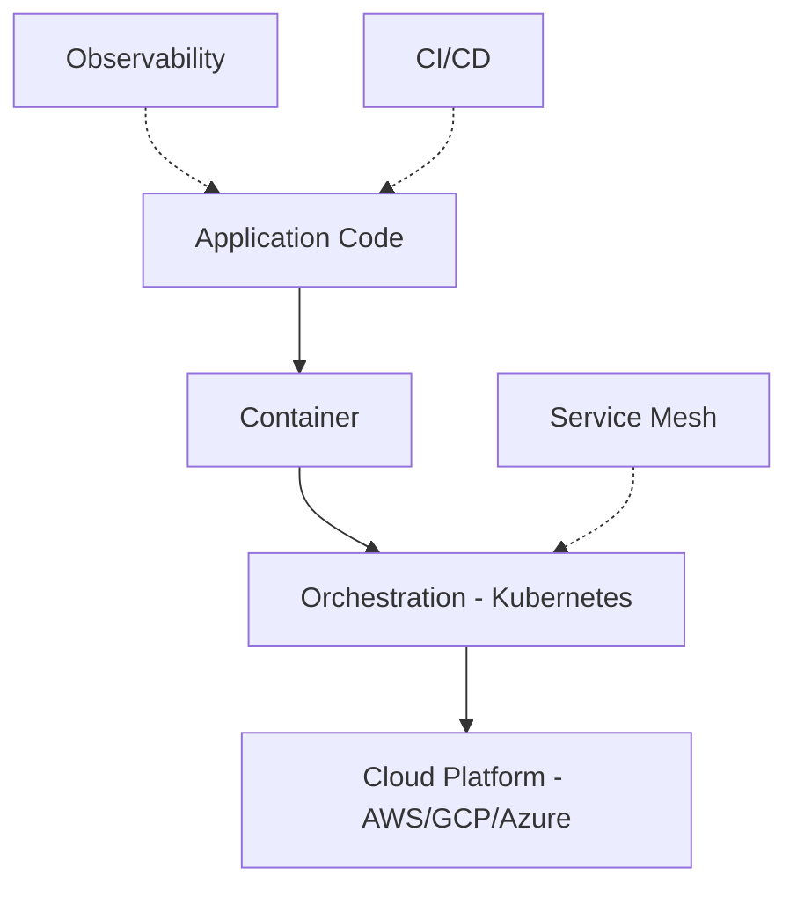
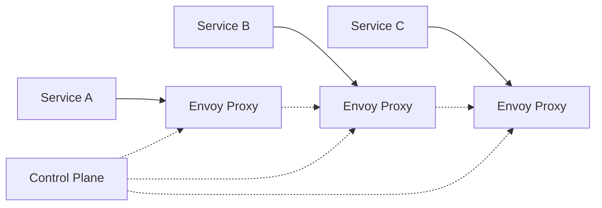

# **Tutorial 14: Cloud Native Concepts** ☁️

**Master Cloud Native Before Kubernetes Deep Dive**

---

## **📋 Table of Contents**

1. [The Monolith Breakdown](#1-the-monolith-breakdown)
2. [What is Cloud Native?](#2-what-is-cloud-native)
3. [The 12-Factor App](#3-the-12-factor-app)
4. [Microservices Patterns](#4-microservices-patterns)
5. [Resilience Patterns](#5-resilience-patterns)
6. [Service Mesh Concepts](#6-service-mesh-concepts)
7. [Cloud Design Patterns](#7-cloud-design-patterns)
8. [Interview Q&A](#8-interview-qa)
9. [Challenges](#9-challenges)

---

## **1. The Monolith Breakdown**

```
E-Commerce Monolith - Friday 2 PM

Deployment: 1 hour downtime for ANY change
  ├─ Update product catalog? Deploy entire app
  ├─ Fix payment bug? Deploy entire app
  └─ Scale Black Friday traffic? Scale entire app

Problem 1: Scaling
  - Product browsing: 10K requests/sec
  - Checkout: 100 requests/sec
  - Must scale ENTIRE app for browsing traffic
  - Wasting 99% of checkout capacity

Problem 2: Reliability
  - Bug in reviews crashes entire site
  - Including checkout, payment, everything
  - Lost revenue: $50K/hour

Problem 3: Development Speed
  - 50 developers working on 1 codebase
  - Merge conflicts daily
  - 1 deploy per week (too risky)
  - Features delayed months

CTO: "We need to modernize"
```

**Problems with Traditional Architecture:**
- Tight coupling
- Cannot scale independently
- Single point of failure
- Slow deployment cycle

---

## **2. What is Cloud Native?**

### **Definition**

```
Cloud Native (CNCF):
  Applications built to run in cloud environments
  
Characteristics:
  ✅ Containerized
  ✅ Dynamically orchestrated
  ✅ Microservices-oriented
  ✅ Designed for resilience
  ✅ Observable
  ✅ Automated
```

### **Cloud Native vs Traditional**

```
Traditional:
  - Monolithic architecture
  - Long-lived servers
  - Manual scaling
  - Scale-up (bigger servers)
  - Vertical scaling
  
Cloud Native:
  - Microservices architecture
  - Ephemeral containers
  - Auto-scaling
  - Scale-out (more instances)
  - Horizontal scaling
```

### **Cloud Native Stack**



---

## **3. The 12-Factor App**

### **Methodology for Cloud Native Apps**

```
I. Codebase
   One codebase tracked in Git
   Many deploys (dev, staging, prod)

II. Dependencies
    Explicitly declare dependencies (pom.xml)
    Never rely on system-wide packages

III. Config
     Store config in environment
     Never hardcode environment-specific values

IV. Backing Services
    Treat databases, queues as attached resources
    Swap via config change, not code change

V. Build, Release, Run
   Strictly separate build and run stages
   Immutable releases

VI. Processes
    Execute app as stateless processes
    Never store session state locally

VII. Port Binding
     Export services via port binding
     Self-contained, not dependent on web server

VIII. Concurrency
      Scale out via process model
      Horizontal scaling preferred

IX. Disposability
    Fast startup, graceful shutdown
    Handle SIGTERM properly

X. Dev/Prod Parity
   Keep development and production similar
   Same databases, same services

XI. Logs
    Treat logs as event streams
    Write to stdout, let platform handle

XII. Admin Processes
     Run admin tasks as one-off processes
     Same environment as app
```

### **Spring Boot 12-Factor Example**

```java
// Factor III: Config from environment
@Configuration
public class DatabaseConfig {
    
    @Value("${database.url}")  // From environment
    private String dbUrl;
    
    @Value("${database.username}")
    private String dbUsername;
    
    @Bean
    public DataSource dataSource() {
        return DataSourceBuilder.create()
            .url(dbUrl)
            .username(dbUsername)
            .build();
    }
}

// Factor VI: Stateless processes
@RestController
public class CartController {
    
    @Autowired
    private RedisTemplate<String, Cart> cartCache;
    
    // ✅ GOOD: Session stored externally
    @GetMapping("/cart")
    public Cart getCart(@RequestParam String sessionId) {
        return cartCache.opsForValue().get(sessionId);
    }
    
    // ❌ BAD: Session stored in memory
    private Map<String, Cart> sessionStorage = new HashMap<>();
}

// Factor IX: Graceful shutdown
@Component
public class GracefulShutdown implements ApplicationListener<ContextClosedEvent> {
    
    @Override
    public void onApplicationEvent(ContextClosedEvent event) {
        // Finish processing current requests
        // Close database connections
        // Flush metrics
        System.out.println("Shutting down gracefully...");
    }
}
```

---

## **4. Microservices Patterns**

### **Domain-Driven Design**

```
E-Commerce Bounded Contexts:

Product Catalog Service
  ├─ Product entity
  ├─ Category management
  └─ Search functionality

Shopping Cart Service
  ├─ Cart entity
  ├─ Add/remove items
  └─ Temporary storage

Order Service
  ├─ Order entity
  ├─ Order state machine
  └─ Order history

Payment Service
  ├─ Payment entity
  ├─ Payment processing
  └─ Refunds

Inventory Service
  ├─ Stock entity
  ├─ Reservation
  └─ Replenishment
```

### **Service Communication**

```
Synchronous (REST/gRPC):
  
  Order Service → Payment Service
  "Process payment for $100"
  ↓
  Wait for response
  ↓
  Continue or rollback

  Pros: Simple, immediate response
  Cons: Tight coupling, cascading failures

Asynchronous (Events/Messages):
  
  Order Service → Event Bus → Payment Service
  "OrderCreated event"
  ↓
  Don't wait
  ↓
  Continue processing
  
  Payment Service processes later
  "PaymentProcessed event"
  
  Pros: Loose coupling, resilient
  Cons: Eventual consistency, complexity
```

### **Spring Boot Microservices**

```java
// Order Service
@RestController
@RequestMapping("/orders")
public class OrderController {
    
    @Autowired
    private RestTemplate restTemplate;
    
    @Autowired
    private KafkaTemplate<String, OrderEvent> kafkaTemplate;
    
    @PostMapping
    public Order createOrder(@RequestBody OrderRequest request) {
        
        // 1. Create order
        Order order = orderRepository.save(new Order(request));
        
        // 2. Publish event (asynchronous)
        OrderCreatedEvent event = new OrderCreatedEvent(order);
        kafkaTemplate.send("orders", event);
        
        return order;
    }
}

// Payment Service (event listener)
@Service
public class PaymentEventListener {
    
    @KafkaListener(topics = "orders")
    public void handleOrderCreated(OrderCreatedEvent event) {
        
        // Process payment asynchronously
        PaymentResult result = paymentGateway.process(event.getAmount());
        
        // Publish payment result
        if (result.isSuccess()) {
            kafkaTemplate.send("payments", 
                new PaymentSuccessEvent(event.getOrderId()));
        } else {
            kafkaTemplate.send("payments",
                new PaymentFailedEvent(event.getOrderId()));
        }
    }
}
```

---

## **5. Resilience Patterns**

### **Circuit Breaker**

```
Problem: Payment API is down
  Without Circuit Breaker:
    Every request waits 30 seconds (timeout)
    100 requests = 3000 seconds wasted
    Thread pool exhausted
    Entire service crashes

  With Circuit Breaker:
    After 5 failures, circuit "opens"
    Fast-fail immediately (no waiting)
    Retry after 30 seconds
    Gradual recovery
```

```java
@Service
public class PaymentService {
    
    @CircuitBreaker(name = "payment", fallbackMethod = "fallbackPayment")
    @Retry(name = "payment", fallbackMethod = "fallbackPayment")
    @Timeout(name = "payment")
    public PaymentResult processPayment(PaymentRequest request) {
        // Call external payment API
        return paymentClient.charge(request);
    }
    
    // Fallback: Return cached result or queue for later
    private PaymentResult fallbackPayment(PaymentRequest request, Exception e) {
        logger.error("Payment failed, using fallback", e);
        
        // Queue for async processing
        paymentQueue.add(request);
        
        return PaymentResult.pending("Queued for processing");
    }
}

// application.yml
resilience4j:
  circuitbreaker:
    instances:
      payment:
        slidingWindowSize: 10
        failureRateThreshold: 50  # 50% failures opens circuit
        waitDurationInOpenState: 30s
        permittedNumberOfCallsInHalfOpenState: 3
```

### **Retry with Exponential Backoff**

```java
@Service
public class InventoryService {
    
    @Retryable(
        value = {TransientException.class},
        maxAttempts = 5,
        backoff = @Backoff(
            delay = 1000,      // Start: 1 second
            multiplier = 2,    // Double each time
            maxDelay = 30000   // Max: 30 seconds
        )
    )
    public void reserveStock(String productId, int quantity) {
        // May fail temporarily, retry automatically
        inventoryClient.reserve(productId, quantity);
    }
    
    @Recover
    public void recoverReserveStock(TransientException e, String productId) {
        // After all retries failed
        logger.error("Failed to reserve stock after retries", e);
        throw new OutOfStockException(productId);
    }
}

/*
Retry Pattern:
  Attempt 1: Immediate
  Attempt 2: Wait 1 second
  Attempt 3: Wait 2 seconds
  Attempt 4: Wait 4 seconds
  Attempt 5: Wait 8 seconds
  Total: ~15 seconds
*/
```

### **Bulkhead Pattern**

```java
// Isolate thread pools to prevent cascade failures

@Configuration
public class ThreadPoolConfig {
    
    @Bean(name = "paymentExecutor")
    public Executor paymentExecutor() {
        ThreadPoolTaskExecutor executor = new ThreadPoolTaskExecutor();
        executor.setCorePoolSize(10);
        executor.setMaxPoolSize(20);
        executor.setQueueCapacity(50);
        executor.setThreadNamePrefix("payment-");
        executor.initialize();
        return executor;
    }
    
    @Bean(name = "inventoryExecutor")
    public Executor inventoryExecutor() {
        ThreadPoolTaskExecutor executor = new ThreadPoolTaskExecutor();
        executor.setCorePoolSize(10);
        executor.setMaxPoolSize(20);
        executor.setQueueCapacity(50);
        executor.setThreadNamePrefix("inventory-");
        executor.initialize();
        return executor;
    }
}

@Service
public class OrderService {
    
    @Async("paymentExecutor")  // Separate thread pool
    public CompletableFuture<PaymentResult> processPayment(Order order) {
        return CompletableFuture.completedFuture(
            paymentService.process(order)
        );
    }
    
    @Async("inventoryExecutor")  // Separate thread pool
    public CompletableFuture<Void> reserveInventory(Order order) {
        inventoryService.reserve(order);
        return CompletableFuture.completedFuture(null);
    }
}

/*
Benefit: If payment API is slow, only payment threads are blocked
         Inventory continues working normally
*/
```

---

## **6. Service Mesh Concepts**

### **What is a Service Mesh?**

```
Without Service Mesh:
  Each service implements:
    ├─ Load balancing
    ├─ Circuit breakers
    ├─ Retries
    ├─ Monitoring
    ├─ Security (mTLS)
    └─ Distributed tracing
  
  Code in every service
  Hard to maintain
  Inconsistent across services

With Service Mesh:
  Sidecar proxy handles:
    ├─ Load balancing
    ├─ Circuit breakers
    ├─ Retries
    ├─ Monitoring
    ├─ Security (mTLS)
    └─ Distributed tracing
  
  Infrastructure concern
  Consistent across services
  No code changes needed
```

### **Service Mesh Architecture**



**Components:**
- **Data Plane**: Envoy proxies handling traffic
- **Control Plane**: Configures proxies (Istio, Linkerd)

---

## **7. Cloud Design Patterns**

### **Strangler Fig Pattern**

```
Migrating Monolith → Microservices

Month 1: Route new feature to microservice
  ┌──────────────┐
  │  Monolith    │ ← Existing traffic
  │  (Catalog,   │
  │   Payment)   │
  └──────────────┘
  
  ┌──────────────┐
  │  Cart        │ ← New traffic only
  │  Service     │
  └──────────────┘

Month 3: Migrate catalog
  ┌──────────────┐
  │  Monolith    │ ← Payment only
  │  (Payment)   │
  └──────────────┘
  
  ┌──────────────┐
  │  Catalog     │ ← Migrated
  │  Service     │
  └──────────────┘
  
  ┌──────────────┐
  │  Cart        │
  │  Service     │
  └──────────────┘

Month 6: Complete
  ┌──────────────┐
  │  Payment     │
  │  Service     │
  └──────────────┘
  
  ┌──────────────┐
  │  Catalog     │
  │  Service     │
  └──────────────┘
  
  ┌──────────────┐
  │  Cart        │
  │  Service     │
  └──────────────┘
  
  Monolith retired
```

### **CQRS (Command Query Responsibility Segregation)**

```java
// Separate read and write models

// Write Model (Commands)
@Service
public class OrderCommandService {
    
    @Autowired
    private OrderRepository orderRepository;
    
    @Autowired
    private EventPublisher eventPublisher;
    
    public Order createOrder(CreateOrderCommand command) {
        Order order = new Order(command);
        orderRepository.save(order);
        
        // Publish event for read model
        eventPublisher.publish(new OrderCreatedEvent(order));
        
        return order;
    }
}

// Read Model (Queries) - Optimized for reads
@Service
public class OrderQueryService {
    
    @Autowired
    private OrderReadRepository readRepository;  // Denormalized
    
    public List<OrderSummary> getOrderHistory(String customerId) {
        // Fast read from denormalized view
        return readRepository.findByCustomerId(customerId);
    }
    
    @EventListener
    public void handleOrderCreated(OrderCreatedEvent event) {
        // Update read model
        OrderSummary summary = new OrderSummary(event);
        readRepository.save(summary);
    }
}

/*
Benefits:
  - Write model: Normalized, complex business logic
  - Read model: Denormalized, fast queries
  - Scale independently
*/
```

---

## **8. Interview Q&A**

### **Q1: Explain circuit breaker pattern and when to use it**

**✅ Good Answer:**
"Circuit breaker prevents cascading failures when calling external services. It has three states: closed (normal), open (failing fast), and half-open (testing recovery). When failure rate exceeds threshold, the circuit opens and immediately fails requests without calling the service, giving it time to recover. After a timeout, it enters half-open state and allows a few test requests. If they succeed, circuit closes; if they fail, it stays open. I use it for external API calls, database queries, or any I/O operation that can fail or timeout. In Spring Boot, I use Resilience4j's @CircuitBreaker annotation with appropriate thresholds and fallback methods."

---

### **Q2: What are the trade-offs of microservices architecture?**

**✅ Good Answer:**
"Microservices solve scalability and team autonomy but introduce complexity. Benefits: independent deployment, technology diversity, fault isolation, team autonomy, and granular scaling. Trade-offs: distributed system complexity, network latency, eventual consistency, harder debugging with distributed tracing needed, operational overhead with more services to deploy and monitor, and data consistency challenges across services. I recommend microservices when you have large teams, need independent scaling, or require technology flexibility. For small teams or simple applications, a well-structured monolith is often better."

---

## **9. Challenges**

### **Challenge: Design Resilient Microservices**

**Scenario:** Payment service calls external Stripe API. Design resilient integration.

<details>
<summary>💡 Solution</summary>

```java
@Configuration
public class ResilienceConfig {
    
    @Bean
    public Customizer<Resilience4JCircuitBreakerFactory> circuitBreakerCustomizer() {
        return factory -> factory.configureDefault(id -> new Resilience4JConfigBuilder(id)
            .circuitBreakerConfig(CircuitBreakerConfig.custom()
                .slidingWindowSize(10)
                .failureRateThreshold(50)
                .waitDurationInOpenState(Duration.ofSeconds(30))
                .permittedNumberOfCallsInHalfOpenState(3)
                .build())
            .timeLimiterConfig(TimeLimiterConfig.custom()
                .timeoutDuration(Duration.ofSeconds(5))
                .build())
            .build());
    }
}

@Service
public class PaymentService {
    
    @Autowired
    private CircuitBreakerFactory circuitBreakerFactory;
    
    @Autowired
    private StripeClient stripeClient;
    
    @Autowired
    private PaymentQueue paymentQueue;
    
    public PaymentResult processPayment(PaymentRequest request) {
        
        CircuitBreaker circuitBreaker = circuitBreakerFactory.create("stripe");
        
        try {
            return circuitBreaker.run(
                () -> processWithRetry(request),
                throwable -> fallbackPayment(request, throwable)
            );
        } catch (Exception e) {
            return fallbackPayment(request, e);
        }
    }
    
    @Retryable(
        value = {TransientException.class},
        maxAttempts = 3,
        backoff = @Backoff(delay = 1000, multiplier = 2)
    )
    private PaymentResult processWithRetry(PaymentRequest request) {
        return stripeClient.charge(request);
    }
    
    private PaymentResult fallbackPayment(PaymentRequest request, Throwable e) {
        logger.error("Payment processing failed, queueing for later", e);
        
        // Queue for asynchronous processing
        paymentQueue.enqueue(request);
        
        // Return pending status
        return PaymentResult.builder()
            .status("PENDING")
            .message("Payment queued for processing")
            .build();
    }
}

// Background processor for queued payments
@Component
public class PaymentQueueProcessor {
    
    @Scheduled(fixedDelay = 60000)  // Every minute
    public void processQueue() {
        List<PaymentRequest> pending = paymentQueue.getPending();
        
        for (PaymentRequest request : pending) {
            try {
                PaymentResult result = stripeClient.charge(request);
                
                if (result.isSuccess()) {
                    paymentQueue.markComplete(request);
                    eventPublisher.publish(new PaymentSuccessEvent(request));
                }
            } catch (Exception e) {
                logger.warn("Retry failed, will try again", e);
            }
        }
    }
}
```

**Resilience Features:**
1. ✅ Circuit Breaker (prevent cascading failures)
2. ✅ Retry with backoff (transient failures)
3. ✅ Timeout (prevent hanging)
4. ✅ Fallback (queue for later)
5. ✅ Async processing (eventual consistency)
6. ✅ Event publishing (notify other services)

**XP: +90** 🏆

</details>

---

**Achievement Unlocked**: 🏆 **Cloud Native Architect** (+700 XP)

**Next**: [15: GitOps Concepts →](15_GitOps_Concepts.md)

**Total XP**: +90 from challenges, +700 achievement = **+790 XP** 🚀
