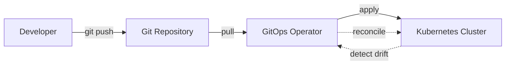

# **Tutorial 15: GitOps Concepts** 🔄

**Master GitOps Before ArgoCD/Flux**

---

## **📋 Table of Contents**

1. [The Configuration Drift Nightmare](#1-the-configuration-drift-nightmare)
2. [What is GitOps?](#2-what-is-gitops)
3. [GitOps Principles](#3-gitops-principles)
4. [Declarative Infrastructure](#4-declarative-infrastructure)
5. [Git as Source of Truth](#5-git-as-source-of-truth)
6. [Continuous Reconciliation](#6-continuous-reconciliation)
7. [GitOps Workflows](#7-gitops-workflows)
8. [Interview Q&A](#8-interview-qa)
9. [Challenges](#9-challenges)

---

## **1. The Configuration Drift Nightmare**

```
Monday Morning Production Issue

DevOps Team: "Production is configured differently than staging!"

Investigation:
  Staging: 3 replicas, 2GB memory
  Production: 5 replicas, 4GB memory
  
You: "Who changed production?"
Team: "Someone kubectl edited the deployment last week"
You: "Where's the documentation?"
Team: "There isn't any"

Problem:
  ❌ No record of who changed what
  ❌ No way to reproduce configuration
  ❌ Staging ≠ Production (can't test properly)
  ❌ Disaster recovery = guessing
  
More Issues:
  - Kubernetes manifest in Git says 3 replicas
  - Production actually has 5 replicas
  - Which is correct? Git or cluster?
  - How do we fix?
  
CTO: "We need configuration management, not configuration chaos"
```

**Without GitOps:**
- Manual kubectl commands
- Configuration drift
- No audit trail
- Difficult disaster recovery

---

## **2. What is GitOps?**

### **Definition**

```
GitOps:
  Operational model where Git is the single source of truth
  for declarative infrastructure and applications
  
  "If it's not in Git, it's not real"

Core Idea:
  Git Repository → Desired State
  Kubernetes Cluster → Actual State
  GitOps Operator → Ensures Actual = Desired
```

### **GitOps vs Traditional Deployment**

```
Traditional (Push Model):
  Developer → CI/CD Pipeline → kubectl apply → Cluster
               ↑
          Direct access to cluster
          Manual commands possible
          Drift can occur

GitOps (Pull Model):
  Developer → Git Repository ← GitOps Operator ← Cluster
                              ↑
                    Continuously syncs
                    No direct cluster access
                    Automatic drift correction
```

### **Benefits**

```
✅ Version Control
   Every change tracked in Git
   Full audit trail (who, what, when, why)

✅ Reproducibility
   Disaster recovery = git clone + apply
   Spin up new environment from Git

✅ Rollback
   git revert = instant rollback
   No complex procedures

✅ Collaboration
   Code review for infrastructure
   Pull requests for changes
   Approval workflows

✅ Security
   No direct cluster access needed
   GitOps operator has credentials
   Developers only push to Git
```

---

## **3. GitOps Principles**

### **Four Core Principles**

```
1. Declarative
   Describe desired state, not commands
   
   ❌ Imperative (kubectl):
      kubectl create deployment app --image=app:v1
      kubectl scale deployment app --replicas=3
      kubectl set image deployment/app app=app:v2
   
   ✅ Declarative (YAML):
      apiVersion: apps/v1
      kind: Deployment
      metadata:
        name: app
      spec:
        replicas: 3
        template:
          spec:
            containers:
            - name: app
              image: app:v2

2. Versioned and Immutable
   Git commits are immutable
   Full history preserved
   
3. Pulled Automatically
   GitOps operator pulls from Git
   Not pushed from CI/CD
   
4. Continuously Reconciled
   Operator detects drift
   Automatically corrects to match Git
```

### **GitOps Architecture**



---

## **4. Declarative Infrastructure**

### **Kubernetes Manifests**

```yaml
# deployment.yaml
apiVersion: apps/v1
kind: Deployment
metadata:
  name: payment-service
  namespace: production
  labels:
    app: payment
    version: v1.2.3
spec:
  replicas: 5
  selector:
    matchLabels:
      app: payment
  template:
    metadata:
      labels:
        app: payment
        version: v1.2.3
    spec:
      containers:
      - name: payment
        image: payment-service:v1.2.3
        ports:
        - containerPort: 8080
        env:
        - name: DATABASE_URL
          valueFrom:
            configMapKeyRef:
              name: app-config
              key: database-url
        - name: DATABASE_PASSWORD
          valueFrom:
            secretKeyRef:
              name: db-credentials
              key: password
        resources:
          requests:
            memory: "2Gi"
            cpu: "1000m"
          limits:
            memory: "4Gi"
            cpu: "2000m"
        livenessProbe:
          httpGet:
            path: /health/liveness
            port: 8080
          initialDelaySeconds: 30
          periodSeconds: 10
        readinessProbe:
          httpGet:
            path: /health/readiness
            port: 8080
          initialDelaySeconds: 10
          periodSeconds: 5

---
# service.yaml
apiVersion: v1
kind: Service
metadata:
  name: payment-service
  namespace: production
spec:
  selector:
    app: payment
  ports:
  - protocol: TCP
    port: 80
    targetPort: 8080
  type: LoadBalancer

---
# hpa.yaml
apiVersion: autoscaling/v2
kind: HorizontalPodAutoscaler
metadata:
  name: payment-hpa
  namespace: production
spec:
  scaleTargetRef:
    apiVersion: apps/v1
    kind: Deployment
    name: payment-service
  minReplicas: 5
  maxReplicas: 20
  metrics:
  - type: Resource
    resource:
      name: cpu
      target:
        type: Utilization
        averageUtilization: 70
```

---

## **5. Git as Source of Truth**

### **Repository Structure**

```
gitops-repo/
├── apps/
│   ├── payment-service/
│   │   ├── base/
│   │   │   ├── deployment.yaml
│   │   │   ├── service.yaml
│   │   │   └── kustomization.yaml
│   │   ├── overlays/
│   │   │   ├── development/
│   │   │   │   ├── kustomization.yaml
│   │   │   │   └── replicas.yaml
│   │   │   ├── staging/
│   │   │   │   ├── kustomization.yaml
│   │   │   │   └── replicas.yaml
│   │   │   └── production/
│   │   │       ├── kustomization.yaml
│   │   │       └── replicas.yaml
│   └── catalog-service/
│       └── ...
├── infrastructure/
│   ├── namespaces.yaml
│   ├── rbac.yaml
│   └── network-policies.yaml
└── README.md
```

### **Environment-Specific Configuration (Kustomize)**

```yaml
# apps/payment-service/base/kustomization.yaml
apiVersion: kustomize.config.k8s.io/v1beta1
kind: Kustomization

resources:
- deployment.yaml
- service.yaml

---
# apps/payment-service/overlays/production/kustomization.yaml
apiVersion: kustomize.config.k8s.io/v1beta1
kind: Kustomization

bases:
- ../../base

replicas:
- name: payment-service
  count: 5  # Production: 5 replicas

patches:
- patch: |-
    apiVersion: apps/v1
    kind: Deployment
    metadata:
      name: payment-service
    spec:
      template:
        spec:
          containers:
          - name: payment
            resources:
              requests:
                memory: "2Gi"
                cpu: "1000m"
              limits:
                memory: "4Gi"
                cpu: "2000m"

---
# apps/payment-service/overlays/development/kustomization.yaml
apiVersion: kustomize.config.k8s.io/v1beta1
kind: Kustomization

bases:
- ../../base

replicas:
- name: payment-service
  count: 1  # Dev: 1 replica

patches:
- patch: |-
    apiVersion: apps/v1
    kind: Deployment
    metadata:
      name: payment-service
    spec:
      template:
        spec:
          containers:
          - name: payment
            resources:
              requests:
                memory: "512Mi"
                cpu: "250m"
              limits:
                memory: "1Gi"
                cpu: "500m"
```

---

## **6. Continuous Reconciliation**

### **Drift Detection**

```
Scenario: Someone manually edited production

Git Repository (Desired State):
  replicas: 5
  image: payment:v1.2.3

Kubernetes Cluster (Actual State):
  replicas: 10  ← Someone scaled manually
  image: payment:v1.2.3

GitOps Operator Detects Drift:
  1. Fetch from Git: replicas should be 5
  2. Check cluster: replicas is 10
  3. Detect mismatch
  4. Reconcile: Scale back to 5
  
Result: Cluster always matches Git
```

### **Auto-Healing**

```
Example: Node Failure

1. Node fails, pods crash
2. GitOps operator detects actual < desired
3. Automatically recreates pods on healthy nodes
4. No manual intervention needed

Manual Change:
1. Engineer runs: kubectl delete deployment payment
2. GitOps operator detects deployment missing
3. Automatically recreates from Git
4. "You can't break what Git will fix"
```

---

## **7. GitOps Workflows**

### **Deployment Workflow**

```
1. Developer Makes Change
   ├─ Update deployment.yaml
   ├─ image: payment:v1.2.3 → payment:v1.2.4
   └─ git commit -m "Update payment to v1.2.4"

2. Create Pull Request
   ├─ Code review
   ├─ Check manifest syntax
   └─ Approve changes

3. Merge to Main
   └─ git merge feature-branch

4. GitOps Operator Detects Change
   ├─ Polls Git every 3 minutes
   ├─ Detects new commit
   └─ Fetches updated manifest

5. Apply to Cluster
   ├─ kubectl apply -f deployment.yaml
   ├─ Rolling update starts
   └─ Monitors health

6. Verify Deployment
   ├─ All pods healthy?
   ├─ Metrics normal?
   └─ Mark as synced
```

### **Rollback Workflow**

```
Problem: v1.2.4 has bugs

Traditional Rollback:
  kubectl rollout undo deployment/payment
  BUT: Now cluster ≠ Git
  Manual work to update Git

GitOps Rollback:
  git revert <commit-hash>
  git push
  
  GitOps operator:
    1. Detects revert commit
    2. Applies old version
    3. Cluster rolled back
  
  Result: Single source of truth maintained
```

### **Multi-Cluster Management**

```
gitops-repo/
├── clusters/
│   ├── us-east-1/
│   │   ├── apps/
│   │   └── infrastructure/
│   ├── us-west-2/
│   │   ├── apps/
│   │   └── infrastructure/
│   └── eu-west-1/
│       ├── apps/
│       └── infrastructure/

Each cluster has GitOps operator:
  us-east-1 operator → monitors clusters/us-east-1/
  us-west-2 operator → monitors clusters/us-west-2/
  eu-west-1 operator → monitors clusters/eu-west-1/

Deploy to all regions:
  cp -r apps/payment-service clusters/*/apps/
  git commit -am "Deploy payment globally"
  git push
  
  All clusters update automatically
```

---

## **8. Interview Q&A**

### **Q1: Explain GitOps and its benefits**

**✅ Good Answer:**
"GitOps treats Git as the single source of truth for infrastructure and application configuration. Instead of manually applying changes with kubectl or through CI/CD pipelines pushing to clusters, a GitOps operator continuously pulls from Git and ensures the cluster state matches what's declared in the repository. Benefits include complete audit trail since every change is a Git commit, easy rollbacks with git revert, reproducible environments where disaster recovery is just git clone and sync, and improved security since developers don't need direct cluster access. The operator handles drift detection and auto-healing, so manual changes are automatically reverted to match Git."

**Real Example:**
"At my previous company, we migrated to GitOps with ArgoCD. Before, we had constant configuration drift where production didn't match our manifests. After GitOps, all changes went through pull requests with review, and the cluster automatically corrected any manual changes. When we had a data center migration, spinning up the new cluster was just pointing ArgoCD at our Git repo—everything deployed automatically in minutes instead of days of manual work."

---

### **Q2: What's the difference between push-based and pull-based deployment?**

**✅ Good Answer:**
"Push-based deployment is traditional CI/CD where the pipeline has cluster credentials and pushes changes after build and test. Pull-based is GitOps where an operator inside the cluster pulls from Git. Push is simpler but creates security concerns since CI/CD needs cluster access, makes drift detection harder, and couples deployment to CI/CD pipeline. Pull-based is more secure with minimal cluster credentials exposure, automatically detects and corrects drift, separates concerns between CI/CD and deployment, and enables multi-cluster management more easily. I prefer pull-based GitOps for production environments, but push-based can work for smaller projects or specific use cases like temporary environments."

---

## **9. Challenges**

### **Challenge: Design GitOps Repository**

**Task:** Structure GitOps repo for multi-environment Java microservices

<details>
<summary>💡 Solution</summary>

```
gitops-infrastructure/
├── README.md
├── .argocd/
│   ├── app-of-apps.yaml          # ArgoCD Application of Applications
│   └── projects.yaml
│
├── infrastructure/
│   ├── base/
│   │   ├── namespaces/
│   │   │   ├── development.yaml
│   │   │   ├── staging.yaml
│   │   │   └── production.yaml
│   │   ├── rbac/
│   │   │   ├── roles.yaml
│   │   │   └── bindings.yaml
│   │   └── network-policies/
│   │       └── default-deny.yaml
│   └── overlays/
│       ├── development/
│       ├── staging/
│       └── production/
│
├── apps/
│   ├── payment-service/
│   │   ├── base/
│   │   │   ├── deployment.yaml
│   │   │   ├── service.yaml
│   │   │   ├── configmap.yaml
│   │   │   ├── hpa.yaml
│   │   │   └── kustomization.yaml
│   │   └── overlays/
│   │       ├── development/
│   │       │   ├── kustomization.yaml
│   │       │   ├── replicas-patch.yaml       # 1 replica
│   │       │   └── resources-patch.yaml      # 512Mi/250m CPU
│   │       ├── staging/
│   │       │   ├── kustomization.yaml
│   │       │   ├── replicas-patch.yaml       # 2 replicas
│   │       │   └── resources-patch.yaml      # 1Gi/500m CPU
│   │       └── production/
│   │           ├── kustomization.yaml
│   │           ├── replicas-patch.yaml       # 5 replicas
│   │           ├── resources-patch.yaml      # 2Gi/1000m CPU
│   │           └── hpa-patch.yaml            # Max 20 replicas
│   │
│   ├── order-service/
│   │   └── ... (same structure)
│   │
│   └── catalog-service/
│       └── ... (same structure)
│
└── environments/
    ├── development/
    │   ├── payment-service.yaml      # ArgoCD Application
    │   ├── order-service.yaml
    │   └── catalog-service.yaml
    ├── staging/
    │   └── ... (same apps)
    └── production/
        └── ... (same apps)
```

```yaml
# .argocd/app-of-apps.yaml
apiVersion: argoproj.io/v1alpha1
kind: Application
metadata:
  name: production-apps
  namespace: argocd
spec:
  project: default
  source:
    repoURL: https://github.com/company/gitops-infrastructure
    targetRevision: main
    path: environments/production
  destination:
    server: https://kubernetes.default.svc
    namespace: argocd
  syncPolicy:
    automated:
      prune: true
      selfHeal: true
      allowEmpty: false
    syncOptions:
    - CreateNamespace=true
    retry:
      limit: 5
      backoff:
        duration: 5s
        factor: 2
        maxDuration: 3m

---
# environments/production/payment-service.yaml
apiVersion: argoproj.io/v1alpha1
kind: Application
metadata:
  name: payment-service
  namespace: argocd
spec:
  project: default
  source:
    repoURL: https://github.com/company/gitops-infrastructure
    targetRevision: main
    path: apps/payment-service/overlays/production
  destination:
    server: https://kubernetes.default.svc
    namespace: production
  syncPolicy:
    automated:
      prune: true
      selfHeal: true
    syncOptions:
    - CreateNamespace=true
  health:
    enabled: true

---
# apps/payment-service/base/deployment.yaml
apiVersion: apps/v1
kind: Deployment
metadata:
  name: payment-service
spec:
  replicas: 1  # Override in overlays
  selector:
    matchLabels:
      app: payment-service
  template:
    metadata:
      labels:
        app: payment-service
    spec:
      containers:
      - name: payment
        image: payment-service:latest  # Override with Kustomize
        ports:
        - containerPort: 8080
        env:
        - name: SPRING_PROFILES_ACTIVE
          value: "production"
        envFrom:
        - configMapRef:
            name: payment-config
        - secretRef:
            name: payment-secrets
        resources:
          requests:
            memory: "512Mi"
            cpu: "250m"
          limits:
            memory: "1Gi"
            cpu: "500m"
        livenessProbe:
          httpGet:
            path: /actuator/health/liveness
            port: 8080
          initialDelaySeconds: 30
        readinessProbe:
          httpGet:
            path: /actuator/health/readiness
            port: 8080
          initialDelaySeconds: 10

---
# apps/payment-service/overlays/production/kustomization.yaml
apiVersion: kustomize.config.k8s.io/v1beta1
kind: Kustomization

namespace: production

bases:
- ../../base

replicas:
- name: payment-service
  count: 5

images:
- name: payment-service
  newName: gcr.io/company/payment-service
  newTag: v1.2.3

patches:
- path: resources-patch.yaml
- path: hpa-patch.yaml

---
# apps/payment-service/overlays/production/resources-patch.yaml
apiVersion: apps/v1
kind: Deployment
metadata:
  name: payment-service
spec:
  template:
    spec:
      containers:
      - name: payment
        resources:
          requests:
            memory: "2Gi"
            cpu: "1000m"
          limits:
            memory: "4Gi"
            cpu: "2000m"
```

**Workflow:**
1. Developer updates image tag in `production/kustomization.yaml`
2. Create PR, get approval
3. Merge to main
4. ArgoCD detects change
5. Syncs to production cluster
6. Health checks validate deployment

**XP: +100** 🏆

</details>

---

**Achievement Unlocked**: 🏆 **GitOps Master** (+800 XP)

**Next**: [17: Tool Selection Guide →](17_Tool_Selection_Guide.md)

**Total XP**: +100 from challenges, +800 achievement = **+900 XP** 🚀
