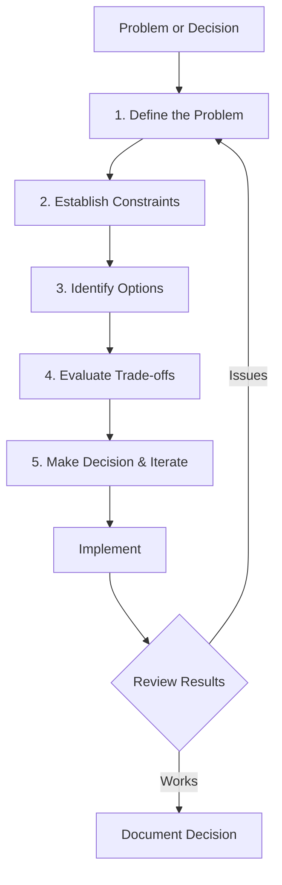

# **DevOps Problem-Solving Framework** 🧩

**Making Smart Technical Decisions (The Meta-Skill That Ties Everything Together!)**

---

## **Table of Contents** 📑
1. [The Decision Paralysis Problem](#1-the-decision-paralysis-problem)
2. [The DevOps Decision Framework](#2-the-devops-decision-framework)
3. [When to Use Which Tool](#3-when-to-use-which-tool)
4. [Trade-off Analysis](#4-trade-off-analysis)
5. [The Build vs Buy Decision](#5-the-build-vs-buy-decision)
6. [Debugging Complex Systems](#6-debugging-complex-systems)
7. [Real-World Problem-Solving](#7-real-world-problem-solving)
8. [For Java Developers](#8-for-java-developers)
9. [Gamified Challenges](#9-gamified-challenges)
10. [Anti-Patterns to Avoid](#10-anti-patterns-to-avoid)
11. [Interview Preparation](#11-interview-preparation)
12. [Key Takeaways](#12-key-takeaways)

---

## **1. The Decision Paralysis Problem** 😰

### **🎬 Scene: The Tool-Obsessed Engineer**

```
New Project Meeting:

Manager: "We need to set up CI/CD."

Engineer: "Sure! Which tool should we use?"
  
Options:
  - Jenkins
  - GitLab CI
  - GitHub Actions
  - CircleCI
  - Travis CI
  - Azure DevOps
  - Argo CD
  - Drone
  - Bamboo
  - TeamCity
  ... (20+ more options)

Engineer spends 3 weeks:
  - Reading comparisons
  - Watching tutorial videos
  - Testing each tool
  - Still can't decide
  
Manager: "It's been 3 weeks. Any progress?"

Engineer: "Still evaluating tools. Did you know GitLab CI has better YAML syntax?"

Manager: "But do we use GitLab?"

Engineer: "No, we use GitHub."

Manager: 😑

3 months later:
  - Still no CI/CD
  - 47 tools evaluated
  - Analysis paralysis
  - Team frustrated

The Real Problem:
  ❌ Focused on tools
  ❌ Not focused on problem
  ❌ No decision framework
  ❌ Chasing "perfect" solution
```

### **The Cost** 💸

```
Analysis Paralysis Costs:

Time Cost:
  Engineer salary: $100,000/year
  3 months wasted: $25,000
  Opportunity cost: $50,000 (what could have been built)

Business Cost:
  No automated deployments
  Manual process continues
  Slower releases
  More errors
  Frustrated team

The Irony:
  Any of the top 3 tools would have worked fine!
  The "perfect" tool doesn't exist
  Done > Perfect
  
Better approach:
  Week 1: Define requirements
  Week 2: Pick tool (top 2-3 all similar)
  Week 3: Implement
  Week 4: Already deploying! ✅
```

### **The Core Problem** 🎯

```
Why Do We Struggle With Decisions?

Problem 1: Tool-First Thinking
  "What tool should I use?"
  
  Should be:
  "What problem am I solving?"

Problem 2: No Framework
  Random evaluation
  No consistent criteria
  Easily swayed by hype

Problem 3: Fear of Wrong Choice
  "What if I pick the wrong tool?"
  
  Truth:
  - Most tools are 80% similar
  - Switching later is possible
  - Learning concepts > learning tools

Problem 4: Ignoring Context
  "X company uses Kubernetes, so should we!"
  
  Reality:
  - Netflix scale ≠ Your startup scale
  - Their problems ≠ Your problems
  - Context matters!

We need a FRAMEWORK for making decisions!
```

---

## **2. The DevOps Decision Framework** 🧠

### **The 5-Step Framework** 📋



### **Step 1: Define the Problem** 🎯

```
Bad: "We need Kubernetes"
  This is a solution, not a problem!

Good: "We need to deploy 20 microservices reliably"
  This is the actual problem

Questions to Ask:
  1. What problem am I solving?
     Not: "Which CI/CD tool?"
     But: "How do we deploy faster with fewer errors?"
  
  2. Who is affected?
     Developers? Operations? Customers?
  
  3. What's the current pain?
     Manual deployments take 4 hours
     Errors happen 30% of the time
     Only 1 person knows how to deploy
  
  4. What does success look like?
     Deployments: 15 minutes
     Errors: < 5%
     Anyone on team can deploy

Example:
  Problem: "Need CI/CD"
  
  Real Problem:
    - Current: Manual deployments take 3 hours
    - Pain: Happens 2× per week = 6 hours wasted
    - Risk: Error rate 25%, production issues
    - Impact: Slow feature releases, frustrated team
  
  Success Criteria:
    - Automated deployment < 15 minutes
    - Can deploy daily
    - Error rate < 5%
    - Any engineer can deploy
```

### **Step 2: Establish Constraints** 📏

```
Constraints = Boundaries for your solution

Common Constraints:

1. Budget
   Example: "$500/month max for tools"
   
   Impact:
   - Rules out expensive enterprise tools
   - Favor open-source or free tiers

2. Time
   Example: "Must be working in 2 weeks"
   
   Impact:
   - Rules out complex solutions
   - Favor managed services over self-hosted

3. Team Skills
   Example: "Team knows Java, not Go"
   
   Impact:
   - Favor tools written in familiar languages
   - Consider learning curve

4. Existing Stack
   Example: "Already using AWS"
   
   Impact:
   - AWS-native tools easier to integrate
   - Multi-cloud adds complexity

5. Scale
   Example: "10 requests/second now, 1000 in 6 months"
   
   Impact:
   - Need scalable solution
   - But don't over-engineer for day 1

6. Compliance
   Example: "Must be HIPAA compliant"
   
   Impact:
   - Rules out many SaaS tools
   - Need data privacy controls

Example Decision:
  Problem: Choose CI/CD tool
  
  Constraints:
    - Budget: $200/month max
    - Time: Must work in 1 week
    - Team: Know Java, Docker, AWS
    - Scale: 50 deployments/month now
    - Already using: GitHub for code
  
  Impact:
    - GitHub Actions: Fits all constraints! ✅
    - Jenkins: Self-hosted = more work, but free ✅
    - GitLab CI: Would need to migrate repos ❌
```

### **Step 3: Identify Options** 🔍

```
Don't stop at one option!

Minimum: Consider 3 options
  1. Simple/Quick solution
  2. Balanced solution
  3. Advanced/Future-proof solution

Example: Deploying Web App

Option 1: Simple
  - Deploy to single EC2 instance
  - Manual setup
  - Pros: Quick (1 day), cheap
  - Cons: No scalability, no redundancy

Option 2: Balanced
  - Deploy to Auto Scaling Group
  - Load Balancer
  - IaC with Terraform
  - Pros: Scalable, automated, resilient
  - Cons: More complex (1 week)

Option 3: Advanced
  - Kubernetes cluster
  - Service mesh
  - Full observability stack
  - Pros: Enterprise-grade, highly scalable
  - Cons: Very complex (1 month), expensive

Choose Based on Context:
  Startup MVP: Option 1 ✅
  Growing company: Option 2 ✅
  Enterprise scale: Option 3 ✅
```

### **Step 4: Evaluate Trade-offs** ⚖️

```
Every decision has trade-offs!

Common Trade-offs:

1. Simplicity vs Flexibility
   Simple: Limited options, but easy to use
   Flexible: Many options, but complex

2. Speed vs Quality
   Fast: Quick to implement, might have gaps
   Quality: Takes longer, more robust

3. Cost vs Features
   Cheap: Basic features
   Expensive: Advanced features

4. Build vs Buy
   Build: Custom fit, full control
   Buy: Quick start, less control

5. Lock-in vs Best-of-breed
   Single vendor: Easier integration, vendor lock-in
   Multi-vendor: Freedom, more complexity

Example Evaluation Matrix:

Tool        | Cost | Ease | Features | Fit |Total
------------|------|------|----------|-----|-----
GitHub      |  5   |  5   |    4     |  5  | 19
Actions     |      |      |          |     |
Jenkins     |  5   |  2   |    5     |  3  | 15
CircleCI    |  3   |  4   |    4     |  3  | 14
GitLab CI   |  4   |  4   |    5     |  2  | 15

(Scale: 1-5, 5 is best)

Winner: GitHub Actions (best fit for our context)
```

### **Step 5: Make Decision & Iterate** 🎬

```
Make the Decision:
  - Pick based on analysis, not hype
  - Document WHY you chose it
  - Set review date (3 months)

Implement:
  - Start small (MVP)
  - Learn by doing
  - Iterate quickly

Review:
  - Is it solving the problem?
  - Are constraints met?
  - What did we learn?

Iterate or Switch:
  - If working: Optimize
  - If not: Adjust or change
  - Don't be afraid to pivot

Example:
  Decision: GitHub Actions for CI/CD
  
  Why:
    - Team already uses GitHub
    - Free for our usage level
    - Easy to learn (YAML)
    - Integrates with AWS
  
  Implementation Plan:
    Week 1: Set up basic build pipeline
    Week 2: Add automated tests
    Week 3: Add deployment to staging
    Week 4: Add deployment to production
  
  Review (After 3 months):
    ✅ Working well
    ✅ Deploy 10× per day (was 2× per week)
    ✅ Error rate down to 2% (was 25%)
    ⚠️ Running out of free minutes
    
  Adjustment:
    - Optimize pipelines (reduce minutes)
    - Or upgrade to paid tier ($60/month)
    
  Decision: Optimize first, upgrade if needed
```

---

## **3. When to Use Which Tool** 🛠️

### **Containerization Decision** 📦

```
Decision Tree:

Do you need to package applications?
  No → Use traditional deployment
  Yes ↓

Do you need isolation and consistency?
  No → Use traditional deployment
  Yes ↓

Are you running microservices?
  No → Containers probably overkill
  Yes ↓

Use Containers! ✅

Which Tool?
  ├─ Simple needs: Docker
  ├─ Enterprise/Security: Podman
  ├─ Windows focus: Docker Desktop
  └─ Cloud-native: containerd

Example Scenarios:

Scenario 1: PHP Monolith on Single Server
  Decision: No containers needed
  Reason: Adds complexity without benefits
  Better: Deploy directly to server

Scenario 2: 5 Java Microservices
  Decision: Use containers (Docker)
  Reason: Isolation, consistency, easy deployment

Scenario 3: 100 Microservices at Enterprise
  Decision: Containers + Orchestration
  Reason: Too many to manage manually
```

### **Orchestration Decision** ☸️

```
Decision Tree:

Are you using containers?
  No → No orchestration needed
  Yes ↓

How many containers?
  1-5 → Docker Compose sufficient
  5-20 → Consider orchestration
  20+ → Definitely need orchestration ↓

What's your scale?

Small (< 10 containers):
  → Docker Compose
  → ECS (if on AWS)
  → Cloud Run (if on GCP)

Medium (10-100 containers):
  → Kubernetes
  → ECS
  → Nomad

Large (100+ containers):
  → Kubernetes
  → ECS at scale
  → Custom solution

Example:

Startup with 3 services:
  Auth, API, Frontend
  
  Decision: Docker Compose ✅
  Reason:
    - Simple
    - 3 containers easy to manage
    - Can switch to Kubernetes later if needed

Growing Company with 25 services:
  Decision: Kubernetes (EKS/GKE) ✅
  Reason:
    - Auto-scaling needed
    - Complex networking
    - Rolling updates
    - Built-in monitoring
```

### **CI/CD Tool Selection** 🔄

```
Decision Factors:

1. Where is your code?
   GitHub → GitHub Actions (easiest)
   GitLab → GitLab CI
   Bitbucket → Bitbucket Pipelines
   Any → Jenkins (most flexible)

2. What's your budget?
   $0 → GitHub Actions (free tier), Jenkins
   $50-200/month → CircleCI, TravisCI
   $500+/month → Enterprise tools

3. What's your complexity?
   Simple → Cloud-based (GitHub Actions, CircleCI)
   Complex → Self-hosted (Jenkins)

4. What's your scale?
   < 100 builds/month → Any tool
   1000+ builds/month → Need parallel execution

Example Decision Matrix:

Scenario: Startup, 5 developers, GitHub repo

Requirements:
  - Build Java app
  - Run tests
  - Deploy to AWS
  - Budget: $100/month

Options:
  1. GitHub Actions
     Pros: Free tier, integrated, easy
     Cons: Might hit limits as grow
     Cost: $0-60/month
     
  2. CircleCI
     Pros: Powerful, good free tier
     Cons: Another service to manage
     Cost: $0-70/month
     
  3. Jenkins
     Pros: Free, unlimited
     Cons: Need to host, maintain
     Cost: $50/month (server) + time

Decision: GitHub Actions ✅
Reason: Lowest friction, integrated, free start
```

### **Monitoring Tool Selection** 📊

```
Decision Criteria:

1. What to monitor?
   Metrics only → Prometheus
   Logs only → ELK Stack
   Traces only → Jaeger
   All three → Full observability stack

2. Budget?
   $0 → Open-source (Prometheus + Grafana)
   $100-500/month → Datadog, New Relic
   $1000+/month → Enterprise solutions

3. Complexity tolerance?
   Low → SaaS (Datadog, New Relic)
   High → Self-hosted (Prometheus, ELK)

4. Scale?
   Small → Any solution
   Large → Need distributed, scalable solution

Example:

Startup (10 services):
  Decision: Prometheus + Grafana (self-hosted) ✅
  Reason: Free, good enough, learn observability
  
Growing (50 services):
  Decision: Datadog ✅
  Reason: Time to focus on product, not monitoring infrastructure
  
Enterprise (1000s services):
  Decision: Custom observability platform
  Reason: Scale requires custom solutions
```

---

## **4. Trade-off Analysis** ⚖️

### **The Core Trade-offs** 🔄

**1. Build vs Buy**
```
Build (In-house):
  Pros:
    ✓ Custom fit
    ✓ Full control
    ✓ No licensing costs
    ✓ Learn deeply
  
  Cons:
    ✗ Takes time
    ✗ Maintenance burden
    ✗ Reinventing wheel
    ✗ Opportunity cost

Buy (Third-party):
  Pros:
    ✓ Fast to start
    ✓ Maintained by vendor
    ✓ Best practices built-in
    ✓ Support available
  
  Cons:
    ✗ Ongoing costs
    ✗ Vendor lock-in
    ✗ Limited customization
    ✗ Depends on vendor

When to Build:
  - Core competitive advantage
  - Unique requirements
  - Security/compliance needs
  - Learning goal

When to Buy:
  - Common problem
  - Time-sensitive
  - Not core business
  - Small team
```

**2. Cloud vs On-Premise**
```
Cloud:
  Pros:
    ✓ Fast to start
    ✓ Pay as you go
    ✓ Scales automatically
    ✓ Managed services
  
  Cons:
    ✗ Ongoing costs
    ✗ Vendor lock-in
    ✗ Less control
    ✗ Data sovereignty issues

On-Premise:
  Pros:
    ✓ Full control
    ✓ Potential cost savings (at scale)
    ✓ Data stays in-house
    ✓ Customizable
  
  Cons:
    ✗ High upfront cost
    ✗ Slow to provision
    ✗ Maintenance burden
    ✗ Need expertise

Hybrid (Best of Both):
  - Sensitive data on-premise
  - Scalable workloads in cloud
  - Disaster recovery in cloud
```

**3. Microservices vs Monolith**
```
Microservices:
  Pros:
    ✓ Independent deployment
    ✓ Team autonomy
    ✓ Technology diversity
    ✓ Scales independently
  
  Cons:
    ✗ Complex distributed system
    ✗ Network latency
    ✗ Hard to debug
    ✗ DevOps overhead

Monolith:
  Pros:
    ✓ Simple architecture
    ✓ Easy to develop/debug
    ✓ Single deployment
    ✓ Better performance
  
  Cons:
    ✗ All-or-nothing deployment
    ✗ Harder to scale
    ✗ Technology lock-in
    ✗ Merge conflicts

When Microservices:
  - Large team (> 20 people)
  - Need independent scaling
  - Different technology needs
  - Mature DevOps practices

When Monolith:
  - Small team (< 10 people)
  - Early stage startup
  - Simple domain
  - Limited DevOps capacity

Rule of Thumb:
  Start with monolith → Split when it hurts
  (Most startups don't need microservices initially!)
```

---

## **5. The Build vs Buy Decision** 💭

### **Decision Framework** 🎯

```
Build vs Buy Calculator:

Factor                      | Build | Buy | Winner
----------------------------|-------|-----|-------
Time to market              |   2   |  5  | Buy
Initial cost                |   5   |  2  | Build
Ongoing cost                |   3   |  4  | Build
Customization               |   5   |  2  | Build
Maintenance burden          |   2   |  5  | Buy
Learning opportunity        |   5   |  3  | Build
Competitive advantage       |   5   |  1  | Build
Risk of failure             |   2   |  4  | Buy
----------------------------|-------|-----|-------
Total                       |  29   | 26  | Build

(Scale: 1-5, context-dependent)

Example 1: Authentication System

Build:
  - 3 months development
  - Full control
  - Custom user flows
  - Maintenance burden
  
Buy (Auth0, AWS Cognito):
  - 1 day integration
  - Battle-tested security
  - $25-200/month
  - Limited customization

Decision: Buy ✅
Reason: Security is critical, not core business

Example 2: Internal Deployment Pipeline

Build:
  - Custom fit for workflows
  - One-time cost
  - Full control
  
Buy (Jenkins, GitHub Actions):
  - Quick start
  - Community support
  - Ongoing costs

Decision: Buy (GitHub Actions) ✅
Reason: Standard problem, focus on product
```

---

## **6. Debugging Complex Systems** 🔍

### **The Systematic Approach** 📋

```
Step 1: Reproduce the Problem
  Can you make it happen again?
  
  Yes → Good, consistent issue
  No → Intermittent (harder)

Step 2: Gather Information
  - When did it start?
  - What changed recently?
  - Is it consistent or sporadic?
  - Who/what is affected?

Step 3: Form Hypothesis
  Based on data, what's likely cause?
  
  Example hypotheses:
  - "Database is slow"
  - "Memory leak in service X"
  - "Network latency increased"

Step 4: Test Hypothesis
  Design test to prove/disprove
  
  Example:
  Hypothesis: "Database is slow"
  Test: Query database directly
  Result: Fast → Hypothesis false
  
  New hypothesis: "App code is slow"

Step 5: Fix and Verify
  Apply fix
  Monitor for recurrence
  Document for future

Step 6: Prevent Recurrence
  - Add monitoring
  - Add tests
  - Improve documentation
  - Share learning
```

### **The 5 Whys Technique** 🤔

```
Example: Production Outage

Problem: Website down for 2 hours

Why #1: Why was website down?
  → Database ran out of connections

Why #2: Why did database run out of connections?
  → Application didn't close connections properly

Why #3: Why didn't app close connections?
  → Connection leak in payment service

Why #4: Why was there a connection leak?
  → Code didn't use try-with-resources

Why #5: Why didn't code review catch this?
  → No automated code quality checks

Root Cause: No automated code quality checks

Solutions:
  1. Fix connection leak (immediate)
  2. Add SonarQube to CI/CD (prevent future)
  3. Add connection pool monitoring (detect early)
  4. Document best practices (educate team)
```

---

## **7. Real-World Problem-Solving** 🏢

### **Case Study 1: Slow Deployments** 🐌

```
Problem:
  Deployments take 2 hours
  Team deploys only on Fridays
  Fear of breaking production

Investigation:
  Current process:
  1. Manual testing: 30 minutes
  2. Build: 15 minutes
  3. Manual deployment: 45 minutes
  4. Smoke tests: 20 minutes
  5. Rollback if issues: 10 minutes
  Total: 2 hours (if everything works!)

Root Cause:
  - No automation
  - No confidence in process
  - Manual steps error-prone

Solution Steps:

Phase 1 (Week 1): Automate Build
  - Add CI pipeline
  - Automated tests
  - Result: Save 45 minutes

Phase 2 (Week 2): Automate Deployment
  - IaC for infrastructure
  - Blue-green deployment
  - Result: Save 30 minutes

Phase 3 (Week 3): Improve Tests
  - Add integration tests
  - Add smoke tests
  - Result: Confidence increased

Phase 4 (Week 4): Continuous Deployment
  - Auto-deploy to staging
  - One-click to production
  - Result: 15-minute deployments! ✅

Results:
  Before: 2 hours, manual, scary
  After: 15 minutes, automated, confident
  Deployment frequency: 1×/week → 10×/day
```

### **Case Study 2: Rising Cloud Costs** 💸

```
Problem:
  AWS bill: $50,000/month → $120,000/month in 6 months!
  No change in users

Investigation:
  Where's the money going?
  
  Cost breakdown:
  - EC2 instances: $45,000 (was $20,000)
  - RDS databases: $35,000 (was $15,000)
  - Data transfer: $25,000 (was $10,000)
  - Other: $15,000 (was $5,000)

Root Causes:
  1. Auto-scaling never scales down
  2. Dev/staging same size as production
  3. Old snapshots not deleted
  4. Large instances running 24/7

Solutions:

Quick Wins (Week 1):
  - Delete old snapshots: Save $5,000/month
  - Right-size dev/staging: Save $15,000/month
  - Fix auto-scaling down: Save $10,000/month
  
  Immediate savings: $30,000/month ✅

Medium Term (Month 2-3):
  - Reserved instances (production): Save $15,000/month
  - Spot instances (batch jobs): Save $5,000/month
  - CloudFront (reduce data transfer): Save $8,000/month
  
  Additional savings: $28,000/month ✅

Long Term (Month 4-6):
  - Migrate to containers: Save $12,000/month
  - Database optimization: Save $10,000/month
  
  More savings: $22,000/month ✅

Results:
  Month 1: $120,000 → $90,000 (25% reduction)
  Month 3: $90,000 → $62,000 (48% from peak!)
  Month 6: $62,000 → $40,000 (67% from peak!)
  
  Annual savings: $960,000! 🎉
```

---

## **8. For Java Developers** ☕

### **Decision: Which Java Framework?** 🌱

```
Problem: New microservice needs a framework

Options:
  1. Spring Boot
  2. Micronaut
  3. Quarkus
  4. Jakarta EE

Decision Framework:

Team Skills:
  - Team knows Spring? → Spring Boot ✅
  - Team knows CDI? → Jakarta EE
  - Team wants to learn? → Consider alternatives

Performance Needs:
  - Standard web app → Any framework
  - Ultra-low latency → Quarkus ⚡
  - Serverless/Lambda → Quarkus or Micronaut

Ecosystem:
  - Need many integrations → Spring Boot ✅
  - Simple needs → Micronaut
  - Cloud-native focus → Quarkus

Example Decision:

Scenario: E-commerce microservice
  - Team knows Spring
  - Standard latency OK
  - Need database, messaging, caching
  - Deploy to Kubernetes

Choice: Spring Boot ✅

Reasoning:
  ✓ Team productive immediately
  ✓ Huge ecosystem
  ✓ Great Kubernetes integration
  ✓ Well-documented
  ✗ Slightly heavier (acceptable trade-off)
```

---

## **9. Gamified Challenges** 🎮

### **Challenge #1: Architecture Decision** 🏗️

```
Scenario: Food Delivery Startup

Requirements:
  - MVP in 3 months
  - 3 developers
  - Budget: $5,000/month
  - Expected: 1,000 orders/day initially

Features:
  - User app (order food)
  - Restaurant app (manage orders)
  - Driver app (deliver)
  - Admin panel

Decision: Microservices or Monolith?

Option A: Microservices
  Services:
  - User service
  - Restaurant service
  - Order service
  - Driver service
  - Payment service
  - Notification service
  
  Pros:
    ✓ Scales independently
    ✓ Modern architecture
    ✓ Looks good on resume
  
  Cons:
    ✗ Complex for 3 developers
    ✗ DevOps overhead (6+ services)
    ✗ Distributed debugging hard
    ✗ Slower development
    ✗ Costs more (multiple databases, etc.)

Option B: Modular Monolith
  One application, clean modules:
  - User module
  - Restaurant module
  - Order module
  - Driver module
  - Payment module
  - Notification module
  
  Pros:
    ✓ Simple deployment
    ✓ Easy to develop/debug
    ✓ Faster MVP
    ✓ Lower costs
    ✓ Can split later if needed
  
  Cons:
    ✗ Less "cool"
    ✗ Single deployment unit

Answer: Option B (Modular Monolith) ✅

Reasoning:
  - Small team → Simple is better
  - MVP timeline → Fast development matters
  - Low scale initially → Don't need microservices
  - Can refactor later → Not locked in
  
Start simple, scale when needed!

+80 XP for pragmatic architecture!
```

### **Challenge #2: Debug Production Issue** 🔧

```
Scenario: Sudden Latency Spike

Situation:
  - P95 latency jumped from 200ms → 5 seconds
  - Started 15 minutes ago
  - Users complaining

Available Tools:
  - Metrics dashboard (Grafana)
  - Logs (Elasticsearch)
  - Traces (Jaeger)
  - Access to production

Your Approach:

Step 1: Check Metrics
  What to look for:
  ☐ Error rate increased?
  ☐ Traffic spike?
  ☐ Resource usage high?
  ☐ External dependency slow?

Step 2: Check Traces
  Sample slow requests:
  ☐ Which service is slow?
  ☐ Which operation?
  ☐ Any patterns?

Step 3: Check Logs
  Filter by:
  ☐ Time range (last 15 minutes)
  ☐ Log level (ERROR, WARN)
  ☐ Slow service

Step 4: Correlate
  What changed 15 minutes ago?
  ☐ Deployment?
  ☐ Config change?
  ☐ Traffic pattern?

Walk Through:

Metrics show:
  - Error rate: Normal ✅
  - Traffic: Normal ✅
  - CPU: High on payment-service ⚠️
  - Database: Slow queries ⚠️

Traces show:
  - Payment service DB queries: 4.8 seconds
  - Query: SELECT * FROM transactions WHERE ...

Logs show:
  - "Slow query warning" × 1,000
  - Started after deployment 20 minutes ago

Correlation:
  - Deployment v2.3.5
  - New feature: Transaction history
  - Missing database index!

Solution:
  1. Rollback deployment (immediate)
  2. Add database index (fix)
  3. Test thoroughly (prevent)
  4. Redeploy with index

+100 XP for systematic debugging!
```

---

## **10. Anti-Patterns to Avoid** ⚠️

### **Common Mistakes** 🚫

**1. Resume-Driven Development**
```
Bad:
  "Let's use Kubernetes because it's popular!"
  
  Reality:
  - 5 containers
  - 2 developers
  - Kubernetes overhead = massive

Good:
  "Docker Compose meets our needs"
  
  Learn Kubernetes when you need it!
```

**2. Not Invented Here Syndrome**
```
Bad:
  "This library doesn't do X, let's rewrite it!"
  
  Cost:
  - 6 months development
  - Ongoing maintenance
  - Reinventing wheel

Good:
  "Can we contribute X to the library?"
  or
  "X is critical, but Y library handles 95% of our needs"
```

**3. Premature Optimization**
```
Bad:
  "We might need to scale to 1M users, so..."
  
  Reality:
  - 100 users today
  - Over-engineered
  - Wasted months

Good:
  "Build for current scale + 10×"
  "Refactor when we hit limits"
```

**4. Analysis Paralysis**
```
Bad:
  "Still comparing tools after 3 months..."
  
Good:
  "Pick top 2-3, try for 1 week, decide"
  
  Done > Perfect
```

---

## **11. Interview Preparation** 🎯

### **Q1: How do you make technical decisions?**

✅ **Excellent Answer**:
```
"I use a structured framework:

1. Define the problem clearly
   Not just 'need CI/CD' but 'deployments take 3 hours, error-prone'

2. Establish constraints
   Budget, timeline, team skills, existing tools

3. Identify 2-3 options
   Don't compare 20 tools, focus on top viable options

4. Evaluate trade-offs
   Every choice has pros/cons, consider context

5. Make decision and iterate
   Pick based on data, review later, adjust if needed

Example from my experience:
We needed to deploy 15 microservices. I evaluated:
  - Kubernetes: Enterprise-grade but complex
  - ECS: AWS-native, simpler
  - Docker Compose: Simplest but limited

Given our team of 5 and tight timeline, chose ECS. We could handle 15 services, AWS knowledge was there, and complexity was manageable. Reviewed after 6 months, still working well.

Key principle: Match solution to problem size. Don't use Kubernetes for 3 containers!"
```

### **Q2: When would you choose microservices over monolith?**

✅ **Strong Answer**:
```
"Microservices aren't always better. It depends on context:

Choose Microservices when:
  ✓ Large team (>20 people) needing autonomy
  ✓ Different parts need independent scaling
  ✓ Want to use different technologies
  ✓ Have mature DevOps practices
  ✓ Can handle distributed system complexity

Choose Monolith when:
  ✓ Small team (<10 people)
  ✓ Early stage / MVP
  ✓ Simple domain
  ✓ Limited DevOps capacity
  ✓ Need fast development

My approach: Start with well-structured monolith, split when you feel pain.

Real example:
At my previous company, we started with a monolith. At 8 developers, it was fine. At 30 developers with merge conflicts daily and deployment bottlenecks, we extracted 5 core services. Didn't go full microservices - just enough to solve our specific pain points.

Key: Microservices solve organizational problems, not just technical ones."
```

---

## **12. Key Takeaways** 🎯

```
Problem-Solving Framework:

✅ Define problem before choosing solution
✅ Establish constraints (budget, time, skills)
✅ Evaluate 2-3 options (not 20)
✅ Analyze trade-offs explicitly
✅ Make decision, iterate based on results
✅ Context matters more than hype
✅ Done > Perfect
✅ Simple > Complex (until you need complex)

Key Principles:
  - Problem-first, not tool-first
  - Match solution to problem size
  - Consider team's capability
  - Start simple, scale when needed
  - Review and adjust regularly

Red Flags:
  ⚠️ Choosing tools before defining problems
  ⚠️ Resume-driven development
  ⚠️ Ignoring team's skills/capacity
  ⚠️ Optimizing for theoretical scale
  ⚠️ Analysis paralysis (comparing forever)

Decision Checklist:
  ☐ Problem clearly defined?
  ☐ Constraints identified?
  ☐ Options evaluated?
  ☐ Trade-offs understood?
  ☐ Team buy-in?
  ☐ Review date set?

Remember:
  Every tool solves specific problems
  No silver bullet
  Context is everything
  Can change decision later
  
Master the framework, not the tools!
```

**Your Achievement**: 🏆 **Problem-Solving Master** (+1000 XP)

### **The Ultimate DevOps Mindset** 🧠

```
Great DevOps Engineers:
  ✓ Ask "Why?" before "How?"
  ✓ Consider context
  ✓ Embrace trade-offs
  ✓ Iterate and improve
  ✓ Share knowledge
  ✓ Stay humble (willing to change mind)
  ✓ Focus on outcomes, not tools

You're now equipped with:
  - Core concepts (unchanging principles)
  - Tool selection framework
  - Problem-solving approach
  - Real-world examples
  - Interview readiness

Go build amazing systems! 🚀
```

---

👉 **Congratulations!** You've completed the DevOps Core Concepts series!  
👉 **Next Steps**: Apply these concepts with any tools you encounter  
👉 **Remember**: Concepts stay forever, tools come and go

**Happy Problem Solving! 🚀✨**
