# **DevOps Concepts - Visual Map** 🗺️

**Interactive Visual Guide to DevOps Core Concepts**

---

## **🎯 How to Use This Map**

```
Purpose:
  ✓ See how concepts connect
  ✓ Understand dependencies
  ✓ Visual learning aid
  ✓ Big picture overview

Best Used For:
  - Understanding relationships
  - Planning learning path
  - Explaining to others
  - Quick mental model refresh

Tip: Follow the flow from top to bottom
     Concepts build on each other!
```

---

## **📖 Table of Contents**

1. [The Complete DevOps Journey](#1-the-complete-devops-journey)
2. [CI/CD Pipeline Flow](#2-cicd-pipeline-flow)
3. [Container Technology Stack](#3-container-technology-stack)
4. [Infrastructure as Code Workflow](#4-infrastructure-as-code-workflow)
5. [Observability Architecture](#5-observability-architecture)
6. [Decision-Making Framework](#6-decision-making-framework)
7. [Tool Ecosystem Map](#7-tool-ecosystem-map)
8. [Learning Progression Path](#8-learning-progression-path)

---

## **1. The Complete DevOps Journey** 🚀

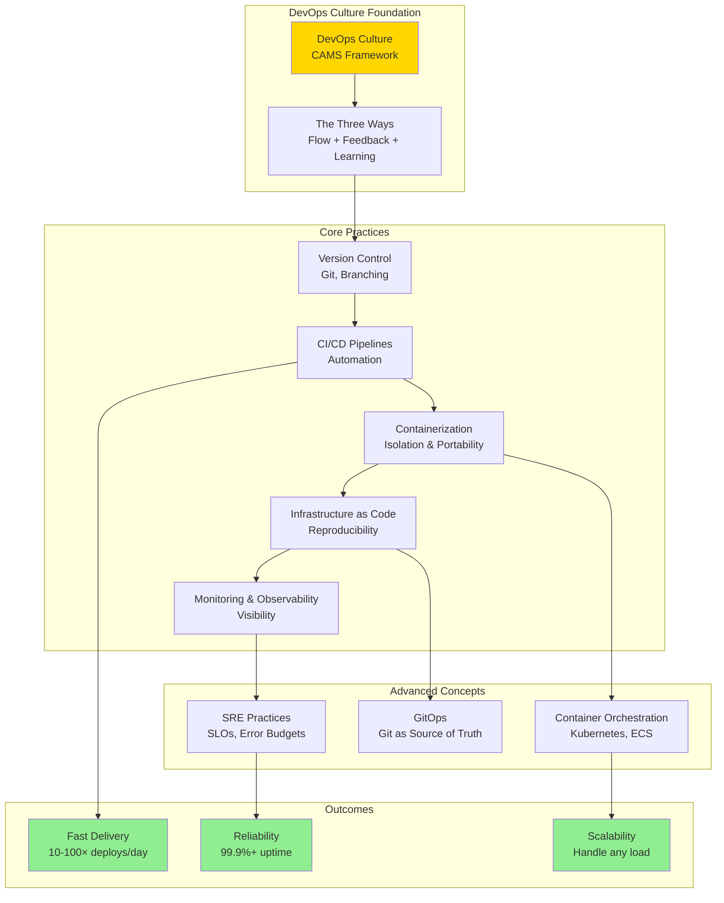

---

## **2. CI/CD Pipeline Flow** 🔄

```mermaid
graph LR
    subgraph "Developer"
        Code[Write Code] --> Commit[Git Commit]
    end
    
    subgraph "Continuous Integration"
        Commit --> Trigger[Pipeline Trigger]
        Trigger --> Checkout[Checkout Code]
        Checkout --> Build[Build Application]
        Build --> UnitTest[Unit Tests]
        UnitTest --> IntTest[Integration Tests]
        IntTest --> Scan[Security Scan]
        Scan --> Artifact[Create Artifact]
    end
    
    subgraph "Continuous Delivery"
        Artifact --> Package[Package Container]
        Package --> Registry[Push to Registry]
        Registry --> DeployStaging[Deploy to Staging]
        DeployStaging --> E2E[E2E Tests]
        E2E --> Manual{Manual<br/>Approval}
    end
    
    subgraph "Continuous Deployment"
        Manual -->|Approved| DeployProd[Deploy to Production]
        DeployProd --> Monitoring[Monitor Metrics]
        Monitoring --> Healthy{Healthy?}
        Healthy -->|Yes| Success[✅ Success]
        Healthy -->|No| Rollback[Rollback]
        Rollback --> Previous[Previous Version]
    end
    
    UnitTest -.->|Fail| Notify[Notify Developer]
    IntTest -.->|Fail| Notify
    Scan -.->|Critical| Notify
    E2E -.->|Fail| Notify
    
    style Success fill:#90EE90
    style Notify fill:#FFB6C1
    style Rollback fill:#FFB6C1
```

---

## **3. Container Technology Stack** 📦

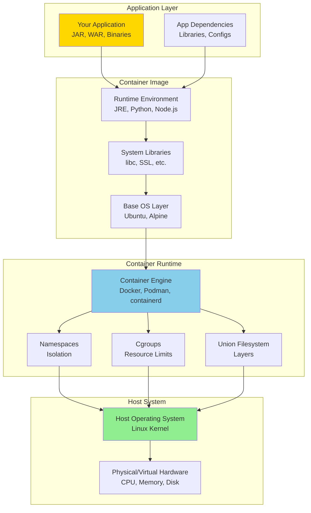

---

## **4. Infrastructure as Code Workflow** 🏗️

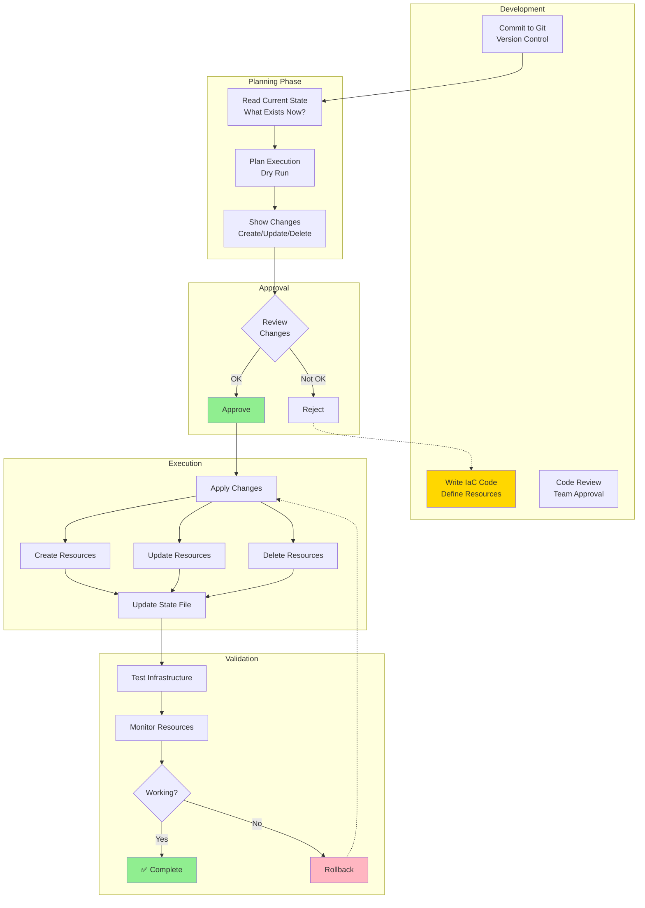

---

## **5. Observability Architecture** 📊

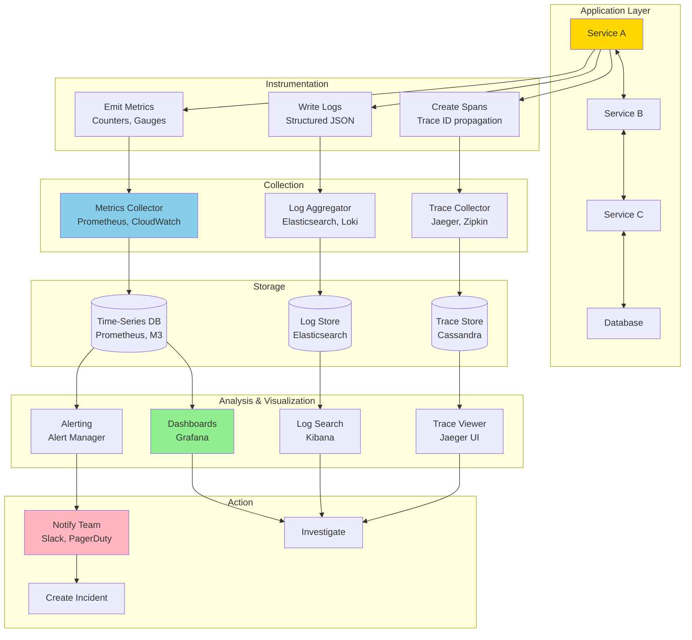

---

## **6. Decision-Making Framework** 🧠

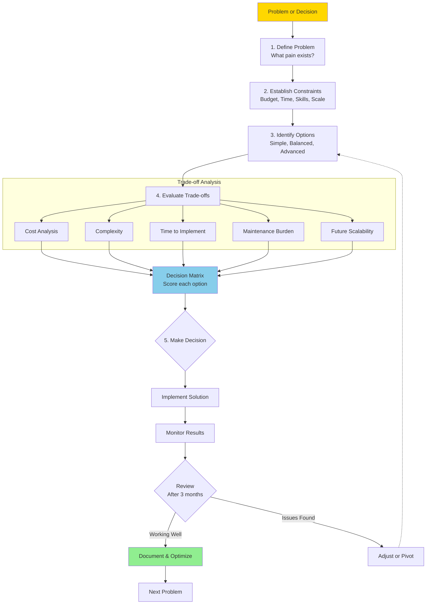

---

## **7. Tool Ecosystem Map** 🛠️

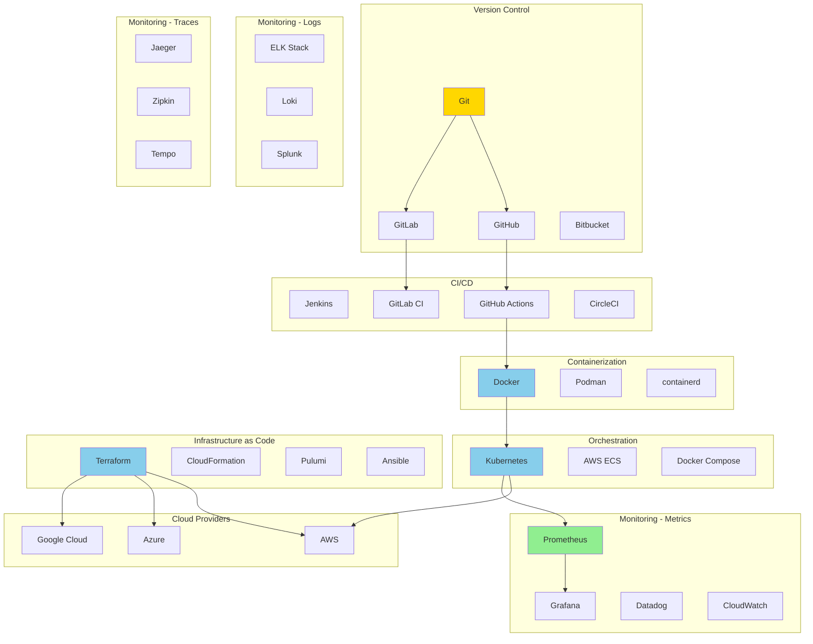

---

## **8. Learning Progression Path** 📚

```mermaid
graph TD
    subgraph "Level 1: Foundation (Weeks 1-2)"
        L1_1[DevOps Philosophy<br/>CAMS, Three Ways]
        L1_2[Version Control<br/>Git Basics]
        L1_3[Build Tools<br/>Maven, Gradle]
        
        L1_1 --> L1_2
        L1_2 --> L1_3
    end
    
    subgraph "Level 2: Automation (Weeks 3-4)"
        L2_1[CI/CD Concepts<br/>Pipeline Stages]
        L2_2[Testing<br/>Unit, Integration]
        L2_3[Deployment<br/>Strategies]
        
        L1_3 --> L2_1
        L2_1 --> L2_2
        L2_2 --> L2_3
    end
    
    subgraph "Level 3: Infrastructure (Weeks 5-6)"
        L3_1[Containers<br/>Docker Concepts]
        L3_2[Orchestration<br/>Kubernetes Basics]
        L3_3[IaC<br/>Terraform/CloudFormation]
        
        L2_3 --> L3_1
        L3_1 --> L3_2
        L3_2 --> L3_3
    end
    
    subgraph "Level 4: Operations (Weeks 7-8)"
        L4_1[Configuration<br/>Management]
        L4_2[Monitoring<br/>Metrics & Logs]
        L4_3[Incident<br/>Management]
        
        L3_3 --> L4_1
        L4_1 --> L4_2
        L4_2 --> L4_3
    end
    
    subgraph "Level 5: Advanced (Weeks 9-10)"
        L5_1[Observability<br/>Distributed Tracing]
        L5_2[Security<br/>DevSecOps]
        L5_3[GitOps<br/>Patterns]
        
        L4_3 --> L5_1
        L5_1 --> L5_2
        L5_2 --> L5_3
    end
    
    subgraph "Level 6: Mastery (Weeks 11-12)"
        L6_1[Problem Solving<br/>Decision Framework]
        L6_2[Tool Selection<br/>Trade-off Analysis]
        L6_3[Projects<br/>Portfolio Building]
        
        L5_3 --> L6_1
        L6_1 --> L6_2
        L6_2 --> L6_3
    end
    
    L6_3 --> Ready[✅ Interview Ready!<br/>Job Ready!]
    
    style L1_1 fill:#FFD700
    style L2_1 fill:#FFD700
    style L3_1 fill:#87CEEB
    style L4_2 fill:#87CEEB
    style L5_1 fill:#90EE90
    style L6_1 fill:#90EE90
    style Ready fill:#90EE90
```

---

## **🎯 Concept Dependency Map**

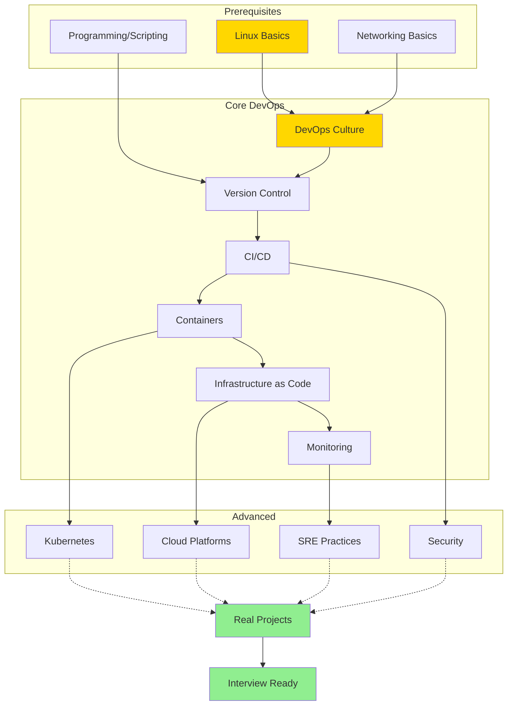

---

## **🔗 How Concepts Connect**

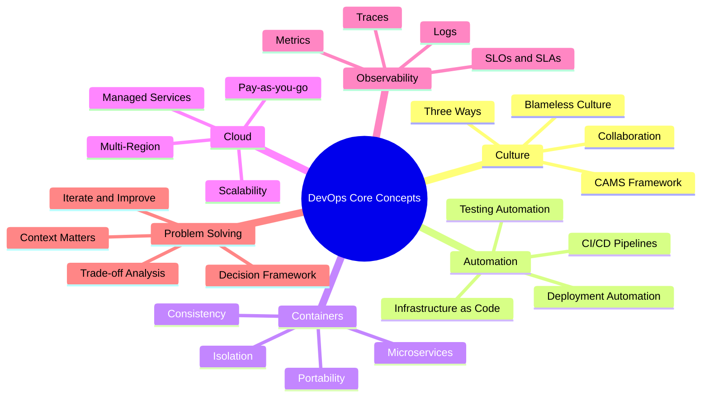

---

## **📊 XP and Progress Tracking**

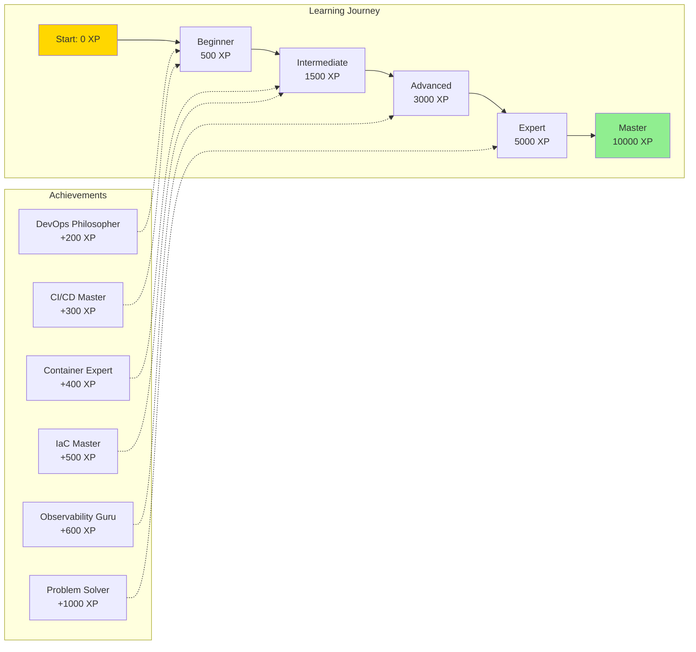

---

## **💡 Quick Navigation Guide**

### **By Role**

```
Java Developer Path:
  → DevOps Philosophy
  → CI/CD (Maven/Gradle integration)
  → Containers (Spring Boot containerization)
  → IaC (Deploy to cloud)
  → Monitoring (Application metrics)

Operations Engineer Path:
  → Infrastructure as Code
  → Container Orchestration
  → Monitoring & Observability
  → Incident Management
  → SRE Practices

Full-Stack Developer Path:
  → Version Control
  → CI/CD Pipelines
  → Containers
  → Cloud Deployment
  → Basic Monitoring
```

### **By Goal**

```
Interview Preparation (2-3 weeks):
  1. DevOps Philosophy (2 days)
  2. CI/CD Concepts (3 days)
  3. Containers + IaC (5 days)
  4. Monitoring basics (3 days)
  5. Problem-solving framework (2 days)
  6. Practice explaining (rest of time)

Career Change (8-12 weeks):
  - Follow Level 1 → Level 6 progression
  - Build portfolio projects
  - Contribute to open source
  - Document learning journey

Skill Enhancement (Self-paced):
  - Focus on weak areas
  - Deep dive into specific topics
  - Build real-world projects
  - Implement at current job
```

---

## **🎨 Color Legend**

```
🟡 Yellow (FFD700): Starting points, fundamentals
🔵 Blue (87CEEB): Core practices, tools
🟢 Green (90EE90): Success states, outcomes
🔴 Red (FFB6C1): Alerts, failures, rollbacks
```

---

**Use these visual maps to:**
- ✅ See the big picture
- ✅ Understand dependencies
- ✅ Plan your learning
- ✅ Explain to others
- ✅ Quick reference

**Remember**: Concepts build on each other - follow the progression! 🚀

