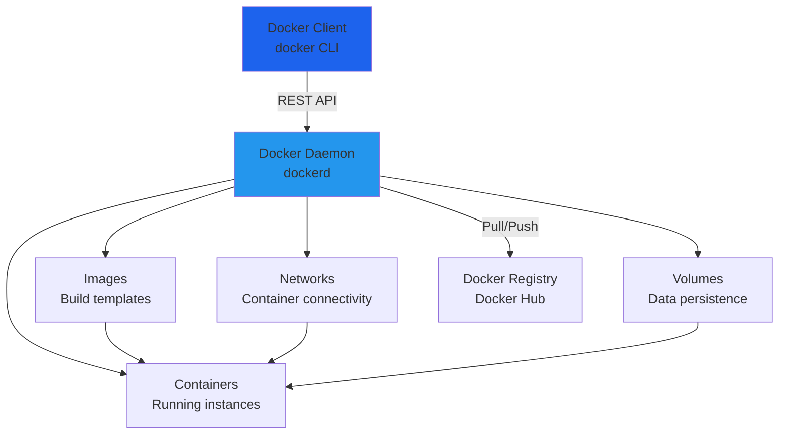
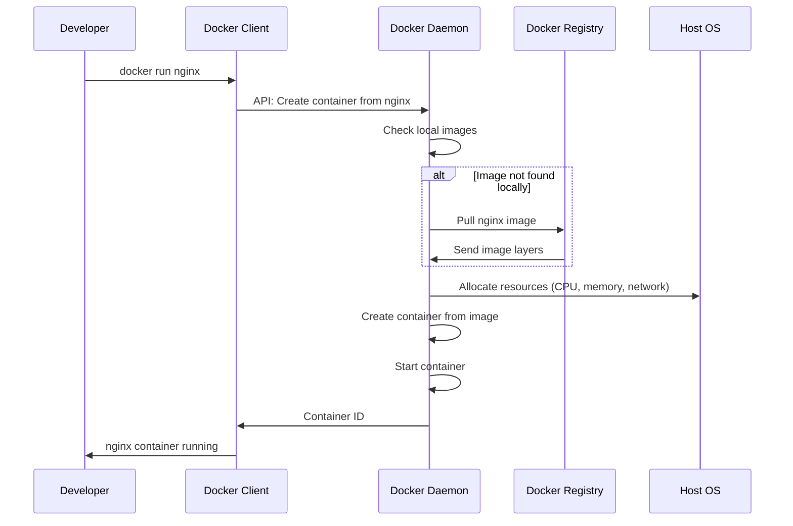
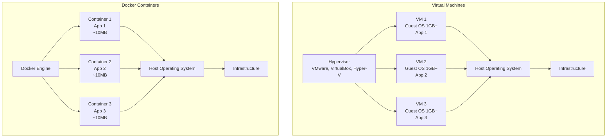
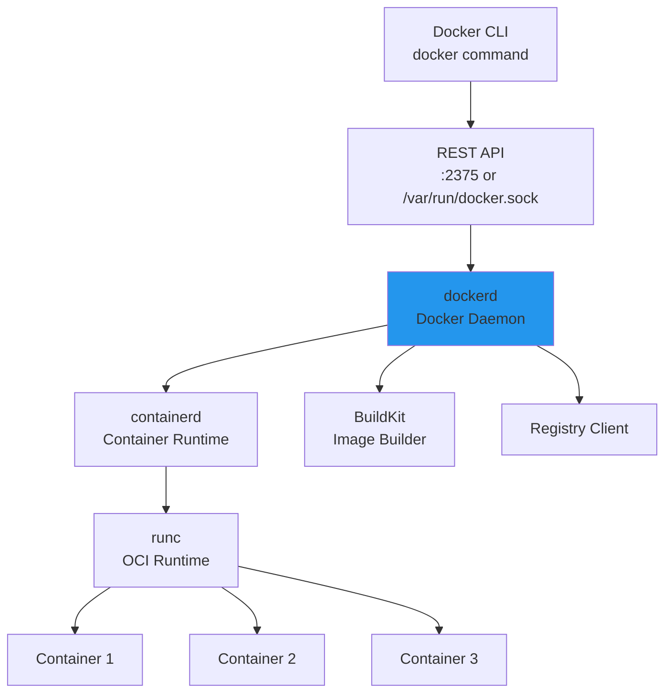
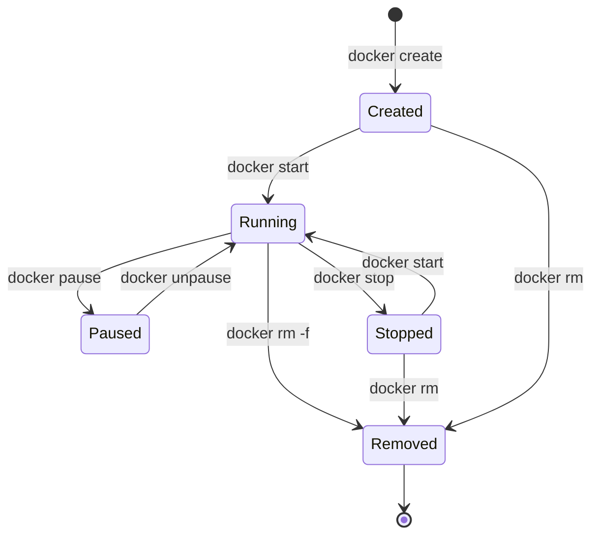
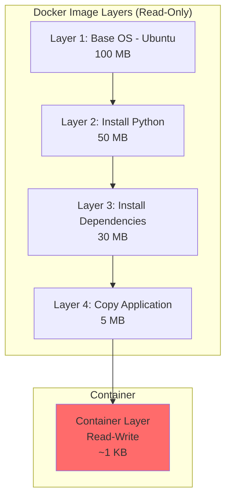

# **Docker Fundamentals - Complete Guide** 🐳

**Master Docker Architecture, Concepts, and Foundation for Containerization**

---

## **Table of Contents** 📑
1. [What is Docker?](#1-what-is-docker)
2. [Docker Architecture](#2-docker-architecture)
3. [Docker vs Virtual Machines](#3-docker-vs-virtual-machines)
4. [Core Concepts](#4-core-concepts)
5. [Installation & Setup](#5-installation--setup)
6. [Docker Engine Components](#6-docker-engine-components)
7. [Container Lifecycle](#7-container-lifecycle)
8. [Image Layers & Storage](#8-image-layers--storage)
9. [Docker Registry & Hub](#9-docker-registry--hub)
10. [Docker Security Basics](#10-docker-security-basics)
11. [Best Practices](#11-best-practices)
12. [Interview Cheat Sheet](#12-interview-cheat-sheet)

---

## **1. What is Docker?** 🎯

### **Definition**

**Docker** is an open-source platform that enables developers to build, deploy, run, update, and manage **containers** - standardized, executable components that combine application source code with the operating system (OS) libraries and dependencies required to run that code in any environment.

### **The Problem Docker Solves**

```
Traditional Development:
Developer: "It works on my machine!" 🤷‍♂️
Operations: "It doesn't work in production!" 😡

With Docker:
Developer: "It works in this container!" 🐳
Operations: "Then it works everywhere!" ✅
```

### **Key Benefits**

```
✅ Consistency across environments (dev, staging, prod)
✅ Isolation (each container is independent)
✅ Portability (run anywhere: laptop, cloud, on-premises)
✅ Efficiency (lightweight, share OS kernel)
✅ Scalability (spin up/down containers quickly)
✅ Version control (images are versioned)
✅ Rapid deployment (seconds vs minutes/hours)
✅ Microservices enabler
```

### **Docker in Numbers**

```
📊 Statistics:
- 20+ million developers use Docker
- 13 million+ Docker Hub repositories
- Used by 67% of enterprises
- Containers start in < 1 second
- 100+ containers per host (easily)
```

---

## **2. Docker Architecture** 🏗️

### **High-Level Architecture**



### **Components Explained**

#### **1. Docker Client**
```bash
# The docker command you type
docker run nginx
docker build -t myapp .
docker ps

# Client sends commands to Docker Daemon via:
# - UNIX socket: /var/run/docker.sock
# - TCP: tcp://192.168.1.10:2375
# - SSH: ssh://user@remote-host
```

#### **2. Docker Daemon (dockerd)**
```
Responsibilities:
  - Listen for Docker API requests
  - Manage Docker objects (images, containers, networks, volumes)
  - Communicate with other daemons
  - Execute container operations
  
Location:
  - Linux: Runs as systemd service
  - macOS: Runs in VM (Docker Desktop)
  - Windows: Runs in VM or WSL2
```

#### **3. Docker Registry**
```
Public Registries:
  - Docker Hub (hub.docker.com) - default
  - GitHub Container Registry (ghcr.io)
  - Google Container Registry (gcr.io)
  - Amazon ECR (AWS)
  - Azure Container Registry (ACR)
  
Private Registries:
  - Self-hosted Docker Registry
  - Harbor
  - JFrog Artifactory
  - Nexus Repository
```

### **Complete Workflow**



---

## **3. Docker vs Virtual Machines** ⚖️

### **Architecture Comparison**



### **Detailed Comparison**

| Aspect | Docker Containers | Virtual Machines |
|--------|------------------|------------------|
| **Architecture** | Share host OS kernel | Full OS per VM |
| **Size** | Megabytes (10-100 MB) | Gigabytes (1-10 GB+) |
| **Startup Time** | Seconds (< 1s) | Minutes (1-5 min) |
| **Performance** | Near-native | Overhead 5-15% |
| **Isolation** | Process-level | Hardware-level |
| **Security** | Shared kernel (potential risk) | Strong isolation |
| **Portability** | Very portable | Less portable |
| **Resource Usage** | Lightweight | Resource-intensive |
| **OS Support** | Same OS only* | Any OS |
| **Density** | 100s per host | 10s per host |
| **Boot Time** | Milliseconds | Minutes |

*Linux containers run on Linux, Windows containers on Windows

### **When to Use Each**

```yaml
Use Docker Containers:
  ✅ Microservices architecture
  ✅ CI/CD pipelines
  ✅ Development environments
  ✅ Stateless applications
  ✅ Cloud-native applications
  ✅ Need rapid scaling
  ✅ Resource efficiency critical
  
Use Virtual Machines:
  ✅ Need different OS (Linux on Windows)
  ✅ Strong isolation required
  ✅ Legacy applications
  ✅ Full OS features needed
  ✅ GUI applications
  ✅ Kernel-level operations
  ✅ Multi-tenancy with strict isolation
```

---

## **4. Core Concepts** 💡

### **1. Images**

```
Definition:
  Read-only template with instructions for creating a container
  
Characteristics:
  - Immutable (cannot be changed)
  - Layered file system
  - Built from Dockerfile
  - Stored in registry
  - Versioned with tags
  
Example:
  nginx:1.25.3        # Image with specific version
  nginx:latest        # Latest stable version
  nginx:alpine        # Lightweight Alpine-based version
```

### **2. Containers**

```
Definition:
  Runnable instance of an image
  
Characteristics:
  - Isolated from host and other containers
  - Has its own filesystem, networking, process tree
  - Can be started, stopped, moved, deleted
  - Ephemeral by default (data lost when removed)
  - Can connect to networks and volumes
  
States:
  Created → Running → Paused → Stopped → Removed
```

### **3. Dockerfile**

```dockerfile
# Build instructions for creating an image
FROM node:18-alpine            # Base image

WORKDIR /app                   # Working directory

COPY package*.json ./          # Copy files
RUN npm install                # Execute commands

COPY . .                       # Copy application

EXPOSE 3000                    # Document port

CMD ["npm", "start"]           # Default command
```

### **4. Volumes**

```
Definition:
  Persistent data storage mechanism
  
Types:
  1. Named volumes:     docker volume create mydata
  2. Host bind mounts:  -v /host/path:/container/path
  3. Tmpfs mounts:      --tmpfs /app/cache (RAM)
  
Use Cases:
  - Database data
  - Application logs
  - Configuration files
  - Shared data between containers
```

### **5. Networks**

```
Network Drivers:
  - bridge:  Default, isolated network
  - host:    Share host network (no isolation)
  - overlay: Multi-host networking (Swarm)
  - macvlan: Assign MAC address
  - none:    Disable networking
  
Example:
  docker network create mynetwork
  docker run --network mynetwork nginx
```

---

## **5. Installation & Setup** 📦

### **Linux (Ubuntu/Debian)**

```bash
# Update package index
sudo apt-get update

# Install dependencies
sudo apt-get install \
    ca-certificates \
    curl \
    gnupg \
    lsb-release

# Add Docker's official GPG key
sudo mkdir -p /etc/apt/keyrings
curl -fsSL https://download.docker.com/linux/ubuntu/gpg | \
  sudo gpg --dearmor -o /etc/apt/keyrings/docker.gpg

# Set up repository
echo \
  "deb [arch=$(dpkg --print-architecture) signed-by=/etc/apt/keyrings/docker.gpg] \
  https://download.docker.com/linux/ubuntu \
  $(lsb_release -cs) stable" | \
  sudo tee /etc/apt/sources.list.d/docker.list > /dev/null

# Install Docker Engine
sudo apt-get update
sudo apt-get install docker-ce docker-ce-cli containerd.io docker-compose-plugin

# Verify installation
sudo docker run hello-world

# Add user to docker group (no sudo needed)
sudo usermod -aG docker $USER
newgrp docker

# Verify without sudo
docker run hello-world
```

### **macOS**

```bash
# Download Docker Desktop from:
# https://www.docker.com/products/docker-desktop

# Or use Homebrew
brew install --cask docker

# Start Docker Desktop application

# Verify
docker --version
docker run hello-world
```

### **Windows**

```powershell
# Option 1: Docker Desktop (Recommended)
# Download from: https://www.docker.com/products/docker-desktop

# Option 2: WSL2 + Docker
# Install WSL2 first
wsl --install

# Then install Docker Desktop with WSL2 backend

# Verify
docker --version
docker run hello-world
```

### **Post-Installation**

```bash
# Check Docker version
docker --version
docker version              # Client and Server info

# Check Docker info
docker info

# Enable Docker to start on boot
sudo systemctl enable docker

# Start Docker service
sudo systemctl start docker

# Check status
sudo systemctl status docker
```

---

## **6. Docker Engine Components** ⚙️

### **Architecture Deep Dive**



### **Components Explained**

#### **1. dockerd (Docker Daemon)**
```
Responsibilities:
  - API server
  - Image management
  - Container lifecycle
  - Volume management
  - Network configuration
  
Configuration:
  - Linux: /etc/docker/daemon.json
  - macOS: Docker Desktop preferences
  
Example config:
{
  "log-driver": "json-file",
  "log-opts": {
    "max-size": "10m",
    "max-file": "3"
  },
  "storage-driver": "overlay2"
}
```

#### **2. containerd**
```
Description:
  Industry-standard container runtime
  
Purpose:
  - Manage container lifecycle
  - Image transfer and storage
  - Container execution supervision
  
Used by:
  - Docker
  - Kubernetes (via CRI)
  - Cloud providers
```

#### **3. runc**
```
Description:
  OCI (Open Container Initiative) runtime
  
Purpose:
  - Create and run containers
  - Low-level container operations
  - Interface with Linux kernel (namespaces, cgroups)
  
Standards:
  - OCI Runtime Specification compliant
```

---

## **7. Container Lifecycle** 🔄

### **Container States**



### **Lifecycle Commands**

```bash
# 1. CREATE (without starting)
docker create --name mynginx nginx
# State: Created

# 2. START
docker start mynginx
# State: Running

# 3. PAUSE (freeze processes)
docker pause mynginx
# State: Paused

# 4. UNPAUSE
docker unpause mynginx
# State: Running

# 5. STOP (graceful shutdown, SIGTERM then SIGKILL)
docker stop mynginx
# State: Stopped (exited)

# 6. RESTART
docker restart mynginx
# State: Running

# 7. KILL (immediate, SIGKILL)
docker kill mynginx
# State: Stopped

# 8. REMOVE
docker rm mynginx
# State: Removed

# Combined: Run (create + start)
docker run --name mynginx nginx
# State: Running
```

### **Container Lifecycle in Detail**

```bash
# Detailed lifecycle with logs
docker run -d --name lifecycle-test nginx

# Check state
docker ps | grep lifecycle-test
# STATUS: Up

# Inspect detailed state
docker inspect lifecycle-test --format='{{.State.Status}}'
# Output: running

# Pause container
docker pause lifecycle-test
docker inspect lifecycle-test --format='{{.State.Status}}'
# Output: paused

# Unpause
docker unpause lifecycle-test

# Stopcontainer (10s grace period)
docker stop lifecycle-test
docker inspect lifecycle-test --format='{{.State.Status}}'
# Output: exited

# Start again
docker start lifecycle-test

# Force kill
docker kill lifecycle-test

# Remove
docker rm lifecycle-test
```

---

## **8. Image Layers & Storage** 📦

### **Layer Architecture**



### **How Layers Work**

```dockerfile
# Each instruction creates a new layer

FROM ubuntu:22.04           # Layer 1: Ubuntu base (77 MB)
RUN apt-get update          # Layer 2: Package index (50 MB)
RUN apt-get install -y python3  # Layer 3: Python (100 MB)
COPY requirements.txt .     # Layer 4: Requirements file (1 KB)
RUN pip install -r requirements.txt  # Layer 5: Dependencies (200 MB)
COPY . /app                 # Layer 6: Application code (5 MB)

# Total size: 433 MB
# BUT: Layers are cached and reused!
```

### **Layer Caching Benefits**

```bash
# First build
docker build -t myapp:v1 .
# Downloads all layers: 433 MB, 5 minutes

# Second build (no code changes)
docker build -t myapp:v2 .
# Uses cache: 0 MB downloaded, 5 seconds!

# Third build (only code changed)
docker build -t myapp:v3 .
# Only rebuilds Layer 6: 5 MB, 10 seconds
```

### **Storage Drivers**

```bash
# Check current storage driver
docker info | grep "Storage Driver"

# Common storage drivers:
Storage Drivers:
  - overlay2:     Recommended (modern Linux)
  - aufs:         Legacy (older Ubuntu)
  - devicemapper: RHEL/CentOS (legacy)
  - btrfs:        Advanced features
  - zfs:          Enterprise features
  - vfs:          No copy-on-write (slow)
```

### **Copy-on-Write (CoW)**

```
Mechanism:
  1. Container starts with read-only image layers
  2. All writes go to container's writable layer
  3. Reading unchanged files: Direct from image layer
  4. Modifying file: Copy to writable layer, then modify
  
Benefits:
  - Multiple containers share same image layers
  - Fast container creation
  - Efficient storage usage
  
Example:
  10 containers from same nginx image:
  - Without CoW: 10 × 150 MB = 1.5 GB
  - With CoW:    1 × 150 MB = 150 MB (+ small writable layers)
```

---

## **9. Docker Registry & Hub** 🌐

### **Docker Hub**

```bash
# Login to Docker Hub
docker login
# Username: yourusername
# Password: ***

# Search for images
docker search nginx
docker search python --filter is-official=true

# Pull image (download)
docker pull nginx
docker pull nginx:1.25.3        # Specific version
docker pull nginx:alpine        # Specific variant

# Tag image
docker tag myapp:latest yourusername/myapp:v1.0

# Push image
docker push yourusername/myapp:v1.0

# Logout
docker logout
```

### **Image Naming Convention**

```
Format:
  [registry/][namespace/]repository:tag
  
Examples:
  nginx                           # Docker Hub official
  nginx:1.25.3                    # With tag
  nginx:alpine                    # Alpine variant
  myusername/myapp                # User repository
  myusername/myapp:v1.0           # With version tag
  ghcr.io/user/app:latest         # GitHub registry
  gcr.io/project/app:sha-abc123   # Google registry
  docker.io/library/nginx:latest  # Full Docker Hub path
```

### **Private Registry**

```bash
# Run private registry
docker run -d \
  -p 5000:5000 \
  --name registry \
  --restart=always \
  -v registry-data:/var/lib/registry \
  registry:2

# Tag image for private registry
docker tag myapp localhost:5000/myapp:v1

# Push to private registry
docker push localhost:5000/myapp:v1

# Pull from private registry
docker pull localhost:5000/myapp:v1

# List images in registry
curl -X GET http://localhost:5000/v2/_catalog
```

---

## **10.Docker Security Basics** 🔒

### **Security Principles**

```
Docker Security Layers:
  1. Host OS security
  2. Docker daemon security
  3. Image security
  4. Container security
  5. Network security
```

### **Container Isolation**

```bash
# Run as non-root user
docker run --user 1000:1000 nginx

# Read-only root filesystem
docker run --read-only nginx

# Limit capabilities
docker run --cap-drop=ALL --cap-add=NET_BIND_SERVICE nginx

# No new privileges
docker run --security-opt=no-new-privileges nginx

# Resource limits
docker run \
  --memory=512m \
  --cpus=1.0 \
  --pids-limit=100 \
  nginx
```

### **Image Security**

```bash
# Scan image for vulnerabilities
docker scan nginx:latest

# Use official images
docker pull nginx              # ✅ Official
docker pull randomuser/nginx   # ⚠️ Verify source

# Verify image with Content Trust
export DOCKER_CONTENT_TRUST=1
docker pull nginx
# Only pulls signed images

# Check image history
docker history nginx

# Inspect image
docker inspect nginx
```

### **Best Practices**

```dockerfile
# ✅ Good Security Practices

# 1. Use specific versions (not latest)
FROM nginx:1.25.3-alpine

# 2. Run as non-root user
RUN addgroup -g 1000 appgroup && \
    adduser -D -u 1000 -G appgroup appuser
USER appuser

# 3. Minimal base image
FROM alpine:3.18        # Small, secure

# 4. Multi-stage builds (reduce attack surface)
FROM node:18 AS builder
# Build stage

FROM node:18-alpine     # Runtime stage
# Only runtime dependencies

# 5. Don't include secrets
# ❌ COPY .env .
# ✅ Use environment variables or secrets management

# 6. Scan for vulnerabilities
# ✅ Run: docker scan myimage
```

---

## **11. Best Practices** ⭐

### **General Best Practices**

```yaml
Development:
  ✅ Use .dockerignore (like .gitignore)
  ✅ Keep images small (Alpine variants)
  ✅ One process per container
  ✅ Use multi-stage builds
  ✅ Leverage build cache
  ✅ Version your images (tags)
  ✅ Document with labels
  
Production:
  ✅ Use specific image tags (not :latest)
  ✅ Run containers as non-root
  ✅ Set resource limits
  ✅ Use health checks
  ✅ Implement logging strategy
  ✅ Use secrets management
  ✅ Regular security scans
  ✅ Monitor container metrics
```

### **Don'ts**

```yaml
❌ Don't store data in containers
❌ Don't use :latest in production
❌ Don't run as root
❌ Don't install unnecessary packages
❌ Don't ignore security updates
❌ Don't hardcode secrets
❌ Don't expose unnecessary ports
❌ Don't disable security features
```

---

## **12. Interview Cheat Sheet** 🎯

### **Q1: What is Docker and why use it?**
```
Answer:
Docker is a containerization platform that packages applications
with dependencies into isolated, portable containers.

Benefits:
- Consistency across environments
- Fast deployment (seconds)
- Resource efficient (vs VMs)
- Microservices enabler
- Easy scaling

Use Case:
"We use Docker to ensure our Node.js app runs identically in
development, staging, and production. One Dockerfile defines
the entire environment."
```

### **Q2: Explain Docker architecture**
```
Components:
1. Docker Client (CLI): User interface
2. Docker Daemon (dockerd): Manages containers, images
3. containerd: Container runtime
4. runc: OCI runtime (creates containers)
5. Docker Registry: Store images (Docker Hub)

Flow:
docker run → Client → REST API → Daemon → containerd → runc → Container
```

### **Q3: Docker vs VM - key differences?**
```
Docker Containers:
- Share host OS kernel
- Lightweight (MBs)
- Start in seconds
- More containers per host

Virtual Machines:
- Full OS per VM
- Heavy (GBs)
- Start in minutes
- Strong isolation

When to use:
- Containers: Microservices, CI/CD, cloud-native
- VMs: Different OS needed, strong isolation required
```

### **Q4: What are image layers?**
```
Concept:
- Images built in layers (read-only)
- Each Dockerfile instruction = 1 layer
- Layers cached and reused
- Container adds writable layer on top

Benefits:
- Fast builds (caching)
- Efficient storage (layer sharing)
- Quick container creation

Example:
FROM ubuntu           # Layer 1
RUN apt-get update    # Layer 2
COPY app.py .         # Layer 3
```

### **Q5: How to optimize Docker images?**
```
Techniques:
1. Use Alpine base images (smaller)
2. Multi-stage builds (reduce size)
3. Minimize layers (combine RUN commands)
4. Order instructions (cache leverage)
5. Use .dockerignore
6. Remove unnecessary files

Example:
# Before: 1 GB
# After multi-stage + Alpine: 50 MB
```

### **Common Commands**

```bash
# Image management
docker pull nginx
docker build -t myapp .
docker images
docker rmi nginx
docker tag myapp myapp:v1

# Container management
docker run -d --name web nginx
docker ps
docker ps -a
docker stop web
docker start web
docker rm web
docker logs web
docker exec -it web /bin/bash

# System
docker info
docker version
docker system df              # Disk usage
docker system prune -a        # Clean up

# Registry
docker login
docker push myapp:v1
docker pull myapp:v1
```

---

## **Next Steps** 📚

- **[Docker Images & Dockerfile](Docker_Images.md)** - Building optimized images
- **[Docker Containers](Docker_Containers.md)** - Container management
- **[Docker Networking](Docker_Networking.md)** - Container connectivity
- **[Docker Volumes](Docker_Volumes.md)** - Data persistence
- **[Docker Compose](Docker_Compose.md)** - Multi-container applications

---

**🐳 Master Docker Fundamentals, Master Container Technology!**

*Docker revolutionized software deployment. Understanding these fundamentals is essential for modern DevOps.*
