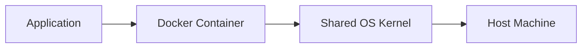
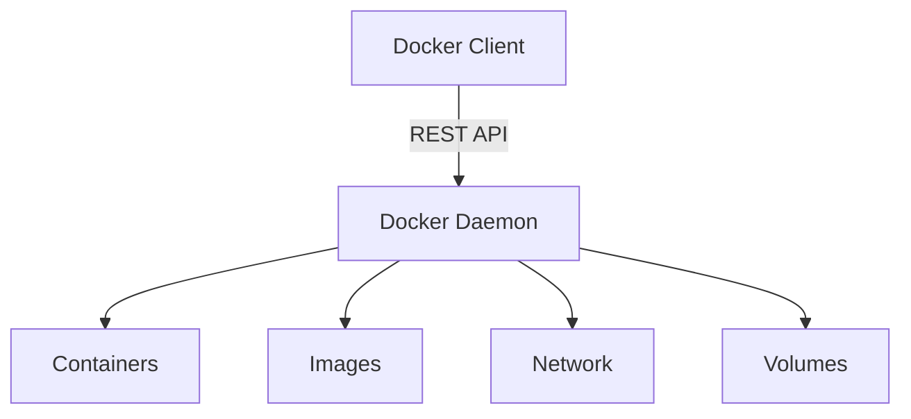
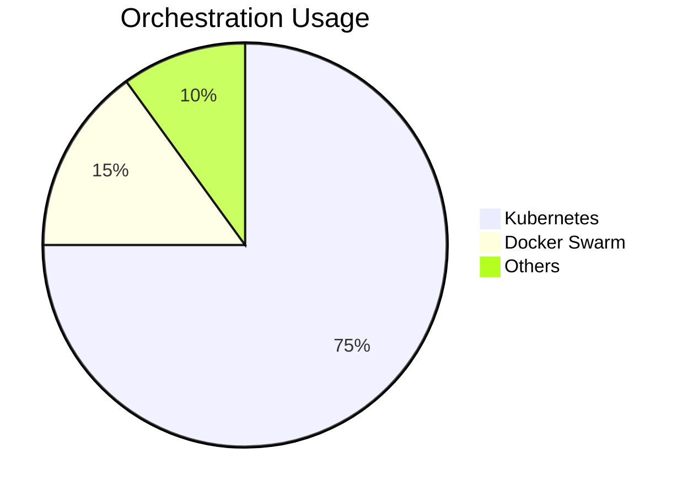
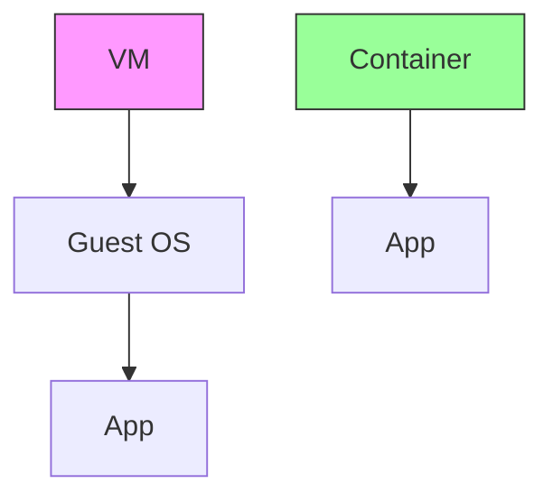
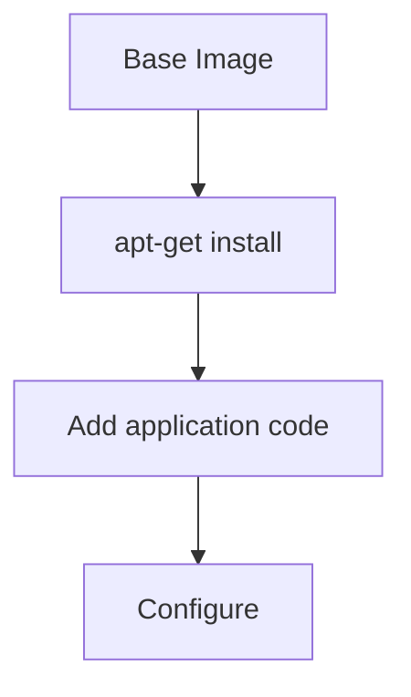
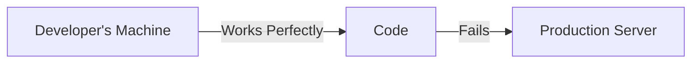
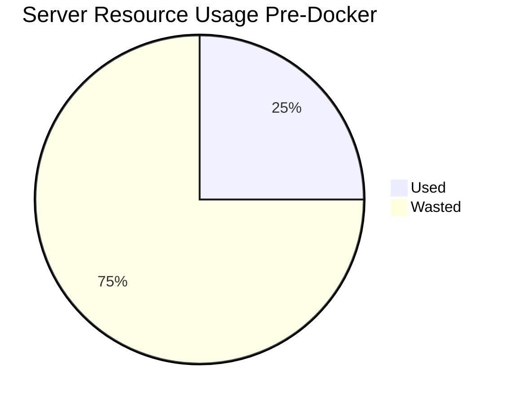
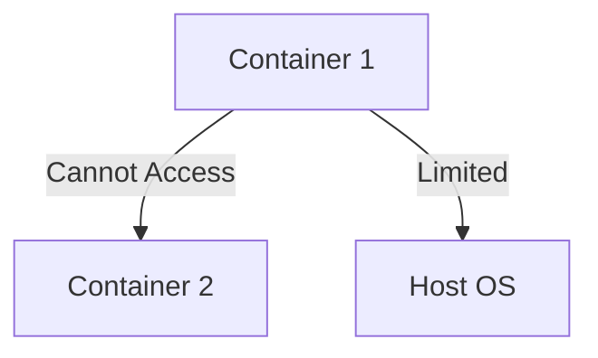
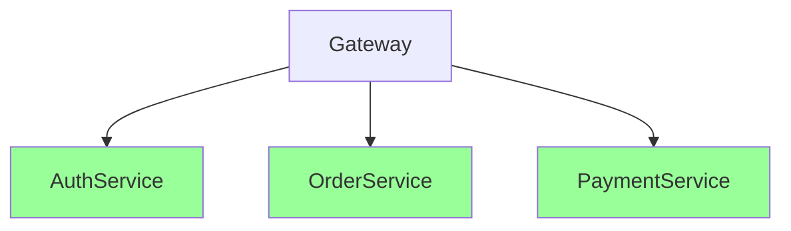
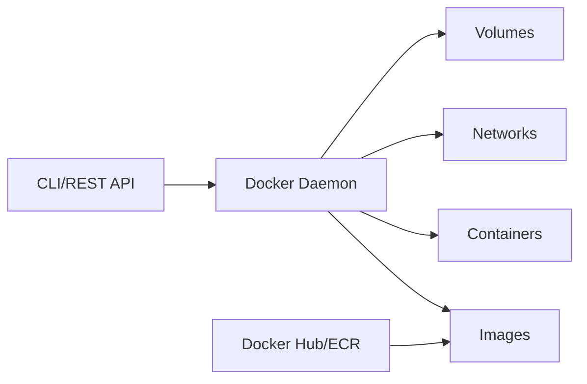

# **Docker – The Complete Interview Guide** 🚀

This comprehensive guide covers everything you need to know about Docker for technical interviews, including architecture, best practices, Java integration, and real-world industry applications.

---

## **Table of Contents** 📑
1. [What is Docker?](#1-what-is-docker)
2. [Docker Architecture](#2-docker-architecture)
3. [Key Components](#3-key-components)
4. [Dockerfile Mastery](#4-dockerfile-mastery)
5. [Java Integration](#5-java-integration)
6. [Orchestration](#6-orchestration)
7. [Industry Best Practices](#7-industry-best-practices)
8. [Security Considerations](#8-security-considerations)
9. [When NOT to Use Docker](#9-when-not-to-use-docker)
10. [Big Company Approaches](#10-big-company-approaches)
11. [Performance Optimization](#11-performance-optimization)
12. [Visual Diagrams](#12-visual-diagrams)
13. [Comparison Tables](#13-comparison-tables)
14. [Interview Cheat Sheet](#14-interview-cheat-sheet)

---

## **1. What is Docker?** 🐳

Docker is a platform for developing, shipping, and running applications in lightweight, portable containers.



**Key Benefits:**
- Consistent environments
- Isolation and security
- Resource efficiency
- Rapid deployment

---

## **2. Docker Architecture** 🏗️



**Components:**
- **Docker Client**: CLI/UI (`docker` commands)
- **Docker Host**: Runs containers (daemon + runtime)
- **Registry**: Stores images (Docker Hub, ECR, GCR)

---

## **3. Key Components** 🧩

### **1. Images vs Containers**
| Images | Containers |
|--------|------------|
| Blueprint/template | Running instance |
| Immutable | Ephemeral |
| Layered filesystem | Read-write layer |

### **2. Volumes**
```bash
docker run -v /host/path:/container/path my-image
```

### **3. Networks**
```bash
docker network create my-network
docker run --network=my-network my-image
```

---

## **4. Dockerfile Mastery** 📝

### **Optimized Java Dockerfile**
```dockerfile
# Multi-stage build
FROM eclipse-temurin:17-jdk-jammy as builder
WORKDIR /app
COPY . .
RUN ./gradlew build

# Final image
FROM eclipse-temurin:17-jre-jammy
WORKDIR /app
COPY --from=builder /app/build/libs/*.jar app.jar
EXPOSE 8080

# Security best practices
USER 1001
ENTRYPOINT ["java", "-jar", "app.jar"]
```

**Best Practices:**
1. Use official base images
2. Multi-stage builds
3. Non-root user
4. `.dockerignore` file
5. Layer caching

---

## **5. Java Integration** ☕

### **Spring Boot Docker Plugin**
```xml
<plugin>
    <groupId>com.google.cloud.tools</groupId>
    <artifactId>jib-maven-plugin</artifactId>
    <version>3.3.1</version>
    <configuration>
        <to>
            <image>my-java-app:${project.version}</image>
        </to>
    </configuration>
</plugin>
```
Build with:
```bash
mvn compile jib:dockerBuild
```

### **Connection to Database**
```yaml
# docker-compose.yml
version: '3.8'
services:
  app:
    image: my-java-app
    environment:
      DB_URL: jdbc:postgresql://db:5432/mydb
    depends_on:
      db:
        condition: service_healthy
  db:
    image: postgres:15
    healthcheck:
      test: ["CMD-SHELL", "pg_isready -U postgres"]
```

---

## **6. Orchestration** 🎼

### **Swarm vs Kubernetes**


**Sample Kubernetes Deployment:**
```yaml
apiVersion: apps/v1
kind: Deployment
metadata:
  name: java-app
spec:
  replicas: 3
  template:
    spec:
      containers:
      - name: app
        image: my-java-app:1.0
        ports:
        - containerPort: 8080
```

---

## **7. Industry Best Practices** 💡

1. **Image Tagging**
   ```bash
   docker build -t myapp:1.0 -t myapp:latest .
   ```

2. **Resource Limits**
   ```yaml
   deploy:
     resources:
       limits:
         cpus: '0.5'
         memory: 512M
   ```

3. **Logging**
   ```bash
   docker run --log-driver=json-file --log-opt max-size=10m my-app
   ```

4. **Health Checks**
   ```dockerfile
   HEALTHCHECK --interval=30s --timeout=3s \
     CMD curl -f http://localhost:8080/actuator/health || exit 1
   ```

**Enterprise Patterns:**
- GitOps workflows
- Immutable infrastructure
- Blue-green deployments

---

## **8. Security Considerations** 🔒

### **Critical Practices**
1. Scan images for vulnerabilities
   ```bash
   docker scan my-image
   ```
2. Use content trust
   ```bash
   export DOCKER_CONTENT_TRUST=1
   ```
3. Limit capabilities
   ```bash
   docker run --cap-drop=ALL --cap-add=NET_BIND_SERVICE my-app
   ```

---

## **9. When NOT to Use Docker** ❌

| Scenario | Reason | Alternative |
|----------|--------|-------------|
| GUI Applications | Poor performance | Native apps |
| Low-latency systems | Overhead | Bare metal |
| Legacy Windows apps | Compatibility | Virtual Machines |
| Simple static sites | Overkill | Serverless |

---

## **10. Big Company Approaches** 🏢

### **Netflix**
- Titus for container management
- 100,000+ containers

### **Spotify**
- Helios for orchestration
- Microservices architecture

### **Goldman Sachs**
- Strict image policies
- Private registries

---

## **11. Performance Optimization** ⚡

### **Storage Drivers Comparison**
| Driver | Performance | Stability |
|--------|-------------|-----------|
| overlay2 | High | High |
| aufs | Medium | Medium |
| devicemapper | Low | High |

### **Memory Management**
```bash
docker run -m 512m --memory-swap=1g my-app
```

---

## **12. Visual Diagrams** 📊

### **Container vs VM**


### **Docker Layered Filesystem**


---

## **13. Comparison Tables** 📋

### **Docker Alternatives**
| Tool | Pros | Cons |
|------|------|------|
| Podman | Rootless | Less mature |
| LXC | Lightweight | Less portable |
| Kubernetes | Scalable | Complex |

### **Java Container Options**
| JVM | Size | Features |
|-----|------|----------|
| OpenJDK | Large | Full features |
| Alpine JDK | Small | Limited libs |
| JLink | Custom | Minimal |

---

## **14. Interview Cheat Sheet** 🎯

**Key Concepts:**
1. Containers vs VMs
2. Dockerfile best practices
3. Image layering
4. Orchestration basics

**Common Questions:**
1. Explain Docker architecture
2. How would you optimize a Java Docker image?
3. Debug a crashing container
4. Compare Docker and Kubernetes
5. Secure a Docker deployment

## **14. The Problems Before Docker** 🔥

### **14.1 "It Works on My Machine" Syndrome**


**Real Example:**
- Node.js v14 on dev vs v12 in production
- Missing system libraries (libssl)
- Different configuration files

### **14.2 Environment Inconsistencies**
| Environment | Problems |
|-------------|----------|
| Development | Windows with WAMP |
| Staging | Ubuntu with custom configs |
| Production | RHEL with security patches |

### **14.3 Deployment Nightmares**
```bash
# Traditional deployment steps
1. Install Java 8
2. Configure Tomcat
3. Set environment variables
4. Deploy WAR file
5. Hope it works!
```

### **14.4 Resource Inefficiency**


---

## **15. How Docker Solves These Problems** 🛠️

### **15.1 Consistent Environments**
```dockerfile
FROM node:14-alpine
WORKDIR /app
COPY package*.json ./
RUN npm install
COPY . .
EXPOSE 3000
CMD ["node", "app.js"]
```
**Result:** Same behavior everywhere

### **15.2 Isolation & Security**


### **15.3 Efficient Resource Usage**
```bash
# Compare typical requirements
Virtual Machine: 2GB RAM, 20GB Disk
Docker Container: 100MB RAM, 200MB Disk
```

### **15.4 CI/CD Simplification**
```yaml
# Sample GitHub Actions workflow
jobs:
  deploy:
    runs-on: ubuntu-latest
    steps:
      - uses: actions/checkout@v2
      - run: docker build -t myapp .
      - run: docker push myapp:latest
```

---

## **16. Industry Adoption Patterns** 🏢

### **16.1 Microservices Architecture**

**Example:** Netflix runs 500+ microservices in containers

### **16.2 Cloud-Native Development**
```bash
# AWS ECS deployment
aws ecs register-task-definition \
  --family myapp \
  --container-definitions "$(cat docker-compose.json)"
```

### **16.3 Big Data Processing**
```dockerfile
FROM apache/spark:3.3.0
COPY processing.py /opt/spark/work-dir/
CMD ["spark-submit", "/opt/spark/work-dir/processing.py"]
```

### **16.4 Machine Learning**
```bash
# Reproducible ML environments
docker run -it tensorflow/tensorflow:2.10.0-gpu \
  python train_model.py
```

---

## **17. Docker Cheat Sheet** 📋

### **17.1 Essential Commands**
| Command | Description |
|---------|-------------|
| `docker build -t name .` | Build image |
| `docker run -p 80:80 name` | Run container |
| `docker ps -a` | List containers |
| `docker exec -it id bash` | Enter container |
| `docker logs id` | View logs |
| `docker-compose up` | Start services |

### **17.2 Dockerfile Directives**
| Directive | Purpose |
|-----------|---------|
| `FROM` | Base image |
| `COPY` | Add files |
| `RUN` | Execute commands |
| `EXPOSE` | Document ports |
| `ENV` | Set variables |
| `CMD` | Default command |

### **17.3 Common Flags**
| Flag | Meaning |
|------|---------|
| `-d` | Detached mode |
| `--rm` | Auto-remove |
| `-v /host:/cont` | Volume mount |
| `-e VAR=value` | Environment var |
| `--network` | Connect to network |

---

## **18. Interview Questions & Answers** 💡

### **Q1: Why use Docker instead of virtual machines?**
**A:**
```markdown
- **Resource Efficiency**: Containers share host OS kernel
- **Startup Time**: Containers start in seconds vs minutes
- **Portability**: Images work anywhere Docker runs
- **Density**: Run 10x more containers than VMs on same hardware
```

### **Q2: Explain Docker architecture**
**A:**


### **Q3: How to reduce Docker image size?**
**A:**
```dockerfile
# Multi-stage build example
FROM maven:3.8 AS builder
COPY . .
RUN mvn package

FROM openjdk:11-jre-slim
COPY --from=builder /target/app.jar .
CMD ["java", "-jar", "app.jar"]
```

### **Q4: What's the difference between COPY and ADD?**
**A:**
```markdown
- `COPY`: Simple file copying (preferred)
- `ADD`: Additional features like:
  - URL downloads
  - Tar extraction
  - Complex behavior (avoid unless needed)
```

### **Q5: How do containers communicate?**
**A:**
```markdown
1. **Same Host**: Docker network bridge (default)
2. **Different Hosts**:
   - Overlay networks (Swarm/Kubernetes)
   - Service discovery (DNS)
3. **External Systems**: Published ports
```

### **Q6: Explain Docker volumes**
**A:**
```bash
# Persist data after container dies
docker run -v /data mysql

# Types:
1. Host volumes (-v /host:/container)
2. Named volumes (-v dbdata:/container)
3. Anonymous volumes (temporary)
```

### **Q7: What is Docker Compose?**
**A:**
```yaml
# docker-compose.yml example
version: '3.8'
services:
  web:
    image: nginx
    ports:
      - "80:80"
  db:
    image: postgres
    environment:
      POSTGRES_PASSWORD: example
```

### **Q8: Security best practices?**
**A:**
```markdown
1. Use official images
2. Run as non-root user
3. Scan for vulnerabilities
4. Limit capabilities (--cap-drop)
5. Use content trust (DOCKER_CONTENT_TRUST=1)
```

### **Q9: Debug a crashing container**
**A:**
```bash
# Step-by-step:
1. docker logs container_id
2. docker inspect container_id
3. docker exec -it container_id sh
4. Check application logs inside
5. Verify environment variables
```

### **Q10: Docker vs Kubernetes?**
**A:**
```markdown
| Feature       | Docker           | Kubernetes       |
|--------------|------------------|------------------|
| **Scope**    | Single host      | Cluster          |
| **Scaling**  | Manual           | Auto-scaling     |
| **Networking**| Basic           | Advanced         |
| **Use Case** | Development      | Production       |
```

---

**"Docker revolutionized how we build, ship, and run applications - mastering it is essential for modern developers."** - DevOps Experts
