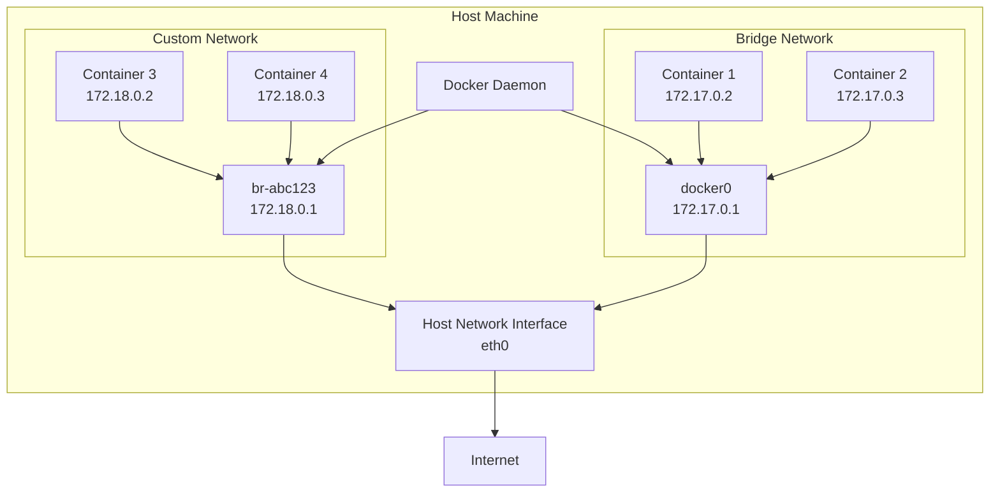
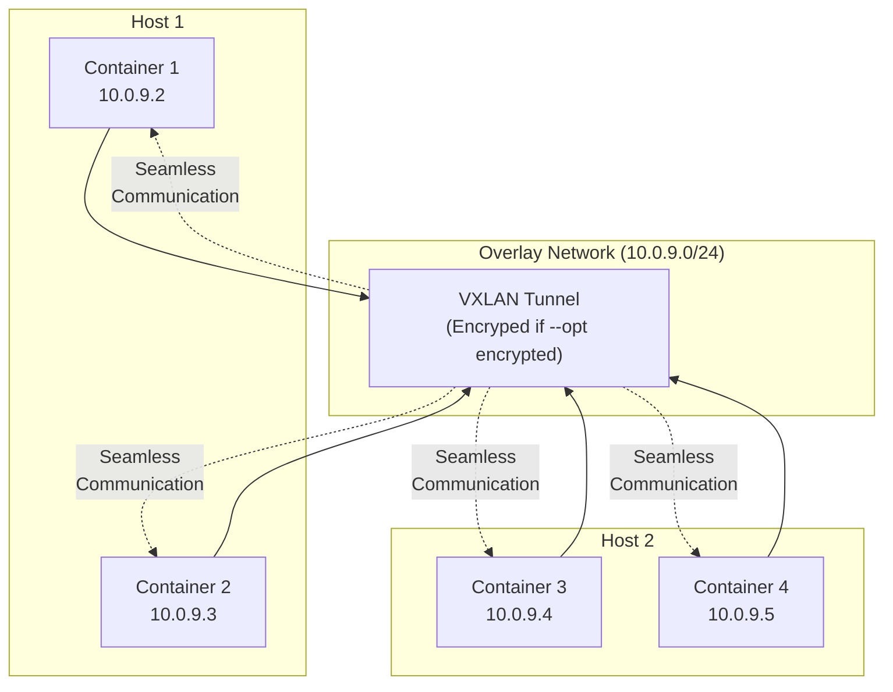

# **Docker Networking - Complete Guide** 🌐

**Master Container Networking, Communication, and Service Discovery**

---

## **Table of Contents** 📑
1. [What is Docker Networking?](#1-what-is-docker-networking)
2. [Network Drivers](#2-network-drivers)
3. [Bridge Network](#3-bridge-network)
4. [Host Network](#4-host-network)
5. [Overlay Network](#5-overlay-network)
6. [Container DNS & Service Discovery](#6-container-dns--service-discovery)
7. [Network Commands](#7-network-commands)
8. [Port Mapping & Publishing](#8-port-mapping--publishing)
9. [Network Security](#9-network-security)
10. [Real-World Scenarios](#10-real-world-scenarios)
11. [Troubleshooting](#11-troubleshooting)
12. [Interview Cheat Sheet](#12-interview-cheat-sheet)

---

## **1. What is Docker Networking?** 🎯

### **Definition**

**Docker Networking** enables communication between Docker containers, with the host, and with external networks. It provides DNS-based service discovery, network isolation, and various network topologies for different use cases.

### **Networking Architecture**



### **Key Concepts**

```
Network Namespace:
  - Each container has its own network stack
  - Isolated interfaces, routing tables, ports
  
Virtual Ethernet Pairs (veth):
  - One end in container, one in host
  - Bridge connects them
  
Container IP Addressing:
  - Automatic IP allocation
  - DNS resolution by container name
  
Network Drivers:
  - bridge: Default, single-host
  - host: Share host network
  - overlay: Multi-host (Swarm)
  - macvlan: Assign MAC addresses
  - none: No networking
```

---

## **2. Network Drivers** 🔌

### **Available Drivers**

| Driver Type | Scope | Use Case | IP Range |
|------------|-------|----------|----------|
| **bridge** | Single host | Default, isolated apps | 172.17.0.0/16 |
| **host** | Single host | Performance-critical | Host IPs |
| **overlay** | Multi-host | Swarm services | 10.0.0.0/8 |
| **macvlan** | Single host | Legacy apps, VLAN | Custom |
| **none** | Container | Complete isolation | None |

### **Driver Comparison**

```yaml
Bridge:
  ✅ Isolation between networks
  ✅ DNS resolution
  ✅ Port mapping
  ❌ Single host only
  Use: Most applications

Host:
  ✅ Maximum performance (no NAT)
  ✅ No port mapping needed
  ❌ No isolation
  ❌ Port conflicts possible
  Use: High-performance apps

Overlay:
  ✅ Multi-host communication
  ✅ Swarm integration
  ✅ Encrypted by default (with flag)
  ❌ Requires Swarm/K8s
  Use: Distributed applications

Macvlan:
  ✅ Direct physical network access
  ✅ Own MAC address
  ❌ Complex setup
  Use: Legacy applications

None:
  ✅ Maximum isolation
  ❌ No network access
  Use: Security-critical workloads
```

---

## **3. Bridge Network** 🌉

### **Default Bridge**

```bash
# The default bridge (docker0)
docker network inspect bridge

# Containers on default bridge
docker run -d --name container1 nginx
docker run -d --name container2 nginx

# Limitation: Cannot ping by name on default bridge
docker exec container1 ping container2  # ❌ Fails

# Must use IP
docker inspect container2 | grep IPAddress
docker exec container1 ping 172.17.0.3  # ✅ Works
```

### **Custom Bridge (Recommended)**

```bash
# Create custom bridge network
docker network create my-network

# Run containers on custom bridge
docker run -d --name web --network my-network nginx
docker run -d --name api --network my-network node:18

# DNS works on custom bridge
docker exec web ping api              # ✅ Works by name
docker exec api ping web              # ✅ Works by name
```

### **Bridge Network Configuration**

```bash
# Create with custom subnet
docker network create \
  --driver bridge \
  --subnet=172.20.0.0/16 \
  --ip-range=172.20.240.0/20 \
  --gateway=172.20.0.1 \
  my-custom-network

# Create with options
docker network create \
  --driver bridge \
  --opt com.docker.network.bridge.name=br-custom \
  --opt com.docker.network.bridge.enable_icc=true \
  --opt com.docker.network.bridge.enable_ip_masquerade=true \
  --opt com.docker.network.driver.mtu=1500 \
  my-advanced-network

# Inspect
docker network inspect my-custom-network
```

### **Connect Containers to Multiple Networks**

```bash
# Create networks
docker network create frontend
docker network create backend

# Run services
docker run -d --name db --network backend postgres
docker run -d --name api --network backend node:18
docker run -d --name web --network frontend nginx

# Connect API to both networks (acts as bridge  between frontend/backend)
docker network connect frontend api

# Now:
# - web can reach api (both on frontend)
# - api can reach db (both on backend)
# - web CANNOT reach db (isolated)
```

---

## **4. Host Network** 🏠

### **Using Host Network**

```bash
# Run with host network
docker run -d --network host nginx

# No port mapping needed
# Container uses host's network directly
# Access on http://localhost:80
```

### **Host vs Bridge Comparison**

```bash
# Bridge (Default)
docker run -d -p 8080:80 --name web-bridge nginx
# Access: http://localhost:8080
# Container has its own IP (172.17.0.2)

# Host
docker run -d --network host --name web-host nginx
# Access: http://localhost:80
# Container uses host's IP directly
# No port mapping needed
```

### **When to Use Host Network**

```
✅ Use Host Network:
  - Maximum network performance needed
  - Application needs many ports
  - Network debugging/monitoring tools
  - Development/testing

❌ Avoid Host Network:
  - Production (security risk)
  - When running multiple instances
  - When isolation is required
  - Cross-platform deployments
```

---

## **5. Overlay Network** ☁️

### **Swarm Overlay Network**

```bash
# Initialize Swarm (required for overlay)
docker swarm init

# Create overlay network
docker network create \
  --driver overlay \
  --subnet=10.0.9.0/24 \
  --attachable \
  my-overlay

# Deploy service on overlay
docker service create \
  --name web \
  --network my-overlay \
  --replicas 3 \
  nginx

# Containers across different hosts can communicate
```

### **Encrypted Overlay**

```bash
# Create encrypted overlay network
docker network create \
  --driver overlay \
  --opt encrypted \
  --subnet=10.0.10.0/24 \
  secure-overlay

# Traffic between containers is encrypted (IPSEC)
```

### **Overlay Network Architecture**



---

## **6. Container DNS & Service Discovery** 🔍

### **Built-in DNS Server**

```bash
# Docker runs embedded DNS server at 127.0.0.11
# Containers automatically get DNS configuration

# Check DNS config in container
docker run --rm alpine cat /etc/resolv.conf
# Output:
# nameserver 127.0.0.11
# options ndots:0

# DNS resolution by container name
docker network create mynet
docker run -d --name db --network mynet postgres
docker run --rm --network mynet alpine ping db  # Resolves to db container
```

### **DNS Round Robin  (Load Balancing)**

```bash
# Multiple containers with same alias
docker network create mynet

docker run -d --name web1 --network mynet --network-alias web nginx
docker run -d --name web2 --network mynet --network-alias web nginx
docker run -d --name web3 --network mynet --network-alias web nginx

# DNS returns IPs in round-robin fashion
docker run --rm --network mynet alpine nslookup web
# Returns all 3 IPs
# Subsequent requests distributed across containers
```

### **Service Discovery Example**

```bash
# Backend services
docker network create backend
docker run -d --name api1 --network backend my-api
docker run -d --name api2 --network backend my-api
docker run -d --name db --network backend postgres

# Frontend can discover backends by name
docker run -d --name web --network backend \
  -e API_URL=http://api1:3000 \
  -e DB_HOST=db \
  my-frontend
```

---

## **7. Network Commands** 🛠️

### **Network Management**

```bash
# List networks
docker network ls

# Create network
docker network create my-network
docker network create --driver bridge my-bridge
docker network create --driver overlay my-overlay

# Inspect network
docker network inspect my-network
docker network inspect bridge

# Remove network
docker network rm my-network
docker network prune  # Remove all unused networks

# Connect container to network
docker network connect my-network my-container

# Disconnect
docker network disconnect my-network my-container
```

### **Advanced Network Creation**

```bash
# Full configuration
docker network create \
  --driver=bridge \
  --subnet=172.28.0.0/16 \
  --ip-range=172.28.5.0/24 \
  --gateway=172.28.5.254 \
  --opt "com.docker.network.bridge.name"="docker1" \
  --label="environment"="production" \
  prod-network

# With DNS options
docker network create \
  --driver=bridge \
  --opt "com.docker.network.bridge.enable_ip_masquerade"="true" \
  --opt "com.docker.network.bridge.enable_icc"="true" \
  --opt "com.docker.network.driver.mtu"="1500" \
  my-dns-network
```

---

## **8. Port Mapping & Publishing** 🔌

### **Port Publishing Syntax**

```bash
# Basic port mapping
docker run -p 8080:80 nginx
# Host:Container (localhost:8080 → container:80)

# Bind to specific interface
docker run -p 127.0.0.1:8080:80 nginx
# Only accessible from localhost

# Random host port
docker run -P nginx
# Docker assigns random host port

# Multiple ports
docker run \
  -p 80:80 \
  -p 443:443 \
  -p 8080:8080 \
  my-app

# UDP port
docker run -p 53:53/udp dns-server

# Both TCP and UDP
docker run -p 53:53/tcp -p 53:53/udp dns-server
```

### **Port Mapping Internals**

```bash
# Docker uses iptables for port forwarding
# Check NAT rules
sudo iptables -t nat -L -n

# Example NAT rule for -p 8080:80
DNAT tcp -- 0.0.0.0/0 0.0.0.0/0 tcp dpt:8080 to:172.17.0.2:80
```

### **Expose vs Publish**

```dockerfile
# Dockerfile
EXPOSE 80
# Documents that container listens on port 80
# Does NOT publish port to host

# Must publish when running
docker run -p 8080:80 my-image
```

---

## **9. Network Security** 🔒

### **Network Isolation**

```bash
# Isolated networks for different tiers
docker network create --internal db-network    # No external access
docker network create frontend
docker network create backend

# Database (isolated, no internet)
docker run -d --name db --network db-network postgres

# API (connected to both backend and db-network)
docker run -d --name api --network backend node:18
docker network connect db-network api

# Web (only frontend)
docker run -d --name web --network frontend nginx
docker network connect backend web

# Result:
# - db: No external access, api can reach
# - api: Can reach db and web
# - web: Can reach api, cannot reach db
```

### **Inter-Container Communication (ICC)**

```bash
# Disable ICC (containers can't communicate even on same network)
docker network create \
  --opt "com.docker.network.bridge.enable_icc"="false" \
  isolated-network

# Enable ICC (default)
docker network create \
  --opt "com.docker.network.bridge.enable_icc"="true" \
  connected-network
```

### **IP Masquerading & Firewalls**

```bash
# Enable IP masquerading (SNAT for outbound)
docker network create \
  --opt "com.docker.network.bridge.enable_ip_masquerade"="true" \
  masquerade-network

# Firewall rules for specific network
sudo iptables -I DOCKER-USER -i docker0 -j DROP
sudo iptables -I DOCKER-USER -i docker0 -s 172.17.0.0/16 -j ACCEPT
```

---

## **10. Real-World Scenarios** 🌍

### **Scenario 1: Three-Tier Application**

```bash
# Create networks
docker network create frontend    # User-facing
docker network create backend     # Application logic
docker network create database    # Data tier (isolated)

# Database (isolated, no external access)
docker run -d \
  --name postgres \
  --network database \
  -e POSTGRES_PASSWORD=secret \
  postgres:14

# API Server (backend + database)
docker run -d \
  --name api \
  --network backend \
  -e DB_HOST=postgres \
  node:18
docker network connect database api

# Web Server (frontend + backend)
docker run -d \
  --name web \
  --network frontend \
  -p 80:80 \
  nginx
docker network connect backend web

# Result:
# Internet → web (frontend) → api (backend) → postgres (database)
# Direct access to postgres is blocked
```

### **Scenario 2: Microservices with Service Mesh**

```bash
# Create service network
docker network create microservices

# Service A
docker run -d \
  --name service-a \
  --network microservices \
  --network-alias service-a \
  service-a:latest

# Service B (3 replicas with same alias for load balancing)
docker run -d --name service-b-1 --network microservices --network-alias service-b service-b:latest
docker run -d --name service-b-2 --network microservices --network-alias service-b service-b:latest
docker run -d --name service-b-3 --network microservices --network-alias service-b service-b:latest

# Service C
docker run -d \
  --name service-c \
  --network microservices \
  --network-alias service-c \
  service-c:latest

# API Gateway
docker run -d \
  --name gateway \
  --network microservices \
  -p 8080:8080 \
  -e SERVICE_A_URL=http://service-a:3000 \
  -e SERVICE_B_URL=http://service-b:3000 \
  -e SERVICE_C_URL=http://service-c:3000 \
  api-gateway:latest

# DNS provides load balancing for service-b
```

### **Scenario 3: Development Environment**

```yaml
# docker-compose.yml
version: '3.8'

networks:
  frontend:
    driver: bridge
  backend:
    driver: bridge

services:
  db:
    image: postgres:14
    networks:
      - backend
    environment:
      POSTGRES_PASSWORD: devpass
      
  redis:
    image: redis:alpine
    networks:
      - backend
      
  api:
    build: ./api
    networks:
      - frontend
      - backend
    ports:
      - "5000:5000"
    environment:
      DB_HOST: db
      REDIS_HOST: redis
    depends_on:
      - db
      - redis
      
  web:
    build: ./web
    networks:
      - frontend
    ports:
      - "3000:3000"
    environment:
      API_URL: http://api:5000
    depends_on:
      - api
```

---

## **11. Troubleshooting** 🔧

### **Common Network Issues**

```bash
# Issue 1: Container can't reach other container by name
# Check if both are on same custom network (not default bridge)
docker network inspect my-network

# Solution: Connect both to same custom network
docker network connect my-network container1
docker network connect my-network container2

# Issue 2: Port already in use
# Error: Bind for 0.0.0.0:8080 failed

# Find process using port
lsof -i :8080
netstat -tulpn | grep 8080

# Kill process or use different port
docker run -p 8081:80 nginx

# Issue 3: Cannot access published port from host
# Check if port is published
docker ps

# Check container is listening
docker exec container netstat -tulpn

# Check firewall
sudo iptables -L -n
sudo ufw status

# Issue 4: DNS not resolving
# Verify DNS configuration
docker exec container cat /etc/resolv.conf

# Test DNS
docker exec container nslookup other-container
docker exec container ping other-container

# Issue 5: Network isolation not working
# Check ICC setting
docker network inspect network-name | grep enable_icc
```

### **Network Debugging Tools**

```bash
# Install network tools in container
docker run -it --network my-network alpine sh
apk add --no-cache curl netcat-openbsd bind-tools tcpdump

# Test connectivity
ping other-container
nc -zv other-container 80
nslookup other-container  
curl http://other-container

# Inspect network from inside container
ip addr
ip route
netstat -rn

# Capture packets
docker exec container tcpdump -i eth0
```

---

## **12. Interview Cheat Sheet** 🎯

### **Q1: What are Docker network drivers?**
```
Answer:
Docker provides 5 network drivers:

1. bridge (default) - Single-host, isolated networks
2. host - Share host network stack (no isolation)
3. overlay - Multi-host networking for Swarm
4. macvlan - Assign MAC addresses to containers
5. none - No networking, complete isolation

Use bridge for most single-host applications.
Use overlay for Swarm/multi-host deployments.
```

### **Q2: How does container DNS work?**
```
Answer:
- Docker runs embedded DNS server at 127.0.0.11
- Containers on custom networks can resolve each other by name
- Default bridge doesn't support DNS (use custom bridge)
- DNS provides round-robin load balancing with network aliases
  
Example:
docker network create mynet
docker run --name web1 --network mynet --network-alias web nginx
docker run --name web2 --network mynet --network-alias web nginx
# Requests to "web" distributed across web1 and web2
```

### **Q3: Bridge vs Host network?**
```
Bridge:
✅ Isolation, security
✅ Port mapping
✅ Multiple instances
❌ Slight performance overhead

Host:
✅ Maximum performance
✅ No port mapping needed
❌ No isolation
❌ Port conflicts
❌ Linux only

Use bridge for production.
Use host only when performance is critical.
```

### **Q4: How to secure Docker networks?**
```
1. Use custom bridge networks (not default)
2. Enable network isolation (separate networks per tier)
3. Use --internal flag for databases
4. Disable ICC when needed
5. Minimize published ports
6. Use encrypted overlay networks
7. Implement firewall rules
8. Scan for vulnerabilities

Example:
docker network create --internal db-net
docker run --network db-net postgres
# Database isolated from external access
```

### **Q5: Common commands?**
```
Create:     docker network create my-network
List:       docker network ls
Inspect:    docker network inspect my-network
Connect:    docker network connect my-network container
Disconnect: docker network disconnect my-network container
Remove:     docker network rm my-network
Prune:      docker network prune
```

---

## **Next Steps** 📚

- **[Docker Fundamentals](Docker_Fundamentals.md)** - Core concepts
- **[Docker Compose](Docker_Compose.md)** - Multi-container apps
- **[Docker Volumes](Docker_Volumes.md)** - Data persistence
- **[Docker Commands Cheatsheet](Docker_Commands_Cheatsheet.md)** - Quick reference

---

**🌐 Master Docker Networking for Secure and Scalable Applications!**

*Understanding Docker networking is crucial for building production-ready containerized applications.*
