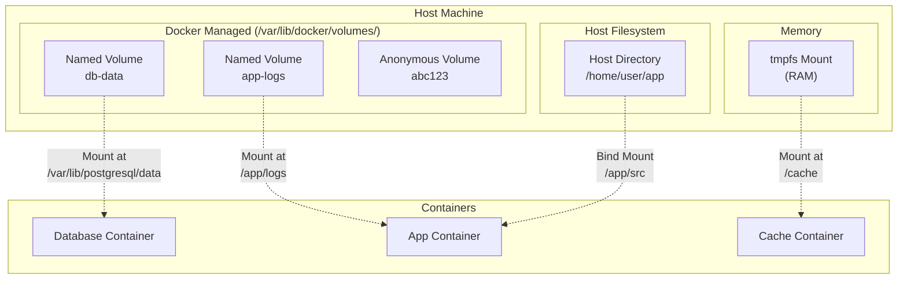

# **Docker Volumes - Complete Guide** 💾

**Master Data Persistence, Volume Management, and Storage Strategies**

---

## **Table of Contents** 📑
1. [What are Docker Volumes?](#1-what-are-docker-volumes)
2. [Volume Types](#2-volume-types)
3. [Named Volumes](#3-named-volumes)
4. [Bind Mounts](#4-bind-mounts)
5. [tmpfs Mounts](#5-tmpfs-mounts)
6. [Volume Drivers & Plugins](#6-volume-drivers--plugins)
7. [Volume Commands](#7-volume-commands)
8. [Data Persistence Strategies](#8-data-persistence-strategies)
9. [Backup & Restore](#9-backup--restore)
10. [Real-World Scenarios](#10-real-world-scenarios)
11. [Best Practices](#11-best-practices)
12. [Interview Cheat Sheet](#12-interview-cheat-sheet)

---

## **1. What are Docker Volumes?** 🎯

### **The Container Storage Problem**

```
Container Filesystem (without volumes):
  ❌ Data lost when container removed
  ❌ Hard to share data between containers
  ❌ Tightly coupled to host
  ❌ Performance issues on Mac/Windows

Example:
docker run -d --name db postgres
docker exec db psql -c "CREATE DATABASE mydb;"
docker rm -f db
docker run -d --name db postgres
# ❌ Database is gone! Data lost!
```

### **The Volume Solution**

```
With Volumes:
  ✅ Data persists beyond container lifecycle
  ✅ Share data between containers
  ✅ Easy backup and migration
  ✅ Better performance
  ✅ Managed by Docker
  ✅ Works across platforms

Example:
docker volume create db-data
docker run -d --name db -v db-data:/var/lib/postgresql/data postgres
docker rm -f db
docker run -d --name db -v db-data:/var/lib/postgresql/data postgres
# ✅ Database intact! Data persisted!
```

### **Volume Architecture**



---

## **2. Volume Types** 📦

### **Comparison Table**

| Type | Location | Managed By | Use Case | Performance |
|------|----------|------------|----------|-------------|
| **Named Volume** | `/var/lib/docker/volumes/` | Docker | Production data | High |
| **Bind Mount** | Any host path | User | Development code | Medium |
| **Anonymous Volume** | `/var/lib/docker/volumes/` | Docker | Temporary data | High |
| **tmpfs Mount** | RAM | Docker | Sensitive/temp data | Fastest |

### **Volume Type Decision Tree**

```
Need data persistence?
├─ Production → Named Volume
├─ Development (live code changes) → Bind Mount
├─ Sensitive data (passwords, tokens) → tmpfs Mount
└─ Don't care about persistence → Anonymous Volume

Need to share across containers?
├─ Yes → Named Volume or Bind Mount
└─ No → Any type

Need maximum performance?
├─ Yes → tmpfs Mount (RAM)
└─ No → Named Volume or Bind Mount
```

---

## **3. Named Volumes** 📛

### **Creating and Using Named Volumes**

```bash
# Create named volume
docker volume create my-volume

# Use when running container
docker run -d \
  --name web \
  -v my-volume:/app/data \
  nginx

# Multiple containers can use same volume
docker run -d \
  --name web2 \
  -v my-volume:/app/data \
  nginx
  
# Both containers share the same data
```

### **Volume with Options**

```bash
# Create with driver options
docker volume create \
  --driver local \
  --opt type=nfs \
  --opt o=addr=192.168.1.1,rw \
  --opt device=:/path/to/dir \
  nfs-volume

# Create with labels
docker volume create \
  --label environment=production \
  --label team=backend \
  prod-db-volume
```

### **Inspect Volume**

```bash
# Inspect volume
docker volume inspect my-volume

# Output:
[
    {
        "CreatedAt": "2024-01-15T10:30:00Z",
        "Driver": "local",
        "Labels": {},
        "Mountpoint": "/var/lib/docker/volumes/my-volume/_data",
        "Name": "my-volume",
        "Options": {},
        "Scope": "local"
    }
]

# Access on host (requires sudo)
sudo ls -la /var/lib/docker/volumes/my-volume/_data
```

### **Named Volume Examples**

```bash
# Database persistence
docker run -d \
  --name postgres \
  -v pg-data:/var/lib/postgresql/data \
  -e POSTGRES_PASSWORD=secret \
  postgres:14

# Application logs
docker run -d \
  --name app \
  -v app-logs:/var/log/app \
  my-app:latest

# Shared  configuration
docker volume create shared-config
docker run -d --name app1 -v shared-config:/config:ro app1
docker run -d --name app2 -v shared-config:/config:ro app2
# Both apps read from same config (read-only)
```

---

## **4. Bind Mounts** 🔗

### **Using Bind Mounts**

```bash
# Bind mount syntax
docker run -v /host/path:/container/path image

# Explicit bind mount
docker run -d \
  --name web \
  -v /home/user/website:/usr/share/nginx/html \
  nginx

# With read-only
docker run -d \
  --name web \
  -v /home/user/config:/etc/nginx:ro \
  nginx

# Using --mount (more explicit, recommended)
docker run -d \
  --name web \
  --mount type=bind,source=/home/user/website,target=/usr/share/nginx/html \
  nginx
```

### **Bind Mount Use Cases**

```bash
# Development: Live code reload
docker run -d \
  --name dev-app \
  -v $(pwd)/src:/app/src \
  -v $(pwd)/package.json:/app/package.json \
  -p 3000:3000 \
  node:18 \
  npm run dev
# Code changes reflected immediately

# Configuration files
docker run -d \
  --name nginx \
  -v /etc/nginx/sites-enabled:/etc/nginx/conf.d:ro \
  nginx

# Log aggregation
docker run -d \
  --name app \
  -v /var/log/app:/app/logs \
  my-app
# Logs written to host for centralized logging

# Docker-in-Docker
docker run -d \
  --name dind \
  -v /var/run/docker.sock:/var/run/docker.sock \
  docker:dind
# Access to host Docker daemon
```

### **Bind Mount Gotchas**

```bash
# Problem: Permission issues
docker run -v $(pwd):/app alpine ls -la /app
# Files may be owned by root

# Solution 1: Run as current user
docker run -u $(id -u):$(id -g) -v $(pwd):/app alpine touch /app/test.txt

# Solution 2: Fix permissions in Dockerfile
USER node
WORKDIR /app

# Problem: Directory doesn't exist on host
docker run -v /nonexistent:/app nginx
# Error: Bind source path does not exist

# Solution: Create first
mkdir -p /nonexistent
docker run -v /nonexistent:/app nginx
```

---

## **5. tmpfs Mounts** 💨

### **Using tmpfs Mounts**

```bash
# tmpfs mount (stored in memory, not on disk)
docker run -d \
  --name cache \
  --tmpfs /cache:rw,size=100m,mode=1777 \
  redis

# Or using --mount
docker run -d \
  --name app \
  --mount type=tmpfs,destination=/tmp,tmpfs-size=100m \
  my-app
```

### **tmpfs Options**

```bash
# With size limit
docker run -d \
  --tmpfs /cache:rw,size=500m \
  my-app

# With mode (permissions)
docker run -d \
  --tmpfs /tmp:rw,noexec,nosuid,size=100m,mode=1777 \
  my-app

# Multiple tmpfs mounts
docker run -d \
  --tmpfs /cache:size=100m \
  --tmpfs /tmp:size=50m \
  my-app
```

### **When to Use tmpfs**

```
✅ Use tmpfs for:
  - Sensitive data (passwords, tokens, secrets)
  - Temporary processing data
  - High-speed cache
  - Session data
  - Build artifacts during multi-stage builds

❌ Don't use tmpfs for:
  - Data that needs persistence
  - Large datasets (limited by RAM)
  - Production databases

Example:
docker run -d \
  --name secure-app \
  --tmpfs /run/secrets:ro,size=10m \
  --tmpfs /tmp:rw,noexec,size=100m \
  my-secure-app
# Secrets in memory only, never written to disk
```

---

## **6. Volume Drivers & Plugins** 🔌

### **Built-in Drivers**

```bash
# Local driver (default)
docker volume create --driver local my-vol

# Local with options
docker volume create \
  --driver local \
  --opt type=btrfs \
  --opt device=/dev/sdb \
  btrfs-vol
```

### **Third-Party Drivers**

```bash
# NFS Volume
docker volume create \
  --driver local \
  --opt type=nfs \
  --opt o=addr=nfs-server.example.com,rw,nfsvers=4 \
  --opt device=:/path/on/server \
  nfs-volume

# CIFS/SMB Volume (Windows share)
docker volume create \
  --driver local \
  --opt type=cifs \
  --opt o=username=user,password=pass,domain=WORKGROUP \
  --opt device=//smbserver/share \
  smb-volume

# AWS EBS (requires plugin)
docker volume create \
  --driver rexray/ebs \
  --opt size=10 \
  --opt volumetype=gp2 \
  ebs-volume

# Azure File Storage (requires plugin)
docker volume create \
  --driver azurefile \
  --opt share=myshare \
  azure-volume
```

### **Popular Volume Plugins**

```bash
# Install REX-Ray (cloud storage)
docker plugin install rexray/ebs

# Install Convoy (snapshot support)
docker plugin install rancher/convoy

# Install Portworx (enterprise storage)
docker plugin install portworx/px-dev

# List installed plugins
docker plugin ls
```

---

## **7. Volume Commands** 🛠️

### **Essential Commands**

```bash
# Create volume
docker volume create my-volume
docker volume create --name my-volume --driver local

# List volumes
docker volume ls
docker volume ls --filter dangling=true  # Unused volumes
docker volume ls --format "{{.Name}}: {{.Driver}}"

# Inspect volume
docker volume inspect my-volume
docker volume inspect $(docker volume ls -q)  # All volumes

# Remove volume
docker volume rm my-volume
docker volume rm $(docker volume ls -q)  # Remove all

# Remove unused volumes
docker volume prune
docker volume prune -f  # Force, no prompt
docker volume prune --filter "label=environment=test"

# Check volume usage
docker system df -v
```

### **Volume in Container Commands**

```bash
# Run with volume
docker run -v my-volume:/data nginx

# Run with multiple volumes
docker run \
  -v vol1:/data1  \
  -v vol2:/data2 \
  nginx

# Run with volume options
docker run \
  --mount source=my-vol,target=/data,readonly \
  nginx

# Copy from container to volume
docker cp my-container:/app/data my-volume:/

# Inspect container mounts
docker inspect my-container --format '{{ .Mounts }}'
```

---

## **8. Data Persistence Strategies** 💼

### **Database Persistence**

```bash
# PostgreSQL
docker run -d \
  --name postgres \
  -v pg-data:/var/lib/postgresql/data \
  -e POSTGRES_PASSWORD=secret \
  postgres:14

# MySQL
docker run -d \
  --name mysql \
  -v mysql-data:/var/lib/mysql \
  -e MYSQL_ROOT_PASSWORD=secret \
  mysql:8

# MongoDB
docker run -d \
  --name mongo \
  -v mongo-data:/data/db \
  -v mongo-config:/data/configdb \
  mongo:6

# Redis (with persistence)
docker run -d \
  --name redis \
  -v redis-data:/data \
  redis:7 \
  redis-server --appendonly yes
```

### **Application Data Patterns**

```bash
# Pattern 1: Separate volumes for different data types
docker run -d \
  --name app \
  -v app-data:/app/data \
  -v app-logs:/app/logs \
  -v app-config:/app/config:ro \
  -v app-uploads:/app/uploads \
  my-app

# Pattern 2: Shared volume between containers
docker volume create shared-data
docker run -d --name producer -v shared-data:/data producer-app
docker run -d --name consumer -v shared-data:/data consumer-app

# Pattern 3: Init container pattern
docker volume create app-config
# Init container populates config
docker run --rm -v app-config:/config init-container
# App uses pre-populated config
docker run -d -v app-config:/app/config:ro my-app
```

---

## **9. Backup & Restore** 💾

### **Backup Named Volume**

```bash
# Method 1: Using tar
docker run --rm \
  -v my-volume:/data \
  -v $(pwd):/backup \
  alpine \
  tar czf /backup/backup-$(date +%Y%m%d).tar.gz /data

# Method 2: Copy to host
docker run --rm \
  -v my-volume:/data \
  -v $(pwd)/backup:/backup \
  alpine \
  cp -r /data /backup

# Backup with timestamp
BACKUP_NAME="backup-$(date +%Y%m%d-%H%M%S).tar.gz"
docker run --rm \
  -v my-volume:/data:ro \
  -v $(pwd):/backup \
  alpine \
  tar czf /backup/$BACKUP_NAME -C /data .
```

### **Restore Volume**

```bash
# Restore from tar backup
docker run --rm \
  -v my-volume:/data \
  -v $(pwd):/backup \
  alpine \
  tar xzf /backup/backup.tar.gz -C /data

# Restore from directory
docker run --rm \
  -v my-volume:/data \
  -v $(pwd)/backup:/backup:ro \
  alpine \
  cp -r /backup/. /data/
```

### **Database-Specific Backup**

```bash
# PostgreSQL backup
docker exec postgres pg_dump -U user dbname > backup.sql
# Or using volume
docker run --rm \
  --link postgres:db \
  -v $(pwd):/backup \
  postgres:14 \
  pg_dump -h db -U user dbname > /backup/backup.sql

# PostgreSQL restore
docker exec -i postgres psql -U user dbname < backup.sql

# MySQL backup
docker exec mysql mysqldump -u root -psecret dbname > backup.sql

# MySQL restore
docker exec -i mysql mysql -u root -psecret dbname < backup.sql

# MongoDB backup
docker exec mongo mongodump --out=/backup
docker cp mongo:/backup ./backup

# MongoDB restore
docker cp ./backup mongo:/backup
docker exec mongo mongorestore /backup
```

---

## **10. Real-World Scenarios** 🌍

### **Scenario 1: Development Environment**

```yaml
# docker-compose.yml
version: '3.8'

services:
  db:
    image: postgres:14
    volumes:
      - db-data:/var/lib/postgresql/data
      - ./db/init.sql:/docker-entrypoint-initdb.d/init.sql:ro
    environment:
      POSTGRES_PASSWORD: devpass
      
  backend:
    build: ./backend
    volumes:
      # Bind mount for live reload
      - ./backend/src:/app/src
      - ./backend/package.json:/app/package.json
      # Named volume for node_modules (don't override)
      - backend-node-modules:/app/node_modules
    depends_on:
      - db
      
  frontend:
    build: ./frontend
    volumes:
      - ./frontend/src:/app/src
      - ./frontend/package.json:/app/package.json
      - frontend-node-modules:/app/node_modules
    ports:
      - "3000:3000"

volumes:
  db-data:
  backend-node-modules:
  frontend-node-modules:
```

### **Scenario 2: Production Multi-Container App**

```yaml
version: '3.8'

services:
  db:
    image: postgres:14
    volumes:
      # Named volumes for data
      - db-data:/var/lib/postgresql/data
    environment:
      POSTGRES_PASSWORD_FILE: /run/secrets/db_password
    secrets:
      - db_password
    deploy:
      replicas: 1
      placement:
        constraints:
          - node.role == manager
          
  redis:
    image: redis:7-alpine
    volumes:
      - redis-data:/data
    command: redis-server --appendonly yes
    
  app:
    image: my-app:latest
    volumes:
      # Read-only config
      - app-config:/app/config:ro
      # Writable logs and uploads
      - app-logs:/app/logs
      - app-uploads:/app/uploads
    environment:
      DB_HOST: db
      REDIS_HOST: redis
    depends_on:
      - db
      - redis
    deploy:
      replicas: 3

volumes:
  db-data:
    driver: rexray/ebs
    driver_opts:
      size: 20
      volumetype: gp2
  redis-data:
  app-config:
  app-logs:
  app-uploads:

secrets:
  db_password:
    external: true
```

### **Scenario 3: Data Migration**

```bash
# Migrate from old to new volume

# 1. Create new volume
docker volume create new-volume

# 2. Copy data from old to new
docker run --rm \
  -v old-volume:/from \
  -v new-volume:/to \
  alpine \
  sh -c "cd /from && cp -av . /to"

# 3. Verify data
docker run --rm -v new-volume:/data alpine ls -la /data

# 4. Update container to use new volume
docker stop app
docker rm app
docker run -d --name app -v new-volume:/data my-app

# 5. Remove old volume
docker volume rm old-volume
```

---

## **11. Best Practices** ⭐

### **Do's**

```
✅ Use named volumes for production data
✅ Use bind mounts for development
✅ Set explicit volume permissions
✅ Regular backups of critical data
✅ Use volume labels for organization
✅ Monitor volume usage (docker system df)
✅ Use read-only mounts when possible
✅ Separate volumes for different data types
✅ Document volume requirements
✅ Test backup and restore procedures
```

### **Don'ts**

```
❌ Don't store data in container layer
❌ Don't use anonymous volumes in production
❌ Don't bind mount system directories unnecessarily
❌ Don't forget to backup volumes
❌ Don't run containers as root with bind mounts
❌ Don't use tmpfs for persistent data
❌ Don't ignore volume cleanup (orphan volumes)
❌ Don't hardcode paths (use environment variables)
```

### **Security Best Practices**

```bash
# Use read-only volumes
docker run -v config:/app/config:ro app

# Run as non-root user
docker run -u 1000:1000 -v data:/data app

# Use tmpfs for sensitive data
docker run --tmpfs /run/secrets:ro,mode=0700 app

# Don't expose Docker socket unnecessarily
# ❌ Dangerous
docker run -v /var/run/docker.sock:/var/run/docker.sock app

# Use secrets management
docker secret create db_password password.txt
docker service create --secret db_password postgres
```

---

## **12. Interview Cheat Sheet** 🎯

### **Q1: What are Docker volumes?**
```
Answer:
Docker volumes are the preferred mechanism for persisting data
generated and used by Docker containers.

Types:
1. Named volumes - Managed by Docker, production-ready
2. Bind mounts - Map host directory, development
3. tmpfs mounts - Memory-only, temporary data

Benefits:
- Data persists beyond container lifecycle
- Share data between containers
- Easy backup and restore
- Better performance than container filesystem
```

### **Q2: Named volume vs Bind mount?**
```
Named Volume:
✅ Managed by Docker
✅ Portable across environments
✅ Better performance (especially Mac/Windows)
✅ Production-ready
❌ Not directly accessible on host

Bind Mount:
✅ Directly accessible on host
✅ Live code changes (development)
❌ Not portable
❌ Security concerns

Use named volumes for production.
Use bind mounts for development.
```

### **Q3: How to backup/restore volumes?**
```
Backup:
docker run --rm \
  -v my-volume:/data \
  -v $(pwd):/backup \
  alpine \
  tar czf /backup/backup.tar.gz /data

Restore:
docker run --rm \
  -v my-volume:/data \
  -v $(pwd):/backup \
  alpine \
  tar xzf /backup/backup.tar.gz -C /data

For databases, use native tools:
- PostgreSQL: pg_dump / pg_restore
- MySQL: mysqldump / mysql
- MongoDB: mongodump / mongorestore
```

### **Q4: Common commands?**
```
Create:    docker volume create my-vol
List:      docker volume ls
Inspect:   docker volume inspect my-vol
Remove:    docker volume rm my-vol
Prune:     docker volume prune
Use:       docker run -v my-vol:/data image
```

### **Q5: Data persistence for databases?**
```
PostgreSQL:
docker run -v pg-data:/var/lib/postgresql/data postgres

MySQL:
docker run -v mysql-data:/var/lib/mysql mysql

MongoDB:
docker run -v mongo-data:/data/db mongo

Redis:
docker run -v redis-data:/data redis redis-server --appendonly yes

Always use named volumes for database data.
Regular backups are essential.
Test restore procedures.
```

---

## **Next Steps** 📚

- **[Docker Fundamentals](Docker_Fundamentals.md)** - Core concepts
- **[Docker Compose](Docker_Compose.md)** - Multi-container apps  
- **[Docker Networking](Docker_Networking.md)** - Container communication
- **[Docker Commands Cheatsheet](Docker_Commands_Cheatsheet.md)** - Quick reference

---

**💾 Master Docker Volumes for Reliable Data Persistence!**

*Understanding volumes is critical for production Docker deployments and data safety.*
