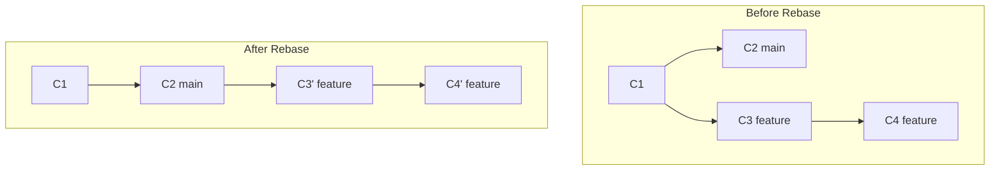
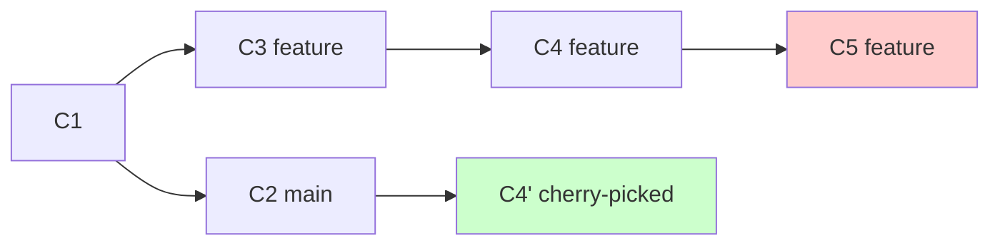
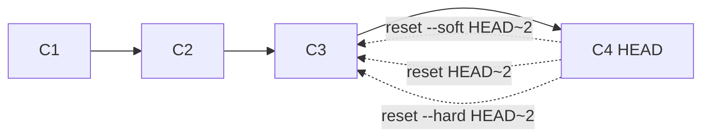
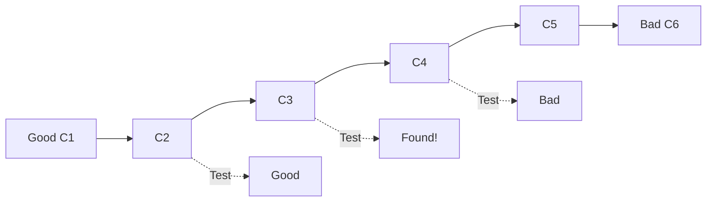

# **Git Advanced Commands – Power User Techniques** ⚡🔥

Master advanced Git operations that every senior DevOps engineer must know - rebase, cherry-pick, stash, reset, and more for professional version control mastery.

---

## **Table of Contents** 📑
1. [Git Rebase](#1-git-rebase)
2. [Interactive Rebase](#2-interactive-rebase)
3. [Cherry-Pick](#3-cherry-pick)
4. [Git Stash](#4-git-stash)
5. [Reset vs Revert](#5-reset-vs-revert)
6. [Reflog - Time Machine](#6-reflog---time-machine)
7. [Git Bisect](#7-git-bisect)
8. [Submodules](#8-submodules)
9. [Advanced Diff & Log](#9-advanced-diff--log)
10. [Practical DevOps Scenarios](#10-practical-devops-scenarios)
11. [Industry Best Practices](#11-industry-best-practices)
12. [Interview Cheat Sheet](#12-interview-cheat-sheet)

---

## **1. Git Rebase** 🔄

### **What is Rebase?**

Rebase **replays commits** from one branch onto another, creating a linear history.



### **Rebase vs Merge:**

| Aspect | Rebase | Merge |
|--------|--------|-------|
| **History** | Linear, clean | Branched, complete |
| **Commits** | Rewrites (new SHA) | Preserves (same SHA) |
| **Merge Commit** | No | Yes |
| **Safety** | Dangerous on shared | Safe always |
| **Conflicts** | Per commit | Once at end |

### **Basic Rebase:**

```bash
# Rebase current branch onto main
git checkout feature
git rebase main

# Or in one command
git rebase main feature

# Rebase onto specific commit
git rebase abc123
```

### **How Rebase Works:**

```bash
# Original state:
#   C1 -- C2 (main)
#    \
#     C3 -- C4 (feature)

# Execute rebase:
git checkout feature
git rebase main

# Result:
#   C1 -- C2 (main) -- C3' -- C4' (feature)
# Note: C3' and C4' are NEW commits (different SHA)
```

### **Rebase with Conflicts:**

```bash
# Start rebase
git rebase main
# CONFLICT (content): Merge conflict in file.txt

# Resolve conflict
vim file.txt           # Fix conflict
git add file.txt       # Stage resolution

# Continue rebase
git rebase --continue

# Or skip this commit
git rebase --skip

# Or abort entirely
git rebase --abort
```

### **Rebase onto Branch:**

```bash
# Rebase feature onto develop instead of main
git rebase --onto develop main feature

# Syntax:
# git rebase --onto <newbase> <oldbase> <branch>
```

### **Golden Rule of Rebase:**

⚠️ **NEVER rebase commits that have been pushed to shared branches**

```bash
# ✅ SAFE - Local commits only
git checkout feature
git rebase main
git push -u origin feature

# ❌ DANGEROUS - Already pushed and shared
git checkout main
git rebase feature  # Others have this history
git push --force    # BREAKS everyone's repo!
```

---

## **2. Interactive Rebase** 🎛️

### **What is Interactive Rebase?**

Powerful tool to **edit commit history** before sharing.

### **Start Interactive Rebase:**

```bash
# Rebase last 5 commits
git rebase -i HEAD~5

# Rebase from specific commit
git rebase -i abc123

# Rebase from branch point
git rebase -i main
```

### **Interactive Rebase Editor:**

```bash
pick abc1234 feat: Add user authentication
pick def5678 fix: Typo in README
pick ghi9012 feat: Add password validation
pick jkl3456 fix: Fix typo again
pick mno7890 refactor: Improve code quality

# Commands:
# p, pick   = use commit
# r, reword = use commit, but edit message
# e, edit   = use commit, but stop for amending
# s, squash = use commit, but meld into previous
# f, fixup  = like squash, but discard commit message
# x, exec   = run command (rest of the line) using shell
# d, drop   = remove commit
```

### **Reword Commits:**

```bash
# Change 'pick' to 'reword' or 'r'
reword abc1234 feat: Add user authentication
pick def5678 fix: Typo in README
pick ghi9012 feat: Add password validation

# Save and close → Editor opens for each reworded commit
# Edit message, save, continue
```

### **Squash Commits:**

```bash
# Combine multiple commits into one
pick abc1234 feat: Add user authentication
squash def5678 fix: Typo in README
squash ghi9012 feat: Add password validation

# Result: One commit with combined messages
# Or use 'fixup' to discard messages
pick abc1234 feat: Add user authentication
fixup def5678 fix: Typo in README
fixup ghi9012 feat: Add password validation
```

### **Reorder Commits:**

```bash
# Simply reorder lines
pick ghi9012 feat: Add password validation
pick abc1234 feat: Add user authentication
pick def5678 fix: Typo in README

# Commits applied in new order
```

### **Edit Commit:**

```bash
# Mark commit for editing
edit abc1234 feat: Add user authentication
pick def5678 fix: Typo in README

# Rebase stops at marked commit
# Make changes
vim file.txt
git add file.txt

# Amend commit or create new ones
git commit --amend

# Continue
git rebase --continue
```

### **Drop Commits:**

```bash
# Remove commits from history
drop abc1234 Experimental code
pick def5678 fix: Typo in README
pick ghi9012 feat: Add password validation

# Or just delete the line
pick def5678 fix: Typo in README
pick ghi9012 feat: Add password validation
```

### **Execute Commands:**

```bash
# Run tests after each commit
pick abc1234 feat: Add user authentication
exec npm test
pick def5678 feat: Add password validation
exec npm test

# Stops if command fails
```

### **Auto-squash:**

```bash
# Create fixup commit
git commit --fixup=abc1234

# Later, auto-squash during rebase
git rebase -i --autosquash main
# Automatically orders and marks fixup commits
```

---

## **3. Cherry-Pick** 🍒

### **What is Cherry-Pick?**

Apply **specific commits** from one branch to another.



### **Basic Cherry-Pick:**

```bash
# Apply specific commit to current branch
git cherry-pick abc1234

# Apply multiple commits
git cherry-pick abc1234 def5678 ghi9012

# Apply range of commits
git cherry-pick abc1234..ghi9012
git cherry-pick abc1234^..ghi9012  # Include abc1234
```

### **Cherry-Pick Options:**

```bash
# Cherry-pick without commit (stage only)
git cherry-pick -n abc1234
git cherry-pick --no-commit abc1234

# Edit commit message
git cherry-pick -e abc1234
git cherry-pick --edit abc1234

# Add signoff
git cherry-pick -s abc1234
git cherry-pick --signoff abc1234

# Keep original author
git cherry-pick -x abc1234
# Adds "(cherry picked from commit abc1234)"
```

### **Cherry-Pick with Conflicts:**

```bash
# Start cherry-pick
git cherry-pick abc1234
# CONFLICT (content): Merge conflict in file.txt

# Resolve conflict
vim file.txt
git add file.txt

# Continue
git cherry-pick --continue

# Or abort
git cherry-pick --abort

# Or skip
git cherry-pick --skip
```

### **Cherry-Pick Multiple:**

```bash
# Cherry-pick all feature commits to hotfix
git checkout hotfix
git cherry-pick feature~3..feature

# Cherry-pick with parent specification (for merge commits)
git cherry-pick -m 1 abc1234
# -m 1 = use first parent
```

### **Use Cases:**

```bash
# ✅ Port bugfix to multiple branches
git checkout release-1.0
git cherry-pick bugfix-commit

git checkout release-2.0
git cherry-pick bugfix-commit

# ✅ Undo specific commit
git revert abc1234

# ✅ Apply hotfix to main and develop
git checkout main
git cherry-pick hotfix-commit

git checkout develop
git cherry-pick hotfix-commit
```

---

## **4. Git Stash** 💾

### **What is Stash?**

**Temporarily save** uncommitted changes without committing.

### **Basic Stash:**

```bash
# Stash current changes
git stash
git stash push

# Stash with message
git stash push -m "WIP: Feature implementation"
git stash save "WIP: Feature implementation"  # Legacy

# Stash including untracked files
git stash -u
git stash --include-untracked

# Stash including ignored files
git stash -a
git stash --all

# Stash only specific files
git stash push -m "Partial work" src/file.js src/other.js
```

### **List Stashes:**

```bash
# Show all stashes
git stash list
# Output:
# stash@{0}: WIP on main: abc1234 Latest commit
# stash@{1}: On feature: def5678 Experimental work
# stash@{2}: WIP on develop: ghi9012 Bug fix

# Show stash content
git stash show
git stash show stash@{1}

# Show detailed diff
git stash show -p
git stash show -p stash@{1}
```

### **Apply Stash:**

```bash
# Apply latest stash (keep in stash list)
git stash apply

# Apply specific stash
git stash apply stash@{1}

# Apply and remove from stash list
git stash pop
git stash pop stash@{1}

# Apply to new branch
git stash branch feature-branch
git stash branch feature-branch stash@{1}
```

### **Delete Stash:**

```bash
# Delete specific stash
git stash drop
git stash drop stash@{1}

# Delete all stashes
git stash clear
```

### **Partial Stash (Patch Mode):**

```bash
# Interactively select what to stash
git stash -p
git stash --patch

# For each hunk:
y - stash this hunk
n - do not stash this hunk
q - quit
a - stash this and all remaining hunks
d - do not stash this or any remaining
s - split the hunk
e - manually edit the hunk
```

### **Stash Untracked/Ignored:**

```bash
# Stash untracked files
git stash -u

# Stash tracked + untracked + ignored
git stash -a

# Stash only untracked
git stash push --include-untracked --keep-index
```

### **Advanced Stash:**

```bash
# Create stash without removing changes
git stash create

# Store custom stash
git stash store -m "Custom stash" $(git stash create)

# Stash and keep staged changes
git stash --keep-index
```

---

## **5. Reset vs Revert** ⏮️

### **Git Reset - Undo Commits (Rewrites History)**



### **Reset Modes:**

| Mode | HEAD | Index (Staging) | Working Directory |
|------|------|-----------------|-------------------|
| **--soft** | Reset | Keep | Keep |
| **--mixed** (default) | Reset | Reset | Keep |
| **--hard** | Reset | Reset | Reset |

### **Soft Reset:**

```bash
# Undo commits, keep changes staged
git reset --soft HEAD~1
git reset --soft abc1234

# Use case: Recommit with different message
git reset --soft HEAD~1
git commit -m "Better commit message"

# Or combine multiple commits
git reset --soft HEAD~3
git commit -m "Combined commit"
```

### **Mixed Reset (Default):**

```bash
# Undo commits, unstage changes
git reset HEAD~1
git reset --mixed HEAD~1

# Use case: Re-stage selectively
git reset HEAD~1
git add file1.js
git commit -m "First commit"
git add file2.js
git commit -m "Second commit"
```

### **Hard Reset:**

```bash
# ⚠️ DESTRUCTIVE - Undo commits, discard changes
git reset --hard HEAD~1
git reset --hard abc1234

# Use case: Discard all local changes
git reset --hard origin/main

# Reset specific file
git reset HEAD file.txt
git checkout -- file.txt
# Or with new command:
git restore file.txt
```

### **Git Revert - Undo Commits (Safe for Shared)**

```bash
# Create new commit that undoes changes
git revert HEAD
git revert abc1234

# Revert multiple commits
git revert abc1234 def5678

# Revert range
git revert abc1234..ghi9012

# Revert without committing
git revert -n HEAD
git revert --no-commit HEAD

# Revert merge commit
git revert -m 1 merge-commit-sha
# -m 1 = keep first parent (main)
```

### **Reset vs Revert Comparison:**

```bash
# ✅ RESET - Local changes only
git reset --hard HEAD~1
# History rewritten, can't push normally

# ✅ REVERT - Shared branches
git revert HEAD
# New commit, safe to push
```

---

## **6. Reflog - Time Machine** ⏰

### **What is Reflog?**

**Reference log** of all HEAD movements - your Git safety net!

### **View Reflog:**

```bash
# Show all reflog entries
git reflog

# Output:
# abc1234 HEAD@{0}: commit: Add feature
# def5678 HEAD@{1}: checkout: moving from main to feature
# ghi9012 HEAD@{2}: commit: Fix bug
# jkl3456 HEAD@{3}: reset: moving to HEAD~1

# Show reflog for specific branch
git reflog show main
git reflog show feature

# Show with dates
git reflog --date=relative
git reflog --date=iso
```

### **Recover Lost Commits:**

```bash
# Scenario: Accidentally deleted branch
git branch -D feature
# Oh no! Lost important work

# Find lost commit
git reflog
# abc1234 HEAD@{5}: commit: Important feature work

# Recover
git checkout abc1234
git branch feature  # Recreate branch
# Or
git checkout -b feature abc1234
```

### **Recover from Hard Reset:**

```bash
# Accidentally hard reset
git reset --hard HEAD~3
# Deleted 3 commits!

# Find lost commit
git reflog
# def5678 HEAD@{1}: reset: moving to HEAD~3
# abc1234 HEAD@{0}: commit: Lost commit 1  # ← Need this

# Recover
git reset --hard abc1234
# Or
git cherry-pick abc1234
```

### **Reflog with Time:**

```bash
# Reset to 2 hours ago
git reset --hard HEAD@{2.hours.ago}

# Reset to yesterday
git reset --hard HEAD@{yesterday}

# Reset to specific date
git reset --hard HEAD@{2024-01-15}
```

### **Clean Reflog:**

```bash
# Expire old reflog entries
git reflog expire --expire=30.days --all

# Garbage collect
git gc --prune=now

# Aggressive cleanup
git reflog expire --expire-unreachable=now --all
git gc --prune=now --aggressive
```

---

## **7. Git Bisect** 🔍

### **What is Bisect?**

**Binary search** to find which commit introduced a bug.



### **Basic Bisect:**

```bash
# Start bisect
git bisect start

# Mark current commit as bad
git bisect bad

# Mark last known good commit
git bisect good abc1234

# Git checks out middle commit
# Test the commit
npm test  # Or manual testing

# If test passes
git bisect good

# If test fails
git bisect bad

# Repeat until found
# Git will report: "abc1234 is the first bad commit"

# End bisect
git bisect reset
```

### **Automated Bisect:**

```bash
# Automate with test script
git bisect start HEAD abc1234
git bisect run npm test

# Or custom script
git bisect run sh -c "make && make test"

# Script should exit 0 for good, non-zero for bad
```

### **Bisect with Skips:**

```bash
# Skip untestable commit
git bisect skip

# Skip all commits touching specific file
git bisect skip $(git rev-list HEAD..abc1234 -- path/to/file)
```

### **Bisect Log:**

```bash
# View bisect log
git bisect log

# Save bisect log
git bisect log > bisect_log.txt

# Replay bisect
git bisect replay bisect_log.txt
```

### **Bisect Visualization:**

```bash
# Show bisect progress
git bisect visualize
git bisect view

# With custom log viewer
git bisect visualize --oneline
```

---

## **8. Submodules** 📦

### **What are Submodules?**

Repository **within another repository** - for vendoring dependencies.

### **Add Submodule:**

```bash
# Add submodule
git submodule add https://github.com/user/repo.git path/to/submodule

# Add with specific branch
git submodule add -b main https://github.com/user/repo.git lib/repo

# Commit .gitmodules and submodule
git commit -m "Add submodule"
```

### **Clone with Submodules:**

```bash
# Clone and initialize submodules
git clone --recursive https://github.com/user/repo.git
git clone --recurse-submodules https://github.com/user/repo.git

# Or after cloning
git clone https://github.com/user/repo.git
cd repo
git submodule init
git submodule update
```

### **Update Submodules:**

```bash
# Update all submodules
git submodule update --remote

# Update specific submodule
git submodule update --remote path/to/submodule

# Update and merge
git submodule update --remote --merge

# Update and rebase
git submodule update --remote --rebase

# Update recursively
git submodule update --init --recursive
```

### **Submodule Status:**

```bash
# Show submodule status
git submodule status

# Show submodule summary
git submodule summary

# Show submodule details
git submodule foreach git branch
git submodule foreach git status
```

### **Remove Submodule:**

```bash
# 1. Deinitialize submodule
git submodule deinit path/to/submodule

# 2. Remove from index
git rm path/to/submodule

# 3. Remove .git/modules entry
rm -rf .git/modules/path/to/submodule

# 4. Commit
git commit -m "Remove submodule"
```

### **Foreach in Submodules:**

```bash
# Run command in all submodules
git submodule foreach git pull origin main
git submodule foreach git checkout develop
git submodule foreach 'git fetch && git merge origin/main'
```

---

## **9. Advanced Diff & Log** 📊

### **Advanced Diff:**

```bash
# Diff between commits
git diff abc1234 def5678

# Diff specific file
git diff abc1234 def5678 -- file.txt

# Diff branches
git diff main feature
git diff main...feature  # Since common ancestor

# Stat summary
git diff --stat
git diff --stat main feature

# Name only
git diff --name-only
git diff --name-status

# Word diff
git diff --word-diff
git diff --word-diff=color

# Ignore whitespace
git diff -w
git diff --ignore-all-space

# Show function context
git diff --function-context
```

### **Advanced Log:**

```bash
# Custom format
git log --pretty=format:"%h - %an, %ar : %s"

# Graph with details
git log --graph --all --decorate --oneline

# Commits by author
git log --author="John Doe"
git log --author="john\|jane"  # Multiple authors

# Commits affecting file
git log -- path/to/file
git log -p -- path/to/file  # With patches

# Commits with message
git log --grep="fix"
git log --grep="feature"

# Commits adding/removing string
git log -S"function_name"
git log -G"regex_pattern"

# Date ranges
git log --since="2 weeks ago"
git log --after="2024-01-01" --before="2024-12-31"

# Merge commits
git log --merges
git log --no-merges

# First parent only
git log --first-parent
```

### **Pickaxe Search:**

```bash
# Find when string was added/removed
git log -S"function_name" -p

# Find when regex was added/removed
git log -G"emit.*Event" -p

# Show what changed
git log -S"bug" --source --all
```

### **Filtering History:**

```bash
# Commits modifying paths
git log -- src/ tests/

# Commits between branches
git log main..feature      # On feature, not on main
git log feature..main      # On main, not on feature
git log main...feature     # On both, not on common

# Show specific commit count
git log -n 5
git log -5
```

---

## **10. Practical DevOps Scenarios** 🛠️

### **Scenario 1: Clean Up Commit History Before PR**

```bash
# Current messy history:
# 3 commits: "WIP", "Fix typo", "Actually fix it"

# Interactive rebase
git rebase -i HEAD~3

# In editor:
pick abc1234 Add feature
fixup def5678 WIP
fixup ghi9012 Fix typo

# Save → Clean single commit

# Force push (private branch)
git push --force-with-lease origin feature
```

### **Scenario 2: Port Hotfix to Multiple Branches**

```bash
# Hotfix on main
git checkout main
git checkout -b hotfix/critical
# Fix bug
git commit -m "hotfix: Fix critical security issue"

# Merge to main
git checkout main
git merge hotfix/critical
git push origin main

# Cherry-pick to release branches
git checkout release-2.0
git cherry-pick hotfix-commit-sha
git push origin release-2.0

git checkout release-1.5
git cherry-pick hotfix-commit-sha
git push origin release-1.5

# Clean up
git branch -d hotfix/critical
```

### **Scenario 3: Recover Accidentally Deleted Branch**

```bash
# Oops! Deleted wrong branch
git branch -D important-feature
# Oh no!

# Find commits in reflog
git reflog
# abc1234 HEAD@{5}: commit: Important work

# Recreate branch
git checkout -b important-feature abc1234

# Verify
git log --oneline
# Feature restored!
```

### **Scenario 4: Bisect to Find Regression**

```bash
# Tests were passing at v1.0, failing now
git bisect start
git bisect bad HEAD
git bisect good v1.0

# Automated test
git bisect run npm test

# Output: First bad commit found
# Fix the bug in that commit
git bisect reset

# Create fix
git checkout -b bugfix/regression abc1234
```

### **Scenario 5: Stash Work, Switch Context, Resume**

```bash
# Working on feature
# Urgent: Need to fix bug

# Stash current work
git stash push -m "WIP: Feature half complete"

# Switch to bug fix
git checkout -b bugfix/urgent
# Fix bug
git commit -m "fix: Urgent bug"
git push origin bugfix/urgent

# Resume feature work
git checkout feature
git stash pop

# Continue working
```

### **Scenario 6: Linear History with Rebase**

```bash
# Feature branch diverged from main
git checkout feature

# Main has moved forward
git fetch origin

# Option 1: Merge (creates merge commit)
git merge origin/main

# Option 2: Rebase (linear history)
git rebase origin/main

# Resolve any conflicts
# For each conflict:
vim file.txt
git add file.txt
git rebase --continue

# Force push (rewritten history)
git push --force-with-lease origin feature
```

---

## **11. Industry Best Practices** 🏆

### **Rebase Best Practices:**

✅ **Rebase Local Commits Only**
```bash
# ✅ SAFE - Not pushed yet
git rebase main

# ❌ DANGEROUS - Already shared
git push origin feature
git rebase main  # Breaks others' history
```

✅ **Use Interactive Rebase for Cleanup**
```bash
# Before creating PR
git rebase -i main

# Squash "WIP" commits
# Fix commit messages
# Reorder logically
```

✅ **Prefer Rebase Over Merge for Feature Branches**
```bash
# Keep feature branch updated
git fetch origin
git rebase origin/main

# Linear history, easier to review
```

### **Stash Best Practices:**

✅ **Use Descriptive Messages**
```bash
# Bad
git stash

# Good
git stash push -m "WIP: OAuth integration - database changes pending"
```

✅ **Clean Stash Regularly**
```bash
# Review stashes
git stash list

# Delete old stashes
git stash drop stash@{2}

# Or clear all
git stash clear
```

### **Cherry-Pick Best Practices:**

✅ **Use Sparingly**
```bash
# Cherry-pick is great for:
✓ Hotfixes to multiple branches
✓ Specific bug fixes
✓ Porting features selectively

# Avoid for:
✗ Regular merging (use merge/rebase)
✗ Large refactorings
✗ Dependent commits
```

✅ **Add Context**
```bash
# Use -x to record origin
git cherry-pick -x abc1234
# Adds "(cherry picked from commit abc1234)"
```

### **Reset Best Practices:**

✅ **Never Reset Published History**
```bash
# ✅ SAFE - Local only
git reset --hard HEAD~1

# ❌ DANGEROUS - Already pushed
git push origin main
git reset --hard HEAD~1
git push --force  # BREAKS everyone
```

✅ **Use Revert for Shared Branches**
```bash
# Safe for published history
git revert HEAD
git push origin main
```

---

## **12. Interview Cheat Sheet** 🎯

### **Common Questions:**

**Q1: Difference between rebase and merge?**
```bash
Merge:
- Preserves history
- Creates merge commit
- Safe for shared branches

Rebase:
- Linear history
- No merge commit
- Rewrites history (dangerous on shared)
```

**Q2: How to undo last commit?**
```bash
# Keep changes (soft)
git reset --soft HEAD~1

# Unstage changes (mixed)
git reset HEAD~1

# Discard changes (hard)
git reset --hard HEAD~1

# Create reverting commit (safe)
git revert HEAD
```

**Q3: What is git reflog?**
- Log of all HEAD movements
- Safety net for recovering lost commits
- Not shared with remotes
- Expires after ~90 days (configurable)

**Q4: When to use cherry-pick?**
```bash
✓ Port hotfix to multiple branches
✓ Apply specific bug fix
✓ Recover specific commits

✗ Regular feature merging
✗ Large changes with dependencies
```

**Q5: git reset --soft vs --hard?**
```bash
--soft   # Keep changes staged
--mixed  # Keep changes unstaged (default)
--hard   # Discard all changes (DANGEROUS)
```

**Q6: How to find which commit broke tests?**
```bash
git bisect start
git bisect bad HEAD
git bisect good v1.0
git bisect run npm test
# Git finds the first bad commit
git bisect reset
```

**Q7: How to stash untracked files?**
```bash
git stash -u                # Include untracked
git stash --include-untracked
git stash -a                # Include untracked + ignored
git stash --all
```

**Q8: Interactive rebase commands?**
```bash
pick    # Use commit
reword  # Change message
edit    # Stop for amending
squash  # Combine with previous (keep messages)
fixup   # Combine with previous (discard message)
drop    # Remove commit
```

**Q9: Recover deleted branch?**
```bash
git reflog
# Find last commit of deleted branch
git checkout -b recovered-branch abc1234
```

**Q10: What's --force-with-lease?**
```bash
# Safer than --force
# Only force push if remote hasn't changed
git push --force-with-lease

# Prevents overwriting others' work
```

---

## **Next Steps** 📚

Master collaboration with:

- **[Git Collaboration](Git_Collaboration.md)** - Team workflows and PR strategies
- **[Git Workflows](Git_Workflows.md)** - GitFlow, GitHub Flow, trunk-based
- **[Git Troubleshooting](Git_Troubleshooting.md)** - Fix common issues

---

**⚡ Master these advanced commands to become a Git power user!**
