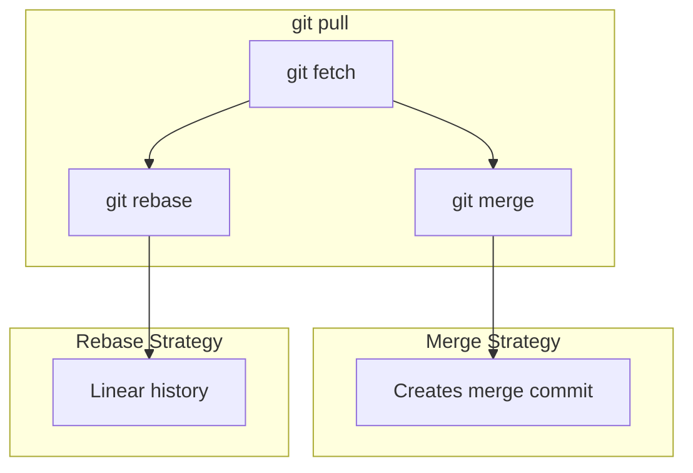

# **Git Basic Commands – Essential Everyday Operations** 🚀💻

Master the fundamental Git commands used daily by DevOps engineers and developers - from initializing repositories to committing changes and managing remote repositories.

---

## **Table of Contents** 📑
1. [Repository Creation](#1-repository-creation)
2. [Configuration Commands](#2-configuration-commands)
3. [Checking Status](#3-checking-status)
4. [Adding Files](#4-adding-files)
5. [Committing Changes](#5-committing-changes)
6. [Viewing History](#6-viewing-history)
7. [Remote Operations](#7-remote-operations)
8. [Cloning Repositories](#8-cloning-repositories)
9. [Pushing & Pulling](#9-pushing--pulling)
10. [Practical DevOps Scenarios](#10-practical-devops-scenarios)
11. [Industry Best Practices](#11-industry-best-practices)
12. [Interview Cheat Sheet](#12-interview-cheat-sheet)

---

## **1. Repository Creation** 🎬

### **git init - Initialize Repository**

Create a new Git repository in the current directory.

```bash
# Initialize new repository
git init

# Initialize with specific branch name
git init -b main
git init --initial-branch=main

# Initialize in specific directory
git init my-project
cd my-project

# Initialize bare repository (for servers)
git init --bare repo.git
```

**What Happens:**
```bash
.git/
├── HEAD               # Created: points to refs/heads/main
├── config             # Created: repository config
├── description        # Created: repo description
├── hooks/             # Created: sample hooks
├── objects/           # Created: object database
└── refs/              # Created: references folder
```

### **Verify Initialization:**

```bash
# Check if directory is a git repo
git rev-parse --is-inside-work-tree
# Output: true

# Show .git directory location
git rev-parse --git-dir
# Output: .git

# Show repository root
git rev-parse --show-toplevel
# Output: /path/to/your/repo
```

### **Initialize with .gitignore:**

```bash
# Create repository
git init -b main

# Create .gitignore
cat > .gitignore << 'EOF'
# Dependencies
node_modules/
vendor/

# Build outputs
dist/
build/
*.o
*.class

# Environment files
.env
.env.local

# IDE
.vscode/
.idea/
*.swp

# OS
.DS_Store
Thumbs.db

# Logs
*.log
logs/
EOF

# First commit
git add .gitignore
git commit -m "Initial commit with .gitignore"
```

---

## **2. Configuration Commands** ⚙️

### **git config - Manage Configuration**

```bash
# View all configuration
git config --list
git config -l

# View with origin (which file)
git config --list --show-origin

# View specific value
git config user.name
git config user.email
```

### **User Configuration:**

```bash
# Set username (global)
git config --global user.name "John Doe"

# Set email (global)
git config --global user.email "john.doe@example.com"

# Set for current repo only
git config --local user.email "john@company.com"

# Verify
git config user.name
git config user.email
```

### **Essential Configurations:**

```bash
# Default editor
git config --global core.editor "vim"
git config --global core.editor "code --wait"  # VS Code
git config --global core.editor "nano"

# Default branch name
git config --global init.defaultBranch main

# Line ending handling
git config --global core.autocrlf input    # Mac/Linux
git config --global core.autocrlf true     # Windows

# Color output
git config --global color.ui auto

# Default pull behavior
git config --global pull.rebase false      # merge (default)
git config --global pull.rebase true       # rebase
git config --global pull.ff only           # fast-forward only
```

### **Useful Aliases:**

```bash
# Status shortcut
git config --global alias.st status

# Checkout shortcut
git config --global alias.co checkout

# Branch shortcut
git config --global alias.br branch

# Commit shortcut
git config --global alias.cm commit

# Pretty log
git config --global alias.lg "log --oneline --graph --all --decorate"

# Last commit
git config --global alias.last "log -1 HEAD"

# Uncommit (undo last commit, keep changes)
git config --global alias.uncommit "reset --soft HEAD~1"

# Unstage
git config --global alias.unstage "reset HEAD --"

# View aliases
git config --get-regexp alias
```

### **Edit Configuration Files:**

```bash
# Edit global config
git config --global --edit

# Edit local config
git config --local --edit

# Edit system config (requires sudo)
sudo git config --system --edit
```

---

## **3. Checking Status** 📊

### **git status - Show Working Tree Status**

```bash
# Full status
git status

# Short format
git status -s
git status --short

# Branch info
git status -b
git status --branch

# Show ignored files too
git status --ignored
```

### **Status Output Explained:**

```bash
# Example output
On branch main
Your branch is up to date with 'origin/main'.

Changes to be committed:
  (use "git restore --staged <file>..." to unstage)
        new file:   README.md
        modified:   src/app.js

Changes not staged for commit:
  (use "git add <file>..." to update what will be committed)
  (use "git restore <file>..." to discard changes in working directory)
        modified:   package.json

Untracked files:
  (use "git add <file>..." to include in what will be committed)
        config/
```

### **Short Status Format:**

```bash
git status -s

# Output symbols:
?? untracked.txt       # Untracked
A  added.txt           # Added (staged)
M  modified.txt        # Modified (staged)
 M not-staged.txt      # Modified (not staged)
MM both-changes.txt    # Modified (staged + working dir)
D  deleted.txt         # Deleted (staged)
 D not-staged-del.txt  # Deleted (not staged)
R  renamed.txt         # Renamed
```

### **Checking Specific Files:**

```bash
# Status of specific file
git status src/app.js

# Status of directory
git status src/

# Ignore submodules
git status --ignore-submodules
```

---

## **4. Adding Files** ➕

### **git add - Stage Changes**

```bash
# Add specific file
git add filename.txt

# Add multiple files
git add file1.txt file2.js file3.css

# Add all files in directory
git add src/

# Add all files (current directory and subdirectories)
git add .

# Add all modified and new files (entire repository)
git add -A
git add --all

# Add only modified and deleted (not new files)
git add -u
git add --update

# Interactive staging
git add -i
git add --interactive

# Patch mode (stage parts of files)
git add -p filename.txt
git add --patch filename.txt
```

### **Staging Patterns:**

```bash
# Add all JavaScript files
git add *.js

# Add all files in src/ ending with .js
git add src/*.js

# Add all .txt files recursively
git add **/*.txt

# Add all files except specific type
git add .
git reset HEAD *.log  # Unstage log files
```

### **Interactive Staging:**

```bash
git add -i

# Interactive menu:
           staged     unstaged path
  1:    unchanged        +0/-1 TODO
  2:    unchanged        +1/-1 index.html
  3:    unchanged        +5/-3 lib/simplegit.rb

*** Commands ***
  1: [s]tatus     2: [u]pdate      3: [r]evert     4: [a]dd untracked
  5: [p]atch      6: [d]iff        7: [q]uit       8: [h]elp
What now>
```

### **Patch Mode (Staging Parts):**

```bash
git add -p filename.txt

# Options for each hunk:
y - stage this hunk
n - do not stage this hunk
q - quit; do not stage this hunk or any remaining ones
a - stage this hunk and all later hunks in the file
d - do not stage this hunk or any later hunks in the file
s - split the current hunk into smaller hunks
e - manually edit the current hunk
```

### **Dry Run:**

```bash
# See what would be added
git add --dry-run .
git add -n .
```

---

## **5. Committing Changes** 💾

### **git commit - Record Changes**

```bash
# Commit with message
git commit -m "Add user authentication feature"

# Commit with detailed message
git commit -m "Add user authentication" -m "- Implement JWT tokens
- Add login endpoint
- Add middleware for auth"

# Commit all modified files (skip git add)
git commit -am "Update configuration"
git commit --all --message "Update configuration"

# Open editor for commit message
git commit

# Amend last commit
git commit --amend

# Amend without changing message
git commit --amend --no-edit

# Amend and change message
git commit --amend -m "New commit message"
```

### **Commit Message Best Practices:**

```bash
# Good commit message format:
# <type>: <subject> (max 50 chars)
#
# <body> (wrap at 72 chars)
#
# <footer>

git commit -m "feat: Add user authentication

Implement JWT-based authentication system with the following features:
- Token generation on login
- Token validation middleware
- Refresh token mechanism
- Secure password hashing with bcrypt

Resolves: #123
See also: #456"
```

### **Commit Message Types (Conventional Commits):**

```bash
feat:     # New feature
fix:      # Bug fix
docs:     # Documentation only
style:    # Formatting, missing semicolons, etc.
refactor: # Code restructuring
perf:     # Performance improvement
test:     # Adding tests
chore:    # Maintenance tasks
build:    # Build system changes
ci:       # CI configuration changes
revert:   # Revert previous commit

# Examples
git commit -m "feat: Add email notification service"
git commit -m "fix: Resolve memory leak in cache module"
git commit -m "docs: Update API documentation"
git commit -m "refactor: Extract validation logic to separate module"
```

### **Signed Commits (GPG):**

```bash
# Sign commit with GPG
git commit -S -m "Signed commit"
git commit --gpg-sign -m "Signed commit"

# Configure auto-signing
git config --global commit.gpgsign true

# Verify signed commit
git log --show-signature
git verify-commit HEAD
```

### **Empty Commits:**

```bash
# Create empty commit (useful for CI triggers)
git commit --allow-empty -m "Trigger CI rebuild"
```

### **Commit with Specific Date:**

```bash
# Commit with custom date
git commit --date="2024-01-15 10:30:00" -m "Backdated commit"

# Use environment variable
GIT_AUTHOR_DATE="2024-01-15 10:30:00" git commit -m "Custom date"
```

---

## **6. Viewing History** 📜

### **git log - Show Commit History**

```bash
# Basic log
git log

# One line per commit
git log --oneline

# Show last N commits
git log -n 5
git log -5

# Graph view
git log --graph
git log --oneline --graph --all --decorate

# Show patches (diffs)
git log -p
git log --patch

# Show stats
git log --stat

# Show specific file history
git log filename.txt
git log -- src/app.js

# Show commits by author
git log --author="John Doe"

# Show commits since date
git log --since="2024-01-01"
git log --after="2 weeks ago"

# Show commits until date
git log --until="2024-12-31"
git log --before="yesterday"
```

### **Pretty Formats:**

```bash
# Custom format
git log --pretty=format:"%h - %an, %ar : %s"

# Predefined formats
git log --pretty=oneline
git log --pretty=short
git log --pretty=medium
git log --pretty=full
git log --pretty=fuller

# Beautiful one-liner
git log --oneline --graph --all --decorate --color

# Commit graph
git log --graph --abbrev-commit --decorate --format=format:'%C(bold blue)%h%C(reset) - %C(bold green)(%ar)%C(reset) %C(white)%s%C(reset) %C(dim white)- %an%C(reset)%C(auto)%d%C(reset)'
```

### **Filtering Commits:**

```bash
# By message content
git log --grep="bug fix"
git log --grep="feature"

# By file changes
git log -S"function_name"           # Find commits adding/removing "function_name"
git log -G"regex_pattern"           # Find commits matching regex

# Merge commits only
git log --merges

# Non-merge commits only
git log --no-merges

# First parent only (cleaner history)
git log --first-parent
```

### **Show Specific Commit:**

```bash
# Show commit details
git show HEAD
git show abc123
git show main
git show HEAD~2

# Show specific file in commit
git show abc123:path/to/file.txt

# Show commit stats
git show --stat abc123
```

### **git reflog - Reference Log**

```bash
# Show all reference updates
git reflog

# Show reflog for specific branch
git reflog show main

# Show last 10 entries
git reflog -10

# Recover lost commit
git reflog
# Find lost commit SHA
git checkout <SHA>
git branch recovered-branch
```

---

## **7. Remote Operations** 🌐

### **git remote - Manage Remotes**

```bash
# List remotes
git remote
git remote -v                    # Verbose (show URLs)

# Add remote
git remote add origin https://github.com/user/repo.git
git remote add upstream https://github.com/original/repo.git

# Show remote details
git remote show origin

# Rename remote
git remote rename origin new-origin

# Change remote URL
git remote set-url origin https://github.com/user/new-repo.git

# Remove remote
git remote remove origin
git remote rm origin
```

### **Remote URLs:**

```bash
# HTTPS
git remote add origin https://github.com/user/repo.git

# SSH
git remote add origin git@github.com:user/repo.git

# Multiple URLs (push to multiple remotes)
git remote set-url --add --push origin https://github.com/user/repo.git
git remote set-url --add --push origin https://gitlab.com/user/repo.git
```

### **Tracking Branches:**

```bash
# List remote branches
git branch -r

# List all branches (local + remote)
git branch -a

# Track remote branch
git checkout -b feature origin/feature
git checkout --track origin/feature
```

---

## **8. Cloning Repositories** 📥

### **git clone - Clone Repository**

```bash
# Clone repository
git clone https://github.com/user/repo.git

# Clone to specific directory
git clone https://github.com/user/repo.git my-folder

# Clone specific branch
git clone -b develop https://github.com/user/repo.git
git clone --branch develop https://github.com/user/repo.git

# Shallow clone (limited history)
git clone --depth 1 https://github.com/user/repo.git

# Clone with submodules
git clone --recursive https://github.com/user/repo.git
git clone --recurse-submodules https://github.com/user/repo.git
```

### **Clone Options:**

```bash
# Mirror clone (exact copy)
git clone --mirror https://github.com/user/repo.git

# Bare clone (no working directory)
git clone --bare https://github.com/user/repo.git

# Single branch
git clone --single-branch --branch main https://github.com/user/repo.git

# Shallow clone with all branches
git clone --depth 1 --no-single-branch https://github.com/user/repo.git

# Quiet clone
git clone --quiet https://github.com/user/repo.git
git clone -q https://github.com/user/repo.git
```

### **Unshallow Repository:**

```bash
# Convert shallow clone to full
git fetch --unshallow

# Fetch more history
git fetch --depth=100
```

---

## **9. Pushing & Pulling** ⬆️⬇️

### **git push - Upload Changes**

```bash
# Push to default remote/branch
git push

# Push to specific remote/branch
git push origin main

# Push and set upstream
git push -u origin main
git push --set-upstream origin feature-branch

# Push all branches
git push --all

# Push tags
git push --tags

# Push specific tag
git push origin v1.0.0

# Force push (dangerous!)
git push --force
git push -f

# Safer force push
git push --force-with-lease

# Delete remote branch
git push origin --delete feature-branch
git push origin :feature-branch
```

### **git fetch - Download Objects**

```bash
# Fetch from default remote
git fetch

# Fetch from specific remote
git fetch origin

# Fetch all remotes
git fetch --all

# Fetch and prune deleted branches
git fetch --prune
git fetch -p

# Fetch specific branch
git fetch origin main

# Fetch tags
git fetch --tags

# Dry run
git fetch --dry-run
```

### **git pull - Fetch + Merge**

```bash
# Pull from tracking branch
git pull

# Pull from specific remote/branch
git pull origin main

# Pull with rebase
git pull --rebase
git pull -r

# Pull all branches
git pull --all

# Pull without commit (merge strategy)
git pull --no-commit

# Pull with fast-forward only
git pull --ff-only
```

### **Push/Pull Strategies:**



---

## **10. Practical DevOps Scenarios** 🛠️

### **Scenario 1: Start New Project**

```bash
# 1. Create directory
mkdir my-app && cd my-app

# 2. Initialize Git
git init -b main

# 3. Create .gitignore
cat > .gitignore << 'EOF'
node_modules/
.env
dist/
*.log
.DS_Store
EOF

# 4. Initial commit
git add .gitignore
git commit -m "Initial commit"

# 5. Connect to remote
git remote add origin git@github.com:user/my-app.git

# 6. Push to remote
git push -u origin main
```

### **Scenario 2: Clone and Contribute**

```bash
# 1. Clone repository
git clone git@github.com:company/project.git
cd project

# 2. Check current branch
git status
git branch

# 3. Create feature branch
git checkout -b feature/new-feature

# 4. Make changes
echo "new code" >> src/app.js
git add src/app.js
git commit -m "feat: Add new feature"

# 5. Push feature branch
git push -u origin feature/new-feature

# 6. Create pull request (via GitHub/GitLab UI)
```

### **Scenario 3: Update Local Repository**

```bash
# 1. Check current status
git status

# 2. Fetch latest changes
git fetch origin

# 3. View differences
git log HEAD..origin/main --oneline

# 4. Update main branch
git checkout main
git pull origin main

# 5. Update feature branch with latest main
git checkout feature/my-feature
git rebase main
# Or merge
git merge main
```

### **Scenario 4: Fix Commit Mistakes**

```bash
# Forgot to add file
git commit -m "Add feature"
# Oops! Forgot to add config.js
git add config.js
git commit --amend --no-edit

# Wrong commit message
git commit -m "Fix bug in user module"
# Actually fixed auth module
git commit --amend -m "Fix bug in auth module"

# Unstage file
git add .
# Oops! Added .env file
git reset HEAD .env
git commit -m "Update configuration"

# Undo last commit (keep changes)
git commit -m "Wrong changes"
git reset --soft HEAD~1
# Make corrections
git add .
git commit -m "Correct changes"
```

### **Scenario 5: Multiple Remote Repositories**

```bash
# 1. Clone from GitHub
git clone git@github.com:user/project.git
cd project

# 2. Add GitLab mirror
git remote add gitlab git@gitlab.com:user/project.git

# 3. Add upstream (original repo)
git remote add upstream git@github.com:original/project.git

# 4. View all remotes
git remote -v
# origin    git@github.com:user/project.git (fetch)
# origin    git@github.com:user/project.git (push)
# gitlab    git@gitlab.com:user/project.git (fetch)
# gitlab    git@gitlab.com:user/project.git (push)
# upstream  git@github.com:original/project.git (fetch)
# upstream  git@github.com:original/project.git (push)

# 5. Fetch from upstream
git fetch upstream

# 6. Merge upstream changes
git merge upstream/main

# 7. Push to both origins
git push origin main
git push gitlab main
```

### **Scenario 6: Working with Large Files**

```bash
# 1. Install Git LFS
git lfs install

# 2. Track large files
git lfs track "*.psd"
git lfs track "*.mp4"
git lfs track "datasets/*"

# 3. Add .gitattributes
git add .gitattributes

# 4. Add large files
git add design.psd
git commit -m "Add design files"

# 5. Push with LFS
git push origin main
```

---

## **11. Industry Best Practices** 🏆

### **Commit Hygiene:**

✅ **Atomic Commits**
```bash
# Bad: Multiple unrelated changes
git add .
git commit -m "Fixed bugs and added features"

# Good: Separate commits
git add src/auth.js
git commit -m "fix: Resolve login timeout issue"

git add src/email.js
git commit -m "feat: Add email notification service"
```

✅ **Meaningful Messages**
```bash
# Bad
git commit -m "updates"
git commit -m "fixed stuff"
git commit -m "changes"

# Good
git commit -m "fix: Resolve null pointer in user service"
git commit -m "feat: Add JWT authentication middleware"
git commit -m "refactor: Extract database logic to repository layer"
```

✅ **Commit Frequency**
```bash
# Commit often, but logically
# After each completed unit of work
git commit -m "feat: Add user model"
git commit -m "feat: Add user repository"
git commit -m "feat: Add user service"
git commit -m "feat: Add user controller"
```

### **Branch Management:**

✅ **Keep Main Clean**
```bash
# Never commit directly to main
git checkout main
# Bad: git commit -m "quick fix"

# Good: Create branch
git checkout -b hotfix/urgent-fix
git commit -m "fix: Critical security patch"
git push -u origin hotfix/urgent-fix
# Create PR for review
```

✅ **Regular Updates**
```bash
# Update your branch frequently
git checkout feature/my-feature
git fetch origin
git rebase origin/main
# Or
git merge origin/main
```

✅ **Delete Merged Branches**
```bash
# After merge, delete local branch
git branch -d feature/completed-feature

# Delete remote branch
git push origin --delete feature/completed-feature

# Clean up stale remote branches
git remote prune origin
```

### **Security Practices:**

✅ **Never Commit Secrets**
```bash
# Add to .gitignore BEFORE committing
echo ".env" >> .gitignore
echo "*.key" >> .gitignore
echo "secrets/" >> .gitignore

# Check what will be committed
git status
git diff --cached

# If secret was committed, remove from history
git filter-repo --path .env --invert-paths
# Or use BFG Repo-Cleaner
```

✅ **Use SSH Keys**
```bash
# Generate SSH key
ssh-keygen -t ed25519 -C "your_email@example.com"

# Start SSH agent
eval "$(ssh-agent -s)"
ssh-add ~/.ssh/id_ed25519

# Add public key to GitHub
cat ~/.ssh/id_ed25519.pub

# Use SSH URLs
git remote set-url origin git@github.com:user/repo.git
```

✅ **Sign Commits**
```bash
# Configure GPG
git config --global user.signingkey YOUR_GPG_KEY
git config --global commit.gpgsign true

# All commits will be signed
git commit -m "Signed commit"
```

### **Performance Optimization:**

✅ **Shallow Clones for CI/CD**
```bash
# In CI pipeline
git clone --depth 1 --single-branch --branch main https://github.com/user/repo.git
```

✅ **Sparse Checkout (Large Repos)**
```bash
# Clone without checkout
git clone --no-checkout https://github.com/user/large-repo.git
cd large-repo

# Enable sparse checkout
git sparse-checkout init

# Specify paths to checkout
git sparse-checkout set src/ docs/

# Checkout
git checkout main
```

✅ **Git Maintenance**
```bash
# Garbage collection
git gc --aggressive

# Prune old objects
git prune

# Optimize repository
git repack -ad

# Verify database
git fsck
```

---

## **12. Interview Cheat Sheet** 🎯

### **Common Questions:**

**Q1: What's the difference between `git fetch` and `git pull`?**
```bash
git fetch  # Downloads changes, doesn't merge
git pull   # git fetch + git merge (or rebase)

# Best practice: Use fetch + merge separately
git fetch origin
git log HEAD..origin/main  # Review changes
git merge origin/main      # Merge when ready
```

**Q2: How do you undo the last commit?**
```bash
# Keep changes (soft reset)
git reset --soft HEAD~1

# Unstage changes (mixed reset - default)
git reset HEAD~1
git reset --mixed HEAD~1

# Discard changes (hard reset - dangerous!)
git reset --hard HEAD~1

# Create new commit that undoes changes
git revert HEAD
```

**Q3: What is the staging area?**
- Intermediate area between working directory and repository
- Allows you to prepare commits
- Located in `.git/index`
```bash
Working Directory → (git add) → Staging Area → (git commit) → Repository
```

**Q4: How do you check what will be committed?**
```bash
git status              # See staged changes
git diff --staged       # See actual changes
git diff --cached       # Same as --staged
```

**Q5: Difference between `git reset` and `git revert`?**
```bash
git reset   # Moves branch pointer, rewrites history (local only)
git revert  # Creates new commit undoing changes (safe for shared branches)

# Reset (don't use on pushed commits)
git reset --hard HEAD~1

# Revert (safe for pushed commits)
git revert HEAD
```

**Q6: How to change the last commit message?**
```bash
git commit --amend -m "New message"

# If already pushed (force required)
git push --force-with-lease
```

**Q7: What does `git push -u` do?**
```bash
git push -u origin main
# -u = --set-upstream
# Links local branch to remote branch
# Future: just use "git push" or "git pull"
```

**Q8: How to clone only a specific branch?**
```bash
git clone -b develop --single-branch https://github.com/user/repo.git
```

**Q9: What is `origin`?**
- Default name for remote repository
- Conventional, not special (can be renamed)
```bash
git remote add anything https://github.com/user/repo.git
git push anything main  # Works fine
```

**Q10: How to see who changed a line of code?**
```bash
git blame filename.txt
git blame -L 10,20 filename.txt  # Lines 10-20
```

### **Must-Know Commands:**

```bash
# Setup
git config --global user.name "Your Name"
git config --global user.email "email@example.com"

# Create
git init
git clone <url>

# Basic workflow
git status
git add <file>
git commit -m "message"
git push

# Branching
git branch
git checkout -b feature
git merge feature

# Remote
git remote -v
git fetch
git pull
git push

# History
git log --oneline
git show <commit>

# Undo
git reset HEAD <file>
git checkout -- <file>
git revert <commit>
```

---

## **Next Steps** 📚

Continue your Git journey with:

- **[Git Branching & Merging](Git_Branching_Merging.md)** - Master branch management
- **[Git Advanced Commands](Git_Advanced_Commands.md)** - Rebase, cherry-pick, stash
- **[Git Collaboration](Git_Collaboration.md)** - Work with teams effectively

---

**💡 Practice these commands daily to build muscle memory!**
