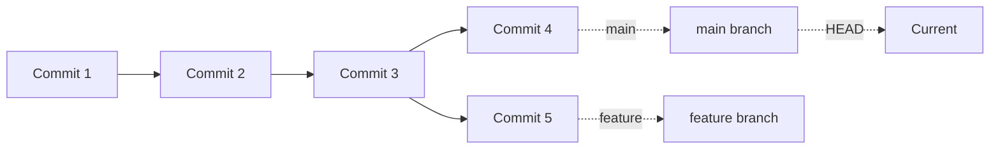
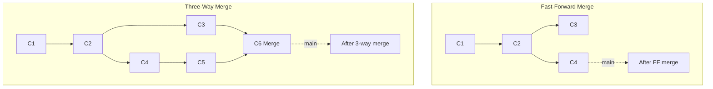
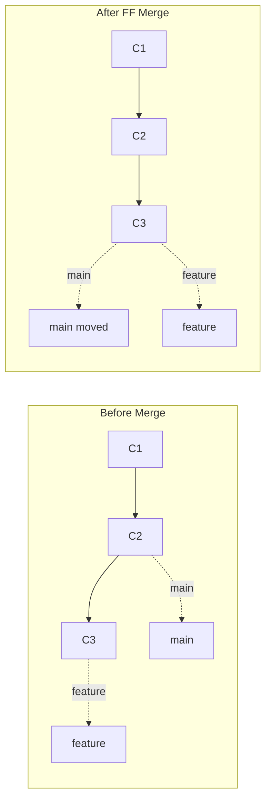
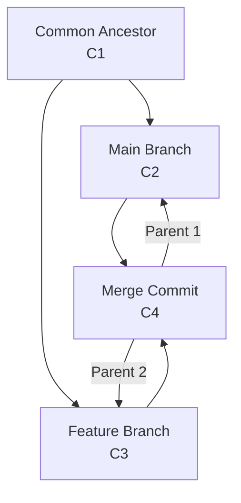

# **Git Branching & Merging – Master Branch Management** 🌿🔀

Learn essential branching strategies, merge techniques, and conflict resolution that every DevOps engineer needs to collaborate effectively and maintain clean repository history.

---

## **Table of Contents** 📑
1. [Understanding Branches](#1-understanding-branches)
2. [Branch Operations](#2-branch-operations)
3. [Merge Strategies](#3-merge-strategies)
4. [Conflict Resolution](#4-conflict-resolution)
5. [Fast-Forward Merges](#5-fast-forward-merges)
6. [Three-Way Merges](#6-three-way-merges)
7. [Branch Management](#7-branch-management)
8. [Remote Branches](#8-remote-branches)
9. [Branch Protection](#9-branch-protection)
10. [Practical DevOps Scenarios](#10-practical-devops-scenarios)
11. [Industry Best Practices](#11-industry-best-practices)
12. [Interview Cheat Sheet](#12-interview-cheat-sheet)

---

## **1. Understanding Branches** 🌳

### **What is a Branch?**

A branch is a **lightweight movable pointer** to a commit. The default branch is `main` (or `master`).



### **Branch Pointer Visualization:**

```bash
# Each branch is just a pointer to a commit
main      → abc123 (commit 4)
feature   → def456 (commit 5)
HEAD      → main (currently on main)
```

### **Why Branches?**

✅ **Isolation**: Work on features independently  
✅ **Experimentation**: Try ideas without affecting main code  
✅ **Parallel Development**: Multiple features simultaneously  
✅ **Code Review**: Changes reviewed before merging  
✅ **Releases**: Maintain multiple versions  

### **Branch Internals:**

```bash
# Branches stored in .git/refs/heads/
cat .git/refs/heads/main
# Output: 2cf24dba5fb0a30e26e83b2ac5b9e29e1b161e5c (commit SHA)

# Current branch stored in HEAD
cat .git/HEAD
# Output: ref: refs/heads/main

# Create branch = create new file with commit SHA
git branch feature
cat .git/refs/heads/feature
# Output: 2cf24dba5fb0a30e26e83b2ac5b9e29e1b161e5c (same as main)
```

---

## **2. Branch Operations** 🔧

### **git branch - Manage Branches**

```bash
# List local branches
git branch

# List all branches (local + remote)
git branch -a
git branch --all

# List remote branches only
git branch -r

# Create new branch
git branch feature-name

# Create branch from specific commit
git branch feature-name abc123
git branch feature-name HEAD~2

# Delete branch
git branch -d feature-name           # Safe delete (merged only)
git branch -D feature-name           # Force delete
git branch --delete feature-name

# Rename branch
git branch -m old-name new-name      # Rename any branch
git branch -m new-name               # Rename current branch

# Show branch with last commit
git branch -v
git branch --verbose

# Show merged branches
git branch --merged

# Show unmerged branches
git branch --no-merged
```

### **git checkout - Switch Branches**

```bash
# Switch to existing branch
git checkout main
git checkout feature

# Create and switch to new branch
git checkout -b feature-name
git checkout -b feature-name origin/feature

# Create branch from specific commit
git checkout -b hotfix abc123

# Switch to previous branch
git checkout -

# Detached HEAD (checkout specific commit)
git checkout abc123
```

### **git switch - New Branch Switching (Git 2.23+)**

```bash
# Switch branch (clearer than checkout)
git switch main
git switch feature

# Create and switch
git switch -c feature-name
git switch --create feature-name

# Create from remote
git switch -c feature origin/feature

# Switch to previous branch
git switch -

# Detach HEAD
git switch --detach abc123
```

### **git restore - New File Restoration (Git 2.23+)**

```bash
# Restore file from staging
git restore --staged file.txt

# Restore file from commit
git restore --source=HEAD~1 file.txt

# Discard local changes
git restore file.txt
```

---

## **3. Merge Strategies** 🔀

### **Types of Merges:**



### **git merge - Merge Branches**

```bash
# Merge branch into current branch
git checkout main
git merge feature

# Merge with custom message
git merge feature -m "Merge feature branch"

# Merge without fast-forward (always create merge commit)
git merge --no-ff feature

# Fast-forward only (fail if not possible)
git merge --ff-only feature

# Merge with strategy
git merge -s recursive feature
git merge --strategy=recursive feature

# Abort merge
git merge --abort

# Continue after resolving conflicts
git merge --continue
```

### **Merge Strategies:**

| Strategy | Description | Use Case |
|----------|-------------|----------|
| **recursive** | Default 3-way merge | Standard merges |
| **ours** | Keep our changes in conflicts | Merge but ignore their changes |
| **theirs** | Take their changes in conflicts | Accept all incoming changes |
| **octopus** | Merge multiple branches | Merge more than 2 branches |
| **resolve** | Simple 3-way merge | Legacy, rarely used |
| **subtree** | Merge subtree projects | Subproject management |

```bash
# Use specific strategy
git merge -s ours feature
git merge -X theirs feature        # Strategy option (not strategy)
git merge --strategy-option=theirs feature
```

### **Squash Merge:**

```bash
# Squash all commits into one
git merge --squash feature

# Creates staged changes, not commit
# Then commit manually
git commit -m "Add feature (squashed)"

# Result: Clean history, single commit on main
```

---

## **4. Conflict Resolution** ⚔️

### **What Causes Conflicts?**

Conflicts occur when:
- Same file, same lines modified differently
- File deleted in one branch, modified in another
- File renamed in one branch, modified in another

### **Conflict Example:**

```bash
# Branch: main
def calculate(a, b):
    return a + b

# Branch: feature
def calculate(a, b):
    return a * b

# Merge conflict!
git merge feature
# CONFLICT (content): Merge conflict in calculator.py
```

### **Conflict Markers:**

```python
def calculate(a, b):
<<<<<<< HEAD (Current Change - main)
    return a + b
=======
    return a * b
>>>>>>> feature (Incoming Change)
```

**Breakdown:**
- `<<<<<<< HEAD`: Your current branch changes
- `=======`: Separator
- `>>>>>>> feature`: Incoming branch changes

### **Resolving Conflicts:**

**Step 1: Identify Conflicts**
```bash
git status
# Output shows:
# Unmerged paths:
#   both modified:   calculator.py
```

**Step 2: Open Conflicted Files**
```bash
# View conflicts
git diff

# Or use merge tool
git mergetool
```

**Step 3: Resolve Manually**
```python
# Choose one or combine:
def calculate(a, b):
    return a * b  # Decided to keep multiplication
```

**Step 4: Mark as Resolved**
```bash
git add calculator.py
```

**Step 5: Complete Merge**
```bash
git commit
# Or
git merge --continue
```

### **Abort Merge:**

```bash
# Undo merge and return to pre-merge state
git merge --abort

# Or
git reset --merge
```

### **Conflict Resolution Tools:**

```bash
# Configure merge tool
git config --global merge.tool vimdiff
git config --global merge.tool meld
git config --global merge.tool kdiff3
git config --global merge.tool p4merge

# Use merge tool
git mergetool

# View conflicts
git diff --ours           # Your changes
git diff --theirs         # Their changes
git diff --base           # Common ancestor
```

### **Accept All From One Side:**

```bash
# Accept all changes from current branch (ours)
git checkout --ours file.txt
git add file.txt

# Accept all changes from merging branch (theirs)
git checkout --theirs file.txt
git add file.txt

# For all conflicts
git merge -X ours feature      # Prefer ours
git merge -X theirs feature    # Prefer theirs
```

---

## **5. Fast-Forward Merges** ⏩

### **What is Fast-Forward?**

When target branch hasn't diverged, Git simply moves the pointer forward.



### **Fast-Forward Example:**

```bash
# Start: main and feature at same commit
git checkout main
# main at commit C2

git checkout -b feature
# Make commits
git commit -m "C3"
git commit -m "C4"

# Merge (fast-forward)
git checkout main
git merge feature
# Output: Fast-forward
#         main..feature
```

### **Force Fast-Forward:**

```bash
# Only merge if fast-forward possible
git merge --ff-only feature

# If not possible:
# fatal: Not possible to fast-forward, aborting.
```

### **Disable Fast-Forward:**

```bash
# Always create merge commit
git merge --no-ff feature

# Preserves branch history
# Good for feature branches
```

### **Configure Default Behavior:**

```bash
# Default: allow fast-forward
git config --global merge.ff true

# Never fast-forward
git config --global merge.ff false

# Fast-forward only
git config --global merge.ff only
```

---

## **6. Three-Way Merges** 🔺

### **What is Three-Way Merge?**

When branches have diverged, Git performs a 3-way merge:
1. Common ancestor commit
2. Current branch tip
3. Target branch tip



### **Three-Way Merge Example:**

```bash
# Start
git checkout -b feature
# C1 (common ancestor)

# On feature branch
git commit -m "C2 - feature work"

# On main branch
git checkout main
git commit -m "C3 - main work"

# Branches diverged!
# Tree structure:
#       C2 (feature)
#      /
#  C1 
#      \
#       C3 (main)

# Merge (three-way)
git merge feature
# Creates C4 (merge commit)
#       C2 (feature)
#      /  \
#  C1      C4 (merge commit on main)
#      \  /
#       C3 (main)
```

### **Merge Commit:**

```bash
# View merge commit
git show HEAD

# Example output:
commit abc123 (HEAD -> main)
Merge: def456 ghi789        # Two parent commits
Author: John Doe
Date:   ...

    Merge branch 'feature' into main
```

### **Merge Commit Parents:**

```bash
# First parent (main)
git show HEAD^1
git show HEAD^

# Second parent (feature)
git show HEAD^2

# Navigate merge commits
git log --first-parent      # Follow first parent only
git log --merges            # Show merge commits only
```

---

## **7. Branch Management** 🗂️

### **List Branches with Details:**

```bash
# Show all branches with last commit
git branch -v
# Output:
# * main    abc123 Latest commit message
#   feature def456 Feature work

# Show merged branches
git branch --merged
# * main
#   feature-1
#   bugfix-old

# Show unmerged branches
git branch --no-merged
# feature-new
# experimental

# Show branches containing commit
git branch --contains abc123

# Show branches not containing commit
git branch --no-contains abc123
```

### **Clean Up Branches:**

```bash
# Delete merged local branches
git branch --merged | grep -v "\*" | grep -v "main" | xargs -n 1 git branch -d

# Delete merged branches (except main/develop)
git branch --merged main | grep -v "^\*\|  main\|  develop" | xargs git branch -d

# Prune remote tracking branches
git remote prune origin
git fetch --prune

# Delete remote branch
git push origin --delete feature-name
git push origin :feature-name
```

### **Branch Naming Conventions:**

```bash
# Feature branches
feature/user-authentication
feature/payment-integration
feat/dark-mode

# Bug fixes
bugfix/login-error
bugfix/memory-leak
fix/null-pointer

# Hotfixes (urgent production fixes)
hotfix/security-patch
hotfix/critical-bug

# Release branches
release/v1.2.0
release/2024-q1

# Experimental
experiment/new-architecture
spike/performance-test

# Personal branches
username/feature-name
jdoe/refactor-api
```

### **Branch Prefixes:**

| Prefix | Purpose | Example |
|--------|---------|---------|
| `feature/` | New features | `feature/oauth2` |
| `bugfix/` | Bug fixes | `bugfix/login-timeout` |
| `hotfix/` | Urgent fixes | `hotfix/security-patch` |
| `release/` | Release prep | `release/v2.0.0` |
| `docs/` | Documentation | `docs/api-guide` |
| `test/` | Testing | `test/integration-tests` |
| `refactor/` | Code refactoring | `refactor/user-service` |
| `chore/` | Maintenance | `chore/update-deps` |

---

## **8. Remote Branches** 🌐

### **Remote Tracking Branches:**

```bash
# List remote branches
git branch -r
# Output:
#   origin/main
#   origin/develop
#   origin/feature-1

# List all branches
git branch -a
# Output:
# * main
#   feature-local
#   remotes/origin/main
#   remotes/origin/develop

# Show remote branch info
git remote show origin
```

### **Tracking Branches:**

```bash
# Create local branch tracking remote
git checkout -b feature origin/feature
git checkout --track origin/feature
git switch -c feature origin/feature

# Set upstream for existing branch
git branch --set-upstream-to=origin/main
git branch -u origin/main

# Push and set upstream
git push -u origin feature
git push --set-upstream origin feature
```

### **Fetch Remote Branches:**

```bash
# Fetch all remote branches
git fetch origin

# Fetch specific branch
git fetch origin main

# Fetch and prune deleted branches
git fetch --prune
git fetch -p

# Create local from remote
git checkout -b feature origin/feature
```

### **Push/Delete Remote Branches:**

```bash
# Push local branch to remote
git push origin feature

# Push with different name
git push origin local-branch:remote-branch

# Delete remote branch
git push origin --delete feature
git push origin :feature

# Push all branches
git push --all origin

# Push tags
git push --tags
```

### **Upstream Tracking:**

```bash
# View tracking relationship
git branch -vv
# Output:
# * main    abc123 [origin/main] Latest commit
#   feature def456 [origin/feature: ahead 2] Feature work

# Interpret output:
# [origin/main]         → Tracking origin/main, in sync
# [ahead 2]             → 2 local commits not pushed
# [behind 3]            → 3 remote commits not pulled
# [ahead 2, behind 3]   → Diverged
```

---

## **9. Branch Protection** 🔒

### **GitHub Branch Protection Rules:**

```bash
# Via GitHub Web UI:
Settings → Branches → Branch protection rules

# Common rules:
✅ Require pull request reviews
✅ Require status checks to pass
✅ Require up-to-date branches
✅ Require signed commits
✅ Include administrators
✅ Restrict who can push
✅ Restrict force pushes
✅ Restrict deletions
```

### **Git Hooks for Protection:**

```bash
# .git/hooks/pre-push
#!/bin/bash
branch=$(git rev-parse --abbrev-ref HEAD)

if [ "$branch" = "main" ]; then
    echo "Direct push to main is not allowed!"
    exit 1
fi

# Make executable
chmod +x .git/hooks/pre-push
```

### **Server-Side Hooks:**

```bash
# GitLab CI/CD (.gitlab-ci.yml)
workflow:
  rules:
    - if: '$CI_COMMIT_BRANCH == "main"'
      when: never
    - when: always

# GitHub Actions (.github/workflows/protect-main.yml)
on:
  push:
    branches:
      - main
jobs:
  prevent-push:
    runs-on: ubuntu-latest
    steps:
      - name: Block direct push
        run: |
          echo "Direct push to main not allowed!"
          exit 1
```

---

## **10. Practical DevOps Scenarios** 🛠️

### **Scenario 1: Feature Development**

```bash
# 1. Update main
git checkout main
git pull origin main

# 2. Create feature branch
git checkout -b feature/user-auth

# 3. Work on feature
echo "auth code" > auth.js
git add auth.js
git commit -m "feat: Add user authentication"

# 4. Keep branch updated with main
git fetch origin
git rebase origin/main
# Or merge
git merge origin/main

# 5. Push feature branch
git push -u origin feature/user-auth

# 6. Create Pull Request (via GitHub/GitLab)
# Review → Approve → Merge

# 7. Clean up
git checkout main
git pull origin main
git branch -d feature/user-auth
git push origin --delete feature/user-auth
```

### **Scenario 2: Hotfix on Production**

```bash
# 1. Create hotfix from main
git checkout main
git pull origin main
git checkout -b hotfix/critical-bug

# 2. Fix the bug
vim src/critical.js
git add src/critical.js
git commit -m "hotfix: Fix critical security vulnerability"

# 3. Push and merge ASAP
git push -u origin hotfix/critical-bug
# Fast-track PR review

# 4. Merge to main
git checkout main
git merge hotfix/critical-bug
git push origin main

# 5. Also merge to develop
git checkout develop
git merge hotfix/critical-bug
git push origin develop

# 6. Tag release
git tag -a v1.2.1 -m "Hotfix release 1.2.1"
git push origin v1.2.1

# 7. Clean up
git branch -d hotfix/critical-bug
git push origin --delete hotfix/critical-bug
```

### **Scenario 3: Resolve Merge Conflict**

```bash
# 1. Start merge
git checkout main
git merge feature/conflicting-branch
# CONFLICT (content): Merge conflict in config.js

# 2. View conflicts
git status
# Unmerged paths:
#   both modified:   config.js

# 3. Check the conflict
git diff config.js

# 4. Open and resolve
vim config.js
# Edit file, remove markers, keep desired code

# 5. Test the resolution
npm test  # or your test command

# 6. Mark as resolved
git add config.js

# 7. Check status
git status
# All conflicts fixed, run "git commit"

# 8. Complete merge
git commit
# Accept default message or modify

# 9. Push
git push origin main
```

### **Scenario 4: Review Changes Before Merge**

```bash
# 1. Checkout main
git checkout main

# 2. View differences
git diff main...feature
git diff main feature

# 3. View commits to be merged
git log main..feature --oneline

# 4. View stats
git diff --stat main feature

# 5. View file changes
git diff --name-only main feature

# 6. Test merge without committing
git merge --no-commit --no-ff feature

# 7. Review changes
git status
git diff --cached

# 8. Abort or commit
git merge --abort  # Cancel
# Or
git commit          # Confirm
```

### **Scenario 5: Squash Multiple Commits Before Merge**

```bash
# Option 1: Squash merge
git checkout main
git merge --squash feature
git commit -m "feat: Add complete feature (squashed)"

# Option 2: Interactive rebase
git checkout feature
git rebase -i HEAD~5  # Last 5 commits
# In editor: change 'pick' to 'squash' or 'fixup'
git push --force-with-lease origin feature

# Option 3: Reset and recommit
git checkout feature
git reset --soft main
git commit -m "feat: Complete feature implementation"
git push --force-with-lease origin feature
```

---

## **11. Industry Best Practices** 🏆

### **Branching Strategy:**

✅ **Use Descriptive Names**
```bash
# Good
feature/user-authentication
bugfix/login-timeout-issue
hotfix/critical-security-patch

# Bad
branch1
fix
temp
test
```

✅ **Short-Lived Branches**
```bash
# Keep feature branches alive for days, not weeks
# Goal: < 1 week from creation to merge
# Benefits:
# - Smaller, easier code reviews
# - Fewer merge conflicts
# - Faster feedback
```

✅ **Regular Updates**
```bash
# Update feature branch with main frequently
git checkout feature/my-feature
git fetch origin
git rebase origin/main  # or merge
git push --force-with-lease origin feature/my-feature
```

### **Merge Best Practices:**

✅ **Code Review Before Merge**
```bash
# Never merge without review
# Use Pull Requests / Merge Requests
# Required approvals: 1-2 reviewers minimum
```

✅ **CI/CD Checks**
```bash
# Automated checks before merge:
✓ Unit tests pass
✓ Integration tests pass
✓ Code coverage meets threshold
✓ Linting passes
✓ Security scan passes
✓ Build succeeds
```

✅ **Prefer Rebase for Feature Branches**
```bash
# Clean linear history
git checkout feature/my-feature
git rebase main

# Squash small fixup commits
git rebase -i HEAD~5
```

✅ **Use Merge Commits for Main**
```bash
# Preserve feature context in history
git merge --no-ff feature/user-auth
# Creates explicit merge commit
# Easier to revert entire feature
```

### **Conflict Prevention:**

✅ **Communicate with Team**
```bash
# Coordinate on overlapping work
# Use task management tools
# Review main frequently
```

✅ **Small Frequent Commits**
```bash
# Easier to resolve conflicts
# Better code review
# Clearer history
```

✅ **Test After Merge**
```bash
# Always run tests after resolving conflicts
npm test
# Or
make test
```

### **Branch Cleanup:**

✅ **Delete Merged Branches**
```bash
# Local cleanup
git branch -d feature/completed

# Remote cleanup
git push origin --delete feature/completed

# Automated cleanup script
git branch --merged main | 
  grep -v "^\*\|  main\|  develop" | 
  xargs -n 1 git branch -d
```

✅ **Prune Stale Remotes**
```bash
# Remove deleted remote branches
git fetch --prune
git remote prune origin
```

---

## **12. Interview Cheat Sheet** 🎯

### **Common Questions:**

**Q1: What's the difference between merge and rebase?**
```bash
# Merge - Creates merge commit, preserves history
git merge feature
# Result: Branch history visible, non-linear

# Rebase - Replays commits, linear history
git rebase feature
# Result: Clean linear history, no merge commit
```

**Q2: How do you resolve merge conflicts?**
```bash
1. git merge branch         # Attempt merge
2. git status              # Identify conflicts
3. Edit files              # Remove markers, resolve
4. git add conflicted-file # Mark resolved
5. git commit              # Complete merge
```

**Q3: What is fast-forward merge?**
- When target branch hasn't changed
- Git just moves pointer forward
- No merge commit created
- Linear history preserved

**Q4: When to use `--no-ff`?**
```bash
# Use --no-ff when:
✓ Merging feature branches (preserve context)
✓ Want explicit merge commits
✓ Easier to revert entire feature

git merge --no-ff feature
```

**Q5: How to undo a merge?**
```bash
# If not pushed yet
git reset --hard HEAD~1

# If already pushed (creates new commit)
git revert -m 1 HEAD

# -m 1 means keep first parent (main)
```

**Q6: What does `git branch -d` vs `-D` do?**
```bash
git branch -d feature  # Safe: only if merged
git branch -D feature  # Force: delete anyway
```

**Q7: How to rename a branch?**
```bash
# Rename current branch
git branch -m new-name

# Rename any branch
git branch -m old-name new-name

# Update remote
git push origin --delete old-name
git push -u origin new-name
```

**Q8: What are tracking branches?**
- Local branches linked to remote branches
- Enable `git pull` and `git push` without arguments
```bash
git branch -u origin/main  # Set tracking
git branch -vv             # View tracking info
```

**Q9: Difference between `git merge` and `git merge --squash`?**
```bash
git merge feature
# All feature commits in history

git merge --squash feature
# Single commit, cleaner history
# Loses individual commit messages
```

**Q10: How to see what branches contain a commit?**
```bash
git branch --contains abc123
git branch -r --contains abc123  # Remote branches too
```

### **Quick Command Reference:**

```bash
# Create & switch
git checkout -b feature
git switch -c feature

# Merge
git merge feature
git merge --no-ff feature
git merge --squash feature

# Resolve conflicts
git mergetool
git checkout --ours file
git checkout --theirs file

# Branch management
git branch -d feature
git branch -m new-name
git branch --merged
git branch -vv

# Remote
git push -u origin feature
git push origin --delete feature
git fetch --prune
```

---

## **Next Steps** 📚

Continue mastering Git with:

- **[Git Advanced Commands](Git_Advanced_Commands.md)** - Rebase, cherry-pick, stash
- **[Git Workflows](Git_Workflows.md)** - GitFlow, GitHub Flow, trunk-based development
- **[Git Troubleshooting](Git_Troubleshooting.md)** - Fix common issues

---

**🌿 Master branching and merging - the foundation of effective Git collaboration!**
