# **Git Collaboration – Team Workflows & Best Practices** 👥🤝

Master collaborative Git workflows, pull requests, code review, and distributed team development strategies essential for modern DevOps environments.

---

## **Table of Contents** 📑
1. [Working with Remotes](#1-working-with-remotes)
2. [Pull Requests (PRs)](#2-pull-requests-prs)
3. [Code Review](#3-code-review)
4. [Forking Workflow](#4-forking-workflow)
5. [Contributing to Open Source](#5-contributing-to-open-source)
6. [Git Tags & Releases](#6-git-tags--releases)
7. [Team Collaboration Patterns](#7-team-collaboration-patterns)
8. [Conflict Management](#8-conflict-management)
9. [CI/CD Integration](#9-cicd-integration)
10. [Practical DevOps Scenarios](#10-practical-devops-scenarios)
11. [Industry Best Practices](#11-industry-best-practices)
12. [Interview Cheat Sheet](#12-interview-cheat-sheet)

---

## **1. Working with Remotes** 🌐

### **Understanding Remotes:**


### **Managing Remotes:**

```bash
# List remotes
git remote
git remote -v

# Add remote
git remote add origin https://github.com/user/repo.git

# Add multiple remotes
git remote add origin https://github.com/youruser/repo.git
git remote add upstream https://github.com/original/repo.git
git remote add deploy git@production-server:repo.git

# Show remote details
git remote show origin

# Rename remote
git remote rename origin github
git remote rename upstream original

# Change remote URL
git remote set-url origin git@github.com:user/repo.git

# Remove remote
git remote remove origin
git remote rm origin
```

### **Remote Branches:**

```bash
# Fetch all remotes
git fetch --all

# Fetch from specific remote
git fetch origin
git fetch upstream

# Fetch and prune deleted branches
git fetch --prune
git fetch -p

# List remote branches
git branch -r
git branch --remotes

# List all branches (local + remote)
git branch -a
git branch --all

# Track remote branch
git checkout --track origin/feature
git checkout -b feature origin/feature

# Set upstream for existing branch
git branch -u origin/feature
git branch --set-upstream-to=origin/feature
```

### **Syncing with Upstream:**

```bash
# Common open source workflow
# 1. Add upstream
git remote add upstream https://github.com/original/repo.git

# 2. Fetch upstream
git fetch upstream

# 3. Merge upstream into local main
git checkout main
git merge upstream/main

# 4. Push to your fork
git push origin main

# 5. Update feature branch
git checkout feature
git rebase main
```

---

## **2. Pull Requests (PRs)** 🔃

### **What is a Pull Request?**

A **request to merge** your changes into another branch, typically from:
- Feature branch → main
- Fork → original repository

### **PR Workflow:**


### **Creating a Pull Request:**

```bash
# 1. Create and checkout feature branch
git checkout -b feature/user-authentication

# 2. Make changes and commit
vim src/auth.js
git add src/auth.js
git commit -m "feat: Add JWT authentication"

# 3. Push to remote
git push -u origin feature/user-authentication

# 4. Create PR (via GitHub/GitLab/Bitbucket UI)
# Go to repository on web interface
# Click "New Pull Request" or "Create Merge Request"
# Select: base: main ← compare: feature/user-authentication
# Add title and description
# Request reviewers
# Add labels, milestones
# Submit PR
```

### **PR Best Practices:**

✅ **Good PR Title & Description**
```markdown
## Title (50 chars max)
feat: Add user authentication with JWT

## Description
### What
Implements JWT-based authentication system

### Why
Users need secure login mechanism

### How
- Add JWT token generation on login
- Implement token validation middleware
- Add refresh token mechanism
- Store hashed passwords with bcrypt

### Testing
- All unit tests passing
- Manual testing completed
- Security scan passed

### Screenshots
[If UI changes]

Closes #123
```

✅ **Small, Focused PRs**
```bash
# ✅ GOOD - Single feature
feat: Add user login endpoint

# ❌ BAD - Multiple features
feat: Add authentication, refactor database, update documentation
```

✅ **Keep PR Updated**
```bash
# Update PR with latest main
git checkout feature/my-feature
git fetch origin
git rebase origin/main
git push --force-with-lease origin feature/my-feature
```

### **GitHub PR CLI:**

```bash
# Install GitHub CLI
brew install gh

# Create PR from command line
gh pr create --title "Add feature" --body "Description"

# Create PR interactively
gh pr create

# List PRs
gh pr list

# View PR
gh pr view 123
gh pr view https://github.com/owner/repo/pull/123

# Checkout PR locally
gh pr checkout 123

# Review PR
gh pr review 123 --approve
gh pr review 123 --comment --body "Looks good!"
gh pr review 123 --request-changes --body "Please fix..."

# Merge PR
gh pr merge 123
gh pr merge 123 --squash
gh pr merge 123 --rebase

# Close PR
gh pr close 123
```

### **Draft Pull Requests:**

```bash
# Create draft PR (GitHub)
gh pr create --draft

# Mark PR as ready
gh pr ready 123

# Convert to draft
# (Via GitHub UI: "Convert to draft" button)
```

---

## **3. Code Review** 👀

### **Code Review Process:**


### **Reviewing PRs:**

```bash
# Fetch PR locally
git fetch origin pull/123/head:pr-123
git checkout pr-123

# Or with GitHub CLI
gh pr checkout 123

# Review changes
git diff main...pr-123

# Test locally
npm install
npm test
npm start

# View commits
git log main..pr-123

# View files changed
git diff --name-only main...pr-123
```

### **Review Comments:**

**Types of Comments:**

| Type | Purpose | Example |
|------|---------|---------|
| **Blocking** | Must fix before merge | "This exposes credentials" |
| **Non-blocking** | Nice to have | "Consider renaming for clarity" |
| **Question** | Seeking clarification | "Why did you choose this approach?" |
| **Praise** | Positive feedback | "Great refactoring!" |
| **Suggestion** | Alternative approach | "What about using X instead?" |

**Comment Best Practices:**

```markdown
# ❌ BAD
This is wrong.

# ✅ GOOD
This approach might cause memory leaks because...
Consider using a WeakMap instead:
```js
const cache = new WeakMap();
```

# ❌ BAD
Too complex.

# ✅ GOOD
This function has high cyclomatic complexity (15).
Consider extracting the validation logic to separate functions:
- `validateEmail()`
- `validatePassword()`
- `validateAge()`
```

### **Suggested Changes:**

```bash
# GitHub: Use "Suggest changes" feature
# Reviewers can propose exact code changes
# Authors can commit suggestions directly

# Example suggestion:
```suggestion
const result = await fetchUserData(id);
```
```

---

## **4. Forking Workflow** 🍴

### **Fork vs Clone:**

| Aspect | Fork | Clone |
|--------|------|-------|
| **Creates** | Copy on server | Copy locally |
| **Connection** | Independent repo | Linked to original |
| **Permissions** | You own fork | Read-only to original |
| **Use Case** | Contribute to others | Work on your projects |

### **Fork Workflow:**


### **Contributing via Fork:**

```bash
# 1. Fork repository (via GitHub UI)
# Click "Fork" button

# 2. Clone YOUR fork
git clone https://github.com/youruser/repo.git
cd repo

# 3. Add upstream remote
git remote add upstream https://github.com/original/repo.git

# 4. Verify remotes
git remote -v
# origin    https://github.com/youruser/repo.git (fetch)
# origin    https://github.com/youruser/repo.git (push)
# upstream  https://github.com/original/repo.git (fetch)
# upstream  https://github.com/original/repo.git (push)

# 5. Create feature branch
git checkout -b feature/my-contribution

# 6. Make changes
vim file.js
git add file.js
git commit -m "feat: Add new feature"

# 7. Push to YOUR fork
git push -u origin feature/my-contribution

# 8. Create Pull Request
# On GitHub: youruser/repo → original/repo
```

### **Syncing Fork:**

```bash
# Fetch upstream changes
git fetch upstream

# Merge into local main
git checkout main
git merge upstream/main

# Or rebase
git rebase upstream/main

# Push to your fork
git push origin main

# Update feature branch
git checkout feature/my-contribution
git rebase main
git push --force-with-lease origin feature/my-contribution
```

### **Keeping Fork Updated (Automated):**

```yaml
# GitHub Action: .github/workflows/sync-fork.yml
name: Sync Fork
on:
  schedule:
    - cron: '0 0 * * *'  # Daily
  workflow_dispatch:

jobs:
  sync:
    runs-on: ubuntu-latest
    steps:
      - uses: actions/checkout@v3
      - name: Sync with upstream
        run: |
          git remote add upstream https://github.com/original/repo.git
          git fetch upstream
          git checkout main
          git merge upstream/main
          git push origin main
```

---

## **5. Contributing to Open Source** 🌍

### **Open Source Contribution Flow:**

```mermaid
graph TB
    A[Find Issue] --> B[Fork Repository]
    B --> C[Clone Fork]
    C --> D[Create Branch]
    D --> E[Fix Issue]
    E --> F[Run Tests]
    F --> G{Tests Pass?}
    G -->|No| E
    G -->|Yes| H[Commit Changes]
    H --> I[Push to Fork]
    I --> J[Create PR]
    J --> K[Respond to Feedback]
    K --> L{Approved?}
    L -->|No| E
    L -->|Yes| M[Merged! 🎉]
```



### **Finding Issues to Work On:**

```bash
# GitHub labels to look for:
- good first issue
- beginner friendly
- help wanted
- up for grabs
- documentation
- bug

# Filter issues:
# is:issue is:open label:"good first issue"
```

### **Before Contributing:**

✅ **Read Contributing Guidelines**
```bash
# Look for:
CONTRIBUTING.md
CODE_OF_CONDUCT.md
README.md (Contributing section)
.github/PULL_REQUEST_TEMPLATE.md
```

✅ **Check Existing Issues/PRs**
```bash
# Avoid duplicate work
# Comment on issue: "I'd like to work on this"
# Wait for maintainer acknowledgment
```

✅ **Setup Development Environment**
```bash
# Follow README instructions
git clone https://github.com/youruser/repo.git
cd repo
npm install
npm test
```

### **Making Contribution:**

```bash
# 1. Create descriptive branch
git checkout -b fix/issue-123-memory-leak

# 2. Make minimal changes
# Fix ONLY the issue, don't refactor unrelated code

# 3. Follow project conventions
# Check existing code style
# Use same formatting, naming conventions

# 4. Add tests
# If fixing bug, add test that reproduces bug
# Ensure all tests pass

# 5. Update documentation
# Update README, API docs if needed

# 6. Commit with good message
git commit -m "fix: Resolve memory leak in cache module

Fixes #123

The cache was not properly releasing references to deleted items.
Added WeakMap to allow garbage collection of unused entries.
"

# 7. Push and create PR
git push -u origin fix/issue-123-memory-leak
```

### **PR Description for Open Source:**

```markdown
## Description
Fixes memory leak in cache module that causes increasing memory usage over time.

## Related Issue
Fixes #123

## Changes Made
- Replaced Map with WeakMap for cache storage
- Added test to verify garbage collection
- Updated documentation

## Testing
- Added new test: `test/cache.test.js`
- All existing tests pass
- Manual testing with memory profiler confirms fix

## Screenshots
[If applicable]

## Checklist
- [x] Tests added/updated
- [x] Documentation updated
- [x] Follows code style guidelines
- [x] All tests passing
- [x] No breaking changes
```

---

## **6. Git Tags & Releases** 🏷️

### **Types of Tags:**

| Type | Description | Use Case |
|------|-------------|----------|
| **Lightweight** | Simple pointer to commit | Temporary markers |
| **Annotated** | Full object with metadata | Releases, versions |

### **Creating Tags:**

```bash
# Lightweight tag
git tag v1.0.0

# Annotated tag (recommended)
git tag -a v1.0.0 -m "Release version 1.0.0"

# Tag specific commit
git tag -a v1.0.0 abc1234 -m "Release 1.0.0"

# Tag with GPG signature
git tag -s v1.0.0 -m "Signed release 1.0.0"
```

### **Listing Tags:**

```bash
# List all tags
git tag
git tag -l
git tag --list

# Filter tags
git tag -l "v1.*"
git tag -l "v2.0*"

# Show tag details
git show v1.0.0

# List tags with commit info
git tag -n
git tag -l -n5  # Show 5 lines of annotation
```

### **Pushing Tags:**

```bash
# Push specific tag
git push origin v1.0.0

# Push all tags
git push --tags
git push origin --tags

# Push with commits and tags
git push --follow-tags
```

### **Deleting Tags:**

```bash
# Delete local tag
git tag -d v1.0.0
git tag --delete v1.0.0

# Delete remote tag
git push origin --delete v1.0.0
git push origin :refs/tags/v1.0.0
```

### **Semantic Versioning:**

```bash
# Format: MAJOR.MINOR.PATCH
# v1.2.3
#  │ │ │
#  │ │ └─ Patch: Bug fixes (backward compatible)
#  │ └─── Minor: New features (backward compatible)
#  └───── Major: Breaking changes

# Examples:
v1.0.0  # First stable release
v1.1.0  # Added new feature
v1.1.1  # Bug fix
v2.0.0  # Breaking changes

# Pre-release versions:
v1.0.0-alpha
v1.0.0-beta.1
v1.0.0-rc.1  # Release candidate
```

### **GitHub Releases:**

```bash
# Create release via GitHub CLI
gh release create v1.0.0 --title "Release 1.0.0" --notes "Release notes"

# Create release with assets
gh release create v1.0.0 --title "Release 1.0.0" \
  --notes "Release notes" \
  dist/app-1.0.0.tar.gz \
  dist/app-1.0.0.zip

# List releases
gh release list

# View release
gh release view v1.0.0

# Download release assets
gh release download v1.0.0
```

### **Automated Versioning:**

```bash
# .github/workflows/release.yml
name: Release
on:
  push:
    tags:
      - 'v*'

jobs:
  release:
    runs-on: ubuntu-latest
    steps:
      - uses: actions/checkout@v3
      
      - name: Create Release
        uses: actions/create-release@v1
        env:
          GITHUB_TOKEN: ${{ secrets.GITHUB_TOKEN }}
        with:
          tag_name: ${{ github.ref }}
          release_name: Release ${{ github.ref }}
          draft: false
          prerelease: false
```

---

## **7. Team Collaboration Patterns** 🤝

### **Centralized Workflow:**


**Best for:** Small teams, simple projects

```bash
# All developers work on main
git clone repo
git pull
# Make changes
git commit -m "Update"
git pull  # Get latest
git push
```

### **Feature Branch Workflow:**


**Best for:** Most teams, standard approach

```bash
# Developer creates feature branch
git checkout -b feature/new-feature
# Work, commit
git push -u origin feature/new-feature
# Create PR
# After review, merge to main
```

### **Gitflow Workflow:**


**Best for:** Scheduled releases, complex projects

```bash
# Main branches:
main     # Production-ready
develop  # Integration branch

# Supporting branches:
feature/*   # New features
release/*   # Release preparation
hotfix/*    # Production fixes
```

### **Forking Workflow:**

**Best for:** Open source, external contributors

```bash
# Each contributor forks repo
# Work in their fork
# Submit PR to original repo
# Maintainers review and merge
```

---

## **8. Conflict Management** ⚔️

### **Preventing Conflicts:**

✅ **Communication**
```bash
# Team practices:
- Daily standups
- Slack/Teams notifications for major changes
- Clear task assignment
- Feature flags for parallel work
```

✅ **Small, Frequent Commits**
```bash
# Instead of:
# 1 commit with 50 file changes

# Do:
# 10 commits with 5 file changes each
```

✅ **Regular Main Updates**
```bash
# Update feature branch daily
git checkout feature/my-feature
git fetch origin
git rebase origin/main
```

### **Resolving Team Conflicts:**

```bash
# Scenario: Multiple developers editing same file

# Developer 1:
git checkout -b feature-1
# Edit file.js lines 10-20
git commit -m "Add feature 1"
git push origin feature-1

# Developer 2:
git checkout -b feature-2
# Edit file.js lines 15-25
git commit -m "Add feature 2"
git push origin feature-2

# Feature-1 merges first
# Feature-2 now has conflicts

# Developer 2 resolves:
git fetch origin
git rebase origin/main
# CONFLICT in file.js

# Resolve conflict
vim file.js  # Fix overlapping changes
git add file.js
git rebase --continue
git push --force-with-lease origin feature-2
```

### **Conflict Resolution Strategies:**

| Strategy | When to Use |
|----------|-------------|
| **Accept Ours** | Your changes are correct |
| **Accept Theirs** | Their changes are correct |
| **Merge Both** | Both changes needed |
| **Rewrite** | Both are wrong, new approach |
| **Discuss** | Unclear which approach better |

---

## **9. CI/CD Integration** 🔄

### **GitHub Actions for PRs:**

```yaml
# .github/workflows/pr-checks.yml
name: PR Checks
on:
  pull_request:
    branches: [main, develop]

jobs:
  test:
    runs-on: ubuntu-latest
    steps:
      - uses: actions/checkout@v3
      
      - name: Setup Node
        uses: actions/setup-node@v3
        with:
          node-version: '18'
      
      - name: Install dependencies
        run: npm ci
      
      - name: Run tests
        run: npm test
      
      - name: Run linter
        run: npm run lint
      
      - name: Check coverage
        run: npm run test:coverage
      
      - name: Build
        run: npm run build
```

### **Protected Branches with CI:**

```bash
# GitHub Settings → Branches → Branch protection rules

Required status checks:
✓ All tests must pass
✓ Linting must pass
✓ Code coverage ≥ 80%
✓ Build must succeed
✓ Security scan must pass

Additional rules:
✓ Require pull request reviews (1-2 approvers)
✓ Require up-to-date branches
✓ Include administrators
✓ Restrict force pushes
```

### **Automated PR Validation:**

```yaml
# .github/workflows/pr-validation.yml
name: PR Validation
on: pull_request

jobs:
  validate:
    runs-on: ubuntu-latest
    steps:
      - uses: actions/checkout@v3
      
      - name: PR Title Check
        uses: amannn/action-semantic-pull-request@v5
        env:
          GITHUB_TOKEN: ${{ secrets.GITHUB_TOKEN }}
      
      - name: PR Size Check
        run: |
          files_changed=$(git diff --name-only origin/main | wc -l)
          if [ $files_changed -gt 20 ]; then
            echo "PR too large: $files_changed files"
            exit 1
          fi
```

---

## **10. Practical DevOps Scenarios** 🛠️

### **Scenario 1: Collaborative Feature Development**

```bash
# Team: 3 developers, 1 feature

# Lead creates feature branch
git checkout -b feature/payment-integration
git push -u origin feature/payment-integration

# Dev 1: Payment form
git checkout feature/payment-integration
git checkout -b feature/payment-integration-form
# Work on form
git commit -m "feat: Add payment form UI"
git push -u origin feature/payment-integration-form
# Create PR: feature/payment-integration-form → feature/payment-integration

# Dev 2: Payment API
git checkout feature/payment-integration
git checkout -b feature/payment-integration-api
# Work on API
git commit -m "feat: Add payment API integration"
git push -u origin feature/payment-integration-api
# Create PR: feature/payment-integration-api → feature/payment-integration

# Dev 3: Payment validation
git checkout feature/payment-integration
git checkout -b feature/payment-integration-validation
# Work on validation
git commit -m "feat: Add payment validation"
git push -u origin feature/payment-integration-validation
# Create PR: feature/payment-integration-validation → feature/payment-integration

# After all PRs merged into feature branch
# Create final PR: feature/payment-integration → main
```

### **Scenario 2: Emergency Hotfix with Team Coordination**

```bash
# Production issue discovered!

# 1. Create hotfix branch
git checkout main
git pull origin main
git checkout -b hotfix/critical-security

# 2. Notify team (Slack/Teams)
# "Working on hotfix/critical-security, please don't merge to main"

# 3. Fix issue
vim src/security.js
git add src/security.js
git commit -m "hotfix: Fix critical security vulnerability CVE-2024-1234"

# 4. Create PR with reviewers
gh pr create --title "URGENT: Security hotfix" \
  --body "Fixes CVE-2024-1234" \
  --reviewer @security-team \
  --label "urgent,security"

# 5. Fast-track review
# After approval, merge immediately

# 6. Merge to develop as well
git checkout develop
git cherry-pick hotfix-commit-sha
git push origin develop

# 7. Tag release
git checkout main
git tag -a v1.2.1 -m "Hotfix release 1.2.1"
git push origin v1.2.1

# 8. Notify team: "Hotfix merged, safe to continue"
```

### **Scenario 3: Managing Release Branch with Team**

```bash
# Week before release

# Release Manager creates release branch
git checkout develop
git pull origin develop
git checkout -b release/2.0.0
git push -u origin release/2.0.0

# Notify team: "Code freeze for release/2.0.0"
# Only bug fixes allowed

# Team members fix bugs
git checkout release/2.0.0
git checkout -b bugfix/release-issue-1
# Fix bug
git commit -m "fix: Resolve issue in release"
git push origin bugfix/release-issue-1
# PR: bugfix/release-issue-1 → release/2.0.0

# After all fixes
# Merge to main
git checkout main
git merge release/2.0.0
git tag -a v2.0.0 -m "Release 2.0.0"
git push origin main --tags

# Merge back to develop
git checkout develop
git merge release/2.0.0
git push origin develop

# Delete release branch
git branch -d release/2.0.0
git push origin --delete release/2.0.0
```

---

## **11. Industry Best Practices** 🏆

### **Pull Request Best Practices:**

✅ **Size Matters**
```bash
# Ideal PR:
- 200-400 lines changed
- 1 feature or fix
- Review time: 15-30 minutes

# Too large:
- >500 lines changed
- Multiple features
- Review time: >1 hour
# Split into smaller PRs
```

✅ **Self-Review First**
```bash
# Before creating PR:
1. Review your own code
2. Check diffs for debugging code
3. Remove commented code
4. Update documentation
5. Ensure tests pass locally
6. Rebase/merge latest main
```

✅ **Descriptive Commits**
```bash
# ✅ GOOD
git commit -m "feat: Add JWT authentication middleware

Implements token validation for protected routes.
Adds refresh token mechanism for seamless UX.

Closes #123"

# ❌ BAD
git commit -m "auth stuff"
```

### **Code Review Best Practices:**

✅ **Review Checklist**
```markdown
## Functionality
- [ ] Code does what it claims
- [ ] Edge cases handled
- [ ] Error handling present

## Tests
- [ ] Tests cover new code
- [ ] Tests are meaningful
- [ ] All tests passing

## Code Quality
- [ ] Follows style guide
- [ ] No code duplication
- [ ] Readable and maintainable
- [ ] Appropriate abstractions

## Security
- [ ] No secrets in code
- [ ] Input validation
- [ ] SQL injection safe
- [ ] XSS prevention

## Performance
- [ ] No obvious bottlenecks
- [ ] Efficient algorithms
- [ ] Database queries optimized

## Documentation
- [ ] Code comments where needed
- [ ] README updated
- [ ] API docs updated
```

✅ **Review Turnaround Time**
```bash
# Target response times:
- Urgent/Hotfix: <2 hours
- Normal: <1 day
- Large PR: <2 days

# Set team expectations
# Use labels: urgent, blocked, needs-review
```

### **Merge Strategy:**

✅ **Choose Appropriate Strategy**
```bash
# Squash merge - Feature branches
git merge --squash feature
# Result: Clean, single commit on main
# Use when: Feature branch has messy history

# Merge commit - Important features
git merge --no-ff feature
# Result: Preserves branch history
# Use when: Want to preserve context, easy revert

# Rebase - Personal branches
git rebase main
# Result: Linear history
# Use when: Private branch, clean history desired

# Fast-forward - Simple changes
git merge --ff-only hotfix
# Result: No merge commit
# Use when: Linear advancement, no divergence
```

---

## **12. Interview Cheat Sheet** 🎯

### **Common Questions:**

**Q1: What is a Pull Request?**
- Request to merge code changes
- Enables code review before merging
- Triggers automated tests
- Facilitates team collaboration
- Documents changes and decisions

**Q2: Difference between fork and clone?**
```bash
Fork:   # Server-side copy, independent repo
Clone:  # Local copy, connected to original
```

**Q3: How to keep fork updated?**
```bash
git remote add upstream <original-repo>
git fetch upstream
git merge upstream/main
git push origin main
```

**Q4: Best PR size?**
- 200-400 lines changed
- Single responsibility
- 15-30 minute review time
- If larger, split into multiple PRs

**Q5: How to resolve PR conflicts?**
```bash
git fetch origin
git rebase origin/main  # or merge
# Resolve conflicts
git add .
git rebase --continue
git push --force-with-lease
```

**Q6: Tag vs Branch?**
```bash
Tag:    # Immutable reference (releases)
Branch: # Mutable reference (development)
```

**Q7: Semantic versioning?**
```bash
MAJOR.MINOR.PATCH
1.2.3
│ │ │
│ │ └─ Bug fixes
│ └─── New features (backward compatible)
└───── Breaking changes
```

**Q8: What is code review?**
- Team practice for quality assurance
- Catch bugs early
- Share knowledge
- Enforce standards
- Improve code quality

**Q9: Protected branches?**
- Prevent direct pushes
- Require PR reviews
- Require status checks
- Prevent force pushes
- Restrict deletions

**Q10: Contribution workflow?**
```bash
1. Fork repository
2. Clone fork
3. Create branch
4. Make changes
5. Push to fork
6. Create PR
7. Respond to feedback
8. Merge
```

---

## **Next Steps** 📚

Master Git workflows with:

- **[Git Workflows](Git_Workflows.md)** - GitFlow, GitHub Flow, trunk-based development
- **[Git Troubleshooting](Git_Troubleshooting.md)** - Common issues and solutions
- **[Git Commands Cheatsheet](Git_Commands_Cheatsheet.md)** - Quick reference

---

**🤝 Master collaboration to become an effective team player!**
