# **Git Fundamentals – Architecture & Core Concepts** 🏗️📚

Master the foundational concepts of Git version control system - understanding how Git works internally, its architecture, and core principles that every DevOps engineer must know.

---

## **Table of Contents** 📑
1. [What is Git?](#1-what-is-git)
2. [Git Architecture Overview](#2-git-architecture-overview)
3. [How Git Stores Data](#3-how-git-stores-data)
4. [The Three States](#4-the-three-states)
5. [Git Object Model](#5-git-object-model)
6. [Repository Structure](#6-repository-structure)
7. [Git vs Other VCS](#7-git-vs-other-vcs)
8. [Distributed Nature](#8-distributed-nature)
9. [Git Workflow Concepts](#9-git-workflow-concepts)
10. [Configuration Levels](#10-configuration-levels)
11. [Industry Best Practices](#11-industry-best-practices)
12. [Interview Cheat Sheet](#12-interview-cheat-sheet)

---

## **1. What is Git?** 🎯

Git is a **distributed version control system** (DVCS) that tracks changes in source code during software development. Created by Linus Torvalds in 2005 for Linux kernel development.

### **Core Principles:**
- **Distributed**: Every developer has a complete copy of the repository
- **Fast**: Most operations are local and extremely fast
- **Data Integrity**: Everything is checksummed (SHA-1)
- **Non-linear Development**: Supports branching and merging
- **Efficient**: Uses snapshots, not deltas


### **Why Git?**
✅ **Speed**: Blazing fast performance  
✅ **Scalability**: Handles projects from tiny to massive  
✅ **Branching**: Cheap, fast, and encouraged  
✅ **Offline Work**: Most operations don't need network  
✅ **Integrity**: Cryptographic integrity of history  
✅ **Open Source**: Free and community-driven  

---

## **2. Git Architecture Overview** 🏛️

### **High-Level Architecture**


### **Architecture Components:**

| Component | Description | Location |
|-----------|-------------|----------|
| **Working Directory** | Files you're currently working on | Your project folder |
| **Staging Area (Index)** | Snapshot of next commit | `.git/index` |
| **Local Repository** | Complete project history | `.git/` directory |
| **Remote Repository** | Shared repository on server | GitHub, GitLab, etc. |

### **Git vs Client-Server VCS**


---

## **3. How Git Stores Data** 💾

### **Snapshots, Not Differences**

**Traditional VCS (Delta-based):**
```
File A: Version 1 → +changes → +changes → +changes
File B: Version 1 → +changes → +changes
File C: Version 1 → +changes
```

**Git (Snapshot-based):**
```
Commit 1: [File A v1] [File B v1] [File C v1]
Commit 2: [File A v2] [File B v1*] [File C v2]  (* = pointer to unchanged file)
Commit 3: [File A v2*] [File B v2] [File C v2*]
```



```mermaid
graph LR
    subgraph "Commit 1"
        A1[File A v1]
        B1[File B v1]
        C1[File C v1]
    end
    
    subgraph "Commit 2"
        A2[File A v2]
        B2[→ File B v1]
        C2[File C v2]
    end
    
    subgraph "Commit 3"
        A3[→ File A v2]
        B3[File B v2]
        C3[→ File C v2]
    end
    
    A1 -.-> A2 -.-> A3
    B1 -.-> B2 -.-> B3
    C1 -.-> C2 -.-> C3
```

### **Content-Addressable Storage**

Every object in Git is stored by its **SHA-1 hash**:

```bash
# Example SHA-1 hash
2cf24dba5fb0a30e26e83b2ac5b9e29e1b161e5c

# Git uses first 7 characters for short reference
2cf24db
```

**Benefits:**
- **Data Integrity**: Any corruption is immediately detected
- **Deduplication**: Identical content stored once
- **Efficient**: Fast lookups by hash

---

## **4. The Three States** 📊

Git has **three main states** that files can be in:

### **State Diagram**


### **Detailed States:**

| State | Description | Command | Location |
|-------|-------------|---------|----------|
| **Modified** | File changed but not staged | Edit file | Working Directory |
| **Staged** | Modified file marked for commit | `git add` | Staging Area (.git/index) |
| **Committed** | Data safely stored in database | `git commit` | Local Repository (.git/) |
| **Pushed** | Committed data sent to remote | `git push` | Remote Repository |

### **Checking States:**

```bash
# See what's modified
git status

# See what's staged
git diff --cached
git diff --staged

# See what's modified but not staged
git diff

# See what's committed
git log
```

### **Example Workflow:**

```bash
# 1. MODIFIED state
echo "Hello World" > file.txt
git status
# Output: modified: file.txt (not staged)

# 2. STAGED state
git add file.txt
git status
# Output: Changes to be committed: file.txt

# 3. COMMITTED state
git commit -m "Add hello world"
git status
# Output: nothing to commit, working tree clean

# 4. PUSHED state
git push origin main
# File now on remote repository
```

---

## **5. Git Object Model** 🧩

Git has **four types of objects**, all stored in `.git/objects/`:

### **Object Types:**


### **1. Blob (Binary Large Object)**
Stores **file content** (not filename or metadata).

```bash
# Create blob
echo "Hello Git" | git hash-object -w --stdin
# Output: ce013625030ba8dba906f756967f9e9ca394464a

# Read blob
git cat-file -p ce01362
# Output: Hello Git

# Check type
git cat-file -t ce01362
# Output: blob
```

### **2. Tree Object**
Stores **directory structure** - maps filenames to blobs.

```bash
# View tree
git cat-file -p main^{tree}

# Example output:
100644 blob a906cb2a4a904a152...   README.md
100644 blob 8f94139338f9404e...   index.js
040000 tree 99f1a6d12cb4b6f46...   src
```

**Tree Format:**
```
<mode> <type> <hash> <filename>
```

### **3. Commit Object**
Stores **metadata about a snapshot**.

```bash
# View commit
git cat-file -p HEAD

# Example output:
tree 29ff16c9c14e2652b22f8b78bb08a5a07930c147
parent 74be5c6dd2b72f3f1a85b3bfc4f3a2e9de8b3c79
author John Doe <john@example.com> 1645123456 +0000
committer John Doe <john@example.com> 1645123456 +0000

Add user authentication feature
```

**Commit Structure:**
- Tree hash (snapshot)
- Parent commit(s)
- Author info
- Committer info
- Commit message

### **4. Tag Object**
Stores **annotated tag** information.

```bash
# Create annotated tag
git tag -a v1.0 -m "Release version 1.0"

# View tag object
git cat-file -p v1.0

# Example output:
object 1a410efbd13591db07496601ebc7a059dd55cfe9
type commit
tag v1.0
tagger John Doe <john@example.com> 1645123456 +0000

Release version 1.0
```

### **Object Relationships:**


---

## **6. Repository Structure** 📁

### **Inside .git Directory:**

```bash
.git/
├── HEAD                    # Points to current branch
├── config                  # Repository configuration
├── description             # Repository description
├── index                   # Staging area
├── hooks/                  # Hook scripts
│   ├── pre-commit
│   ├── post-commit
│   └── pre-push
├── objects/                # Git object database
│   ├── 2c/                 # First 2 chars of SHA-1
│   │   └── f24dba...       # Object file
│   ├── info/
│   └── pack/               # Packed objects
├── refs/                   # References (branches, tags)
│   ├── heads/              # Local branches
│   │   ├── main
│   │   └── feature-x
│   ├── remotes/            # Remote branches
│   │   └── origin/
│   │       ├── main
│   │       └── develop
│   └── tags/               # Tags
│       └── v1.0
└── logs/                   # Reflog history
    ├── HEAD
    └── refs/
```

### **Key Files Explained:**

| File/Folder | Purpose | Example |
|-------------|---------|---------|
| **HEAD** | Current branch pointer | `ref: refs/heads/main` |
| **config** | Local repo configuration | `[remote "origin"]` |
| **index** | Staging area (binary) | Staged files snapshot |
| **objects/** | Git object database | All commits, trees, blobs |
| **refs/heads/** | Local branch pointers | SHA-1 of branch tip |
| **refs/remotes/** | Remote tracking branches | SHA-1 of remote branches |
| **hooks/** | Executable scripts | pre-commit, post-merge |

### **Examining Repository:**

```bash
# View HEAD
cat .git/HEAD
# Output: ref: refs/heads/main

# View branch reference
cat .git/refs/heads/main
# Output: 2cf24dba5fb0a30e26e83b2ac5b9e29e1b161e5c

# View config
cat .git/config
# Output: [core] repositoryformatversion = 0

# List all objects
find .git/objects -type f

# Count objects
git count-objects -v
```

---

## **7. Git vs Other VCS** ⚖️

### **Comparison Table:**

| Feature | Git | SVN | Mercurial | Perforce |
|---------|-----|-----|-----------|----------|
| **Architecture** | Distributed | Centralized | Distributed | Centralized |
| **Speed** | Very Fast | Slow | Fast | Fast |
| **Offline Work** | ✅ Full | ❌ Limited | ✅ Full | ❌ Limited |
| **Branching** | Cheap & Fast | Expensive | Cheap & Fast | Moderate |
| **Storage** | Snapshots | Deltas | Deltas | Deltas |
| **Integrity** | SHA-1 | Revision# | SHA-1 | Checksum |
| **Learning Curve** | Steep | Moderate | Moderate | Steep |
| **Market Share** | ~90% | ~5% | ~2% | ~3% |

### **When to Use Each:**

**Use Git When:**
- ✅ Open source projects
- ✅ Distributed teams
- ✅ Need offline work
- ✅ Frequent branching
- ✅ Modern CI/CD pipelines

**Use SVN When:**
- ✅ Need binary file locking
- ✅ Simple linear history
- ✅ Access control per directory
- ✅ Existing SVN infrastructure

**Use Perforce When:**
- ✅ Very large repos (>100GB)
- ✅ Massive binary files (games)
- ✅ File locking required
- ✅ Monolithic repositories

---

## **8. Distributed Nature** 🌐

### **Distributed Architecture:**


### **Benefits of Distribution:**

✅ **Redundancy**: Every clone is a full backup  
✅ **Speed**: Most operations are local  
✅ **Flexibility**: Work offline, commit locally  
✅ **Resilience**: No single point of failure  
✅ **Experimentation**: Branch and merge freely  

### **Multiple Remotes:**

```bash
# Add multiple remotes
git remote add origin https://github.com/company/repo.git
git remote add upstream https://github.com/original/repo.git
git remote add gitlab https://gitlab.com/mirror/repo.git

# List remotes
git remote -v
# Output:
# origin    https://github.com/company/repo.git (fetch)
# origin    https://github.com/company/repo.git (push)
# upstream  https://github.com/original/repo.git (fetch)
# upstream  https://github.com/original/repo.git (push)
# gitlab    https://gitlab.com/mirror/repo.git (fetch)
# gitlab    https://gitlab.com/mirror/repo.git (push)

# Fetch from specific remote
git fetch upstream

# Push to multiple remotes
git push origin main
git push gitlab main
```

---

## **9. Git Workflow Concepts** 🔄

### **Basic Workflow:**


### **Typical Development Flow:**

```bash
# 1. Clone repository
git clone https://github.com/company/project.git
cd project

# 2. Create feature branch
git checkout -b feature/user-auth

# 3. Make changes
vim src/auth.js
git add src/auth.js
git commit -m "Add JWT authentication"

# 4. Keep branch updated
git fetch origin
git rebase origin/main

# 5. Push to remote
git push origin feature/user-auth

# 6. Create pull request (on GitHub/GitLab)
# Web UI: Create PR from feature/user-auth to main

# 7. After merge, update local
git checkout main
git pull origin main
git branch -d feature/user-auth
```

---

## **10. Configuration Levels** ⚙️

Git has **three configuration levels**:

### **Configuration Hierarchy:**


### **1. System Level** (`--system`)
Applies to **all users** on the system.

```bash
# Location: /etc/gitconfig (Linux) or C:\Program Files\Git\etc\gitconfig (Windows)

# Set system-wide config
sudo git config --system core.editor vim

# View system config
git config --system --list
```

### **2. Global Level** (`--global`)
Applies to **current user** (all repositories).

```bash
# Location: ~/.gitconfig or ~/.config/git/config

# Set global config
git config --global user.name "John Doe"
git config --global user.email "john@example.com"
git config --global core.editor vim
git config --global init.defaultBranch main

# View global config
git config --global --list

# Edit global config file
git config --global --edit
```

### **3. Local Level** (`--local`)
Applies to **current repository** only.

```bash
# Location: .git/config

# Set local config
git config --local user.email "work@company.com"
git config --local core.autocrlf true

# View local config
git config --local --list

# Edit local config file
git config --local --edit
```

### **Essential Configurations:**

```bash
# User identity (required)
git config --global user.name "Your Name"
git config --global user.email "your.email@example.com"

# Editor
git config --global core.editor "code --wait"  # VS Code
git config --global core.editor "vim"           # Vim

# Default branch
git config --global init.defaultBranch main

# Line endings
git config --global core.autocrlf input     # Linux/Mac
git config --global core.autocrlf true      # Windows

# Aliases
git config --global alias.st status
git config --global alias.co checkout
git config --global alias.br branch
git config --global alias.cm commit
git config --global alias.lg "log --oneline --graph --all"

# View all settings
git config --list --show-origin
```

---

## **11. Industry Best Practices** 🏆

### **Repository Setup:**

✅ **Initialize Properly**
```bash
# Initialize with main branch
git init -b main

# Or configure default branch globally first
git config --global init.defaultBranch main
git init
```

✅ **Configure .gitignore Early**
```bash
# Create .gitignore before first commit
cat > .gitignore << EOF
node_modules/
*.log
.env
.DS_Store
dist/
build/
EOF

git add .gitignore
git commit -m "Initial commit with .gitignore"
```

✅ **Use .gitattributes**
```bash
# Ensure consistent line endings
cat > .gitattributes << EOF
* text=auto
*.sh text eol=lf
*.bat text eol=crlf
*.png binary
*.jpg binary
EOF
```

### **Commit Best Practices:**

✅ **Atomic Commits**: One logical change per commit  
✅ **Meaningful Messages**: Clear, descriptive commit messages  
✅ **Present Tense**: "Add feature" not "Added feature"  
✅ **50/72 Rule**: Subject ≤50 chars, body ≤72 chars per line  

```bash
# Good commit
git commit -m "Add user authentication with JWT

- Implement JWT token generation
- Add middleware for token validation
- Update user model with password hashing
- Add login/logout endpoints"

# Bad commit
git commit -m "fixed stuff"
```

### **Branch Management:**

✅ **Naming Conventions**
```bash
feature/user-authentication
bugfix/login-error
hotfix/security-patch
release/v1.2.0
```

✅ **Keep Branches Focused**
```bash
# One feature per branch
git checkout -b feature/user-auth
# Work only on authentication
```

✅ **Regular Cleanup**
```bash
# Delete merged branches
git branch --merged | grep -v "\*" | xargs -n 1 git branch -d

# Prune remote tracking branches
git remote prune origin
```

### **Security Best Practices:**

✅ **Never Commit Secrets**
```bash
# Use environment variables
echo ".env" >> .gitignore

# Check for secrets before commit
git diff --cached
```

✅ **Sign Commits (GPG)**
```bash
# Generate GPG key
gpg --full-generate-key

# Configure Git
git config --global user.signingkey YOUR_KEY_ID
git config --global commit.gpgsign true

# Sign commits
git commit -S -m "Signed commit"
```

✅ **Use SSH Keys**
```bash
# Generate SSH key
ssh-keygen -t ed25519 -C "your_email@example.com"

# Add to SSH agent
eval "$(ssh-agent -s)"
ssh-add ~/.ssh/id_ed25519

# Add public key to GitHub/GitLab
cat ~/.ssh/id_ed25519.pub
```

---

## **12. Interview Cheat Sheet** 🎯

### **Core Concepts Questions:**

**Q1: How does Git store data?**
- Git uses snapshots, not deltas
- Content-addressable storage using SHA-1 hashes
- Objects stored in `.git/objects/`
- Four object types: blob, tree, commit, tag

**Q2: What are the three states in Git?**
- **Modified**: Changed but not staged
- **Staged**: Marked for next commit
- **Committed**: Safely stored in database

**Q3: Explain Git's distributed nature**
- Every clone is a full repository copy
- No single point of failure
- Most operations are local and fast
- Can work offline
- Multiple remote repositories supported

**Q4: What's the difference between Git and GitHub?**
- **Git**: Version control system (software)
- **GitHub**: Hosting service for Git repositories (platform)
- GitHub = Git + Collaboration features + Web UI

**Q5: What are Git objects?**
```bash
Blob    → File content
Tree    → Directory structure
Commit  → Snapshot metadata
Tag     → Named reference to commit
```

**Q6: Explain .git directory structure**
```bash
HEAD       → Current branch pointer
objects/   → Git object database
refs/      → Branch and tag pointers
index      → Staging area
config     → Repository configuration
```

**Q7: What is SHA-1 in Git?**
- Cryptographic hash function
- 40-character hexadecimal string
- Ensures data integrity
- Used for content-addressable storage
- Detects any corruption immediately

**Q8: Difference between git fetch and git pull?**
```bash
git fetch  → Downloads objects, doesn't merge
git pull   → git fetch + git merge (or rebase)
```

**Q9: What is HEAD in Git?**
- Pointer to current branch reference
- Points to latest commit on current branch
- Can be detached (pointing directly to commit)
```bash
cat .git/HEAD
# Output: ref: refs/heads/main
```

**Q10: How does Git ensure data integrity?**
- SHA-1 checksums for all objects
- Any change in data changes the hash
- Corruption immediately detected
- Immutable commits (can't change history)

### **Quick Commands Reference:**

```bash
# View Git internals
git cat-file -p <SHA>        # View object content
git cat-file -t <SHA>        # View object type
git ls-tree <tree-SHA>       # View tree contents
git rev-parse HEAD           # Get SHA of HEAD
git count-objects -v         # Count objects in repo

# Configuration
git config --list            # List all config
git config --show-origin     # Show where config is set
git config user.email        # Get specific config value

# Repository information
git rev-parse --git-dir      # Show .git directory
git rev-parse --show-toplevel # Show repo root
```

---

## **Next Steps** 📚

Continue your Git journey with:

- **[Git Basic Commands](Git_Basic_Commands.md)** - Essential everyday Git commands
- **[Git Branching & Merging](Git_Branching_Merging.md)** - Branch management and merge strategies
- **[Git Commands Cheatsheet](Git_Commands_Cheatsheet.md)** - Quick reference guide

---

**🎓 Master these fundamentals before diving into advanced Git topics!**
