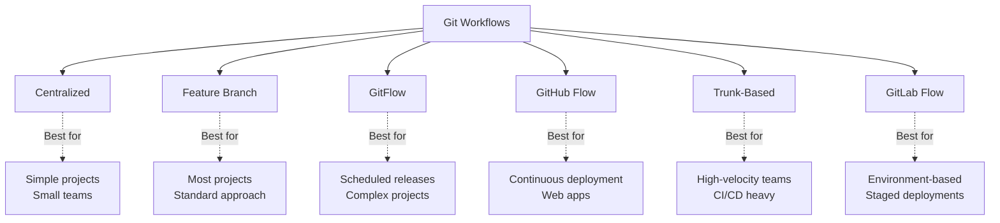
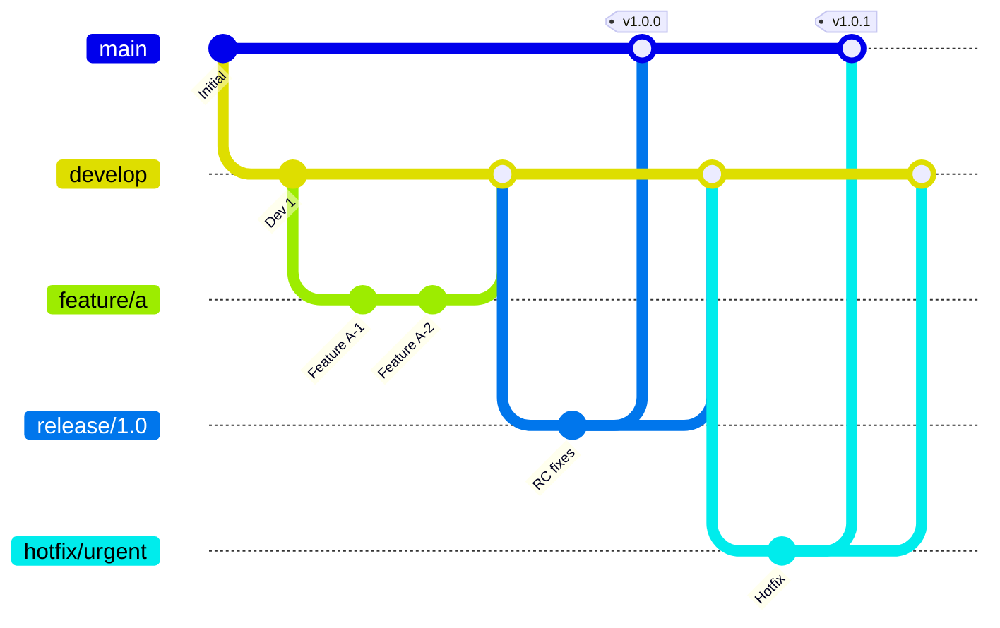
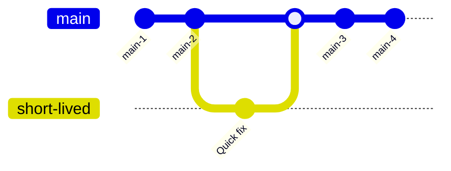

# **Git Workflows & Best Practices – Professional Development Strategies** 🔄✨

Master industry-standard Git workflows including GitFlow, GitHub Flow, trunk-based development, and release management strategies used in DevOps and modern software development.

---

## **Table of Contents** 📑
1. [Git Workflow Overview](#1-git-workflow-overview)
2. [GitFlow Workflow](#2-gitflow-workflow)
3. [GitHub Flow](#3-github-flow)
4. [Trunk-Based Development](#4-trunk-based-development)
5. [GitLab Flow](#5-gitlab-flow)
6. [Release Management](#6-release-management)
7. [Commit Conventions](#7-commit-conventions)
8. [Branch Naming Strategies](#8-branch-naming-strategies)
9. [Workflow Comparison](#9-workflow-comparison)
10. [Practical DevOps Scenarios](#10-practical-devops-scenarios)
11. [Industry Best Practices](#11-industry-best-practices)
12. [Interview Cheat Sheet](#12-interview-cheat-sheet)

---

## **1. Git Workflow Overview** 🌊

### **What is a Git Workflow?**

A **standardized process** for using Git to accomplish work in a consistent and productive manner.

### **Why Use Workflows?**

✅ **Consistency** - Team follows same process  
✅ **Scalability** - Works for small and large teams  
✅ **Quality** - Enforces code review and testing  
✅ **Traceability** - Clear history and documentation  
✅ **Collaboration** - Reduces conflicts and confusion  

### **Workflow Categories:**



---

## **2. GitFlow Workflow** 🌳

### **GitFlow Overview:**

Created by Vincent Driessen, ideal for **scheduled releases**.



### **Branch Structure:**

| Branch | Purpose | Lifetime | Merged to |
|--------|---------|----------|-----------|
| **main** | Production code | Permanent | Never (receives merges) |
| **develop** | Integration branch | Permanent | main (via release) |
| **feature/** | New features | Temporary | develop |
| **release/** | Release preparation | Temporary | main + develop |
| **hotfix/** | Production fixes | Temporary | main + develop |

### **Feature Development:**

```bash
# Start feature
git checkout develop
git pull origin develop
git checkout -b feature/user-authentication

# Work on feature
git add .
git commit -m "feat: Add JWT authentication"

# Keep updated
git fetch origin
git rebase origin/develop

# Finish feature
git checkout develop
git merge --no-ff feature/user-authentication
git push origin develop
git branch -d feature/user-authentication
```

### **Release Process:**

```bash
# Create release branch
git checkout develop
git pull origin develop
git checkout -b release/1.2.0

# Version bumping, bug fixes only
vim package.json  # Update version to 1.2.0
git commit -m "chore: Bump version to 1.2.0"

# Fix last-minute bugs
git commit -m "fix: Minor UI issue"

# Merge to main
git checkout main
git merge --no-ff release/1.2.0
git tag -a v1.2.0 -m "Release 1.2.0"
git push origin main --tags

# Merge back to develop
git checkout develop
git merge --no-ff release/1.2.0
git push origin develop

# Delete release branch
git branch -d release/1.2.0
```

### **Hotfix Process:**

```bash
# Create hotfix from main
git checkout main
git pull origin main
git checkout -b hotfix/critical-bug

# Fix the bug
git commit -m "hotfix: Fix critical security vulnerability"

# Merge to main
git checkout main
git merge --no-ff hotfix/critical-bug
git tag -a v1.2.1 -m "Hotfix 1.2.1"
git push origin main --tags

# Merge to develop
git checkout develop
git merge --no-ff hotfix/critical-bug
git push origin develop

# Delete hotfix branch
git branch -d hotfix/critical-bug
```

### **GitFlow Commands (with git-flow extension):**

```bash
# Install git-flow
# macOS
brew install git-flow

# Linux
apt-get install git-flow

# Initialize
git flow init

# Feature workflow
git flow feature start user-auth
git flow feature finish user-auth

# Release workflow
git flow release start 1.2.0
git flow release finish 1.2.0

# Hotfix workflow
git flow hotfix start critical-bug
git flow hotfix finish critical-bug
```

### **GitFlow Pros & Cons:**

**Pros:**
✅ Clear separation of code states  
✅ Parallel development of features and releases  
✅ Support for multiple production versions  
✅ Well-suited for scheduled releases  

**Cons:**
❌ Complex for beginners  
❌ Long-lived branches can cause merge conflicts  
❌ Not ideal for continuous deployment  
❌ Overkill for simple projects  

---

## **3. GitHub Flow** 🌊

### **GitHub Flow Overview:**

Simplified workflow for **continuous deployment**.

```mermaid
gitGraph
    commit id: "main-1"
    branch feature/a
    checkout feature/a
    commit id: "Work 1"
    commit id: "Work 2"
    checkout main
    merge feature/a id: "PR merged"
    commit id: "Deploy"
    branch feature/b
    checkout feature/b
    commit id: "Work 3"
    checkout main
    merge feature/b id: "PR merged"
    commit id: "Deploy"
```

### **Workflow Steps:**

1. **main branch** is always deployable
2. **Create branch** from main
3. **Commit changes** to branch
4. **Open Pull Request** early
5. **Discuss and review**
6. **Deploy from branch** for final testing
7. **Merge to main** after approval
8. **Deploy to production** immediately

### **Implementation:**

```bash
# 1. Update main
git checkout main
git pull origin main

# 2. Create descriptive branch
git checkout -b feature/add-payments

# 3. Make changes and commit
git add .
git commit -m "feat: Add Stripe integration"
git push -u origin feature/add-payments

# 4. Open Pull Request (on GitHub)
gh pr create --title "Add payment processing" \
  --body "Implements Stripe integration for payments"

# 5. Deploy to staging for testing
# (Via CI/CD or manually)

# 6. After approval, merge PR
gh pr merge --squash

# 7. Delete branch
git checkout main
git pull origin main
git branch -d feature/add-payments

# 8. main is auto-deployed to production
```

### **Pull Request Best Practices:**

```markdown
## PR Template

### Description
Brief overview of changes

### Type of Change
- [ ] Bug fix
- [ ] New feature
- [ ] Breaking change
- [ ] Documentation update

### Testing
- [ ] Unit tests added/updated
- [ ] Integration tests pass
- [ ] Manual testing completed

### Deployment
- [ ] Tested in staging
- [ ] Database migrations included
- [ ] Documentation updated

### Screenshots
[If applicable]
```

### **GitHub Flow Pros & Cons:**

**Pros:**
✅ Simple and easy to understand  
✅ Continuous deployment friendly  
✅ Fast feedback loop  
✅ Minimal overhead  

**Cons:**
❌ Requires robust CI/CD  
❌ Less structure for releases  
❌ Can be chaotic for large teams  
❌ No official release branches  

---

## **4. Trunk-Based Development** 🌲

### **Trunk-Based Development Overview:**

**Direct commits** to main (trunk) with feature flags for incomplete work.



### **Core Principles:**

1. **Short-lived branches** (hours, not days)
2. **Frequent integration** (multiple times per day)
3. **Feature flags** for incomplete features
4. **Comprehensive automated testing**
5. **Fast CI/CD pipeline**

### **Implementation:**

```bash
# Developers commit to main frequently

# Approach 1: Direct commits (for small changes)
git checkout main
git pull origin main
# Make small change
git add .
git commit -m "fix: Update validation logic"
git push origin main

# Approach 2: Very short-lived branches
git checkout -b quick-fix
# Make change
git commit -m "fix: Error handling"
git push origin quick-fix
# Create PR, review in <1 hour, merge immediately
gh pr create --title "Quick fix"
gh pr merge --squash

# Approach 3: Feature flags for larger work
# Code change:
if (featureFlags.newPaymentUI) {
  // New payment UI (work in progress)
} else {
  // Old payment UI (stable)
}

# Commit incomplete work to main
git add .
git commit -m "feat: Add new payment UI (behind feature flag)"
git push origin main
```

### **Feature Flags Example:**

```javascript
// feature-flags.js
const flags = {
  newPaymentUI: process.env.ENABLE_NEW_PAYMENT === 'true',
  experimentalSearch: false,
  betaFeatures: process.env.NODE_ENV === 'development'
};

// app.js
if (flags.newPaymentUI) {
  return <NewPaymentComponent />;
}
return <OldPaymentComponent />;
```

### **Release Strategy:**

```bash
# Create release branch from main
git checkout main
git pull origin main
git checkout -b release/2024-01

# Tag for deployment
git tag -a v2024.01.15 -m "Release 2024-01-15"
git push origin v2024.01.15

# Or release from main directly
git checkout main
git tag -a v1.5.0 -m "Release 1.5.0"
git push origin v1.5.0
```

### **Trunk-Based Pros & Cons:**

**Pros:**
✅ Minimal merge conflicts  
✅ Continuous integration by design  
✅ Fast feedback  
✅ Encourages small changes  
✅ Scalable for large teams (Google, Facebook)  

**Cons:**
❌ Requires discipline  
❌ Needs robust test automation  
❌ Feature flags add complexity  
❌ Difficult without good CI/CD  

---

## **5. GitLab Flow** 🦊

### **GitLab Flow Overview:**

Combines feature branches with **environment branches**.

```mermaid
gitGraph
    commit id: "main-1"
    branch feature/a
    checkout feature/a
    commit id: "Feature work"
    checkout main
    merge feature/a
    branch production
    checkout production
    merge main tag: "v1.0"
    checkout main
    commit id: "main-2"
    branch pre-production
    checkout pre-production
    merge main
    checkout production
    merge pre-production tag: "v1.1"
```

### **Branch Structure:**

| Branch | Purpose | Environment |
|--------|---------|-------------|
| **main** | Development | Development |
| **pre-production** | Staging | Staging |
| **production** | Live code | Production |
| **feature/** | Features | Feature environments |

### **Environment-Based Flow:**

```bash
# Development work
git checkout main
git pull origin main
git checkout -b feature/new-api

# Develop and commit
git commit -m "feat: Add new API endpoint"
git push origin feature/new-api

# Merge to main (via MR)
# Deploys to development environment

# Promote to staging
git checkout pre-production
git merge main
git push origin pre-production
# Deploys to staging environment

# After testing in staging, promote to production
git checkout production
git merge pre-production
git tag -a v1.2.0 -m "Release 1.2.0"
git push origin production --tags
# Deploys to production
```

### **Release-Based Flow:**

```bash
# For software with versions

# Development
git checkout main
git checkout -b feature/improvement
# Work and merge to main

# Create release branch
git checkout -b 2-3-stable main
git push origin 2-3-stable

# Bug fixes go to release branch
git checkout -b fix/bug 2-3-stable
# Fix and merge back to 2-3-stable
# Cherry-pick to main if needed
git checkout main
git cherry-pick fix-commit
```

### **GitLab Flow Pros & Cons:**

**Pros:**
✅ Clear environment promotion path  
✅ Simple and intuitive  
✅ Works with CI/CD  
✅ Supports multiple versions  

**Cons:**
❌ More branches to manage  
❌ Environment branches can drift  
❌ Requires discipline in promotions  

---

## **6. Release Management** 🎯

### **Semantic Versioning:**

```bash
# Format: MAJOR.MINOR.PATCH
# Example: v2.5.3

MAJOR: Breaking changes (2.0.0 → 3.0.0)
MINOR: New features, backward compatible (2.5.0 → 2.6.0)
PATCH: Bug fixes (2.5.3 → 2.5.4)

# Pre-release versions:
v2.6.0-alpha.1    # Early testing
v2.6.0-beta.1     # Feature complete, testing
v2.6.0-rc.1       # Release candidate
```

### **Release Tagging:**

```bash
# Create annotated tag
git tag -a v1.5.0 -m "Release 1.5.0

Features:
- User authentication
- Payment processing
- Email notifications

Bug Fixes:
- Fixed memory leak (#123)
- Resolved login timeout (#456)
"

# Push tag
git push origin v1.5.0

# List tags
git tag -l "v1.*"

# Show tag details
git show v1.5.0
```

### **Release Notes:**

```markdown
# Release v1.5.0

## 🎉 New Features
- **Authentication**: JWT-based user authentication (#123)
- **Payments**: Stripe integration for payments (#124)
- **Notifications**: Email notification system (#125)

## 🐛 Bug Fixes
- Fixed memory leak in cache module (#130)
- Resolved login timeout issue (#131)
- Fixed responsive layout on mobile (#132)

## 🔧 Improvements
- Improved API response time by 40%
- Enhanced error messages
- Updated documentation

## ⚠️ Breaking Changes use
- Removed deprecated `oldAPI()` method
- Changed config file format (see migration guide)

## 📦 Dependencies
- Updated React to 18.2.0
- Updated Express to 4.18.0

## 🙏 Contributors
Thanks to @user1, @user2, @user3
```

### **Automated Release Process:**

```yaml
# .github/workflows/release.yml
name: Release
on:
  push:
    tags:
      - 'v*'

jobs:
  release:
    runs-on: ubuntu-latest
    steps:
      - uses: actions/checkout@v3
      
      - name: Build
        run: npm run build
      
      - name: Run tests
        run: npm test
      
      - name: Create Release
        uses: actions/create-release@v1
        env:
          GITHUB_TOKEN: ${{ secrets.GITHUB_TOKEN }}
        with:
          tag_name: ${{ github.ref }}
          release_name: Release ${{ github.ref }}
          draft: false
          prerelease: false
      
      - name: Deploy to Production
        run: ./deploy.sh
```

---

## **7. Commit Conventions** 📝

### **Conventional Commits:**

```bash
# Format:
<type>(<scope>): <subject>

<body>

<footer>
```

### **Types:**

| Type | Description | Example |
|------|-------------|---------|
| **feat** | New feature | `feat: Add user login` |
| **fix** | Bug fix | `fix: Resolve memory leak` |
| **docs** | Documentation | `docs: Update API docs` |
| **style** | Formatting | `style: Format code` |
| **refactor** | Code restructuring | `refactor: Extract service` |
| **perf** | Performance | `perf: Optimize queries` |
| **test** | Tests | `test: Add unit tests` |
| **build** | Build system | `build: Update webpack` |
| **ci** | CI config | `ci: Add GitHub Actions` |
| **chore** | Maintenance | `chore: Update deps` |
| **revert** | Revert commit | `revert: Revert feat XYZ` |

### **Examples:**

```bash
# Feature
git commit -m "feat(auth): Add JWT authentication

Implement token-based authentication using JWT.
Includes login, logout, and token refresh endpoints.

Closes #123"

# Bug fix
git commit -m "fix(api): Resolve rate limiting issue

Rate limiter was not resetting counter properly.
Changed from in-memory to Redis-based storage.

Fixes #456"

# Breaking change
git commit -m "feat(api)!: Change response format

BREAKING CHANGE: API responses now wrapped in data object.

Before: { id: 1, name: 'John' }
After: { data: { id: 1, name: 'John' } }

Migration guide: docs/migration-v2.md"
```

### **Commit Linting:**

```bash
# Install commitlint
npm install --save-dev @commitlint/cli @commitlint/config-conventional

# .commitlintrc.json
{
  "extends": ["@commitlint/config-conventional"],
  "rules": {
    "type-enum": [2, "always", [
      "feat", "fix", "docs", "style", "refactor",
      "perf", "test", "build", "ci", "chore", "revert"
    ]],
    "subject-case": [2, "always", "sentence-case"],
    "subject-max-length": [2, "always", 72]
  }
}

# .husky/commit-msg
#!/bin/sh
npx --no-install commitlint --edit $1
```

---

## **8. Branch Naming Strategies** 🏷️

### **Standard Naming Conventions:**

```bash
# Pattern: <type>/<ticket-number>-<description>

# Examples:
feature/AUTH-123-user-login
bugfix/PAY-456-payment-timeout
hotfix/SEC-789-security-patch
release/2024-Q1
chore/DEPS-321-update-libraries
```

### **Naming Patterns:**

| Pattern | Example | Use Case |
|---------|---------|----------|
| **feature/** | `feature/user-auth` | New features |
| **bugfix/** | `bugfix/login-error` | Bug fixes |
| **hotfix/** | `hotfix/critical-security` | Urgent fixes |
| **release/** | `release/v2.0.0` | Releases |
| **experiment/** | `experiment/new-ui` | Experiments |
| **docs/** | `docs/api-guide` | Documentation |
| **refactor/** | `refactor/user-service` | Refactoring |
| **test/** | `test/integration-tests` | Testing |

### **Branch Naming Rules:**

```bash
# ✅ GOOD
feature/AUTH-123-jwt-authentication
bugfix/PAY-456-stripe-webhook
hotfix/SEC-789-xss-vulnerability

# ❌ BAD
branch1
fix
johns-branch
test-branch
temp
```

---

## **9. Workflow Comparison** ⚖️

### **Comparison Table:**

| Aspect | GitFlow | GitHub Flow | Trunk-Based | GitLab Flow |
|--------|---------|-------------|-------------|-------------|
| **Complexity** | High | Low | Medium | Medium |
| **Branches** | 5 types | 2 (main + feature) | 1-2 | 3+ |
| **Release** | Scheduled | Continuous | Continuous | Staged |
| **Team Size** | Large | Small-Medium | Any | Medium-Large |
| **Learning Curve** | Steep | Gentle | Moderate | Moderate |
| **CI/CD** | Optional | Required | Required | Required |
| **Conflicts** | More | Moderate | Fewer | Moderate |
| **Best For** | Enterprise | Startups | Google-like | Multi-env |

### **When to Use Each:**

```bash
# ✅ GitFlow
- Scheduled releases (quarterly, bi-weekly)
- Multiple versions in production
- Enterprise software
- Teams with junior developers

# ✅ GitHub Flow
- Web applications
- Continuous deployment
- Startup/small teams
- Simple projects

# ✅ Trunk-Based
- High-velocity teams
- Mature CI/CD pipeline
- Experienced developers
- Microservices

# ✅ GitLab Flow
- Multiple environments (dev/staging/prod)
- Mobile app releases (app stores)
- Enterprise with staged rollouts
- Regulated industries
```

---

## **10. Practical DevOps Scenarios** 🛠️

### **Scenario 1: Choosing Workflow for New Project**

```bash
# Project: E-commerce Web App
# Team: 5 developers
# Deployment: Continuous to AWS

# Decision: GitHub Flow

# Reasoning:
✓ Web app with continuous deployment
✓ Small team, need simplicity
✓ Fast iteration required
✓ Single production environment

# Implementation:
git checkout -b main
git push -u origin main

# Set branch protection
# GitHub Settings → Branches → Add rule
# - Require pull request reviews (2 approvers)
# - Require status checks (tests, linting)
# - Enforce linear history (squash merges)

# Team workflow:
# 1. Create feature branch
# 2. Push and create PR early (draft)
# 3. Deploy to staging for testing
# 4. Request reviews
# 5. Merge when approved
# 6. Auto-deploy to production
```

### **Scenario 2: Enterprise Release Management**

```bash
# Project: Banking Software
# Team: 50 developers
# Deployment: Quarterly releases with hotfixes

# Decision: GitFlow

# Implementation:
git flow init

# Feature development (50 developers)
# Team 1
git flow feature start accounts-module
# Team 2
git flow feature start transactions-module
# Team 3
git flow feature start reports-module

# All features developed in parallel

# 2 weeks before release
git flow release start Q1-2024

# Bug fixes on release branch only
git checkout release/Q1-2024
# Fix bugs
git commit -m "fix: Resolve issue in reports"

# Release day
git flow release finish Q1-2024
# Merged to main and develop
# Tagged as v2024.Q1
# Deployed to production

# Hotfix if needed
git flow hotfix start critical-security
# Fix and deploy immediately
git flow hotfix finish critical-security
```

### **Scenario 3: Mobile App with App Store Releases**

```bash
# Project: iOS/Android App
# Deployment: App stores (approval required)

# Decision: GitLab Flow (Release-based)

# Development
git checkout main
git checkout -b feature/new-payment
# Develop and merge to main

# When ready for release
git checkout -b 2-1-stable main
git push origin 2-1-stable

# Submit to App Store
# Tag for submission
git tag -a ios/v2.1.0 -m "iOS version 2.1.0"
git push origin ios/v2.1.0

# While waiting for approval, continue on main
git checkout main
git checkout -b feature/improvements
# Continue development

# Bug found in 2.1 during review
git checkout 2-1-stable
git checkout -b fix/app-store-bug
# Fix and merge to 2-1-stable
git checkout 2-1-stable
git merge fix/app-store-bug

# Tag new version
git tag -a ios/v2.1.1 -m "iOS version 2.1.1"
git push origin ios/v2.1.1

# Cherry-pick fix to main
git checkout main
git cherry-pick fix-commit-sha
```

---

## **11. Industry Best Practices** 🏆

### **Workflow Selection:**

✅ **Consider Team Experience**
```bash
# Junior team → GitHub Flow (simple)
# Mixed experience → GitLab Flow (structured)
# Senior team → Trunk-Based (discipline required)
# Enterprise → GitFlow (robust)
```

✅ **Match Deployment Strategy**
```bash
# Continuous deployment → GitHub Flow or Trunk-Based
# Scheduled releases → GitFlow
# Multi-environment → GitLab Flow
# Mobile apps → Release-based GitLab Flow
```

✅ **Scale with Automation**
```bash
# All workflows require:
✓ Automated testing
✓ CI/CD pipeline
✓ Code review process
✓ Branch protection rules
✓ Monitoring and rollback
```

### **Commit Best Practices:**

✅ **Atomic Commits**
```bash
# One logical change per commit
# ✅ GOOD
git commit -m "feat: Add user model"
git commit -m "feat: Add user repository"
git commit -m "feat: Add user service"

# ❌ BAD
git commit -m "Add user functionality"  # 50 files changed
```

✅ **Write Good Commit Messages**
```bash
# ✅ GOOD
feat(auth): Implement JWT authentication

Add token generation on login and validation middleware.
Tokens expire after 24 hours with automatic refresh.

Closes #123
See: docs/authentication.md

# ❌ BAD
fix stuff
WIP
update
changes
```

### **Branch Protection:**

```bash
# GitHub/GitLab Settings:
✅ Require pull request reviews (1-2 approvers)
✅ Require status checks to pass
✅ Require branches to be up to date
✅ Require linear history (squash/rebase)
✅ Include administrators in restrictions
✅ Restrict force pushes
✅ Restrict deletions
```

---

## **12. Interview Cheat Sheet** 🎯

### **Common Questions:**

**Q1: Explain GitFlow**
- 5 branch types: main, develop, feature, release, hotfix
- main = production, develop = integration
- Features merged to develop
- Releases merge to main and develop
- Hotfixes applied to both main and develop

**Q2: GitHub Flow vs GitFlow?**
```bash
GitHub Flow:
- Simple, 2 branch types
- Continuous deployment
- Best for web apps

GitFlow:
- Complex, 5 branch types
- Scheduled releases
- Best for enterprise
```

**Q3: What is Trunk-Based Development?**
- Short-lived branches (<24 hours)
- Frequent commits to main
- Feature flags for incomplete work
- Requires strong CI/CD
- Used by Google, Facebook

**Q4: How to handle hotfixes?**
```bash
# GitFlow: Create hotfix branch from main
git checkout -b hotfix/urgent main
# Fix, merge to main and develop

# GitHub Flow: Create branch from main
git checkout -b fix-urgent main
# Fix, create PR, merge to main

# Trunk-Based: Commit directly or very short branch
git checkout main
# Fix and commit
git push origin main
```

**Q5: What are Conventional Commits?**
```bash
Format: <type>(<scope>): <subject>

Types: feat, fix, docs, style, refactor, test, chore

Example:
feat(auth): Add user login
fix(api): Resolve memory leak
```

**Q6: Branch naming conventions?**
```bash
feature/description
bugfix/description
hotfix/description
release/version
docs/description
test/description
```

**Q7: When to use which workflow?**
```bash
Startup, continuous deployment → GitHub Flow
Enterprise, scheduled releases → GitFlow
High-velocity, experienced team → Trunk-Based
Multi-environment, staged deploy → GitLab Flow
```

**Q8: What is Semantic Versioning?**
```bash
MAJOR.MINOR.PATCH
1.2.3

MAJOR: Breaking changes
MINOR: New features (compatible)
PATCH: Bug fixes
```

**Q9: How to manage multiple releases?**
```bash
# Maintain release branches
git checkout -b release/1.x
git checkout -b release/2.x

# Apply fixes to appropriate versions
# Cherry-pick or backport as needed
```

**Q10: Best practices for commits?**
```bash
✓ Atomic commits (one logical change)
✓ Descriptive messages
✓ Reference issues/tickets
✓ Test before committing
✓ Keep commits small
✓ Use conventional commits format
```

---

## **Next Steps** 📚

Complete your Git mastery with:

- **[Git Troubleshooting](Git_Troubleshooting.md)** - Common issues and solutions
- **[Git Commands Cheatsheet](Git_Commands_Cheatsheet.md)** - Quick reference guide
- **[Git Fundamentals](Git_Fundamentals.md)** - Deep dive into Git internals

---

**🔄 Master workflows to build world-class software delivery processes!**
