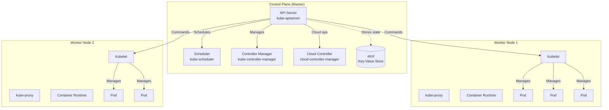
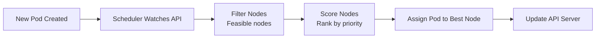
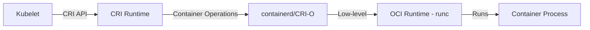

# **Kubernetes Fundamentals** ☸️

**Complete guide to Kubernetes architecture, core concepts, and essential foundations**

---

## **Table of Contents** 📑
1. [Introduction to Kubernetes](#1-introduction-to-kubernetes)
2. [Kubernetes Architecture](#2-kubernetes-architecture)
3. [Control Plane Components](#3-control-plane-components)
4. [Worker Node Components](#4-worker-node-components)
5. [Container Runtime Interface (CRI)](#5-container-runtime-interface-cri)
6. [etcd - The Cluster Database](#6-etcd---the-cluster-database)
7. [Kubernetes Objects & API](#7-kubernetes-objects--api)
8. [Cluster Setup Options](#8-cluster-setup-options)
9. [DevOps Use Cases](#9-devops-use-cases)
10. [Troubleshooting](#10-troubleshooting)
11. [Best Practices](#11-best-practices)
12. [Interview Cheat Sheet](#12-interview-cheat-sheet)

---

## **1. Introduction to Kubernetes** 🚀

### **What is Kubernetes?**

Kubernetes (K8s) is an open-source container orchestration platform that automates the deployment, scaling, and management of containerized applications. Originally developed by Google and now maintained by the Cloud Native Computing Foundation (CNCF).

**The name "Kubernetes"** comes from the Greek word meaning "helmsman" or "pilot." The abbreviation K8s represents the 8 letters between "K" and "s."

### **Why Kubernetes?**

```
Traditional Deployment → Virtualized Deployment → Container Deployment → Kubernetes

Problems Kubernetes Solves:
✅ Manual container management at scale
✅ Service discovery and load balancing
✅ Automatic rollouts and rollbacks
✅ Self-healing (auto-restart, auto-replacement)
✅ Configuration and secret management
✅ Resource optimization
✅ Storage orchestration
```

### **Key Capabilities**

| Capability | Description |
|------------|-------------|
| **Service Discovery & Load Balancing** | Automatically distributes network traffic |
| **Storage Orchestration** | Automatically mount storage systems (local, cloud, network) |
| **Automated Rollouts & Rollbacks** | Gradual deployment changes with automatic rollback on failure |
| **Automatic Bin Packing** | Optimal resource allocation based on CPU/memory requirements |
| **Self-Healing** | Restarts failed containers, replaces nodes, kills unhealthy containers |
| **Secret & Configuration Management** | Deploy and update secrets and config without rebuilding images |
| **Horizontal Scaling** | Scale applications up/down automatically or manually |
| **Batch Execution** | Manage batch and CI workloads |

---

## **2. Kubernetes Architecture** 🏛️

### **High-Level Architecture**



### **Architecture Components**

**Control Plane (Master Node)**
- Brain of the Kubernetes cluster
- Makes global decisions about the cluster
- Detects and responds to cluster events

**Worker Nodes**
- Run containerized applications
- Managed by the control plane
- Can be physical or virtual machines

**Pods**
- Smallest deployable units
- Contain one or more containers
- Share network and storage

### **Communication Flow**

```
User → kubectl → API Server → etcd (store state)
                  ↓
            Scheduler (assign to node)
                  ↓
            Kubelet (on worker node)
                  ↓
            Container Runtime
                  ↓
            Pod (application running)
```

---

## **3. Control Plane Components** 🎛️

### **3.1 API Server (kube-apiserver)**

**Purpose**: Frontend for the Kubernetes control plane. All communication goes through the API server.

```bash
# The API server exposes HTTP API
# Default port: 6443

# Components that interact with API Server:
- kubectl (CLI tool)
- kubelet (node agent)
- Scheduler
- Controller Manager
- Custom controllers
```

**Key Responsibilities**:
- Validates and processes REST operations
- Updates etcd with cluster state
- Handles authentication and authorization
- Admission control

**Example API Call**:
```bash
# Get cluster info via API
kubectl cluster-info

# Direct API call (with authentication)
curl -k https://localhost:6443/api/v1/namespaces/default/pods \
  --header "Authorization: Bearer $TOKEN"
```

### **3.2 Scheduler (kube-scheduler)**

**Purpose**: Assigns newly created Pods to nodes based on resource availability and constraints.

**Scheduling Process**:


**Scheduling Factors**:
- Resource requirements (CPU, memory)
- Node affinity/anti-affinity
- Pod affinity/anti-affinity
- Taints and tolerations
- Data locality
- Custom scheduling policies

**Example: Pod with Resource Requests**
```yaml
apiVersion: v1
kind: Pod
metadata:
  name: resource-demo
spec:
  containers:
  - name: app
    image: nginx
    resources:
      requests:
        memory: "64Mi"
        cpu: "250m"
      limits:
        memory: "128Mi"
        cpu: "500m"
```

### **3.3 Controller Manager (kube-controller-manager)**

**Purpose**: Runs controller processes that regulate the state of the cluster.

**Built-in Controllers**:

| Controller | Purpose |
|------------|---------|
| **Node Controller** | Monitors node health and responds to node failures |
| **Replication Controller** | Maintains correct number of pods |
| **Endpoints Controller** | Populates Endpoints object (joins Services & Pods) |
| **Service Account Controller** | Creates default ServiceAccounts for namespaces |
| **Namespace Controller** | Manages namespace lifecycle |
| **Job Controller** | Manages one-off tasks |
| **CronJob Controller** | Manages scheduled tasks |
| **Deployment Controller** | Manages Deployments and ReplicaSets |

**Control Loop Pattern**:
```
Watch desired state → Observe current state → Make changes to match desired state → Repeat
```

**Example: Deployment Controller in Action**
```yaml
apiVersion: apps/v1
kind: Deployment
metadata:
  name: nginx-deployment
spec:
  replicas: 3  # Desired state
  selector:
    matchLabels:
      app: nginx
  template:
    metadata:
      labels:
        app: nginx
    spec:
      containers:
      - name: nginx
        image: nginx:1.21
```

```
Deployment Controller monitors:
- Desired replicas: 3
- Current replicas: 3
- If current < desired → Create pods
- If current > desired → Delete pods
- If pod fails → Replace pod
```

### **3.4 Cloud Controller Manager**

**Purpose**: Integrates with cloud provider APIs (AWS, Azure, GCP, etc.).

**Cloud-Specific Controllers**:
- **Node Controller**: Check if cloud node is deleted
- **Route Controller**: Set up routes in cloud infrastructure
- **Service Controller**: Create/manage cloud load balancers
- **Volume Controller**: Create/attach/mount cloud volumes

---

## **4. Worker Node Components** 💼

### **4.1 Kubelet**

**Purpose**: Agent that runs on each worker node and ensures containers are running in Pods.

**Key Responsibilities**:
- Registers node with API server
- Watches API server for Pod assignments
- Runs containers via Container Runtime Interface
- Reports Pod and node status to API server
- Runs liveness and readiness probes
- Mounts volumes

**Kubelet Configuration**:
```bash
# View kubelet status
systemctl status kubelet

# Check kubelet logs
journalctl -u kubelet -f

# Kubelet configuration file
/var/lib/kubelet/config.yaml
```

**Pod Lifecycle Managed by Kubelet**:
```
Pending → Creating → Running → Terminating → Succeeded/Failed
```

### **4.2 kube-proxy**

**Purpose**: Network proxy that runs on each node, implementing Kubernetes Service networking.

**Responsibilities**:
- Maintains network rules on nodes
- Implements Service abstraction
- Forwards requests to correct Pods
- Supports load balancing

**kube-proxy Modes**:

| Mode | Description | Performance |
|------|-------------|-------------|
| **iptables** | Default mode, uses iptables rules | Good for small-medium clusters |
| **IPVS** | IP Virtual Server, uses Linux IPVS | Better for large clusters (10,000+ services) |
| **userspace** | Legacy mode (deprecated) | Slower, not recommended |

**Example: Service LoadBalancing**
```yaml
apiVersion: v1
kind: Service
metadata:
  name: my-service
spec:
  selector:
    app: nginx
  ports:
  - protocol: TCP
    port: 80
    targetPort: 8080
  type: ClusterIP
```

```
kube-proxy creates iptables rules:
Client → Service IP (10.96.0.1:80) → Round-robin to Pod IPs
                                    → 10.244.1.10:8080
                                    → 10.244.1.11:8080
                                    → 10.244.2.10:8080
```

### **4.3 Container Runtime**

**Purpose**: Software responsible for running containers.

**Supported Runtimes**:
- **containerd** (default since K8s 1.20+)
- **CRI-O**
- **Docker** (via cri-dockerd shim post-1.24)

---

## **5. Container Runtime Interface (CRI)** 📦

### **CRI Architecture**



### **CRI Components**

**Image Service**:
- Pull images
- List images
- Remove images
- Image status

**Runtime Service**:
- Create/Start/Stop containers
- Remove containers
- List containers
- Container stats
- Execute commands in containers

### **Popular CRI Runtimes**

**containerd**:
```bash
# Check containerd status
systemctl status containerd

# List containers
ctr containers list

# Pull image
ctr images pull docker.io/library/nginx:latest
```

**CRI-O**:
```bash
# Check CRI-O status
systemctl status crio

# List containers
crictl ps

# List images
crictl images
```

---

## **6. etcd - The Cluster Database** 💾

### **What is etcd?**

etcd is a distributed, consistent key-value store used as Kubernetes' backing store for all cluster data.

**Characteristics**:
- Strongly consistent (uses Raft consensus algorithm)
- Highly available
- Distributed
- Secure (supports TLS)

### **What Kubernetes Stores in etcd**

```
/registry/
├── pods/
│   ├── default/pod1
│   └── kube-system/pod2
├── services/
│   └── default/my-service
├── deployments/
├── configmaps/
├── secrets/
├── nodes/
└── ...all Kubernetes resources
```

### **etcd Operations**

```bash
# Backup etcd
ETCDCTL_API=3 etcdctl snapshot save /backup/etcd-snapshot.db \
  --endpoints=https://127.0.0.1:2379 \
  --cacert=/etc/kubernetes/pki/etcd/ca.crt \
  --cert=/etc/kubernetes/pki/etcd/server.crt \
  --key=/etc/kubernetes/pki/etcd/server.key

# Restore etcd
ETCDCTL_API=3 etcdctl snapshot restore /backup/etcd-snapshot.db \
  --data-dir=/var/lib/etcd-backup

# Check etcd health
ETCDCTL_API=3 etcdctl endpoint health \
  --endpoints=https://127.0.0.1:2379 \
  --cacert=/etc/kubernetes/pki/etcd/ca.crt \
  --cert=/etc/kubernetes/pki/etcd/server.crt \
  --key=/etc/kubernetes/pki/etcd/server.key
```

### **etcd Best Practices**

✅ **Do**:
- Regular backups (automated)
- Use TLS for communication
- Monitor etcd metrics
- Use separate etcd cluster for production
- Use SSD storage for etcd

❌ **Don't**:
- Store large objects in etcd (>1.5MB)
- Run etcd on underpowered hardware
- Skip regular backups
- Expose etcd without authentication

---

## **7. Kubernetes Objects & API** 🔧

### **Kubernetes Objects**

Kubernetes objects are persistent entities that represent the state of your cluster.

**Object Spec and Status**:
- **Spec**: Desired state (defined by you)
- **Status**: Current state (observed by Kubernetes)

```yaml
apiVersion: v1
kind: Pod
metadata:
  name: nginx-pod
  labels:
    app: nginx
    tier: frontend
  annotations:
    description: "Example nginx pod"
spec:  # Desired state
  containers:
  - name: nginx
    image: nginx:1.21
    ports:
    - containerPort: 80
status:  # Current state (auto-populated by K8s)
  phase: Running
  conditions:
  - type: Ready
    status: "True"
```

### **Kubernetes API Structure**

```
https://<api-server>:6443/
├── api/v1/                    # Core API group
│   ├── namespaces/
│   ├── pods/
│   ├── services/
│   └── configmaps/
├── apis/apps/v1/              # apps API group
│   ├── deployments/
│   ├── statefulsets/
│   └── daemonsets/
├── apis/batch/v1/             # batch API group
│   ├── jobs/
│   └── cronjobs/
└── apis/networking.k8s.io/v1/
    ├── ingresses/
    └── networkpolicies/
```

### **API Versioning**

| Version | Stability | Usage |
|---------|-----------|-------|
| **alpha** (v1alpha1) | Experimental, may be dropped | Not for production |
| **beta** (v1beta1) | Tested, but may change | Use with caution |
| **stable** (v1) | Production-ready, stable | Recommended |

---

## **8. Cluster Setup Options** 🛠️

### **8.1 Local Development**

**Minikube**:
```bash
# Install minikube
curl -LO https://storage.googleapis.com/minikube/releases/latest/minikube-darwin-amd64
sudo install minikube-darwin-amd64 /usr/local/bin/minikube

# Start cluster
minikube start --cpus=4 --memory=8192 --driver=docker

# Check status
minikube status

# Access dashboard
minikube dashboard
```

**kind (Kubernetes in Docker)**:
```bash
# Install kind
brew install kind

# Create cluster
kind create cluster --name dev-cluster

# Create multi-node cluster
cat <<EOF | kind create cluster --config=-
kind: Cluster
apiVersion: kind.x-k8s.io/v1alpha4
nodes:
- role: control-plane
- role: worker
- role: worker
EOF

# Delete cluster
kind delete cluster --name dev-cluster
```

**Docker Desktop**:
```bash
# Enable Kubernetes in Docker Desktop settings
# Preferences → Kubernetes → Enable Kubernetes
```

### **8.2 Production Clusters**

**kubeadm (Self-Managed)**:
```bash
# Initialize control plane
sudo kubeadm init --pod-network-cidr=10.244.0.0/16

# Join worker nodes
sudo kubeadm join <control-plane-ip>:6443 --token <token> \
  --discovery-token-ca-cert-hash sha256:<hash>

# Install CNI (Calico example)
kubectl apply -f https://docs.projectcalico.org/manifests/calico.yaml
```

**Managed Kubernetes**:

| Provider | Service | Features |
|----------|---------|----------|
| **AWS** | EKS (Elastic Kubernetes Service) | Managed control plane, integrates with AWS services |
| **GCP** | GKE (Google Kubernetes Engine) | Auto-upgrades, auto-repair, regional clusters |
| **Azure** | AKS (Azure Kubernetes Service) | Integrated monitoring, auto-scaling |
| **DigitalOcean** | DOKS | Simple setup, flat pricing |

### **8.3 Comparison**

| Setup | Best For | Pros | Cons |
|-------|----------|------|------|
| **Minikube** | Local development | Easy setup, multiple drivers | Single node only |
| **kind** | CI/CD, testing | Fast, multi-node support | Local only |
| **kubeadm** | Learning, custom setups | Full control, production-capable | Manual management |
| **Managed K8s** | Production | Managed upgrades, HA | Vendor lock-in, cost |

---

## **9. DevOps Use Cases** 🚀

### **Microservices Deployment**

```yaml
# Frontend deployment
apiVersion: apps/v1
kind: Deployment
metadata:
  name: frontend
spec:
  replicas: 3
  selector:
    matchLabels:
      app: frontend
  template:
    metadata:
      labels:
        app: frontend
    spec:
      containers:
      - name: react-app
        image: company/frontend:v1.0
        ports:
        - containerPort: 3000
---
# Backend API deployment
apiVersion: apps/v1
kind: Deployment
metadata:
  name: backend-api
spec:
  replicas: 5
  selector:
    matchLabels:
      app: backend-api
  template:
    metadata:
      labels:
        app: backend-api
    spec:
      containers:
      - name: api
        image: company/api:v2.5
        ports:
        - containerPort: 8080
        env:
        - name: DATABASE_URL
          valueFrom:
            secretKeyRef:
              name: db-credentials
              key: url
---
# Database (StatefulSet for persistence)
apiVersion: apps/v1
kind: StatefulSet
metadata:
  name: postgres
spec:
  serviceName: postgres
  replicas: 1
  selector:
    matchLabels:
      app: postgres
  template:
    metadata:
      labels:
        app: postgres
    spec:
      containers:
      - name: postgres
        image: postgres:14
        volumeMounts:
        - name: postgres-storage
          mountPath: /var/lib/postgresql/data
  volumeClaimTemplates:
  - metadata:
      name: postgres-storage
    spec:
      accessModes: [ "ReadWriteOnce" ]
      resources:
        requests:
          storage: 20Gi
```

### **Blue-Green Deployment**

```bash
# Deploy green version
kubectl apply -f deployment-green.yaml

# Test green version
kubectl port-forward deployment/app-green 8080:80

# Switch traffic to green
kubectl patch service app-service -p '{"spec":{"selector":{"version":"green"}}}'

# Rollback if needed
kubectl patch service app-service -p '{"spec":{"selector":{"version":"blue"}}}'
```

---

## **10. Troubleshooting** 🔧

### **Cluster Issues**

```bash
# Check cluster health
kubectl get nodes
kubectl get componentstatuses

# Check control plane pods
kubectl get pods -n kube-system

# View API server logs
kubectl logs -n kube-system kube-apiserver-<node>

# Check etcd health
kubectl exec -n kube-system etcd-<node> -- etcdctl endpoint health
```

### **Node Issues**

```bash
# Describe node
kubectl describe node <node-name>

# Check node conditions
kubectl get nodes -o jsonpath='{range .items[*]}{.metadata.name}{"\t"}{.status.conditions[?(@.type=="Ready")].status}{"\n"}{end}'

# Drain node for maintenance
kubectl drain <node-name> --ignore-daemonsets --delete-emptydir-data

# Uncordon node
kubectl uncordon <node-name>
```

---

## **11. Best Practices** ⭐

### **Architecture Best Practices**

```
✅ Use namespaces for multi-tenancy
✅ Run multiple replicas for high availability
✅ Set resource requests and limits
✅ Use liveness and readiness probes
✅ Implement proper monitoring and logging
✅ Regular etcd backups
✅ Keep Kubernetes updated
✅ Use RBAC for access control
✅ Network policies for security
✅ Use Secrets for sensitive data

❌ Don't run single replica in production
❌ Don't skip resource limits (can cause OOM)
❌ Don't use latest tag for images
❌ Don't expose etcd publicly
❌ Don't ignore security updates
❌ Don't run as root in containers
```

---

## **12. Interview Cheat Sheet** 🎯

### **Q1: Explain Kubernetes architecture?**
```
Kubernetes has two main components:

1. Control Plane (Master):
   - API Server: Front-end, handles all requests
   - Scheduler: Assigns pods to nodes
   - Controller Manager: Runs controller processes
   - etcd: Stores all cluster data
   - Cloud Controller: Integrates with cloud providers

2. Worker Nodes:
   - Kubelet: Node agent, manages pods
   - kube-proxy: Network proxy, implements Services
   - Container Runtime: Runs containers (containerd/CRI-O)

Communication flows through API server which is the only component that talks to etcd.
```

### **Q2: What is the difference between Docker and Kubernetes?**
```
Docker:
- Container runtime
- Builds and runs containers
- Single-host solution
- docker-compose for multi-container

Kubernetes:
- Container orchestration platform
- Manages containers across multiple hosts
- Auto-scaling, self-healing, load balancing
- Production-grade orchestration

Relationship: Kubernetes uses Docker/containerd as container runtime.
```

### **Q3: How does Kubernetes ensure high availability?**
```
1. Multiple Replicas:
   - Deployments maintain desired replica count
   - Pods distributed across nodes

2. Self-Healing:
   - Restarts failed containers
   - Replaces unresponsive pods
   - Reschedules pods if node fails

3. Load Balancing:
   - Services distribute traffic across pods
   - Multiple endpoints for redundancy

4. Control Plane HA:
   - Multiple API servers
   - etcd cluster (3 or 5 nodes)
   - Multiple schedulers (leader election)
```

### **Q4: What is etcd and why is it important?**
```
etcd is a distributed key-value store that:
- Stores entire cluster state
- Configuration data for all resources
- Uses Raft consensus (strongly consistent)
- Single source of truth

Critical because:
- Without etcd, cluster has no state
- All K8s operations depend on etcd
- Backup etcd = backup entire cluster

Best practices:
- Regular backups (daily minimum)
- Use SSD storage
- Dedicated etcd cluster for large deployments
- Encrypt etcd data at rest
```

### **Q5: Explain the Pod lifecycle?**
```
Pod Phases:
1. Pending: Accepted but not yet running
   - Waiting for scheduling
   - Pulling images
   
2. Running: Bound to node, at least one container running
   
3. Succeeded: All containers terminated successfully
   (For Jobs/CronJobs)
   
4. Failed: All containers terminated, at least one failed
   
5. Unknown: Communication error with node

Container States within Pod:
- Waiting: Pulling image, waiting for dependencies
- Running: Executing without issues
- Terminated: Completed or failed execution

Probes during lifecycle:
- Liveness: Is container alive? (restart if fails)
- Readiness: Can container accept traffic?
- Startup: Has container started? (for slow-starting apps)
```

---

**Related Guides**:
- [Kubernetes Commands Cheatsheet](Kubernetes_Commands_Cheatsheet.md)
- [Kubernetes Pods & Deployments](Kubernetes_Pods_Deployments.md)
- [Kubernetes Services & Networking](Kubernetes_Services_Networking.md)
- [Docker Fundamentals](../Docker/Docker_Fundamentals.md)

---

**☸️ Master Kubernetes Fundamentals for Production-Ready Container Orchestration!**

*Understanding the architecture is the foundation of Kubernetes mastery.*
